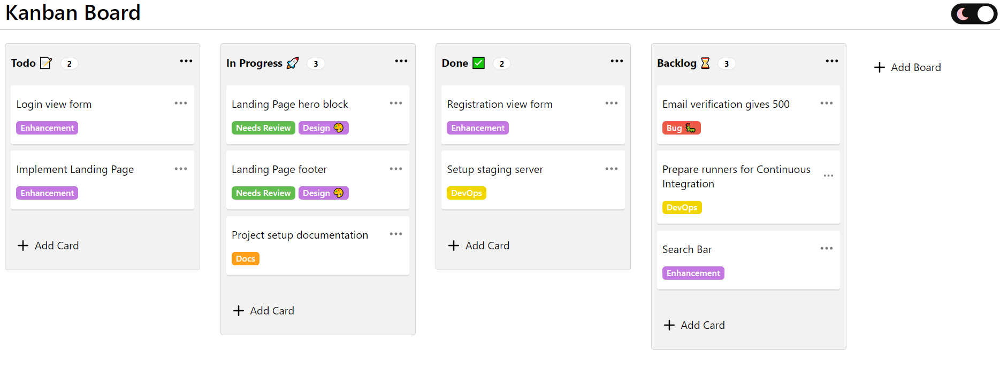
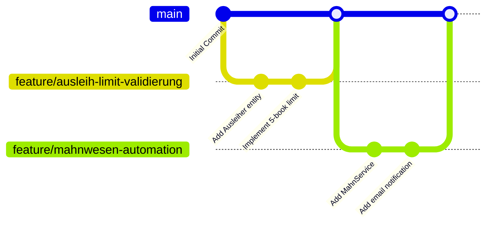
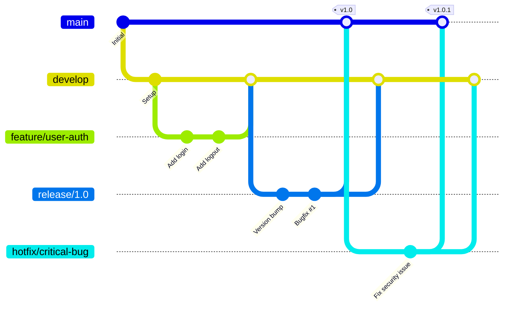
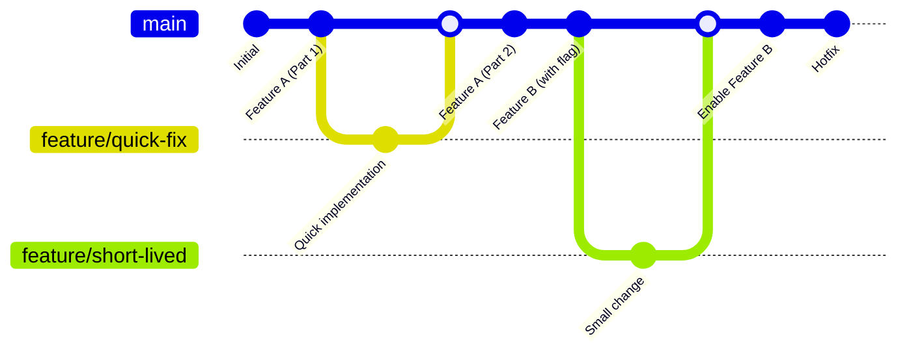
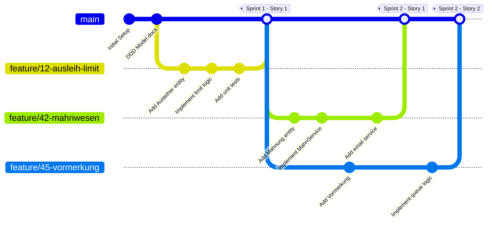
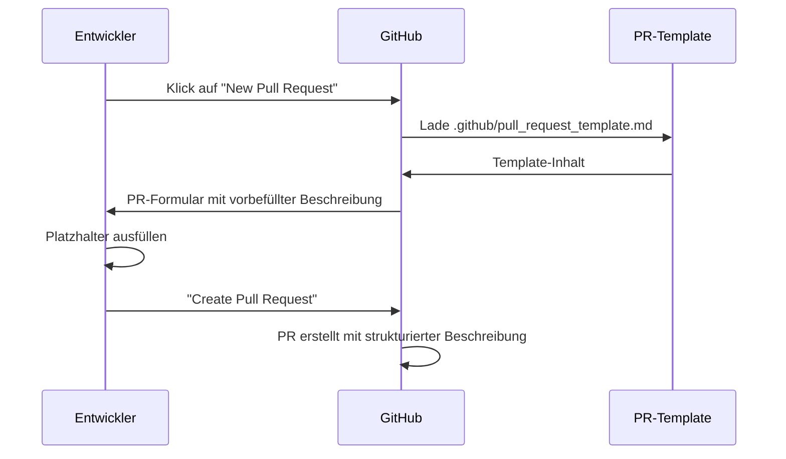
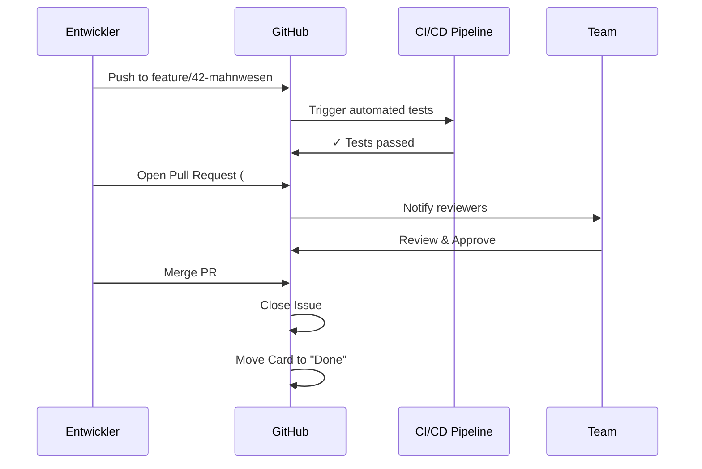
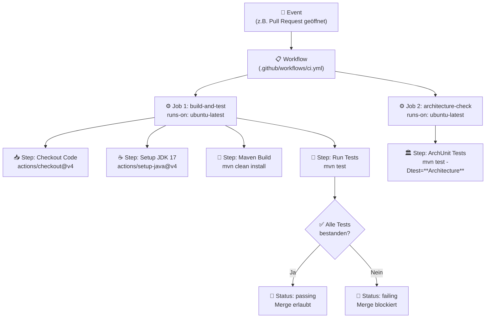
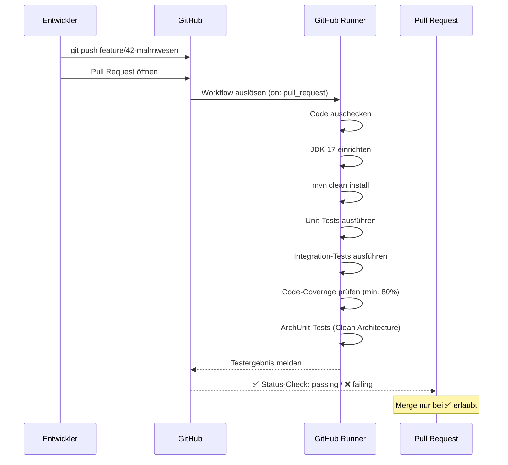
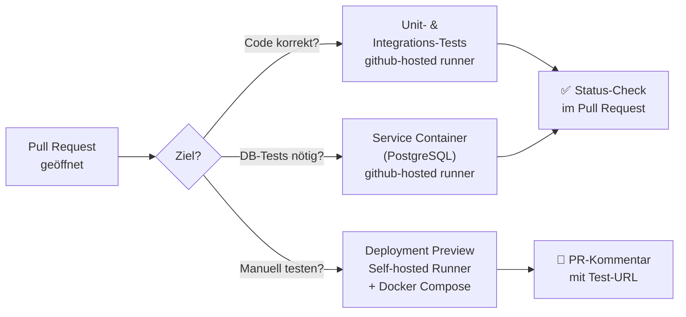

<h1>Entwicklungstools: Github im agilen Projektmanagement</h1>

<h2>Inhaltsverzeichnis</h2>

- [7 GitHub im agilen Projekt — Setup und Workflow mit Scrumban](#7-github-im-agilen-projekt--setup-und-workflow-mit-scrumban)
  - [7.1 Projektstart und Setup](#71-projektstart-und-setup)
    - [7.1.1 Repository-Erstellung und Struktur](#711-repository-erstellung-und-struktur)
  - [7.2 Nutzung von Projects, Milestones, Issues und Pull requests in GitHub](#72-nutzung-von-projects-milestones-issues-und-pull-requests-in-github)
    - [7.2.1 Was ist das GitHub Project Board?](#721-was-ist-das-github-project-board)
    - [7.2.2 Automatisierung der Workflows für das Projectboard](#722-automatisierung-der-workflows-für-das-projectboard)
    - [7.2.3 GitHub `Issues` als zentrale ToDos](#723-github-issues-als-zentrale-todos)
    - [7.2.4 Issue-Templates definieren](#724-issue-templates-definieren)
    - [7.2.5 Milestones und Release-Planung](#725-milestones-und-release-planung)
    - [7.2.6 Verwalten der Template-Konfiguration und Verwendung der Templates](#726-verwalten-der-template-konfiguration-und-verwendung-der-templates)
    - [7.2.7 Branching-Strategie festlegen](#727-branching-strategie-festlegen)
    - [7.2.8 Zusammenarbeit: Pull Requests und Code Reviews](#728-zusammenarbeit-pull-requests-und-code-reviews)
  - [7.3 GitHub Workflows im CI/CD-Kontext](#73-github-workflows-im-cicd-kontext)
    - [7.3.1 Anatomie eines GitHub Actions Workflows](#731-anatomie-eines-github-actions-workflows)
    - [7.3.2 CI-Workflow bei Pull Requests: Automatische Testausführung](#732-ci-workflow-bei-pull-requests-automatische-testausführung)
    - [7.3.3 GitHub-hosted Runner vs. Self-hosted Runner](#733-github-hosted-runner-vs-self-hosted-runner)
    - [7.3.4 Self-hosted Runner lokal einrichten](#734-self-hosted-runner-lokal-einrichten)
    - [7.3.5 Test-Instanzen und Deployment-Previews mit GitHub Actions](#735-test-instanzen-und-deployment-previews-mit-github-actions)


<div style="page-break-after: always;"></div>


# 7 GitHub im agilen Projekt — Setup und Workflow mit Scrumban

In modernen Softwareentwicklungsprojekten wie unserem Schulbibliotheks-System stehen Agilität, kontinuierliche Integration und kollaboratives Arbeiten im Mittelpunkt. GitHub bietet mit seinen Funktionen wie Repositories, Branching, Issues, Pull Requests, Projects (Boards) und Automatisierungen ein integriertes Ökosystem, das agile Methoden wirkungsvoll unterstützen kann. Dieses Kapitel zeigt, wie GitHub bei einem agilen oder hybriden Vorgehen wie Scrumban eingerichtet und praktisch eingesetzt werden kann — von Projektstart über den täglichen Workflow bis zur kontinuierlichen Lieferung und Qualitätssicherung.

> <span style="font-size: 1.5em">:bulb:</span> **Merksatz:** GitHub ist mehr als nur ein Versionskontrollsystem – es ist eine integrierte Plattform für agile Zusammenarbeit, die Issues, Boards, Code Reviews, Automatisierung und Dokumentation unter einem Dach vereint.

## 7.1 Projektstart und Setup

Bevor wir mit der Entwicklung des Schulbibliotheks-Systems beginnen, müssen wir die Grundlagen für eine effiziente Zusammenarbeit schaffen. Der Projektstart auf GitHub umfasst mehrere wichtige Schritte, die wir im Folgenden detailliert betrachten.

### 7.1.1 Repository-Erstellung und Struktur

Zu Projektbeginn legen wir auf GitHub ein neues Repository für unser Schulbibliotheks-System an. Die Wahl einer durchdachten Ordnerstruktur ist entscheidend für die langfristige Wartbarkeit des Projekts.

**Beispiel Schulbibliothek:**
Für unser Projekt mit Clean Architecture könnten wir folgende Verzeichnisstruktur wählen:

```
schulbibliothek/
├── docs/                           # Dokumentation
│   ├── architecture/               # Architekturdiagramme und -beschreibungen
│   ├── api/                        # API-Spezifikationen (OpenAPI/Swagger), AsyncAPI
│   └── user-stories/               # User Stories und Anforderungen
├── src/
│   ├── main/
│   │   ├── java/
│   │   │   └── com/schule/bibliothek/
│   │   │       ├── domain/         # Core Domain (Ausleih-Kontext)
│   │   │       │   ├── entities/   # Ausleiher, AusleihExemplar
│   │   │       │   ├── valueobjects/ # ISBN, Signatur, Rückgabedatum
│   │   │       │   └── services/   # MahnService
│   │   │       ├── application/    # Application Services / Use Cases
│   │   │       ├── infrastructure/ # Repositories, Datenbank, JPA
│   │   │       └── presentation/   # REST Controller, DTOs
│   │   └── resources/
│   │       ├── application.yml     # Spring Boot Konfiguration
│   │       └── db/migration/       # Flyway/Liquibase Migrations
│   └── test/
│       ├── java/                   # Tests
│       │   └── com/schule/bibliothek/
│       │       ├── unit/           # Unit Tests
│       │       ├── integration/    # Integration Tests
│       │       └── e2e/            # End-to-End Tests
│       └── resources/
│           └── application-test.yml
├── pom.xml                         # Maven Build-Konfiguration
└── .github/
    └── workflows/                  # GitHub Actions für CI/CD
```

> <span style="font-size: 1.5em">🔧</span> **Praxis-Tipp:** Die Ordnerstruktur sollte die gewählte Software-Architektur widerspiegeln. Bei Clean Architecture trennen wir klar zwischen `domain`, `application`, `infrastructure` und `presentation`, was die Bounded Contexts aus unserem DDD-Modell (siehe Kapitel 4.1) direkt im Code sichtbar macht. Die Standard-Maven-Struktur mit `src/main/java` und `src/test/java` wird dabei beibehalten.

Git bzw. GitHub basiert auf verteilten Versionskontrollsystemen (DVCS). Jeder Entwickler hat eine vollständige Historie lokal, was Unabhängigkeit und Backup gleichzeitig gewährleistet.


## 7.2 Nutzung von Projects, Milestones, Issues und Pull requests in GitHub

In diesem Abschnitt lernen wir vier zentrale GitHub-Werkzeuge kennen: `Projects` für die visuelle Planung mit Scrumban-Boards, `Milestones` zur Gruppierung und Zielverfolgung größerer Etappen, `Issues` als ausführliche Aufgaben- und Ticketverwaltung sowie `Pull Requests` für strukturiertes Review und sicheren Merge von Codeänderungen.

### 7.2.1 Was ist das GitHub Project Board?

Das GitHub Project Board ist eine visuelle Arbeitsfläche innerhalb von GitHub, die Karten für Issues, Pull Requests und Notizen in Spalten organisiert und so den Scrumban-Workflow transparent macht. 



#### 7.2.1.1 Einrichtung des GitHub Project Boards

Ein agiles Kanbanboard wird so konfiguriert, dass es den Arbeitsfluss sichtbar macht: 
- ein Projektboard mit klaren **Spalten für den Fortschritt**
- **Cards** für einzelne **Aufgaben** (Issues oder Pullrequests)
- zusätzliche **Felder** welche wichtige Zusatzinformationen zur Card liefern wie z.B. Priorisierung, Art des Issues (z.B. Feature, Bugfix, Refactore), Kontextzugehörigkeit (z.B. Ausleihkontext, Beschaffungskontext, ...) und der gleichen.

Die folgenden Schritte zeigen, wie Sie ein GitHub Project Board als zentrale Planungs- und Kollaborationsfläche für Ihr Schulprojekt aufbauen.

1.  **Projekt erstellen:**
    *   Navigieren Sie in Ihrem Repository zum Reiter **"Projects"**.
    *   Klicken Sie auf **"New project"** (oder "Link a project" → "New project").
    *   Wählen Sie das Template **"Board"** aus.
    *   Geben Sie dem Projekt einen Namen, z.B. "Schulbibliothek Entwicklung".

2.  **Spalten (Status) konfigurieren:**
    *   Standardmäßig erhalten Sie oft "Todo", "In Progress", "Done".
    *   Wir passen diese an unseren Workflow an:
        *   Klicken Sie auf die Spaltenüberschriften oder gehen Sie in die **Settings** (Zahnrad-Icon) → **Fields** → **Status**.
        *   Ergänzen/Bearbeiten Sie die Optionen:
            *   **Backlog** (ganz links, Farbe: Grau)
            *   **To Do** (Farbe: Rot)
            *   **In Progress** (Farbe: Gelb)
            *   **Code Review** (Farbe: Blau)
            *   **Testing** (Farbe: Lila)
            *   **Done** (Farbe: Grün)

3.  **Custom Fields hinzufügen:**
    *   Für unsere Planung benötigen wir mehr als nur den Status.
    *   Klicken Sie in der Tabellenansicht (oder in Settings) auf das **"+"** (New Field).
    *   Erstellen Sie folgende Felder:
        *   **Priority:** (Single select) Optionen: `High` 🔴, `Medium` 🟡, `Low` 🟢.
        *   **Story Points:** (Single Select) Für die Aufwandsschätzung (Fibonacci: 1, 2, 3, 5, 8, 13).
        *   **Bounded Context:** (Single select) Optionen: `Ausleih`, `Anschaffung`, `Nutzerprofil`.

### 7.2.2 Automatisierung der Workflows für das Projectboard

GitHub Projects bietet eingebaute Standard-Workflows, die Karten automatisch verschieben oder Statuswerte aktualisieren, sobald bestimmte Ereignisse eintreten. 
- Beim Start eines Projekts sind bereits Automationen aktiv, die geschlossene Issues und gemergte Pull Requests automatisch auf `Done` setzen

Zusätzlich lassen sich Workflows konfigurieren, um:
- neue Items automatisch in `Todo` oder `Backlog` einzuordnen
- in den Review-Status zu setzen
- fertige Karten zu archivieren.


*Der hier dargestellte Screenshot zeigt auf der linken Seite die Default Workfows, welche aktiviert und deaktiviert werden können. Der im Screnshot ausgewählte Workflow wird aktiviert, wenn ein neues Item (Issue oder Pullrequest) dem Projekt hinzugefügt wird. In desem Fall wird der Status auf Backlog gesetzt, was bedeutet, dass die Karte automatisch in die Backlog Spalte verschoben wird.*

### 7.2.3 GitHub `Issues` als zentrale ToDos

Issues dienen als zentrale Aufgabenverwaltung. Für die Schulbibliothek verwenden wir Issues für:
- **User Stories:** Direkt aus Workshop-Ergebnissen (Kapitel 3.3.3)
- **Use Cases:** Entwickelt aus User Stories
- **Technische Tasks:** Z.B. "Implement AusleihExemplarRepository interface"
- **Bugs:** Fehler im Code
- **Refactoring:** Verbesserung der Codestruktur/Architektur
- **Enhancements:** Erweiterung/Ergänung/Verbesserung bestehender Features
- **Dokumentation:** Fehlende oder zu aktualisierende Dokumentation

#### **Praktische Anleitung: Issues in GitHub erstellen**

Ein Issue in GitHub zu erstellen ist einfach und strukturiert:

**Schritt-für-Schritt Anleitung:**

1. **Navigation zum Repository:** 
   - Öffnen Sie Ihr Repository auf GitHub
   - Klicken Sie auf den Tab **"Issues"** in der oberen Navigationsleiste

2. **Neues Issue erstellen:**
   - Klicken Sie auf den grünen Button **"New issue"**
   - Falls Issue-Templates definiert sind, erscheint eine Auswahl (siehe nächster Abschnitt)
   - Ohne Templates gelangen Sie direkt zum Issue-Formular

3. **Issue-Formular ausfüllen:**
   - **Titel:** Kurz und prägnant (z.B. "Ausleihlimit-Validierung implementieren")
   - **Beschreibung:** Detaillierte Erklärung mit Markdown-Formatierung
   - **Labels zuweisen:** Kategorisierung (bug, feature, priority-high, etc.)
   - **Milestone zuordnen:** Optional einem Release oder Sprint zuordnen
   - **Assignees:** Personen zuweisen, die verantwortlich sind
   - **Projects:** Issue einem GitHub Project Board hinzufügen

4. **Issue erstellen:**
   - Klicken Sie auf **"Submit new issue"**
   - Das Issue erhält automatisch eine Nummer (z.B. #23)

**Beispiel-Issue für User Story:**
```markdown
Titel: [User Story] Buchsuche mit Verfügbarkeitsprüfung

Labels: user-story, ausleih-kontext, frontend

## User Story
Als **Schüler** möchte ich online die Verfügbarkeit eines Buches prüfen können, 
um zu wissen, ob es sich lohnt, zur Bibliothek zu gehen.

## Akzeptanzkriterien
- [ ] Suche nach Titel möglich
- [ ] Suche nach Autor möglich
- [ ] Anzeige des Verfügbarkeitsstatus (verfügbar/ausgeliehen/vorgemerkt)
- [ ] Anzeige des Standorts (Signatur)
- [ ] Bei ausgeliehenen Büchern: Anzeige des voraussichtlichen Rückgabedatums

## Technische Hinweise
- Betrifft `Ausleih-Kontext` und `Anschaffungs-Kontext`
- `AusleihExemplar` für Verfügbarkeit
- `BuchkatalogEintrag` für Titel/Autor-Suche
- Siehe DDD-Modell: Kapitel 4.1.5.4

## Aufwandsschätzung
Story Points: 5
```

### 7.2.4 Issue-Templates definieren

Issue-Templates standardisieren die Erstellung von Issues und stellen sicher, dass alle wichtigen Informationen erfasst werden. Sie sparen Zeit und verbessern die Qualität der Dokumentation.

#### **Einrichtung von Issue-Templates:**

**Methode 1: Über die GitHub-Oberfläche (empfohlen für Einsteiger)**

1. Navigieren Sie zu Ihrem Repository
2. Klicken Sie auf **"Settings"** → **"Features"** → **"Issues"**
3. Klicken Sie auf **"Set up templates"**
4. Wählen Sie ein vordefiniertes Template (Bug Report, Feature Request) oder erstellen Sie ein eigenes
5. Passen Sie das Template im Editor an
6. Klicken Sie auf **"Propose changes"** und committen Sie die Änderungen

**Methode 2: Manuelle Erstellung im Repository**

Templates werden im Verzeichnis `.github/ISSUE_TEMPLATE/` gespeichert. 

#### **Unterstützte Formate für Issue-Templates in GitHub**

GitHub unterstützt zwei Template-Formate:

**Format 1: Markdown-Templates mit YAML-Frontmatter**

Jedes Template ist eine Markdown-Datei mit YAML-Frontmatter zur Konfiguration.

**Struktur eines Markdown-Templates:**

```yaml
---
name: Template-Name
about: Kurzbeschreibung des Templates
title: "[Präfix] "
labels: label1, label2
assignees: username
---

# Template-Inhalt in Markdown

Hier können Sie Platzhalter, Checkboxen und Beschreibungen einfügen.
```

**Beispiel Markdown-Template für User Stories** (`.github/ISSUE_TEMPLATE/user-story.md`):

```markdown
---
name: 📖 User Story
about: Neue User Story für Feature-Entwicklung
title: "[User Story] "
labels: user-story, needs-refinement
assignees: ''
---

## User Story

Als **[Rolle]** möchte ich **[Ziel/Wunsch]**, um **[Nutzen]**.

## Akzeptanzkriterien

- [ ] Kriterium 1
- [ ] Kriterium 2
- [ ] Kriterium 3

## Betroffener Bounded Context

- [ ] Ausleih-Kontext (Core Domain)
- [ ] Anschaffungs-Kontext (Supporting)
- [ ] Nutzerprofil-Kontext (Generic)
- [ ] Infrastruktur

## Technische Hinweise

<!-- Technische Details, betroffene Komponenten, Architekturschichten -->

## Aufwandsschätzung

Story Points: <!-- 1, 2, 3, 5, 8, 13 -->

## Abhängigkeiten

<!-- Optional: Verweise auf andere Issues mit #Nummer -->
```

**Format 2: YAML-basierte Issue-Forms**

GitHub unterstützt auch **Issue-Forms** für eine strukturiertere Eingabe mit Dropdown-Menüs, Checkboxen und Pflichtfeldern.

**Beispiel Issue-Form** (`.github/ISSUE_TEMPLATE/user-story.yml`):

```yaml
name: 📖 User Story
description: Neue User Story für Feature-Entwicklung
title: "[User Story] "
labels: ["user-story", "needs-refinement"]
body:
  - type: markdown
    attributes:
      value: |
        Vielen Dank für das Einreichen einer User Story!
        
  - type: textarea
    id: user-story
    attributes:
      label: User Story
      description: Beschreiben Sie die User Story im Format "Als [Rolle] möchte ich [Ziel], um [Nutzen]"
      placeholder: Als Schüler möchte ich Bücher online suchen können, um verfügbare Bücher zu finden ohne zur Bibliothek zu gehen.
    validations:
      required: true
      
  - type: textarea
    id: acceptance-criteria
    attributes:
      label: Akzeptanzkriterien
      description: Listen Sie die Akzeptanzkriterien auf
      placeholder: |
        - Suche nach Titel möglich
        - Suche nach Autor möglich
        - Anzeige der Verfügbarkeit
    validations:
      required: true
      
  - type: dropdown
    id: bounded-context
    attributes:
      label: Betroffener Bounded Context
      options:
        - Ausleih-Kontext (Core Domain)
        - Anschaffungs-Kontext (Supporting)
        - Nutzerprofil-Kontext (Generic)
        - Infrastruktur
    validations:
      required: true
      
  - type: dropdown
    id: story-points
    attributes:
      label: Story Points
      description: Geschätzter Aufwand
      options:
        - "1"
        - "2"
        - "3"
        - "5"
        - "8"
        - "13"
        - "21"
    validations:
      required: false
      
  - type: textarea
    id: technical-notes
    attributes:
      label: Technische Hinweise
      description: Optional - technische Details oder Implementierungshinweise
      placeholder: Betrifft AusleihExemplar-Aggregat und BuchkatalogEintrag
    validations:
      required: false
```

**Vergleich: Markdown-Templates vs. YAML-basierte Issue-Forms**

| Kriterium | Markdown-Templates (.md) | YAML-basierte Issue-Forms (.yml) |
|-----------|-------------------------|----------------------------------|
| **Flexibilität** | Sehr hoch - freies Markdown | Strukturiert durch vordefinierte Feldtypen |
| **Validierung** | Keine - Nutzer kann alles ändern/löschen | Pflichtfelder und Dropdown-Validierung möglich |
| **Benutzerfreundlichkeit** | Einfach für erfahrene Nutzer | Geführte Eingabe für alle Nutzer |
| **Feldtypen** | Nur Freitext | Textarea, Dropdown, Checkboxen, Input |
| **Konsistenz** | Abhängig von Nutzer-Disziplin | Erzwungen durch Formular-Struktur |
| **Komplexität** | Einfache YAML-Frontmatter + Markdown | Komplexere YAML-Syntax erforderlich |
| **Anwendungsfall** | Teams mit hoher Eigenverantwortung | Teams, die strikte Eingabeformate benötigen |
| **Migration** | Einfach zu erstellen und bearbeiten | Erfordert YAML-Kenntnisse |

> <span style="font-size: 1.5em">💡</span> **Best Practice:** Beginnen Sie mit Markdown-Templates für schnelle Einführung und wechseln Sie zu YAML-basierten Issue-Forms, wenn Sie strengere Validierung und konsistentere Eingaben benötigen. Beide Formate können parallel im selben Repository verwendet werden.

### 7.2.5 Milestones und Release-Planung

Milestones helfen dabei, größere Lieferungen und Projektphasen in GitHub transparent zu planen. Sie gruppieren Issues und Pull Requests unter einem gemeinsamen Ziel und ermöglichen eine einfache Fortschrittsverfolgung.

Über Milestones lassen sich große Ziele oder Releases planen — ideal für Release-Zyklen:
- **Milestone 1.0:** Basis-Ausleihfunktionen
  - Buch ausleihen
  - Buch zurückgeben
  - Ausleihlimit-Validierung
- **Milestone 1.1:** Erweiterte Funktionen
  - Vormerkungssystem
  - Mahnwesen
- **Milestone 2.0:** Anschaffungs-Integration
  - Bestellsystem
  - Lieferantenverwaltung

**Milestone anlegen in GitHub:**

1. Öffne dein Repository auf GitHub.
2. Wechsle oben auf den Tab **"Issues"**.
3. Klicke rechts auf **"Milestones"** (bzw. **"Meilensteine"**).
4. Klicke auf **"New milestone"** / **"Neuen Meilenstein erstellen"**.
5. Gib einen aussagekräftigen **Titel** ein, z. B. **Release 1.0** oder **Sprint 3**.
6. Füge optional eine **Beschreibung** hinzu, z. B. die wichtigsten Ziele des Milestones.
7. Setze ein optionales **Fälligkeitsdatum** für den Milestone.
8. Klicke auf **"Create milestone"**.

**Issues einem Milestone zuordnen:**

- Öffne das gewünschte Issue.
- Rechts in der Seitenleiste unter **"Milestone"** den passenden Meilenstein auswählen.
- Speichere das Issue.

**Tipps für Milestone-Planung:**
- Verwende Milestones für Releases oder größere Iterationsziele, nicht für einzelne Tasks.
- Nutze beschreibende Titel wie **"Release 1.0: Basissystem"** oder **"Sprint 4: Authentifizierung"**.
- Überprüfe regelmäßig den Fortschritt über die Prozentanzeige des Milestones.

### 7.2.6 Verwalten der Template-Konfiguration und Verwendung der Templates

Sie können auch eine zentrale Konfigurations-Datei erstellen, um das Verhalten der Issue-Templates anzupassen:

`.github/ISSUE_TEMPLATE/config.yml`:

```yaml
blank_issues_enabled: false  # Deaktiviert Issues ohne Template
contact_links:
  - name: 📚 Dokumentation
    url: https://github.com/schule/bibliothek/wiki
    about: Bitte prüfen Sie zuerst unsere Dokumentation
  - name: 💬 Diskussionen
    url: https://github.com/schule/bibliothek/discussions
    about: Für Fragen nutzen Sie bitte die Discussions
```

#### **Verwendung von Issue-Templates im Team:**

Nach der Einrichtung funktioniert die Nutzung wie folgt:

1. **Issue erstellen:** Team-Mitglied klickt auf "New issue"
2. **Template auswählen:** Übersicht aller verfügbaren Templates erscheint
3. **Template nutzen:** Gewähltes Template öffnet sich mit vorgefertigter Struktur
4. **Ausfüllen:** Platzhalter durch konkrete Informationen ersetzen
5. **Anpassen:** Bei Bedarf Struktur modifizieren (nicht alle Felder sind Pflicht)
6. **Einreichen:** Issue mit ausgefülltem Template erstellen

Nachdem die Grundstruktur steht, etablieren wir einen kontinuierlichen, agilen Workflow, der GitHub optimal nutzt.

### 7.2.7 Branching-Strategie festlegen

Die Wahl der richtigen Branching-Strategie ist entscheidend für den Projekterfolg. Sie beeinflusst, wie das Team zusammenarbeitet, wie schnell Features integriert werden und wie komplex die Verwaltung des Codes ist. Im Folgenden stellen wir drei etablierte Branching-Strategien vor und erläutern, wann welche Strategie am besten geeignet ist.

#### Übersicht: Drei etablierte Branching-Strategien

**1. GitHub Flow**

GitHub Flow ist eine schlanke, einfache Branching-Strategie, die sich ideal für kontinuierliche Deployment-Prozesse eignet. Sie basiert auf einem einzigen Haupt-Branch und kurzlebigen Feature-Branches.

**Branch-Struktur:**
- **`main`**: Enthält immer den stabilen, deploybaren Code
- **`feature/*`**: Für jede neue Funktion wird ein eigener Branch erstellt
- **Keine** zusätzlichen Branches für Releases oder Hotfixes



**Workflow:**
1. Neuer Feature-Branch von `main` erstellen
2. Entwicklung im Feature-Branch
3. Pull Request öffnen für Code-Review
4. Nach Approval: Merge in `main`
5. Automatisches Deployment von `main`

**Wann GitHub Flow verwenden:**
- ✓ **Kontinuierliche Deployments** (mehrmals pro Woche/Tag)
- ✓ **Web-Anwendungen und SaaS-Produkte**
- ✓ **Kleine bis mittlere Teams** (2-10 Entwickler)
- ✓ **Einfache Prozesse** bevorzugt
- ✓ **Schnelles Feedback** gewünscht

**Wann NICHT GitHub Flow verwenden:**
- ✗ **Mehrere parallele Versionen** müssen gepflegt werden
- ✗ **Geplante Release-Termine** (z.B. quartalsweise)
- ✗ **App-Store-Releases** mit langen Review-Prozessen

> <span style="font-size: 1.5em">:warning:</span> **Achtung bei GitHub Flow:** Vermeiden Sie lange existierende Feature-Branches! Je länger ein Branch von `main` getrennt ist, desto schwieriger wird das spätere Mergen. Features sollten klein gehalten und regelmäßig (mindestens wöchentlich) integriert werden.

**2. Git Flow**

Git Flow ist eine umfangreichere Branching-Strategie, die für Projekte mit geplanten Release-Zyklen konzipiert wurde. Sie definiert verschiedene Branch-Typen mit klaren Rollen und einer festen Hierarchie.

**Branch-Struktur:**
- **`main`**: Produktions-Code, immer stabil und deployed
- **`develop`**: Integrations-Branch für Features, Basis für nächsten Release
- **`feature/*`**: Feature-Entwicklung, wird in `develop` gemerged
- **`release/*`**: Release-Vorbereitung (Bugfixes, Versionierung, Dokumentation)
- **`hotfix/*`**: Dringende Production-Fixes, direkt von `main` abgezweigt



**Wann Git Flow verwenden:**
- ✓ **Geplante Release-Zyklen** (z.B. monatliche/quartalsweise Releases)
- ✓ **Mehrere Versionen parallel** (Support für v1.x und v2.x gleichzeitig)
- ✓ **Strikte Qualitätskontrolle** vor Production-Deployment
- ✓ **Größere Teams** mit klarer Rollenverteilung
- ✓ **Software mit klassischer Auslieferung** (keine kontinuierliche Deployment)

**Wann NICHT Git Flow verwenden:**
- ✗ **Continuous Deployment**: Zu komplex für häufige Deployments
- ✗ **Kleine Teams**: Overhead durch viele Branches
- ✗ **Web-Apps mit rollenden Releases**: GitHub Flow ist besser geeignet

> <span style="font-size: 1.5em">💡</span> **Praxis-Tipp:** Git Flow eignet sich hervorragend für Desktop-Software oder Mobile Apps mit App-Store-Releases, wo die Veröffentlichung geplant und kontrolliert erfolgen muss. Die klare Trennung zwischen `develop` und `main` ermöglicht parallele Arbeit an neuen Features während Release-Vorbereitungen laufen.

**3. Trunk-Based Development**

Trunk-Based Development ist eine minimalistische Strategie, die auf schnelle Integration und kontinuierliches Deployment setzt. Sie reduziert Branch-Komplexität auf ein Minimum und fördert häufige Commits auf den Haupt-Branch.

**Kernprinzipien:**
- **Ein Haupt-Branch**: `main` (oder `trunk`) ist der zentrale Entwicklungsstrang
- **Sehr kurze Feature-Branches**: Maximal 1-2 Tage Lebensdauer (optional)
- **Direkte Commits auf `main`**: Erfahrene Teams committen direkt auf `main`
- **Häufige Integration**: Mindestens täglich Commits auf `main`
- **Feature Flags**: Unfertige Features werden per Flag im Code deaktiviert
- **Umfangreiche Automatisierung**: CI/CD mit schnellen, umfassenden Tests



**Wann Trunk-Based Development verwenden:**
- ✓ **Continuous Deployment**: Mehrmals täglich in Production deployen
- ✓ **Kleine, erfahrene Teams**: Hohe Disziplin und Code-Qualität erforderlich
- ✓ **Microservices**: Jeder Service kann unabhängig deployed werden
- ✓ **Hohe Test-Automatisierung**: Schnelle Feedback-Loops essentiell
- ✓ **Experimentelle Features**: Feature Flags ermöglichen schrittweisen Rollout

**Wann NICHT Trunk-Based Development verwenden:**
- ✗ **Unerfahrene Teams**: Risiko von broken builds ist hoch
- ✗ **Langsame CI/CD-Pipeline**: Ohne schnelles Feedback zu riskant
- ✗ **Komplexe, langfristige Features**: Schwierig mit Feature Flags zu managen
- ✗ **Strikte Compliance-Anforderungen**: Weniger Review-Kontrolle

> <span style="font-size: 1.5em">⚡</span> **Best Practice:** Trunk-Based Development erfordert exzellente Test-Abdeckung (>90%), automatisierte Qualitätschecks und hohe Team-Disziplin. Feature Flags sind essentiell, um unfertige Features zu verstecken. Diese Strategie wird von High-Performance-Teams wie Google, Facebook und Netflix eingesetzt.

#### **Vergleich der Branching-Strategien**

Die folgende Tabelle fasst die wichtigsten Unterschiede zusammen und hilft bei der Entscheidungsfindung:

| Kriterium | GitHub Flow | Git Flow | Trunk-Based Development |
|-----------|-------------|----------|------------------------|
| **Komplexität** | Niedrig | Hoch | Sehr niedrig |
| **Branch-Anzahl** | Mittel (2-5 aktive) | Hoch (5-15 aktive) | Minimal (0-3 aktive) |
| **Release-Zyklus** | Kontinuierlich | Geplant (Wochen/Monate) | Kontinuierlich (mehrmals täglich) |
| **Team-Größe** | Klein-Mittel (2-10) | Mittel-Groß (5-20+) | Klein (2-8, erfahren) |
| **Integration-Frequenz** | Wöchentlich | Bei Release-Vorbereitung | Täglich/Stündlich |
| **Deployment-Geschwindigkeit** | Schnell (Stunden-Tage) | Langsam (Wochen) | Sehr schnell (Minuten-Stunden) |
| **Lernkurve** | Flach | Steil | Mittel (Disziplin erforderlich) |
| **Code-Review-Pflicht** | Ja (Pull Requests) | Ja (Pull Requests) | Optional (Pair Programming) |
| **Hotfix-Handling** | Direkt in `main` | Eigener `hotfix/*`-Branch | Direkt in `main` |
| **Geeignet für** | Web-Apps, SaaS, APIs | Enterprise, Mobile Apps, Desktop | Microservices, Cloud-native, Startups |
| **Risiko bei Fehler** | Mittel | Niedrig (Isolation) | Hoch (direkt in Production) |
| **Overhead** | Niedrig | Hoch | Sehr niedrig |

#### Entscheidung für die Schulbibliothek: GitHub Flow

Nach Betrachtung aller drei Strategien wählen wir für unser Schulbibliotheks-Projekt **GitHub Flow** als Branching-Strategie. Diese Entscheidung basiert auf mehreren projektspezifischen Faktoren:

**Warum GitHub Flow für die Schulbibliothek optimal ist:**

**1. Team-Zusammensetzung (Schüler-Team):**
- ✓ Einfach zu erlernen und zu verstehen
- ✓ Keine komplexen Branch-Hierarchien wie bei Git Flow
- ✓ Klare Regeln: Feature-Branch → Pull Request → Review → Merge
- ✓ Schneller Onboarding-Prozess für neue Team-Mitglieder

**2. Projektgröße und -typ:**
- ✓ Web-Anwendung mit kontinuierlicher Weiterentwicklung
- ✓ Keine parallelen Versionen notwendig (v1, v2 gleichzeitig)
- ✓ Schulprojekt mit flexiblen Release-Terminen
- ✓ Klein- bis mittelgroßes Projekt (3-5 Entwickler)

**3. Entwicklungsgeschwindigkeit:**
- ✓ Scrumban-Ansatz mit 2-wöchigen Sprints passt zu wöchentlicher Integration
- ✓ Schnelles Feedback durch Code-Reviews wichtiger als Release-Planung
- ✓ Agile Anpassungen möglich ohne Branch-Umstellung

**4. Qualitätssicherung:**
- ✓ Pull Requests erzwingen Code-Reviews (pädagogisch wertvoll!)
- ✓ Automatisierte Tests in CI/CD-Pipeline vor jedem Merge
- ✓ `main`-Branch bleibt stabil und demonstrierbar

**5. Praktische Umsetzung:**
- ✓ GitHub-Features (Projects, Actions) optimal für GitHub Flow ausgelegt
- ✓ Keine zusätzlichen Tools oder Prozesse notwendig
- ✓ Deployment aus `main` direkt auf Test-/Demo-Server möglich

**Warum NICHT Git Flow:**
- ✗ Zu komplex für Schüler-Team ohne Enterprise-Erfahrung
- ✗ `develop`-Branch bringt keinen Mehrwert bei flexiblen Releases
- ✗ Release-Branches bedeuten Overhead für 2-wöchige Sprints
- ✗ Hotfix-Prozess zu umständlich für kleineres Projekt

**Warum NICHT Trunk-Based Development:**
- ✗ Erfordert sehr hohe Disziplin und Erfahrung
- ✗ Feature Flags zu komplex für Lernprojekt
- ✗ Risiko von "broken builds" zu hoch für unerfahrenes Team
- ✗ Code-Reviews sind pädagogisch wichtig (würden bei TBD weitgehend entfallen)

**Konkrete Umsetzung für die Schulbibliothek:**



**Branch-Regeln für das Schulbibliotheks-Projekt:**

1. **`main`-Branch:**
   - Ist immer stabil und lauffähig
   - Automatische Tests müssen grün sein
   - Nur via Pull Request änderbar (Branch Protection)
   - Wird automatisch auf Demo-Server deployed

2. **Feature-Branches:**
   - Namenskonvention: `feature/[issue-nr]-[kurzbeschreibung]`
   - Beispiele: `feature/23-ausleihlimit`, `feature/42-mahnwesen`
   - Maximale Lebensdauer: 1-2 Wochen (innerhalb eines Sprints)
   - Regelmäßige Synchronisation mit `main` (Rebase/Merge)

3. **Pull-Request-Prozess:**
   - Mindestens 1 Approval erforderlich
   - Alle CI-Tests müssen grün sein
   - Code-Coverage-Check (min. 80% im Domain-Layer)
   - Architektur-Tests validieren Clean Architecture
   - Nach Merge: Automatisches Löschen des Feature-Branches

**Zukünftige Anpassungen:**

Sollte das Projekt wachsen und sich die Anforderungen ändern, können wir die Strategie anpassen:

- **Szenario 1: Mehrere Schulen mit unterschiedlichen Versionen**  
  → Wechsel zu **Git Flow** für parallele Version-Pflege (`v1.x` für Grundschulen, `v2.x` für Gymnasien)

- **Szenario 2: Team wird sehr erfahren, tägliche Deployments gewünscht**  
  → Migration zu **Trunk-Based Development** mit Feature Flags

- **Szenario 3: App-Store-Release für Mobile App**  
  → Wechsel zu **Git Flow** für kontrollierte Release-Planung

> <span style="font-size: 1.5em">:bulb:</span> **Merksatz:** Die Branching-Strategie ist kein Dogma, sondern ein Werkzeug. GitHub Flow bietet für unser Schulprojekt die beste Balance zwischen Einfachheit, Qualitätssicherung und Lerneffekt. Die Strategie kann später angepasst werden, wenn sich Projekt-Anforderungen oder Team-Reife ändern.

#### **Best Practices für Branch-Namen**

Konsistente und aussagekräftige Branch-Namen sind entscheidend für eine effiziente Zusammenarbeit im Team. Sie helfen dabei, den Zweck eines Branches auf einen Blick zu erfassen und erleichtern die Navigation in größeren Projekten.

**1. Präfixe zur Kennzeichnung des Zwecks verwenden**

Durch die Verwendung von Präfixen können Branches schnell kategorisiert und identifiziert werden:

| Präfix | Verwendung | Beispiel |
|--------|------------|----------|
| `feature/` | Neue Funktionen oder Features | `feature/buchsuche-api` |
| `bugfix/` | Fehlerbehebungen im Code | `bugfix/ausleihdatum-anzeige` |
| `hotfix/` | Dringende Patches für Production | `hotfix/login-absturz` |
| `refactor/` | Code-Verbesserungen ohne Funktionsänderung | `refactor/repository-cleanup` |
| `test/` | Hinzufügen oder Verbessern von Tests | `test/mahnservice-unit-tests` |
| `doc/` | Dokumentations-Updates | `doc/api-anleitung-aktualisieren` |

**2. Namen kurz und beschreibend halten**

Branch-Namen sollten prägnant, aber aussagekräftig sein:

- ✓ Bindestriche (`-`) zur Worttrennung für bessere Lesbarkeit verwenden
- ✗ Generische Begriffe wie `update`, `changes` oder `stuff` vermeiden
- ✓ Auf die Hauptaufgabe fokussieren, die der Branch adressiert

**Beispiele für klare Branch-Namen:**

```plaintext
# 8 Feature-Branches
feature/ausleih-limit-validierung
feature/mahnwesen-automation
feature/buchsuche-mit-filter

# 9 Bugfixes
bugfix/rueckgabedatum-berechnung
bugfix/404-fehler-katalog

# 10 Refactoring
refactor/domain-services-optimieren
refactor/api-routen-vereinfachen

# 11 Hotfixes
hotfix/sicherheits-patch
hotfix/login-fehler-beheben

# 12 Dokumentation
doc/readme-aktualisieren
doc/api-dokumentation-erweitern
```

**3. Issue-Nummern in Branch-Namen integrieren**

Bei der Verwendung von GitHub Issues empfiehlt es sich, die Issue-Nummer in den Branch-Namen aufzunehmen. Dies verknüpft den Branch direkt mit der entsprechenden Aufgabe:

```plaintext
feature/42-mahnwesen-automation
bugfix/57-ausleihdatum-fehler
hotfix/89-api-absturz-beheben
```

> <span style="font-size: 1.5em">:bulb:</span> **Merksatz:** GitHub erkennt Issue-Nummern in Branch-Namen automatisch und zeigt sie in der Issue-Ansicht an. Dies erleichtert die Nachverfolgung erheblich.

**4. Vorteile konsistenter Branch-Namensgebung**

| Vorteil | Beschreibung |
|---------|--------------|
| **Verbesserte Zusammenarbeit** | Team-Mitglieder verstehen den Zweck eines Branches sofort |
| **Einfachere Navigation** | Die Suche nach spezifischen Branches wird unkompliziert |
| **Bessere Automatisierung** | CI/CD-Tools können strukturierte Branch-Namen für Workflows nutzen (z.B. automatisches Deployment von `hotfix/`-Branches) |

**Namenskonvention für die Schulbibliothek dokumentieren:**

Dokumentieren Sie die gewählte Namenskonvention in der README oder den Contribution Guidelines, damit neue Team-Mitglieder sie leicht befolgen können:

```markdown
## 12.1 Branch-Namenskonvention

Wir verwenden folgende Präfixe für unsere Branches:
- `feature/[issue-nr]-[beschreibung]` - Neue Funktionen
- `bugfix/[issue-nr]-[beschreibung]` - Fehlerbehebungen
- `hotfix/[beschreibung]` - Dringende Production-Fixes
- `refactor/[beschreibung]` - Code-Verbesserungen
- `doc/[beschreibung]` - Dokumentation

**Beispiele:**
- `feature/42-mahnwesen-automation`
- `bugfix/57-rueckgabedatum-berechnung`
```

***
Quellen

- [GitHub Branching Name Best Practices (dev.to)](https://dev.to/jps27cse/github-branching-name-best-practices-49ei)
***

### 7.2.8 Zusammenarbeit: Pull Requests und Code Reviews

Änderungen werden nicht, wie bereits erwähnt, direkt auf dem `main`-Branch gemacht, sondern in separaten Feature-Branches. Nach Fertigstellung wird via **Pull Request** (PR) eine Integration vorgeschlagen.

**Workflow-Beispiel: Implementierung des Ausleihlimits**

  1. **Issue erstellen:** Ein Team-Mitglied erstellt ein Issue (*mit der automatisch vergebenen Nummer `12`*): *"Als System soll ich sicherstellen, dass ein Schüler maximal 5 Bücher ausleihen kann"* (User Story aus Kapitel 3.3.3)

1. **Branch erstellen:** Ein Entwickler erstellt den Branch `feature/12-ausleih-limit-validierung`

2. **Implementierung:**
   ```java
   // In domain/entities/Ausleiher.java
   // Domain-Entity ohne Infrastruktur-Annotationen (Clean Architecture)
   package com.schule.bibliothek.domain.aggregates;
   
   import com.schule.bibliothek.domain.valueobjects.AusleiherId;
   import com.schule.bibliothek.domain.valueobjects.Rolle;
   import java.time.LocalDate;
   import java.util.ArrayList;
   import java.util.Collections;
   import java.util.List;
   
   /**
    * Aggregate Root: Ausleiher
    * Kapselt alle Geschäftsregeln rund um das Ausleihen.
    */
   public class Ausleiher {
       private static final int MAX_AUSLEIHEN_SCHUELER = 5;
       
       private final AusleiherId id;
       private final Rolle rolle;
       private final List<Ausleihe> ausleihen;
       
       public Ausleiher(AusleiherId id, Rolle rolle) {
           this.id = id;
           this.rolle = rolle;
           this.ausleihen = new ArrayList<>();
       }
       
       public void leiheBuchAus(AusleihExemplar exemplar) {
           if (rolle == Rolle.SCHUELER && ausleihen.size() >= MAX_AUSLEIHEN_SCHUELER) {
               throw new AusleihLimitErreichtException(
                   String.format("Schüler dürfen maximal %d Bücher ausleihen", 
                       MAX_AUSLEIHEN_SCHUELER)
               );
           }
           
           Ausleihe ausleihe = new Ausleihe(exemplar, berechneRueckgabedatum());
           ausleihen.add(ausleihe);
       }
       
       public AusleiherId getId() { return id; }
       public Rolle getRolle() { return rolle; }
       public List<Ausleihe> getAusleihen() { 
           return Collections.unmodifiableList(ausleihen); 
       }
       
       private LocalDate berechneRueckgabedatum() {
           return LocalDate.now().plusWeeks(2);
       }
   }
   ```
   
3. **Pull Request öffnen:** Der PR wird mit einer klaren Beschreibung versehen:
   - **Titel:** `feat: Implement 5-book limit for students`
   - **Beschreibung:** 
   - Ist die Exception-Nachricht benutzerfreundlich? → Verbesserungsvorschlag

4. **Diskussion und Anpassung:** Feedback wird direkt im Diff kommentiert und umgesetzt

5. **Merge:** Nach erfolgreichem Review wird der PR in `main` gemerged

> <span style="font-size: 1.5em">💡</span> **Best Practice:** Nutzen Sie **PR-Templates**, um sicherzustellen, dass alle wichtigen Informationen (Beschreibung, Tests, Breaking Changes) immer angegeben werden.

#### **Pull-Request-Templates definieren und verwenden**

Ähnlich wie Issue-Templates helfen **Pull-Request-Templates** dabei, konsistente und vollständige Informationen bei jedem Pull Request zu erfassen. Wenn ein Team-Mitglied einen neuen PR erstellt, wird das Template automatisch in das Beschreibungsfeld eingefügt.

**Speicherorte für Pull-Request-Templates:**

GitHub sucht das Pull-Request-Template an folgenden Orten (in dieser Priorität):

| Speicherort | Dateiname | Sichtbarkeit |
|-------------|-----------|--------------|
| Repository-Root | `pull_request_template.md` | Direkt sichtbar im Repository |
| `docs/` Verzeichnis | `docs/pull_request_template.md` | Im Dokumentationsordner |
| `.github/` Verzeichnis | `.github/pull_request_template.md` | Versteckter Ordner (empfohlen) |

> <span style="font-size: 1.5em">🔧</span> **Praxis-Tipp:** Wir empfehlen die Platzierung im `.github/`-Verzeichnis. So bleiben alle GitHub-spezifischen Konfigurationen (Workflows, Templates, Issue-Formulare) an einem zentralen Ort gesammelt und das Repository-Root bleibt übersichtlich.

**Schritt-für-Schritt Anleitung: Pull-Request-Template erstellen**

**Methode 1: Über die GitHub-Weboberfläche**

1. Navigieren Sie zu Ihrem Repository auf GitHub
2. Klicken Sie auf **"Add file"** → **"Create new file"**
3. Geben Sie als Dateiname ein: `.github/pull_request_template.md`
4. Fügen Sie den Template-Inhalt im Editor ein (siehe Beispiel unten)
5. Klicken Sie auf **"Commit changes..."**
6. Committen Sie direkt in `main` oder erstellen Sie einen Branch mit Pull Request

**Methode 2: Lokale Erstellung**

```bash
# 13 Im Repository-Verzeichnis
mkdir -p .github
touch .github/pull_request_template.md
```

Dann bearbeiten Sie die Datei mit Ihrem bevorzugten Editor.

**PR-Template für die Schulbibliothek:**

Erstellen Sie die Datei `.github/pull_request_template.md`:

```markdown
## 13.1 Beschreibung
<!-- Kurze Zusammenfassung der Änderungen. Was wurde implementiert/geändert und warum? -->

## 13.2 Verknüpftes Issue
<!-- Verlinken Sie das zugehörige Issue mit "Closes #123" oder "Fixes #123" -->
Closes #

## 13.3 Typ der Änderung
<!-- Setzen Sie ein "x" in die zutreffenden Kästchen -->
- [ ] 🐛 Bug-Fix (behebt einen Fehler ohne funktionale Änderungen)
- [ ] ✨ Neues Feature (fügt neue Funktionalität hinzu)
- [ ] 💥 Breaking Change (ändert bestehende Funktionalität inkompatibel)
- [ ] 📚 Dokumentation (nur Dokumentations-Änderungen)
- [ ] ♻️ Refactoring (Code-Verbesserung ohne funktionale Änderung)
- [ ] 🧪 Tests (nur Test-Änderungen oder -Ergänzungen)

## 13.4 Betroffener Bounded Context
<!-- Welcher Teil der Domain ist betroffen? -->
- [ ] Ausleih-Kontext (Core Domain)
- [ ] Anschaffungs-Kontext (Supporting)
- [ ] Nutzerprofil-Kontext (Generic)
- [ ] Infrastruktur / Technische Komponenten

## 13.5 Architektur-Schicht
<!-- In welchen Schichten wurden Änderungen vorgenommen? -->
- [ ] Domain (Entities, Value Objects, Domain Services)
- [ ] Application (Use Cases, Application Services)
- [ ] Infrastructure (Repositories, External Services)
- [ ] Presentation (Controllers, DTOs, Views)

## 13.6 Implementierungsdetails
<!-- Optional: Technische Details zur Umsetzung, wichtige Design-Entscheidungen -->

## 13.7 Screenshots / Diagramme
<!-- Optional: Fügen Sie bei UI-Änderungen Screenshots oder bei Architektur-Änderungen Diagramme ein -->

## 13.8 Checkliste vor dem Review
<!-- Stellen Sie sicher, dass alle Punkte erfüllt sind -->
- [ ] ✅ Code kompiliert fehlerfrei (`mvn clean compile`)
- [ ] 🧪 Unit-Tests geschrieben/aktualisiert und grün
- [ ] 🔍 Integration-Tests bei Bedarf ergänzt
- [ ] 🏛️ Clean-Architecture-Prinzipien eingehalten
- [ ] 📋 Domain-Modell korrekt umgesetzt (DDD)
- [ ] 📖 Dokumentation aktualisiert (README, Javadoc, Wiki)
- [ ] 🔀 Branch ist up-to-date mit `main`

## 13.9 Hinweise für Reviewer
<!-- Optional: Worauf sollten Reviewer besonders achten? -->
```

**Mehrere Pull-Request-Templates verwenden:**

Für größere Projekte mit unterschiedlichen PR-Typen (Features, Bugfixes, Releases) können Sie mehrere Templates bereitstellen:

1. **Ordnerstruktur erstellen:**
   ```
   .github/
   └── PULL_REQUEST_TEMPLATE/
       ├── feature.md
       ├── bugfix.md
       ├── hotfix.md
       └── release.md
   ```

2. **Templates per Query-Parameter auswählen:**
   Beim Erstellen eines PRs kann das gewünschte Template über die URL spezifiziert werden:
   ```
   https://github.com/schule/bibliothek/compare/main...feature/42-mahnwesen?template=feature.md
   ```

3. **Beispiel Feature-Template** (`.github/PULL_REQUEST_TEMPLATE/feature.md`):
   ```markdown
   ## ✨ Neues Feature

   ### User Story
   <!-- Welche User Story wird implementiert? -->
   Als **[Rolle]** möchte ich **[Funktion]**, um **[Nutzen]**.

   ### Implementierung
   <!-- Beschreiben Sie die technische Umsetzung -->

   ### Akzeptanzkriterien
   - [ ] Kriterium 1
   - [ ] Kriterium 2

   Closes #
   ```

4. **Beispiel Bugfix-Template** (`.github/PULL_REQUEST_TEMPLATE/bugfix.md`):
   ```markdown
   ## 🐛 Bugfix

   ### Fehlerbeschreibung
   <!-- Was war das Problem? -->

   ### Ursache
   <!-- Was hat den Fehler verursacht? -->

   ### Lösung
   <!-- Wie wurde der Fehler behoben? -->

   ### Reproduktion
   <!-- Wie konnte der Fehler reproduziert werden? -->

   Fixes #
   ```

> <span style="font-size: 1.5em">💡</span> **Best Practice:** Beginnen Sie mit einem einzelnen, universellen Template und fügen Sie erst dann spezifische Templates hinzu, wenn das Team dies als notwendig erachtet. Zu viele Templates können die Nutzung komplizieren.

**Automatische Befüllung durch Template:**

Nach der Einrichtung funktioniert die Nutzung automatisch:

1. Entwickler erstellt einen neuen Pull Request
2. Das Template erscheint automatisch im Beschreibungsfeld
3. Entwickler füllt die Platzhalter aus und entfernt nicht benötigte Abschnitte
4. Der PR wird mit strukturierter, vollständiger Beschreibung erstellt



**Vorteile von PR-Templates im Überblick:**

| Vorteil | Beschreibung |
|---------|--------------|
| **Konsistenz** | Jeder PR folgt derselben Struktur |
| **Vollständigkeit** | Wichtige Informationen werden nicht vergessen |
| **Effizienz** | Reviewer finden Informationen schneller |
| **Onboarding** | Neue Team-Mitglieder wissen sofort, was erwartet wird |
| **Dokumentation** | PRs dienen als nachvollziehbare Änderungshistorie |
| **Qualität** | Checklisten erinnern an Best Practices |

***
Quellen

- [Creating a pull request template for your repository - GitHub Docs](https://docs.github.com/en/communities/using-templates-to-encourage-useful-issues-and-pull-requests/creating-a-pull-request-template-for-your-repository)
***

#### Verbindung zwischen Issues, Branches, Commits und Pull Requests

Eine sinnvolle Vorgehensweise für jede Aufgabe:

1. **Issue anlegen** → 
2. **Branch vom Issue aus erstellen** → 
3. **Entwicklungsarbeit mit sinnvollen Commits** → 
4. **Pull Request mit Issue-Verknüpfung** → 
5. **Review und Merge** → [](https://plantuml.com/de-dark/sequence-diagram)
6. **Issue schließt automatisch**

**Konkrete Implementierung für Feature "Mahnwesen":**

**Schritt 1: Issue erstellen**
```markdown
#42 - [Feature] Automatisches Mahnwesen für überfällige Ausleihen

Labels: feature, ausleih-kontext, core-domain
Milestone: 1.1 - Erweiterte Funktionen
```

**Schritt 2: Branch erstellen**
Direkt aus dem Issue mit GitHub-UI → erstellt automatisch: `42-feature-automatisches-mahnwesen`

**Schritt 3: Entwicklung mit aussagekräftigen Commits**
```bash
git commit -m "feat(domain): Add Mahnung entity to Ausleiher aggregate"
git commit -m "feat(domain): Implement MahnService with overdue detection"
git commit -m "test(domain): Add unit tests for Mahnstufen logic"
git commit -m "feat(infra): Add email notification for Mahnungen"
```

> <span style="font-size: 1.5em">:mag:</span> **Vertiefung: Conventional Commits**
>
> Die Verwendung von **Conventional Commits** (z.B. `feat:`, `fix:`, `test:`) hat mehrere Vorteile:
> - **Automatische Changelog-Generierung:** Tools können automatisch Release-Notes erstellen
> - **Semantic Versioning:** Automatische Bestimmung, ob Minor- oder Patch-Version
> - **Bessere Nachvollziehbarkeit:** Auf einen Blick erkennbar, welche Art von Änderung gemacht wurde
>
> Format: `<type>(<scope>): <description>`
> - `type`: feat, fix, docs, style, refactor, test, chore
> - `scope`: domain, application, infrastructure, presentation
> - `description`: Kurze Beschreibung in Präsens

**Schritt 4: Pull Request mit Verknüpfung**
```markdown
Titel: feat(domain): Implement automatic Mahnwesen

## 13.10 Beschreibung
Implementiert das Mahnwesen aus dem DDD-Modell (Kapitel 4.1.4.3).
Der `MahnService` findet täglich überfällige Ausleihen und versendet Mahnungen.

## 13.11 Implementierungsdetails
- `Mahnung` als Entity im `Ausleiher`-Aggregat
- `MahnService` als Domain Service
- 3 Mahnstufen mit steigenden Gebühren
- E-Mail-Versand über Infrastructure-Layer

Closes #42
```

Die Verknüpfung `Closes #42` bewirkt, dass beim Merge des Pull Requests das Issue automatisch geschlossen wird.

**Schritt 5: Automatischer Workflow**


#### Scrumban-gerechte Flow-Organisation

In unserem **Scrumban-Ansatz** kombinieren wir Scrum-Elemente (Sprints, Planning) mit Kanban-Prinzipien (kontinuierlicher Flow, WIP-Limits):

**Sprintplanung mit GitHub Projects:**

**Sprint 1 (2 Wochen):** Basis-Ausleihfunktionen
- **Sprint-Ziel:** Ein Schüler kann ein Buch ausleihen und zurückgeben

**Planning-Meeting:**
1. **Backlog-Refinement:** Issues aus Backlog bewerten
2. **Capacity-Planung:** Team hat 40 Story Points Kapazität
3. **Issues auswählen und in "To Do" verschieben:**
   - #23 Ausleihlimit-Validierung (5 SP)
   - #27 Rückgabedatum-Berechnung (3 SP)
   - #31 ISBN-ValueObject (2 SP)
   - #35 Ausleiher-Repository (8 SP)
   - #38 AusleihExemplar-Aggregat (8 SP)
   - #40 Leihvorgang-ApplicationService (13 SP)
   - **Gesamt:** 39 Story Points

**WIP-Limits festlegen:**
- **In Progress:** Max. 3 Issues gleichzeitig
- **Code Review:** Max. 4 PRs gleichzeitig
- **Testing:** Max. 2 Features gleichzeitig

> <span style="font-size: 1.5em">:bulb:</span> **Merksatz:** WIP-Limits (Work In Progress) verhindern, dass zu viele Aufgaben gleichzeitig begonnen werden. Sie forcieren das Team, Aufgaben zu Ende zu bringen, bevor neue begonnen werden – das erhöht die Gesamtgeschwindigkeit.

**Daily-Standup mit GitHub-Board:**
Das Team trifft sich täglich und nutzt das GitHub-Board als zentrale Informationsquelle:
- Was bewegt sich in "Testing"?
- Welche PRs warten auf Review?
- Gibt es Blocker in "In Progress"?

**Sprint-Review und -Retrospektive:**
- **Review:** Demonstriere fertige Features aus "Done"
- **Retrospektive:** Was lief gut? Was kann verbessert werden?
- **Velocity:** Wie viele Story Points wurden geschafft? → Anpassung für nächsten Sprint

---

## 7.3 GitHub Workflows im CI/CD-Kontext

Stellen Sie sich vor, jedes Mal wenn ein Teammitglied einen Pull Request öffnet, überprüft ein unsichtbarer Qualitätswächter automatisch den Code: Er kompiliert das Projekt, führt alle Tests aus, misst die Code-Abdeckung und meldet das Ergebnis direkt im Pull Request. Erst wenn dieser Wächter grünes Licht gibt, darf der Code gemergt werden. Genau das leisten **GitHub Actions Workflows** in Kombination mit CI/CD-Pipelines.

> <span style="font-size: 1.5em">:bulb:</span> **Merksatz:** **CI (Continuous Integration)** bedeutet, dass Code-Änderungen kontinuierlich und automatisch getestet werden, sobald sie ins Repository gepusht werden. **CD (Continuous Delivery/Deployment)** erweitert dies: Getesteter Code wird automatisch in eine Test- oder Produktionsumgebung ausgeliefert.

### 7.3.1 Anatomie eines GitHub Actions Workflows

GitHub Actions Workflows sind YAML-Dateien, die im Verzeichnis `.github/workflows/` im Repository gespeichert werden. Sie beschreiben, **wann** etwas passieren soll (*Trigger*), **was** passieren soll (*Jobs mit Steps*) und **wo** es ausgeführt wird (*Runner*).

**Die fünf Kernkonzepte:**

1. **`Workflow`** — Die gesamte Automatisierungsdatei (z.B. `ci.yml`)
2. **`Event`** — Das auslösende Ereignis (z.B. `pull_request`, `push`)
3. **`Job`** — Eine Gruppe von Steps, die auf einem Runner laufen
4. **`Step`** — Ein einzelner Befehl oder eine Action innerhalb eines Jobs
5. **`Runner`** — Die virtuelle Maschine, die den Job ausführt



**Grundstruktur einer Workflow-Datei:**

```yaml
# .github/workflows/ci.yml
name: CI Pipeline          # Anzeigename in der GitHub-Oberfläche

on:                        # Trigger: Wann soll der Workflow laufen?
  pull_request:
    branches: [ main ]
  push:
    branches: [ main ]

jobs:                      # Was soll ausgeführt werden?
  mein-job:
    runs-on: ubuntu-latest # Wo soll es laufen? (Runner)
    steps:
      - name: Schritt 1
        uses: actions/checkout@v4   # Fertige Action verwenden
      - name: Schritt 2
        run: echo "Hallo Welt"      # Shell-Befehl ausführen
```

> <span style="font-size: 1.5em">:mag:</span> **Vertiefung: `uses` vs. `run`**
>
> - **`uses`:** Verwendet eine fertige, wiederverwendbare *GitHub Action* aus dem Marketplace (z.B. `actions/checkout@v4` lädt den Repository-Code herunter). Das `@v4` ist die Version der Action – immer eine Version angeben, um reproduzierbare Builds sicherzustellen.
> - **`run`:** Führt direkt einen Shell-Befehl aus (Bash unter Linux/macOS, PowerShell/cmd unter Windows).

***
Quellen

- [Understanding GitHub Actions - GitHub Docs](https://docs.github.com/en/actions/learn-github-actions/understanding-github-actions)
- [Workflow syntax for GitHub Actions - GitHub Docs](https://docs.github.com/en/actions/reference/workflows-and-actions/workflow-syntax)
***

### 7.3.2 CI-Workflow bei Pull Requests: Automatische Testausführung

Der wichtigste Einsatzort von CI-Workflows ist der **Pull Request**. Sobald ein Entwickler einen PR öffnet oder aktualisiert, startet GitHub automatisch die konfigurierte Pipeline. Das Ergebnis erscheint direkt im PR als Status-Check — der Merge-Button bleibt gesperrt, solange Tests fehlschlagen.

**Ablauf eines PR-Workflows für die Schulbibliothek:**



**Vollständiger CI-Workflow für die Schulbibliothek:**

```yaml
# .github/workflows/pull-request-ci.yml
name: Pull Request CI

on:
  pull_request:
    branches: [ main ]
    types: [ opened, synchronize, reopened ]  # Bei neuem PR, neuem Push, Wiedereröffnung

jobs:
  # ─────────────────────────────────────────────
  # Job 1: Build und Tests
  # ─────────────────────────────────────────────
  build-and-test:
    name: 🧪 Build & Test
    runs-on: ubuntu-latest

    steps:
      - name: 📥 Code auschecken
        uses: actions/checkout@v4

      - name: ☕ JDK 17 einrichten
        uses: actions/setup-java@v4
        with:
          java-version: '17'
          distribution: 'temurin'
          cache: 'maven'          # Maven-Abhängigkeiten cachen → schnellere Builds

      - name: 🔨 Projekt bauen
        run: mvn clean install -DskipTests

      - name: 🧪 Unit-Tests ausführen
        run: mvn test -Dtest="**/unit/**/*Test" -pl src

      - name: 🔗 Integrations-Tests ausführen
        run: mvn test -Dtest="**/integration/**/*Test" -pl src

      - name: 📊 Code-Coverage prüfen (min. 80% im Domain-Layer)
        run: |
          mvn jacoco:report
          mvn jacoco:check \
            -Djacoco.coverage.minimum=0.80 \
            -Djacoco.includes=com/schule/bibliothek/domain/**

      - name: 📤 Coverage-Report hochladen
        uses: codecov/codecov-action@v4
        with:
          files: ./target/site/jacoco/jacoco.xml
          fail_ci_if_error: false   # CI schlägt nicht fehl, wenn Upload scheitert

  # ─────────────────────────────────────────────
  # Job 2: Architektur-Validierung
  # ─────────────────────────────────────────────
  architecture-check:
    name: 🏛️ Clean Architecture Check
    runs-on: ubuntu-latest
    needs: build-and-test        # Läuft erst nach erfolgreichem Job 1

    steps:
      - name: 📥 Code auschecken
        uses: actions/checkout@v4

      - name: ☕ JDK 17 einrichten
        uses: actions/setup-java@v4
        with:
          java-version: '17'
          distribution: 'temurin'
          cache: 'maven'

      - name: 🏛️ ArchUnit-Tests ausführen
        run: mvn test -Dtest="**/architecture/**/*Test"
```

**Was dieser Workflow prüft und warum:**

| Schritt | Was wird geprüft? | Warum wichtig? |
|---------|-------------------|----------------|
| **Build** | Kompiliert der Code fehlerfrei? | Syntaxfehler werden sofort erkannt |
| **Unit-Tests** | Funktionieren Domain-Aggregat-Methoden korrekt? | Core Business-Logik ist korrekt |
| **Integration-Tests** | Funktionieren Repositories mit echter DB? | Datenbank-Interaktionen sind stabil |
| **Coverage** | Mind. 80% des Domain-Codes getestet? | Ausreichende Testabdeckung sichergestellt |
| **ArchUnit** | Hält Code Clean-Architecture-Regeln ein? | Domain-Layer bleibt unabhängig von Infrastructure |

**Branch Protection Rules aktivieren:**

Damit der CI-Workflow wirklich als Pflicht-Gate wirkt, müssen **Branch Protection Rules** für `main` eingerichtet werden:

1. Repository → **Settings** → **Branches** → **Add branch ruleset**
2. **Branch name pattern:** `main`
3. Folgende Optionen aktivieren:
   - ✅ **Require a pull request before merging**
   - ✅ **Require status checks to pass before merging**
     - Status-Check hinzufügen: `🧪 Build & Test`
     - Status-Check hinzufügen: `🏛️ Clean Architecture Check`
   - ✅ **Require branches to be up to date before merging**
   - ✅ **Do not allow bypassing the above settings**

> <span style="font-size: 1.5em">:warning:</span> **Achtung:** Ohne aktivierte Branch Protection Rules sind CI-Status-Checks nur informativ — ein Merge ist auch bei roten Status-Checks möglich. Erst mit Protection Rules wird die Qualitätssicherung wirklich erzwungen.

Nach der Konfiguration sieht ein Pull Request mit laufenden und abgeschlossenen Checks wie folgt aus:

```
Pull Request: feat(domain): Implement Mahnwesen
─────────────────────────────────────────────────────
Checks
  ✅  🧪 Build & Test               — passed in 2m 34s
  ✅  🏛️ Clean Architecture Check   — passed in 1m 12s
─────────────────────────────────────────────────────
✅ All checks have passed
   This branch has no conflicts with the base branch.

   [ Merge pull request ]   ← Button ist aktiv
```

***
Quellen

- [Events that trigger workflows: pull_request - GitHub Docs](https://docs.github.com/en/actions/reference/workflows-and-actions/events-that-trigger-workflows#pull_request)
- [About protected branches - GitHub Docs](https://docs.github.com/en/repositories/configuring-branches-and-merges-in-your-repository/managing-protected-branches/about-protected-branches)
***

### 7.3.3 GitHub-hosted Runner vs. Self-hosted Runner

Workflows können auf zwei Typen von **Runnern** ausgeführt werden: auf von GitHub verwalteten Cloud-VMs oder auf einem eigenen, lokal betriebenen Rechner.

**GitHub-hosted Runner** sind virtuelle Maschinen, die GitHub für jede Workflow-Ausführung frisch bereitstellt. Nach Abschluss des Jobs wird die VM automatisch gelöscht. Sie sind sofort einsatzbereit und erfordern keine eigene Infrastruktur.

**Verfügbare GitHub-hosted Runner:**

| Label (`runs-on`) | Betriebssystem | CPU | RAM | Freies Kontingent |
|-------------------|----------------|-----|-----|-------------------|
| `ubuntu-latest` | Ubuntu 24.04 | 4 Cores | 16 GB | ✅ 2.000 Min./Monat (Free) |
| `ubuntu-22.04` | Ubuntu 22.04 | 4 Cores | 16 GB | ✅ enthalten |
| `windows-latest` | Windows Server 2022 | 4 Cores | 16 GB | ✅ 500 Min./Monat (Free) |
| `macos-latest` | macOS 14 (Apple Silicon) | 3 Cores | 7 GB | ✅ 10 Min./Monat (Free) |

> <span style="font-size: 1.5em">:bulb:</span> **Merksatz:** Für öffentliche (public) Repositories sind GitHub-hosted Runner **kostenlos und unlimitiert**. Für private Repositories gilt ein monatliches Freikontigent — für Schulprojekte ist dies in der Regel ausreichend.

**Self-hosted Runner** sind eigene Rechner (Laptop, Desktop-PC, Server), die als Runner bei GitHub registriert werden. Sie eignen sich besonders, wenn:
- Spezielle Hardware oder Software benötigt wird (z.B. lokale Datenbank, bestimmtes JDK)
- Kosten für GitHub-hosted Runner gespart werden sollen (private Repos)
- Schnellerer Zugriff auf lokale Ressourcen notwendig ist
- Workflows auf der Zielplattform getestet werden sollen (z.B. Windows-spezifische Tests)

**Vergleich im Überblick:**

| Kriterium | GitHub-hosted Runner | Self-hosted Runner |
|-----------|---------------------|-------------------|
| **Einrichtungsaufwand** | Keiner — sofort nutzbar | Einmalige Installation nötig |
| **Betriebsaufwand** | Keiner (GitHub kümmert sich) | Team verantwortlich für Updates/Wartung |
| **Kosten** | Kostenlos für Public Repos; Kontingent für Private | Nur Stromkosten / eigene Hardware |
| **Isolation** | Frische VM bei jedem Run | Persistente Umgebung (Vorsicht: Zustand!) |
| **Flexibilität** | Standardumgebung, erweiterbar | Volle Kontrolle über Software/Hardware |
| **Geeignet für** | Standard-CI-Pipelines | Spezielle Anforderungen, lokale Ressourcen |
| **Sicherheit** | Sehr hoch (isolierte VM) | Eigene Verantwortung |

> <span style="font-size: 1.5em">:warning:</span> **Sicherheitshinweis Self-hosted Runner:** Self-hosted Runner sollten **niemals für öffentliche Repositories** verwendet werden! Externe Nutzer könnten via Pull Requests Workflows mit bösartigem Code auf dem Runner ausführen. Für private Schulprojekte ist dies unproblematisch.

***
Quellen

- [About GitHub-hosted runners - GitHub Docs](https://docs.github.com/en/actions/using-github-hosted-runners/about-github-hosted-runners)
- [About self-hosted runners - GitHub Docs](https://docs.github.com/en/actions/hosting-your-own-runners/managing-self-hosted-runners/about-self-hosted-runners)
***

### 7.3.4 Self-hosted Runner lokal einrichten

Für das Schulbibliotheks-Projekt kann ein Self-hosted Runner auf einem lokalen Entwicklungsrechner oder einem Schul-Server eingerichtet werden. Dies ermöglicht schnellere Builds (keine Upload-/Download-Zeiten) und Zugriff auf lokal installierte Datenbanken.

**Schritt-für-Schritt: Self-hosted Runner registrieren**

1. **GitHub-Einstellungen öffnen:**
   - Repository → **Settings** → **Actions** → **Runners**
   - Klick auf **"New self-hosted runner"**
   - Betriebssystem auswählen (Linux / Windows / macOS)

2. **Runner-Software herunterladen und konfigurieren:**

   *Beispiel für Windows (PowerShell als Administrator):*
   ```powershell
   # Verzeichnis für den Runner erstellen
   mkdir C:\actions-runner ; cd C:\actions-runner

   # Runner-Software herunterladen (Version aus GitHub-UI kopieren!)
   Invoke-WebRequest -Uri https://github.com/actions/runner/releases/download/v2.x.x/actions-runner-win-x64-2.x.x.zip -OutFile actions-runner.zip

   # Entpacken
   Add-Type -AssemblyName System.IO.Compression.FileSystem
   [System.IO.Compression.ZipFile]::ExtractToDirectory("$PWD/actions-runner.zip", "$PWD")

   # Konfigurieren (Token aus GitHub-UI kopieren!)
   .\config.cmd --url https://github.com/OWNER/REPO --token ABCDEF123...
   ```

   *Beispiel für Linux/macOS (Terminal):*
   ```bash
   # Verzeichnis erstellen
   mkdir ~/actions-runner && cd ~/actions-runner

   # Runner-Software herunterladen (Version aus GitHub-UI kopieren!)
   curl -o actions-runner-linux-x64.tar.gz -L \
     https://github.com/actions/runner/releases/download/v2.x.x/actions-runner-linux-x64-2.x.x.tar.gz

   # Entpacken
   tar xzf ./actions-runner-linux-x64.tar.gz

   # Konfigurieren (Token aus GitHub-UI kopieren!)
   ./config.sh --url https://github.com/OWNER/REPO --token ABCDEF123...
   ```

3. **Runner starten:**
   ```bash
   # Einmaliger Start (für Tests)
   ./run.sh            # Linux/macOS
   .\run.cmd           # Windows

   # Als Dienst installieren (empfohlen für dauerhaften Betrieb)
   sudo ./svc.sh install && sudo ./svc.sh start   # Linux/macOS
   .\svc.cmd install                               # Windows (als Admin)
   ```

4. **Erfolgreiche Verbindung:**
   ```
   √ Connected to GitHub

   2026-04-21 09:15:32Z: Listening for Jobs
   ```
   In den Repository-Settings erscheint der Runner mit Status **"Idle"** (bereit).

**Self-hosted Runner im Workflow verwenden:**

Ersetzen Sie `runs-on: ubuntu-latest` durch `runs-on: self-hosted` oder spezifischere Labels:

```yaml
# .github/workflows/ci-self-hosted.yml
name: CI (Self-hosted)

on:
  pull_request:
    branches: [ main ]

jobs:
  build-and-test:
    name: 🧪 Build & Test (lokal)
    runs-on: self-hosted   # Verwendet den registrierten lokalen Runner

    steps:
      - name: 📥 Code auschecken
        uses: actions/checkout@v4

      - name: 🔨 Maven Build & Test
        run: mvn clean verify   # Enthält Compile + Tests + Coverage
```

> <span style="font-size: 1.5em">🔧</span> **Praxis-Tipp:** Verwenden Sie **Labels** für Ihre Self-hosted Runner, um verschiedene Maschinen gezielt anzusprechen. Beim Konfigurationsschritt können Sie Labels vergeben (z.B. `schulbibliothek`, `java17`, `local-db`). Im Workflow dann: `runs-on: [self-hosted, schulbibliothek]`.

***
Quellen

- [Adding self-hosted runners - GitHub Docs](https://docs.github.com/en/actions/how-tos/manage-runners/self-hosted-runners/add-runners)
- [Configuring the self-hosted runner application as a service - GitHub Docs](https://docs.github.com/en/actions/hosting-your-own-runners/managing-self-hosted-runners/configuring-the-self-hosted-runner-application-as-a-service)
***

### 7.3.5 Test-Instanzen und Deployment-Previews mit GitHub Actions

Neben dem reinen Testen kann GitHub Actions auch dazu genutzt werden, für jeden Pull Request automatisch eine **isolierte Test-Instanz** der Anwendung zu starten. So kann das Team (oder die Bibliothekarin als Stakeholder) neue Features direkt ausprobieren, ohne lokalen Code aufsetzen zu müssen.

#### Service-Container: Datenbank für Tests bereitstellen

GitHub Actions unterstützt **Service-Container** — Docker-Container, die parallel zu einem Job laufen und z.B. eine PostgreSQL-Datenbank für Integration-Tests bereitstellen:

```yaml
# .github/workflows/integration-tests.yml
name: Integration Tests mit Datenbank

on:
  pull_request:
    branches: [ main ]

jobs:
  integration-test:
    name: 🔗 Integration Tests
    runs-on: ubuntu-latest

    # Service-Container: PostgreSQL läuft parallel zum Job
    services:
      postgres:
        image: postgres:15
        env:
          POSTGRES_DB: bibliothek_test
          POSTGRES_USER: testuser
          POSTGRES_PASSWORD: testpassword
        ports:
          - 5432:5432
        options: >-
          --health-cmd pg_isready
          --health-interval 10s
          --health-timeout 5s
          --health-retries 5

    steps:
      - name: 📥 Code auschecken
        uses: actions/checkout@v4

      - name: ☕ JDK 17 einrichten
        uses: actions/setup-java@v4
        with:
          java-version: '17'
          distribution: 'temurin'
          cache: 'maven'

      - name: 🔗 Integrations-Tests mit PostgreSQL ausführen
        run: mvn test -Dtest="**/integration/**/*Test"
        env:
          SPRING_DATASOURCE_URL: jdbc:postgresql://localhost:5432/bibliothek_test
          SPRING_DATASOURCE_USERNAME: testuser
          SPRING_DATASOURCE_PASSWORD: testpassword
```

**Wie funktioniert das?** GitHub startet den PostgreSQL-Container *vor* dem eigentlichen Job. Die Spring-Boot-Anwendung verbindet sich über `localhost:5432` damit. Nach dem Job wird der Container automatisch entfernt — keine Datenbankrückstände.

#### Deployment-Preview: Vollständige Testinstanz pro Pull Request

Für eine vollständige Test-Instanz (Frontend + Backend + Datenbank) kann Docker Compose auf einem Self-hosted Runner verwendet werden:

```yaml
# .github/workflows/deploy-preview.yml
name: PR Deployment Preview

on:
  pull_request:
    branches: [ main ]
    types: [ opened, synchronize ]

jobs:
  deploy-preview:
    name: 🚀 Deploy PR Preview
    runs-on: self-hosted   # Self-hosted Runner mit Docker-Zugriff

    steps:
      - name: 📥 Code auschecken
        uses: actions/checkout@v4

      - name: 🐳 Docker-Image bauen
        run: |
          docker build -t schulbibliothek:pr-${{ github.event.pull_request.number }} .

      - name: 🚀 Test-Instanz starten
        run: |
          # Eindeutiger Port basierend auf PR-Nummer
          PORT=$((8080 + ${{ github.event.pull_request.number }}))
          
          docker compose -f docker-compose.test.yml up -d \
            --project-name "pr-${{ github.event.pull_request.number }}" \
            -e APP_PORT=$PORT \
            -e APP_IMAGE=schulbibliothek:pr-${{ github.event.pull_request.number }}
          
          echo "🌐 Test-Instanz verfügbar unter: http://schulserver:$PORT"

      - name: 💬 PR-Kommentar mit URL erstellen
        uses: actions/github-script@v7
        with:
          script: |
            const port = 8080 + context.issue.number;
            github.rest.issues.createComment({
              issue_number: context.issue.number,
              owner: context.repo.owner,
              repo: context.repo.repo,
              body: `## 🚀 Deployment Preview bereit!\n\n` +
                    `Test-Instanz für diesen PR: **http://schulserver:${port}**\n\n` +
                    `Wird automatisch entfernt, wenn der PR geschlossen wird.`
            });

  cleanup-preview:
    name: 🧹 Preview aufräumen
    runs-on: self-hosted
    if: github.event.action == 'closed'   # Wird ausgeführt, wenn PR geschlossen wird

    steps:
      - name: 🐳 Docker-Container entfernen
        run: |
          docker compose \
            --project-name "pr-${{ github.event.pull_request.number }}" \
            down --volumes --rmi local
```

**Gesamtübersicht: Welcher Ansatz wann?**



| Szenario | Ansatz | Runner | Aufwand |
|----------|--------|--------|---------|
| **Unit-Tests & Build** | Standard Workflow | GitHub-hosted | Gering — sofort nutzbar |
| **Integration-Tests mit DB** | Service-Container | GitHub-hosted | Mittel — Docker-Kenntnisse nötig |
| **Vollständige Test-Instanz** | Deployment Preview | Self-hosted + Docker | Hoch — eigene Infrastruktur nötig |
| **Plattformspezifische Tests** | Self-hosted Runner | Self-hosted | Mittel — einmalige Installation |

> <span style="font-size: 1.5em">:bulb:</span> **Empfehlung für die Schulbibliothek:** Starten Sie mit **GitHub-hosted Runnern** für Unit- und Integrations-Tests (Service Container für PostgreSQL). Ein Self-hosted Runner mit Deployment Preview ist ein spannendes Erweiterungsprojekt für fortgeschrittene Gruppen, wenn die Grundinfrastruktur steht.

***
Quellen

- [Continuous integration - GitHub Docs](https://docs.github.com/en/actions/get-started/continuous-integration)
- [About service containers - GitHub Docs](https://docs.github.com/en/actions/using-containerized-services/about-service-containers)
- [Adding self-hosted runners - GitHub Docs](https://docs.github.com/en/actions/how-tos/manage-runners/self-hosted-runners/add-runners)
- [GitHub Actions: Using Docker service containers](https://docs.github.com/en/actions/tutorials/use-containerized-services/use-docker-service-containers)
***


