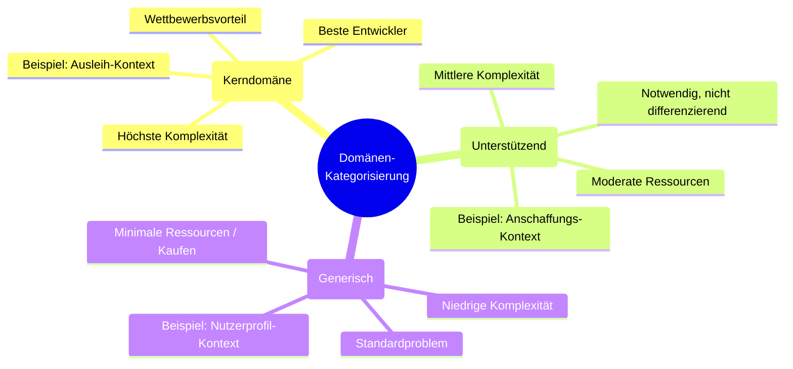
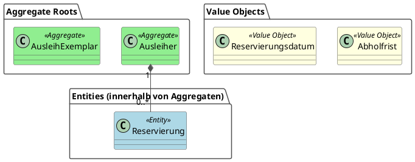
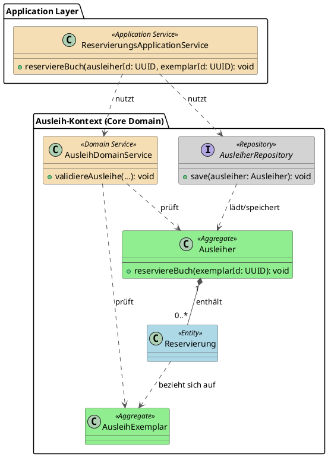
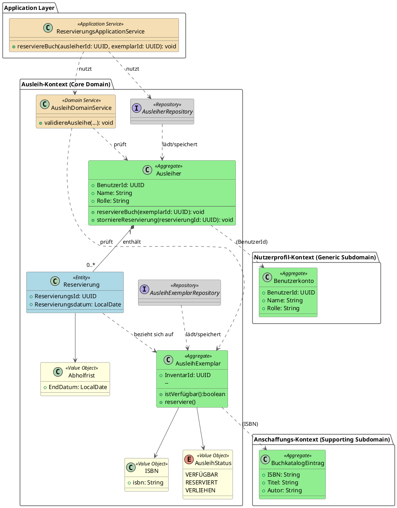

## 4.1 Mit Domain-Driven-Design zum Domain-Modell

Bisher haben wir gelernt, wie man Anforderungen erhebt, in User Stories formuliert und durch Workshops mit Stakeholdern verfeinert. Doch wie gelangen wir von diesen nutzerzentrierten Anforderungen zu einem robusten technischen Fundament? Die Antwort liegt in der Erstellung eines **Domain-Modells** – einer strukturierten Abbildung der Geschäftslogik, die als solides Fundament für alle nachfolgenden Architekturentscheidungen dient.

In diesem Kapitel lernen Sie, wie Sie mit **Domain-Driven Design (DDD)** ein vollständiges Domain-Modell entwickeln, das:
- Die **Domänen** Ihrer Anwendung identifiziert und nach ihrer Wichtigkeit kategorisiert (Core Domain, Supporting Subdomain, Generic Subdomain)
- Die Brücke von der **User Story** zum technischen **Use Case** schlägt
- Für jede Domäne die zentralen **Aggregate** mit ihren Entitäten und Value Objects definiert
- Die **Geschäftslogik** in Form von Methoden den richtigen Aggregaten zuordnet
- Die **Grenzen zwischen Domänen** (Bounded Contexts) klar definiert

Dieses Domain-Modell ist nicht nur eine theoretische Übung – es bildet die **Grundlage für die Wahl der passenden Software-Architektur(en)**. Verschiedene Domänen haben unterschiedliche Anforderungen: Ihre Core Domain benötigt möglicherweise eine hochflexible, wartbare Architektur (z.B. Clean Architecture), während für Generic Subdomains eine einfache Standardlösung ausreicht. Das Domain-Modell zeigt uns, wo wir in Qualität investieren müssen und wo Pragmatismus angebracht ist.

> <span style="font-size: 1.5em">🎯</span> **Ziel dieses Kapitels:** Am Ende haben Sie ein vollständiges, visuell dokumentiertes Domain-Modell, das jeden Bounded Context mit seinen Aggregaten, Entitäten, Value Objects und deren Beziehungen zeigt – bereit, als Blueprint für die Architekturentscheidungen.

### 4.1.1 Was ist Domain-Driven Design?

Angenommen, Sie sollen eine Software für die Logistik eines großen Online-Händlers entwickeln. Die Fachabteilung spricht von "Sendungsverfolgung", "Retourenmanagement" und "Lagerbestand". Wenn die Entwickler in ihrem Code jedoch nur mit generischen Begriffen wie `DataManager`, `ItemProcessor` oder `StatusUpdater` arbeiten, entsteht eine Kluft. Missverständnisse sind vorprogrammiert und die Software wird mit der Zeit immer schwerer an neue Geschäftsprozesse anpassbar sein.

**Domain-Driven Design (DDD)** ist ein Ansatz zur Softwareentwicklung, der genau dieses Problem löst. Es ist eine Sammlung von Prinzipien und Mustern, die darauf abzielen, eine tiefe Verbindung zwischen dem Code und dem Geschäftsmodell (der **Domäne**) herzustellen.

-   **Definition:** DDD ist kein spezifisches Framework, sondern eine Philosophie, die das Hauptaugenmerk auf die **Kerndomäne** (den wichtigsten, komplexesten Teil des Geschäfts) legt. Das Ziel ist es, ein reichhaltiges, ausdrucksstarkes **Modell** dieser Domäne zu erstellen, das als Herzstück der Software dient.
-   **Zweck:** Die drei Hauptziele von DDD sind:
    1.  **Komplexität bewältigen:** Indem man sich auf das Geschäftsfeld konzentriert und es präzise modelliert, wird die inhärente Komplexität der Domäne beherrschbar.
    2.  **Kommunikation verbessern:** DDD etabliert eine gemeinsame, allgegenwärtige Sprache (**Ubiquitous Language**), die von Fachexperten und Entwicklern gleichermaßen gesprochen wird. Dies reduziert Missverständnisse drastisch.
    3.  **Langlebige Architektur schaffen:** Eine Software, deren Struktur die Domäne widerspiegelt, ist leichter zu verstehen, zu warten und zu erweitern, da Änderungen im Geschäft sich logisch im Code abbilden lassen.

> <span style="font-size: 1.5em">:bulb:</span> **Merksatz:** Bei Domain-Driven Design geht es darum, die Sprache des Geschäfts zur Sprache des Codes zu machen. Die Software wird zu einem lebendigen Modell der realen Geschäftsprozesse.

### 4.1.2 Die zwei Säulen von DDD: Strategisches und Taktisches Design

Domain-Driven Design ist kein monolithischer Block, sondern gliedert sich in zwei große, miteinander verbundene Disziplinen: **Strategisches Design** und **Taktisches Design**. Man kann sie sich wie den Plan eines Städtebauers und die Baupläne eines einzelnen Architekten vorstellen.

1.  **Strategisches Design (Der Städteplaner):**
    -   **Fokus:** Das große Ganze, die Makro-Ebene. Hier geht es darum, die gesamte Geschäftsdomäne zu verstehen und in logische, voneinander unabhängige Teilbereiche zu zerlegen.
    -   **Analogie:** Der Städteplaner legt fest, wo das Wohngebiet, das Industriegebiet und das Einkaufsviertel liegen. Er definiert die großen Verkehrsadern, die diese Gebiete verbinden, und sorgt dafür, dass die Infrastruktur in jedem Viertel passt (im Wohngebiet gelten andere Anforderungen an die Infrastruktur als im Industriegebiet).
    -   **Zentrale Fragen:** Was sind die verschiedenen Teilbereiche unseres Geschäfts? Wie hängen sie zusammen? Wo liegen die Grenzen? Welches ist der wichtigste Teil (die Kerndomäne), in den wir die meiste Energie investieren müssen?

2.  **Taktisches Design (Der Architekt):**
    -   **Fokus:** Das Detail, die Mikro-Ebene. Hier geht es um die konkrete Ausgestaltung des Modells *innerhalb* eines einzelnen, klar abgegrenzten Bereichs.
    -   **Analogie:** Der Architekt nimmt sich einen vom Städteplaner definierten Bereich – z.B. das Wohngebiet – und entwirft die detaillierten Baupläne für ein einzelnes Haus. Er legt fest, welche Räume es gibt (Entitäten), welche Elektroanschlüsse, Heizkörper oder ähnliches für die Räume vorzusehen sind (Aggregate) und welche statische Bedingungen (Regeln) einzuhalten sind.
    -   **Zentrale Fragen:** Aus welchen Bausteinen besteht unser Modell? Wie repräsentieren wir ein "Kundenkonto" oder eine "Bestellung" im Code? Wie stellen wir sicher, dass Geschäftsregeln (z.B. "Ein Konto kann nicht überzogen werden") immer eingehalten werden?

> <span style="font-size: 1.5em">:mag:</span> **Vertiefung:** Strategisches und Taktisches Design sind untrennbar miteinander verbunden. Gutes strategisches Design schafft die Voraussetzung für effektives taktisches Design. Ohne klare Grenzen (strategisch) wird das Modell im Inneren (taktisch) chaotisch. Umgekehrt hilft die Detailarbeit im Taktischen Design oft dabei, die strategischen Grenzen besser zu verstehen und zu schärfen. Man beginnt oft mit einer groben strategischen Sicht, verfeinert sie durch taktische Implementierung und passt die Strategie bei Bedarf wieder an.

### 4.1.3 Strategisches Design: Die große Landkarte

Das strategische Design ist der erste und wichtigste Schritt im DDD. Es zwingt uns, einen Schritt zurückzutreten und das Geschäft als Ganzes zu betrachten, bevor wir eine einzige Zeile Code schreiben. Das Ziel ist es, eine "Landkarte" der Domäne zu erstellen, die uns hilft, uns zu orientieren, Grenzen zu ziehen und unsere Kräfte auf die wichtigsten Gebiete zu konzentrieren. Die zentralen Werkzeuge dafür sind die **Kategorisierung der Domänen**, die **Ubiquitous Language** und **Bounded Contexts**.

#### 4.1.3.1 Kategorisierung der Domänen: Wo investieren wir unsere Energie?

Nicht alle Teile einer Software sind gleich wichtig. Manche Bereiche sind das Herzstück des Geschäfts und bieten echte Wettbewerbsvorteile, andere sind notwendig, aber nicht differenzierend. Das strategische Design beginnt damit, die verschiedenen Teile der Geschäftsdomäne in drei Kategorien einzuteilen, um bewusst zu entscheiden, wo die wertvollsten Entwicklungsressourcen investiert werden sollen.

**1. Core Domain (Kerndomäne): Das Herz des Geschäfts**

Die **Core Domain** ist der Teil der Domäne, der den größten Geschäftswert liefert und das Unternehmen von der Konkurrenz unterscheidet. Hier liegt die einzigartige Expertise und der Wettbewerbsvorteil.

-   **Merkmale:**
    -   Hohe fachliche Komplexität
    -   Ständige Weiterentwicklung und Änderungen
    -   Starke Einbindung von Fachexperten notwendig
    -   Größter Return on Investment (ROI)
-   **Strategie:** Hier investieren wir die **besten Entwickler**, die **meiste Zeit** und die **höchste Qualität**. Das Modell muss reichhaltig, ausdrucksstark und flexibel sein. Dies ist **nicht** der Ort für "Quick & Dirty"-Lösungen oder generische Frameworks.

**Beispiel Schulbibliothek:**
Der **Ausleih-Kontext** ist unsere Core Domain. Warum?
-   Er implementiert die zentralen Geschäftsprozesse: Ausleihe, Rückgabe, Vormerkung, Mahnwesen.
-   Die Regeln sind komplex und speziell: unterschiedliche Leihfristen für Schüler und Lehrer, Ausleihlimits, Strafgebühren bei verspäteter Rückgabe.
-   Hier kann die Schule sich von anderen Bibliotheken unterscheiden (z.B. durch ein besonders benutzerfreundliches Vormerk-System).
-   **Investition:** Die Fachlogik für das Ausleihlimit ("Ein Schüler darf maximal 5 Bücher ausleihen") wird als explizite Geschäftsregel im `Ausleiher`-Aggregat modelliert, nicht in einer generischen Validierungsklasse versteckt.

**2. Supporting Subdomain (Unterstützende Teildomäne): Notwendig, aber nicht einzigartig**

Eine **Supporting Subdomain** ist ein Bereich, der für das Geschäft notwendig ist, aber keinen Wettbewerbsvorteil bietet. Die Logik ist zwar spezifisch für das Unternehmen, aber nicht besonders komplex oder innovativ.

-   **Merkmale:**
    -   Mittlere fachliche Komplexität
    -   Unterstützt die Core Domain
    -   Individuell, aber nicht differenzierend
    -   Könnte theoretisch auch von einem anderen Unternehmen ähnlich gelöst werden
-   **Strategie:** Hier investieren wir **moderate Ressourcen**. Das Modell sollte korrekt und wartbar sein, aber es rechtfertigt nicht den gleichen Perfektionismus wie die Core Domain. Oft ist es sinnvoll, hier mit weniger aufwändigen Patterns zu arbeiten oder sogar Teile **outzusourcen** oder durch **Standard-Software** zu ersetzen, wenn möglich.

**Beispiel Schulbibliothek:**
Der **Anschaffungs-Kontext** ist eine Supporting Subdomain. Warum?
-   Die Schule muss neue Bücher bestellen können, das ist notwendig.
-   Der Prozess (Bestellung, Rechnung, Lieferantenverwaltung) ist aber nicht einzigartig. Viele Organisationen machen ähnliche Dinge.
-   Die Bibliothek wird nicht dadurch besser, dass sie ein super ausgefeiltes Bestellsystem hat. Ein einfaches, funktionales System reicht völlig.
-   **Investition:** Ein simples CRUD-Interface (Create, Read, Update, Delete) für `BuchkatalogEintrag` mit Grundvalidierungen ist hier ausreichend. Wir benötigen kein komplexes Aggregat mit ausgefeilten Geschäftsregeln.

**3. Generic Subdomain (Generische Teildomäne): Standard-Problem, Standard-Lösung**

Eine **Generic Subdomain** ist ein Bereich, für den es bereits etablierte, allgemeine Lösungen gibt. Die Problemstellung ist nicht spezifisch für das Unternehmen.

-   **Merkmale:**
    -   Niedrige fachliche Komplexität
    -   Keine Unternehmensspezifika
    -   Standardproblem, das viele Unternehmen haben
    -   Bietet keinen Wettbewerbsvorteil
-   **Strategie:** Hier investieren wir **minimale Ressourcen**. Die beste Lösung ist oft, **bestehende Bibliotheken, Frameworks oder externe Services** zu nutzen (kaufen statt bauen). Wenn wir doch selbst entwickeln, halten wir es so einfach wie möglich.

**Beispiel Schulbibliothek:**
Der **Nutzerprofil-Kontext** (Benutzerverwaltung, Authentifizierung) ist eine Generic Subdomain. Warum?
-   Jede Anwendung benötigt Benutzerverwaltung und Login.
-   Die Anforderungen (Benutzername, Passwort, Rollen) sind Standard.
-   Es gibt unzählige fertige Lösungen: Identity-Server, OAuth-Provider, fertige User-Management-Bibliotheken.
-   **Investition:** Wir nutzen eine bewährte Authentifizierungslösung (z.B. ASP.NET Core Identity, Keycloak, Auth0) statt ein eigenes System zu bauen. Wenn wir es doch selbst machen, ist ein einfaches Datenmodell mit `Benutzerkonto` als Entität ausreichend.

> <span style="font-size: 1.5em">🔧</span> **Praxis-Tipp: Die 80/20-Regel**
>
> In den meisten Projekten macht die Core Domain nur etwa 20% des Codes aus, liefert aber 80% des Geschäftswerts. Die größte Herausforderung im strategischen Design ist es, diese 20% zu identifizieren und **bewusst** die meisten Ressourcen darauf zu konzentrieren. Viele Projekte scheitern, weil sie ihre Energie gleichmäßig verteilen und am Ende überall Mittelmaß produzieren, statt in der Core Domain Exzellenz zu erreichen.

Das folgende Diagramm visualisiert die drei Domänen-Kategorien mit ihren charakteristischen Eigenschaften und zeigt die Ressourcenverteilung:



> <span style="font-size: 1.5em">:warning:</span> **Achtung: Kategorisierung ist kontextabhängig!**
>
> Was für ein Unternehmen eine Core Domain ist, kann für ein anderes eine Generic Subdomain sein. Für Amazon ist die Logistik (Routenoptimierung, Lagerverwaltung) eine Core Domain, da sie sich dadurch von der Konkurrenz abheben. Für unsere Schulbibliothek wäre ein komplexes Lagerverwaltungssystem völlig überdimensioniert – hier würde eine einfache `Signatur` (Standort) als Value Object völlig ausreichen. Die Kategorisierung muss immer aus der Perspektive des konkreten Geschäftskontexts erfolgen.

#### 4.1.3.2 Ubiquitous Language (Allgegenwärtige Sprache)

Die größte Quelle für Fehler in Softwareprojekten sind Missverständnisse zwischen Fachexperten und Entwicklern. Die Fachabteilung sagt "Kunde", meint aber nur "Endverbraucher", während die Entwickler auch "Geschäftskunden" darunter verstehen. Das Ergebnis ist Chaos.

Die **Ubiquitous Language** ist die Lösung für dieses Problem. Es ist ein gemeinsames, von allen Projektbeteiligten – Entwicklern, Fachexperten, Managern – aktiv genutztes und entwickeltes Vokabular. Diese Sprache ist nicht nur eine Liste von Begriffen, sie ist die Sprache des Modells und wird direkt im Code verwendet (z.B. als Klassen- und Methodennamen).

**Beispiel: Die Schulbibliothek**
Im Workshop zur Schulbibliothek (siehe Kapitel 3.3.3) tauchten verschiedene Begriffe auf. Das Team muss sich auf eine einheitliche Sprache einigen:
-   Heißt es **"Vormerkung"** oder **"Reservierung"**? Das Team einigt sich auf **"Vormerkung"**, da "Reservierung" für Lehrer, die ganze Klassensätze bestellen, eine andere Bedeutung hat.
-   Ein Schüler, der ein Buch hat, ist ein **"Ausleiher"**. Der Vorgang ist die **"Ausleihe"**.
-   Ein Buch, das nicht zurückgegeben wurde, ist **"überfällig"**. Der Prozess, den Ausleiher zu erinnern, ist das **"Mahnwesen"**.

Diese Begriffe werden nun überall exakt so verwendet: in Meetings, in der Dokumentation und vor allem im Code (`class Ausleihe`, `sendeMahnung()`).

#### 4.1.3.3 Bounded Context (Abgegrenzter Kontext)

Eine Sprache ist nur innerhalb eines bestimmten Kontextes eindeutig. Das Wort "Bank" bedeutet im Finanzwesen etwas anderes als im Park. Ein **Bounded Context** ist eine explizite Grenze (z.B. ein Modul, ein Microservice), innerhalb derer ein bestimmtes Domänenmodell und eine bestimmte Ubiquitous Language gelten.

Innerhalb eines Bounded Context ist jeder Begriff eindeutig. Außerhalb kann er etwas völlig anderes bedeuten. Das strategische Design hilft uns, diese Grenzen zu finden und zu definieren.

**Beispiel: Die Schulbibliothek**
In unsere Schulbibliotheksbeispiel gibt es nun verschiedene Arten von Büchern. Hier machen das durch die Namensgebung in der Ubiquitous Language explizit:

1.  **Ausleih-Kontext (Core Domain):** Das ist das Herzstück. Hier geht es um das physische Exemplar im Regal.
    -   **Sprache:** `Ausleihe`, `Ausleiher`, `Rückgabefrist`, `Mahnung`.
    -   Das Modell hier nennen wir **`AusleihExemplar`**. Es ist eine Entität mit einer eindeutigen `InventarId` und hat Attribute wie `Ausleihstatus` und `Signatur` (Standort). Es trägt auch die `ISBN` als Referenz.

2.  **Anschaffungs-Kontext (Supporting Subdomain):** Hier kümmert sich Frau Müller um die Bestellung neuer Bücher. Hier geht es um das Buch als bestellbares Produkt.
    -   **Sprache:** `Bestellung`, `Lieferant`, `Rechnung`, `Budget`.
    -   Das Modell hier nennen wir **`BuchkatalogEintrag`**. Es ist ebenfalls eine Entität mit der `ISBN` als primärer ID und hat Attribute wie `Titel`, `Preis` und `Lieferant`. Der `Ausleihstatus` ist hier völlig **irrelevant**.

3.  **Nutzerprofil-Kontext (Generic Subdomain):** Hier werden die Daten der Schüler und Lehrer verwaltet.
    -   **Sprache:** `Benutzerkonto`, `Passwort`, `Rolle` (Schüler/Lehrer), `Klasse`.
    -   Ein `Benutzer` hat hier Attribute wie `Name` und `E-Mail`. Ob er gerade Bücher ausgeliehen hat, ist für diesen Kontext nicht von primärem Interesse.

> <span style="font-size: 1.5em">:warning:</span> **Achtung:** Indem wir die Kontexte trennen, vermeiden wir ein riesiges "Gott-Objekt" `Buch`. Stattdessen haben wir zwei spezialisierte Modelle: das **`AusleihExemplar`** im Ausleih-Kontext und den **`BuchkatalogEintrag`** im Anschaffungs-Kontext. Die Verknüpfung zwischen diesen beiden erfolgt **nicht** über eine gemeinsame Klasse oder Vererbung, sondern über eine **gemeinsame, stabile ID** – die `ISBN` ist hierfür der perfekte Kandidat. So kann der Ausleih-Kontext bei Bedarf Informationen (wie den Titel) aus dem Anschaffungs-Kontext abfragen, ohne dessen internes Modell kennen zu müssen. Das ist die Kernidee des strategischen Designs: Komplexität durch klare Grenzen und lose Kopplung beherrschen.

> <span style="font-size: 1.5em">:mag:</span> **Vertiefung: Warum keine gemeinsame Basisklasse für `Buch`?**
>
> Die intuitive Idee, eine abstrakte `Buch`-Basisklasse zu verwenden, ist ein klassisches Anti-Pattern im DDD. Der Grund liegt in der **Kopplung**:
> - **Enge Kopplung:** Eine gemeinsame Basisklasse koppelt die Kontexte eng aneinander. Eine Änderung an der Basisklasse (z.B. im Anschaffungs-Team) würde sofort den Ausleih-Kontext beeinflussen und könnte dort zu Fehlern führen. Die Autonomie der Teams geht verloren.
> - **Verletzung der Grenzen:** Das Modell wird zu einem Kompromiss, der keinem Kontext richtig dient. Der Ausleih-Kontext wird mit für ihn irrelevanten Daten und Logiken aus der Anschaffung belastet und umgekehrt.
>
> Die DDD-Lösung – getrennte Modelle (`AusleihExemplar`, `BuchkatalogEintrag`), die nur über eine ID (`ISBN`) lose gekoppelt sind – maximiert die **Autonomie** und **Wartbarkeit**. Jeder Kontext kann sein Modell perfekt auf seine Bedürfnisse zuschneiden, ohne andere Kontexte zu beeinträchtigen.

### 4.1.4 Brückenschlag: Von der User Story zum Use Case

Bevor wir uns in das taktische Design stürzen und Klassen, Methoden und Aggregate definieren, gibt es einen entscheidenden Zwischenschritt, den viele Teams überspringen: den **Use Case (Anwendungsfall)**.

User Stories beschreiben den **Wert** und die **Absicht** aus Nutzersicht ("Ich will ein Buch ausleihen, um es zu lesen"). Das Domänenmodell beschreibt die **Struktur** und **Logik** ("Das Aggregat `Ausleiher` prüft das Limit"). Dazwischen klafft eine Lücke: Was genau *passiert* eigentlich im System? Welche Regeln gelten? Welche Fehler können auftreten?

Der Use Case schließt diese Lücke. Er übersetzt den "Wunsch" der User Story in einen konkreten "Ablauf" für das System.

| Kriterien | User Story | Use Case |
| :--- | :--- | :--- |
| **Fokus** | Business Value & Nutzerabsicht | Fachlicher Ablauf & Systemverhalten |
| **Stabilität** | Mittel (ändert sich oft) | Hoch (der fachliche Kern bleibt stabil) |
| **Rolle in DDD** | Input für Anforderungen | Input für das Domänenmodell & Invarianten |

#### Die 5-Schritte-Methode: Mapping von Story zu Use Case

Um von einer User Story zu einem robusten Use Case zu kommen, hat sich in der Praxis ein 5-Schritte-Vorgehen bewährt. Wenden wir dies auf unsere Schulbibliothek an.

**User Story:**
> "Als Schüler möchte ich ein Buch online reservieren können, damit ich es mir dann sicher in der Schulbibliothek ausleihen kann"

**Schritt 1: User Story zerlegen (Intent + Outcome)**
Wir trennen das "Warum" vom "Was".
-   **Intent (Absicht):** Buch sicher ausleihen können (Verfügbarkeit sichern).
-   **Outcome (Ergebnis):** Das Buch ist für mich reserviert und kann von niemand anderem ausgeliehen werden.
-   **Fachlicher Kern:** "Buch reservieren".

**Schritt 2: Systemgrenzen klären**
Was tut der Nutzer, was tut das System?
-   Der Nutzer wählt ein Buch im Online-Katalog aus.
-   Das System muss prüfen, ob es verfügbar ist, und es blockieren.
-   **Use Case Name:** `ReserviereBuch` (ReserveBook). (Immer Verb + Objekt!)

**Schritt 3: Geschäftsregeln & Invarianten extrahieren**
Hier wird es spannend für unser späteres Domain Model. Welche Regeln *müssen* gelten?
-   Das Buch muss im Status "Verfügbar" sein.
-   Der Schüler darf maximal 3 aktive Reservierungen haben.
-   Eine Reservierung verfällt automatisch nach 3 Tagen, wenn das Buch nicht abgeholt wird.

**Schritt 4: "Happy Path" + Alternativpfade ausarbeiten**
Wie läuft der Prozess idealerweise ab, und was kann schiefgehen?
-   **Happy Path:** Schüler wählt Buch -> System prüft Verfügbarkeit & Limit -> System setzt Status auf "Reserviert" -> System bestätigt mit Abholfrist.
-   **Alternativpfade:**
    -   Buch bereits verliehen oder reserviert (Fehler: "Nicht verfügbar").
    -   Reservierungslimit erreicht (Fehler: "Zu viele Reservierungen").
    -   **Zeitlicher Ablauf:** Buch wird nicht abgeholt -> Reservierung verfällt automatisch nach 3 Tagen.
-   **Domain Events:** Nach erfolgreicher Reservierung wird `BuchWurdeReserviert` ausgelöst. Bei Verfallenlassen der Reservierung wird `ReservierungIstVerfallen` ausgelöst.

**Schritt 5: Mapping dokumentieren**
Das Ergebnis ist eine klare Spezifikation, die wir direkt in Code (Tests und Domain-Logik) übersetzen können.

```text
User Story: Als Schüler möchte ich ein Buch online reservieren...

→ Use Case: ReserviereBuch

Mapping:
---------------------------------------------------------
Akteur                | Schüler
Vorbedingungen        | Buch ist verfügbar
Hauptablauf           | 1. Buchwahl, 2. Prüfung, 3. Reservierung
Regeln (Invarianten)  | Max. 3 Reservierungen, Buch muss verfügbar sein, 3 Tage Frist
Ergebnis              | Buchstatus = RESERVIERT, Ablaufdatum gesetzt
Domain Events         | BuchWurdeReserviert, ReservierungIstVerfallen
```

> <span style="font-size: 1.5em">:bulb:</span> **Warum ist das wichtig für DDD?**
>
> Die in Schritt 3 identifizierten **Regeln** sind genau die Logik, die wir später in unsere **Aggregate** einbauen müssen. Die **Abläufe** aus Schritt 4 definieren, welche Methoden wir auf den Aggregaten brauchen und wie der **Application Service** diese orchestrieren muss. Ohne diesen Zwischenschritt vergisst man beim Modellieren oft wichtige Randfälle (Edge Cases).

### 4.1.5 Taktisches Design: Die Bausteine der Software

Nachdem das strategische Design die Landkarte und die Grenzen (Bounded Contexts) festgelegt hat und wir durch die Use Cases die genauen Abläufe kennen, gibt uns das taktische Design die konkreten Werkzeuge an die Hand, um das Modell *innerhalb* eines Kontexts zu bauen.

#### 4.1.5.1 Value Objects: Werte ohne Identität

Jedes Modell besteht aus Objekten, aber nicht alle Objekte sind gleich. DDD unterscheidet fundamental zwischen **Value Objects** und **Entities**. Wir beginnen mit Value Objects, da sie oft die einfacheren Bausteine sind.

**Value Object (Werteobjekt):** Ein Objekt, das durch seine Attribute definiert wird und keine eigene Identität hat.

-   **Merkmal:** Es hat keine ID. Zwei Value Objects mit denselben Attributen sind austauschbar und gleich. Sie sind oft unveränderlich (immutable).
-   **Beispiel Schulbibliothek:**
    -   Die **`ISBN`** eines Buches ist ein Value Object. Zwei `ISBN`-Objekte mit dem Wert "978-3-551-55743-7" sind identisch.
    -   Eine **`Anschrift`** bestehend aus Straße, PLZ und Ort ist ein Value Object. Wenn zwei Schüler in derselben WG wohnen, haben sie dieselbe Anschrift. Es ist nicht wichtig, *welches* Anschrift-Objekt man verwendet, solange die Werte stimmen.
    -   Die **`Rückgabefrist`** ist ebenfalls ein Value Object. Sie wird durch ein Datum definiert und hat keine eigene Identität.

##### Rich Value Objects: Verhalten gehört zu den Daten

Ein häufiges Missverständnis über Value Objects ist, dass sie nur "Daten-Container" ohne Verhalten sein sollten. Das Gegenteil ist der Fall! Eric Evans betont in seinem Buch "Domain-Driven Design":

> "Value Objects können und sollten Verhalten haben, das sich auf ihre Werte bezieht."
> — Eric Evans, _Domain-Driven Design: Tackling Complexity in the Heart of Software_

**Rich Value Objects** (reichhaltige Werteobjekte) kapseln nicht nur Daten, sondern auch die Geschäftslogik, die diese Daten betrifft. Dies ist ein zentraler Unterschied zum **Anemic Domain Model** (anämisches Domänenmodell), einem Anti-Pattern, bei dem Objekte nur Getter und Setter haben, während die gesamte Logik in Services ausgelagert ist.

**Vergleich:**

| Aspekt | **Anemic Value Object** ❌ | **Rich Value Object** ✅ |
|--------|---------------------------|--------------------------|
| **Daten** | Nur Attribute + Getter | Attribute (private/final) |
| **Verhalten** | Keine Methoden | Fachliche Methoden |
| **Logik** | In Services ausgelagert | Im Value Object gekapselt |
| **Wiederverwendung** | Schwierig | Hoch |
| **Testbarkeit** | Services mit Abhängigkeiten | Value Object isoliert testbar |

**Beispiel aus der Schulbibliothek: `Rückgabefrist`**

❌ **Schlechtes Beispiel (Anemic):**
```java
// Nur ein Daten-Container
public class Rückgabefrist {
    private LocalDate datum;
    
    public LocalDate getDatum() { 
        return datum; 
    }
    
    public void setDatum(LocalDate datum) { 
        this.datum = datum; 
    }
}

// Logik ist im Service ausgelagert
public class AusleihService {
    public boolean istÜberfällig(Ausleihe ausleihe) {
        // ❌ Diese Logik sollte im Value Object sein!
        return LocalDate.now().isAfter(ausleihe.getRückgabefrist().getDatum());
    }
}
```

**Probleme:**
- Geschäftslogik ist vom Value Object getrennt
- Code-Duplikation wahrscheinlich (jeder Service implementiert die Prüfung neu)
- Schwer wartbar

✅ **Gutes Beispiel (Rich):**
```java
import java.time.LocalDate;
import java.time.temporal.ChronoUnit;
import java.util.Objects;

// Value Object mit Geschäftslogik
public class Rückgabefrist {
    private final LocalDate datum; // immutable!
    
    public Rückgabefrist(LocalDate datum) {
        if (datum == null || datum.isBefore(LocalDate.now())) {
            throw new IllegalArgumentException(
                "Rückgabefrist muss in der Zukunft liegen"
            );
        }
        this.datum = datum;
    }
    
    // ✅ Geschäftslogik im Value Object
    public boolean istÜberschritten() {
        return LocalDate.now().isAfter(datum);
    }
    
    public Rückgabefrist verlängern(int tage) {
        return new Rückgabefrist(datum.plusDays(tage));
    }
    
    public long tageVerbleibend() {
        long tage = ChronoUnit.DAYS.between(LocalDate.now(), datum);
        return tage > 0 ? tage : 0;
    }
    
    // Value Objects: Gleichheit über Werte
    @Override
    public boolean equals(Object o) {
        if (this == o) return true;
        if (!(o instanceof Rückgabefrist)) return false;
        Rückgabefrist that = (Rückgabefrist) o;
        return datum.equals(that.datum);
    }
    
    @Override
    public int hashCode() {
        return Objects.hash(datum);
    }
    
    public LocalDate getDatum() { 
        return datum; 
    }
}

// Aggregate nutzt das Value Object
public class Ausleihe {
    private String id;
    private Rückgabefrist rückgabefrist;
    
    public boolean istÜberfällig() {
        // ✅ Delegiert an Value Object
        return rückgabefrist.istÜberschritten();
    }
}
```

**Vorteile:**
- ✅ Kapselung: Logik und Daten sind zusammen
- ✅ Wiederverwendbarkeit: `istÜberschritten()` ist überall nutzbar
- ✅ Testbarkeit: Value Object kann isoliert getestet werden
- ✅ Ubiquitous Language: Fachliche Begriffe werden Code

**Weitere Beispiele für reichhaltige Value Objects:**

**`ISBN` mit Validierung:**
```java
import java.util.Objects;

public class ISBN {
    private final String nummer;
    
    public ISBN(String nummer) {
        if (!istGültig(nummer)) {
            throw new IllegalArgumentException("Ungültige ISBN: " + nummer);
        }
        this.nummer = normalisieren(nummer);
    }
    
    private boolean istGültig(String isbn) {
        String bereinigt = isbn.replace("-", "");
        return bereinigt.length() == 13 && prüfzifferKorrekt(bereinigt);
    }
    
    private boolean prüfzifferKorrekt(String isbn) {
        // ISBN-13 Prüfziffer-Algorithmus
        int summe = 0;
        for (int i = 0; i < 12; i++) {
            int ziffer = Character.getNumericValue(isbn.charAt(i));
            summe += (i % 2 == 0) ? ziffer : ziffer * 3;
        }
        int prüfziffer = (10 - (summe % 10)) % 10;
        return prüfziffer == Character.getNumericValue(isbn.charAt(12));
    }
    
    private String normalisieren(String isbn) {
        return isbn.replace("-", "");
    }
    
    public String formatiert() {
        // 978-3-551-55743-7
        return nummer.substring(0, 3) + "-" +
               nummer.substring(3, 4) + "-" +
               nummer.substring(4, 9) + "-" +
               nummer.substring(9, 12) + "-" +
               nummer.substring(12);
    }
    
    @Override
    public boolean equals(Object o) {
        if (this == o) return true;
        if (!(o instanceof ISBN)) return false;
        ISBN isbn = (ISBN) o;
        return nummer.equals(isbn.nummer);
    }
    
    @Override
    public int hashCode() {
        return Objects.hash(nummer);
    }
    
    public String getNummer() { 
        return nummer; 
    }
}
```

**Wann gehört Verhalten ins Value Object?**

✅ **Verhalten GEHÖRT ins Value Object wenn:**
- Es sich nur auf die eigenen Werte bezieht
- Es eine fachliche Frage beantwortet (`istÜberschritten()`, `istGültig()`)
- Es neue Value Objects erzeugt (Transformationen wie `verlängern()`)

❌ **Verhalten gehört NICHT ins Value Object wenn:**
- Es andere Aggregates/Entities benötigt
- Es Repositories oder externe Services benötigt
- Es Side-Effects hat (Persistenz, Events, E-Mails senden)

> <span style="font-size: 1.5em">:bulb:</span> **Merksatz:** Rich Value Objects sind keine Daten-Container, sondern aktive Teilnehmer im Domain Model. Sie schützen ihre eigenen Invarianten und bieten fachliche Operationen an. Ein Value Object ohne Verhalten ist oft ein Code-Smell für ein anämisches Domänenmodell.

#### 4.1.5.2 Entities: Objekte mit Identität

Während Value Objects durch ihre Werte definiert werden, gibt es Objekte, bei denen die **Identität** wichtiger ist als die aktuellen Attributwerte.

**Entity (Entität):** Ein Objekt, das nicht durch seine Attribute, sondern durch seine **eindeutige Identität** und seinen Lebenszyklus definiert wird.

-   **Merkmal:** Es hat eine ID. Wenn sich seine Attribute ändern (z.B. der Nachname einer Person durch Heirat), bleibt es trotzdem dasselbe Objekt.
-   **Beispiel Schulbibliothek:**
    -   Ein **`Ausleiher`** (Schüler oder Lehrer) ist eine klassische Entität. Jeder Ausleiher hat eine eindeutige Mitgliedsnummer. Auch wenn er die Klasse wechselt oder umzieht, bleibt er dieselbe Person.
    -   Das physische **`Buch`** im `Ausleih-Kontext` ist ebenfalls eine Entität. Jedes einzelne Exemplar von "Harry Potter" hat eine eindeutige Inventarnummer. Es ist wichtig zu wissen, ob *genau dieses Exemplar* gerade ausgeliehen oder beschädigt ist.

**Unterscheidung Entity vs. Value Object:**

| Aspekt | **Value Object** | **Entity** |
|--------|------------------|------------|
| **Identität** | ❌ Keine (nur Werte zählen) | ✅ Hat eindeutige ID |
| **Gleichheit** | Über alle Werte (equals) | Über ID |
| **Mutability** | ❌ Immutable (unveränderlich) | ✅ Mutable (veränderlich) |
| **Lebenszyklus** | Wird erstellt/ersetzt | Hat Lebenszyklus mit Zustandsänderungen |
| **Austauschbarkeit** | ✅ Zwei identische Werte sind austauschbar | ❌ Jede Instanz ist einzigartig |

> <span style="font-size: 1.5em">:bulb:</span> **Merksatz:** Die Frage "Ist es wichtig, *welches* Objekt ich habe, oder nur *was* es enthält?" hilft bei der Unterscheidung. Wenn nur der Inhalt zählt → Value Object. Wenn die Identität wichtig ist → Entity.

#### 4.1.5.3 Aggregate: Die Konsistenz-Grenze

Ein zentrales Problem in komplexen Systemen ist die Einhaltung von Geschäftsregeln (Invarianten), die mehrere Objekte betreffen. Zum Beispiel: "Ein Ausleiher darf nicht mehr als 5 Bücher gleichzeitig ausleihen."

Ein **Aggregat** ist eine Gruppe von zusammengehörigen Objekten (Entitäten und Value Objects), die als eine einzige Einheit für Datenänderungen behandelt wird. Jedes Aggregat hat eine Wurzel, die **Aggregate Root**, die als einziger Einstiegspunkt für alle Operationen auf dem Aggregat dient.

-   **Zweck:** Sicherstellung der Konsistenz. Geschäftsregeln, die sich über mehrere Objekte erstrecken, werden innerhalb des Aggregats garantiert.
-   **Regeln:**
    1.  Von außerhalb des Aggregats darf nur auf die Aggregate Root zugegriffen werden.
    2.  Objekte innerhalb des Aggregats können Referenzen aufeinander halten.
    3.  Nur die Aggregate Root darf von außerhalb referenziert werden.

**Aggregat vs. Entität: saubere Abgrenzung**

-   **Aggregat**: Konsistenz- und Transaktionsgrenze; ein fachliches Konzept, kein eigenständiger Entity-Typ.
-   **Aggregate Root**: immer eine **Entität** mit globaler Identität; einziger Einstiegspunkt von außen; nur sie erhält ein Repository.
-   **Entitäten im Aggregat**: können eigene IDs besitzen, sind aber **keine** Aggregate Roots und werden nur über das Root verändert.
-   **Nicht jede Entität ist eine Aggregate Root**: z.B. `OrderItem` oder `Ausleihe` existieren sinnvoll nur innerhalb ihres Aggregats.

**Wann wird eine Entität zur Aggregate Root?** Wenn mindestens eine der folgenden Bedingungen erfüllt ist:
-   Sie wird direkt von außen referenziert oder über Kontextgrenzen hinweg adressiert.
-   Sie definiert oder schützt zentrale Geschäftsregeln/Invarianten.
-   Sie bildet die Transaktionsgrenze, die konsistent bleiben muss.

| Aussage                                                | Wahr/Falsch |
| ------------------------------------------------------ | ----------- |
| Aggregate Roots sind Entitäten                          | ✅           |
| Entitäten sind immer Aggregate Roots                    | ❌           |
| Nur Aggregate Roots haben Repositories                  | ✅           |
| Interne Entitäten dürfen von außen referenziert werden | ❌           |

> <span style="font-size: 1.5em">:bulb:</span> **Merksatz:** Aggregate sind Konsistenzgrenzen; die Aggregate Root ist immer eine Entität mit globaler ID – alle anderen Entitäten und Value Objects bleiben innen und werden nur über das Root gesteuert.

**Beispiel Schulbibliothek:**
Im `Ausleih-Kontext` ist der **`Ausleiher`** eine perfekte Aggregate Root.
-   Das `Ausleiher`-Aggregat umfasst die `Ausleiher`-Entität selbst und eine Liste seiner aktuellen `Ausleihe`-Objekte.
-   **Geschäftsregel:** "Ein Schüler darf maximal 5 Bücher ausleihen."
-   **Umsetzung:** Die Methode `leiheBuchAus(buch)` existiert nur auf der `Ausleiher`-Entität. Bevor eine neue `Ausleihe` zur Liste hinzugefügt wird, prüft diese Methode: "Ist die Rolle 'Schüler' UND ist die Anzahl der aktuellen Ausleihen < 5?". Nur wenn diese Bedingung erfüllt ist, wird die Operation ausgeführt. So wird die Regel niemals verletzt. Man kann nicht einfach von außen eine `Ausleihe` erzeugen und sie dem `Ausleiher` zuweisen.

#### 4.1.5.4 Domain Events: Wichtige Geschäftsereignisse kommunizieren

Während Entities, Value Objects und Aggregate die **Struktur** und **Regeln** unserer Domäne modellieren, fehlt noch ein wichtiger Baustein: Wie kommunizieren wir **bedeutsame Ereignisse**, die in der Domäne passiert sind?

Ein **Domain Event** ist ein Objekt, das einen relevanten Vorgang beschreibt, der bereits stattgefunden hat. Es ist die Vergangenheitsform einer wichtigen Geschäftshandlung.

-   **Merkmal:** Domain Events sind **unveränderlich** (immutable) und beschreiben immer etwas, das **bereits passiert** ist. Sie werden benannt mit einem Verb in der Vergangenheit.
-   **Zweck:**
    1.  **Lose Kopplung:** Verschiedene Teile des Systems können auf Ereignisse reagieren, ohne direkt voneinander zu wissen.
    2.  **Auditierung:** Events bilden eine vollständige Historie dessen, was im System passiert ist.
    3.  **Integration:** Andere Bounded Contexts oder externe Systeme können auf Events reagieren.
    4.  **Geschäftssicht:** Events sprechen die Sprache der Fachexperten ("Ein Buch wurde reserviert").

**Beispiel Schulbibliothek:**

Wenn ein Schüler ein Buch erfolgreich reserviert, passiert im `Ausleiher`-Aggregat Folgendes:

```java
public class Ausleiher {
    private List<Reservierung> reservierungen;
    private List<DomainEvent> events = new ArrayList<>();
    
    public void reserviereBuch(InventarId exemplarId) {
        // 1. Geschäftsregel prüfen
        if (reservierungen.size() >= 3) {
            throw new MaxReservierungenErreichtException();
        }
        
        // 2. Zustandsänderung
        Reservierung reservierung = new Reservierung(exemplarId, LocalDate.now().plusDays(3));
        reservierungen.add(reservierung);
        
        // 3. Domain Event aufzeichnen
        events.add(new BuchWurdeReserviert(
            this.id,
            exemplarId,
            reservierung.getAbholfrist()
        ));
    }
}
```

Das Event `BuchWurdeReserviert` wird dann von verschiedenen Komponenten verwendet:

-   **E-Mail-Service:** Sendet eine Bestätigungsmail an den Schüler.
-   **Benachrichtigungs-Service:** Zeigt eine Benachrichtigung in der App.
-   **Reporting:** Aktualisiert Statistiken über Reservierungen.
-   **Anderer Bounded Context:** Der Anschaffungs-Kontext könnte auf viele Reservierungen desselben Buches reagieren und automatisch weitere Exemplare bestellen.

**Weitere Events im Schulbibliothek-System:**

| Event-Name | Ausgelöst durch | Mögliche Reaktionen |
|:-----------|:----------------|:--------------------|
| `BuchWurdeAusgeliehen` | `Ausleiher.leiheBuchAus()` | Rückgabefrist berechnen, E-Mail senden |
| `BuchWurdeZurückgegeben` | `Ausleiher.gebeBuchZurück()` | Vormerkung aktivieren, Mahnung löschen |
| `ReservierungIstVerfallen` | Zeitgesteuerter Job | Buch wieder verfügbar machen |
| `MahnungWurdeVerschickt` | `MahnService` | Gebühr erfassen, Eskalationsstufe erhöhen |
| `BuchWurdeBeschädigt` | `AusleihExemplar.markiereBeschädigung()` | Reparaturauftrag erstellen, Exemplar sperren |

> <span style="font-size: 1.5em">:bulb:</span> **Merksatz:** Domain Events sind das "Gedächtnis" Ihrer Domäne. Sie dokumentieren nicht nur, was passiert ist, sondern ermöglichen es verschiedenen Teilen des Systems, aufeinander zu reagieren, ohne fest miteinander verdrahtet zu sein.

> <span style="font-size: 1.5em">:mag:</span> **Vertiefung: Event Sourcing**
>
> Ein fortgeschrittenes Pattern im DDD ist **Event Sourcing**, bei dem der komplette Zustand eines Aggregats nicht als aktuelle Daten gespeichert wird, sondern als Folge von Events rekonstruiert wird. Statt zu speichern "Ausleiher X hat aktuell 2 Bücher ausgeliehen", speichert man die Events: "BuchWurdeAusgeliehen", "BuchWurdeZurückgegeben", "BuchWurdeAusgeliehen". Der aktuelle Zustand ergibt sich durch "Abspielen" aller Events. Dies bietet vollständige Auditierung und ermöglicht Zeitreisen ("Wie sah der Zustand vor 3 Monaten aus?"), ist aber auch komplexer in der Implementierung.

#### 4.1.5.5 Repositories: Zugriff auf Aggregate

Nachdem wir unsere Modelle mit Entities, Value Objects und Aggregaten gebaut haben, brauchen wir Mechanismen, sie zu laden und zu speichern.

**Definition:** Ein **Repository** kapselt den Zugriff auf die Persistenzschicht und verhält sich nach außen wie eine "In-Memory-Collection" von Aggregaten.

-   **Zweck:** Abstraktion der Datenbank. Das Domänenmodell muss nicht wissen, ob die Daten in einer SQL-Datenbank, einer NoSQL-Datenbank oder einer Datei liegen.
-   **Regel:** Nur **Aggregate Roots** haben ein Repository. Interne Entities werden immer über ihr Aggregate Root geladen.

**Beispiel Schulbibliothek:**
Ein `AusleiherRepository` bietet Methoden wie `findById(ausleiherId)` oder `save(ausleiher)`.

```java
public interface AusleiherRepository {
    // Laden und suchen
    Optional<Ausleiher> findById(String id);
    
    // Commands
    void save(Ausleiher ausleiher); // Speichert das GANZE Aggregat
    void delete(Ausleiher ausleiher);
}
```

#### 4.1.5.6 Services: Logik und Koordination

Im DDD unterscheiden wir strikt zwischen zwei Arten von Services. Diese Unterscheidung ist entscheidend für eine saubere Architektur.

##### Application Service (UseCase-Orchestrierung)

Der Application Service ist die "Fernbedienung" unserer Anwendung. Er implementiert die Use Cases, enthält aber **keine** Geschäftslogik.

**Verantwortlichkeiten:**
1.  **Orchestrierung:** Lädt Aggregate aus Repositories, rufen Methoden auf ihnen auf und speichert sie wieder.
2.  **Transaktionsgrenzen:** Stellt sicher, dass Änderungen atomar gespeichert werden (`@Transactional`).
3.  **Infrastruktur-Zugriff:** Kann E-Mail-Dienste bedienen, Events publizieren und DTOs mappen.

**Beispiel: `AusleihApplicationService`**
```java
@Transactional
public void leiheBuchAus(String ausleiherId, String exemplarId) {
    // 1. Daten laden (Delegation an Repo)
    Ausleiher ausleiher = ausleiherRepo.findById(ausleiherId)
        .orElseThrow(() -> new NotFoundException(ausleiherId));
        
    AusleihExemplar exemplar = exemplarRepo.findById(exemplarId)
        .orElseThrow(() -> new NotFoundException(exemplarId));
    
    // 2. Domain-Logik aufrufen (Delegation an Domain Service/Aggregat)
    // Application Service entscheidet NICHT selbst, ob ausgeliehen werden darf!
    ausleihDomainService.validiereAusleihe(ausleiher, exemplar);
    
    Rückgabefrist frist = new Rückgabefrist(LocalDate.now().plusDays(14));
    ausleiher.fügAusleiheHinzu(exemplarId, frist);
    exemplar.markiereAusgeliehen();
    
    // 3. Speichern (Delegation an Repo)
    ausleiherRepo.save(ausleiher);
    exemplarRepo.save(exemplar);
}
```

##### Domain Service (Fachliche Koordination)

Manchmal passt eine wichtige Geschäftsregel nicht in ein einzelnes Aggregat, weil sie mehrere Aggregate betrifft. Solche Logik gehört in einen Domain Service.

**Verantwortlichkeiten:**
1.  **Fachliche Koordination:** Validiert Regeln, die Aggregat-Grenzen überschreiten (z.B. "Darf *dieser* Schüler *dieses* Buch ausleihen?").
2.  **Stateless:** Domain Services sind zustandslos. Sie bekommen alles, was sie brauchen, als Parameter.
3.  **Kein Datenbank-Zugriff:** Ein Domain Service sollte **keine Repositories** direkt aufrufen (sonst vermischt er Logik mit Infrastruktur). Die Daten werden ihm übergeben.

**Beispiel: `AusleihDomainService`**
```java
public class AusleihDomainService {
    
    // Koordiniert Prüfung zwischen Ausleiher und Exemplar
    // Wirft Exceptions bei Validierungsfehlern (Fail-Fast)
    public void validiereAusleihe(Ausleiher ausleiher, AusleihExemplar exemplar) {
        
        // Regel 1: Exemplar muss verfügbar sein
        if (!exemplar.istVerfügbar()) {
            throw new ExemplarNichtVerfügbarException();
        }
        
        // Regel 2: Schüler darf Limit nicht erreicht haben
        if (!ausleiher.kannWeitereAusleihe()) {
             throw new MaxAusleihenErreichtException();
        }
        
        // Regel 3: Keine überfälligen Bücher
        if (ausleiher.hatÜberfälligeAusleihen()) {
             throw new ÜberfälligeAusleihenException();
        }
    }
}
```

##### Vergleich: Wer macht was?

| Feature | Application Service | Domain Service |
|:---|:---|:---|
| **Zuständigkeit** | **Ablauf** steuern (Laden, Speichern, Transaktion) | **Logik** ausführen (Rechnen, Prüfen) |
| **Kennt Repositories?** | ✅ Ja (um Aggregates zu holen) | ❌ Nein (bekommt Aggregates übergeben) |
| **Enthält If/Else Logik?** | ❌ Nur für Ablaufkontrolle (z.B. "Not Found") | ✅ Ja, für Geschäftsregeln |
| **Gehört zum Layer** | Application Layer | Domain Layer (Kern der Software) |

> <span style="font-size: 1.5em">:mag:</span> **Wichtige Frage: Wer koordiniert die Aggregate?**
>
> Man könnte annehmen, dass die `leiheBuchAus`-Methode des `Ausleiher`-Aggregats das `AusleihExemplarRepository` benötigt, um den Zustand des Buches zu ändern. Dies ist jedoch ein absichtliches Anti-Pattern in DDD. Aggregate sollten niemals direkt voneinander oder von den Repositories anderer Aggregate abhängig sein. Die Koordination von Operationen, die mehrere Aggregate umfassen (wie das Laden eines `Ausleihers` und eines `AusleihExemplars`), ist die Aufgabe einer übergeordneten Schicht, des **Application Service**.

> <span style="font-size: 1.5em">🔧</span> **Praxis-Tipp:** Das taktische Design gibt Ihnen ein mächtiges Vokabular, um reichhaltige, ausdrucksstarke und konsistente Domänenmodelle zu bauen. Der Schlüssel ist, Geschäftsregeln nicht in anonymen Service-Klassen zu verstecken, sondern sie so nah wie möglich an die Daten zu binden, die sie schützen – idealerweise innerhalb eines Aggregats.

### 4.1.6 Vom Use Case zum Domänenmodell

Wir haben nun unsere User Stories in präzise Use Cases übersetzt und kennen die Bausteine des DDD. Jetzt fügen wir alles zusammen. Wie gelangen wir von der Beschreibung `ReserviereBuch` zu den konkreten Klassen und Methoden?

> <span style="font-size: 1.5em">👥</span> **Kollaboratives Modellieren**
>
> Dieser Prozess findet in der Praxis nicht am Schreibtisch eines einzelnen Architekten statt. Er passiert idealerweise in Workshops (z.B. **Event Storming**) gemeinsam mit Fachexperten, Entwicklern und Testern. Man steht vor einem Whiteboard (oder Miro-Board), verschiebt Post-its und diskutiert über Begriffe und Regeln. Das Diagramm ist nur das Ergebnis dieser Diskussionen.

#### 4.1.6.1 Schritt 1: Nomen und Verben analysieren

Der erste Schritt ist, die User Stories und ihre Akzeptanzkriterien sorgfältig zu "sezieren". Wir suchen nach Substantiven (Nomen) und Verben, da sie uns erste Hinweise auf die Objekte und Operationen in unserer Domäne geben.

Nehmen wir die User Story, die wir in diesem Kapitel modellieren wollen:

**User Story: Buch reservieren**
> "Als **Schüler** (Ausleiher) möchte ich ein **Buch** (Exemplar) online **reservieren** können, damit ich es später in der Bibliothek **abholen** kann."
> - **Akzeptanzkriterien:** Buch muss **verfügbar** sein. **Reservierung** verfällt nach 3 Tagen (**Abholfrist**).

Wir leiten daraus den Use Case `ReserviereBuch` ab und analysieren die Sprache:

**Identifizierte Begriffe:**
-   **Nomen (Kandidaten für Objekte):**
    -   `Schüler` → Wir nennen ihn im Kontext allgemeiner **`Ausleiher`**.
    -   `Buch` → Im Kontext der Ausleihe meinen wir ein konkretes **`AusleihExemplar`**.
    -   `Reservierung` → Das Ergebnis des Vorgangs.
    -   `Abholfrist` → Ein wichtiger Wert für die Regel.
    -   `Verfügbarkeit` → Ein Zustand des Buches.

-   **Verben (Kandidaten für Verhalten/Methoden):**
    -   `reservieren` → Die Hauptaktion.
    -   `abholen` → Ein Folge-Prozess.
    -   `verfallen` → Eine zeitbasierte Regel.

> <span style="font-size: 1.5em">:warning:</span> **Achtung: Nur eine Heuristik!**
>
> Die "Nomen-Verb-Analyse" ist ein nützlicher Startpunkt, aber keine starre Regel. Nicht jedes Nomen muss eine Klasse werden (manche sind nur Attribute), und nicht jedes Verb ist eine Methode (manche sind komplexe Prozesse). Nutzen Sie es als Filter, um Kandidaten zu finden, aber denken Sie immer über den Sinn im Kontext nach.

#### 4.1.6.2 Schritt 2: Kandidaten klassifizieren

Basierend auf unserem Use Case Wissen ordnen wir die Begriffe zu:

-   **`Schüler`**: Hat eine Identität, ist der Akteur. -> **Aggregate Root (`Ausleiher`)**.
-   **`Buch`**: Im Ausleih-Kontext ein physisches Ding mit ID. -> **Aggregate Root (`AusleihExemplar`)**.
-   **`Reservierung`**: Entsteht durch den Use Case, gehört fest zum Schüler. -> **Entity im `Ausleiher`-Aggregat**.
-   **`Abholfrist`**: Ein reiner Wert (Zeitraum oder Datum). -> **Value Object**.

Das folgende Diagramm fasst diese Klassifizierung visuell zusammen:



#### 4.1.6.3 Schritt 3: Verhalten zuordnen (Invarianten schützen)

Unser Use Case `ReserviereBuch` hat die Regel definiert: "Maximal 3 aktive Reservierungen". Wo setzen wir das um?

-   Die Regel betrifft den `Ausleiher` und seine Liste von `Reservierungen`.
-   Also muss die Methode `reserviereBuch()` auf dem **`Ausleiher`-Aggregat** liegen. Nur dort haben wir Zugriff auf die Anzahl der aktuellen Reservierungen und können die Invariante schützen.

Das folgende Diagramm illustriert diese Zuordnung von Verantwortlichkeiten:



#### 4.1.6.4 Schritt 4: Bounded Contexts definieren

Wie im strategischen Design besprochen, trennen wir die Modelle sauber.

1.  **Ausleih-Kontext (Core Domain):** Hier dreht sich alles um `Ausleiher`, `AusleihExemplar` und `Reservierung`. Die Modelle sind darauf optimiert, den Reservierungs- und Ausleihprozess effizient zu verwalten.
2.  **Anschaffungs-Kontext (Supporting Subdomain):** Hier existiert nur der `BuchkatalogEintrag`.
3.  **Nutzerprofil-Kontext (Generic Subdomain):** Verwaltet die Stammdaten der Benutzer.

Das Modell, aufgeteilt in seine Domänen (ohne Anwendungsschicht), sieht dann wie folgt aus (*nicht vollständig*):



### 4.1.7 Iteratives Vorgehen & Ausblick

Zum Abschluss noch ein wichtiger Hinweis für die Praxis: Lassen Sie sich von der Fülle der Diagramme nicht einschüchtern.

1.  **Kein "Big Design Up Front":** Sie müssen nicht das gesamte System bis ins letzte Detail modellieren, bevor Sie anfangen zu programmieren. Modellieren Sie nur so weit, wie Sie für die nächsten 1-2 Sprints benötigen. Das Modell wird wachsen und sich verändern.
2.  **Basis für die Architektur:** Dieses Domain-Modell ist nicht nur ein Bild. Es ist die direkte Vorlage für Ihre Code-Struktur.
    *   Die **Use Cases** definieren Ihre **Application Services** und API-Endpunkte.
    *   Die **Aggregate** definieren Ihre **Klassen** und Datenbank-Tabellen.
    *   Die **Bounded Contexts** definieren Ihre **Module** oder Microservices.


