<h1>Entwicklungstools: GitHub im agilen Projektmanagement</h1>

<h2>Inhaltsverzeichnis</h2>

- [7 GitHub im agilen Projekt — Setup und Workflow mit Scrumban](#7-github-im-agilen-projekt--setup-und-workflow-mit-scrumban)
  - [7.1 Projektstart und Setup](#71-projektstart-und-setup)
    - [7.1.1 Repository erstellen und konfigurieren](#711-repository-erstellen-und-konfigurieren)
    - [7.1.2 Grundlegende Dateien](#712-grundlegende-dateien)
    - [7.1.3 Collaborators und Zugriffsverwaltung](#713-collaborators-und-zugriffsverwaltung)
    - [7.1.4 Branch Protection Rules einrichten](#714-branch-protection-rules-einrichten)
  - [7.2 GitHub-Planungswerkzeuge](#72-github-planungswerkzeuge)
    - [7.2.1 Was ist das GitHub Project Board?](#721-was-ist-das-github-project-board)
    - [7.2.2 Roadmap-Ansicht für Zeitplanung und Überblick](#722-roadmap-ansicht-für-zeitplanung-und-überblick)
    - [7.2.3 GitHub Issues als zentrale Aufgabenverwaltung](#723-github-issues-als-zentrale-aufgabenverwaltung)
    - [7.2.4 Issue-Templates definieren und konfigurieren](#724-issue-templates-definieren-und-konfigurieren)
    - [7.2.5 Milestones und Release-Planung](#725-milestones-und-release-planung)
  - [7.3 Entwicklungsworkflow mit GitHub Flow](#73-entwicklungsworkflow-mit-github-flow)
    - [7.3.1 Branching-Strategien im Vergleich](#731-branching-strategien-im-vergleich)
    - [7.3.2 Branch-Naming-Konventionen](#732-branch-naming-konventionen)
    - [7.3.3 Pull Requests und Code Reviews](#733-pull-requests-und-code-reviews)
    - [7.3.4 PR-Templates definieren](#734-pr-templates-definieren)
    - [7.3.5 Verbindung zwischen Issues, Branches und Pull Requests](#735-verbindung-zwischen-issues-branches-und-pull-requests)
  - [7.4 CI/CD mit GitHub Actions](#74-cicd-mit-github-actions)
    - [7.4.1 Anatomie eines GitHub Actions Workflows](#741-anatomie-eines-github-actions-workflows)
    - [7.4.2 CI-Workflow bei Pull Requests](#742-ci-workflow-bei-pull-requests)
    - [7.4.3 GitHub-hosted Runner vs. Self-hosted Runner](#743-github-hosted-runner-vs-self-hosted-runner)
    - [7.4.4 Self-hosted Runner lokal einrichten](#744-self-hosted-runner-lokal-einrichten)
    - [7.4.5 Test-Instanzen und Deployment-Previews](#745-test-instanzen-und-deployment-previews)

<div style="page-break-after: always;"></div>

# 7 GitHub im agilen Projekt — Setup und Workflow mit Scrumban

In modernen Softwareentwicklungsprojekten wie unserem Schulbibliotheks-System stehen Agilität, kontinuierliche Integration und kollaboratives Arbeiten im Mittelpunkt. GitHub bietet mit seinen Funktionen wie Repositories, Branching, Issues, Pull Requests, Projects (Boards) und Automatisierungen ein integriertes Ökosystem, das agile Methoden wirkungsvoll unterstützen kann. Dieses Kapitel zeigt, wie GitHub bei einem agilen oder hybriden Vorgehen wie Scrumban eingerichtet und praktisch eingesetzt werden kann — von Projektstart über den täglichen Workflow bis zur kontinuierlichen Lieferung und Qualitätssicherung.

> <span style="font-size: 1.5em">:bulb:</span> **Merksatz:** GitHub ist mehr als nur ein Versionskontrollsystem – es ist eine integrierte Plattform für agile Zusammenarbeit, die Issues, Boards, Code Reviews, Automatisierung und Dokumentation unter einem Dach vereint.

---

## 7.1 Projektstart und Setup

Bevor wir mit der Entwicklung des Schulbibliotheks-Systems beginnen, müssen wir die Grundlagen für eine effiziente Zusammenarbeit schaffen. Der Projektstart auf GitHub umfasst mehrere wichtige Schritte, die wir im Folgenden detailliert betrachten.

Stellen Sie sich das GitHub-Repository wie ein gemeinsames Büro vor: Bevor das Team einzieht und loslegt, braucht es eine klare Raumaufteilung (Ordnerstruktur), Hausregeln (CONTRIBUTING.md), ein Türschild (README.md) und eine Zugangskontrolle (Branch Protection Rules). Erst dann arbeitet jeder produktiv und ohne Chaos.

**Lernziele dieses Abschnitts:**
- Ein neues GitHub-Repository sinnvoll strukturieren und konfigurieren
- Die wichtigsten Basis-Dateien (README, .gitignore, CONTRIBUTING) kennen und erstellen
- Branch Protection Rules verstehen und für das Schulprojekt einrichten

---

### 7.1.1 Repository erstellen und konfigurieren

Zu Projektbeginn legen wir auf GitHub ein neues Repository für unser Projekt (als Beispiel hier Schulbibliotheks-System) an. Die Wahl einer durchdachten Ordnerstruktur ist entscheidend für die langfristige Wartbarkeit des Projekts.

Git bzw. GitHub basiert auf **verteilten Versionskontrollsystemen (DVCS)**. Jeder Entwickler hat eine vollständige Kopie der Projekthistorie lokal auf seinem Rechner — das gewährleistet Unabhängigkeit, Geschwindigkeit und automatisches Backup.

#### Repository auf GitHub anlegen

1. Melde dich auf [github.com](https://github.com) an
2. Klicke auf **"New"** (grüner Button oben links) oder **"+"** → **"New repository"**
3. Fülle das Formular aus:
   - **Repository name:** `schulbibliothek` (kleinbuchstaben, Bindestriche statt Leerzeichen)
   - **Description:** Kurze Projektbeschreibung
   - **Visibility:** `Private` (für Schulprojekte empfohlen) oder `Public`
   - ✅ **Add a README file** — wichtige Basisdatei, direkt miterstellen
   - ✅ **Add .gitignore** → Template `Maven` auswählen (Für unterschiedliche Projektarten kann man sich diese über die Seite [Topal - .gitignore](https://www.toptal.com/developers/gitignore) erstellen lassen)
   - **License:** Optional, für Schulprojekte meist nicht notwendig
   - **Project Prompt** (optional): Mit einem Prompt kann das Projekt beschrieben werden (z.B. Angabe des Technologie Stacks, grundlegende Ordnerstruktur, Thema) wodurch mittels Github Copilot ein Projekt, basierend auf der Beschreibung, in einem eigenen Branch angelegt wird.

4. Klicke auf **"Create repository"**

#### Beispiel Ordnerstruktur für die Digitale Schulbibliothek (Clean Architecture)

Die Ordnerstruktur sollte die gewählte Software-Architektur widerspiegeln. Für unser Projektbeispiel mit **Clean Architecture** und dem Maven-Build-System wählen wir:

```
schulbibliothek/
├── docs/                           # Dokumentation
│   ├── architecture/               # Architekturdiagramme und -beschreibungen
│   ├── api/                        # API-Spezifikationen (OpenAPI/Swagger), AsyncAPI
│   └── user-stories/               # User Stories und Anforderungen
├── src/
│   ├── main/
│   │   ├── java/
│   │   │   └── com/schule/bibliothek/
│   │   │       ├── domain/         # Core Domain (Ausleih-Kontext)
│   │   │       │   ├── entities/   # Ausleiher, AusleihExemplar
│   │   │       │   ├── valueobjects/ # ISBN, Signatur, Rückgabedatum
│   │   │       │   └── services/   # MahnService
│   │   │       ├── application/    # Application Services / Use Cases
│   │   │       ├── infrastructure/ # Repositories, Datenbank, JPA
│   │   │       └── presentation/   # REST Controller, DTOs
│   │   └── resources/
│   │       ├── application.yml     # Spring Boot Konfiguration
│   │       └── db/migration/       # Flyway/Liquibase Migrations
│   └── test/
│       ├── java/
│       │   └── com/schule/bibliothek/
│       │       ├── unit/           # Unit Tests
│       │       ├── integration/    # Integration Tests
│       │       └── e2e/            # End-to-End Tests
│       └── resources/
│           └── application-test.yml
├── pom.xml                         # Maven Build-Konfiguration
├── README.md                       # Projektbeschreibung (automatisch angelegt)
├── .gitignore                      # Ignorierte Dateien (automatisch angelegt)
├── CONTRIBUTING.md                 # Beitragsrichtlinien für das Team
└── .github/
    ├── workflows/                  # GitHub Actions für CI/CD
    ├── ISSUE_TEMPLATE/             # Issue-Templates
    └── pull_request_template.md    # PR-Template
```

> <span style="font-size: 1.5em">:bulb:</span> **Merksatz:** Bei **Clean Architecture** trennen wir klar zwischen `domain`, `application`, `infrastructure` und `presentation`. Diese Trennung macht die Bounded Contexts aus dem DDD-Modell (siehe Kapitel 4.1) direkt im Code sichtbar. Die Standard-Maven-Struktur mit `src/main/java` und `src/test/java` wird dabei beibehalten.

> <span style="font-size: 1.5em">:mag:</span> **Vertiefung: Was ist DVCS?**
>
> Bei einem **Distributed Version Control System** wie Git hat jeder Entwickler eine vollständige Kopie des Repositories inklusive aller Commits und der gesamten Historie. Das unterscheidet sich von zentralisierten Systemen (z.B. SVN), bei denen nur ein Server die vollständige Historie hält.
> - **Offline-Arbeit:** Commits, Branches und Diffs funktionieren ohne Internetverbindung
> - **Backup:** Jeder Klon ist ein vollständiges Backup
> - **Performance:** Lokale Operationen sind sehr schnell
> - **Parallele Workflows:** Mehrere Teams können unabhängig voneinander arbeiten

---

### 7.1.2 Grundlegende Dateien

Neben der Ordnerstruktur gibt es drei Dateien, die in jedem professionellen Repository vorhanden sein sollten: **README.md**, **.gitignore** und **CONTRIBUTING.md**. Sie bilden die Grundlage für eine effiziente Teamzusammenarbeit.

#### README.md — Das Türschild des Projekts

Die `README.md` ist die erste Datei, die Besucher des Repositories sehen. Sie wird auf der Startseite des Repositories automatisch gerendert und sollte alle wichtigen Informationen auf einen Blick liefern.

**Empfohlene Struktur für das Beispielprojekt Schulbibliothek:**

```markdown
# Schulbibliotheks-System

> Digitales Verwaltungssystem für die Schulbibliothek — entwickelt als SYP-Projekt

## Beschreibung

Kurze Beschreibung des Projekts: Was wird entwickelt? Für wen? Welches Problem wird gelöst?

## Technologie-Stack

- **Backend:** Java 17, Spring Boot 3.x
- **Datenbank:** PostgreSQL
- **Frontend:** (z.B. React / Flutter)
- **Build:** Maven
- **CI/CD:** GitHub Actions

## Voraussetzungen

- Java 17 (JDK)
- Maven 3.9+
- Docker (für lokale Datenbank)

## Schnellstart

```bash
# Repository klonen
git clone https://github.com/schule/schulbibliothek.git
cd schulbibliothek

# Datenbank starten (Docker)
docker compose up -d postgres

# Anwendung starten
mvn spring-boot:run

## Projektstruktur

Kurze Erklärung der wichtigsten Verzeichnisse (siehe oben)

## Team

| Name | Rolle | GitHub |
|------|-------|--------|
| Max Muster | Backend | @maxmuster |

## Lizenz

Schulprojekt — alle Rechte vorbehalten
```

> <span style="font-size: 1.5em">🔧</span> **Praxis-Tipp:** Eine gute README spart dem Team Zeit. Neue Mitglieder können das Projekt eigenständig aufsetzen, ohne jemanden fragen zu müssen. Halte die README immer aktuell — veraltete Installationsanleitungen sind schlimmer als gar keine.

#### .gitignore — Was Git ignorieren soll

Die `.gitignore`-Datei legt fest, welche Dateien und Verzeichnisse Git **nicht** verwalten soll. Ohne sie würden z.B. kompilierte Klassen, IDE-Konfigurationen oder Passwörter versehentlich ins Repository gelangen.

**Wichtige Kategorien für ein Java/Spring-Projekt:**

```gitignore
# ===== Build-Ausgaben =====
target/
*.class
*.jar
*.war

# ===== IDE-spezifisch =====
.idea/                  # IntelliJ IDEA
*.iml
.vscode/                # VS Code (außer geteilte Settings)
.eclipse/

# ===== Betriebssystem =====
.DS_Store               # macOS
Thumbs.db               # Windows
desktop.ini

# ===== Konfiguration mit Secrets =====
application-local.yml   # Lokale Konfiguration mit Passwörtern
*.env                   # Umgebungsvariablen
secrets/

# ===== Logs =====
*.log
logs/

# ===== Test-Ausgaben =====
/test-results/
/coverage/
```

> <span style="font-size: 1.5em">:warning:</span> **Achtung:** Secrets (Passwörter, API-Keys, Zugangsdaten) dürfen **niemals** in ein Repository gelangen — auch nicht in ein privates! Nutze stattdessen Umgebungsvariablen oder GitHub Secrets für CI/CD-Pipelines. Einmal commitete Secrets müssen aus der gesamten Git-Historie entfernt werden, was aufwändig ist.

> <span style="font-size: 1.5em">:bulb:</span> **Merksatz:** GitHub bietet unter [github.com/github/gitignore](https://github.com/github/gitignore) vorgefertigte `.gitignore`-Templates für alle gängigen Sprachen und Frameworks. Beim Erstellen des Repositories kann direkt ein Template ausgewählt werden.

#### CONTRIBUTING.md — Die Hausregeln des Teams

Die `CONTRIBUTING.md` beschreibt, wie das Team zusammenarbeitet. Sie ist besonders wichtig für neue Mitglieder und stellt sicher, dass alle nach denselben Regeln arbeiten.

**Empfohlene Inhalte für die Schulbibliothek:**

```markdown
# Beitragsrichtlinien (Contributing Guidelines)

## Entwicklungsworkflow

1. **Issue auswählen** aus dem Backlog (GitHub Project Board)
2. **Branch erstellen** nach Namenskonvention (siehe unten)
3. **Entwicklung** mit regelmäßigen, aussagekräftigen Commits
4. **Pull Request** öffnen mit ausgefülltem PR-Template
5. **Code Review** durch mindestens 1 Teammitglied
6. **Merge** nach Approval und grünen CI-Checks

## Branch-Namenskonvention

feature/[issue-nr]-[kurzbeschreibung]   → feature/42-mahnwesen-automation
bugfix/[issue-nr]-[kurzbeschreibung]    → bugfix/57-rueckgabedatum-fehler
hotfix/[kurzbeschreibung]               → hotfix/login-absturz
doc/[kurzbeschreibung]                  → doc/api-dokumentation-aktualisieren
refactor/[kurzbeschreibung]             → refactor/domain-services-optimieren

## Commit-Konvention (Conventional Commits)

Format: `<type>(<scope>): <beschreibung>`

Typen: `feat`, `fix`, `docs`, `test`, `refactor`, `chore`
Scopes: `domain`, `application`, `infrastructure`, `presentation`

Beispiele:
- `feat(domain): Add Mahnung entity to Ausleiher aggregate`
- `fix(infrastructure): Correct connection pool configuration`
- `test(domain): Add unit tests for AusleihLimit validation`

## Code-Qualitätsregeln

- Mindestens 80% Test-Abdeckung im Domain-Layer
- Clean Architecture Schichtentrennung einhalten
- Kein direkter Push auf `main` — immer via Pull Request
- Alle CI-Checks müssen grün sein vor dem Merge
```

> <span style="font-size: 1.5em">:mag:</span> **Vertiefung: Conventional Commits**
>
> **Conventional Commits** ist ein Standard für Commit-Nachrichten. Durch die strukturierte Form `<type>(<scope>): <beschreibung>` können Tools automatisch Changelogs generieren und Semantic Versioning bestimmen:
> - `feat` → neue Funktion → Minor-Version-Bump (1.0.0 → 1.1.0)
> - `fix` → Bugfix → Patch-Version-Bump (1.0.0 → 1.0.1)
> - `feat!` oder `BREAKING CHANGE` → Major-Version-Bump (1.0.0 → 2.0.0)
>
> Mehr unter: [conventionalcommits.org](https://www.conventionalcommits.org)

***
Quellen

- [About READMEs - GitHub Docs](https://docs.github.com/en/repositories/managing-your-repositorys-settings-and-features/customizing-your-repository/about-readmes)
- [gitignore.io — Generator für .gitignore-Dateien](https://www.toptal.com/developers/gitignore)
- [Conventional Commits Specification](https://www.conventionalcommits.org/en/v1.0.0/)
***

---

### 7.1.3 Collaborators und Zugriffsverwaltung

In einem Schulprojekt ist klare Zugriffsverwaltung genauso wichtig wie eine gute Ordnerstruktur. GitHub erlaubt es, Projektbeteiligte als **Collaborators** mit unterschiedlichen Berechtigungen einzuladen und so den Zugang gezielt zu steuern.

#### Best Practices für Collaborators

- **Least Privilege**: Vergib nur die Rechte, die der Nutzer wirklich braucht. Entwickler erhalten meist `Write`, Projektleitung oder Lehrer `Maintain` bzw. `Admin`.
- **Keine gemeinsamen Accounts**: Jeder arbeitet mit seinem eigenen GitHub-Konto. Das erhöht Transparenz und Nachvollziehbarkeit.
- **Regelmäßige Überprüfung**: Entferne Zugänge, wenn Teammitglieder das Projekt verlassen oder die Rolle sich ändert.
- **2FA für Organisationen**: Wenn das Projekt in einer Organisation liegt, sollte Zwei-Faktor-Authentifizierung (2FA) Pflicht sein.
- **Teams statt Einzelpersonen**: Bei GitHub-Organisationen ist es besser, Nutzer in Teams zu organisieren, statt sie einzeln als Collaborators hinzuzufügen.
- **Verwende Teams mit definierten Rollen**: `Owners`, `Maintainers`, `Contributors` helfen bei der Skalierung.

#### Rollen und Empfehlungen

| Rolle | Beschreibung | Empfehlung für das Schulprojekt |
|-------|--------------|--------------------------------|
| **Read** | Nur Lesezugriff auf Code und Issues | Für Beobachter / Stakeholder, wenn benötigt |
| **Triage** | Issues und PRs verwalten, aber keinen Code pushen | Für Scrum Master / Projektleiter ohne Coding-Aufgaben |
| **Write** | Code pushen, Issues und PRs bearbeiten | Für die meisten Entwickler im Team |
| **Maintain** | Repository-Einstellungen ändern, Branches verwalten | Für Teamleitung, Scrum Master oder Lehrer |
| **Admin** | Voller Zugriff, inkl. Sicherheits- und Berechtigungseinstellungen | Nur für Projektverantwortliche und Lehrkräfte |

#### Collaborators einladen

1. Öffne dein Repository und gehe zu **Settings** → **Collaborators and teams**
2. Klicke auf **Add people** oder **Add teams**
3. Suche nach dem GitHub-Benutzernamen oder Team
4. Wähle die passende Berechtigung aus (`Read`, `Triage`, `Write`, `Maintain`, `Admin`)
5. Schicke die Einladung ab

> <span style="font-size: 1.5em">:bulb:</span> **Merksatz:** Ein GitHub-Repository sollte mindestens einen Admin haben, aber nicht alle Teammitglieder brauchen Admin-Rechte. Der Standardfall im Schulprojekt ist: Entwickler = `Write`, Teamleitung = `Maintain`, Lehrkraft = `Admin`.

#### Zugriffsverwaltung im Schulprojekt

- **Vermeide zu viele Admins**: Admin-Zugriff sollte auf wenige verantwortliche Personen beschränkt werden.
- **Nutze Branch Protection zusammen mit Collaborators**: Dadurch können Entwickler zwar pushen, aber nicht direkt auf `main` mergen.
- **Audit-Log prüfen**: Bei Problemen zeigt das GitHub-Audit-Log, wer wann welche Einstellungen geändert hat.

#### Alternative: Organisation + Teams

Wenn das Projekt in einer GitHub-Organisation liegt, ist das sicherer als einzelne Repository-Collaborators:

- Erstelle ein Team wie `schulbibliothek-devs`
- Füge alle Entwickler diesem Team hinzu
- Vergib dem Team die Rolle `Write`
- Nutze ein separates Team `schulbibliothek-admins` für `Maintain` oder `Admin`

> <span style="font-size: 1.5em">:warning:</span> **Achtung:** Jeder, der `Admin`-Rechte hat, kann Branch Protection Rules ändern oder Collaborators verwalten. Diese Rolle sollte nur wenigen Personen vertrauenswürdig übertragen werden.

***
Quellen

- [Managing repository collaborators - GitHub Docs](https://docs.github.com/en/repositories/managing-your-repositorys-settings-and-features/managing-repository-collaborators)
- [Repository permission levels for an organization - GitHub Docs](https://docs.github.com/en/organizations/managing-access-to-your-organizations-repositories/repository-permission-levels-for-an-organization)
***

---

### 7.1.4 Branch Protection Rules einrichten

Branch Protection Rules sind Sicherheitsmechanismen in GitHub, die verhindern, dass Code ohne Qualitätsprüfung auf wichtige Branches (z.B. `main`) gelangt. Sie erzwingen Prozesse wie Code Reviews und automatische Tests.

Stellen Sie sich Branch Protection Rules wie eine Qualitätskontrolle am Fabrikstor vor: Nur fertige, geprüfte Produkte dürfen das Gebäude verlassen. Halbfertige Arbeit bleibt in der Produktion (Feature-Branch), bis sie die Prüfstation (CI-Tests + Code Review) erfolgreich passiert hat.

> <span style="font-size: 1.5em">:warning:</span> **Achtung:** Ohne Branch Protection Rules sind alle CI-Status-Checks nur informativ — ein Merge ist auch bei roten Tests möglich. Erst mit aktivierten Rules wird die Qualitätssicherung wirklich erzwungen.

#### Konfiguration in GitHub

1. Navigiere zu deinem Repository → **Settings** → **Rules** → **Rulesets**
2. Klicke auf **"New ruleset"** → **"New branch ruleset"**
3. Vergib einen Namen, z.B. `Protect main`
4. Unter **"Target branches"** → **"Add target"** → **"Include by pattern"** → `main` eingeben
5. Aktiviere die gewünschten Regeln (siehe Tabelle unten)
6. Klicke auf **"Create"**

#### Empfohlene Regeln für die Schulbibliothek

| Regel | Beschreibung | Empfehlung Schulprojekt |
|-------|--------------|------------------------|
| **Require a pull request before merging** | Kein direkter Push auf `main` erlaubt | ✅ Aktivieren |
| **Required approvals** | Anzahl der erforderlichen Review-Approvals | ✅ Mindestens 1 |
| **Dismiss stale pull request approvals** | Approval verfällt bei neuem Push auf den Branch | ✅ Aktivieren |
| **Require status checks to pass** | CI-Checks müssen grün sein | ✅ Aktivieren (nach CI-Setup in Kap. 7.4) |
| **Require branches to be up to date** | Branch muss aktuell mit `main` sein vor dem Merge | ✅ Aktivieren |
| **Restrict who can push to matching branches** | Nur bestimmte Personen dürfen direkt pushen | Optional (z.B. nur Projektleiter) |
| **Block force pushes** | `git push --force` wird verhindert | ✅ Aktivieren |

#### Beispiel: Konfiguration für das Schulbibliotheks-Projekt

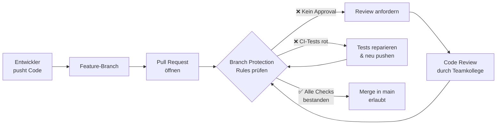

> <span style="font-size: 1.5em">:bulb:</span> **Merksatz:** Branch Protection Rules sind kein Misstrauen gegenüber dem Team, sondern ein Sicherheitsnetz. Sie verhindern unbeabsichtigte Fehler, fördern Code Reviews als Lerngelegenheit und stellen sicher, dass `main` immer in einem lauffähigen Zustand ist.

> <span style="font-size: 1.5em">🔧</span> **Praxis-Tipp:** Im Schulprojekt kann es sinnvoll sein, dass der Lehrer / Projektbetreuer als **Repository-Owner** die Möglichkeit behält, die Rules im Notfall zu umgehen (Option *"Allow administrators to bypass configured branch protections"* deaktiviert lassen — dann gelten die Rules auch für Admins).

***
Quellen

- [About protected branches - GitHub Docs](https://docs.github.com/en/repositories/configuring-branches-and-merges-in-your-repository/managing-protected-branches/about-protected-branches)
- [Managing rulesets for a repository - GitHub Docs](https://docs.github.com/en/repositories/configuring-branches-and-merges-in-your-repository/managing-rulesets/managing-rulesets-for-a-repository)
***

<div style="page-break-after: always;"></div>

## 7.2 GitHub-Planungswerkzeuge

In diesem Abschnitt lernen wir die zentralen GitHub-Planungswerkzeuge kennen: **Projects** für die visuelle Planung mit Scrumban-Boards, **Issues** als ausführliche Aufgaben- und Ticketverwaltung, **Issue-Templates** für konsistente Eingaben und **Milestones** zur Gruppierung und Zielverfolgung größerer Etappen.

Stellen Sie sich GitHub Projects wie eine digitale Pinnwand vor, auf der jede Aufgabe (Issue) als Haftnotiz klebt. Die Spalten zeigen den Fortschritt — von „Backlog" über „In Progress" bis „Done". Milestones sind dabei die übergeordneten Projektziele, auf die alle Karten gemeinsam hinarbeiten.

**Lernziele dieses Abschnitts:**

- Ein GitHub Project Board für Scrumban einrichten und anpassen
- Issues sinnvoll strukturieren und Labels/Milestones zuweisen
- Issue-Templates für konsistente Eingaben im Team erstellen
- Milestones für Release-Planung einsetzen

---

### 7.2.1 Was ist das GitHub Project Board?

Das GitHub Project Board ist eine visuelle Arbeitsfläche innerhalb von GitHub, die Karten für Issues, Pull Requests und Notizen in Spalten organisiert und so den Scrumban-Workflow transparent macht.


*Das GitHub Project Board zeigt den Arbeitsfluss in Spalten — von Backlog bis Done.*

Ein agiles Board besteht aus drei zentralen Elementen:

- **Spalten (Status-Felder):** Zeigen den aktuellen Fortschritt jeder Aufgabe — z.B. `Backlog`, `To Do`, `In Progress`, `Code Review`, `Testing`, `Done`
- **Cards:** Jede Karte repräsentiert ein Issue oder einen Pull Request
- **Custom Fields:** Zusatzinformationen pro Karte wie Priorität, Story Points oder Bounded Context

#### Einrichtung des GitHub Project Boards

Die folgenden Schritte zeigen, wie Sie ein GitHub Project Board als zentrale Planungs- und Kollaborationsfläche für das Schulprojekt aufbauen.

**1. Projekt erstellen**
- Navigieren Sie in Ihrem Repository zum Reiter **"Projects"**
- Klicken Sie auf **"New project"** (oder "Link a project" → "New project")
- Wählen Sie das Template **"Board"** aus
- Geben Sie dem Projekt einen Namen, z.B. `Schulbibliothek Entwicklung`

**2. Spalten (Status) konfigurieren**

Standardmäßig erhalten Sie "Todo", "In Progress" und "Done". Wir passen diese an unseren Scrumban-Workflow an:

- Gehen Sie in die **Settings** (Zahnrad-Icon) → **Fields** → **Status**
- Ergänzen/bearbeiten Sie die Optionen:

| Spalte | Farbe | Bedeutung |
|--------|-------|-----------|
| **Backlog** | Grau | Aufgaben, die noch nicht für den Sprint geplant sind |
| **To Do** | Rot | Im aktuellen Sprint geplant, noch nicht begonnen |
| **In Progress** | Gelb | Aktiv in Entwicklung |
| **Code Review** | Blau | Pull Request offen, wartet auf Review |
| **Testing** | Lila | Feature fertig, wird getestet |
| **Done** | Grün | Abgeschlossen und gemergt |

**3. Custom Fields hinzufügen**

Klicken Sie in der Tabellenansicht auf das **"+"** (New Field) und erstellen Sie folgende Felder:

| Feldname | Typ | Optionen |
|----------|-----|----------|
| **Priority** | Single select | `High` 🔴, `Medium` 🟡, `Low` 🟢 |
| **Story Points** | Single select | `1`, `2`, `3`, `5`, `8`, `13` (Fibonacci) |
| **Bounded Context** | Single select | `Ausleih`, `Anschaffung`, `Nutzerprofil` |

> <span style="font-size: 1.5em">:bulb:</span> **Merksatz:** Das GitHub Project Board verbindet Aufgabenplanung (Issues), Fortschrittsverfolgung (Spalten) und Kontextinformation (Custom Fields) in einer Ansicht — kein externes Tool notwendig.

#### Automatisierung der Workflows für das Project Board

GitHub Projects bietet eingebaute **Standard-Workflows**, die Karten automatisch verschieben oder Statuswerte aktualisieren, sobald bestimmte Ereignisse eintreten — ohne manuellen Aufwand für das Team.

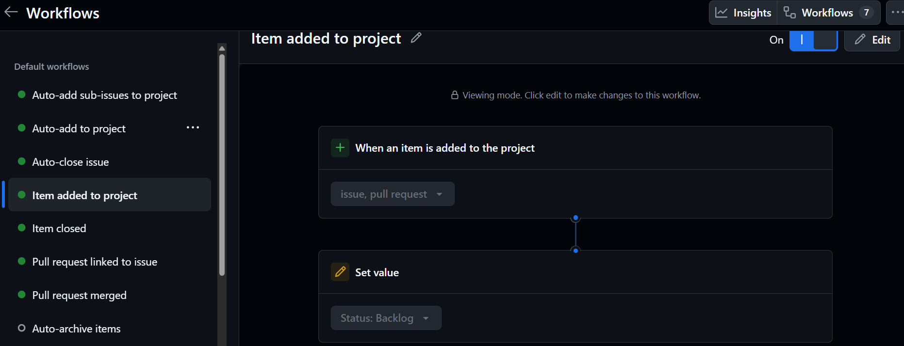
*Links: aktivierbare Default-Workflows. Rechts: Konfiguration des ausgewählten Workflows — neue Items werden automatisch in die Spalte „Backlog" verschoben.*

**Aktivierte Automationen beim Projektstart:**

| Ereignis | Automatische Aktion |
|----------|---------------------|
| Issue geschlossen | Status → `Done` |
| Pull Request gemergt | Status → `Done` |

**Weitere konfigurierbare Automationen:**

- Neues Item dem Projekt hinzugefügt → Status → `Backlog`
- Pull Request geöffnet → Status → `Code Review`
- Issue wieder geöffnet → Status → `To Do`
- Item archivieren, wenn es `Done` erreicht

**Automation konfigurieren:**

1. Öffnen Sie das Project Board
2. Klicken Sie auf das **"..."** Menü (oben rechts) → **"Workflows"**
3. Wählen Sie einen Workflow aus und klicken Sie auf **"Edit"**
4. Aktivieren oder deaktivieren Sie den Workflow mit dem Toggle

> <span style="font-size: 1.5em">🔧</span> **Praxis-Tipp:** Aktivieren Sie zumindest den Workflow *"Item added to project → set status to Backlog"*. Dadurch landen neue Issues automatisch im Backlog und das Board bleibt ohne manuellen Aufwand aktuell.

***
Quellen

- [Using the built-in automations - GitHub Docs](https://docs.github.com/en/issues/planning-and-tracking-with-projects/automating-your-project/using-the-built-in-automations)
***

---

### 7.2.2 Roadmap-Ansicht für Zeitplanung und Überblick

Die **Roadmap-Ansicht** in GitHub Projects zeigt Issues, Pull Requests und Drafts auf einer Zeitachse. Sie ist ideal, um den zeitlichen Verlauf eines Projekts zu visualisieren, Phasen zu planen und den Fortschritt über Sprints und Milestones hinweg im Blick zu behalten.

Stellen Sie sich die Roadmap wie einen Projektkalender vor: Jedes Issue ist ein Balken auf der Zeitlinie — von Start- bis Zieldatum. So erkennt man auf einen Blick, welche Aufgaben sich überschneiden, wo Engpässe drohen und wann welche Meilensteine anstehen.

#### Was leistet die Roadmap-Ansicht?

- **Zeitliche Visualisierung**: Issues werden als Balken auf einer Zeitlinie dargestellt — von `Start date` bis `Target date`
- **Zoom-Level**: Die Ansicht kann auf **Monat**, **Quartal** oder **Jahr** umgestellt werden — je nach benötigtem Detailgrad
- **Vertikale Marker**: Wichtige Datum-Referenzpunkte wie Milestones, Iterationen oder feste Termine können als vertikale Linien eingeblendet werden
- **Drag & Drop**: Start- und Enddaten können direkt in der Roadmap durch Ziehen verändert werden
- **Gruppierung**: Issues lassen sich nach Feldern gruppieren (z.B. nach Bounded Context, Sprint oder Priority)
- **Slicing**: Eine Seitenleiste filtert die Ansicht nach einem bestimmten Feldwert (z.B. nur `ausleih-kontext`)

#### Roadmap-Ansicht einrichten

**Voraussetzung:** Im Projekt müssen die Felder `Start date` und `Target date` als Datumsfelder angelegt sein (Custom Fields — siehe Kapitel 7.2.1).

**Neue Ansicht als Roadmap anlegen:**

1. Im Project Board auf das **"+"** (neue Ansicht) klicken
2. Als Layout **"Roadmap"** auswählen
3. Über **"Date fields"** (oben rechts) die Felder `Start date` und `Target date` zuweisen
4. Zoom-Level je nach Planung auf **Month**, **Quarter** oder **Year** setzen

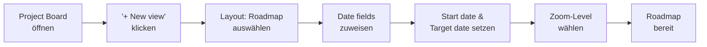

#### Vertikale Marker konfigurieren

Marker helfen, wichtige Zeitpunkte sichtbar zu machen:

1. Oben rechts auf **"Markers"** klicken
2. Gewünschte Marker aktivieren:

| Marker | Bedeutung |
|--------|-----------|
| **Milestones** | Zeigt Milestone-Fälligkeitsdaten als vertikale Linie |
| **Iterations** | Zeigt Sprint-Grenzen auf der Zeitachse |
| **Item dates** | Zeigt die Datumsfelder der Items selbst |

#### Best Practices für die Roadmap im Schulprojekt

| Best Practice | Begründung |
|--------------|------------|
| **Start- und Zieldatum für alle Issues setzen** | Nur Issues mit Datumsfeldern erscheinen als Balken |
| **Zoom je nach Zweck wählen** | Month für Sprint-Review, Quarter für Meilensteinplanung |
| **Milestones als Marker aktivieren** | Macht Release-Ziele sofort sichtbar |
| **Nach Bounded Context gruppieren** | Zeigt, welche Domänenbereiche sich zeitlich überschneiden |
| **Regelmäßig im Sprint-Planning nutzen** | Die Roadmap schafft gemeinsames Verständnis im Team |
| **Dragging nur bewusst einsetzen** | Drag & Drop ändert Felder direkt — nicht versehentlich ziehen |

#### Beispiel: Roadmap für die Schulbibliothek (Quartal-Ansicht)

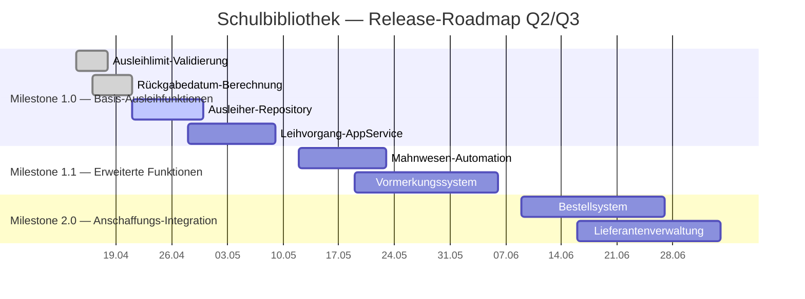

> <span style="font-size: 1.5em">:bulb:</span> **Merksatz:** Die Roadmap-Ansicht ergänzt das Kanban-Board perfekt: Das Board zeigt **wo** eine Aufgabe im Prozess steht, die Roadmap zeigt **wann** sie stattfindet. Beide Ansichten zeigen dieselben Issues — aus unterschiedlichen Perspektiven.

> <span style="font-size: 1.5em">:warning:</span> **Achtung:** Felder wie `Start date` und `Target date` müssen als **Datums-Custom-Fields** im Projekt existieren und bei den Issues befüllt sein. Ohne diese Felder sind Issues in der Roadmap nicht als Balken sichtbar.

***
Quellen

- [Customizing the roadmap layout - GitHub Docs](https://docs.github.com/en/issues/planning-and-tracking-with-projects/customizing-views-in-your-project/customizing-the-roadmap-layout)
- [About date fields - GitHub Docs](https://docs.github.com/en/issues/planning-and-tracking-with-projects/understanding-fields/about-date-fields)
- [Changing the layout of a view - GitHub Docs](https://docs.github.com/en/issues/planning-and-tracking-with-projects/customizing-views-in-your-project/changing-the-layout-of-a-view)
***

---

### 7.2.3 GitHub Issues als zentrale Aufgabenverwaltung

Issues sind das zentrale Werkzeug zur Aufgabenverwaltung in GitHub. Jedes Issue repräsentiert eine Aufgabe, einen Fehler, eine User Story oder eine technische Anforderung — und verknüpft Planung, Code und Diskussion an einem Ort.

Für die Schulbibliothek verwenden wir Issues für folgende Typen:

| Issue-Typ | Beschreibung | Beispiel |
|-----------|--------------|---------|
| **User Story** | Funktionale Anforderung aus Nutzerperspektive | *Als Schüler möchte ich Bücher online suchen* |
| **Technical Task** | Technische Implementierungsaufgabe | *Implement AusleihExemplarRepository interface* |
| **Bug** | Fehler im bestehenden Code | *Rückgabedatum wird falsch berechnet* |
| **Refactoring** | Code-Verbesserung ohne neue Funktion | *Domain Services nach Clean Architecture trennen* |
| **Enhancement** | Erweiterung bestehender Features | *Suchfilter um Autor-Suche erweitern* |
| **Documentation** | Fehlende oder veraltete Dokumentation | *API-Dokumentation für Ausleih-Endpunkte* |

#### Labels einrichten

Labels helfen dabei, Issues schnell zu kategorisieren und zu filtern. GitHub stellt Standard-Labels bereit, die wir für das Schulprojekt anpassen:

```
bug              → Fehler im Code (Farbe: Rot)
feature          → Neue Funktion (Farbe: Blau)
user-story       → User Story (Farbe: Lila)
technical-task   → Technische Aufgabe (Farbe: Grau)
documentation    → Dokumentation (Farbe: Hellblau)
refactoring      → Code-Verbesserung (Farbe: Orange)
priority-high    → Hohe Priorität (Farbe: Dunkelrot)
priority-low     → Niedrige Priorität (Farbe: Hellgrün)
needs-refinement → Noch nicht ausreichend detailliert (Farbe: Gelb)
ausleih-kontext  → Betrifft den Ausleih-Bounded-Context (Farbe: Türkis)
```

**Labels in GitHub erstellen:**
1. Repository → **Issues** → **Labels** → **New label**
2. Name, Farbe und optionale Beschreibung eingeben
3. **"Create label"** klicken

#### Issues erstellen — Schritt-für-Schritt

1. **Navigation:** Repository → Tab **"Issues"** → **"New issue"**
2. **Template wählen:** Falls definiert, erscheint eine Template-Auswahl (siehe 7.2.4)
3. **Formular ausfüllen:**
   - **Titel:** Kurz und prägnant (z.B. *"Ausleihlimit-Validierung implementieren"*)
   - **Beschreibung:** Detaillierte Erklärung mit Markdown-Formatierung
   - **Labels:** Kategorisierung zuweisen
   - **Milestone:** Optional einem Release oder Sprint zuordnen
   - **Assignees:** Verantwortliche Personen zuweisen
   - **Projects:** Issue dem Project Board hinzufügen
   - **Priority / Size / Estimate / Start date / Target date:** GitHub zeigt standardmäßig diese Felder in der Seitenleiste an, wenn das Repository ein Projektboard oder Issue-Formular verwendet. Sie helfen bei Priorisierung, Aufwandsschätzung und der zeitlichen Planung.
4. **"Submit new issue"** — das Issue erhält automatisch eine Nummer (z.B. `#23`)

> <span style="font-size: 1.5em">:mag:</span> **Hinweis:** Nutze die Felder `Priority` und `Size`, um Issues nach Dringlichkeit und Umfang zu sortieren. `Estimate`, `Start date` und `Target date` liefern zusätzlich Planungsklarheit für Scrumban und Sprint-Reviews.

**Beispiel-Issue für eine User Story:**

```markdown
Titel: [User Story] Buchsuche mit Verfügbarkeitsprüfung

Labels: user-story, ausleih-kontext, needs-refinement

## User Story
Als **Schüler** möchte ich online die Verfügbarkeit eines Buches prüfen können,
um zu wissen, ob es sich lohnt, zur Bibliothek zu gehen.

## Akzeptanzkriterien
- [ ] Suche nach Titel möglich
- [ ] Suche nach Autor möglich
- [ ] Anzeige des Verfügbarkeitsstatus (verfügbar/ausgeliehen/vorgemerkt)
- [ ] Anzeige des Standorts (Signatur)
- [ ] Bei ausgeliehenen Büchern: Anzeige des voraussichtlichen Rückgabedatums

## Technische Hinweise
- Betrifft `Ausleih-Kontext` und `Anschaffungs-Kontext`
- `AusleihExemplar` für Verfügbarkeit
- `BuchkatalogEintrag` für Titel/Autor-Suche
- Siehe DDD-Modell: Kapitel 4.1.5.4

## Aufwandsschätzung
Story Points: 5
```

> <span style="font-size: 1.5em">:bulb:</span> **Merksatz:** Ein gut strukturiertes Issue enthält immer: **Was** soll gemacht werden (Titel), **Warum** es wichtig ist (User Story / Beschreibung), **Wann** es fertig ist (Akzeptanzkriterien) und **Wie aufwändig** es ist (Story Points).

***
Quellen

- [About issues - GitHub Docs](https://docs.github.com/en/issues/tracking-your-work-with-issues/about-issues)
- [Managing labels - GitHub Docs](https://docs.github.com/en/issues/using-labels-and-milestones-to-track-work/managing-labels)
***

---

### 7.2.4 Issue-Templates definieren und konfigurieren

Issue-Templates standardisieren die Erstellung von Issues und stellen sicher, dass alle wichtigen Informationen erfasst werden. Sie sparen Zeit, verbessern die Qualität und helfen besonders neuen Team-Mitgliedern beim Einstieg.

#### Einrichtung von Issue-Templates

**Methode 1: Über die GitHub-Oberfläche (empfohlen für Einsteiger)**

1. Repository → **Settings** → **Features** → **Issues** → **"Set up templates"**
2. Vordefiniertes Template wählen (Bug Report, Feature Request) oder eigenes erstellen
3. Im Editor anpassen
4. **"Propose changes"** → committen

**Methode 2: Manuelle Erstellung im Repository**

Templates werden im Verzeichnis `.github/ISSUE_TEMPLATE/` als Dateien angelegt.

#### Unterstützte Template-Formate

GitHub unterstützt zwei Formate:

**Format 1: Markdown-Templates mit YAML-Frontmatter (`.md`)**

Einfach zu erstellen, freies Markdown — ideal für Teams mit hoher Eigenverantwortung.

```markdown
---
name: 📖 User Story
about: Neue User Story für Feature-Entwicklung
title: "[User Story] "
labels: user-story, needs-refinement
assignees: ''
---

## User Story

Als **[Rolle]** möchte ich **[Ziel/Wunsch]**, um **[Nutzen]**.

## Akzeptanzkriterien

- [ ] Kriterium 1
- [ ] Kriterium 2

## Betroffener Bounded Context

- [ ] Ausleih-Kontext (Core Domain)
- [ ] Anschaffungs-Kontext (Supporting)
- [ ] Nutzerprofil-Kontext (Generic)
- [ ] Infrastruktur

## Aufwandsschätzung

Story Points: <!-- 1, 2, 3, 5, 8, 13 -->

## Abhängigkeiten

<!-- Optional: Verweise auf andere Issues mit #Nummer -->
```

**Format 2: YAML-basierte Issue-Forms (`.yml`)**

Strukturierte Eingabeformulare mit Pflichtfeldern und Dropdowns — ideal wenn konsistente Eingaben erzwungen werden sollen.

```yaml
name: 📖 User Story
description: Neue User Story für Feature-Entwicklung
title: "[User Story] "
labels: ["user-story", "needs-refinement"]
body:
  - type: textarea
    id: user-story
    attributes:
      label: User Story
      description: Format — "Als [Rolle] möchte ich [Ziel], um [Nutzen]"
      placeholder: Als Schüler möchte ich Bücher online suchen können...
    validations:
      required: true

  - type: textarea
    id: acceptance-criteria
    attributes:
      label: Akzeptanzkriterien
    validations:
      required: true

  - type: dropdown
    id: bounded-context
    attributes:
      label: Betroffener Bounded Context
      options:
        - Ausleih-Kontext (Core Domain)
        - Anschaffungs-Kontext (Supporting)
        - Nutzerprofil-Kontext (Generic)
        - Infrastruktur
    validations:
      required: true

  - type: dropdown
    id: story-points
    attributes:
      label: Story Points
      options: ["1", "2", "3", "5", "8", "13", "21"]
```

**Vergleich der beiden Formate:**

| Kriterium | Markdown-Templates (`.md`) | YAML-basierte Issue-Forms (`.yml`) |
|-----------|---------------------------|-----------------------------------|
| **Flexibilität** | Sehr hoch — freies Markdown | Strukturiert durch Feldtypen |
| **Validierung** | Keine — Nutzer kann alles ändern | Pflichtfelder und Dropdowns möglich |
| **Benutzerfreundlichkeit** | Einfach für erfahrene Nutzer | Geführte Eingabe für alle |
| **Feldtypen** | Nur Freitext | Textarea, Dropdown, Checkboxen, Input |
| **Konsistenz** | Abhängig von Disziplin | Erzwungen durch Formular-Struktur |
| **Komplexität** | Einfache YAML-Frontmatter | Komplexere YAML-Syntax |
| **Empfohlen für** | Teams mit Erfahrung | Einsteiger-Teams, Schulprojekte |

> <span style="font-size: 1.5em">💡</span> **Best Practice:** Beginnen Sie mit Markdown-Templates für den schnellen Einstieg. Wechseln Sie zu YAML-basierten Forms, wenn Sie strengere Validierung benötigen. Beide Formate können parallel im selben Repository verwendet werden.

#### Template-Konfiguration (config.yml)

Mit einer zentralen Konfigurations-Datei steuern Sie das Verhalten der Templates:

`.github/ISSUE_TEMPLATE/config.yml`:

```yaml
blank_issues_enabled: false   # Deaktiviert Issues ohne Template
contact_links:
  - name: 📚 Dokumentation
    url: https://github.com/schule/bibliothek/wiki
    about: Bitte prüfen Sie zuerst unsere Dokumentation
  - name: 💬 Diskussionen
    url: https://github.com/schule/bibliothek/discussions
    about: Für Fragen nutzen Sie bitte die Discussions
```

> <span style="font-size: 1.5em">:warning:</span> **Achtung:** Mit `blank_issues_enabled: false` können Nutzer **kein** Issue ohne Template erstellen. Das erzwingt konsistente Eingaben, kann aber auch einschränkend wirken. Für Schulprojekte empfiehlt sich diese Option, um Qualität sicherzustellen.

#### Verwendung von Issue-Templates im Team

Nach der Einrichtung funktioniert die Nutzung wie folgt:

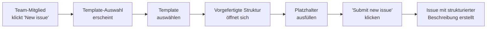

***
Quellen

- [Configuring issue templates for your repository - GitHub Docs](https://docs.github.com/en/communities/using-templates-to-encourage-useful-issues-and-pull-requests/configuring-issue-templates-for-your-repository)
- [Syntax for issue forms - GitHub Docs](https://docs.github.com/en/communities/using-templates-to-encourage-useful-issues-and-pull-requests/syntax-for-issue-forms)
***

---

### 7.2.5 Milestones und Release-Planung

Milestones helfen dabei, größere Lieferungen und Projektphasen in GitHub transparent zu planen. Sie gruppieren Issues und Pull Requests unter einem gemeinsamen Ziel und ermöglichen eine einfache Fortschrittsverfolgung über eine automatische Prozentanzeige.

Stellen Sie sich Milestones wie Etappenziele einer Wanderung vor: Jeder Etappenabschluss (Release) ist ein Milestone. Die einzelnen Issues sind die Schritte dazwischen. Erst wenn alle Schritte einer Etappe abgeschlossen sind, gilt der Milestone als erreicht.

#### Milestone-Planung für die Schulbibliothek

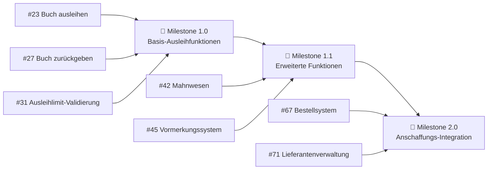

#### Milestone anlegen in GitHub

1. Repository → Tab **"Issues"** → **"Milestones"** → **"New milestone"**
2. **Titel** eingeben, z.B. `Release 1.0: Basis-Ausleihfunktionen`
3. Optional: **Beschreibung** mit den wichtigsten Zielen des Milestones
4. Optional: **Fälligkeitsdatum** setzen
5. **"Create milestone"** klicken

#### Issues einem Milestone zuordnen

- Öffne ein Issue → Seitenleiste → **"Milestone"** → gewünschten Milestone auswählen
- Oder: Beim Erstellen des Issues direkt unter "Milestone" zuordnen
- Oder: Mehrere Issues auf einmal zuordnen über die Issues-Listenansicht (Checkbox + "Milestone" Dropdown)

#### Tipps für effektive Milestone-Planung

| Tipp | Begründung |
|------|------------|
| Milestones für Releases/Iterationsziele, nicht für Tasks | Granularität passt — Issues sind die Tasks |
| Beschreibende Titel verwenden | `Release 1.0: Basissystem` ist besser als `v1.0` |
| Fälligkeitsdaten setzen | Erzeugt Verbindlichkeit für das Team |
| Regelmäßig Fortschritt prüfen | Prozentanzeige zeigt auf einen Blick, wie weit der Sprint ist |
| Nicht zu viele offene Milestones gleichzeitig | Max. 2-3 aktive Milestones — sonst verliert das Team den Fokus |

> <span style="font-size: 1.5em">:bulb:</span> **Merksatz:** Milestones verbinden Planung und Realität: Die Prozentanzeige zeigt jederzeit ehrlich, wie viel vom Sprint noch übrig ist. Das macht Milestone-Überprüfungen im Daily-Standup besonders wertvoll.

***
Quellen

- [About milestones - GitHub Docs](https://docs.github.com/en/issues/using-labels-and-milestones-to-track-work/about-milestones)
- [Creating and editing milestones for issues and pull requests - GitHub Docs](https://docs.github.com/en/issues/using-labels-and-milestones-to-track-work/creating-and-editing-milestones-for-issues-and-pull-requests)
***

<div style="page-break-after: always;"></div>

## 7.3 Entwicklungsworkflow mit GitHub Flow

In diesem Abschnitt betrachten wir den täglichen Entwicklungsworkflow: Wie wählen wir eine Branching-Strategie? Wie benennen wir Branches konsistent? Wie funktionieren Pull Requests und Code Reviews? Und wie verknüpfen wir Issues, Branches und Pull Requests zu einem durchgängigen Workflow?

Stellen Sie sich den Entwicklungsworkflow wie eine Montagelinie vor: Jede Aufgabe (Issue) durchläuft klar definierte Stationen — vom Backlog über die Entwicklung (Feature-Branch) zur Qualitätskontrolle (Code Review via Pull Request) bis zur Auslieferung (Merge in `main`).

**Lernziele dieses Abschnitts:**
- Die drei wichtigsten Branching-Strategien kennen und vergleichen können
- GitHub Flow für das Schulprojekt begründet auswählen
- Branch-Namen nach Konvention vergeben
- Pull Requests strukturiert erstellen und reviewen
- Issues, Branches und PRs durchgängig verknüpfen

---

### 7.3.1 Branching-Strategien im Vergleich

Eine **Branching-Strategie** legt fest, wie das Team Branches erstellt, benennt, zusammenführt und verwaltet. Sie beeinflusst direkt, wie schnell Features integriert werden, wie stabil der `main`-Branch ist und wie komplex die tägliche Arbeit ist.

Wir stellen drei etablierte Strategien vor:

#### GitHub Flow

GitHub Flow ist eine schlanke Strategie für kontinuierliche Deployments. Sie basiert auf einem einzigen stabilen `main`-Branch und kurzlebigen Feature-Branches.

**Branch-Struktur:**
- **`main`** — immer stabil und deploybar
- **`feature/*`** — kurzlebige Entwicklungs-Branches, werden via PR gemergt
- Keine Releases- oder Hotfix-Branches

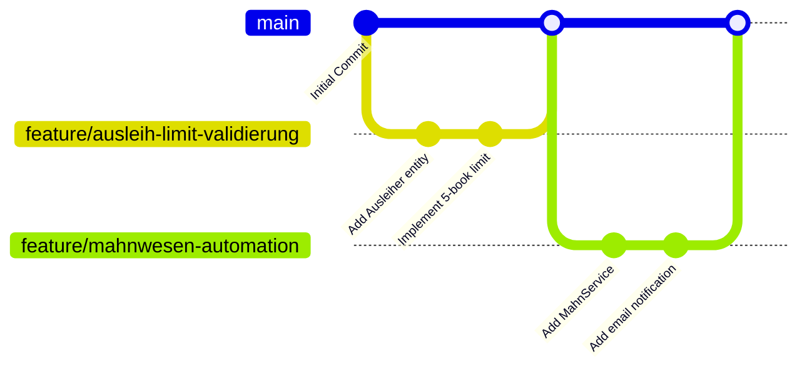

**Geeignet wenn:**
- ✓ Kontinuierliche Deployments (mehrmals pro Woche/Tag)
- ✓ Web-Anwendungen, SaaS, APIs
- ✓ Kleine bis mittlere Teams (2–10 Entwickler)

**Nicht geeignet wenn:**
- ✗ Mehrere parallele Versionen gepflegt werden müssen
- ✗ Geplante, quartalsweise Release-Termine
- ✗ App-Store-Releases mit langen Review-Prozessen

> <span style="font-size: 1.5em">:warning:</span> **Achtung:** Vermeiden Sie lange Feature-Branches! Je länger ein Branch von `main` getrennt ist, desto schwieriger wird das spätere Mergen. Features sollten klein gehalten und mindestens wöchentlich integriert werden.

#### Git Flow

Git Flow ist eine umfangreichere Strategie für geplante Release-Zyklen mit klar definierten Branch-Typen und einer festen Hierarchie.

**Branch-Struktur:**
- **`main`** — Produktions-Code, immer stabil
- **`develop`** — Integrations-Branch für Features
- **`feature/*`** — wird in `develop` gemergt
- **`release/*`** — Release-Vorbereitung
- **`hotfix/*`** — dringende Production-Fixes von `main`

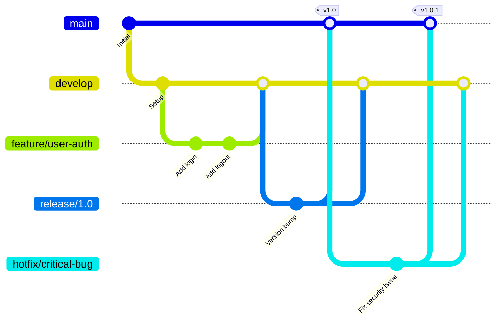

**Geeignet wenn:**
- ✓ Geplante Release-Zyklen (monatlich/quartalsweise)
- ✓ Mehrere Versionen parallel (v1.x und v2.x gleichzeitig)
- ✓ Enterprise-Software, Desktop- oder Mobile Apps

**Nicht geeignet wenn:**
- ✗ Continuous Deployment — zu komplex für häufige Deployments
- ✗ Kleine Teams — zu viel Overhead durch viele Branches

#### Trunk-Based Development

Trunk-Based Development setzt auf minimale Branch-Komplexität und maximal häufige Integration direkt auf `main`.

**Kernprinzipien:**
- Direkter Commit auf `main` (erfahrene Teams) oder sehr kurzlebige Branches (max. 1–2 Tage)
- Unfertige Features werden per **Feature Flags** deaktiviert
- Umfangreiche Test-Automatisierung ist Pflicht

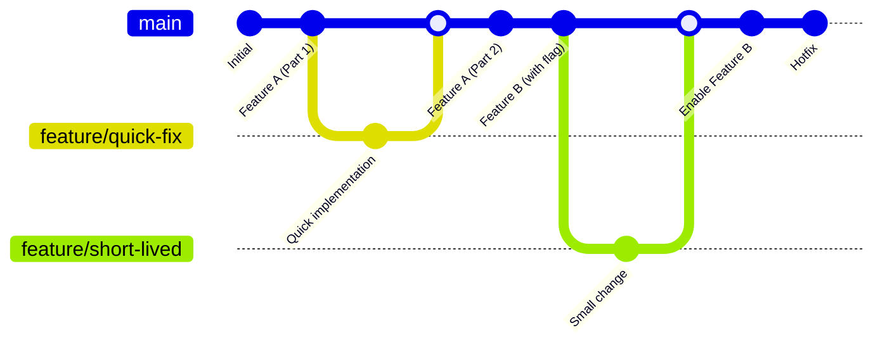

**Geeignet wenn:**
- ✓ Continuous Deployment (mehrmals täglich)
- ✓ Kleine, erfahrene Teams mit hoher Disziplin
- ✓ Microservices mit unabhängigen Deployments

**Nicht geeignet wenn:**
- ✗ Unerfahrene Teams — Risiko von broken builds ist hoch
- ✗ Komplexe Features mit Feature Flags zu verwalten

#### Vergleich der drei Strategien

| Kriterium | GitHub Flow | Git Flow | Trunk-Based |
|-----------|-------------|----------|-------------|
| **Komplexität** | Niedrig | Hoch | Sehr niedrig |
| **Branch-Anzahl** | 2–5 aktive | 5–15 aktive | 0–3 aktive |
| **Release-Zyklus** | Kontinuierlich | Geplant (Wochen/Monate) | Kontinuierlich (täglich) |
| **Team-Größe** | 2–10 | 5–20+ | 2–8, erfahren |
| **Lernkurve** | Flach | Steil | Mittel |
| **Code-Review** | Ja (Pull Requests) | Ja (Pull Requests) | Optional |
| **Geeignet für** | Web-Apps, SaaS | Enterprise, Mobile | Microservices, Startups |

#### Entscheidung für die Schulbibliothek: GitHub Flow

Wir wählen **GitHub Flow** aus folgenden Gründen:

| Faktor | Begründung |
|--------|------------|
| **Schüler-Team** | Einfach zu erlernen, klare Regeln: Branch → PR → Review → Merge |
| **Projektgröße** | 3–5 Entwickler, Web-Anwendung, keine parallelen Versionen |
| **Scrumban** | 2-wöchige Sprints passen zu wöchentlicher Feature-Integration |
| **Qualitätssicherung** | PRs erzwingen Code-Reviews — pädagogisch wertvoll |
| **GitHub-Integration** | Projects, Actions und Issues optimal für GitHub Flow ausgelegt |

> <span style="font-size: 1.5em">:bulb:</span> **Merksatz:** Die Branching-Strategie ist kein Dogma, sondern ein Werkzeug. GitHub Flow bietet für das Schulprojekt die beste Balance zwischen Einfachheit, Qualitätssicherung und Lerneffekt. Sie kann später angepasst werden, wenn sich Anforderungen oder Team-Reife ändern.

***
Quellen

- [GitHub Flow - GitHub Docs](https://docs.github.com/en/get-started/using-github/github-flow)
- [Gitflow Workflow (Atlassian)](https://www.atlassian.com/git/tutorials/comparing-workflows/gitflow-workflow)
- [Trunk-Based Development (trunkbaseddevelopment.com)](https://trunkbaseddevelopment.com/)
***

---

### 7.3.2 Branch-Naming-Konventionen

Konsistente Branch-Namen helfen dem Team, den Zweck eines Branches auf einen Blick zu erfassen und erleichtern die Navigation, das Filtern und die CI/CD-Automatisierung.

#### Präfixe nach Zweck

| Präfix | Verwendung | Beispiel |
|--------|------------|---------|
| `feature/` | Neue Funktionen | `feature/buchsuche-api` |
| `bugfix/` | Fehlerbehebungen | `bugfix/ausleihdatum-anzeige` |
| `hotfix/` | Dringende Production-Fixes | `hotfix/login-absturz` |
| `refactor/` | Code-Verbesserungen ohne neue Funktion | `refactor/repository-cleanup` |
| `test/` | Test-Ergänzungen | `test/mahnservice-unit-tests` |
| `doc/` | Dokumentations-Updates | `doc/api-anleitung-aktualisieren` |

#### Regeln für Branch-Namen

- ✓ **Bindestriche** (`-`) zur Worttrennung — keine Leerzeichen, keine Unterstriche
- ✓ **Issue-Nummer** integrieren — verknüpft Branch direkt mit der Aufgabe
- ✓ **Kurz und prägnant** — fokussiert auf die Hauptaufgabe
- ✗ Generische Begriffe wie `update`, `changes`, `stuff` vermeiden

#### Namenskonvention für die Schulbibliothek

```
feature/[issue-nr]-[kurzbeschreibung]   feature/42-mahnwesen-automation
bugfix/[issue-nr]-[kurzbeschreibung]    bugfix/57-rueckgabedatum-fehler
hotfix/[kurzbeschreibung]               hotfix/login-absturz
refactor/[kurzbeschreibung]             refactor/domain-services-optimieren
doc/[kurzbeschreibung]                  doc/api-dokumentation-erweitern
```

> <span style="font-size: 1.5em">:bulb:</span> **Merksatz:** GitHub erkennt Issue-Nummern in Branch-Namen automatisch und zeigt die Verknüpfung in der Issue-Ansicht an. Ein Branch `feature/42-mahnwesen` erscheint direkt bei Issue `#42` — ohne manuelles Verknüpfen.

> <span style="font-size: 1.5em">🔧</span> **Praxis-Tipp:** Dokumentieren Sie die Namenskonvention in der `CONTRIBUTING.md` (siehe Kapitel 7.1.2). So können neue Team-Mitglieder sofort nach Konvention arbeiten, ohne fragen zu müssen.

***
Quellen

- [GitHub Branching Name Best Practices (dev.to)](https://dev.to/jps27cse/github-branching-name-best-practices-49ei)
***

---

### 7.3.3 Pull Requests und Code Reviews

Änderungen werden nicht direkt auf `main` gemacht, sondern in Feature-Branches entwickelt. Nach Fertigstellung wird via **Pull Request (PR)** eine Integration in `main` vorgeschlagen. Der PR ist gleichzeitig Qualitätstor, Diskussionsplattform und Dokumentation der Änderung.

#### Der Pull-Request-Workflow

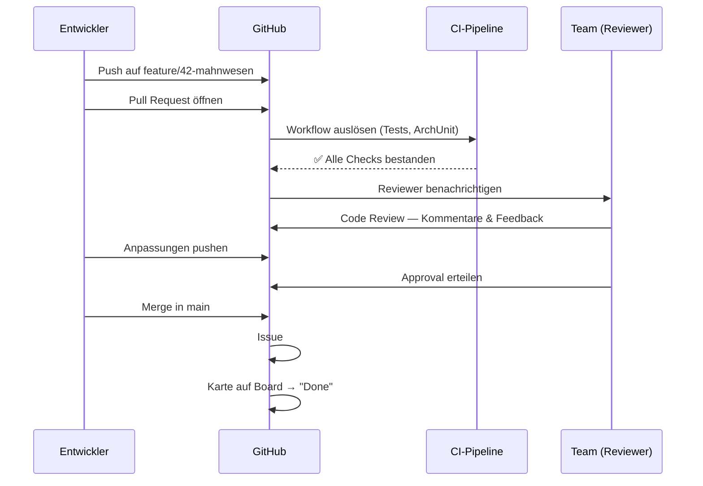

#### Praktisches Beispiel: Feature "Ausleihlimit"

**Schritt 1 — Issue erstellen:** `#12 Als System soll sichergestellt sein, dass ein Schüler maximal 5 Bücher ausleihen kann`

**Schritt 2 — Branch erstellen:** `feature/12-ausleih-limit-validierung`

**Schritt 3 — Implementierung mit aussagekräftigen Commits:**

```bash
git commit -m "feat(domain): Add Ausleiher aggregate with loan limit"
git commit -m "feat(domain): Throw AusleihLimitErreichtException at 5 books"
git commit -m "test(domain): Add unit tests for loan limit validation"
```

**Schritt 4 — Implementierungsbeispiel (Domain-Layer):**

```java
// domain/aggregates/Ausleiher.java
public class Ausleiher {
    private static final int MAX_AUSLEIHEN_SCHUELER = 5;

    private final AusleiherId id;
    private final Rolle rolle;
    private final List<Ausleihe> ausleihen = new ArrayList<>();

    public void leiheBuchAus(AusleihExemplar exemplar) {
        if (rolle == Rolle.SCHUELER && ausleihen.size() >= MAX_AUSLEIHEN_SCHUELER) {
            throw new AusleihLimitErreichtException(
                String.format("Schüler dürfen maximal %d Bücher ausleihen",
                    MAX_AUSLEIHEN_SCHUELER)
            );
        }
        ausleihen.add(new Ausleihe(exemplar, LocalDate.now().plusWeeks(2)));
    }
}
```

**Schritt 5 — Pull Request öffnen** mit Titel `feat(domain): Implement 5-book loan limit for students` und `Closes #12` in der Beschreibung

> <span style="font-size: 1.5em">:bulb:</span> **Merksatz:** `Closes #12` in der PR-Beschreibung bewirkt, dass Issue `#12` beim Merge **automatisch geschlossen** wird — keine manuelle Nacharbeit notwendig.

#### Tipps für gute Code Reviews

| Für Reviewer | Für den PR-Ersteller |
|--------------|---------------------|
| Konstruktives Feedback — nicht persönlich | PR klein halten (max. 400 Zeilen) |
| Konkrete Verbesserungsvorschläge geben | Beschreibung ausfüllen, Kontext erklären |
| Fragen stellen statt Befehle erteilen | Auf Feedback eingehen, nicht verteidigen |
| Architektur-Prinzipien prüfen (DDD, Clean) | Tests mitliefern |
| Zeitnah reviewen (innerhalb 24h) | Reviewer explizit zuweisen |

***
Quellen

- [About pull requests - GitHub Docs](https://docs.github.com/en/pull-requests/collaborating-with-pull-requests/proposing-changes-to-your-work-with-pull-requests/about-pull-requests)
- [About pull request reviews - GitHub Docs](https://docs.github.com/en/pull-requests/collaborating-with-pull-requests/reviewing-changes-in-pull-requests/about-pull-request-reviews)
***

---

### 7.3.4 PR-Templates definieren

Ähnlich wie Issue-Templates (siehe 7.2.4) sorgen **Pull-Request-Templates** dafür, dass jeder PR eine konsistente, vollständige Beschreibung enthält. Das Template wird automatisch in das Beschreibungsfeld eingefügt, wenn ein Entwickler einen neuen PR öffnet.

#### Speicherort und Einrichtung

GitHub sucht das PR-Template an folgenden Orten (Priorität von oben nach unten):

| Speicherort | Dateiname |
|-------------|-----------|
| Repository-Root | `pull_request_template.md` |
| `docs/` Verzeichnis | `docs/pull_request_template.md` |
| `.github/` Verzeichnis *(empfohlen)* | `.github/pull_request_template.md` |

**Datei anlegen:**
```bash
# Lokal im Repository-Verzeichnis
mkdir -p .github
# Datei erstellen und im Editor befüllen
```

Oder über GitHub-UI: **"Add file"** → **"Create new file"** → Dateiname `.github/pull_request_template.md` eingeben.

#### PR-Template für die Schulbibliothek

```markdown
## Beschreibung
<!-- Kurze Zusammenfassung: Was wurde implementiert/geändert und warum? -->

## Verknüpftes Issue
Closes #

## Typ der Änderung
- [ ] 🐛 Bug-Fix
- [ ] ✨ Neues Feature
- [ ] 💥 Breaking Change
- [ ] 📚 Dokumentation
- [ ] ♻️ Refactoring
- [ ] 🧪 Tests

## Betroffener Bounded Context
- [ ] Ausleih-Kontext (Core Domain)
- [ ] Anschaffungs-Kontext (Supporting)
- [ ] Nutzerprofil-Kontext (Generic)
- [ ] Infrastruktur

## Checkliste vor dem Review
- [ ] ✅ Code kompiliert fehlerfrei (`mvn clean compile`)
- [ ] 🧪 Unit-Tests geschrieben/aktualisiert und grün
- [ ] 🏛️ Clean-Architecture-Prinzipien eingehalten
- [ ] 📖 Dokumentation aktualisiert (Javadoc, README)
- [ ] 🔀 Branch ist up-to-date mit `main`

## Hinweise für Reviewer
<!-- Optional: Worauf sollten Reviewer besonders achten? -->
```

> <span style="font-size: 1.5em">🔧</span> **Praxis-Tipp:** Das Template im `.github/`-Verzeichnis ablegen. So bleiben alle GitHub-spezifischen Konfigurationen (Workflows, Issue-Templates, PR-Template) an einem zentralen Ort und das Repository-Root bleibt übersichtlich.

| Vorteil | Beschreibung |
|---------|--------------|
| **Konsistenz** | Jeder PR folgt derselben Struktur |
| **Vollständigkeit** | Wichtige Informationen werden nicht vergessen |
| **Effizienz** | Reviewer finden alle Infos schnell |
| **Onboarding** | Neue Mitglieder wissen sofort, was erwartet wird |
| **Qualität** | Checkliste erinnert an Best Practices |

***
Quellen

- [Creating a pull request template for your repository - GitHub Docs](https://docs.github.com/en/communities/using-templates-to-encourage-useful-issues-and-pull-requests/creating-a-pull-request-template-for-your-repository)
***

---

### 7.3.5 Verbindung zwischen Issues, Branches und Pull Requests

Der vollständige GitHub-Workflow verbindet alle Werkzeuge zu einem durchgängigen Prozess: Issues bilden die Planung, Branches die Entwicklung, Commits die Änderungshistorie und Pull Requests die Qualitätssicherung.

#### Der vollständige Workflow

<div style="width: 30%; margin: 0 auto;">

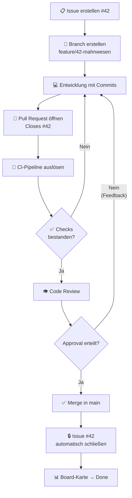

</div>

#### Konkrete Umsetzung: Feature "Mahnwesen" (#42)

**Issue `#42` anlegen:**
```
Titel: [Feature] Automatisches Mahnwesen für überfällige Ausleihen
Labels: feature, ausleih-kontext
Milestone: 1.1 - Erweiterte Funktionen
Story Points: 8
```

**Branch direkt aus Issue erstellen** (GitHub-UI → "Create a branch"):
→ erzeugt automatisch `42-feature-automatisches-mahnwesen`  
*(alternativ manuell: `feature/42-mahnwesen-automation`)*

**Commits nach Conventional Commits:**
```bash
git commit -m "feat(domain): Add Mahnung entity to Ausleiher aggregate"
git commit -m "feat(domain): Implement MahnService with overdue detection"
git commit -m "test(domain): Add unit tests for Mahnstufen logic"
git commit -m "feat(infra): Add email notification for Mahnungen"
```

**Pull Request öffnen:**
```
Titel: feat(domain): Implement automatic Mahnwesen

Beschreibung:
Implementiert das Mahnwesen aus dem DDD-Modell (Kapitel 4.1.4.3).
Der MahnService findet täglich überfällige Ausleihen und versendet Mahnungen.

Details:
- Mahnung als Entity im Ausleiher-Aggregat
- MahnService als Domain Service
- 3 Mahnstufen mit steigenden Gebühren
- E-Mail-Versand über Infrastructure-Layer

Closes #42
```

#### Scrumban-Sprintplanung mit GitHub Projects

Im **Scrumban-Ansatz** kombinieren wir Scrum-Elemente (Sprints, Planning) mit Kanban-Prinzipien (kontinuierlicher Flow, WIP-Limits):

**Sprint 1 — Basis-Ausleihfunktionen (2 Wochen):**
- **Sprint-Ziel:** Ein Schüler kann ein Buch ausleihen und zurückgeben
- **Kapazität:** 40 Story Points

| Issue | Beschreibung | Story Points |
|-------|--------------|-------------|
| #23 | Ausleihlimit-Validierung | 5 SP |
| #27 | Rückgabedatum-Berechnung | 3 SP |
| #31 | ISBN-ValueObject | 2 SP |
| #35 | Ausleiher-Repository | 8 SP |
| #38 | AusleihExemplar-Aggregat | 8 SP |
| #40 | Leihvorgang-ApplicationService | 13 SP |
| **Gesamt** | | **39 SP** |

**WIP-Limits:**
- **In Progress:** max. 3 Issues gleichzeitig
- **Code Review:** max. 4 PRs gleichzeitig
- **Testing:** max. 2 Features gleichzeitig

> <span style="font-size: 1.5em">:bulb:</span> **Merksatz:** **WIP-Limits** (Work In Progress) verhindern, dass zu viele Aufgaben gleichzeitig begonnen werden. Sie zwingen das Team, Aufgaben zu beenden, bevor neue gestartet werden — das erhöht die Gesamtdurchlaufgeschwindigkeit.

**Daily-Standup mit GitHub-Board:**
Das Team trifft sich täglich für 15 Minuten und nutzt das GitHub-Board als zentrale Informationsquelle:
- Was ist heute in "Testing" oder "Code Review" — gibt es Blocker?
- Welche PRs warten länger als 24h auf Review?
- Was kann von "In Progress" nach "Code Review" verschoben werden?

***
Quellen

- [Linking a pull request to an issue - GitHub Docs](https://docs.github.com/en/issues/tracking-your-work-with-issues/using-issues/linking-a-pull-request-to-an-issue)
- [About project boards - GitHub Docs](https://docs.github.com/en/issues/planning-and-tracking-with-projects/learning-about-projects/about-projects)
***

<div style="page-break-after: always;"></div>

## 7.4 CI/CD mit GitHub Actions

Stellen Sie sich vor, jedes Mal wenn ein Teammitglied einen Pull Request öffnet, überprüft ein unsichtbarer Qualitätswächter automatisch den Code: Er kompiliert das Projekt, führt alle Tests aus, misst die Code-Abdeckung und meldet das Ergebnis direkt im Pull Request. Erst wenn dieser Wächter grünes Licht gibt, darf der Code gemergt werden. Genau das leisten **GitHub Actions Workflows** in Kombination mit CI/CD-Pipelines.

> <span style="font-size: 1.5em">:bulb:</span> **Merksatz:** **CI (Continuous Integration)** bedeutet, dass Code-Änderungen kontinuierlich und automatisch getestet werden, sobald sie ins Repository gepusht werden. **CD (Continuous Delivery/Deployment)** erweitert dies: Getesteter Code wird automatisch in eine Test- oder Produktionsumgebung ausgeliefert.

**Lernziele dieses Abschnitts:**
- Den Aufbau einer GitHub Actions Workflow-Datei verstehen
- Einen vollständigen CI-Workflow für Pull Requests erstellen
- Den Unterschied zwischen GitHub-hosted und Self-hosted Runnern erklären
- Service-Container für Integrationstests einsetzen

---

### 7.4.1 Anatomie eines GitHub Actions Workflows

GitHub Actions Workflows sind YAML-Dateien im Verzeichnis `.github/workflows/`. Sie beschreiben **wann** etwas passiert (*Trigger/Event*), **was** passiert (*Jobs mit Steps*) und **wo** es ausgeführt wird (*Runner*).

#### Die fünf Kernkonzepte

| Konzept | Beschreibung | Beispiel |
|---------|--------------|---------|
| **Workflow** | Die gesamte Automatisierungsdatei | `.github/workflows/ci.yml` |
| **Event** | Das auslösende Ereignis | `pull_request`, `push` |
| **Job** | Gruppe von Steps auf einem Runner | `build-and-test` |
| **Step** | Einzelner Befehl oder Action | `mvn clean install` |
| **Runner** | VM, die den Job ausführt | `ubuntu-latest` |

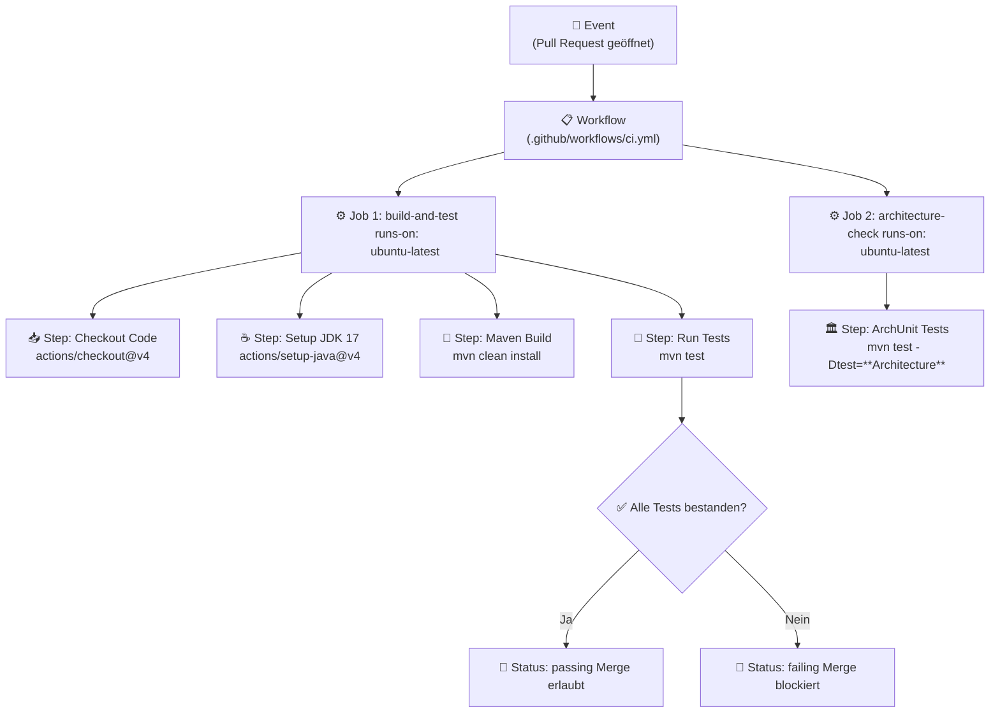

#### Grundstruktur einer Workflow-Datei

```yaml
# .github/workflows/ci.yml
name: CI Pipeline          # Anzeigename in der GitHub-Oberfläche

on:                        # Trigger: Wann soll der Workflow laufen?
  pull_request:
    branches: [ main ]
  push:
    branches: [ main ]

jobs:                      # Was soll ausgeführt werden?
  build-and-test:
    runs-on: ubuntu-latest # Wo soll es laufen? (Runner)
    steps:
      - name: Code auschecken
        uses: actions/checkout@v4   # Fertige Action aus dem Marketplace
      - name: Build
        run: mvn clean install      # Shell-Befehl direkt ausführen
```

> <span style="font-size: 1.5em">:mag:</span> **Vertiefung: `uses` vs. `run`**
>
> - **`uses`:** Verwendet eine fertige, wiederverwendbare *GitHub Action* aus dem Marketplace (z.B. `actions/checkout@v4` lädt den Repository-Code herunter). Das `@v4` ist die Version — immer eine Version angeben für reproduzierbare Builds.
> - **`run`:** Führt direkt einen Shell-Befehl aus (Bash unter Linux/macOS, PowerShell/cmd unter Windows).

***
Quellen

- [Understanding GitHub Actions - GitHub Docs](https://docs.github.com/en/actions/learn-github-actions/understanding-github-actions)
- [Workflow syntax for GitHub Actions - GitHub Docs](https://docs.github.com/en/actions/reference/workflows-and-actions/workflow-syntax)
***

---

### 7.4.2 CI-Workflow bei Pull Requests

Der wichtigste Einsatzort von CI-Workflows ist der **Pull Request**. Sobald ein Entwickler einen PR öffnet oder aktualisiert, startet GitHub automatisch die konfigurierte Pipeline. Das Ergebnis erscheint direkt im PR als Status-Check — der Merge-Button bleibt gesperrt, solange Checks fehlschlagen (sofern Branch Protection Rules aktiv sind, siehe Kapitel 7.1.3).

#### Ablauf

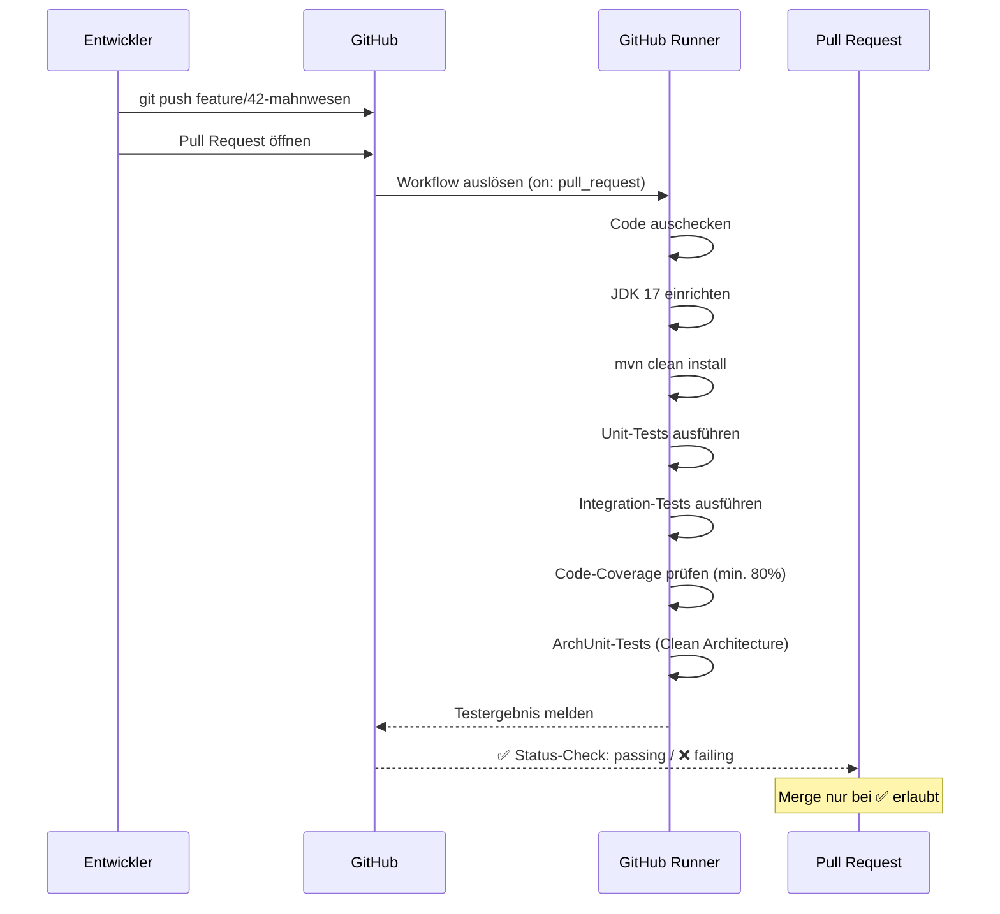

#### Vollständiger CI-Workflow für die Schulbibliothek

```yaml
# .github/workflows/pull-request-ci.yml
name: Pull Request CI

on:
  pull_request:
    branches: [ main ]
    types: [ opened, synchronize, reopened ]

jobs:
  # Job 1: Build und Tests
  build-and-test:
    name: 🧪 Build & Test
    runs-on: ubuntu-latest

    steps:
      - name: 📥 Code auschecken
        uses: actions/checkout@v4

      - name: ☕ JDK 17 einrichten
        uses: actions/setup-java@v4
        with:
          java-version: '17'
          distribution: 'temurin'
          cache: 'maven'            # Maven-Abhängigkeiten cachen → schnellere Builds

      - name: 🔨 Projekt bauen
        run: mvn clean install -DskipTests

      - name: 🧪 Unit-Tests ausführen
        run: mvn test -Dtest="**/unit/**/*Test"

      - name: 🔗 Integrations-Tests ausführen
        run: mvn test -Dtest="**/integration/**/*Test"

      - name: 📊 Code-Coverage prüfen (min. 80% im Domain-Layer)
        run: |
          mvn jacoco:report
          mvn jacoco:check \
            -Djacoco.coverage.minimum=0.80 \
            -Djacoco.includes=com/schule/bibliothek/domain/**

      - name: 📤 Coverage-Report hochladen
        uses: codecov/codecov-action@v4
        with:
          files: ./target/site/jacoco/jacoco.xml
          fail_ci_if_error: false

  # Job 2: Architektur-Validierung (läuft erst nach Job 1)
  architecture-check:
    name: 🏛️ Clean Architecture Check
    runs-on: ubuntu-latest
    needs: build-and-test

    steps:
      - name: 📥 Code auschecken
        uses: actions/checkout@v4

      - name: ☕ JDK 17 einrichten
        uses: actions/setup-java@v4
        with:
          java-version: '17'
          distribution: 'temurin'
          cache: 'maven'

      - name: 🏛️ ArchUnit-Tests ausführen
        run: mvn test -Dtest="**/architecture/**/*Test"
```

#### Was dieser Workflow prüft und warum

| Schritt | Was wird geprüft? | Warum wichtig? |
|---------|-------------------|----------------|
| **Build** | Kompiliert der Code fehlerfrei? | Syntaxfehler werden sofort erkannt |
| **Unit-Tests** | Funktionieren Domain-Methoden korrekt? | Core Business-Logik ist korrekt |
| **Integration-Tests** | Funktionieren Repositories mit echter DB? | Datenbank-Interaktionen sind stabil |
| **Coverage** | Mind. 80% des Domain-Codes getestet? | Ausreichende Testabdeckung sichergestellt |
| **ArchUnit** | Hält Code Clean-Architecture-Regeln ein? | Domain-Layer bleibt unabhängig von Infrastructure |

#### CI-Checks mit Branch Protection Rules verknüpfen

Damit die CI-Checks als **Pflicht-Gate** wirken (kein Merge bei roten Tests), müssen sie in den Branch Protection Rules als Required Status Checks eingetragen werden (siehe Kapitel 7.1.3):

- Repository → **Settings** → **Rules** → Ruleset `Protect main` öffnen
- **Require status checks to pass** aktivieren
- Status-Checks hinzufügen: `🧪 Build & Test` und `🏛️ Clean Architecture Check`

Nach erfolgreicher Konfiguration sieht ein PR mit bestandenen Checks so aus:

```
Pull Request: feat(domain): Implement Mahnwesen
──────────────────────────────────────────────────
Checks
  ✅  🧪 Build & Test               — passed in 2m 34s
  ✅  🏛️ Clean Architecture Check   — passed in 1m 12s
──────────────────────────────────────────────────
✅ All checks have passed
   [ Merge pull request ]   ← Button ist aktiv
```

***
Quellen

- [Events that trigger workflows: pull_request - GitHub Docs](https://docs.github.com/en/actions/reference/workflows-and-actions/events-that-trigger-workflows#pull_request)
- [About protected branches - GitHub Docs](https://docs.github.com/en/repositories/configuring-branches-and-merges-in-your-repository/managing-protected-branches/about-protected-branches)
***

---

### 7.4.3 GitHub-hosted Runner vs. Self-hosted Runner

Workflows können auf zwei Typen von **Runnern** ausgeführt werden: auf von GitHub verwalteten Cloud-VMs oder auf einem eigenen, lokal betriebenen Rechner.

**GitHub-hosted Runner** sind virtuelle Maschinen, die GitHub für jede Workflow-Ausführung frisch bereitstellt. Nach Abschluss des Jobs wird die VM automatisch gelöscht — keine Konfiguration notwendig.

#### Verfügbare GitHub-hosted Runner

| Label (`runs-on`) | Betriebssystem | CPU | RAM | Freies Kontingent |
|-------------------|----------------|-----|-----|-------------------|
| `ubuntu-latest` | Ubuntu 24.04 | 4 Cores | 16 GB | ✅ 2.000 Min./Monat (Free) |
| `ubuntu-22.04` | Ubuntu 22.04 | 4 Cores | 16 GB | ✅ enthalten |
| `windows-latest` | Windows Server 2022 | 4 Cores | 16 GB | ✅ 500 Min./Monat (Free) |
| `macos-latest` | macOS 14 (Apple Silicon) | 3 Cores | 7 GB | ✅ 10 Min./Monat (Free) |

> <span style="font-size: 1.5em">:bulb:</span> **Merksatz:** Für **öffentliche** Repositories sind GitHub-hosted Runner kostenlos und unlimitiert. Für **private** Repositories gilt ein monatliches Freikontingent — für Schulprojekte in der Regel ausreichend.

**Self-hosted Runner** sind eigene Rechner (Laptop, Desktop-PC, Schul-Server), die als Runner bei GitHub registriert werden. Sie eignen sich, wenn spezielle Hardware/Software benötigt wird, Kosten gespart werden sollen oder Zugriff auf lokale Ressourcen (z.B. lokale Datenbank) notwendig ist.

#### Vergleich

| Kriterium | GitHub-hosted Runner | Self-hosted Runner |
|-----------|---------------------|-------------------|
| **Einrichtungsaufwand** | Keiner — sofort nutzbar | Einmalige Installation nötig |
| **Betriebsaufwand** | Keiner (GitHub kümmert sich) | Team verantwortlich für Wartung |
| **Kosten** | Kostenlos für Public Repos | Nur Stromkosten / eigene Hardware |
| **Isolation** | Frische VM bei jedem Run | Persistente Umgebung (Vorsicht: Zustand!) |
| **Flexibilität** | Standardumgebung, erweiterbar | Volle Kontrolle über Software/Hardware |
| **Sicherheit** | Sehr hoch (isolierte VM) | Eigene Verantwortung |
| **Geeignet für** | Standard-CI-Pipelines | Spezielle Anforderungen, lokale Ressourcen |

> <span style="font-size: 1.5em">:warning:</span> **Sicherheitshinweis:** Self-hosted Runner dürfen **niemals für öffentliche Repositories** verwendet werden! Externe Nutzer könnten via Pull Requests Workflows mit bösartigem Code auf dem Runner ausführen. Für private Schulprojekte ist dies unproblematisch.

***
Quellen

- [About GitHub-hosted runners - GitHub Docs](https://docs.github.com/en/actions/using-github-hosted-runners/about-github-hosted-runners)
- [About self-hosted runners - GitHub Docs](https://docs.github.com/en/actions/hosting-your-own-runners/managing-self-hosted-runners/about-self-hosted-runners)
***

---

### 7.4.4 Self-hosted Runner lokal einrichten

Ein Self-hosted Runner auf einem lokalen Entwicklungsrechner oder Schul-Server ermöglicht schnellere Builds (kein Up-/Download-Overhead) und direkten Zugriff auf lokal installierte Datenbanken.

#### Schritt-für-Schritt: Runner registrieren

**1. GitHub-Einstellungen öffnen**
- Repository → **Settings** → **Actions** → **Runners** → **"New self-hosted runner"**
- Betriebssystem auswählen (Linux / Windows / macOS)
- Den angezeigten Befehlen folgen — GitHub generiert einen einmaligen Registrierungs-Token

**2. Runner-Software herunterladen und konfigurieren**

*Windows (PowerShell als Administrator):*
```powershell
mkdir C:\actions-runner; cd C:\actions-runner

# Runner-Software herunterladen (Version aus GitHub-UI kopieren!)
Invoke-WebRequest -Uri https://github.com/actions/runner/releases/download/v2.x.x/actions-runner-win-x64-2.x.x.zip -OutFile actions-runner.zip

# Entpacken
Add-Type -AssemblyName System.IO.Compression.FileSystem
[System.IO.Compression.ZipFile]::ExtractToDirectory("$PWD/actions-runner.zip", "$PWD")

# Konfigurieren (Token aus GitHub-UI kopieren!)
.\config.cmd --url https://github.com/OWNER/REPO --token ABCDEF123...
```

*Linux/macOS (Terminal):*
```bash
mkdir ~/actions-runner && cd ~/actions-runner

curl -o actions-runner-linux-x64.tar.gz -L \
  https://github.com/actions/runner/releases/download/v2.x.x/actions-runner-linux-x64-2.x.x.tar.gz

tar xzf ./actions-runner-linux-x64.tar.gz

# Konfigurieren (Token aus GitHub-UI kopieren!)
./config.sh --url https://github.com/OWNER/REPO --token ABCDEF123...
```

**3. Runner starten**
```bash
./run.sh            # Linux/macOS — einmaliger Start zum Testen
.\run.cmd           # Windows

# Als Dienst für dauerhaften Betrieb installieren
sudo ./svc.sh install && sudo ./svc.sh start   # Linux/macOS
.\svc.cmd install                               # Windows (als Admin)
```

**4. Verbindung prüfen**

Nach erfolgreichem Start erscheint:
```
√ Connected to GitHub
2026-04-22 09:15:32Z: Listening for Jobs
```
Und in den Repository-Settings ist der Runner mit Status **"Idle"** (bereit) sichtbar.

#### Self-hosted Runner im Workflow verwenden

```yaml
jobs:
  build-and-test:
    runs-on: self-hosted   # statt ubuntu-latest
    # oder mit Labels:
    # runs-on: [self-hosted, schulbibliothek, java17]
```

> <span style="font-size: 1.5em">🔧</span> **Praxis-Tipp:** Vergeben Sie beim Konfigurationsschritt **Labels** (z.B. `schulbibliothek`, `java17`, `local-db`), um verschiedene Maschinen im Workflow gezielt anzusprechen: `runs-on: [self-hosted, schulbibliothek]`.

***
Quellen

- [Adding self-hosted runners - GitHub Docs](https://docs.github.com/en/actions/how-tos/manage-runners/self-hosted-runners/add-runners)
- [Configuring the self-hosted runner application as a service - GitHub Docs](https://docs.github.com/en/actions/hosting-your-own-runners/managing-self-hosted-runners/configuring-the-self-hosted-runner-application-as-a-service)
***

---

### 7.4.5 Test-Instanzen und Deployment-Previews

Neben dem reinen Testen kann GitHub Actions auch dazu genutzt werden, für jeden Pull Request automatisch eine **isolierte Test-Instanz** der Anwendung zu starten. So kann das Team oder die Bibliothekarin als Stakeholder neue Features direkt ausprobieren — ohne lokalen Code aufsetzen zu müssen.

#### Service-Container: Datenbank für Integrationstests

GitHub Actions unterstützt **Service-Container** — Docker-Container, die parallel zu einem Job laufen und z.B. eine PostgreSQL-Datenbank für Integrationstests bereitstellen:

```yaml
# .github/workflows/integration-tests.yml
name: Integration Tests mit Datenbank

on:
  pull_request:
    branches: [ main ]

jobs:
  integration-test:
    name: 🔗 Integration Tests
    runs-on: ubuntu-latest

    services:
      postgres:
        image: postgres:15
        env:
          POSTGRES_DB: bibliothek_test
          POSTGRES_USER: testuser
          POSTGRES_PASSWORD: testpassword
        ports:
          - 5432:5432
        options: >-
          --health-cmd pg_isready
          --health-interval 10s
          --health-timeout 5s
          --health-retries 5

    steps:
      - uses: actions/checkout@v4

      - uses: actions/setup-java@v4
        with:
          java-version: '17'
          distribution: 'temurin'
          cache: 'maven'

      - name: 🔗 Integrations-Tests mit PostgreSQL ausführen
        run: mvn test -Dtest="**/integration/**/*Test"
        env:
          SPRING_DATASOURCE_URL: jdbc:postgresql://localhost:5432/bibliothek_test
          SPRING_DATASOURCE_USERNAME: testuser
          SPRING_DATASOURCE_PASSWORD: testpassword
```

GitHub startet den PostgreSQL-Container *vor* dem eigentlichen Job. Spring Boot verbindet sich über `localhost:5432`. Nach dem Job wird der Container automatisch entfernt — keine Datenbankrückstände.

#### Deployment-Preview: Vollständige Testinstanz pro Pull Request

Für eine vollständige Test-Instanz (Frontend + Backend + Datenbank) auf einem Self-hosted Runner:

```yaml
# .github/workflows/deploy-preview.yml
name: PR Deployment Preview

on:
  pull_request:
    branches: [ main ]
    types: [ opened, synchronize, closed ]

jobs:
  deploy-preview:
    name: 🚀 Deploy PR Preview
    runs-on: self-hosted
    if: github.event.action != 'closed'

    steps:
      - uses: actions/checkout@v4

      - name: 🐳 Docker-Image bauen
        run: docker build -t schulbibliothek:pr-${{ github.event.pull_request.number }} .

      - name: 🚀 Test-Instanz starten
        run: |
          PORT=$((8080 + ${{ github.event.pull_request.number }}))
          docker compose -f docker-compose.test.yml up -d \
            --project-name "pr-${{ github.event.pull_request.number }}"
          echo "Test-Instanz verfügbar unter: http://schulserver:$PORT"

      - name: 💬 PR-Kommentar mit URL erstellen
        uses: actions/github-script@v7
        with:
          script: |
            const port = 8080 + context.issue.number;
            github.rest.issues.createComment({
              issue_number: context.issue.number,
              owner: context.repo.owner,
              repo: context.repo.repo,
              body: `## 🚀 Deployment Preview bereit!\n\nTest-Instanz: **http://schulserver:${port}**\n\nWird beim Schließen des PRs automatisch entfernt.`
            });

  cleanup-preview:
    name: 🧹 Preview aufräumen
    runs-on: self-hosted
    if: github.event.action == 'closed'

    steps:
      - name: 🐳 Docker-Container entfernen
        run: |
          docker compose \
            --project-name "pr-${{ github.event.pull_request.number }}" \
            down --volumes --rmi local
```

#### Welcher Ansatz wann?

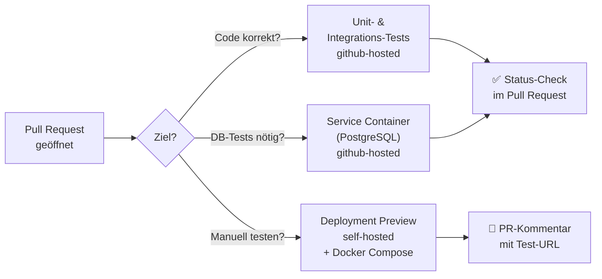

| Szenario | Ansatz | Runner | Aufwand |
|----------|--------|--------|---------|
| **Unit-Tests & Build** | Standard Workflow | GitHub-hosted | Gering — sofort nutzbar |
| **Integrations-Tests mit DB** | Service-Container | GitHub-hosted | Mittel — Docker-Kenntnisse nötig |
| **Vollständige Test-Instanz** | Deployment Preview | Self-hosted + Docker | Hoch — eigene Infrastruktur nötig |
| **Plattformspezifische Tests** | Self-hosted Runner | Self-hosted | Mittel — einmalige Installation |

> <span style="font-size: 1.5em">:bulb:</span> **Empfehlung für die Schulbibliothek:** Starten Sie mit **GitHub-hosted Runnern** für Unit- und Integrations-Tests (Service Container für PostgreSQL). Ein Self-hosted Runner mit Deployment Preview ist ein spannendes Erweiterungsprojekt für fortgeschrittene Gruppen.

***
Quellen

- [Continuous integration - GitHub Docs](https://docs.github.com/en/actions/get-started/continuous-integration)
- [About service containers - GitHub Docs](https://docs.github.com/en/actions/using-containerized-services/about-service-containers)
- [Adding self-hosted runners - GitHub Docs](https://docs.github.com/en/actions/how-tos/manage-runners/self-hosted-runners/add-runners)
- [GitHub Actions: Using Docker service containers](https://docs.github.com/en/actions/tutorials/use-containerized-services/use-docker-service-containers)
***

