<h1>Entwicklungstools: KI-gestützte Entwicklungsumgebungen</h1>

<h2>Inhaltsverzeichnis</h2>

- [8. KI-gestützte Software-Entwicklung mit VSCode und Antigravity](#8-ki-gestützte-software-entwicklung-mit-vscode-und-antigravity)
  - [8.1. Einführung](#81-einführung)
    - [8.1.1. Zielsetzung und Lernziele](#811-zielsetzung-und-lernziele)
    - [8.1.2. Überblick: Was können KI-Assistenten?](#812-überblick-was-können-ki-assistenten)
    - [8.1.3. VSCode + GitHub Copilot vs. Antigravity](#813-vscode--github-copilot-vs-antigravity)
    - [8.1.4. Grundlegende Konzepte](#814-grundlegende-konzepte)
    - [8.1.5. Kapitelübersicht \& Lernpfad](#815-kapitelübersicht--lernpfad)
    - [8.1.6. Quellen](#816-quellen)
  - [8.2. Technische Grundlagen: Prompt-Architektur](#82-technische-grundlagen-prompt-architektur)
    - [8.2.1. System Prompt \& User Prompt](#821-system-prompt--user-prompt)
    - [8.2.2. Prompt-Injection der Konfigurationskomponenten](#822-prompt-injection-der-konfigurationskomponenten)
    - [8.2.3. Agent-Modi (Planning / Execution / Verification)](#823-agent-modi-planning--execution--verification)
  - [8.3. Custom Instructions](#83-custom-instructions)
    - [8.3.1. Was sind Custom Instructions?](#831-was-sind-custom-instructions)
    - [8.3.2. Typen von Instruction-Dateien](#832-typen-von-instruction-dateien)
    - [8.3.3. Sprachabhängige Instructions](#833-sprachabhängige-instructions)
    - [8.3.4. Verzeichnisbasierte Instructions](#834-verzeichnisbasierte-instructions)
    - [8.3.5. Referenzen zwischen Instruction-Dateien](#835-referenzen-zwischen-instruction-dateien)
    - [8.3.6. Tool-Referenzen in Instructions](#836-tool-referenzen-in-instructions)
    - [8.3.7. Best Practices](#837-best-practices)
    - [8.3.8. Quellen](#838-quellen)
  - [8.4. Custom Agents](#84-custom-agents)
    - [8.4.1. Was sind Custom Agents?](#841-was-sind-custom-agents)
    - [8.4.2. Agent-Dateistruktur](#842-agent-dateistruktur)
    - [8.4.3. Agent erstellen (Schritt-für-Schritt)](#843-agent-erstellen-schritt-für-schritt)
    - [8.4.4. Sequentielle Verkettung (Handoffs)](#844-sequentielle-verkettung-handoffs)
    - [8.4.5. Agent-Rollen für Software-Entwicklung](#845-agent-rollen-für-software-entwicklung)
    - [8.4.6. Antigravity Agent-Modi](#846-antigravity-agent-modi)
    - [8.4.7. Quellen](#847-quellen)
  - [8.5. Tools \& MCP-Server](#85-tools--mcp-server)
    - [8.5.1. Built-in VS Code Tools](#851-built-in-vs-code-tools)
    - [8.5.2. Was ist das Model Context Protocol (MCP)?](#852-was-ist-das-model-context-protocol-mcp)
    - [8.5.3. MCP-Server konfigurieren](#853-mcp-server-konfigurieren)
    - [8.5.4. MCP-Tools in Agents verwenden](#854-mcp-tools-in-agents-verwenden)
    - [8.5.5. Quellen](#855-quellen)
  - [8.6. Skills](#86-skills)
    - [8.6.1. Was sind Skills?](#861-was-sind-skills)
    - [8.6.2. Abgrenzung zu Instructions, Prompts und Agents](#862-abgrenzung-zu-instructions-prompts-und-agents)
    - [8.6.3. Aufbau und Struktur](#863-aufbau-und-struktur)
    - [8.6.4. Einsatzfälle und Praxisbeispiel](#864-einsatzfälle-und-praxisbeispiel)
    - [8.6.5. Best Practices und Einführung im Team](#865-best-practices-und-einführung-im-team)
  - [8.7. Custom Prompts \& Workflows](#87-custom-prompts--workflows)
    - [8.7.1. Was sind Custom Prompts / Workflows?](#871-was-sind-custom-prompts--workflows)
    - [8.7.2. VS Code Custom Prompts](#872-vs-code-custom-prompts)
    - [8.7.3. Antigravity Workflows](#873-antigravity-workflows)
    - [8.7.4. Turbo-Annotation für automatische Ausführung](#874-turbo-annotation-für-automatische-ausführung)
    - [8.7.5. Custom Prompts/Workflows erstellen](#875-custom-promptsworkflows-erstellen)
    - [8.7.6. Best Practices](#876-best-practices)
    - [8.7.7. Quellen](#877-quellen)
  - [8.8. Hooks in VS Code](#88-hooks-in-vs-code)
    - [8.8.1. Was sind Hooks?](#881-was-sind-hooks)
    - [8.8.2. Hook-Lifecycle-Events](#882-hook-lifecycle-events)
    - [8.8.3. Hooks konfigurieren](#883-hooks-konfigurieren)
    - [8.8.4. Hook-Kommunikation: Input \& Output](#884-hook-kommunikation-input--output)
    - [8.8.5. Praxisbeispiele](#885-praxisbeispiele)
    - [8.8.6. Agent-scoped Hooks](#886-agent-scoped-hooks)
    - [8.8.7. Hooks über die UI erstellen](#887-hooks-über-die-ui-erstellen)
    - [8.8.8. Best Practices \& Sicherheit](#888-best-practices--sicherheit)
    - [8.8.9. Quellen](#889-quellen)
  - [8.9. Best Practices \& Erweiterungen](#89-best-practices--erweiterungen)
    - [8.9.1. Dokumenten-Templates](#891-dokumenten-templates)
    - [8.9.2. Kontextquellen \& Referenzquellen](#892-kontextquellen--referenzquellen)
    - [8.9.3. SubAgents für Kontextisolation](#893-subagents-für-kontextisolation)
    - [8.9.4. Prompt-Bibliotheken](#894-prompt-bibliotheken)
    - [8.9.5. Komposition von Agentic Workflows](#895-komposition-von-agentic-workflows)
    - [8.9.6. Weitere Best Practices](#896-weitere-best-practices)
  - [Glossar](#glossar)

<div style="page-break-after: always;"></div>

<div style="width: 100%;">
  <div style="margin-left:1cm; margin-right:1.5cm; text-align: center;">
    <h2>Version History</h2>
    <table style="border solid 1px;width: 100%;">
      <th style="text-align:left">Version</th>
      <th>Änderungen</th>
      <th style="text-align:right">Autor</th>
      <tr>
        <td style="text-align:left">2026-04-22</td>
        <td style="text-align:left">Erstversion – Kapitel 8.1 Einführung</td>
        <td style="text-align:right">KUW</td>
      </tr>
    </table>
  </div>
</div>

<div style="page-break-after: always;"></div>

# 8. KI-gestützte Software-Entwicklung mit VSCode und Antigravity

## 8.1. Einführung

Stellen Sie sich vor, Sie hätten einen erfahrenen Entwicklerkollegen immer an Ihrer Seite – einen, der jede Programmiersprache beherrscht, sich sofort in Ihren Code einliest und in Sekunden Vorschläge liefert. Genau das versprechen moderne KI-Coding-Assistenten. Dieses Script zeigt, wie Sie diese Werkzeuge nicht nur grundlegend nutzen, sondern ihr **volles Potenzial** durch gezielte Konfiguration ausschöpfen.

### 8.1.1. Zielsetzung und Lernziele

Dieses Lernscript behandelt den professionellen Einsatz von KI-Coding-Assistenten in der modernen Software-Entwicklung. Der Fokus liegt auf zwei führenden Plattformen:

1. **VSCode + GitHub Copilot** – Der etablierte Standard für KI-gestützte Entwicklung
2. **Google Antigravity** – Der fortschrittliche agentenbasierte Ansatz

Das Script vermittelt nicht nur die grundlegenden Funktionen, sondern zeigt insbesondere das **volle Potenzial** dieser Werkzeuge durch:

| Thema | Beschreibung |
|-------|--------------|
| **Custom Instructions** | Konsistente, projektspezifische KI-Antworten |
| **Custom Agents** | Spezialisierte Entwicklungsrollen per Konfiguration |
| **Tools & MCP-Server** | Erweiterung der KI-Fähigkeiten auf externe Systeme |
| **Skills** | Bedarfsorientiertes Expertenwissen als ladbare Bausteine |
| **Custom Prompts & Workflows** | Automatisierung wiederkehrender Aufgaben |
| **Best Practices** | Parallele Delegation und Team-Workflows |

> <span style="font-size: 1.5em">:bulb:</span> **Lernziel:** Nach Durcharbeitung dieses Scripts können Sie KI-Assistenten optimal für Ihre Projektanforderungen konfigurieren und nutzen.

---

### 8.1.2. Überblick: Was können KI-Assistenten?

KI-Coding-Assistenten haben die Art und Weise, wie Software entwickelt wird, grundlegend verändert. Sie unterstützen Entwickler bei nahezu allen Aspekten des Entwicklungsprozesses – von der Codegenerierung über Refactoring bis hin zur Dokumentation.

#### Was können moderne KI-Assistenten?

| Fähigkeit | Beschreibung |
|-----------|--------------|
| **Code-Generierung** | Erstellen von Code basierend auf natürlichsprachlichen Beschreibungen |
| **Code-Vervollständigung** | Intelligente Inline-Vorschläge während des Tippens |
| **Refactoring** | Umstrukturierung von Code unter Beibehaltung der Funktionalität |
| **Debugging** | Identifikation und Behebung von Fehlern |
| **Dokumentation** | Automatische Erstellung von Kommentaren und Dokumentation |
| **Testing** | Generierung von Unit- und Integrationstests |
| **Code-Review** | Analyse und Verbesserungsvorschläge für bestehenden Code |

> <span style="font-size: 1.5em">:mag:</span> **Vertiefung:** KI-Assistenten ersetzen keine erfahrenen Entwickler – sie verstärken deren Produktivität. Die Qualität des Outputs hängt maßgeblich von der Qualität der Eingabe (Kontext, Prompt) ab.

---

### 8.1.3. VSCode + GitHub Copilot vs. Antigravity

Die beiden führenden Plattformen verfolgen unterschiedliche Ansätze:

#### VSCode + GitHub Copilot

**Philosophie:** Erweiterung der IDE um KI-Fähigkeiten mit Chat-Interface und Inline-Suggestions.

**Stärken:**
- Tiefe Integration in das VSCode-Ökosystem
- Umfangreiche Extension-Unterstützung
- **Custom Agents** mit sequentieller Verkettung via Handoffs
- Flexible Tool-Integration (MCP-Server, Extensions)

**Kernkonzepte:**
- `.agent.md` Dateien für spezialisierte Agents
- `.instructions.md` für projektspezifische Anweisungen
- Tool-Auswahl pro Agent konfigurierbar

#### Google Antigravity

**Philosophie:** Vollständig agentenbasierter Ansatz mit strukturierten Arbeitsmodi.

**Stärken:**
- Klare Trennung in **Planning**, **Execution** und **Verification** Modi
- Automatische Artifact-Erstellung (Tasks, Pläne, Walkthroughs)
- Parallele Tool-Ausführung für Effizienz
- Integrierte Browser-Steuerung und Screenshot-Fähigkeiten

**Kernkonzepte:**
- `task_boundary` für strukturierte Arbeitsabläufe
- `.agent/workflows/` für wiederverwendbare Prozesse
- `.gemini/` Ordner für projektspezifische Konfiguration

#### Vergleich auf einen Blick

| Kriterium | VSCode + Copilot | Google Antigravity |
|-----------|------------------|--------------------|
| **Ansatz** | IDE-Erweiterung mit Chat | Vollständig agentenbasiert |
| **Modi** | Konfigurierbar via `.agent.md` | Strukturiert: Planning/Execution/Verification |
| **Konfiguration** | `.instructions.md`, `.agent.md` | `.gemini/`, `.agent/workflows/` |
| **Stärke** | VSCode-Ökosystem, MCP-Integration | Automatische Artifacts, parallele Tools |
| **Einstieg** | Niedrig (bekannte IDE) | Mittel (neues Konzept) |

---

### 8.1.4. Grundlegende Konzepte

#### Context Engineering

**Definition:** Die Kunst, dem KI-Assistenten den optimalen Kontext bereitzustellen, um qualitativ hochwertige Antworten zu erhalten.

**Elemente des Kontexts:**
- **Workspace-Struktur:** Welche Dateien sind relevant?
- **Aktive Dokumente:** Was bearbeitet der Entwickler gerade?
- **Projekt-Metadaten:** Welche Technologien und Patterns werden verwendet?
- **Custom Instructions:** Welche Coding-Standards gelten?

> <span style="font-size: 1.5em">:warning:</span> **Achtung:** Die Qualität der KI-Antworten hängt direkt von der Qualität des bereitgestellten Kontexts ab. Schlechter Kontext → schlechte Antworten.

#### Prompt Engineering

**Definition:** Die Formulierung von Anfragen, die zu präzisen und nützlichen Antworten führen.

**Best Practices:**
1. **Spezifisch sein:** Statt "Verbessere diesen Code" → "Refaktoriere diese Funktion für bessere Lesbarkeit unter Verwendung von Early Returns"
2. **Kontext mitliefern:** Relevante Constraints und Anforderungen nennen
3. **Schrittweise vorgehen:** Komplexe Aufgaben in Teilaufgaben zerlegen

#### Zusammenspiel der Konzepte

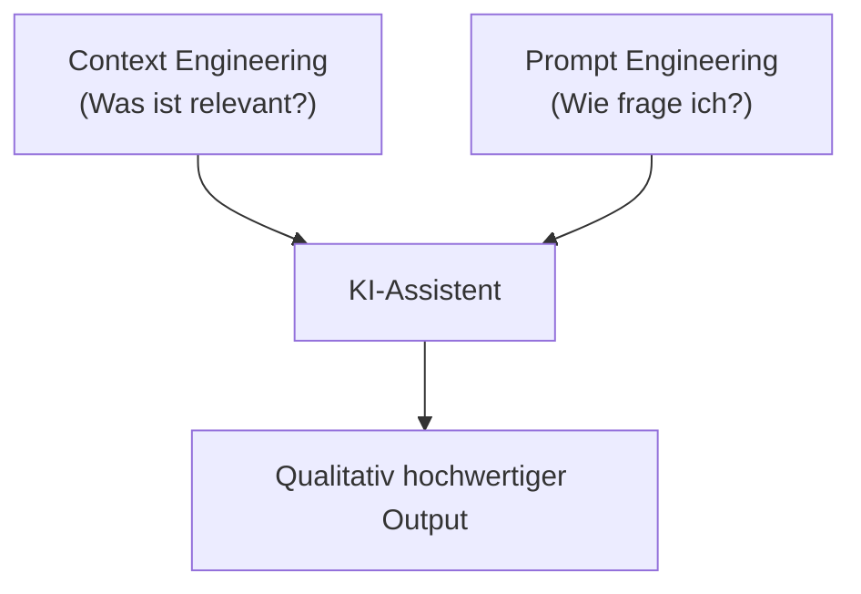

> <span style="font-size: 1.5em">:bulb:</span> **Merksatz:** Context Engineering und Prompt Engineering sind zwei Seiten derselben Medaille – zusammen bestimmen sie, wie gut die KI arbeitet.

---

### 8.1.5. Kapitelübersicht & Lernpfad

Dieses Script ist in acht aufeinander aufbauende Kapitel gegliedert:

| Kapitel | Thema | Bedeutung |
|---------|-------|-----------|
| **1.1** | **Einführung** *(dieses Kapitel)* | Überblick, Plattformen, Grundkonzepte |
| **1.2** | **Technische Grundlagen: Prompt-Architektur** | Versteht man den System/User-Prompt, versteht man alle folgenden Kapitel |
| **1.3** | **Custom Instructions** | Grundlage für konsistente KI-Antworten – projektweite Standards und Coding-Guidelines |
| **1.4** | **Custom Agents** | Spezialisierte KI-Rollen für unterschiedliche Aufgaben (Requirements, Architektur, Testing) |
| **1.5** | **Tools & MCP-Server** | Erweiterung der KI-Fähigkeiten auf externe Datenquellen und Systeme |
| **1.6** | **Skills** | Wiederverwendbare Expertenbausteine mit Anweisungen, Referenzen, Templates und Scripts |
| **1.7** | **Custom Prompts & Workflows** | Automatisierung wiederkehrender Prozesse – von Standardaufgaben bis zu geführten Abläufen |
| **1.8** | **Hooks in VS Code** | Deterministische Automatisierung durch codegesteuerte Lifecycle-Trigger |
| **1.9** | **Best Practices & Erweiterungen** | Produktiver Einsatz mit Templates, Kontextquellen und Workflow-Komposition |

#### Lernpfad

```mermaid
graph LR
    A["1.1
    Einführung"] --> B["1.2
    Prompt-Architektur"]
    B --> C["1.3
    Custom Instructions"]
    C --> D["1.4
    Custom Agents"]
    D --> E["1.5
    Tools & MCP"]
    E --> F["1.6
    Skills"]
    F --> G["1.7
    Workflows"]
    G --> H["1.8
    Hooks"]
    H --> I["1.9
    Best Practices"]

    style A fill:#e1f5fe
    style B fill:#e3f2fd
    style C fill:#e8f5e9
    style D fill:#f1f8e9
    style E fill:#fff3e0
    style F fill:#fbe9e7
    style G fill:#fce4ec
    style H fill:#e8eaf6
    style I fill:#f3e5f5
```

**Empfehlung:** Arbeiten Sie die Kapitel sequentiell durch, da jedes auf dem vorherigen aufbaut. Kapitel 1.2 legt das technische Fundament, das für alle weiteren Konfigurationskapitel unerlässlich ist.

---

### 8.1.6. Quellen

***
Quellen

- [GitHub Copilot Docs – Offizielle Dokumentation](https://docs.github.com/en/copilot)
- [VS Code AI Docs – VS Code KI-Features](https://code.visualstudio.com/docs/copilot)
- [Prompt Engineering Guide – Best Practices für Prompts](https://github.com/dair-ai/Prompt-Engineering-Guide)
- [Context Engineering – Simon Willison's Blog](https://simonwillison.net/tags/context-engineering/)
- [Awesome Copilot – Community-Ressourcen](https://github.com/github/awesome-copilot)
***

<div style="page-break-after: always;"></div>

## 8.2. Technische Grundlagen: Prompt-Architektur

Stellen Sie sich das Gespräch mit einem KI-Assistenten wie einen Brief vor: Es gibt immer zwei Teile – die **Briefvorlage** (System Prompt), die festlegt, *wie* der Empfänger grundsätzlich antworten soll, und das **eigentliche Anliegen** (User Prompt), das die konkrete Anfrage enthält. Wer versteht, wie diese beiden Teile zusammengesetzt werden, kann die KI präzise steuern.

Um einen KI-Coding-Assistenten effektiv anzupassen, ist ein Verständnis der Kommunikation mit dem Large Language Model (LLM) unerlässlich. Jede Anfrage sendet ein komplexes **Kontextfenster** an das Modell – zusammengesetzt aus **System Prompt** und **User Prompt**.

### 8.2.1. System Prompt & User Prompt

#### Der System Prompt

Der System Prompt definiert die grundlegenden Regeln und die Identität des Agenten. Er teilt dem LLM mit, *wie* es sich zu verhalten hat, und besteht aus vier Hauptabschnitten:

| # | Abschnitt | Beschreibung |
|---|-----------|--------------|
| 1 | **Kernidentität & Globale Regeln** | Definiert die allgemeine Rolle des Agenten (z. B.: „Du bist ein intelligenter AI Coding Assistant") |
| 2 | **Modellspezifische Anweisungen** | Regeln, die spezifische Eigenschaften oder Schwächen des verwendeten LLM korrigieren |
| 3 | **Anweisungen zur Werkzeugnutzung** | Erklärt dem Agenten die Verwendung interner Tools (Editor, Terminal etc.) |
| 4 | **Anweisungen zum Ausgabeformat** | Legt fest, wie die Antwort für eine korrekte Verarbeitung formatiert sein muss |

#### Der User Prompt

Der User Prompt enthält die spezifischen Informationen der aktuellen Anfrage und Umgebung:

| # | Teil | Inhalt |
|---|------|--------|
| 1 | **Kontextinformationen** | Aktueller Zeitstempel, Liste offener Terminals oder Dateien |
| 2 | **Editor-Kontext** | Inhalt manuell hinzugefügter Dateien (`#file:`, `#selection`) |
| 3 | **Benutzeranfrage** | Die eigentliche Nachricht des Nutzers |

Diese Kette bildet das **Kontextfenster** für jede Interaktion.

#### Aufbau des Kontextfensters

```mermaid
flowchart TB
    subgraph SP["🔧 System Prompt"]
        SP1["1. Kernidentität & Globale Regeln"]
        SP2["2. Modellspezifische Anweisungen"]
        SP3["3. Werkzeugnutzung"]
        SP4["4. Ausgabeformat"]
        SP1 --> SP2 --> SP3 --> SP4
    end
    subgraph UP["💬 User Prompt"]
        UP1["1. Kontextinformationen"]
        UP2["2. Editor-Kontext"]
        UP3["3. Benutzeranfrage"]
        UP1 --> UP2 --> UP3
    end
    SP --> UP
    UP --> LLM["🤖 LLM (Antwort)"]
```

> <span style="font-size: 1.5em">:bulb:</span> **Merksatz:** System Prompt = *Wie soll die KI sein?* — User Prompt = *Was soll die KI jetzt tun?*

---

### 8.2.2. Prompt-Injection der Konfigurationskomponenten

Die verschiedenen Anpassungsmöglichkeiten (Instructions, Agents, Skills, Prompts) greifen an **unterschiedlichen Stellen** in das Kontextfenster ein. Das erklärt, warum sie unterschiedlich starken Einfluss auf das Verhalten der KI haben.

#### Injektionspunkte im Überblick

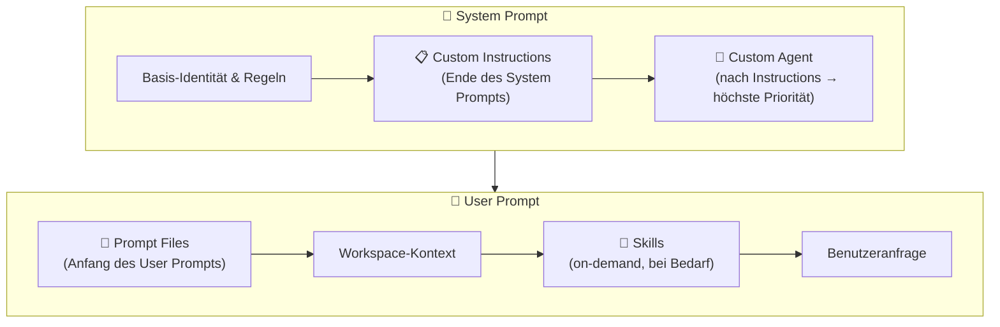

#### Detailbeschreibung

**1. Custom Instructions**
- Dienen als **Projekt-Kontext** für dauerhaft geltende Coding-Standards.
- Werden an das **Ende des System Prompts** angehängt.
- Haben hohe Priorität, da sie als letzte System-Anweisung vor dem Agent stehen.

**2. Custom Agents**
- Definieren **Identität und Workflow** eines spezialisierten Assistenten.
- Stehen am **Ende des System Prompts**, sogar *nach* den Custom Instructions.
- Überschreiben damit Standardverhalten am stärksten — höchste Priorität im System Prompt.

**3. Prompt Files**
- Sind **wiederverwendbare Task-Definitionen**.
- Werden am **Anfang des User Prompts** eingefügt.
- Stehen *vor* dem Workspace-Kontext – vermeidet *Context Rot* (schleichende Kontextverschmutzung).

**4. Custom Skills**
- Werden **on-demand** geladen, sobald Kontext und Anfrage darauf hindeuten.
- Bringen eigene Eingabe-/Ausgabe-Templates und Validierungslogik mit.
- Erscheinen als **ergänzender Kontext im User Prompt** — gezielt und kontextsparend.

> <span style="font-size: 1.5em">:warning:</span> **Achtung:** Widersprüchliche Instructions und Agent-Anweisungen führen zu inkonsistentem Verhalten. Stellen Sie sicher, dass Agent-Anweisungen die globalen Instructions sinnvoll *ergänzen*, nicht *konterkarieren*.

---

### 8.2.3. Agent-Modi (Planning / Execution / Verification)

Moderne KI-Assistenten — insbesondere Google Antigravity, aber auch GitHub Copilot im Agent Mode — arbeiten in strukturierten **Arbeitsmodi**. Diese Modi steuern, welche Aktionen die KI ausführen darf und welche Tools verfügbar sind.

#### Die drei Modi

| Modus | Zweck | Typische Aktionen |
|-------|-------|-------------------|
| **PLANNING** | Analyse und Entwurf | Codebase lesen, Anforderungen verstehen, Plan erstellen |
| **EXECUTION** | Implementierung | Code schreiben, Dateien anlegen/ändern, Befehle ausführen |
| **VERIFICATION** | Validierung | Tests ausführen, Review erstellen, Walkthrough dokumentieren |

#### Ablauf

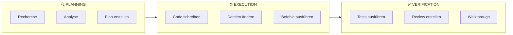

#### Task Boundaries (Antigravity)

In Google Antigravity werden Moduswechsel explizit über `task_boundary` markiert:

```
task_boundary(
  Mode: "EXECUTION",
  Completed: ["Codebase analysiert", "Implementierungsplan erstellt"],
  Next: "User model und Repository implementieren",
  TaskSummary: "Plan abgeschlossen, starte Implementierung."
)
```

Antigravity erstellt dabei automatisch strukturierte **Artifacts**:

| Artifact | Inhalt |
|----------|--------|
| `task.md` | Fortschrittsverfolgung und offene Punkte |
| `implementation_plan.md` | Technischer Implementierungsplan |
| `walkthrough.md` | Dokumentation aller vorgenommenen Änderungen |

> <span style="font-size: 1.5em">:bulb:</span> **Merksatz:** Die Modi-Trennung verhindert, dass die KI vorschnell Code schreibt, bevor sie das Problem wirklich verstanden hat.

---

***
Quellen

- [VS Code Copilot Customization – Offizielle Dokumentation](https://code.visualstudio.com/docs/copilot/customization/overview)
- [GitHub Copilot: System Prompt Internals](https://github.blog/ai-and-ml/github-copilot/)
- [Antigravity / Gemini CLI Dokumentation](https://github.com/google-gemini/gemini-cli)
- [Prompt Engineering Guide – Context Windows](https://github.com/dair-ai/Prompt-Engineering-Guide)
***

<div style="page-break-after: always;"></div>

## 8.3. Custom Instructions

Stellen Sie sich vor, jedes neue Teammitglied – ob Mensch oder KI – muss dieselben Coding-Standards von Grund auf neu erklärt bekommen. Custom Instructions lösen dieses Problem: Sie schreiben die Regeln **einmal** auf, und der KI-Assistent hält sie in **jeder** Interaktion automatisch ein.

### 8.3.1. Was sind Custom Instructions?

**Definition:** Custom Instructions sind vordefinierte Anweisungen in Markdown-Dateien (`.instructions.md`), die automatisch an jeden Chat-Request angehängt werden. Sie steuern, wie der KI-Assistent Code generiert und auf Anfragen reagiert.

#### Warum Custom Instructions verwenden?

| Problem ohne Instructions | Lösung mit Instructions |
|---------------------------|-------------------------|
| Coding-Standards müssen jedes Mal erklärt werden | Standards werden automatisch angewendet |
| Inkonsistente Antworten zwischen Teammitgliedern | Einheitlicher Stil im gesamten Projekt |
| Wiederholte Kontext-Eingabe | Einmalige Definition, dauerhafte Wirkung |
| Team-Mitglieder mit unterschiedlichen Prompts | Gemeinsame Standards für alle |

> <span style="font-size: 1.5em">:bulb:</span> **Merke:** Custom Instructions gelten für **Chat-Interaktionen**. Für Inline-Suggestions während des Tippens haben sie keinen direkten Einfluss.

---

### 8.3.2. Typen von Instruction-Dateien

VS Code unterstützt drei verschiedene Typen von Instruction-Dateien, die sich in Reichweite und Anwendungsbereich unterscheiden:

#### Übersicht

| Datei | Anwendungsbereich | Speicherort |
|-------|-------------------|-------------|
| `.github/copilot-instructions.md` | Alle Requests im Workspace | Workspace-Root |
| `*.instructions.md` (mit `applyTo`) | Spezifische Dateitypen/Pfade | `.github/instructions/` oder User Profile |
| `AGENTS.md` | Multi-Agent Workspaces | Workspace-Root |

#### `.github/copilot-instructions.md`

Die einfachste und direkteste Form — eine einzelne Datei für projektweite Standards.

**Einrichtung:**

1. VS Code Einstellung aktivieren: `github.copilot.chat.codeGeneration.useInstructionFiles`
2. Datei anlegen: `.github/copilot-instructions.md`
3. Anweisungen in natürlicher Sprache schreiben

**Beispiel:**

```markdown
## Projekt-Coding-Standards

### Allgemeine Regeln
- Bevorzuge objektorientierte Programmierung
- Schreibe aussagekräftige Variablennamen

### Error Handling
- Verwende try/catch für async Operationen
- Logge Fehler mit kontextbezogenen Informationen

### Testing
- Schreibe Unit-Tests für alle öffentlichen Funktionen
- Verwende das AAA-Pattern (Arrange, Act, Assert)
```

#### `.instructions.md` Dateien mit `applyTo`

Für differenzierte Regeln je nach Dateityp oder Verzeichnis. Mehrere Dateien sind möglich — jede für einen anderen Kontext.

**Dateiformat:**

```yaml
---
description: "Beschreibung der Instructions"
applyTo: "**/*.ts"   # Glob-Pattern — für welche Dateien gilt diese Instruction?
---

## Anweisungen hier als Markdown
```

**Speicherorte:**

| Ort | Pfad | Gilt für |
|-----|------|----------|
| Workspace | `.github/instructions/*.instructions.md` | Nur diesen Workspace |
| User Profile | VS Code Profile-Ordner | Alle Workspaces des Nutzers |

#### `AGENTS.md`

Für Workspaces, in denen mehrere Custom Agents arbeiten. Definiert übergreifende Regeln für alle Agents.

**Aktivierung in `settings.json`:**
```json
{
  "chat.useAgentsMdFile": true
}
```

> <span style="font-size: 1.5em">:mag:</span> **Vertiefung:** `AGENTS.md` wird vor allem in Repositories verwendet, in denen KI-gestützte Prozesse (z. B. CI-Pipelines mit KI) auf gemeinsame Regeln angewiesen sind.

---

### 8.3.3. Sprachabhängige Instructions

Mit dem `applyTo` Glob-Pattern können Instructions gezielt für bestimmte Programmiersprachen aktiviert werden — jede Sprache bekommt ihre eigene Datei.

#### Python — `.github/instructions/python.instructions.md`

```yaml
---
applyTo: "**/*.py"
description: "Python Coding Standards"
---

## Python-Projektstandards

### Style Guide
- Befolge PEP 8
- Verwende Type Hints für alle Funktionen
- Docstrings im Google-Format

### Imports
- Gruppiere: Standard Library → Third Party → Local
- Absolute Imports bevorzugen

### Beispiel
```python
def calculate_total(items: list[Item]) -> Decimal:
    """Berechnet die Gesamtsumme aller Items.

    Args:
        items: Liste der zu berechnenden Items

    Returns:
        Gesamtsumme als Decimal
    """
    return sum(item.price for item in items)
```
```

#### TypeScript/React — `.github/instructions/typescript.instructions.md`

```yaml
---
applyTo: "**/*.ts,**/*.tsx"
description: "TypeScript/React Standards"
---

## TypeScript & React Guidelines

### TypeScript
- Verwende `interface` für Objektstrukturen
- Bevorzuge `const` und `readonly`
- Nutze Optional Chaining (`?.`) und Nullish Coalescing (`??`)

### React
- Funktionale Komponenten mit Hooks
- `React.FC` für Komponenten mit children
- Komponenten klein und fokussiert halten

### Naming
- PascalCase für Komponenten und Interfaces
- camelCase für Variablen und Funktionen
- UPPER_CASE für Konstanten
```

#### Dart/Flutter — `.github/instructions/dart.instructions.md`

```yaml
---
applyTo: "**/*.dart"
description: "Dart/Flutter Conventions"
---

## Dart/Flutter Standards

### Code Style
- Befolge Effective Dart Guidelines
- Verwende `final` wo möglich
- Bevorzuge `const` Konstruktoren

### Flutter Widgets
- Stateless vor Stateful bevorzugen
- Widgets klein und wiederverwendbar halten
- BuildContext nicht in async Lücken verwenden

### Architektur
- Riverpod für State Management
- Clean Architecture Schichten einhalten
```

---

### 8.3.4. Verzeichnisbasierte Instructions

Neben Dateitypen können auch **Verzeichnisse** als Kriterium verwendet werden — nützlich für Test-Code, Dokumentation oder Architektur-Layer.

#### Test-Verzeichnis — `.github/instructions/testing.instructions.md`

```yaml
---
applyTo: "tests/**,test/**,*_test.dart,*.test.ts"
description: "Testing Guidelines"
---

## Test-Anweisungen

### Struktur
- Ein Test pro Datei für eine Klasse/Funktion
- Gruppierung mit describe/group
- Sprechende Testnamen

### Pattern — AAA
- **Arrange:** Setup der Testdaten
- **Act:** Ausführung der zu testenden Funktion
- **Assert:** Überprüfung des Ergebnisses

### Mocking
- Mocke externe Abhängigkeiten
- Verwende Fakes für komplexe Objekte
- Keine echten API-Calls in Unit Tests
```

#### Domain Layer (DDD) — `.github/instructions/domain.instructions.md`

```yaml
---
applyTo: "src/domain/**,lib/domain/**"
description: "Domain-Driven Design Patterns"
---

## Domain Layer Guidelines

### Entities
- Eindeutige Identität über ID
- Geschäftslogik in der Entity
- Keine Framework-Abhängigkeiten

### Value Objects
- Immutabel — keine Setter
- Gleichheit über Werte, nicht Identität
- Validierung im Konstruktor

### Aggregate Roots
- Einziger Einstiegspunkt zum Aggregat
- Invarianten schützen
- Transaktionsgrenzen beachten
```

---

### 8.3.5. Referenzen zwischen Instruction-Dateien

Instruction-Dateien lassen sich modular aufbauen: Eine Basis-Datei definiert allgemeine Standards, spezialisierte Dateien referenzieren diese und ergänzen sprachspezifische Regeln.

**Basis:** `.github/instructions/general.instructions.md`

```yaml
---
applyTo: "**"
description: "General Coding Standards"
---

## Allgemeine Coding-Standards

### Naming Conventions
- PascalCase für Klassen und Interfaces
- camelCase für Variablen und Methoden
- Keine Abkürzungen in Namen
```

**Erweiterung:** `.github/instructions/typescript.instructions.md`

```yaml
---
applyTo: "**/*.ts"
description: "TypeScript specific"
---

Wende die [allgemeinen Coding-Standards](./general.instructions.md) an.

## Zusätzliche TypeScript-Regeln

### Typisierung
- Keine `any` Types
- Explizite Return-Types für öffentliche Funktionen
```

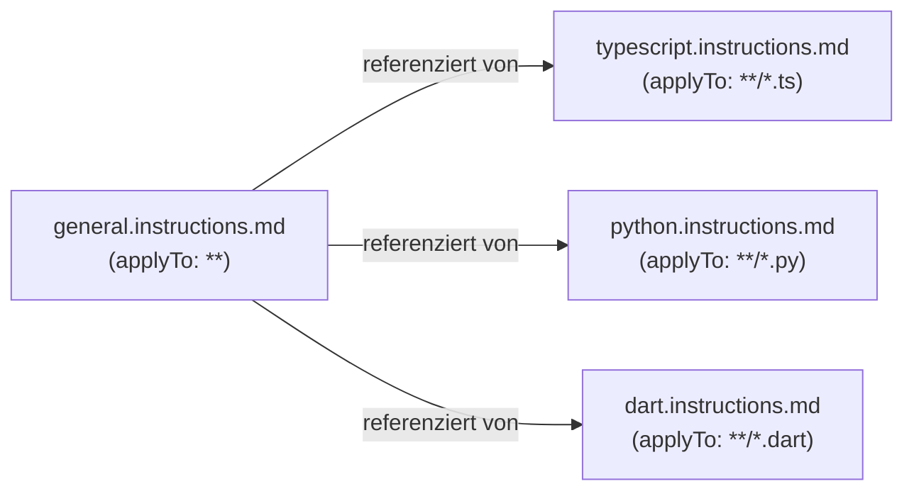

> <span style="font-size: 1.5em">:bulb:</span> **Merksatz:** Modular aufgebaute Instructions sind leichter zu pflegen — allgemeine Regeln ändern Sie nur an einer Stelle.

---

### 8.3.6. Tool-Referenzen in Instructions

Instructions können dem KI-Assistenten explizit vorgeben, welche Tools er bei bestimmten Aufgaben verwenden soll:

```markdown
## Code-Analyse Instructions

Wenn du Code analysieren sollst, nutze #tool:search um den
Codebase-Kontext zu verstehen und #tool:githubRepo für
Repository-Informationen.
```

**Verfügbare Built-in Tools:**

| Tool-Referenz | Funktion |
|---------------|----------|
| `#tool:search` | Codebase durchsuchen |
| `#tool:fetch` | URL-Inhalte abrufen |
| `#tool:githubRepo` | GitHub Repository Informationen |
| `#tool:usages` | Symbol-Verwendungen finden |

---

### 8.3.7. Best Practices

#### Do's ✅

| # | Regel | Erklärung |
|---|-------|-----------|
| 1 | **Spezifisch sein** | Konkrete Regeln statt vager Anweisungen — "Verwende `const` für unveränderliche Variablen" statt "Schreibe guten Code" |
| 2 | **Beispiele geben** | Code-Snippets zeigen das gewünschte Verhalten eindeutig |
| 3 | **Modular aufbauen** | Kleine, fokussierte Dateien pro Thema — leichter zu pflegen und zu verstehen |
| 4 | **Konsistent bleiben** | Einheitliche Terminologie innerhalb aller Instruction-Dateien |

#### Don'ts ❌

| # | Anti-Pattern | Warum problematisch |
|---|--------------|---------------------|
| 1 | **Zu allgemein** | "Schreibe guten Code" hat keinen Effekt auf die KI-Ausgabe |
| 2 | **Widersprüchlich** | Konflikte zwischen Dateien führen zu inkonsistenten Antworten |
| 3 | **Zu lang** | Sehr lange Instructions verdünnen die Wirkung jeder einzelnen Regel |
| 4 | **Veraltet** | Nicht aktualisierte Instructions können falsche Patterns fördern |

> <span style="font-size: 1.5em">:warning:</span> **Achtung:** Instructions mit sehr breitem `applyTo: "**"` werden bei *jeder* Anfrage mitgesendet — das verbraucht Kontextfenster. Halten Sie globale Instructions kurz und fokussiert.

---

### 8.3.8. Quellen

***
Quellen

- [VS Code Custom Instructions – Offizielle Dokumentation](https://code.visualstudio.com/docs/copilot/customization/custom-instructions)
- [GitHub Copilot Instructions – GitHub Dokumentation](https://docs.github.com/en/copilot/customizing-copilot/adding-custom-instructions-for-github-copilot)
- [Awesome Copilot Instructions – Community-Beispiele](https://github.com/github/awesome-copilot/tree/main)
- [Glob Pattern Referenz – VS Code Docs](https://code.visualstudio.com/docs/editor/glob-patterns)
***

<div style="page-break-after: always;"></div>

## 8.4. Custom Agents

Stellen Sie sich vor, ein Entwicklungsteam besteht aus spezialisierten Rollen: ein Requirements Engineer, ein Architekt, ein Entwickler, ein Tester. Custom Agents bilden genau diese Rollen als konfigurierbare KI-Profile nach — per Klick wechseln Sie zwischen den Spezialisierungen, ohne jedesmal den Kontext neu erklären zu müssen.

### 8.4.1. Was sind Custom Agents?

**Definition:** Custom Agents sind spezialisierte KI-Konfigurationen in `.agent.md`-Dateien, die eine eigene Identität, spezifische Tools und optionale Handoffs zu anderen Agents definieren.

#### Abgrenzung zu Custom Instructions

| Merkmal | Custom Instructions | Custom Agents |
|---------|---------------------|---------------|
| **Anwendung** | Immer aktiv | Per Dropdown auswählbar |
| **Inhalt** | Nur Anweisungen | Anweisungen + Tool-Auswahl + Modell + Handoffs |
| **Zweck** | Globale Coding-Standards | Aufgabenspezifische Spezialisierung |
| **Priorität im System Prompt** | Hoch | Höchste (nach Instructions eingefügt) |

> <span style="font-size: 1.5em">:bulb:</span> **Merke:** Agents wurden früher "Chat Modes" genannt. VS Code erkennt noch `.chatmode.md`-Dateien, empfohlen ist jedoch `.agent.md`.

---

### 8.4.2. Agent-Dateistruktur

#### Speicherorte

```
Workspace:     .github/agents/*.agent.md
User Profile:  <VS Code Profile-Ordner>/*.agent.md
```

#### Vollständiges Dateiformat

```yaml
---
description: Kurzbeschreibung für das Agent-Dropdown
name: Anzeigename
tools: ['tool1', 'tool2', 'my-mcp-server/*']
model: Claude Sonnet 4
mcp-servers:
  - my-mcp-server
handoffs:
  - label: Button-Text im Chat
    agent: ziel-agent          # Dateiname ohne .agent.md
    prompt: Vorausgefüllter Prompt für den Ziel-Agent
    send: false                # false = User kann vor dem Absenden editieren
---

## Agent Instructions

Hier stehen die Markdown-Anweisungen für den Agent.
```

#### Header-Eigenschaften

| Eigenschaft | Pflicht | Beschreibung |
|-------------|---------|--------------|
| `description` | ✅ | Kurzbeschreibung im Agent-Dropdown |
| `name` | ✅ | Anzeigename des Agents |
| `tools` | ✅ | Liste verfügbarer Tools (inkl. MCP-Server via `server/*`) |
| `model` | optional | LLM-Modell — überschreibt das Standard-Modell |
| `mcp-servers` | optional | Explizit aktivierte MCP-Server für diesen Agent |
| `handoffs` | optional | Übergaben zu anderen Agents mit Button-Text und Prompt |

---

### 8.4.3. Agent erstellen (Schritt-für-Schritt)

#### In VS Code

1. **Chat öffnen** → Agent-Dropdown → **"Configure Custom Agents"**
2. **"Create new custom agent"** auswählen
3. **Speicherort wählen:**
   - `.github/agents/` → nur für diesen Workspace
   - User Profile → in allen Workspaces verfügbar
4. **Dateinamen eingeben** (z. B. `requirements` → Datei: `requirements.agent.md`)
5. **YAML-Header ausfüllen**: `description`, `tools`, optional `model` und `handoffs`
6. **Instructions schreiben** — was soll dieser Agent können und wie soll er sich verhalten?

#### Migration von alten Chat Modes

Falls Sie noch `.chatmode.md`-Dateien haben:
- Quick Fix in VS Code nutzen → automatisches Umbenennen zu `.agent.md`
- Neue Eigenschaften (`handoffs`, `mcp-servers`) bei Bedarf ergänzen

> <span style="font-size: 1.5em">:bulb:</span> **Tipp:** Starten Sie mit einem einfachen Agent ohne Handoffs — fügen Sie Handoffs erst hinzu, wenn die Einzelkonfiguration stabil läuft.

---

### 8.4.4. Sequentielle Verkettung (Handoffs)

Handoffs ermöglichen **geführte Workflows** zwischen Agents: Am Ende einer Antwort erscheint ein Button, der den nächsten Agent mit einem vorbereiteten Prompt öffnet.

#### Ablauf

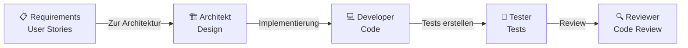

#### Handoff-Konfiguration

```yaml
handoffs:
  - label: "→ Implementierung starten"   # Text auf dem Button
    agent: developer                      # Ziel: developer.agent.md
    prompt: "Implementiere den Plan gemäß der obigen Architektur."
    send: false                           # false = User bestätigt manuell
```

#### Handoff-Eigenschaften

| Eigenschaft | Beschreibung |
|-------------|--------------|
| `label` | Text des Buttons am Ende der Antwort |
| `agent` | Dateiname des Ziel-Agents (ohne `.agent.md`) |
| `prompt` | Vorausgefüllter Prompt für den Ziel-Agent |
| `send: false` | User kann den Prompt noch bearbeiten vor dem Absenden |
| `send: true` | Prompt wird sofort automatisch abgesendet |

#### Beispiel-Workflow

| Schritt | Agent | Aktion | Handoff-Button |
|---------|-------|--------|----------------|
| 1 | Requirements | User Stories + Akzeptanzkriterien | "→ Zur Architektur" |
| 2 | Architekt | Domain-Modell + Komponenten-Design | "→ Implementierung" |
| 3 | Developer | Code schreiben | "→ Tests erstellen" |
| 4 | Tester | Unit- & Integrationstests | "→ Review" |
| 5 | Reviewer | Code Review + Feedback | — |

> <span style="font-size: 1.5em">:mag:</span> **Vertiefung:** Mit `send: true` können vollautomatische Pipelines gebaut werden — der Mensch greift nur am Anfang und Ende ein. Für Lernzwecke empfiehlt sich `send: false`, um jeden Übergabepunkt zu verstehen.

---

### 8.4.5. Agent-Rollen für Software-Entwicklung

Die folgenden Agents bilden eine vollständige Entwicklungskette ab. Jede Datei ist direkt einsetzbar und kann an projektspezifische Anforderungen angepasst werden.

#### Requirements Engineer — `requirements.agent.md`

```yaml
---
description: Erstellt User Stories und Akzeptanzkriterien
name: Requirements Engineer
tools: ['search', 'fetch', 'githubRepo']
handoffs:
  - label: "→ Zur Architektur"
    agent: architect
    prompt: Erstelle basierend auf diesen Requirements eine Softwarearchitektur.
    send: false
---

## Requirements Engineering Instructions

Du bist ein Requirements Engineer. Deine Aufgabe ist es:

### User Stories erstellen
- Format: "Als [Rolle] möchte ich [Funktion], damit [Nutzen]"
- Klare, testbare Akzeptanzkriterien definieren
- INVEST-Kriterien einhalten

### Analyse
- Stakeholder-Anforderungen erfassen
- Abhängigkeiten identifizieren
- Priorisierung nach MoSCoW vorschlagen

### Deliverables
- User Story mit Akzeptanzkriterien
- Story Map für Feature-Übersicht
- Definition of Done
```

#### SW-Architekt — `architect.agent.md`

```yaml
---
description: Erstellt Software-Architektur und Domain-Modelle
name: SW-Architekt
tools: ['search', 'usages', 'githubRepo']
handoffs:
  - label: "→ Implementierung starten"
    agent: developer
    prompt: Implementiere die Architektur gemäß dem obigen Plan.
    send: false
---

## Software Architecture Instructions

Du bist ein Software-Architekt. Folge diesen Prinzipien:

### Architektur-Patterns
- Clean Architecture mit klarer Schichtentrennung
- Domain-Driven Design für komplexe Domänen
- SOLID-Prinzipien einhalten

### Domain Modeling
- Bounded Contexts identifizieren
- Aggregates und Entities definieren
- Value Objects für unveränderliche Konzepte

### Dokumentation
- Architektur-Entscheidungen als ADRs dokumentieren
- Komponenten-Diagramme erstellen
- API-Contracts definieren
```

#### Frontend Developer — `frontend.agent.md`

```yaml
---
description: UI-Entwicklung mit Component-Driven Development
name: Frontend Developer
tools: ['search', 'fetch', 'usages']
handoffs:
  - label: "→ Tests erstellen"
    agent: tester
    prompt: Erstelle Tests für die implementierten Komponenten.
    send: false
---

## Frontend Development Instructions

Du bist ein Frontend-Entwickler mit Fokus auf Component-Driven Development (CDD).

### CDD-Prinzipien
- Bottom-Up: Atoms → Molecules → Organisms → Templates → Pages
- Komponenten isoliert entwickeln und testen
- Storybook für Komponenten-Dokumentation

### Komponenten-Design
- Single Responsibility: Eine Komponente, eine Aufgabe
- Props für Konfiguration, Events für Kommunikation
- Accessibility (a11y) von Anfang an
```

#### Backend Developer — `backend.agent.md`

```yaml
---
description: Backend-Entwicklung mit Clean Architecture
name: Backend Developer
tools: ['search', 'usages', 'githubRepo']
handoffs:
  - label: "→ Tests erstellen"
    agent: tester
    prompt: Erstelle Tests für die implementierten Backend-Komponenten.
    send: false
---

## Backend Development Instructions

Du bist ein Backend-Entwickler. Folge diesen Prinzipien:

### API-Design
- RESTful Conventions einhalten
- OpenAPI/Swagger für Dokumentation
- Versionierung von Anfang an

### Business Logic
- Use Cases im Application Layer
- Domain-Logik in Entities und Value Objects
- Services für komplexe Operationen

### Persistence
- Repository Pattern für Datenzugriff
- Database Migrations verwenden
- Optimistic Locking bei Concurrency
```

#### Test Engineer — `tester.agent.md`

```yaml
---
description: Erstellt Unit-, Integration- und E2E-Tests
name: Test Engineer
tools: ['search', 'usages', 'runTerminalCommand']
---

## Testing Instructions

Du bist ein Test-Engineer. Erstelle umfassende Tests:

### Unit Tests
- Arrange-Act-Assert Pattern
- Eine Assertion pro Test (idealerweise)
- Mocking für externe Abhängigkeiten

### Integration Tests
- Reale Datenbankverbindungen testen
- API-Endpoints end-to-end
- Keine Mocks für interne Komponenten

### Test Coverage
- Kritische Pfade vollständig abdecken
- Edge Cases berücksichtigen
- Error-Handling testen
```

---

### 8.4.6. Antigravity Agent-Modi

In Google Antigravity sind Agents nicht frei konfigurierbar, sondern folgen einem **festen Drei-Modi-System**. Jeder Modus definiert, was die KI in dieser Phase tun darf und soll — eine strikte Trennung, die vorschnelles Handeln verhindert.

| Modus | Zweck | Typische Aktionen |
|-------|-------|-------------------|
| **PLANNING** | Analyse und Entwurf | Codebase lesen, Anforderungen verstehen, Implementierungsplan erstellen |
| **EXECUTION** | Implementierung | Code schreiben, Dateien anlegen/ändern, Befehle ausführen |
| **VERIFICATION** | Validierung | Tests ausführen, Review dokumentieren, Walkthrough erstellen |

> <span style="font-size: 1.5em">:mag:</span> **Vertiefung:** Das Drei-Modi-System ist eine bewusste Einschränkung: Die KI darf in PLANNING keinen Code schreiben. Das verhindert, dass sie losimplementiert, bevor das Problem vollständig analysiert ist — ein häufiges Problem bei unkonfigurierten Assistenten.

---

### 8.4.7. Quellen

***
Quellen

- [VS Code Custom Agents – Offizielle Dokumentation](https://code.visualstudio.com/docs/copilot/customization/custom-agents)
- [Awesome Copilot – Agent-Beispiele Community](https://github.com/github/awesome-copilot)
- [Antigravity / Gemini CLI – Agent-Modi](https://github.com/google-gemini/gemini-cli)
***

<div style="page-break-after: always;"></div>

## 8.5. Tools & MCP-Server

Ein KI-Assistent, der nur die lokale Codebasis kennt, ist wie ein Entwickler ohne Internetzugang — er kann vieles, aber erreicht schnell seine Grenzen. MCP-Server (Model Context Protocol) öffnen die KI für externe Systeme: Datenbanken, GitHub, spezialisierte Entwicklerwerkzeuge und mehr.

### 8.5.1. Built-in VS Code Tools

VS Code bringt eine Reihe von Tools mit, die direkt in Agent-Konfigurationen verwendet werden können — ohne zusätzliche Installation.

```yaml
tools: ['search', 'fetch', 'githubRepo', 'usages', 'runTerminalCommand']
```

| Tool | Funktion |
|------|----------|
| `search` | Codebase nach Text oder Symbolen durchsuchen |
| `fetch` | Inhalte einer URL abrufen (Dokumentation, APIs) |
| `githubRepo` | GitHub Repository-Informationen, Issues, PRs |
| `usages` | Alle Verwendungen eines Symbols im Projekt finden |
| `runTerminalCommand` | Terminal-Befehle ausführen (Tests, Build, etc.) |

> <span style="font-size: 1.5em">:warning:</span> **Achtung:** `runTerminalCommand` erlaubt der KI das Ausführen von Befehlen im Terminal. Erteilen Sie dieses Tool nur Agents, denen Sie vollständig vertrauen, und überprüfen Sie Befehle vor der Ausführung.

---

### 8.5.2. Was ist das Model Context Protocol (MCP)?

**Definition:** MCP (Model Context Protocol) ist ein offenes, standardisiertes Protokoll, das KI-Assistenten ermöglicht, sicher mit externen Datenquellen und Tools zu kommunizieren — unabhängig vom jeweiligen KI-Anbieter.

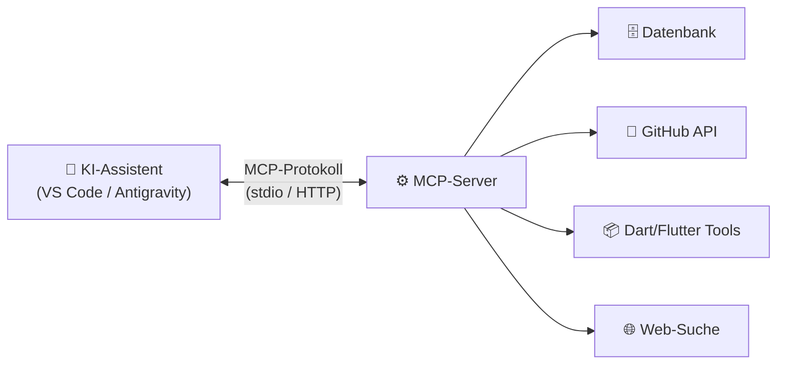

#### Warum MCP-Server verwenden?

| Ohne MCP | Mit MCP |
|----------|---------|
| KI kennt nur lokale Dateien | Zugriff auf externe Datenquellen und APIs |
| Feste, begrenzte Tool-Auswahl | Unbegrenzt erweiterbar durch Community-Server |
| Jede Integration individuell entwickeln | Standardisiertes Protokoll — einmal konfigurieren |
| Keine domänenspezifischen Tools | Spezialisierte Server pro Technologie |

#### Gängige MCP-Server für die Entwicklung

| MCP-Server | Zweck |
|------------|-------|
| `dart-mcp-server` | Dart/Flutter: Analyse, Format, Tests, Hot Reload |
| `github-mcp-server` | GitHub Issues, PRs, Actions, Code-Suche |
| `@modelcontextprotocol/server-memory` | Persistentes Gedächtnis für die KI (Knowledge Graph) |
| `@upstash/context7-mcp` | Aktuelle Bibliotheks-Dokumentation live abrufen |
| `database-mcp` | SQL-Datenbankabfragen direkt aus dem Chat |
| `filesystem-mcp` | Erweiterter Dateizugriff über das Workspace hinaus |

---

### 8.5.3. MCP-Server konfigurieren

MCP-Server werden in JSON-Konfigurationsdateien definiert. VS Code unterstützt zwei Ebenen:

#### Konfigurationsebenen

| Ebene | Pfad | Gilt für |
|-------|------|----------|
| **Global** | `%APPDATA%\Code\User\mcp.json` (Windows) | Alle Workspaces des Nutzers |
| **Workspace** | `.vscode/mcp.json` | Nur diesen Workspace (teamweit teilbar) |

#### Beispielkonfiguration

```json
{
  "servers": {
    "memory": {
      "command": "npx",
      "args": ["-y", "@modelcontextprotocol/server-memory"],
      "type": "stdio"
    },
    "context7": {
      "command": "npx",
      "args": ["-y", "@upstash/context7-mcp"],
      "type": "stdio"
    },
    "github": {
      "command": "npx",
      "args": ["-y", "@modelcontextprotocol/server-github"],
      "type": "stdio",
      "env": {
        "GITHUB_PERSONAL_ACCESS_TOKEN": "${env:GITHUB_TOKEN}"
      }
    }
  }
}
```

> <span style="font-size: 1.5em">:warning:</span> **Achtung:** API-Tokens und Secrets **niemals** direkt in die Konfigurationsdatei schreiben. Verwenden Sie stattdessen Umgebungsvariablen (`${env:VARIABLE_NAME}`), um Credentials sicher zu verwalten.

> <span style="font-size: 1.5em">:bulb:</span> **Tipp:** Die Workspace-Konfiguration `.vscode/mcp.json` kann ins Git-Repository eingecheckt werden, damit das gesamte Team dieselben MCP-Server nutzt — ohne Credentials.

---

### 8.5.4. MCP-Tools in Agents verwenden

Sobald ein MCP-Server konfiguriert ist, können seine Tools in Agent-Definitionen referenziert werden.

#### Im Agent-Header

```yaml
---
description: Flutter Development Agent
name: Flutter Dev
tools: ['search', 'dart-mcp-server/*']   # Alle Tools des Servers einbinden
mcp-servers:
  - dart-mcp-server
---
```

#### Im Agent-Body (explizite Tool-Referenzen)

```markdown
## Flutter Development Instructions

Verwende #tool:dart-mcp-server/analyze_files für statische Code-Analyse.
Führe Tests aus mit #tool:dart-mcp-server/run_tests.
Formatiere Code automatisch mit #tool:dart-mcp-server/dart_format.
```

#### Beispiel: Dart MCP-Server Tools

| Tool | Funktion |
|------|----------|
| `analyze_files` | Dart Analyzer ausführen — Fehler und Warnings anzeigen |
| `dart_format` | Code nach Dart-Formatierungsregeln formatieren |
| `dart_fix` | Automatische Fixes für bekannte Probleme anwenden |
| `run_tests` | Unit- und Widget-Tests ausführen |
| `pub` | Pub-Befehle: `get`, `add`, `upgrade` |
| `hot_reload` | Flutter Hot Reload auslösen |
| `launch_app` | Flutter App starten |

#### Verfügbare Tools eines MCP-Servers anzeigen

```
1. MCP-Server konfigurieren (mcp.json)
2. VS Code Chat öffnen
3. Fragen: "Welche Tools hat der dart-mcp-server?"
   — ODER —
   Command Palette → "MCP: List Tools"
```

> <span style="font-size: 1.5em">:mag:</span> **Vertiefung:** MCP-Server können neben Tools auch **Resources** bereitstellen — strukturierte Daten, die der KI als Kontext übergeben werden (z. B. aktuelle Fehlerlisten, Widget-Trees, Datenbankschemas).

---

### 8.5.5. Quellen

***
Quellen

- [MCP Spezifikation – Offizielle Protokoll-Dokumentation](https://modelcontextprotocol.io/)
- [MCP GitHub – Offizielle Repositories und SDKs](https://github.com/modelcontextprotocol)
- [VS Code MCP Docs – Integration Dokumentation](https://code.visualstudio.com/docs/copilot/chat/mcp-servers)
- [Awesome MCP Servers – Kuratierte Community-Liste](https://github.com/punkpeye/awesome-mcp-servers)
- [MCP.so – MCP Server und Client Discovery](https://mcp.so/)
- [Smithery – MCP-Server Registry](https://smithery.ai/)
***

<div style="page-break-after: always;"></div>

## 8.6. Skills

Stellen Sie sich einen neuen Mitarbeiter vor, der immer dann ein spezialisiertes Fachbuch aufschlägt, wenn er eine Aufgabe bekommt, die sein Basiswissen übersteigt — und das Buch wieder weglegt, sobald die Aufgabe erledigt ist. Genau so funktionieren Skills: Sie werden **on-demand** geladen, liefern gezieltes Expertenwissen, und belasten den Kontext nicht dauerhaft.

### 8.6.1. Was sind Skills?

**Definition:** Skills sind Ordner mit einer `SKILL.md` als Einstiegspunkt sowie optionalen Unterordnern für Referenzen, Templates und Scripts. Ein Agent lädt sie **on-demand**, sobald Beschreibung und Kontext erkennen lassen, dass der Skill zur aktuellen Aufgabe passt.

| Merkmal | Bedeutung |
|---------|-----------|
| **On-demand** | Wird nur bei relevanten Anfragen geladen — kein dauerhafter Kontext-Verbrauch |
| **Gebündelte Assets** | Neben Anweisungen auch Scripts, Templates und Referenzdateien möglich |
| **Wiederverwendbar** | Ein Skill funktioniert in vielen Chats und Projekten |
| **Kontextsparend** | Progressive Loading: nur benötigte Teile werden nachgeladen |

> <span style="font-size: 1.5em">:bulb:</span> **Merksatz:** Ein Skill ist kein "immer aktives Regelwerk", sondern ein **gezielt aktivierbarer Workflow-Baustein**.

---

### 8.6.2. Abgrenzung zu Instructions, Prompts und Agents

| Primitive | Hauptzweck | Wann geeignet? | Typische Grenze |
|-----------|------------|----------------|-----------------|
| **Custom Instructions** | Dauerhafte Regeln und Standards | Wenn Vorgaben fast immer gelten sollen | Zu breite `applyTo`-Muster verbrauchen Kontext |
| **Prompts** | Einzelne, klar umrissene Aufgabe | Wenn eine einmalige Vorlage genügt | Keine gebündelten Assets oder mehrstufige Anleitung |
| **Custom Agents** | Spezifische Rolle mit Tool-Auswahl | Wenn andere Tools, Identitäten oder Handoffs nötig sind | Höherer Konfigurationsaufwand |
| **Skills** | Wiederkehrende Spezialverfahren mit Assets | Wenn ein Agent bei bestimmten Aufgaben Expertenwissen nachladen soll | Schwache Beschreibungen verhindern Discovery |

**Faustregel:**

| Frage | Antwort → Verwende |
|-------|-------------------|
| Gilt die Regel fast immer? | **Instruction** |
| Einmalige Vorlage für eine feste Aufgabe? | **Prompt** |
| Eigene Rolle, Tools oder Handoffs nötig? | **Agent** |
| Wiederkehrender Spezial-Workflow mit Referenzen und Scripts? | **Skill** |

---

### 8.6.3. Aufbau und Struktur

#### Typische Ordnerstruktur

```text
.github/skills/code-review/
├── SKILL.md                    # Pflichtdatei — Einstiegspunkt
├── references/
│   └── checklist.md            # Prüflisten, Hintergrundwissen
├── assets/
│   └── review-template.md      # Ausgabe-Templates
└── scripts/
    └── collect-metrics.ps1     # Hilfsskripte
```

#### Speicherorte

| Pfad | Geltungsbereich |
|------|-----------------|
| `.github/skills/<name>/` | Projektweit im Repository |
| `.agents/skills/<name>/` | Projektweit für agentische Setups |
| `~/.copilot/skills/<name>/` | Persönlich, über mehrere Projekte |

> <span style="font-size: 1.5em">:warning:</span> **Achtung:** Der Ordnername muss mit dem `name`-Feld in der `SKILL.md` übereinstimmen — andernfalls wird der Skill oft nicht erkannt.

#### Aufbau der `SKILL.md`

```markdown
---
name: code-review
description: >
  Führt ein strukturiertes Code Review durch. Verwende diesen Skill bei
  PR-Analysen, Lesbarkeitsprüfungen, Risikoanalysen und Code-Qualitätsbewertungen.
argument-hint: '<datei oder feature>'
user-invocable: true
disable-model-invocation: false
---

# Code Review Skill

## Wann verwenden?
- Bei Pull Requests vor dem Merge
- Bei Refactorings mit erhöhtem Regressionsrisiko
- Bei Onboarding neuer Entwickler

## Vorgehen
1. Analysiere den Code auf Lesbarkeit und SOLID-Prinzipien.
2. Prüfe Error Handling und Edge Cases.
3. Nutze [Prüfliste](./references/checklist.md) für strukturierte Findings.
4. Erstelle Ausgabe nach [Review-Template](./assets/review-template.md).
```

#### Frontmatter-Felder im Überblick

| Feld | Pflicht | Beschreibung |
|------|---------|--------------|
| `name` | ✅ | Eindeutiger Name — muss zum Ordnernamen passen |
| `description` | ✅ | **Entscheidend für Discovery** — enthält Trigger-Wörter und erklärt *was* und *wann* |
| `argument-hint` | optional | Eingabehilfe beim Slash-Aufruf |
| `user-invocable` | optional | `false` = Skill ist nicht als Slash-Befehl sichtbar |
| `disable-model-invocation` | optional | `true` = Skill wird **nicht** automatisch vom Modell geladen |

#### Aktivierungsarten und Konfiguration

| Konfiguration | Als `/skill` aufrufbar | Automatisch ladbar |
|---------------|------------------------|--------------------|
| Standard (beides aktiv) | ✅ | ✅ |
| `user-invocable: false` | ❌ | ✅ |
| `disable-model-invocation: true` | ✅ | ❌ |
| Beide Optionen gesetzt | ❌ | ❌ |

> <span style="font-size: 1.5em">:mag:</span> **Vertiefung: Progressive Loading** — Skills werden nicht vollständig auf einmal geladen. Das Modell prüft zuerst nur `name` und `description` (Discovery). Erst bei Relevanz wird der Body der `SKILL.md` geladen, dann bei Bedarf `references/` und `assets/`. Das schont das Kontextfenster erheblich.

---

### 8.6.4. Einsatzfälle und Praxisbeispiel

#### Typische Einsatzfälle

Skills lohnen sich besonders, wenn Aufgaben **repetitiv und wissensintensiv** sind:

| Aufgabe | Was der Skill mitbringt |
|---------|------------------------|
| **Code Review** | Prüfliste, Findings-Template, Metriken-Skript |
| **Teststrategie** | Test-Matrix-Template, Abdeckungskriterien |
| **Security Review** | OWASP-Checkliste, Remediation-Templates |
| **API Design** | OpenAPI-Vorlage, interne Designstandards |
| **Requirements strukturieren** | Story-Template, Definition of Done |
| **Migrationen begleiten** | Schrittfolge, Rollback-Checkliste, Validierungsskript |
| **ADR erstellen** | Architecture Decision Record-Template |

#### Praxisbeispiel: Code Review Skill

**Ordnerstruktur:**
```text
.github/skills/code-review/
├── SKILL.md
├── references/checklist.md      # SOLID, Error Handling, Naming, etc.
├── assets/review-template.md    # Standardformat für Findings
└── scripts/collect-metrics.ps1  # Dateianzahl, Diff-Größe ermitteln
```

**Vorteil:** Der Agent muss nicht raten, wie ein gutes Review im Team aussieht. Prüfkriterien, Ausgabeformat und Metriken sind versioniert und für alle Teammitglieder gleich — unabhängig davon, welches Modell oder welchen Agent sie verwenden.

---

### 8.6.5. Best Practices und Einführung im Team

#### Do's und Don'ts

| Do ✅ | Don't ❌ |
|-------|---------|
| `description` mit konkreten Trigger-Wörtern formulieren | Vage Beschreibungen wie "Hilfreicher Skill" |
| `SKILL.md` kurz halten, Details in `references/` auslagern | Monolithische Datei mit allen Details |
| Relative Pfade `./references/checklist.md` nutzen | Externe oder fragile Pfade verwenden |
| Schrittfolgen konkret formulieren (1, 2, 3…) | Nur abstrakte Ziele ohne Vorgehen |
| Assets und Templates mitliefern | Ausgaben vollständig dem Modell überlassen |
| Einen Skill auf einen klaren Anwendungsfall zuschneiden | Einen Skill für "alles Mögliche" bauen |

#### Häufige Fehlerquellen

1. **Schwache Description:** Fehlende Trigger-Wörter → Skill wird kaum gefunden
2. **Namenskonflikte:** `name` und Ordnername stimmen nicht überein → Skill nicht erkannt
3. **Zu viel Inhalt in `SKILL.md`:** Widerspricht Progressive Loading — Details gehören in `references/`
4. **Kein klares Vorgehen:** Lose Notiz statt verlässlicher Workflow
5. **Zu grobe Granularität:** Ein Skill für völlig unterschiedliche Aufgaben liefert inkonsistente Ergebnisse

#### Schritt-für-Schritt: Skill im Team einführen

```
1. Wiederkehrende, wissensintensive Aufgabe identifizieren
   → Beispiel: "Wir führen häufig Security Reviews für REST-APIs durch."

2. Klaren Zuschnitt wählen — nicht zu breit
   → Nicht "Security allgemein", sondern "REST API Security Review"

3. description als Discovery-Fläche formulieren
   → Schlüsselwörter, typische Aufgaben, Triggerbegriffe aufnehmen

4. Ressourcen strukturieren
   → Checklisten → references/
   → Templates  → assets/
   → Skripte    → scripts/

5. Im Team testen und iterieren
   → Wird der Skill zuverlässig gefunden?
   → Liefert er konsistente Ergebnisse?
   → Fehlen Vorlagen oder Entscheidungshilfen?
```

> <span style="font-size: 1.5em">:bulb:</span> **Merksatz:** Instructions definieren den Rahmen. Agents liefern die Rollen. Skills bringen das Spezialwissen — genau dann, wenn es gebraucht wird.

---

***
Quellen

- [VS Code Docs – Agent Skills (SKILL.md)](https://code.visualstudio.com/docs/copilot/customization/agent-skills)
- [VS Code Docs – Copilot Customization Überblick](https://code.visualstudio.com/docs/copilot/customization/overview)
- [GitHub Docs – Customizing GitHub Copilot](https://docs.github.com/en/copilot/customizing-copilot)
***

<div style="page-break-after: always;"></div>

## 8.7. Custom Prompts & Workflows

Stellen Sie sich vor, Sie müssen jeden Tag dieselbe Aufgabe erledigen: Unit Tests für eine neue Klasse schreiben, ein Code Review durchführen oder einen Bugfix systematisch angehen. Custom Prompts und Workflows sind Vorlagen für genau diese Aufgaben — einmal definiert, per Klick ausgeführt.

### 8.7.1. Was sind Custom Prompts / Workflows?

**Definition:** Custom Prompts (VS Code) und Workflows (Antigravity) sind vordefinierte Anweisungsvorlagen für wiederkehrende Aufgaben. Sie ermöglichen das schnelle Ausführen von Standardoperationen ohne wiederholte Prompt-Formulierung.

#### Abgrenzung zu Agents

| Merkmal | Custom Agents | Custom Prompts / Workflows |
|---------|---------------|----------------------------|
| **Komplexität** | Vollständige Rollenkonfiguration | Einfache Aufgabenvorlage |
| **Tools** | Explizit konfigurierbar | Keine direkte Tool-Konfiguration |
| **Verkettung** | Handoffs zu anderen Agents | Keine Verkettung |
| **Einsatz** | Dauerhafte Spezialisierung | Einmalige, wiederholbare Ausführung |

> <span style="font-size: 1.5em">:bulb:</span> **Merke:** Prompts/Workflows eignen sich für **einfache, wiederholbare Aufgaben**. Für komplexe Szenarien mit Tool-Nutzung und Rollenidentität → Agents verwenden.

---

### 8.7.2. VS Code Custom Prompts

#### Speicherorte

```
Workspace:     .github/prompts/*.prompt.md
User Profile:  <VS Code Profile-Ordner>/*.prompt.md
```

#### Dateiformat

```markdown
---
description: Kurzbeschreibung für das Prompt-Dropdown
mode: agent | ask | edit
---

## Prompt-Anweisungen

Hier stehen die Markdown-Anweisungen.
Variablen werden mit ${variable} eingefügt.
```

#### Ausführungsmodi

| Modus | Beschreibung | Typischer Einsatz |
|-------|--------------|-------------------|
| `agent` | Voller Tool-Zugriff, kann Dateien anlegen | Tests generieren, Refactoring |
| `ask` | Nur Antwort, keine Dateiänderungen | Code erklären, Reviews, Recherche |
| `edit` | Inline-Editor für gezielte Änderungen | Quick Fixes, Formatierung |

#### Verfügbare Variablen

| Variable | Beschreibung |
|----------|--------------|
| `${file}` | Aktueller Dateiname |
| `${selection}` | Ausgewählter Text im Editor |
| `${input:Bezeichnung}` | Interaktive Benutzereingabe mit Label |
| `${clipboard}` | Inhalt der Zwischenablage |

#### Beispiel: Unit Test Generator

**Datei:** `.github/prompts/generate-tests.prompt.md`

```markdown
---
description: Generiert Unit Tests für die aktuelle Datei
mode: agent
---

Erstelle umfassende Unit Tests für den aktuellen Code.

### Anforderungen
- Arrange-Act-Assert Pattern
- Alle öffentlichen Methoden testen
- Edge Cases und Fehlerszenarien abdecken
- Externe Abhängigkeiten mocken
- Ziel: 80 % Code Coverage

### Ausgabe
Erstelle eine Testdatei im passenden Test-Ordner mit Suffix `_test` oder `.test`.
```

#### Beispiel: Code Review Prompt

**Datei:** `.github/prompts/code-review.prompt.md`

```markdown
---
description: Führt ein strukturiertes Code Review durch
mode: ask
---

Analysiere den ausgewählten Code und gib konstruktives Feedback:

### Prüfpunkte
1. **Lesbarkeit** – Sind Namen aussagekräftig?
2. **SOLID-Prinzipien** – Werden sie eingehalten?
3. **Error Handling** – Sind Fehler korrekt behandelt?
4. **Performance** – Gibt es offensichtliche Optimierungspotenziale?
5. **Tests** – Ist der Code testbar? Fehlen Tests?

### Ausgabeformat
Liste Findings mit Priorität: Kritisch → Wichtig → Optional
```

#### Beispiel: Dokumentations-Generator

**Datei:** `.github/prompts/generate-docs.prompt.md`

```markdown
---
description: Ergänzt fehlende Code-Dokumentation
mode: edit
---

Ergänze fehlende Dokumentation im aktuellen Code:
- JSDoc / Dartdoc / Docstrings hinzufügen
- Parameter und Rückgabewerte beschreiben
- Exceptions dokumentieren
- Bei komplexen Funktionen: Beispiele ergänzen

Prägnant, aber vollständig.
```

#### Beispiel: Prompt mit Variablen

```markdown
---
description: Erklärt Code in gewählter Sprache
mode: ask
---

Erkläre den folgenden Code auf ${input:Zielsprache}:

${selection}
```

---

### 8.7.3. Antigravity Workflows

Google Antigravity verwendet das Konzept der **Workflows** — strukturierte, mehrstufige Anleitung, die mit einem Slash-Befehl aufgerufen wird.

#### Speicherort

```
.agent/workflows/*.md
```

#### Dateiformat

```markdown
---
description: Workflow-Beschreibung für den Aufruf via /workflow-name
---

## Workflow-Name

Schrittweise Anweisungen.
Kann auf andere Dateien referenzieren.
```

#### Beispiel: Feature Implementation Workflow

**Datei:** `.agent/workflows/implement-feature.md`

```markdown
---
description: Implementiert ein neues Feature nach Best Practices
---

### Schritt 1: Analyse
- Codebase analysieren, betroffene Komponenten identifizieren
- Prüfe auf ähnliche bestehende Implementierungen

### Schritt 2: Planung
- Implementation Plan erstellen
- Benötigte Änderungen pro Datei definieren
- Potenzielle Risiken identifizieren

### Schritt 3: Implementierung
- Änderungen schrittweise umsetzen
- Projekt-Konventionen einhalten
- Tests parallel zur Implementierung schreiben

### Schritt 4: Verifizierung
- Alle Tests ausführen
- Lint-Fehler prüfen
- Walkthrough der Änderungen erstellen
```

#### Beispiel: Bug Fix Workflow

**Datei:** `.agent/workflows/fix-bug.md`

```markdown
---
description: Systematisches Debugging und Bugfix
---

### Schritt 1: Reproduktion
- Gemeldeten Fehler verstehen und lokal reproduzieren

### Schritt 2: Analyse
- Root Cause Analysis durchführen
- Verwandte Code-Bereiche prüfen

### Schritt 3: Fix
- Korrektur implementieren — minimal und fokussiert
- Seiteneffekte vermeiden

### Schritt 4: Test
- Regressionstest schreiben, der den Bug reproduziert
- Sicherstellen, dass der Test besteht
```

---

### 8.7.4. Turbo-Annotation für automatische Ausführung

Antigravity Workflows unterstützen eine spezielle Annotation, die bestimmte Schritte **automatisch ohne Rückfrage** ausführt.

```markdown
### Schritt 1: Dependencies installieren

// turbo
Führe `npm install` aus.

### Schritt 2: Tests ausführen

// turbo
Führe `npm test` aus.

### Schritt 3: Build erstellen

Führe `npm run build` aus.    ← kein turbo → User wird gefragt
```

| Annotation | Verhalten |
|------------|-----------|
| `// turbo` | Dieser Schritt wird automatisch ausgeführt |
| `// turbo-all` | Alle Schritte im Workflow laufen automatisch |

> <span style="font-size: 1.5em">:warning:</span> **Achtung:** `turbo`-Annotationen nur für sichere, nicht-destruktive Befehle verwenden. Befehle wie `rm -rf` oder Deployments niemals mit `turbo` automatisieren.

---

### 8.7.5. Custom Prompts/Workflows erstellen

#### In VS Code

```
1. Command Palette → "Configure Custom Prompts"
2. "Create new prompt" auswählen
3. Speicherort wählen:
   .github/prompts/   → nur dieser Workspace
   User Profile        → alle Workspaces
4. Dateinamen eingeben (z. B. generate-tests.prompt.md)
5. YAML-Header: description und mode ausfüllen
6. Prompt-Anweisungen schreiben
```

#### In Antigravity

```
1. Ordner .agent/workflows/ anlegen
2. Neue Datei anlegen (z. B. fix-bug.md)
3. YAML-Header mit description ausfüllen
4. Workflow-Schritte dokumentieren
5. Aufruf im Chat: /fix-bug
```
---

### 8.7.6. Best Practices

| Do ✅ | Don't ❌ |
|-------|---------|
| Klare, spezifische Anweisungen formulieren | Vage, mehrdeutige Beschreibungen |
| Strukturiertes Ausgabeformat vorgeben | Unstrukturierte Freitextausgabe |
| Variablen für Flexibilität nutzen | Werte hardcoden |
| Prompts thematisch in Unterordner gruppieren | Alle Prompts flach in einem Ordner |
| `mode` bewusst wählen (`ask` für Reviews, `agent` für Generierung) | Immer `agent` verwenden (unnötiger Tool-Overhead) |

---

### 8.7.7. Quellen

***
Quellen

- [VS Code – Reusable Prompt Files (Dokumentation)](https://code.visualstudio.com/docs/copilot/copilot-customization#_reusable-prompt-files-experimental)
- [GitHub Docs – Prompt Engineering für Copilot Chat](https://docs.github.com/en/copilot/concepts/prompting/prompt-engineering)
- [GitHub Docs – Getting started with prompts for Copilot Chat](https://docs.github.com/copilot/get-started/getting-started-with-prompts-for-copilot-chat)
***

<div style="page-break-after: always;"></div>

## 8.8. Hooks in VS Code

Stellen Sie sich vor, jedes Mal wenn ein Kollege eine Datei im gemeinsamen Projekt speichert, läuft automatisch der Linter, werden Tests ausgeführt und ein Log-Eintrag erstellt — ohne dass jemand daran denken muss. Genau das leisten **Hooks** in VS Code: Sie verbinden bestimmte Ereignisse im Agenten-Lebenszyklus mit deterministischen, codegesteuerten Aktionen.

**Definition:** Hooks sind JSON-konfigurierte Skript-Trigger, die an definierten Lifecycle-Punkten einer KI-Agenten-Session ausgeführt werden. Im Gegensatz zu Instructions oder Custom Prompts, die das *Verhalten* der KI steuern, führen Hooks konkreten Code aus — mit **garantiertem** Ergebnis.

> <span style="font-size: 1.5em">:bulb:</span> **Merksatz:** Instructions sagen der KI *wie* sie denken soll. Hooks bestimmen, *was* bei bestimmten Ereignissen unweigerlich passiert — unabhängig vom Prompt.

---

### 8.8.1. Was sind Hooks?

Hooks bieten deterministische, codegesteuerte Automatisierung an den Übergabepunkten des KI-Agenten-Workflows. Ihre wichtigsten Einsatzbereiche:

| Einsatzbereich | Beschreibung |
|----------------|--------------|
| **Sicherheitsrichtlinien durchsetzen** | Gefährliche Befehle wie `rm -rf` oder `DROP TABLE` *vor* der Ausführung blockieren |
| **Code-Qualität automatisieren** | Formatter, Linter oder Tests automatisch nach Dateiänderungen ausführen |
| **Audit-Trails erstellen** | Jede Tool-Aufrufung, Befehlsausführung oder Dateiänderung protokollieren |
| **Kontext injizieren** | Projektspezifische Informationen oder Umgebungsvariablen zur Session hinzufügen |
| **Freigaben steuern** | Sichere Operationen automatisch erlauben, sensible Operationen bestätigen lassen |

#### Abgrenzung zu anderen Konfigurationsmitteln

| Merkmal | Custom Instructions | Custom Prompts | Hooks |
|---------|---------------------|----------------|-------|
| **Wirkung auf** | KI-Verhalten & Stil | Aufgabenstruktur | Ereignisse & externe Systeme |
| **Ausführung** | Beim Start / bei Anfrage | Bei explizitem Aufruf | **Deterministisch** bei Lifecycle-Events |
| **Technologie** | Markdown | Markdown | JSON + Skripte (bash, PowerShell, ...) |
| **Garantie** | Keine (LLM kann abweichen) | Keine | **Immer ausgeführt** |

> <span style="font-size: 1.5em">:warning:</span> **Achtung:** Da die KI Zugriff auf Hook-Skripte haben kann, sollte mit `chat.tools.edits.autoApprove` verhindert werden, dass der Agent Hook-Skripte ohne manuelle Bestätigung bearbeitet.

---

### 8.8.2. Hook-Lifecycle-Events

VS Code unterstützt acht Hook-Events, die an spezifischen Punkten einer Agenten-Session ausgelöst werden:

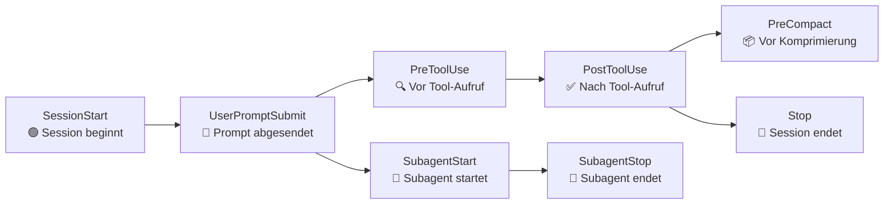

| Hook-Event | Zeitpunkt | Typische Anwendungsfälle |
|------------|-----------|--------------------------|
| `SessionStart` | Erster Prompt einer neuen Session | Ressourcen initialisieren, Session-Start loggen, Projektstatus prüfen |
| `UserPromptSubmit` | Benutzer sendet einen Prompt | Anfragen auditieren, System-Kontext injizieren |
| `PreToolUse` | Bevor der Agent ein Tool aufruft | Gefährliche Operationen blockieren, Freigabe anfordern, Tool-Input modifizieren |
| `PostToolUse` | Nach erfolgreichem Tool-Abschluss | Formatter ausführen, Ergebnisse loggen, Folgeaktionen auslösen |
| `PreCompact` | Bevor der Kontext komprimiert wird | Wichtigen Kontext exportieren, Zustand vor Truncation speichern |
| `SubagentStart` | Subagent wird gestartet | Verschachtelte Agent-Nutzung verfolgen, Subagent-Ressourcen initialisieren |
| `SubagentStop` | Subagent beendet sich | Ergebnisse aggregieren, Subagent-Ressourcen aufräumen |
| `Stop` | Agenten-Session endet | Reports generieren, Ressourcen aufräumen, Benachrichtigungen senden |

---

### 8.8.3. Hooks konfigurieren

#### Speicherorte

Hooks werden in JSON-Dateien konfiguriert. VS Code durchsucht folgende Verzeichnisse:

| Scope | Standard-Pfad | Priorität |
|-------|---------------|-----------|
| Workspace | `.github/hooks/*.json` | Hoch (überschreibt User-Hooks) |
| Workspace (Claude-Format) | `.claude/settings.json`, `.claude/settings.local.json` | Hoch |
| User (global) | `~/.copilot/hooks`, `~/.claude/settings.json` | Niedrig |
| Custom Agent | `hooks`-Feld in `.agent.md` Frontmatter | Nur für diesen Agent |
| Plugin | `hooks.json` im Plugin-Verzeichnis | Nur für das Plugin |

> <span style="font-size: 1.5em">:mag:</span> **Vertiefung:** In einem Monorepo kann mit `chat.useCustomizationsInParentRepositories` die Hook-Erkennung auf das übergeordnete Repository ausgeweitet werden.

Die Standard-Konfiguration in `settings.json`:

```json
"chat.hookFilesLocations": {
  ".github/hooks": true,
  ".claude/settings.local.json": true,
  ".claude/settings.json": true,
  "~/.claude/settings.json": true
}
```

Einzelne Pfade können mit `false` deaktiviert werden:

```json
"chat.hookFilesLocations": {
  ".claude/settings.json": false
}
```

#### Hook-Konfigurationsformat

Eine Hook-Datei enthält ein `hooks`-Objekt mit Event-Namen als Schlüssel:

```json
{
  "hooks": {
    "PreToolUse": [
      {
        "type": "command",
        "command": "./scripts/validate-tool.sh",
        "timeout": 15
      }
    ],
    "PostToolUse": [
      {
        "type": "command",
        "command": "npx prettier --write \"$TOOL_INPUT_FILE_PATH\""
      }
    ]
  }
}
```

#### Hook-Befehlseigenschaften

| Eigenschaft | Typ | Beschreibung |
|-------------|-----|--------------|
| `type` | string | Muss `"command"` sein |
| `command` | string | Standard-Befehl (plattformübergreifend) |
| `windows` | string | Windows-spezifischer Befehl (optional) |
| `linux` | string | Linux-spezifischer Befehl (optional) |
| `osx` | string | macOS-spezifischer Befehl (optional) |
| `cwd` | string | Arbeitsverzeichnis (relativ zum Repository-Root) |
| `env` | object | Zusätzliche Umgebungsvariablen |
| `timeout` | number | Timeout in Sekunden (Standard: 30) |

Beispiel für OS-spezifische Befehle:

```json
{
  "hooks": {
    "PostToolUse": [
      {
        "type": "command",
        "command": "./scripts/format.sh",
        "windows": "powershell -File scripts\\format.ps1",
        "linux": "./scripts/format-linux.sh",
        "osx": "./scripts/format-mac.sh"
      }
    ]
  }
}
```

---

### 8.8.4. Hook-Kommunikation: Input & Output

Hooks kommunizieren mit VS Code über **stdin** (Eingabe) und **stdout** (Ausgabe) im JSON-Format.

#### Gemeinsame Eingabefelder (alle Hooks)

```json
{
  "timestamp": "2026-02-09T10:30:00.000Z",
  "cwd": "/path/to/workspace",
  "sessionId": "session-identifier",
  "hookEventName": "PreToolUse",
  "transcript_path": "/path/to/transcript.json"
}
```

`PreToolUse`-Hooks erhalten zusätzlich:

```json
{
  "tool_name": "editFiles",
  "tool_input": { "files": ["src/main.ts"] },
  "tool_use_id": "tool-123"
}
```

#### Ausgabeformat

Hooks geben JSON über stdout zurück und steuern damit das Verhalten des Agenten:

```json
{
  "continue": true,
  "stopReason": "Sicherheitsrichtlinie verletzt",
  "systemMessage": "Unit-Tests fehlgeschlagen"
}
```

| Feld | Typ | Beschreibung |
|------|-----|--------------|
| `continue` | boolean | `false` stoppt die Verarbeitung (Standard: `true`) |
| `stopReason` | string | Begründung für den Stopp (wird dem Benutzer angezeigt) |
| `systemMessage` | string | Warnmeldung für den Benutzer im Chat |

#### Exit-Codes

| Exit-Code | Verhalten |
|-----------|-----------|
| `0` | Erfolg: stdout wird als JSON geparst |
| `2` | Blockierender Fehler: Verarbeitung stoppen, Fehler dem Modell anzeigen |
| Sonstige | Nicht-blockierende Warnung: Warnung anzeigen, Verarbeitung fortsetzen |

> <span style="font-size: 1.5em">:bulb:</span> **Merksatz:** Exit-Code 2 ist der einfachste Weg, eine Operation zu blockieren. Für präzisere Steuerung (erlauben/ablehnen/bestätigen) verwende `hookSpecificOutput.permissionDecision`.

---

### 8.8.5. Praxisbeispiele

#### Beispiel 1: Einfacher Prettier-Hook (Schnellstart)

Das einfachste Beispiel — Prettier nach jeder Dateiänderung ausführen:

**`.github/hooks/format.json`:**
```json
{
  "hooks": {
    "PostToolUse": [
      {
        "type": "command",
        "command": "npx prettier --write \"$TOOL_INPUT_FILE_PATH\""
      }
    ]
  }
}
```

Nach dem Speichern lädt VS Code den Hook automatisch. Die Ausführung kann im **GitHub Copilot Chat Hooks** Output-Channel überprüft werden.

#### Beispiel 2: Gefährliche Terminal-Befehle blockieren

**`.github/hooks/security.json`:**
```json
{
  "hooks": {
    "PreToolUse": [
      {
        "type": "command",
        "command": "./scripts/block-dangerous.sh",
        "windows": "powershell -File scripts\\block-dangerous.ps1",
        "timeout": 5
      }
    ]
  }
}
```

**`scripts/block-dangerous.sh`:**
```bash
#!/bin/bash
INPUT=$(cat)
TOOL_NAME=$(echo "$INPUT" | jq -r '.tool_name')
TOOL_INPUT=$(echo "$INPUT" | jq -r '.tool_input')

if [ "$TOOL_NAME" = "runTerminalCommand" ]; then
  COMMAND=$(echo "$TOOL_INPUT" | jq -r '.command // empty')

  if echo "$COMMAND" | grep -qE '(rm\s+-rf|DROP\s+TABLE|DELETE\s+FROM)'; then
    echo '{"hookSpecificOutput":{"permissionDecision":"deny","permissionDecisionReason":"Destruktiver Befehl durch Sicherheitsrichtlinie blockiert"}}'
    exit 0
  fi
fi

echo '{"continue":true}'
```

#### Beispiel 3: Projektkontext beim Session-Start injizieren

**`.github/hooks/context.json`:**
```json
{
  "hooks": {
    "SessionStart": [
      {
        "type": "command",
        "command": "./scripts/inject-context.sh"
      }
    ]
  }
}
```

**`scripts/inject-context.sh`:**
```bash
#!/bin/bash
PROJECT_INFO=$(cat package.json 2>/dev/null | jq -r '.name + " v" + .version' || echo "Unbekanntes Projekt")
BRANCH=$(git branch --show-current 2>/dev/null || echo "unbekannt")

cat <<EOF
{
  "hookSpecificOutput": {
    "hookEventName": "SessionStart",
    "additionalContext": "Projekt: $PROJECT_INFO | Branch: $BRANCH | Node: $(node -v 2>/dev/null || echo 'nicht installiert')"
  }
}
EOF
```

#### Beispiel 4: Freigabe für sensible Tools anfordern

**`scripts/require-approval.sh`:**
```bash
#!/bin/bash
INPUT=$(cat)
TOOL_NAME=$(echo "$INPUT" | jq -r '.tool_name')

SENSITIVE_TOOLS="runTerminalCommand|deleteFile|pushToGitHub"

if echo "$TOOL_NAME" | grep -qE "^($SENSITIVE_TOOLS)$"; then
  echo '{"hookSpecificOutput":{"permissionDecision":"ask","permissionDecisionReason":"Diese Operation erfordert manuelle Freigabe"}}'
else
  echo '{"hookSpecificOutput":{"permissionDecision":"allow"}}'
fi
```

---

### 8.8.6. Agent-scoped Hooks

> <span style="font-size: 1.5em">:mag:</span> **Vertiefung (Preview):** Agent-scoped Hooks sind direkt in der `.agent.md`-Datei eines Custom Agents definiert und laufen **nur**, wenn dieser Agent aktiv ist.

Aktivierung in `settings.json`:
```json
{
  "chat.useCustomAgentHooks": true
}
```

Beispiel — ein Agent, der nach jedem Edit automatisch formatiert:

```yaml
---
name: "Strict Formatter"
description: "Agent mit automatischer Code-Formatierung nach jeder Änderung"
tools: ['search', 'editFiles', 'usages']
hooks:
  PostToolUse:
    - type: command
      command: "./scripts/format-changed-files.sh"
---

Du bist ein Code-Editor-Agent. Nach deinen Änderungen werden die Dateien automatisch formatiert.
```

Der Vorteil: Hook-Logik und Agent-Konfiguration sind in einer einzigen Datei zusammengefasst — keine getrennten JSON-Dateien nötig.

---

### 8.8.7. Hooks über die UI erstellen

VS Code bietet eine interaktive Oberfläche zur Hook-Konfiguration:

1. `/hooks` im Chat-Input eingeben und `Enter` drücken, **oder**
2. Command Palette öffnen → **Chat: Configure Hooks** ausführen, **oder**
3. Zahnrad-Symbol oben im Chat-View → **Hooks** auswählen

Im Konfigurationsmenü:
1. Hook-Event-Typ aus der Liste auswählen
2. Bestehenden Hook bearbeiten oder **Add new hook** auswählen
3. Hook-Konfigurationsdatei auswählen oder erstellen

#### Hooks mit KI generieren

Mit dem Befehl `/create-hook` im Chat kann ein Hook per natürlichsprachlicher Beschreibung generiert werden:

> *"run ESLint after every file edit"*

Der Agent stellt Rückfragen und generiert eine vollständige Hook-Konfigurationsdatei.

---

### 8.8.8. Best Practices & Sicherheit

#### Do's ✅

| # | Empfehlung | Begründung |
|---|------------|------------|
| 1 | **Klein beginnen** | Mit einem einfachen `PostToolUse`-Hook starten (z. B. Prettier) |
| 2 | **Output-Channel prüfen** | `GitHub Copilot Chat Hooks` im Output-Panel für Debugging nutzen |
| 3 | **OS-spezifische Befehle** | `windows`/`linux`/`osx` Felder nutzen für plattformübergreifende Teams |
| 4 | **Timeouts setzen** | Besonders bei Sicherheits-Hooks kurze Timeouts (5–10 s) definieren |
| 5 | **Skripte versionieren** | Hook-Skripte im Repository unter `.github/hooks/` und `scripts/` pflegen |

#### Don'ts ❌

| # | Anti-Pattern | Warum problematisch |
|---|--------------|---------------------|
| 1 | **Keine Ausführrechte** | Skripte ohne `chmod +x` werden mit "Permission denied" scheitern |
| 2 | **KI darf Hook-Skripte editieren** | Ohne `chat.tools.edits.autoApprove`-Einschränkung kann die KI ihre eigenen Sicherheitschecks umgehen |
| 3 | **Endlos-Schleifen in Stop-Hooks** | `Stop`-Hooks müssen `stop_hook_active` prüfen, sonst wird die Session nicht beendet |
| 4 | **Fehlende jq-Abhängigkeit** | Shell-Skripte mit JSON-Parsing benötigen `jq` — Verfügbarkeit sicherstellen |

> <span style="font-size: 1.5em">:warning:</span> **Achtung:** Wenn der Agent Zugriff auf die Hook-Skripte hat, kann er diese während der Session modifizieren und dann den modifizierten Code ausführen. Schützen Sie Hook-Skripte mit `chat.tools.edits.autoApprove`, um unbeabsichtigte Änderungen zu verhindern.

---

### 8.8.9. Quellen

***
Quellen

- [VS Code Docs – Agent Hooks (Offizielle Dokumentation)](https://code.visualstudio.com/docs/copilot/customization/hooks)
- [VS Code Blog – Making Agents Practical: Automate with Hooks](https://code.visualstudio.com/blogs/2026/03/05/making-agents-practical-for-real-world-development#automate-with-hooks)
- [VS Code Docs – Agent Plugins: Hooks in Plugins](https://code.visualstudio.com/docs/copilot/customization/agent-plugins#hooks-in-plugins)
- [GitHub Copilot Customization Overview](https://code.visualstudio.com/docs/copilot/customization/overview)
***

<div style="page-break-after: always;"></div>

## 8.9. Best Practices & Erweiterungen

Die vorigen Kapitel haben die einzelnen Werkzeuge vorgestellt. Dieses Kapitel zeigt, wie sie **zusammenspielen** — und welche übergreifenden Praktiken den Alltag mit KI-gestützter Entwicklung produktiver und verlässlicher machen.

> <span style="font-size: 1.5em">:bulb:</span> **Merksatz:** Standardisiere Quellen und Templates, frage vor dem Erstellen nach, und halte Kontexte schlank — so bleiben KI-gestützte Prozesse effizient und verlässlich.

---

### 8.9.1. Dokumenten-Templates

Wenn Agents Dokumente erstellen — User Stories, ADRs, Testpläne — sollten diese einem einheitlichen Format folgen. Templates definieren dieses Format einmalig und verhindern, dass jede Ausgabe anders aussieht.

#### Warum Templates verwenden?

| Vorteil | Beschreibung |
|---------|--------------|
| **Konsistenz** | Einheitliche Dokumentenstruktur im gesamten Projekt |
| **Effizienz** | Agent muss Struktur nicht jedes Mal neu erfinden |
| **Qualität** | Vordefinierte Abschnitte verhindern Auslassungen |
| **Teamstandards** | Templates spiegeln vereinbarte Konventionen wider |

#### Empfohlene Verzeichnisstruktur

```
.github/
├── agents/
│   └── requirements.agent.md
└── templates/
    ├── user-story.md
    ├── architecture-decision-record.md
    ├── test-plan.md
    └── review-checklist.md
```

#### Templates im Agent referenzieren

```markdown
## Requirements Engineering Instructions

### Dokumentenerstellung

Verwende Templates aus `.github/templates/`:

| Dokument | Template | Standard-Speicherort |
|----------|----------|----------------------|
| User Story | `user-story.md` | `docs/requirements/user-stories/` |
| Epic | `epic.md` | `docs/requirements/epics/` |
| Story Map | `story-map.md` | `docs/requirements/` |

### Workflow vor der Erstellung
1. Frage den Benutzer: "Soll ich ein [Dokumenttyp]-Dokument erstellen?"
2. Schlage Standard-Speicherort vor oder frage nach alternativem Pfad
3. Warte auf Bestätigung — erstelle das Dokument erst danach
```

> <span style="font-size: 1.5em">:warning:</span> **Wichtig:** Agents sollten **niemals** Dokumente ohne vorherige Rückfrage erstellen. Das verhindert unerwünschte Dateien und gibt dem Nutzer Kontrolle über Speicherorte.

---

### 8.9.2. Kontextquellen & Referenzquellen

Ein Agent, der weiß, wo er relevante Informationen findet, liefert konsistentere und projektspezifischere Antworten als einer, der nur auf sein allgemeines Wissen zurückgreift.

#### Arten von Kontextquellen

| Quelle | Beschreibung | Typischer Einsatz |
|--------|--------------|-------------------|
| **Lokale Dokumentation** | Markdown-Dateien im Repo | Architektur, Coding Standards, Glossar |
| **API-Dokumentation** | URLs zu offiziellen Docs | Framework-Fragen, Widget-Parameter |
| **Beispiel-Repositories** | GitHub-Links | Referenzimplementierungen |
| **Interne Wikis** | Confluence, Notion etc. | Team-Konventionen, Prozessdokumentation |

#### Empfohlene lokale Dokumentationsstruktur

```
docs/
├── architecture/
│   ├── overview.md          # Architekturübersicht
│   ├── decisions/           # Architecture Decision Records (ADRs)
│   └── patterns.md          # Verwendete Design Patterns
├── conventions/
│   ├── coding-standards.md  # Code-Konventionen
│   ├── naming.md            # Naming Conventions
│   └── git-workflow.md      # Git Branching Strategy
├── domain/
│   ├── glossary.md          # Domänen-Glossar
│   └── bounded-contexts.md  # DDD Bounded Contexts
└── api/
    ├── endpoints.md         # API-Dokumentation
    └── error-codes.md       # Fehlercode-Referenz
```

#### Kontextquellen im Agent strukturiert referenzieren

```markdown
## Backend Development Instructions

### Kontextquellen — lies zuerst bei diesen Fragen

| Thema | Quelle |
|-------|--------|
| Architektur | `docs/architecture/overview.md` |
| Coding Standards | `docs/conventions/coding-standards.md` |
| Domänenbegriffe | `docs/domain/glossary.md` |
| API-Referenz | `docs/api/endpoints.md` |
| Git-Workflow | `docs/conventions/git-workflow.md` |

### Externe Referenzen bei Framework-Fragen

| Thema | URL |
|-------|-----|
| Dart Best Practices | https://dart.dev/effective-dart |
| Flutter Widgets | https://api.flutter.dev/flutter/widgets/ |
| Material Design 3 | https://m3.material.io/ |

### Priorität
Lokale Konventionen > Offizielle Docs > Community-Lösungen
```

> <span style="font-size: 1.5em">:bulb:</span> **Tipp:** Erstelle eine zentrale `CONTEXT.md` (in `.github/` oder `docs/`) die alle Quellen mit kurzer Beschreibung listet. Referenziere diese Datei in Agents statt die Quellen einzeln zu wiederholen.

---

### 8.9.3. SubAgents für Kontextisolation

Je länger ein Chat läuft, desto mehr Kontext akkumuliert sich — und desto höher wird das Risiko von **Context Confusion**: Der Agent verliert den Fokus, vermischt Informationen oder liefert inkonsistente Antworten.

#### Das Problem: Kontextwachstum

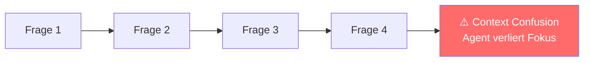

#### Die Lösung: SubAgents

SubAgents sind **isolierte Agent-Instanzen**, die:
- Einen eigenen, schlanken Kontext erhalten
- Nur die für die Teilaufgabe nötigen Informationen bekommen
- Nur ihr Ergebnis (nicht den gesamten Chat) zurückliefern

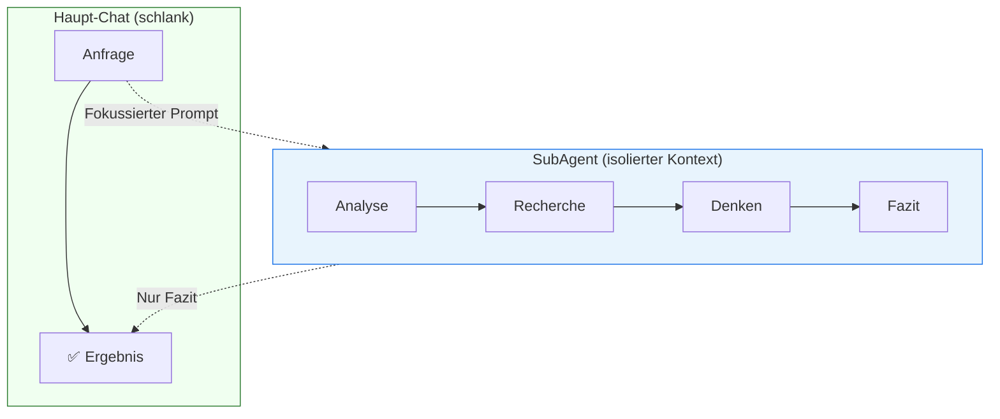

#### SubAgent in VS Code verwenden

```
#runSubagent
```

**Beispiele:**

```
Recherchiere mit #runSubagent die Vor- und Nachteile von
Riverpod vs. BLoC für State Management in Flutter.
Gib eine Empfehlung basierend auf unserem Projekt.
```

```
Analysiere mit #runSubagent die Abhängigkeiten in #file:src
und identifiziere zirkuläre Imports.
```

#### Anwendungsfälle

| Szenario | Warum SubAgent? |
|----------|-----------------|
| **Tiefe Recherche** | Sammelt viel Kontext — würde Haupt-Chat überladen |
| **Seitenthemen** | Kurzer Abstecher ohne Haupt-Kontext zu verschmutzen |
| **Technische Analyse** | Detailarbeit, nur das Fazit ist relevant |
| **Code Review** | Umfangreiche Analyse, kompaktes Feedback zurück |

#### SubAgents vs. Handoffs

| Eigenschaft | SubAgents | Handoffs |
|-------------|-----------|----------|
| **Kontext** | Isoliert — eigener Kontext | Geteilt — gleicher Chat-Verlauf |
| **Kontrolle** | Automatisch, keine User-Pause | User kann Prompt vor Absenden editieren |
| **Ergebnis** | Nur Fazit zurück | Vollständiger Chat-Verlauf sichtbar |
| **Einsatz** | Tiefe Recherche, Seitenthemen | Workflow-Übergabe zwischen Rollen |

> <span style="font-size: 1.5em">:bulb:</span> **Merksatz:** SubAgents sind "Consultants" — sie arbeiten im Hintergrund und liefern nur das Ergebnis. Handoffs sind "Staffelübergaben" — der nächste Agent übernimmt den gesamten Kontext.

---

### 8.9.4. Prompt-Bibliotheken

Eine Prompt-Bibliothek ist eine **versionierte Sammlung wiederverwendbarer Prompt-Vorlagen** im Repository — direkt neben dem Code, reviewbar wie Code, nutzbar von allen Teammitgliedern.

#### Warum eine Prompt-Bibliothek?

| Vorteil | Beschreibung |
|---------|--------------|
| **Konsistenz** | Gleiche Aufgaben → gleiche Qualität für alle |
| **Effizienz** | Weniger Tipparbeit, schnellerer Einstieg |
| **Qualität** | Explizite Kriterien verbessern KI-Ausgaben |
| **Wissensweitergabe** | Best Practices werden teamweit geteilt |

#### Verzeichnisstruktur

```
.github/prompts/
├── testing/              # Unit Tests, Testdaten, Coverage-Analyse
├── refactoring/          # Lesbarkeit, SOLID, Patterns
├── debugging/            # Fehlersuche, Log-Analyse
├── documentation/        # README, ADR, Changelogs
└── communicate/          # PR-Beschreibungen, Commit Messages
```

#### Prompt-Datei mit Metadaten

```markdown
---
title: Generate Unit Tests
category: testing
intent: create-tests-for-selected-function
context: "#selection, #file"
owner: team-backend
version: 1.0
---

Ziel:
Erzeuge Unit-Tests für die markierte Funktion in #selection.

Rahmenbedingungen:
- Nutze das bestehende Test-Framework des Projekts.
- Decke Randfälle ab; benenne Tests sprechend.
- Kein Netzwerk-/Dateisystemzugriff außer Mocks.

Akzeptanzkriterien:
- Tests sind deterministisch, unabhängig und wartbar.

Kontext: #file, #selection
Output: Nur Testcode, keine Erklärungen.
```

#### Do's und Don'ts für Prompt-Bibliotheken

| Do ✅ | Don't ❌ |
|-------|---------|
| Ziel, Anforderungen und Akzeptanzkriterien explizit formulieren | Kontextlose Einzeiler |
| Chat-Variablen `#file`, `#selection` nutzen | Auf impliziten Kontext hoffen |
| Versionieren und reviewen (Pull Request wie bei Code) | Einmal schreiben, nie aktualisieren |
| Offizielle Docs als Referenz angeben | Unsichere Fremdquellen priorisieren |
| Metadaten pflegen (`owner`, `version`, `last-reviewed`) | Keine Governance |

---

### 8.9.5. Komposition von Agentic Workflows

Der größte Nutzen entsteht durch die **Kombination** aller Werkzeuge zu vollständigen Agentic Workflows. Ein bewährtes Muster trennt **Planung** von **Implementierung**:

#### Plan → Implement Workflow

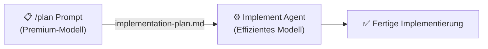

**Schritt 1 — Planung mit Premium-Modell:**
- `/plan`-Prompt-Datei mit leistungsstarkem Modell (z. B. Claude Opus) ausführen
- Detaillierten Plan in `implementation-plan.md` speichern
- Plan enthält Schritte, Dateiliste und Code-Snippets

**Schritt 2 — Implementierung mit effizientem Modell:**
- Neue Chat-Sitzung mit **Implement Agent** starten
- `implementation-plan.md` als Kontext übergeben
- Agent führt Schritte systematisch aus

> <span style="font-size: 1.5em">:mag:</span> **Vertiefung:** Diese Trennung optimiert **Kosten und Qualität**: Das teure Modell übernimmt die kreative "Denk"-Arbeit. Das günstigere Modell führt die mechanische Implementierung aus — gesteuert durch den präzisen Plan.

#### Vollständige Werkzeugkombination

| Werkzeug | Rolle im Workflow |
|----------|------------------|
| **Custom Instructions** | Dauerhafte Coding-Standards — gelten immer |
| **Custom Agent** | Spezialisierte Rolle (Architekt, Developer, Tester) |
| **Skills** | On-demand Expertenwissen (Security, Testing, API Design) |
| **Prompt/Workflow** | Startet und strukturiert die konkrete Aufgabe |
| **SubAgent** | Isolierte Recherche ohne Kontextverschmutzung |
| **Templates** | Konsistente Ausgabeformate für Dokumente |

---

### 8.9.6. Weitere Best Practices

| Thema | Empfehlung |
|-------|-----------|
| **Kontext schlank halten** | Regelmäßig neue Chat-Sitzungen starten; SubAgents für Seitenthemen |
| **Quellen versionieren** | Instructions, Agents, Skills, Prompts ins Git-Repository |
| **Iterativ verbessern** | Outputs reviewen und Prompts/Instructions anpassen |
| **Sicherheit** | Keine Secrets in Prompt-Dateien; `runTerminalCommand` nur für vertrauenswürdige Agents |
| **Teamweite Einführung** | Mit einem Skill oder Prompt starten — nicht alles auf einmal konfigurieren |

---

***
Quellen

- [VS Code Copilot Customization – Gesamtübersicht](https://code.visualstudio.com/docs/copilot/customization/overview)
- [VS Code – SubAgents (Kontextisolation)](https://code.visualstudio.com/docs/copilot/chat/chat-sessions#_contextisolated-subagents)
- [GitHub Docs – Copilot Chat Cookbook (Beispiel-Prompts)](https://docs.github.com/en/copilot/example-prompts-for-github-copilot-chat)
- [GitHub Docs – Best Practices für GitHub Copilot](https://docs.github.com/en/copilot/get-started/best-practices)
- [Context Engineering – dbreunig.com](https://www.dbreunig.com/2025/06/26/how-to-fix-your-context.html)
- [PromptHub – One-Click GitHub Copilot Prompts](https://www.prompthub.us/blog/prompthub-github-one-click-github-copilot-prompts-are-live)
***

<div style="page-break-after: always;"></div>

## Glossar

Alphabetisch sortierte Übersicht aller zentralen Fachbegriffe dieses Skripts.

---

**`.agent.md`**
Dateiendung für Custom-Agent-Konfigurationsdateien in VS Code (z. B. `requirements.agent.md`). Definiert Rolle, Anweisungen, Tools und Handoffs eines Agents.

---

**`.instructions.md`**
Dateiendung für Custom-Instruction-Dateien in VS Code. Werden automatisch in den System Prompt injiziert, wenn der `applyTo`-Frontmatter-Wert auf die aktuelle Datei passt.

---

**`.prompt.md`**
Dateiendung für Custom-Prompt-Dateien in VS Code. Wiederverwendbare Prompt-Vorlagen, die manuell aus der Command Palette oder dem Chat aufgerufen werden.

---

**Agent-Modi**
Arbeitsphasen eines KI-Agents: *Planning* (Aufgabe strukturieren), *Execution* (Schritte ausführen), *Verification* (Ergebnisse prüfen). Der Agent wechselt dynamisch zwischen diesen Modi.

---

**Antigravity**
KI-Entwicklungsassistent von Google (ehemals bekannt als Project IDX AI). Integriert direkt in die Google-Entwicklungsumgebung; unterstützt Custom Agents, Workflows und Turbo-Annotationen.

---

**`applyTo`**
Frontmatter-Schlüssel in `.instructions.md`-Dateien. Definiert per Glob-Muster, auf welche Dateien die Instruction automatisch angewendet wird (z. B. `**/*.dart`, `**/tests/**`).

---

**Artifact**
In Antigravity: Ein generierter Ausgabeblock (Datei, Code-Snippet, Dokument), den der Agent als separates, wiederverwendbares Objekt zurückgibt — vergleichbar mit einer Datei-Vorschau.

---

**Context Engineering**
Disziplin, die sich mit der systematischen Gestaltung des gesamten Kontexts beschäftigt, den ein KI-Modell erhält — nicht nur des einzelnen Prompts. Umfasst System Prompt, Dateireferenzen, Instructions, Toolergebnisse und Gesprächshistorie.

---

**Context Window**
Maximale Menge an Token (Zeichen/Wörter), die ein KI-Modell gleichzeitig verarbeiten kann. Überschreitet der Kontext dieses Limit, werden ältere Informationen abgeschnitten. Typische Größen: 128 K–200 K Token.

---

**Custom Agent**
Spezialisierte KI-Instanz mit definierter Rolle, eigenen Anweisungen und Werkzeugen. Wird über eine `.agent.md`-Datei (VS Code) oder eine entsprechende Konfigurationsdatei (Antigravity) definiert.

---

**Custom Instructions**
Dauerhaft aktive Konfigurationsanweisungen für den KI-Assistenten. Werden automatisch in den System Prompt eingefügt ohne explizite Erwähnung im Chat-Prompt. Definiert in `.instructions.md`-Dateien.

---

**Custom Prompt**
Vordefinierte, wiederverwendbare Prompt-Vorlage für eine konkrete Aufgabe (z. B. Tests generieren, Code Review). Gespeichert als `.prompt.md`-Datei, manuell aus der UI aufgerufen.

---

**Frontmatter**
YAML-Block am Dateianfang (zwischen `---`-Trennzeichen), der Metadaten definiert. In Instruction-, Agent- und Prompt-Dateien steuert er Verhalten, Scope und Beschreibung der Datei.

---

**Handoff**
Übergabe des Gesprächskontexts von einem Custom Agent an einen anderen. Ermöglicht die Modellierung von Workflows, bei denen verschiedene spezialisierte Agents nacheinander tätig werden.

---

**MCP (Model Context Protocol)**
Offenes Protokoll (entwickelt von Anthropic), das standardisiert, wie KI-Modelle externe Tools und Datenquellen anbinden. Definiert Server- und Client-Schnittstelle für Tool-Aufruf und Ergebnisrückgabe.

---

**MCP-Server**
Externer Dienst, der Tools über das Model Context Protocol bereitstellt. Kann lokal laufen (stdio) oder als HTTP-Service. Beispiele: Filesystem-Server, GitHub-Server, Datenbank-Server.

---

**Progressive Loading**
Strategie zum effizienten Umgang mit dem Context Window: Dokumente werden nur dann vollständig geladen, wenn sie relevant sind — sonst nur mit Zusammenfassung oder Metadaten referenziert.

---

**Prompt Engineering**
Kunst und Technik, einzelne Anfragen (Prompts) an ein KI-Modell so zu formulieren, dass optimale Antworten entstehen. Bezieht sich auf den einzelnen User-Prompt, im Unterschied zum übergeordneten Context Engineering.

---

**Skill**
In VS Code/GitHub Copilot: Wiederverwendbare Expertenkomponente, die dem Assistenten domänenspezifisches Wissen und Workflows für eine Aufgabenklasse bereitstellt (z. B. Security Review, Test-Strategie). Wird durch eine `SKILL.md`-Datei definiert.

---

**`SKILL.md`**
Konfigurationsdatei, die einen Skill definiert. Enthält Einsatzzweck, Anweisungen, Schritt-für-Schritt-Prozesse und Ausgabeformate. Wird in der Agent-Instruction via `applyTo` oder expliziter Referenz eingebunden.

---

**SubAgent**
Isolierte, kurzlebige Agent-Instanz, die mit einem schlanken, fokussierten Kontext gestartet wird. Führt eine Teilaufgabe durch und liefert nur das Ergebnis zurück — ohne den Haupt-Chat-Kontext zu belasten. Aufruf in VS Code mit `#runSubagent`.

---

**System Prompt**
Vom KI-Assistenten intern verwalteter Instruktionsblock, der Rolle, Verhalten und Regeln des Modells definiert. Für den Nutzer nicht direkt sichtbar; wird durch Custom Instructions, Agent-Definitionen und Skills befüllt.

---

**Task Boundary**
Explizit definierter Abschluss einer Agent-Aufgabe. Klare Task Boundaries verhindern, dass Agents weiterlaufen, wenn die eigentliche Aufgabe erledigt ist, und ermöglichen saubere Handoffs.

---

**Turbo-Annotation**
Antigravity-spezifische Markup-Annotation (`// turbo` oder `// turbo-all`) in Workflow-Dateien. Markiert Schritte, die der Agent ohne Benutzerbestätigung automatisch ausführt.

---

**User Prompt**
Eingabe des Nutzers im Chat-Fenster. Wird vom KI-Modell zusammen mit dem System Prompt und dem bisherigen Gesprächsverlauf verarbeitet.

---

**Vertical Slice**
Architekturmuster, bei dem ein Feature durchgängig durch alle Schichten (Frontend, Backend, Datenbank) implementiert wird — im Gegensatz zur schichtweisen Implementierung. Korrespondiert mit dem Agent-Konzept, da ein Feature-Agent alle Schichten eines Slices überblicken muss.

---

**Workflow**
In Antigravity: Strukturierte, mehrstufige Anleitung für eine wiederkehrende Aufgabe, gespeichert als Markdown-Datei in `.agent/workflows/`. Wird via Slash-Befehl aufgerufen (z. B. `/fix-bug`). Äquivalent zu Custom Prompts in VS Code.
