<h1> SYP Ausgewählte Kapitel - Systembetreuung</h1>

<h2> Inhaltsverzeichnis</h2>

- [1. Einleitung in die Systembetreuung](#1-einleitung-in-die-systembetreuung)
  - [1.1. Grundkonzepte](#11-grundkonzepte)
- [2. Cloud-Infrastruktur \& Virtualisierung](#2-cloud-infrastruktur--virtualisierung)
  - [2.1. Virtualisierungs-Paradigmen](#21-virtualisierungs-paradigmen)
  - [2.2. Docker \& Container-Management](#22-docker--container-management)
    - [Docker-Compose für eine Testinstanz](#docker-compose-für-eine-testinstanz)
  - [2.3. Cloud-Services](#23-cloud-services)
- [3. Application Management: Strategien \& Lebenszyklus](#3-application-management-strategien--lebenszyklus)
  - [3.1. Deployment-Strategien im Vergleich](#31-deployment-strategien-im-vergleich)
    - [3.1.1. Blue-Green Deployment](#311-blue-green-deployment)
    - [3.1.2. Canary Deployment](#312-canary-deployment)
  - [3.2. Infrastructure as Code (IaC) \& Idempotenz](#32-infrastructure-as-code-iac--idempotenz)
    - [3.2.1. Deklarativer vs. Imperativer Ansatz](#321-deklarativer-vs-imperativer-ansatz)
    - [3.2.2. Das Konzept der Idempotenz](#322-das-konzept-der-idempotenz)
    - [3.2.3. Single Source of Truth durch Versionierung](#323-single-source-of-truth-durch-versionierung)
  - [3.3. Middleware-Konzepte](#33-middleware-konzepte)
    - [3.3.1. Reverse Proxy \& SSL-Termination](#331-reverse-proxy--ssl-termination)
    - [3.3.2. Stateful vs. Stateless Applications](#332-stateful-vs-stateless-applications)
- [4. Monitoring \& Hochverfügbarkeit: Betriebssicherheit](#4-monitoring--hochverfügbarkeit-betriebssicherheit)
  - [4.1. Monitoring-Theorie](#41-monitoring-theorie)
    - [4.1.1. Push- vs. Pull-basiertes Monitoring](#411-push--vs-pull-basiertes-monitoring)
    - [4.1.2. Die Four Golden Signals](#412-die-four-golden-signals)
  - [4.2. Hochverfügbarkeit (High Availability)](#42-hochverfügbarkeit-high-availability)
    - [4.2.1. Berechnung der Verfügbarkeit](#421-berechnung-der-verfügbarkeit)
    - [4.2.2. Single Point of Failure (SPOF)](#422-single-point-of-failure-spof)
- [5. Security: Hardening \& Compliance](#5-security-hardening--compliance)
  - [5.1. Netzwerksicherheit für Applikationen](#51-netzwerksicherheit-für-applikationen)
    - [5.1.1. Zonierung (DMZ) \& Least Privilege](#511-zonierung-dmz--least-privilege)
    - [5.1.2. Zero Trust Architecture](#512-zero-trust-architecture)
  - [5.2. Kryptographische Grundlagen im Web](#52-kryptographische-grundlagen-im-web)
    - [5.2.1. PKI \& TLS-Handshake](#521-pki--tls-handshake)
    - [5.2.2. Sichere Speicherung von Secrets](#522-sichere-speicherung-von-secrets)

<div style="page-break-after: always;"></div>


# 1. Einleitung in die Systembetreuung

*Systembetreuung ist wie die Wartung einer komplexen Maschine: Nur wer regelmäßig prüft, optimiert und absichert, sorgt dafür, dass sie zuverlässig läuft.*

In der IT bedeutet Systembetreuung, dass man Software-Systeme, Infrastruktur und Dienste in Betrieb hält. Dazu gehören Planung, Überwachung, Updates, Sicherheit und Fehlerbehebung. 

## 1.1. Grundkonzepte

Systembetreuung baut auf folgenden zentralen Konzepten auf:

1.  **`Verfügbarkeit`**: Die Fähigkeit eines Systems, zuverlässig und ohne Unterbrechung zu funktionieren. In der Praxis bedeutet das, Ausfälle früh zu erkennen und zu verhindern.
2.  **`Skalierbarkeit`**: Die Möglichkeit, ein System bei Bedarf zu vergrößern oder zu verkleinern. Skalierbarkeit hilft, mehr Nutzer oder mehr Last zu bewältigen, ohne das System neu zu erfinden.
3.  **`Sicherheit`**: Schutz vor unautorisiertem Zugriff, Datenverlust und Angriffen. Sicherheit umfasst Firewalls, Verschlüsselung, Zugangskontrollen und regelmäßige Updates.
4.  **`Reproduzierbarkeit`**: Die Fähigkeit, dieselbe Umgebung mehrfach gleich aufzubauen. Das ist wichtig für Tests, Deployments und das schnelle Wiederherstellen nach Fehlern.
5.  **`Monitoring`**: Laufende Überwachung von Systemzustand und Leistung. Monitoring liefert wichtige Daten zu Latenz, Auslastung, Fehlerraten und hilft, Probleme früh zu erkennen.

> <span style="font-size: 1.5em">:bulb:</span> **Merksatz:** Gute Systembetreuung macht Software nicht nur funktionsfähig, sondern auch zuverlässig, sicher und skalierbar.

---

# 2. Cloud-Infrastruktur & Virtualisierung

*In modernen IT-Landschaften ist die Cloud-Infrastruktur die Basis für skalierbare und agile Systeme. Virtualisierung sorgt dabei für die effiziente Nutzung von Hardware und isoliert Anwendungen sauber voneinander.*

In diesem Kapitel lernen Sie, wie virtuelle Maschinen, Container und Cloud-Dienste zusammenwirken, um flexible, sichere und wartbare Systeme bereitzustellen.

## 2.1. Virtualisierungs-Paradigmen

Virtualisierung trennt die physische Hardware von der Software, die darauf läuft. Dadurch können mehrere Systeme oder Anwendungen auf derselben Hardware betrieben werden.

- **Hardware-Virtualisierung**: Ein Hypervisor erstellt virtuelle Maschinen (VMs) mit eigenem Betriebssystem. Jede VM bekommt virtuelle CPU, RAM und Festplatte.
- **OS-Level-Virtualisierung**: Container nutzen denselben Kernel wie der Host, aber isolieren Prozesse und Dateisysteme. Das macht sie leichter und schneller als VMs.

Wichtige Unterschiede:
- VMs sind schwergewichtiger und eignen sich für verschiedene Betriebssysteme.
- Container sind leichtgewichtig und ideal für verteilte Anwendungen, die schnell starten und skalieren sollen.

## 2.2. Docker & Container-Management

Docker ist eine weit verbreitete Plattform für Container. Entwickler verpacken Anwendungen inklusive Bibliotheken und Konfiguration in ein Image.

- **Image**: Eine schreibgeschützte Vorlage mit allem, was die Anwendung benötigt.
- **Container**: Eine laufende Instanz eines Images.
- **Registry**: Ein zentraler Speicherort für Images, z. B. Docker Hub oder eine private Registry.

Container-Management umfasst:
- Erstellen und Versionieren von Images.
- Starten, Stoppen und Überwachen von Containern.
- Koordination von Netzwerken und persistenten Daten.

### Docker-Compose für eine Testinstanz

`docker-compose` erleichtert das Definieren und Starten mehrerer zusammenhängender Container als einen einzigen Dienst. Für eine Fullstack-Testumgebung können folgende Dienste zusammengehören:

- **Web Client**: Frontend-Anwendung, zum Beispiel React oder Angular.
- **Spring Backend**: API-Server mit Java/Spring Boot.
- **Datenbank**: z. B. PostgreSQL für persistente Daten.
- **Mail Server**: z. B. MailHog als Test-Mailserver.

Dabei ist es wichtig, Umgebungsvariablen, Volumes und Netzwerke sauber zu definieren und Services in der richtigen Reihenfolge zu starten.

#### Beispiel `docker-compose.yml`
```yaml
version: '3.9'
services:
  web:
    image: myorg/web-client:latest
    build:
      context: ./web
      dockerfile: Dockerfile
    ports:
      - "3000:3000"
    environment:
      - REACT_APP_API_URL=http://backend:8080
    depends_on:
      - backend
    networks:
      - app-network

  backend:
    image: myorg/spring-backend:latest
    build:
      context: ./backend
      dockerfile: Dockerfile
    ports:
      - "8080:8080"
    environment:
      - SPRING_DATASOURCE_URL=jdbc:postgresql://db:5432/appdb
      - SPRING_DATASOURCE_USERNAME=appuser
      - SPRING_DATASOURCE_PASSWORD=secret
      - SPRING_MAIL_HOST=mailhog
      - SPRING_MAIL_PORT=1025
    depends_on:
      - db
      - mailhog
    networks:
      - app-network

  db:
    image: postgres:15
    restart: always
    environment:
      POSTGRES_DB: appdb
      POSTGRES_USER: appuser
      POSTGRES_PASSWORD: secret
    volumes:
      - db-data:/var/lib/postgresql/data
    networks:
      - app-network

  mailhog:
    image: mailhog/mailhog
    ports:
      - "8025:8025"
      - "1025:1025"
    networks:
      - app-network

volumes:
  db-data:

networks:
  app-network:
    driver: bridge
```

#### Was das Beispiel zeigt

- `depends_on` stellt sicher, dass `backend` erst startet, wenn `db` und `mailhog` eingerichtet sind.
- `volumes` sichern die Datenbankdaten, damit sie beim Neustart erhalten bleiben.
- `networks` erlauben die Kommunikation der Container untereinander mit sicheren Service-Namen.

#### Wichtige Praxisregeln

- Nutze `env_file` oder Umgebungsvariablen, um Passwörter nicht direkt in `docker-compose.yml` zu speichern.
- Verwende für Testinstanzen oft `restart: always` nur für Datenbank- oder Infrastrukturservices, nicht unbedingt für Entwicklungssysteme.
- Sammle Logs zentral, z. B. mit `docker logs` oder einer Logging-Lösung wie ELK/EFK.
- Prüfe Cleanup-Befehle wie `docker-compose down -v`, um Testdaten und Volumes sauber zu entfernen.

Für die Systembetreuung ist wichtig:
- Container sollten klein und spezialisiert sein.
- Der Zugriff auf sensible Daten muss sicher erfolgen.
- Logs und Metriken müssen zentral erfasst werden.

## 2.3. Cloud-Services

Cloud-Services bieten Infrastruktur und Dienste über das Internet. Die wichtigsten Modelle sind:

- **IaaS (Infrastructure as a Service)**: Virtuelle Server, Speicher und Netzwerk als Bausteine.
- **PaaS (Platform as a Service)**: Laufzeitumgebungen, Datenbanken und Entwicklerplattformen.
- **SaaS (Software as a Service)**: Fertige Anwendungen, die direkt genutzt werden.

Das **Shared Responsibility Model** beschreibt, wer für welche Ebene zuständig ist:
- Der Anbieter kümmert sich um Infrastruktur, Hardware und oft auch Plattform-Sicherheit.
- Der Anwender ist verantwortlich für Anwendungen, Daten und Zugriffsrechte.

**Cloud-native Architektur** unterscheidet häufig zwischen:
- **Monolithen**: Eine große, zusammenhängende Anwendung.
- **Microservices**: Kleine, unabhängige Dienste, die über APIs kommunizieren.

Für Systembetreuer ist das wichtig, weil Microservices bessere Skalierung und schnellere Updates erlauben, aber auch mehr Überwachung und Netzwerk-Management erfordern.

<div style="page-break-after: always;"></div>

# 3. Application Management: Strategien & Lebenszyklus

*Stellen Sie sich vor, Sie betreiben eine Werkstatt und müssen ein wichtiges Werkzeug modernisieren – aber der Betrieb darf niemals stillstehen. Genau vor dieser Herausforderung stehen Entwicklungsteams bei jedem Software-Update: neue Versionen ausliefern, ohne dass Nutzer etwas merken.*

Application Management umfasst alle Strategien und Werkzeuge, mit denen Software-Systeme zuverlässig, reproduzierbar und automatisiert betrieben und weiterentwickelt werden. Der Kern der modernen **DevOps-Philosophie** ist dabei die Automatisierung: Menschen sollen Systeme beschreiben, Maschinen sollen sie ausführen.

## 3.1. Deployment-Strategien im Vergleich

Ein **Deployment** ist der Vorgang, eine neue Version einer Anwendung in der Produktionsumgebung verfügbar zu machen. Die Wahl der richtigen Strategie entscheidet darüber, wie viel Risiko und Downtime dabei entsteht.

### 3.1.1. Blue-Green Deployment

Das Ziel von Blue-Green Deployment ist die **Minimierung von Downtime** beim Wechsel auf eine neue Version.

**Wie es funktioniert:**

1. Es existieren zwei identische Produktionsumgebungen: *Blue* (aktuell live) und *Green* (neue Version).
2. Die neue Version wird vollständig in der *Green*-Umgebung aufgebaut und getestet.
3. Ein Router (z. B. ein Load Balancer) leitet den gesamten Traffic in einem einzigen Schritt von *Blue* auf *Green* um.
4. *Blue* bleibt als Rollback-Option bestehen, bis die neue Version stabil läuft.

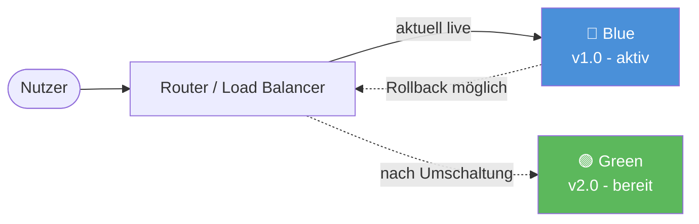

**Vorteile:**
- Nahezu **keine Downtime** beim Deployment
- Sofortiger **Rollback** durch einfaches Zurückschalten des Routers
- Testen der neuen Version unter produktionsnahen Bedingungen

**Herausforderung:** Datenbank-Schemata müssen **beide Versionen** gleichzeitig unterstützen, solange der Wechsel noch nicht abgeschlossen ist.

> <span style="font-size: 1.5em">:bulb:</span> **Merksatz:** Blue-Green Deployment tauscht ganze Umgebungen aus – der Router entscheidet, wer live ist. Das ermöglicht sofortigen Rollback ohne Datenverlust.

### 3.1.2. Canary Deployment

Canary Deployment dient dem **Risikomanagement bei neuen Releases**: Anstatt alle Nutzer gleichzeitig auf eine neue Version umzustellen, wird die neue Version schrittweise ausgerollt.

> <span style="font-size: 1.5em">:mag:</span> **Herkunft des Namens:** Der Begriff stammt von Bergleuten, die Kanarienvögel in Kohleminen mitnahmen. Giftige Gase töteten den Vogel bevor sie den Menschen gefährdeten – ein frühes Warnsystem. Canary Releases funktionieren ähnlich: Ein kleiner Teil der Nutzer wird zuerst exponiert.

**Wie es funktioniert:**

1. Die neue Version wird **nur für einen kleinen Prozentsatz** der Nutzer (z. B. 5%) ausgerollt.
2. Metriken (Fehlerrate, Latenz, Geschäftskennzahlen) werden intensiv überwacht.
3. Bei guten Ergebnissen wird der Anteil schrittweise erhöht.
4. Bei Problemen wird die neue Version sofort zurückgezogen.

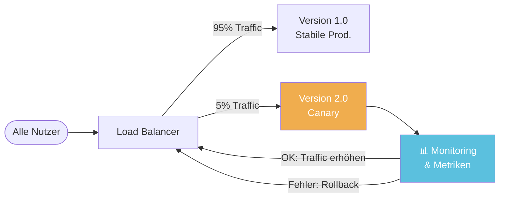

**Vergleich: Blue-Green vs. Canary**

| Kriterium | Blue-Green | Canary |
|---|---|---|
| **Rollout-Geschwindigkeit** | Sofort (100%) | Graduell (z. B. 5% → 25% → 100%) |
| **Risiko** | Mittel (alle Nutzer betroffen) | Niedrig (nur kleine Gruppe zuerst) |
| **Rollback** | Sofort per Router-Umschaltung | Sofort durch Traffic-Umleitung |
| **Ressourcenbedarf** | Doppelte Infrastruktur nötig | Teilweise Parallelinfrastruktur |
| **Ideal für** | Klare, getestete Releases | Riskante Features, A/B-Tests |

> <span style="font-size: 1.5em">:warning:</span> **Achtung:** Beide Strategien erfordern, dass mehrere Versionen der Anwendung **gleichzeitig** mit derselben Datenbank funktionieren können. Inkompatible Datenbankmigrationen müssen daher sorgfältig geplant werden.

***
Quellen

- [Blue Green Deployment – Martin Fowler](https://martinfowler.com/bliki/BlueGreenDeployment.html)
- [Canary Release – Martin Fowler / Danilo Sato](https://martinfowler.com/bliki/CanaryRelease.html)
***

## 3.2. Infrastructure as Code (IaC) & Idempotenz

*Stellen Sie sich vor, Sie beschreiben Ihre gewünschte Küche in einem Bauplan, anstatt jedem Handwerker mündlich zu sagen, was er tun soll. Infrastructure as Code funktioniert genauso: Die Infrastruktur wird als Dokument beschrieben, nicht als Befehlssequenz.*

**Infrastructure as Code (IaC)** bedeutet, dass Server, Netzwerke, Datenbanken und andere Infrastruktur-Komponenten **durch Code definiert und verwaltet** werden – statt durch manuelle Konfiguration über Web-Oberflächen oder Kommandozeile.

### 3.2.1. Deklarativer vs. Imperativer Ansatz

Es gibt zwei grundlegend verschiedene Denkweisen bei der Infrastrukturkonfiguration:

**Imperativ (WIE?):**
Der Administrator beschreibt **Schritt für Schritt**, was zu tun ist.

```bash
# Imperativer Ansatz: Befehle in Reihenfolge
apt-get update
apt-get install -y nginx
systemctl start nginx
systemctl enable nginx
# Was passiert beim zweiten Ausführen? nginx ist schon installiert!
```

**Deklarativ (WAS?):**
Der Administrator beschreibt den **gewünschten Zielzustand**. Das Tool entscheidet selbst, welche Schritte nötig sind.

```hcl
# Deklarativer Ansatz mit Terraform
resource "aws_instance" "web_server" {
  ami           = "ami-12345678"
  instance_type = "t3.micro"
  
  tags = {
    Name = "WebServer"
    Environment = "Production"
  }
}
# Terraform prüft selbst: Existiert die Instanz bereits? 
# → Nur Änderungen werden angewendet
```

### 3.2.2. Das Konzept der Idempotenz

**Idempotenz** ist eine mathematische Eigenschaft: Eine Operation ist idempotent, wenn sie **beliebig oft ausgeführt werden kann** und dabei immer dasselbe Ergebnis erzeugt.

<math display="block">
  <mrow>
    <mi>f</mi>
    <mo>(</mo>
    <mi>f</mi>
    <mo>(</mo>
    <mi>x</mi>
    <mo>)</mo>
    <mo>)</mo>
    <mo>=</mo>
    <mi>f</mi>
    <mo>(</mo>
    <mi>x</mi>
    <mo>)</mo>
  </mrow>
</math>

In der Praxis bedeutet das: Ein IaC-Skript kann hundertmal ausgeführt werden – das Ergebnis ist immer gleich. Ob die Infrastruktur bereits existiert oder nicht, spielt keine Rolle.

> <span style="font-size: 1.5em">:bulb:</span> **Merksatz:** Deklarative IaC-Tools sind von Natur aus idempotent: Sie vergleichen den *Ist-Zustand* mit dem *Soll-Zustand* und gleichen nur die Unterschiede aus.

### 3.2.3. Single Source of Truth durch Versionierung

Wenn die Infrastruktur als Code vorliegt, kann sie in einem **Versionskontrollsystem (Git)** gespeichert werden. Das bringt entscheidende Vorteile:

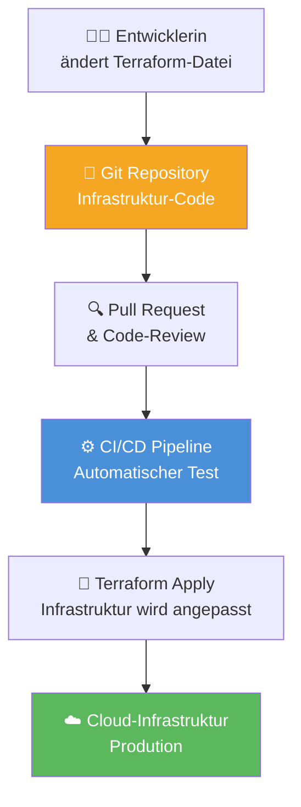

**Vorteile der "Single Source of Truth":**

| Vorteil | Erklärung |
|---|---|
| **Nachvollziehbarkeit** | Jede Infrastrukturänderung ist im Git-Verlauf dokumentiert |
| **Reproduzierbarkeit** | Dieselbe Konfiguration erzeugt identische Umgebungen (Dev, Test, Prod) |
| **Kollaboration** | Teams arbeiten gemeinsam per Pull Request an der Infrastruktur |
| **Disaster Recovery** | Bei Totalausfall kann die Infrastruktur aus dem Code vollständig neu aufgebaut werden |
| **Configuration Drift verhindern** | Manuelle Änderungen werden beim nächsten Apply überschrieben |

**Gängige IaC-Tools:**
- **Terraform** (HashiCorp): Deklarativ, cloud-agnostisch, weit verbreitet
- **Ansible**: Hybrid (imperativ und deklarativ), agentlos, gut für Konfigurationsmanagement
- **AWS CloudFormation**: Deklarativ, AWS-spezifisch

***
Quellen

- [What is Infrastructure as Code (IaC)? – Red Hat](https://www.redhat.com/en/topics/automation/what-is-infrastructure-as-code-iac)
- [What is Terraform? – HashiCorp](https://developer.hashicorp.com/terraform/intro)
***

## 3.3. Middleware-Konzepte

*Middleware ist die unsichtbare Schicht zwischen Clients und Servern – wie ein Postamt, das Briefe annimmt, sortiert und weiterleitet, ohne dass Absender und Empfänger direkt miteinander kommunizieren müssen.*

### 3.3.1. Reverse Proxy & SSL-Termination

Ein **Reverse Proxy** ist ein Server, der zwischen Clients (Browser, Apps) und Backend-Servern sitzt. Er nimmt Anfragen entgegen und leitet sie an den richtigen Backend-Dienst weiter.

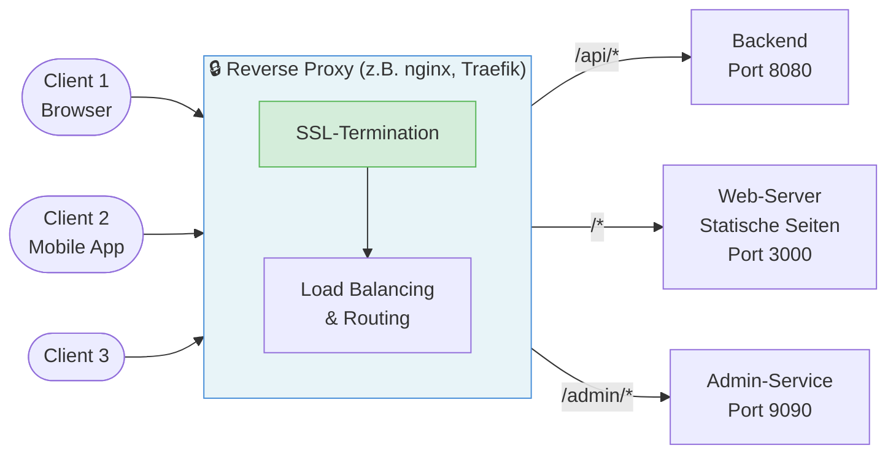

**Aufgaben eines Reverse Proxys:**

- **SSL-Termination**: Der Reverse Proxy übernimmt die Verschlüsselung (HTTPS). Backend-Server kommunizieren intern unverschlüsselt (HTTP) → Entlastung der Backend-Server
- **Load Balancing**: Verteilung der Last auf mehrere Backend-Instanzen
- **Routing**: Weiterleitung basierend auf URL-Pfad oder Host-Header
- **Caching**: Statische Inhalte werden zwischengespeichert
- **Schutz**: Die echten IP-Adressen der Backend-Server bleiben verborgen

**SSL-Termination im Detail:**

```
Client ←—— HTTPS (verschlüsselt) ——→ Reverse Proxy ←—— HTTP (intern) ——→ Backend
          TLS-Zertifikat liegt hier
```

Das TLS-Zertifikat (z. B. von Let's Encrypt) wird **nur einmal** am Reverse Proxy konfiguriert. Alle Backend-Dienste profitieren davon, keine eigenen Zertifikate zu benötigen.

> <span style="font-size: 1.5em">:bulb:</span> **Merksatz:** Der Reverse Proxy ist der einzige Punkt, den Clients direkt erreichen. Er schützt, verteilt und verschlüsselt – Backend-Server "sehen" nur vertrauenswürdige interne Anfragen.

Gängige Reverse-Proxy-Software: **nginx**, **Traefik**, **HAProxy**, **Caddy**

### 3.3.2. Stateful vs. Stateless Applications

Eine der wichtigsten Designentscheidungen für skalierbare Systeme ist die Frage: **Speichert der Server den Zustand zwischen zwei Anfragen?**

**Stateful (zustandsbehaftet):**

Der Server merkt sich den Zustand eines Nutzers zwischen zwei Anfragen (z. B. durch serverseitige Sessions).

```
Anfrage 1: Nutzer loggt sich ein → Session wird auf Server A gespeichert
Anfrage 2: Nutzer macht etwas - Nutzer muss wieder zu Server A geleitet werden, sonst: Session nicht gefunden (Änderungen gehen verloren)!
```

**Problem:** Bei mehreren Server-Instanzen muss der Load Balancer den Nutzer **immer zum selben Server** schicken (*Sticky Sessions*). Das macht horizontale Skalierung komplex.

**Stateless (zustandslos):**

Jede Anfrage enthält **alle nötigen Informationen** selbst (z. B. in einem JWT-Token). Der Server speichert keinen Zustand.

```
Anfrage 1: Nutzer loggt sich ein → erhält JWT-Token (enthält alle Nutzerinfos)
Anfrage 2: Nutzer sendet JWT-Token → jeder Server kann die Anfrage beantworten
```

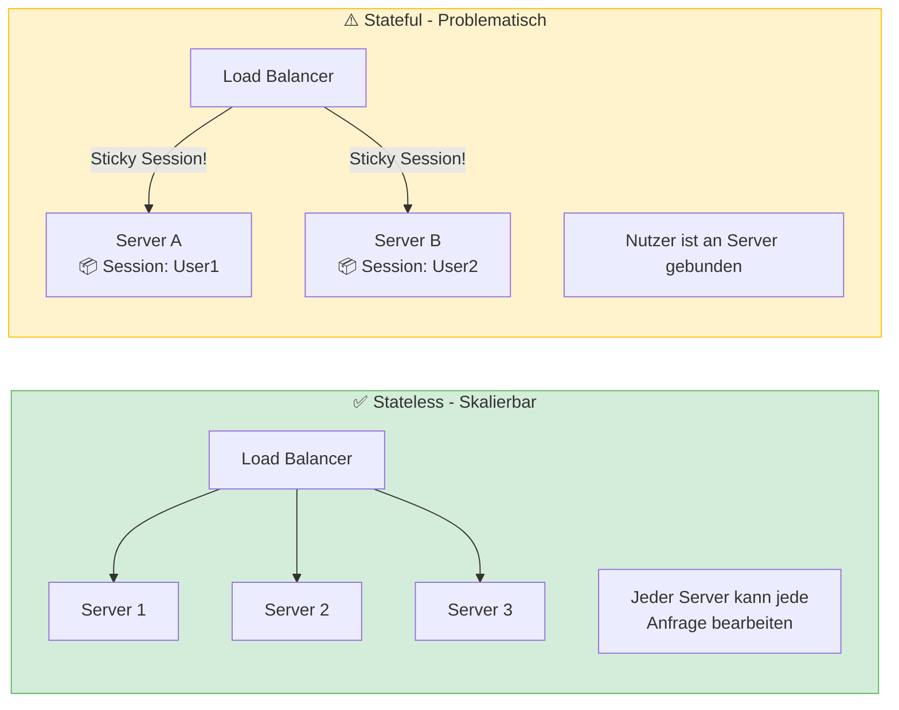

**Warum ist Zustand ein Problem für die Skalierung?**

| Problem | Stateful | Stateless |
|---|---|---|
| **Neuen Server hinzufügen** | Kompliziert (Sessions müssen synchronisiert werden) | Einfach (sofort einsatzbereit) |
| **Server-Ausfall** | Nutzer verlieren ihre Session | Keine Auswirkung (nächster Server übernimmt) |
| **Horizontale Skalierung** | Schwierig (Sticky Sessions) | Trivial (jeder Server ist gleichwertig) |
| **Beispiel-Technologie** | Server-Side Sessions (PHP, JSP) | JWT-Token, OAuth2 |

> <span style="font-size: 1.5em">:warning:</span> **Achtung:** Vollständig zustandslose Systeme sind das Ideal, aber in der Praxis gibt es immer Zustand – er wird lediglich **ausgelagert** (z. B. in Redis für Sessions oder in einer Datenbank).

> <span style="font-size: 1.5em">:mag:</span> **Vertiefung:** Das Zwölf-Faktoren-Prinzip (*Twelve-Factor App*) von Heroku beschreibt Statelessness als einen der wichtigsten Grundsätze für cloud-native Anwendungen: *"Processes are stateless and share-nothing."*

***
Quellen

- [What is a reverse proxy? – Cloudflare](https://www.cloudflare.com/learning/cdn/glossary/reverse-proxy/)
- [The Twelve-Factor App](https://12factor.net/processes)
***

<div style="page-break-after: always;"></div>

# 4. Monitoring & Hochverfügbarkeit: Betriebssicherheit

*Stellen Sie sich vor, Sie betreiben eine Fabrik mit vielen Maschinen. Ohne Sensoren, Warnlampen und Notfallpläne würden kleine Störungen unbemerkt bleiben, bis die ganze Produktion stillsteht. Genau diese Rolle übernehmen Monitoring und Hochverfügbarkeit in modernen Softwaresystemen.*

In der Systembetreuung geht es nicht nur darum, Systeme bereitzustellen, sondern sie auch **zuverlässig zu beobachten** und **gegen Ausfälle abzusichern**. Monitoring liefert laufend Informationen über den Gesundheitszustand eines Systems. Hochverfügbarkeit sorgt dafür, dass ein einzelner Fehler nicht sofort zum Komplettausfall führt.

## 4.1. Monitoring-Theorie

**Monitoring** bedeutet, laufend quantitative Daten über ein System zu sammeln, auszuwerten und sichtbar zu machen. Ziel ist es, Probleme früh zu erkennen, ihre Ursache einzugrenzen und im Idealfall automatisiert zu reagieren.

Typische Fragen des Monitorings sind:

- Ist der Dienst aktuell erreichbar?
- Wie schnell antwortet das System?
- Wie stark sind CPU, RAM, Netzwerk oder Datenbank ausgelastet?
- Steigt die Fehlerrate oder nähert sich ein System seiner Kapazitätsgrenze?

In der Praxis unterscheidet man oft zwischen zwei Blickwinkeln:

- **Black-Box-Monitoring**: Prüft das System von außen so, wie Nutzer es erleben. Beispiel: Ein synthetischer HTTP-Request testet, ob eine Website erreichbar ist.
- **White-Box-Monitoring**: Nutzt interne Metriken des Systems, etwa Heap-Auslastung, Queue-Längen oder Datenbank-Connection-Pools.

Beide Perspektiven ergänzen sich: Black-Box-Monitoring zeigt, **dass** ein Problem beim Nutzer sichtbar ist, White-Box-Monitoring hilft zu verstehen, **warum** es entsteht.

### 4.1.1. Push- vs. Pull-basiertes Monitoring

Beim Sammeln von Metriken gibt es zwei grundlegende Vorgehensweisen.

**Pull-basiertes Monitoring:**

Ein zentrales Monitoring-System fragt Ziele in festen Intervallen aktiv ab. Das Zielsystem stellt seine Metriken dazu über einen Endpunkt bereit, zum Beispiel per HTTP.

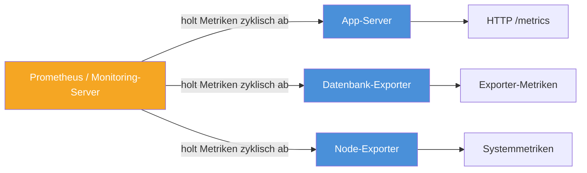

**Vorteile des Pull-Modells:**

- Das Monitoring-System kontrolliert selbst das Abfrageintervall.
- Ziele können automatisch über Service Discovery gefunden werden.
- Die zentrale Stelle erkennt direkt, wenn ein Ziel gar nicht mehr antwortet.

**Push-basiertes Monitoring:**

Hier sendet das Zielsystem seine Metriken aktiv an ein zentrales System.

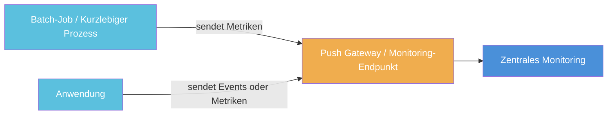

**Typische Einsatzfälle für Push:**

- Kurzlebige Jobs, die beendet sind, bevor ein Pull-Scrape stattfinden kann
- Systeme hinter Firewalls oder in Netzen, die keine eingehenden Verbindungen zulassen
- Event- oder Log-orientierte Architekturen

> <span style="font-size: 1.5em">:bulb:</span> **Merksatz:** Pull eignet sich besonders gut für dauerhaft laufende Services, Push vor allem für kurzlebige Prozesse oder abgeschottete Umgebungen.

### 4.1.2. Die Four Golden Signals

Im Site Reliability Engineering haben sich vier Kernmetriken etabliert, die fast jedes produktive System beobachten sollte. Diese **Four Golden Signals** helfen, den Zustand eines Systems mit wenigen, aber aussagekräftigen Kennzahlen zu beurteilen.

| Signal | Bedeutung | Typische Beispiele |
|---|---|---|
| **Latency** | Wie lange eine Anfrage bis zur Antwort benötigt | Antwortzeit in ms, p95/p99-Latenz |
| **Traffic** | Wie viel Last auf dem System liegt | Requests pro Sekunde, Nachrichten pro Minute |
| **Errors** | Wie viele Anfragen fehlschlagen | HTTP-500-Rate, Exception-Rate, Timeouts |
| **Saturation** | Wie nah das System an seiner Kapazitätsgrenze arbeitet | CPU-, RAM-, I/O- oder Queue-Auslastung |

Diese vier Signale decken unterschiedliche Fehlermuster ab:

- **Hohe Latenz** zeigt oft Engpässe oder langsame Abhängigkeiten.
- **Steigender Traffic** kann auf Lastspitzen, Bots oder neue Nutzungsmuster hinweisen.
- **Fehler** machen Störungen direkt sichtbar.
- **Sättigung** zeigt drohende Überlast oft schon, bevor Nutzer echte Ausfälle bemerken.

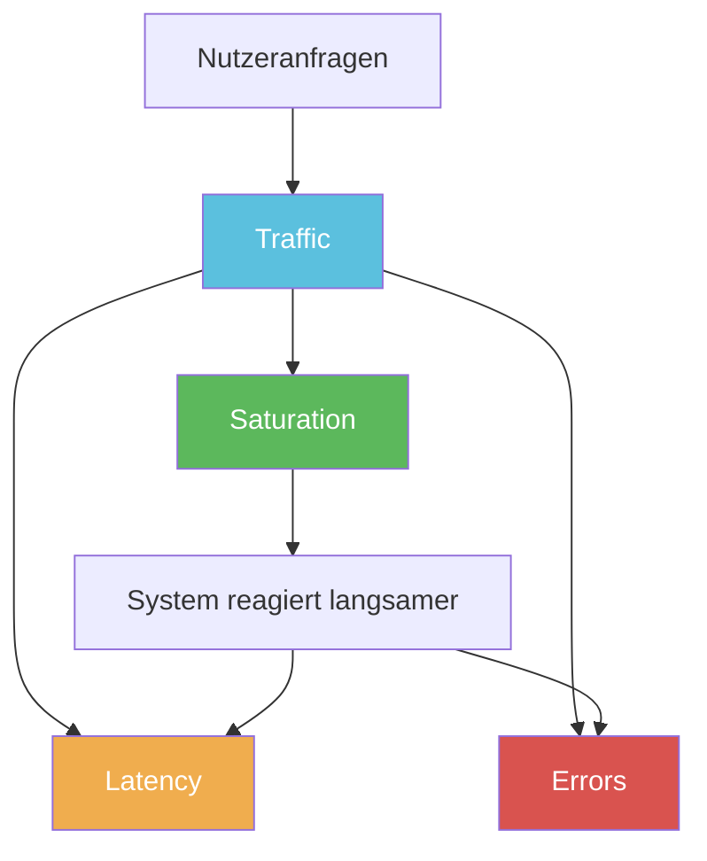

In der Praxis werden diese Metriken häufig in Dashboards zusammengeführt. Besonders wichtig ist dabei nicht nur der Mittelwert, sondern auch das Verhalten am Rand der Verteilung, etwa bei **p95**- oder **p99**-Latenzen. Ein guter Durchschnitt kann täuschen, wenn ein kleiner Teil der Anfragen extrem langsam ist.

> <span style="font-size: 1.5em">:warning:</span> **Achtung:** Viele Alarme bedeuten nicht automatisch gutes Monitoring. Ein Alert sollte nur dann ausgelöst werden, wenn das Problem wirklich relevant, nachvollziehbar und für Menschen konkret bearbeitbar ist.

## 4.2. Hochverfügbarkeit (High Availability)

**Hochverfügbarkeit** beschreibt die Fähigkeit eines Systems, trotz einzelner Störungen oder Ausfälle weiterhin nutzbar zu bleiben. Das Ziel ist nicht absolute Fehlerfreiheit, sondern eine Architektur, die Ausfälle **abfedert**, **erkennt** und **kompensiert**.

Typische Maßnahmen für Hochverfügbarkeit sind:

- **Redundanz**: Kritische Komponenten mehrfach bereitstellen
- **Failover**: Bei Ausfall automatisch auf ein Ersatzsystem umschalten
- **Load Balancing**: Last auf mehrere Instanzen verteilen
- **Monitoring und Alerting**: Fehler sofort erkennen und Reaktionszeiten verkürzen

### 4.2.1. Berechnung der Verfügbarkeit

Verfügbarkeit wird häufig als Prozentsatz über einen Zeitraum angegeben:

<math display="block">
  <mrow>
    <mi mathvariant="normal">Verfügbarkeit</mi>
    <mo>=</mo>
    <mfrac>
      <mi mathvariant="normal">Betriebszeit</mi>
      <mi mathvariant="normal">Gesamtzeit</mi>
    </mfrac>
    <mo>×</mo>
    <mn>100</mn>
  </mrow>
</math>

Wenn ein System in einem Jahr 8,76 Stunden ausfällt, ergibt sich bei insgesamt 8760 Stunden Gesamtzeit im Jahr eine Verfügbarkeit von:

<math display="block">
  <mrow>
    <mfrac>
      <mrow>
        <mn>8760</mn>
        <mo>-</mo>
        <mn>8,76</mn>
      </mrow>
      <mn>8760</mn>
    </mfrac>
    <mo>×</mo>
    <mn>100</mn>
    <mo>≈</mo>
    <mn>99,9</mn>
    <mo>%</mo>
  </mrow>
</math>

Diese Prozentwerte werden oft als **Neuner-Regel** beschrieben:

| Verfügbarkeit | Maximaler Ausfall pro Jahr | Einordnung |
|---|---|---|
| **99%** | ca. 3,65 Tage | Für unkritische Systeme oft akzeptabel |
| **99,9%** | ca. 8,76 Stunden | Typischer Wert für viele Geschäftsanwendungen |
| **99,99%** | ca. 52,6 Minuten | Hohe Anforderungen an Architektur und Betrieb |
| **99,999%** | ca. 5,26 Minuten | Sehr hohe Kritikalität, hoher technischer Aufwand |

Je mehr "Neunen" gefordert sind, desto teurer und komplexer wird die technische Umsetzung. Höhere Verfügbarkeit verlangt fast immer mehr Redundanz, mehr Automatisierung und schnellere Fehlererkennung.

> <span style="font-size: 1.5em">:mag:</span> **Vertiefung:** Hochverfügbarkeit ist nicht dasselbe wie *Fault Tolerance*. Hochverfügbarkeit toleriert kurze Unterbrechungen und minimiert sie. Fault Tolerance zielt auf praktisch unterbrechungsfreien Betrieb auch beim Ausfall einzelner Komponenten.

### 4.2.2. Single Point of Failure (SPOF)

Ein **Single Point of Failure (SPOF)** ist eine Komponente, deren Ausfall das gesamte System oder einen kritischen Teil davon lahmlegt. Typische SPOFs sind einzelne Load Balancer, Datenbankinstanzen, Netzwerkswitche oder zentrale Authentifizierungsdienste.

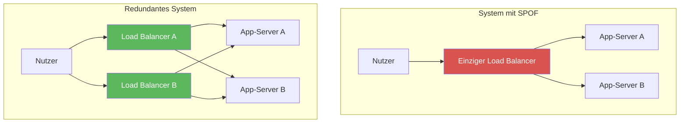

**Wie identifiziert man einen SPOF?**

- Welche einzelne Komponente würde beim Ausfall den Dienst komplett unterbrechen?
- Gibt es für diesen Dienst einen automatischen Ersatz oder Failover?
- Können Daten oder Anfragen weiterverarbeitet werden, wenn genau diese Komponente ausfällt?

**Wie beseitigt man SPOFs?**

- Kritische Komponenten redundant auslegen
- Daten replizieren
- Health Checks und automatisches Failover einsetzen
- Infrastruktur auf mehrere Zonen oder Standorte verteilen

> <span style="font-size: 1.5em">:bulb:</span> **Merksatz:** Hochverfügbarkeit beginnt dort, wo einzelne Fehler nicht mehr automatisch zum Gesamtausfall führen.

Für die Systembetreuung bedeutet das: Monitoring und Hochverfügbarkeit gehören zusammen. Ohne Monitoring erkennt man Ausfälle zu spät. Ohne hochverfügbare Architektur bleiben erkannte Probleme trotzdem betriebsgefährdend.

***
Quellen

- [Monitoring Distributed Systems – Google SRE Book](https://sre.google/sre-book/monitoring-distributed-systems/)
- [Prometheus Overview](https://prometheus.io/docs/introduction/overview/)
- [What is high availability? – IBM](https://www.ibm.com/think/topics/high-availability)
***

<div style="page-break-after: always;"></div>

# 5. Security: Hardening & Compliance

*IT-Sicherheit in der Systembetreuung ist wie ein mehrstufiges Sicherheitssystem in einem Gebäude: Nicht nur die Eingangstür muss geschützt sein, sondern auch Innenbereiche, Schlüsselverwaltung, Besucherkontrolle und Protokollierung. Erst das Zusammenspiel vieler Schutzmaßnahmen macht ein System wirklich widerstandsfähig.*

In der Praxis bedeutet **Hardening**, Angriffsflächen systematisch zu reduzieren. **Compliance** bedeutet, Sicherheitsmaßnahmen so umzusetzen und zu dokumentieren, dass interne Regeln, gesetzliche Vorgaben und Audit-Anforderungen eingehalten werden. Beide Themen gehören zusammen: Ein sicheres System braucht technische Schutzmechanismen, aber auch nachvollziehbare Prozesse.

## 5.1. Netzwerksicherheit für Applikationen

Netzwerksicherheit für Applikationen beschränkt sich nicht auf eine Firewall am Rand des Unternehmensnetzes. Moderne Systeme bestehen aus Web-Frontends, APIs, Datenbanken, Admin-Oberflächen und Cloud-Diensten. Jede dieser Komponenten benötigt klar definierte Kommunikationswege und minimale Rechte.

### 5.1.1. Zonierung (DMZ) & Least Privilege

Die **Zonierung** teilt ein Netzwerk in Sicherheitsbereiche mit unterschiedlichem Vertrauensniveau. Ein klassisches Muster ist die **DMZ** (*Demilitarized Zone*): öffentlich erreichbare Systeme stehen in einem separaten Netzsegment zwischen Internet und internem Netz.

Typische Zonen sind:

- **Internet-Zone**: Unkontrollierter Bereich, aus dem Anfragen von außen kommen.
- **DMZ**: Öffentlich erreichbare Systeme wie Reverse Proxies, Web-Server oder API-Gateways.
- **Applikations-Zone**: Interne Fachanwendungen und Services, die nicht direkt aus dem Internet erreichbar sein sollen.
- **Daten-Zone**: Datenbanken, Dateispeicher oder Backup-Systeme mit besonders hohem Schutzbedarf.

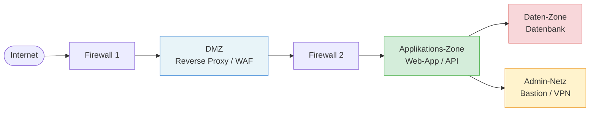

Die DMZ erfüllt eine wichtige Pufferfunktion:

1. Externe Nutzer erreichen zunächst nur die Systeme in der DMZ.
2. Diese Systeme leiten nur freigegebene Anfragen an interne Dienste weiter.
3. Datenbanken und Administrationsschnittstellen bleiben von außen unsichtbar.

Das Prinzip des **Least Privilege** ergänzt die Zonierung. Es besagt: Jede Komponente, jeder Benutzer und jedes technische Konto erhält **nur die Rechte, die zur Aufgabenerfüllung wirklich nötig sind**.

Praktische Beispiele:

- Ein Web-Frontend darf nur mit dem API-Gateway sprechen, nicht direkt mit der Datenbank.
- Ein Deployment-Account darf Anwendungen neu ausrollen, aber keine Produktionsdaten lesen.
- Ein Datenbank-User für die Anwendung bekommt nur Zugriff auf sein Schema, nicht auf administrative Systemtabellen.
- Firewall-Regeln erlauben nur konkret benötigte Ports und Zielsysteme statt ganzer Netzbereiche.

> <span style="font-size: 1.5em">:bulb:</span> **Merksatz:** DMZ und Least Privilege verfolgen dasselbe Ziel aus zwei Richtungen: Netzwerke werden segmentiert und Berechtigungen minimiert, damit sich ein Angriff nicht unkontrolliert ausbreiten kann.

### 5.1.2. Zero Trust Architecture

Klassische Sicherheitsmodelle gehen oft davon aus, dass innerhalb des internen Netzes grundsätzlich Vertrauen besteht. **Zero Trust** bricht mit dieser Annahme. Nach dem Grundsatz *"Never trust, always verify"* wird kein Zugriff allein deshalb erlaubt, weil sich ein Nutzer oder Dienst bereits im "richtigen" Netzwerk befindet.

Eine **Zero Trust Architecture (ZTA)** verlagert den Fokus von der Netzwerkgrenze auf Identitäten, Geräte, Anwendungen und konkrete Ressourcen. Jede Anfrage wird kontextabhängig bewertet.

Zentrale Prinzipien sind:

- **Explizite Verifikation**: Identität, Gerätestatus, Standort, Risiko und Kontext werden geprüft.
- **Least Privilege Access**: Zugriffe werden so fein wie möglich eingeschränkt.
- **Kontinuierliche Bewertung**: Vertrauen wird nicht einmalig vergeben, sondern laufend neu überprüft.
- **Mikrosegmentierung**: Kleine, getrennte Sicherheitsbereiche verhindern seitliche Bewegungen im Netzwerk.

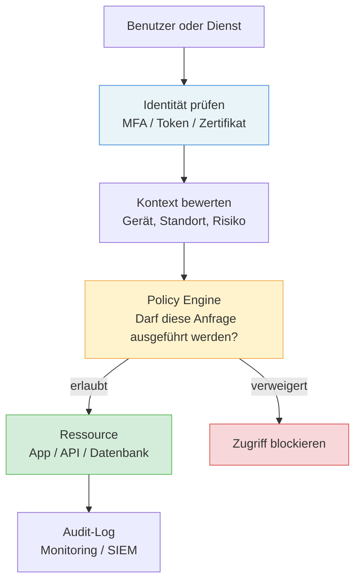

Für die Systembetreuung bedeutet das konkret:

- Admin-Zugänge sollten durch **MFA**, VPN oder Identity-Aware Proxies geschützt werden.
- Service-zu-Service-Kommunikation sollte authentifiziert werden, z. B. über kurzlebige Tokens oder mTLS.
- Zugriffe müssen protokolliert und auswertbar sein, damit Auffälligkeiten schnell sichtbar werden.
- Sicherheitsrichtlinien sollten zentral verwaltet werden, statt in vielen Einzelsystemen zu verstreuen.

**DMZ und Zero Trust sind kein Widerspruch.** Die DMZ bleibt ein nützliches Segmentierungswerkzeug, aber Zero Trust ergänzt sie um die Regel: Auch innerhalb der internen Zonen wird nicht pauschal vertraut.

> <span style="font-size: 1.5em">:warning:</span> **Achtung:** Zero Trust ist kein einzelnes Produkt. Es ist ein Architekturprinzip, das Identitätsmanagement, Richtlinien, Protokollierung, Netzwerksegmentierung und starke Authentifizierung zusammenführt.

***
Quellen

- [Zero Trust Architecture – NIST SP 800-207](https://csrc.nist.gov/pubs/sp/800/207/final)
- [Authorization Cheat Sheet – OWASP](https://cheatsheetseries.owasp.org/cheatsheets/Authorization_Cheat_Sheet.html)
***

## 5.2. Kryptographische Grundlagen im Web

*Wenn zwei Personen vertraulich miteinander kommunizieren wollen, brauchen sie drei Dinge: eine gemeinsame Sprache, einen Nachweis über die Identität des Gegenübers und einen sicheren Kanal. Im Web übernehmen diese Aufgaben Protokolle, Zertifikate und kryptographische Schlüssel.*

Kryptographische Verfahren sind die Grundlage dafür, dass Browser, APIs und Cloud-Dienste vertraulich und manipulationssicher kommunizieren können. Für die Systembetreuung ist wichtig, nicht nur Begriffe wie **TLS**, **Zertifikat** oder **Secret** zu kennen, sondern auch ihre operative Bedeutung zu verstehen.

### 5.2.1. PKI & TLS-Handshake

Die **Public Key Infrastructure (PKI)** ist das Vertrauenssystem hinter digitalen Zertifikaten. Sie verknüpft eine Identität, zum Beispiel einen Domainnamen, mit einem **öffentlichen Schlüssel**. Diese Zuordnung wird durch eine **Certificate Authority (CA)** signiert.

Wichtige Bausteine der PKI sind:

- **Öffentlicher Schlüssel**: Darf verteilt werden und dient zur Prüfung oder Verschlüsselung.
- **Privater Schlüssel**: Muss geheim bleiben und dient zum Entschlüsseln oder Signieren.
- **Zertifikat**: Bestätigt, dass ein öffentlicher Schlüssel zu einer bestimmten Identität gehört.
- **CA**: Vertrauenswürdige Stelle, die Zertifikate ausstellt und signiert.
- **Vertrauenskette**: Browser prüfen, ob ein Zertifikat über Zwischenzertifikate auf eine bekannte Root-CA zurückgeführt werden kann.

Beim **TLS-Handshake** handeln Client und Server aus, wie eine sichere Verbindung aufgebaut wird. Ziel ist es, den Server zu authentifizieren und gemeinsame Sitzungsschlüssel für die weitere verschlüsselte Kommunikation abzuleiten.

Der genaue Ablauf haengt von der verwendeten TLS-Version ab. Insbesondere zwischen **TLS 1.2** und **TLS 1.3** gibt es Unterschiede bei den Handshake-Schritten und den unterstuetzten Schluesselaustauschverfahren. Die folgende Darstellung ist deshalb bewusst vereinfacht.

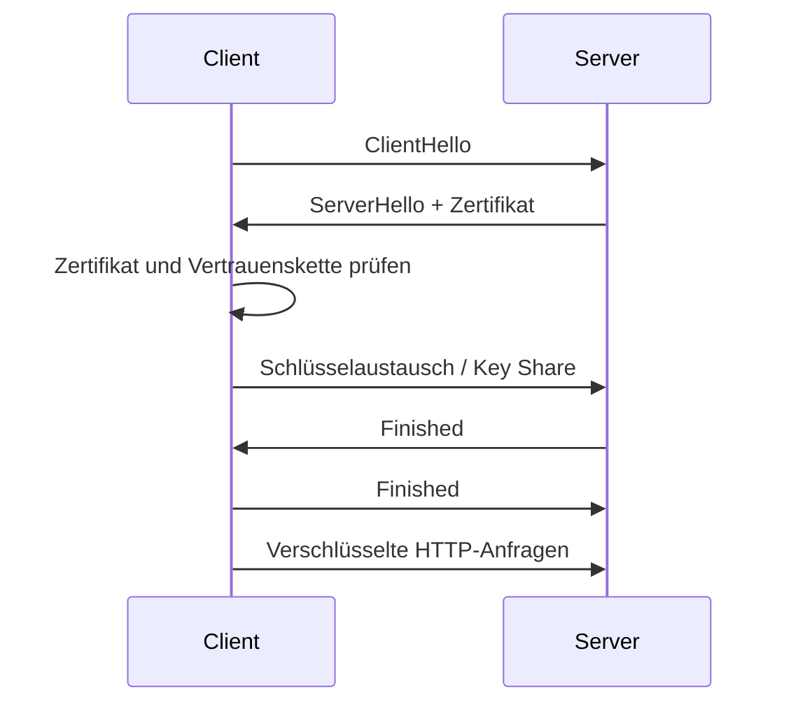

Vereinfacht läuft ein TLS-Handshake in diesen Schritten ab:

1. Der Client sendet, welche TLS-Versionen und Cipher Suites er unterstützt.
2. Der Server wählt passende Verfahren und sendet sein Zertifikat.
3. Der Client prüft, ob das Zertifikat gültig, signiert und für die Domain passend ist.
4. Beide Seiten leiten gemeinsame Sitzungsschlüssel ab.
5. Danach wird die eigentliche HTTP-Kommunikation symmetrisch verschlüsselt fortgesetzt.

Für die Systembetreuung ergeben sich daraus klare Aufgaben:

- Zertifikate rechtzeitig erneuern und ihre Laufzeiten überwachen.
- Private Schlüssel sicher speichern und niemals in Repositories ablegen.
- Veraltete Protokolle und Cipher Suites deaktivieren.
- Interne Dienste ebenfalls absichern, z. B. über TLS zwischen Reverse Proxy und Backend oder per **mTLS** zwischen Services.

> <span style="font-size: 1.5em">:bulb:</span> **Merksatz:** PKI beantwortet die Frage "Wem kann ich vertrauen?", TLS beantwortet die Frage "Wie kommunizieren wir jetzt sicher?".

### 5.2.2. Sichere Speicherung von Secrets

**Secrets** sind sensible Informationen, die Anwendungen für den Betrieb benötigen, zum Beispiel Passwörter, API-Keys, Datenbankzugänge, Zertifikate oder Token. Ein häufiger Sicherheitsfehler ist, solche Werte direkt im Quellcode, in Konfigurationsdateien oder in `docker-compose.yml` zu hinterlegen.

Warum hartcodierte Secrets problematisch sind:

- Sie landen leicht in Git-Historien und Backups.
- Mehrere Umgebungen verwenden versehentlich dieselben Zugangsdaten.
- Ein Secret-Wechsel wird aufwendig, weil viele Dateien oder Deployments angepasst werden müssen.
- Zugriffe und Verwendung lassen sich kaum sauber auditieren.

Ein besserer Ansatz ist ein **zentraler Secret Store** oder ein **Vault-System**. Dabei authentifiziert sich eine Anwendung zuerst gegenüber einem Secret-Management-Dienst und erhält nur die Secrets, die sie für ihre Aufgabe benötigt.

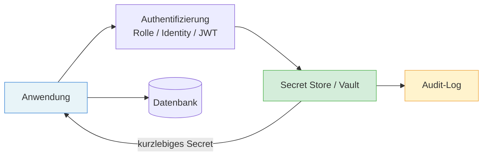

Gute Praxis im Secret-Management:

- **Zentral speichern** statt in Code oder Images einzubetten.
- **Kurzlebige Credentials** bevorzugen, die automatisch ablaufen.
- **Rotation** regelmäßig automatisieren.
- **Zugriffe protokollieren**, um Compliance- und Audit-Anforderungen zu erfüllen.
- **Trennung nach Umgebungen** sicherstellen, damit Dev-, Test- und Prod-Secrets strikt getrennt bleiben.

Gerade im Compliance-Kontext ist Secret-Management wichtig, weil es Nachvollziehbarkeit und kontrollierte Zugriffe ermöglicht. Ein professionelles System zeigt, **wer** wann **welches Secret** genutzt oder angefordert hat.

> <span style="font-size: 1.5em">:warning:</span> **Achtung:** Umgebungsvariablen sind oft besser als hartcodierte Passwörter, aber sie sind noch kein vollständiges Secret-Management. Ohne Rotation, Rollenmodell und Audit-Logs bleiben wichtige Sicherheitslücken bestehen.

> <span style="font-size: 1.5em">:mag:</span> **Vertiefung:** Moderne Vault-Systeme können dynamische Secrets erzeugen, zum Beispiel Datenbank-Zugänge mit kurzer Lebensdauer. Damit wird das Risiko kompromittierter Langzeit-Passwörter deutlich reduziert.

***
Quellen

- [What happens in a TLS handshake? – Cloudflare](https://www.cloudflare.com/learning/ssl/what-happens-in-a-tls-handshake/)
- [What is Vault? – HashiCorp](https://developer.hashicorp.com/vault/docs/what-is-vault)
- [Secrets Management Cheat Sheet – OWASP](https://cheatsheetseries.owasp.org/cheatsheets/Secrets_Management_Cheat_Sheet.html)
***