# SYP - Ausgewählte Kapitel: `Systemdokumentation`

## Inhaltsverzeichnis

- [SYP - Ausgewählte Kapitel: `Systemdokumentation`](#syp---ausgewählte-kapitel-systemdokumentation)
  - [Inhaltsverzeichnis](#inhaltsverzeichnis)
  - [1. Einleitung](#1-einleitung)
    - [1.1 Sinn und Zweck des Dokuments](#11-sinn-und-zweck-des-dokuments)
    - [1.2 Aufbau des Dokuments](#12-aufbau-des-dokuments)
  - [2. Dokumentation in der Planungs- \& Requirementsphase](#2-dokumentation-in-der-planungs---requirementsphase)
    - [2.1 Warum frühe Dokumentation entscheidend ist](#21-warum-frühe-dokumentation-entscheidend-ist)
    - [2.2 Vision \& Scope Document](#22-vision--scope-document)
    - [2.3 Product Backlog \& User Stories](#23-product-backlog--user-stories)
    - [2.4 System-Kontext-Diagramm](#24-system-kontext-diagramm)
    - [2.5 Glossar und Ubiquitous Language](#25-glossar-und-ubiquitous-language)
    - [2.6 Praxisbeispiel aus einem Schulprojekt](#26-praxisbeispiel-aus-einem-schulprojekt)
  - [3. Architektur-Dokumentation (Struktur \& Entscheidungen)](#3-architektur-dokumentation-struktur--entscheidungen)
    - [3.1 Ziel und Nutzen der Architekturdokumentation](#31-ziel-und-nutzen-der-architekturdokumentation)
    - [3.2 arc42 als Strukturrahmen](#32-arc42-als-strukturrahmen)
    - [3.3 Architecture Decision Records (ADR)](#33-architecture-decision-records-adr)
    - [3.4 Visualisierung mit Mermaid und PlantUML](#34-visualisierung-mit-mermaid-und-plantuml)
    - [3.5 C4-Modell als Abstraktionshilfe](#35-c4-modell-als-abstraktionshilfe)
    - [3.6. Zusammenspiel von Architektur (arc42) und ADR-Dokumenten](#36-zusammenspiel-von-architektur-arc42-und-adr-dokumenten)
    - [3.7 Praxisbeispiel: Schulbibliotheks-Architektur](#37-praxisbeispiel-schulbibliotheks-architektur)
  - [4. API-Spezifikationen (Die Verträge)](#4-api-spezifikationen-die-verträge)
    - [4.1 Zweck und Bedeutung von API-Dokumentation](#41-zweck-und-bedeutung-von-api-dokumentation)
    - [4.2 REST APIs mit OpenAPI/Swagger](#42-rest-apis-mit-openapiswagger)
    - [4.3 Event-Driven APIs mit AsyncAPI](#43-event-driven-apis-mit-asyncapi)
    - [4.4 GraphQL Schema als selbstdokumentierende API](#44-graphql-schema-als-selbstdokumentierende-api)
    - [4.5 Praxisbeispiele aus der Schulbibliothek](#45-praxisbeispiele-aus-der-schulbibliothek)
  - [5. DevOps- \& Infrastruktur-Dokumentation](#5-devops---infrastruktur-dokumentation)
    - [5.1 Zweck und Bedeutung der DevOps-Dokumentation](#51-zweck-und-bedeutung-der-devops-dokumentation)
    - [5.2 Infrastructure-as-Code (IaC) und Container-Dokumentation](#52-infrastructure-as-code-iac-und-container-dokumentation)
    - [5.3 Pipeline-Dokumentation (CI/CD)](#53-pipeline-dokumentation-cicd)
    - [5.4 Environment-Matrix und Konfigurationsmanagement](#54-environment-matrix-und-konfigurationsmanagement)
    - [5.5 Praxisbeispiel: Delivery-Prozess der Schulbibliothek](#55-praxisbeispiel-delivery-prozess-der-schulbibliothek)
  - [6. Das Betriebshandbuch (Operations Manual)](#6-das-betriebshandbuch-operations-manual)
    - [6.1 Zweck und Zielgruppe des Betriebshandbuchs](#61-zweck-und-zielgruppe-des-betriebshandbuchs)
    - [6.2 Installationsanleitung und Betriebsvoraussetzungen](#62-installationsanleitung-und-betriebsvoraussetzungen)
    - [6.3 Monitoring und Alerting](#63-monitoring-und-alerting)
    - [6.4 Backup und Recovery](#64-backup-und-recovery)
    - [6.5 Runbooks und Playbooks](#65-runbooks-und-playbooks)
    - [6.6 Praxisbeispiel: Operations in der Schulbibliothek](#66-praxisbeispiel-operations-in-der-schulbibliothek)
  - [7. Der "Docs-as-Code" Ansatz](#7-der-docs-as-code-ansatz)
    - [7.1 Grundidee und Nutzen](#71-grundidee-und-nutzen)
    - [7.2 Typischer Workflow mit Git, Pull Requests und Reviews](#72-typischer-workflow-mit-git-pull-requests-und-reviews)
    - [7.3 Dokumentationssprachen: Markdown, AsciiDoc, Typst](#73-dokumentationssprachen-markdown-asciidoc-typst)
    - [7.4 Diagramme als Code (Diagram as Code)](#74-diagramme-als-code-diagram-as-code)
    - [7.5 Generatoren und Tooling: Sphinx, MkDocs, Doxygen](#75-generatoren-und-tooling-sphinx-mkdocs-doxygen)
    - [7.6 Qualitätsmanagement für Dokumentation](#76-qualitätsmanagement-für-dokumentation)
    - [7.7 Praxisbeispiel: Docs-as-Code in der Schulbibliothek](#77-praxisbeispiel-docs-as-code-in-der-schulbibliothek)
    - [7.8 KI-gestützte Entwicklung im Docs-as-Code: Unterstützung und Grenzen](#78-ki-gestützte-entwicklung-im-docs-as-code-unterstützung-und-grenzen)
  - [8. Grenzen von Docs-as-Code \& Compliance](#8-grenzen-von-docs-as-code--compliance)
    - [8.1 Warum Docs-as-Code nicht alles lösen kann](#81-warum-docs-as-code-nicht-alles-lösen-kann)
    - [8.2 Vergleich: Entwicklerfokus vs. Compliancefokus](#82-vergleich-entwicklerfokus-vs-compliancefokus)
    - [8.3 Typische Konfliktfelder in der Praxis](#83-typische-konfliktfelder-in-der-praxis)
    - [8.4 Hybrides Zielbild: Das Beste aus beiden Welten](#84-hybrides-zielbild-das-beste-aus-beiden-welten)
    - [8.5 Praxisbeispiel: Schulbibliothek zwischen Technik und Nachweis](#85-praxisbeispiel-schulbibliothek-zwischen-technik-und-nachweis)
  - [9. Compliance-Dokumente im Softwareprojekt](#9-compliance-dokumente-im-softwareprojekt)
    - [9.1 Welche Dokumente sind typisch?](#91-welche-dokumente-sind-typisch)
    - [9.2 Rolle der Dokumente über den Projektlebenszyklus](#92-rolle-der-dokumente-über-den-projektlebenszyklus)
    - [9.3 Verantwortlichkeiten im Team](#93-verantwortlichkeiten-im-team)
    - [9.4 Mindestset für ein typisches Softwareprodukt](#94-mindestset-für-ein-typisches-softwareprodukt)
    - [9.5 Praxisbeispiel: Schulbibliothek mit Compliance-Map](#95-praxisbeispiel-schulbibliothek-mit-compliance-map)
  - [10. Glossar](#10-glossar)
    - [A](#a)
    - [B](#b)
    - [C](#c)
    - [D](#d)
    - [E](#e)
    - [G](#g)
    - [H](#h)
    - [I](#i)
    - [J](#j)
    - [K](#k)
    - [L](#l)
    - [M](#m)
    - [N](#n)
    - [O](#o)
    - [P](#p)
    - [R](#r)
    - [S](#s)
    - [T](#t)
    - [U](#u)
    - [V](#v)
    - [Y](#y)


<div style="page-break-after: always;"></div>

## 1. Einleitung

Die Systemdokumentation ist das gemeinsame Gedächtnis eines Softwareprojekts. Sie macht Entscheidungen, Zusammenhänge und Betriebswissen nachvollziehbar und stellt sicher, dass Informationen nicht nur in den Köpfen einzelner Personen verbleiben.

### 1.1 Sinn und Zweck des Dokuments

Dieses Dokument verfolgt drei zentrale Ziele:

1. **Orientierung schaffen:** Es zeigt, welche Arten von Dokumentation in modernen Softwareprojekten gebraucht werden und wann sie eingesetzt werden.
2. **Qualität sichern:** Es beschreibt bewährte Methoden, um Dokumentation strukturiert, konsistent und langfristig wartbar aufzubauen.
3. **Praxisfähigkeit herstellen:** Es verbindet klassische Dokumentationsbausteine mit aktuellen Arbeitsweisen wie `Docs-as-Code`, `ADR`, `OpenAPI` und `Runbooks`.

> <span style="font-size: 1.5em">:bulb:</span> **Merksatz:** Gute Dokumentation ist kein Anhang zum Projekt, sondern ein produktiver Bestandteil der Softwareentwicklung und des Betriebs.

### 1.2 Aufbau des Dokuments

Das Lernskript ist entlang des Lebenszyklus eines Softwaresystems gegliedert:

- **Kapitel 2** behandelt die Dokumentation in der Planungs- und Requirementsphase (Vision, Backlog, Kontext, Glossar).
- **Kapitel 3** fokussiert Architekturwissen und Entscheidungsdokumentation (z. B. `arc42`, `ADR`, Diagramme).
- **Kapitel 4** erklärt API-Verträge für synchrone und asynchrone Schnittstellen (`OpenAPI`, `AsyncAPI`, `GraphQL`).
- **Kapitel 5** beschreibt Build-, Deploy- und Umgebungsdokumentation im DevOps-Kontext.
- **Kapitel 6** adressiert das Betriebshandbuch mit Installations-, Monitoring- und Recovery-Inhalten.
- **Kapitel 7** vertieft den `Docs-as-Code`-Ansatz inklusive Tooling und Arbeitsprozessen.
- **Kapitel 8** grenzt den Ansatz gegen Compliance- und Managementanforderungen ab.
- **Kapitel 9** zeigt typische Compliance-Dokumente und ihre Rolle im Softwareprojekt.

Damit entsteht ein durchgängiger Leitfaden von der ersten Anforderung bis zum stabilen Betrieb.

<div style="page-break-after: always;"></div>

## 2. Dokumentation in der Planungs- & Requirementsphase

Stellen Sie sich ein Bauprojekt ohne Bauplan vor: Alle arbeiten fleißig, aber jeder versteht etwas anderes unter dem Zielbild. Genau so entstehen in Softwareprojekten Missverständnisse, wenn Anforderungen nicht früh und klar dokumentiert werden.

In dieser Phase wird festgelegt, **was** gebaut werden soll, **warum** es gebaut wird und **für wen**. Die Dokumentation dient dabei nicht nur als Protokoll, sondern als gemeinsamer Kommunikationsrahmen zwischen Fachbereich, Entwicklung und Betrieb.

### 2.1 Warum frühe Dokumentation entscheidend ist

Frühe Dokumentation schafft Verbindlichkeit und reduziert Reibung im Projektverlauf.

**Zentrale Vorteile:**

1. **Gemeinsames Verständnis:** Alle Beteiligten teilen ein einheitliches Zielbild.
2. **Nachvollziehbarkeit:** Entscheidungen bleiben auch Monate später transparent.
3. **Priorisierung:** Anforderungen können besser bewertet und geplant werden.
4. **Weniger Fehlentwicklungen:** Unklare Annahmen werden früh sichtbar.

> <span style="font-size: 1.5em">:warning:</span> **Achtung:** Wenn in der Planungsphase nur mündlich abgestimmt wird, entstehen später oft widersprüchliche Erwartungen zwischen Auftraggebenden und Entwicklungsteam.

### 2.2 Vision & Scope Document

Das **Vision & Scope Document** beschreibt den fachlichen Kern eines Vorhabens auf Management- und Produktniveau.

**Was ist es?**

Ein kompaktes Dokument, das Ziel, Nutzen und Grenzen eines Projekts festhält.

**Wozu dient es?**

- Es klärt den Projektauftrag.
- Es grenzt den Umfang realistisch ein.
- Es macht den Mehrwert für die Zielgruppe sichtbar.

**Typische Bestandteile:**

- Projektvision in 3 bis 5 Sätzen
- Zielgruppen und Stakeholder
- Geschäftsziele und Erfolgskriterien
- In-Scope- und Out-of-Scope-Abgrenzung

> <span style="font-size: 1.5em">:bulb:</span> **Merksatz:** Eine gute Vision ist kurz, verständlich und überprüfbar.

### 2.3 Product Backlog & User Stories

Nach der Vision wird der Umfang in konkrete Arbeitseinheiten überführt.

**Was ist es?**

Das **Product Backlog** ist eine priorisierte Liste aller Anforderungen. **User Stories** beschreiben einzelne Anforderungen aus Sicht der Nutzenden.

**Wozu dient es?**

- Es macht Entwicklungsschritte planbar.
- Es verbindet fachliche Anforderungen mit technischer Umsetzung.
- Es ermöglicht inkrementelle Lieferung.

**Beispiel einer User Story:**

> Als Bibliotheksmitarbeiterin möchte ich sehen, welche Medien überfällig sind, damit ich Mahnungen zeitnah versenden kann.

Ergänzt wird die Story durch **Akzeptanzkriterien**, etwa:

- Überfällige Medien werden ab 1 Tag Verzug markiert.
- Filterung nach Klasse und Zeitraum ist möglich.
- Export als CSV ist verfügbar.

#### Wie werden Backlog und Stories in der Praxis verwaltet (z.B. Jira/GitHub)?**

Damit Anforderungen nicht nur erfasst, sondern auch verlässlich umgesetzt werden, braucht es einen klaren Workflow im Ticket-System.

**Typischer Ablauf in Jira:**

1. Anforderungen als **Epics** anlegen (z. B. „Mahnwesen", „Benutzerverwaltung").
2. Epics in **User Stories** und bei Bedarf in **Sub-Tasks** zerlegen.
3. Jede Story mit Priorität, Akzeptanzkriterien, Aufwandsschätzung und Verantwortlichen versehen.
4. Sprint-Zuordnung und Pflege über ein Board mit Statusspalten wie „To Do", „In Progress", „In Review", „Done".
5. Verlinkung mit Commits, Branches und Pull Requests zur Nachvollziehbarkeit.

**Typischer Ablauf in GitHub (Issues + Projects):**

1. User Stories als **Issues** mit standardisiertem Template erfassen.
2. Labels für Typ und Priorität verwenden (z. B. `feature`, `bug`, `prio-high`, `frontend`, `backend`).
3. Milestones für Releases oder Sprints einsetzen.
4. GitHub Projects zur visuellen Steuerung des Flows nutzen (Backlog, Ready, In Progress, Review, Done).
5. Issues mit Pull Requests verknüpfen (z. B. über „Closes #123"), damit der Umsetzungsstand automatisch aktualisiert wird.

> <span style="font-size: 1.5em">:bulb:</span> **Praxistipp:** Definieren Sie teamweit ein einheitliches Story-Template mit Pflichtfeldern (Beschreibung, Akzeptanzkriterien, Definition of Done), damit die Qualität der Anforderungen in Jira und GitHub konsistent bleibt.

### 2.4 System-Kontext-Diagramm

Das System-Kontext-Diagramm zeigt, in welcher Umgebung sich das zu entwickelnde System befindet.

**Was ist es?**

Eine vereinfachte Darstellung der Systemgrenze mit externen Akteuren und Nachbarsystemen.

**Wozu dient es?**

- Es macht Integrationen früh sichtbar.
- Es reduziert Schnittstellenmissverständnisse.
- Es bildet die Grundlage für spätere Architekturkapitel.

**Typische Elemente:**

- Primäre Nutzergruppen
- Externe Dienste und Schnittstellen
- Eingehende und ausgehende Datenflüsse

In diesem Beispiel wird die Authentifizierung bewusst über das Spring-Backend geführt (BFF/API-Gateway-Ansatz): Beide Frontends sprechen nur mit dem Backend, und das Backend übernimmt die Kommunikation mit Keycloak.

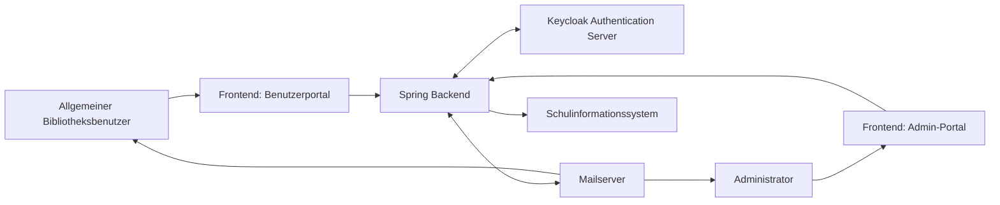

### 2.5 Glossar und Ubiquitous Language

Gerade in interdisziplinären Teams werden gleiche Begriffe oft unterschiedlich verstanden. Ein Projekt-Glossar sorgt für sprachliche Konsistenz.

**Was ist es?**

Ein zentrales Verzeichnis mit verbindlichen Definitionen wichtiger Fachbegriffe.

**Wozu dient es?**

- Es reduziert Fehlinterpretationen.
- Es unterstützt einheitliche Benennung in Tickets, Code und Dokumentation.
- Es stärkt die Zusammenarbeit zwischen Fachdomäne und Technik.

**Beispielhafte Glossareinträge:**

- **Medium:** Ausleihbarer Bestand, z. B. Buch oder E-Book.
- **Ausleihe:** Zeitraum, in dem ein Medium einer Person zugeordnet ist.
- **Mahnfall:** Überfällige Ausleihe mit definierter Eskalationsstufe.

> <span style="font-size: 1.5em">:mag:</span> **Vertiefung:** Im Domain-Driven Design wird diese gemeinsame Fachsprache als Ubiquitous Language bezeichnet und sollte in Modellen, APIs und UI-Bezeichnungen konsistent verwendet werden.

### 2.6 Praxisbeispiel aus einem Schulprojekt

Im Projekt „Digitale Schulbibliothek" wurde die Planungsdokumentation in vier Artefakte aufgeteilt:

1. **Vision & Scope:** Zielbild und Projektgrenzen auf zwei Seiten.
2. **Backlog:** Priorisierte Stories im Ticket-System mit Akzeptanzkriterien.
3. **Kontextdiagramm:** Sicht auf Nachbarsysteme (Mail, Authentication-Server, SIS).
4. **Glossar:** Fachbegriffe für Team, Product Owner und Stakeholder.

Dadurch konnten Rückfragen im Sprint Planning deutlich reduziert und neue Teammitglieder schneller eingearbeitet werden.

***
Quellen
- [arc42 System Context](https://arc42.org/overview)
- [Atlassian Agile Coach: User Stories](https://www.atlassian.com/agile/project-management/user-stories)

***

<div style="page-break-after: always;"></div>

## 3. Architektur-Dokumentation (Struktur & Entscheidungen)

Wenn Anforderungen das "Was" definieren, beschreibt die Architektur das "Wie". Eine saubere Architekturdokumentation sorgt dafür, dass Teams Entscheidungen nachvollziehen, Systeme sicher weiterentwickeln und technische Schulden bewusst steuern können.

### 3.1 Ziel und Nutzen der Architekturdokumentation

Architekturdokumentation macht technische Struktur und Entscheidungsgründe transparent.

**Wesentliche Ziele:**

1. **Orientierung:** Neue Teammitglieder verstehen Systemgrenzen, Bausteine und Schnittstellen schneller.
2. **Nachvollziehbarkeit:** Architekturentscheidungen bleiben über Releases hinweg begründet.
3. **Risikoreduktion:** Abhängigkeiten und kritische Pfade werden früh sichtbar.
4. **Kommunikation:** Entwicklung, Betrieb und Fachbereich sprechen über ein gemeinsames Architekturmodell.

> <span style="font-size: 1.5em">:bulb:</span> **Merksatz:** Gute Architekturdokumentation beschreibt nicht nur die Lösung, sondern auch den Grund für die Lösung.

### 3.2 arc42 als Strukturrahmen

Das `arc42`-Template ist ein pragmatischer Standard, um Architekturdokumente konsistent aufzubauen.

**Typische Kernbereiche in arc42:**

- **Kontextabgrenzung:** Welche externen Systeme und Rollen wirken auf das System?
- **Bausteinsicht:** Welche Komponenten gibt es und welche Verantwortung haben sie?
- **Laufzeitsicht:** Wie interagieren Bausteine in konkreten Szenarien?
- **Verteilungssicht:** Wie sind Komponenten auf Infrastruktur und Umgebungen verteilt?

Diese Sichten ergänzen sich und verhindern, dass Architektur nur aus einem einzigen "Big Picture" besteht.

### 3.3 Architecture Decision Records (ADR)

ADRs dokumentieren einzelne, wichtige Architekturentscheidungen in kurzer Form.

**Typische Struktur eines ADR:**

1. **Status** (z. B. Proposed, Accepted, Deprecated)
2. **Kontext** (Ausgangslage, Problem)
3. **Entscheidung** (gewählte Option)
4. **Konsequenzen** (positive und negative Folgen)

**Beispiel für eine ADR-Frage:**

"Authentifizieren wir Frontends direkt gegen Keycloak oder über das Spring-Backend als BFF?"

> <span style="font-size: 1.5em">:warning:</span> **Achtung:** Ohne ADRs werden Architekturentscheidungen oft nur mündlich weitergegeben und gehen bei Teamwechseln verloren.

### 3.4 Visualisierung mit Mermaid und PlantUML

Diagramme-as-Code erleichtern Reviews und halten Visualisierungen versionierbar.

**Wann eignet sich welches Tool?**

- **Mermaid:** Schnell für Fluss-, Sequenz- und einfache Architekturdiagramme direkt in Markdown.
- **PlantUML:** Sehr gut für detaillierte UML-Diagramme (Klassen, Sequenzen, Komponenten).

**Beispiel: Sequenzskizze für Login über Backend**

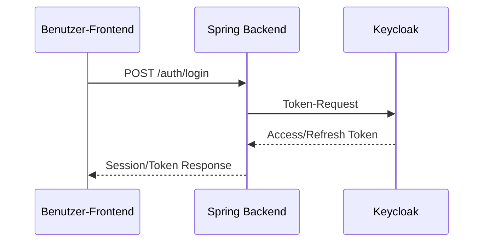

### 3.5 C4-Modell als Abstraktionshilfe

Das C4-Modell hilft, Architektur auf mehreren Ebenen zu erklären:

1. **Context (L1):** System im Umfeld
2. **Container (L2):** Hauptanwendungen/Deployables
3. **Component (L3):** Innere Struktur eines Containers
4. **Code (L4):** Detailniveau für Implementierung (optional)

Für Lern- und Projektdokumentationen reichen in der Regel L1 bis L3 aus, weil sie genug Detail bieten, ohne zu überladen.

### 3.6. Zusammenspiel von Architektur (arc42) und ADR-Dokumenten

Architektur(arc42)- und ADR-Dokuemnte spielen in unterschiedlichen Phasen eine Rolle:

| Aspekt | arc42 | ADR |
| :--- | :--- | :--- |
| **Wann** | Am Projektstart oder bei architekturellen Umbrüchen | Laufend, wenn wichtige Entscheidungen getroffen werden |
| **Umfang** | Gesamtes System (Überblick + Details) | Einzelne Entscheidung |
| **Zielgruppe** | Entwickler, Architekten, Betrieb | Gesamtes Team |
| **Wartung** | Regelmäßig (z. B. quarterly Review) | Bei neuen ADRs wird Superseded-Status gesetzt |
| **Relation** | Übergeordnet: „Wie ist das System strukturiert?" | Untergeordnet: „Warum haben wir diese Entscheidung getroffen?" |

**Praktischer Ablauf:**

1. **Sprint 0 / Projektstart:** arc42 wird als Rohgerüst aufgestellt (Kontextabgrenzung, Lösungsstrategie, erste Bausteinübersicht).
2. **Während der Sprints:** Entwickler treffen architekturelle Entscheidungen und dokumentieren diese in ADRs (z. B. „Auth über BFF").
3. **arc42 wird aktualisiert:** In regelmäßigen Abständen (z. B. nach Release) wird arc42 konsolidiert, und ADRs werden darin referenziert.

> <span style="font-size: 1.5em">:bulb:</span> **Merksatz:** arc42 ist das **Haus-Handbuch**, ADRs sind die **Handwerkerlisten**, die erklären, wie einzelne Räume entstanden.

### 3.7 Praxisbeispiel: Schulbibliotheks-Architektur

#### **3.7.1 arc42-Beispiel für Schulbibliothek (Kurzform)**

Ein echtes arc42-Dokument ist umfangreich. Hier eine kompakte Übersicht für die Schulbibliothek:

**1. Einleitung & Ziele**
- Ziel: Digitale Verwaltung von Schulmedienbibliothek mit Selbstservice-Benutzerportal und Admin-Portal.
- Zielgruppen: Schüler, Lehrkräfte, Bibliotheksteam, Administratoren.

**2. Randbedingungen**
- Authentifizierung über Keycloak (zentrale Schulinfrastruktur).
- Spring-Backend für Geschäftslogik und API.
- Separate Frontends für Benutzer und Admin (einfachere Wartung, unterschiedliche Anforderungen).

**3. Kontextabgrenzung**
- Siehe L1-Diagramm (externe Akteure, Nachbarsysteme).

**4. Lösungsstrategie**
- Microservice-inspirierte Layerung: REST-Controller → Service Layer → Repository Pattern.
- Auth-Flow über Backend (BFF-Ansatz) statt direkter Frontend-Keycloak-Integration.

**5. Bausteinsicht (aus L3-Diagramm)**
- Controller, Service, Repository, Adapter für externe Systeme.

**6. Laufzeitsicht**
- Wichtige Flows: Login, Mediumsuche, Ausleihe, Rückgabe, Mahnablauf.

**7. Verteilungssicht**
- Docker-Container für Backend und Frontend.
- PostgreSQL in separatem Container.
- Keycloak und Mailserver als externe Systeme (nicht selbst gehostet).

**8. Qualitätsanforderungen**
- Performance: API-Response < 200 ms (99. Perzentil).
- Verfügbarkeit: 99,5 % während Schulzeiten.
- Sicherheit: OAuth2/OIDC über Keycloak, HTTPS überall, Input-Validierung auf Backend.

**9. ADR-Referenzen**
- ADR-0001: Backend-vermittelter Auth-Flow vs. direkter Frontend-Auth.
- ADR-0002: Wahl von Spring Framework vs. Alternative.

#### **3.7.2 Entscheidung dokumentieren**

**Kontext:** Zwei Frontends (Benutzerportal, Admin-Portal), ein Spring-Backend, Keycloak als zentraler Auth-Server.

**Entscheidung (ADR-Form):**

- **Status:** Accepted
- **Entscheidung:** Frontends authentifizieren nicht direkt gegen Keycloak, sondern nutzen den Backend-vermittelten Flow.
- **Begründung:** Einheitliche Sicherheitslogik, zentraler Kontrollpunkt für Sessions und Policies, geringere Komplexität in den Frontends.
- **Konsequenz:** Backend wird kritischer Bestandteil des Auth-Flows und benötigt robuste Monitoring- und Ausfallstrategien.

Damit ist nicht nur die Architektur sichtbar, sondern auch der Entscheidungsweg dahinter.

#### **3.7.3 L1 - System Context (Schulbibliothek)**

Das L1-Diagramm zeigt die Systemgrenze und die wichtigsten externen Akteure bzw. Nachbarsysteme.

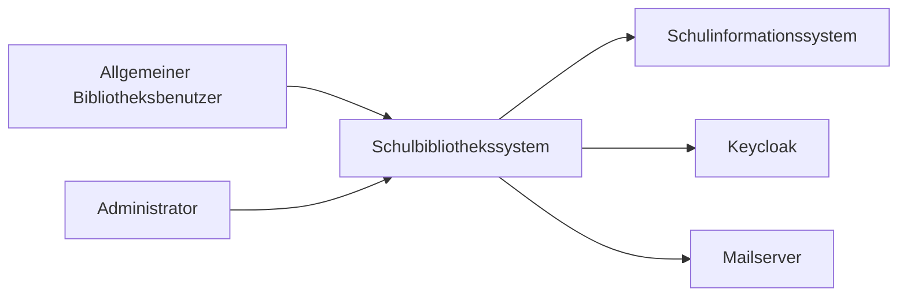

#### **3.7.4 L2 - Container View**

Das L2-Diagramm zerlegt das System in seine zentralen Deployable-Container.

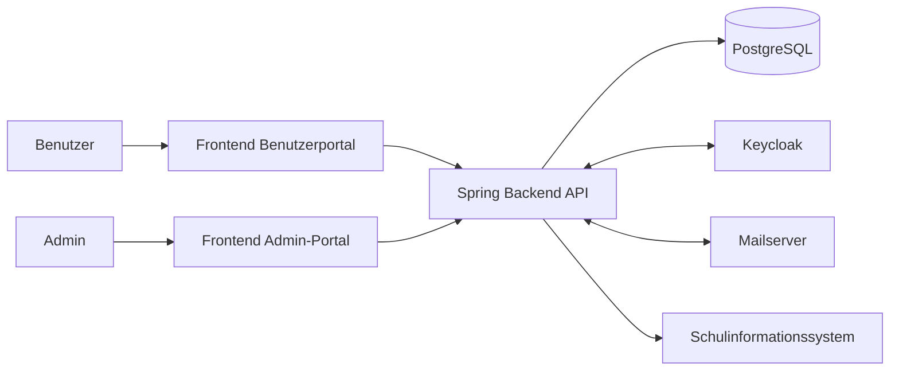

#### **3.7.5 L3 - Component View (Spring Backend)**

Das L3-Diagramm zeigt die wichtigsten Komponenten innerhalb des Spring-Backend-Containers.

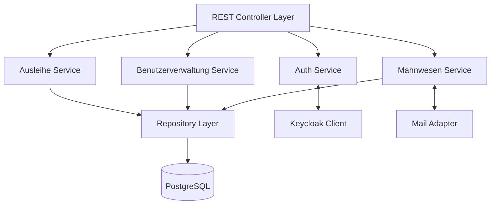

> <span style="font-size: 1.5em">:mag:</span> **Vertiefung:** Für Reviews eignet sich die Kombination aus L1 bis L3 besonders gut: L1 klärt Grenzen, L2 zeigt Laufzeitbausteine, L3 macht Verantwortlichkeiten im Backend-Team explizit.

***
Quellen
- [arc42](https://arc42.org/)
- [C4 Model](https://c4model.com/)
- [PlantUML](https://plantuml.com/)
- [Mermaid](https://mermaid.js.org/)
- [Architecture Decision Records](https://adr.github.io/)

***

<div style="page-break-after: always;"></div>

## 4. API-Spezifikationen (Die Verträge)

APIs sind die Schnittstellen zwischen Systemkomponenten und externen Diensten. Eine klare und ausführliche API-Dokumentation ist essentiell für reibungslose Integrationen und schnellere Entwicklung.

### 4.1 Zweck und Bedeutung von API-Dokumentation

APIs definieren verbindliche Verträge zwischen Konsumenten und Anbietern. Die Dokumentation muss diese Verträge präzise, aktuell und leicht verständlich darstellen.

**Zentrale Ziele:**

1. **Verständlichkeit:** Entwickler verstehen schnell, wie die API funktioniert.
2. **Interoperabilität:** Clients verschiedener Technologie-Stacks können die API nutzen.
3. **Wartbarkeit:** API-Änderungen werden kontrolliert und transparent kommuniziert.
4. **Automatisierung:** Aus Spezifikationen lassen sich Client- und Server-Code generieren.

> <span style="font-size: 1.5em">:bulb:</span> **Merksatz:** API-Dokumentation ist kein „nett zu haben", sondern ein geschäftskritisches Artefakt.

### 4.2 REST APIs mit OpenAPI/Swagger

REST APIs sind das De-facto-Standard für synchrone, webbasierte Integrationen.

**Was ist OpenAPI?**

OpenAPI (ehemals Swagger) ist eine standardisierte Spezifikation zur Beschreibung von REST APIs. Sie wird in YAML oder JSON definiert und kann sowohl von Menschen als auch Maschinen gelesen werden.

**Typische Inhalte einer OpenAPI-Spezifikation:**

- **Pfade (Endpoints):** Welche Ressourcen existieren und wie werden sie abgefragt?
- **Methoden:** GET, POST, PUT, DELETE, PATCH und ihre Semantik.
- **Parameter:** Query-, Path-, Header- und Body-Parameter.
- **Responses:** Erfolgreiche und fehlgeschlagene Antwortkörper mit HTTP-Status.
- **Schemas:** Definition von Datenmodellen mit JSON-Schema.

**Beispiel: Überfällige Medien abrufen (Schulbibliothek)**

```yaml
paths:
  /api/mediums/overdue:
    get:
      summary: Liste überfälliger Medien abrufen
      tags:
        - Mediums
      parameters:
        - name: filter
          in: query
          schema:
            type: string
          description: Filterung nach Klasse oder Benutzernummer
      responses:
        '200':
          description: Liste überfälliger Medien
          content:
            application/json:
              schema:
                $ref: '#/components/schemas/OverdueList'
        '401':
          description: Nicht authentifiziert
```

> <span style="font-size: 1.5em">:mag:</span> **Vertiefung:** OpenAPI-Spezifikationen können von Tools wie Swagger UI in interaktive Web-Dokumentationen umgewandelt werden, in denen Entwickler Requests direkt testen können.

### 4.3 Event-Driven APIs mit AsyncAPI

Für asynchrone, nachrichtenbasierte Systeme ist OpenAPI nicht geeignet. AsyncAPI bietet einen ähnlich standardisierten Ansatz.

**Was ist AsyncAPI?**

AsyncAPI beschreibt Systeme, die über Message-Broker wie Kafka, RabbitMQ oder AWS SNS/SQS kommunizieren.

**Typische Inhalte einer AsyncAPI-Spezifikation:**

- **Channels:** Topics oder Queues, auf die Systems Publishing oder Subscribing durchführen.
- **Operations:** `publish` (Nachricht senden) oder `subscribe` (Nachricht empfangen).
- **Messages:** Struktur und Schema der Event-Payloads.
- **Servers:** Connection-Details zum Broker.

**Beispiel: Mahnungs-Event (Schulbibliothek)**

```yaml
asyncapi: 3.0.0
channels:
  mahn/created:
    description: Wenn eine neue Mahnung erstellt wird
    operations:
      publish:
        action: send
        message:
          $ref: '#/components/messages/MahnungCreated'

components:
  messages:
    MahnungCreated:
      payload:
        type: object
        properties:
          mahnungId:
            type: string
          benutzerEmail:
            type: string
          mediumId:
            type: string
          verzugTage:
            type: integer
```

> <span style="font-size: 1.5em">:warning:</span> **Achtung:** Event-basierte Systeme sind schwerer zu debuggen als Request/Response-APIs. Dokumentation ist daher umso wichtiger.

### 4.4 GraphQL Schema als selbstdokumentierende API

GraphQL funktioniert anders als klassische APIs: Statt vieler fester Endpunkte gibt es ein gemeinsames, klar beschriebenes Datenmodell, das Clients direkt abfragen können, um zu sehen, welche Daten und Abfragen verfügbar sind.

**Besonderheit von GraphQL:**

- **Typsystem:** Alle Daten und Operationen sind streng typisiert.
- **Introspection:** Der GraphQL-Server offenbart sein Schema automatisch; Tools wie GraphQL Playground können damit automatisch Dokumentation und IDE-Features generieren.
- **Flexible Abfragen:** Clients fordern nur die Felder an, die sie benötigen.

**Beispiel: GraphQL Query (Schulbibliothek)**

```graphql
query {
  user(id: "12345") {
    name
    ausleihen {
      medium {
        titel
      }
      faelligAm
    }
  }
}
```

Das Schema hinter dieser Query ist selbstdokumentierend und kann von IDE-Plugins genutzt werden.

> <span style="font-size: 1.5em">:bulb:</span> **Merksatz:** GraphQL verschafft API-Dokumentation durch Introspection (= Selbstbeobachtung) eine völlig neue Dimension: Clients können sich selbst zu Laufzeit über verfügbare Operationen und Datentypen informieren.

### 4.5 Praxisbeispiele aus der Schulbibliothek

Im Schulbibliotheks-System werden alle drei API-Stile eingesetzt:

**REST (OpenAPI):** Backend → Frontend Kommunikation und externe Integrationen
- `GET /api/mediums` – Mediensuche
- `POST /api/loans` – Ausleihe erstellen
- `DELETE /api/loans/{id}` – Ausleihe zurückgeben

**AsyncAPI (Kafka):** Backend-interne Event-Verarbeitung
- `mahn/created` – Mahnung erstellt, Mailserver wird benachrichtigt
- `user/registered` – Benutzer registriert, Willkommens-E-Mail wird versendet

**GraphQL (optional):** Mobile App mit flexiblen Abfrageanforderungen
- Query für Benutzer-Dashboard mit dynamischen Feldauswahl

Durch die Kombination dieser API-Stile entsteht ein flexibles, wartbares System, in dem jede Komponente die beste Technologie für ihren Use-Case nutzen kann.

***
Quellen
- [OpenAPI Specification](https://spec.openapis.org/)
- [AsyncAPI Specification](https://www.asyncapi.com/)
- [GraphQL](https://graphql.org/)
- [Swagger UI](https://swagger.io/tools/swagger-ui/)
- [GraphQL Introspection](https://graphql.org/learn/introspection/)

***

<div style="page-break-after: always;"></div>

## 5. DevOps- & Infrastruktur-Dokumentation

Stellen Sie sich vor, Ihr Team hat eine sehr gute Anwendung gebaut, aber niemand weiß genau, wie sie zuverlässig gebaut, getestet und ausgerollt wird. Dann hängt die Auslieferung an Einzelpersonen statt an klaren Prozessen. Genau hier setzt DevOps-Dokumentation an.

### 5.1 Zweck und Bedeutung der DevOps-Dokumentation

DevOps-Dokumentation beschreibt nicht nur Tools, sondern den gesamten Weg von einer Code-Änderung bis zum stabilen Betrieb.

**Wesentliche Ziele:**

1. **Reproduzierbarkeit:** Builds und Deployments sind jederzeit nachvollziehbar und wiederholbar.
2. **Transparenz:** Teams verstehen, welche Schritte in CI/CD-Pipelines passieren.
3. **Betriebssicherheit:** Konfigurationen und Abhängigkeiten sind klar dokumentiert.
4. **Schnelleres Onboarding:** Neue Teammitglieder finden sich ohne mündliche Sonderregeln zurecht.

> <span style="font-size: 1.5em">:bulb:</span> **Merksatz:** Wenn Build- und Deploy-Wissen nur in Köpfen steckt, ist der Betrieb fragil; wenn es dokumentiert ist, wird der Prozess teamfähig.

### 5.2 Infrastructure-as-Code (IaC) und Container-Dokumentation

Bei `Infrastructure-as-Code (IaC)` wird Infrastruktur in Code-Dateien beschrieben, versioniert und per Review gepflegt.

**Was gehört in IaC-Dokumentation?**

- Zweck und Grenzen jeder Infrastruktur-Komponente (z. B. App-Container, Datenbank, Reverse Proxy)
- Wichtige Build-Argumente und Laufzeitparameter
- Netzwerk- und Port-Konzept
- Volumes, Secrets und Persistenzstrategie

**Praxis im Schulbibliotheks-Projekt:**

- Das Spring-Backend und beide Frontends werden als Container gebaut.
- PostgreSQL läuft als separater Dienst mit persistentem Volume.
- Für jede Komponente gibt es ein kurzes README mit Build-Befehl, benötigten Variablen und Startreihenfolge.

> <span style="font-size: 1.5em">:warning:</span> **Achtung:** IaC ohne Doku ist nur "automatisiertes Raten". Besonders Ports, Volumes und Abhängigkeiten müssen explizit beschrieben sein.

### 5.3 Pipeline-Dokumentation (CI/CD)

Eine gute Pipeline-Dokumentation beantwortet drei Fragen:

1. Welche Stages laufen in welcher Reihenfolge?
2. Welche Qualitätskriterien blockieren ein Deployment?
3. Wer wird bei Fehlschlägen informiert?

**Typische Pipeline-Stufen:**

1. `Lint` und statische Analyse
2. Unit- und Integrationstests
3. Build von Artefakten und Containern
4. Sicherheitsscans
5. Deployment nach `staging` und später `production`

**Beispielhafte Ablaufvisualisierung:**

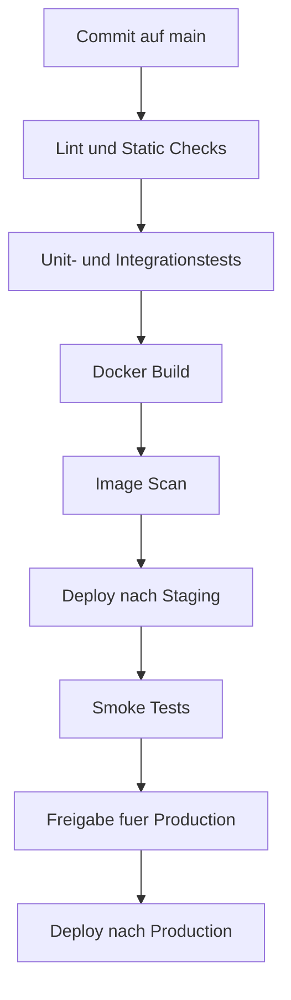

> <span style="font-size: 1.5em">:mag:</span> **Vertiefung:** Dokumentieren Sie pro Stage immer auch Eintrittsbedingungen, erwartete Dauer und klare Fehlerbilder. Das beschleunigt Incident-Analyse erheblich.

### 5.4 Environment-Matrix und Konfigurationsmanagement

Eine Environment-Matrix macht Unterschiede zwischen `dev`, `staging` und `production` sichtbar, ohne Konfigurationschaos zu erzeugen.

| Aspekt | Dev | Staging | Production |
| :--- | :--- | :--- | :--- |
| Ziel | Entwicklung und schnelles Feedback | Produktionsnahe Validierung | Stabiler Live-Betrieb |
| Daten | Testdaten, anonymisiert | Realistische Testdaten | Echtdaten mit Schutzmaßnahmen |
| Deployment-Frequenz | Mehrmals täglich | Täglich oder pro Release-Kandidat | Kontrolliert nach Freigabe |
| Secrets | Lokale Secret-Quelle | Zentrale Secret-Verwaltung | Zentrale Secret-Verwaltung mit strengen Rechten |
| Monitoring | Basis-Metriken | Erweiterte Metriken + Alert-Tests | Vollständiges Monitoring + 24/7 Alerting |

**Regeln für gutes Konfigurationsmanagement:**

- Keine Zugangsdaten im Quellcode
- Konfiguration über Umgebungsvariablen und Secret-Store
- Klare Namenskonventionen für Variablen
- Änderungen über Pull Requests und Reviews

### 5.5 Praxisbeispiel: Delivery-Prozess der Schulbibliothek

Ein Delivery-Dokumentation könnte in folgende vier Artefakte aufgeteilt werden:

1. **Pipeline-Übersicht:** Mermaid-Diagramm und tabellarische Stage-Beschreibung.
2. **Container-READMEs:** Build- und Startanleitung für Frontend, Backend und PostgreSQL.
3. **Environment-Matrix:** Unterschiede zwischen Development-, Test- und Produktivumgebung.
4. **Release-Checkliste:** Kriterien vor dem Go-Live (Tests grün, Migration geprüft, Monitoring aktiv).

Dadurch kann das Team Releases standardisieren und Fehler durch manuelle Sonderwege deutlich reduzieren.

> <span style="font-size: 1.5em">:bulb:</span> **Merksatz:** DevOps-Dokumentation ist dann gut, wenn ein anderes Teammitglied damit einen Release durchführen kann, ohne bei jeder Stufe nachzufragen.

***
Quellen
- [GitHub Actions Workflow Syntax](https://docs.github.com/en/actions/reference/workflows-and-actions/workflow-syntax-for-github-actions)
- [Dockerfile Reference](https://docs.docker.com/reference/dockerfile/)
- [Docker Compose File Reference](https://docs.docker.com/reference/compose-file/)
- [The Twelve-Factor App: Config](https://12factor.net/config)

***

<div style="page-break-after: always;"></div>

## 6. Das Betriebshandbuch (Operations Manual)

Das Betriebshandbuch beschreibt, wie ein System im Alltag stabil betrieben wird. Es richtet sich vor allem an Systemadministratoren, DevOps-Teams und Bereitschaftsdienste.

### 6.1 Zweck und Zielgruppe des Betriebshandbuchs

Stellen Sie sich vor, ein wichtiger Dienst fällt am Abend aus und das Entwicklungsteam ist nicht erreichbar. Dann muss das Betriebsteam trotzdem handlungsfähig sein. Genau dafür ist das Betriebshandbuch da.

**Ziele des Betriebshandbuchs:**

1. **Handlungssicherheit:** Klare Schritte bei Störungen statt spontaner Improvisation.
2. **Nachvollziehbarkeit:** Betriebsentscheidungen und Recovery-Aktionen sind dokumentiert.
3. **Schnelle Einarbeitung:** Neue Teammitglieder verstehen Prozesse und Zuständigkeiten.
4. **Verfügbarkeit:** Kritische Abläufe bleiben auch bei Personalausfall stabil.

> <span style="font-size: 1.5em">:bulb:</span> **Merksatz:** Ein gutes Betriebshandbuch ist kein Theoriepapier, sondern ein Werkzeug für echte Betriebssituationen.

### 6.2 Installationsanleitung und Betriebsvoraussetzungen

Die Installationsanleitung beschreibt reproduzierbar, wie ein System neu aufgesetzt oder wiederhergestellt wird.

**Typische Inhalte:**

- Systemvoraussetzungen (Betriebssystem, Ports, Laufzeitumgebungen)
- Versionsstände von Datenbank, Backend und Frontend
- Reihenfolge der Inbetriebnahme (z. B. Datenbank vor Backend)
- Konfigurationsparameter und Secret-Quellen
- Verifikation nach Installation (Health-Checks, Smoke-Tests)

**Beispiel für die Schulbibliothek:**

1. PostgreSQL starten und Verbindung prüfen.
2. Backend starten und `/actuator/health` auf `UP` prüfen.
3. Benutzerportal und Admin-Portal deployen.
4. Login über Backend-Auth-Flow testen.

> <span style="font-size: 1.5em">:warning:</span> **Achtung:** Ohne klare Startreihenfolge entstehen häufig Folgestörungen, die schwer zu diagnostizieren sind.

### 6.3 Monitoring und Alerting

- **Monitoring** beantwortet die Frage: "Wie gesund ist das System gerade?" 
- **Alerting** beantwortet die Frage: "Wann muss jemand eingreifen?"

**Was dokumentiert werden sollte:**

- Wichtige Metriken: Antwortzeit, Fehlerrate, Auslastung, Queue-Länge
- Health-Endpoints und Log-Quellen
- Alert-Regeln mit Schwellenwerten und Eskalationsstufen
- Alarmwege (z. B. E-Mail, Chat, On-Call-System)

**Praktische Leitregel:**

- Nicht jeder Fehler ist ein Alarm.
- Alarme müssen **handlungsrelevant** sein, damit kein Alert-Fatigue entsteht.

### 6.4 Backup und Recovery

Backup-Dokumentation beschreibt, **welche Daten** gesichert werden, **wann** gesichert wird und **wie** ein Restore zuverlässig funktioniert.

**Kernbestandteile:**

- Backup-Umfang (Datenbank, Konfiguration, ggf. Dateianhänge)
- Frequenz (z. B. täglich Vollbackup, stündliche inkrementelle Sicherung)
- Aufbewahrungsfristen und Speicherorte
- Regelmäßige Restore-Tests

**RTO und RPO verständlich erklärt:**

- **RTO (Recovery Time Objective):** Wie lange darf die Wiederherstellung maximal dauern?
- **RPO (Recovery Point Objective):** Wie viel Datenverlust ist maximal akzeptabel?

> <span style="font-size: 1.5em">:mag:</span> **Vertiefung:** Ein Backup gilt erst als verlässlich, wenn ein Restore-Test erfolgreich dokumentiert wurde.

### 6.5 Runbooks und Playbooks

Runbooks und Playbooks sind Schritt-für-Schritt-Anleitungen für typische Betriebssituationen.

**Unterschied kurz erklärt:**

- **Runbook:** Konkrete technische Handlungsschritte für einen definierten Vorfall.
- **Playbook:** Übergeordneter Ablauf mit Rollen, Kommunikation und Entscheidungswegen.

**Beispielhafte Runbook-Struktur:**

1. Symptom erkennen (z. B. 5xx-Fehler steigt).
2. Sofortmaßnahmen durchführen (Service prüfen, letzte Deployments prüfen).
3. Ursache eingrenzen (Logs, Metriken, Abhängigkeiten).
4. Stabilisierung oder Rollback durchführen.
5. Nachbereitung und Dokumentation (Postmortem).

### 6.6 Praxisbeispiel: Operations in der Schulbibliothek

Für das Schulbibliotheks-System kann das Betriebshandbuch in fünf Kernbausteine gegliedert werden:

1. **Installationskapitel:** Setup für PostgreSQL, Backend und beide Frontends.
2. **Monitoring-Kapitel:** Dashboards für Antwortzeiten, Fehlerquote und Mailversand-Status.
3. **Alerting-Kapitel:** Eskalation bei Auth-Ausfällen oder bei hohem Anteil fehlgeschlagener Ausleihen.
4. **Backup-Kapitel:** Tägliche Datenbanksicherung mit monatlichem Restore-Test.
5. **Runbook-Kapitel:** Vorgehen bei Keycloak-Ausfall, Datenbank-Engpässen und Mailversand-Störungen.

Damit wird der Betrieb unabhängig von Einzelpersonen und für Unterrichts- wie Live-Betrieb belastbar.

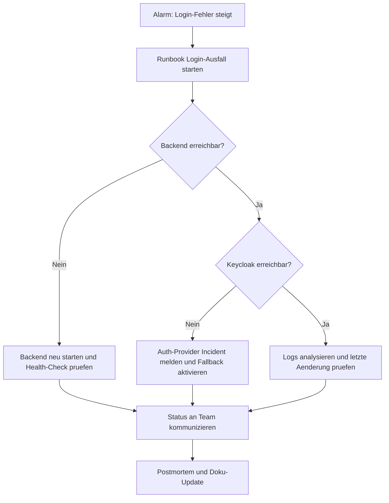

> <span style="font-size: 1.5em">:bulb:</span> **Merksatz:** Betriebshandbuch und Runbooks sind nur dann wertvoll, wenn sie regelmäßig geübt und aktualisiert werden.

***
Quellen
- [Google SRE Book: Monitoring Distributed Systems](https://sre.google/sre-book/monitoring-distributed-systems/)
- [Prometheus Alertmanager Documentation](https://prometheus.io/docs/alerting/latest/alertmanager/)
- [PostgreSQL pg_dump](https://www.postgresql.org/docs/current/app-pgdump.html)
- [PostgreSQL pg_restore](https://www.postgresql.org/docs/current/app-pgrestore.html)
- [Google Cloud: Alerting on SLO Burn Rate](https://cloud.google.com/stackdriver/docs/solutions/slo-monitoring/alerting-on-budget-burn-rate)

***

<div style="page-break-after: always;"></div>

## 7. Der "Docs-as-Code" Ansatz

Beim Docs-as-Code-Ansatz wird Dokumentation wie Software behandelt: Sie liegt im Repository, wird versioniert, getestet und per Review verbessert.

### 7.1 Grundidee und Nutzen

Stellen Sie sich vor, Teammitglieder schreiben Dokumentation in verschiedenen Tools, ohne Versionierung und ohne klare Freigabe. Dann ist schnell unklar, welche Version aktuell ist. Docs-as-Code löst dieses Problem durch denselben Prozess, der auch für Quellcode verwendet wird.

**Kernprinzipien:**

1. Dokumentation liegt als Textdateien (z. B. `Markdown`) im Git-Repository.
2. Änderungen laufen über Branches, Pull Requests und Reviews.
3. Qualität wird automatisiert geprüft (z. B. Link-Checks, Style-Regeln).
4. Veröffentlichung erfolgt reproduzierbar über CI/CD.

**Nutzen im Alltag:**

- Volle Nachvollziehbarkeit jeder Änderung
- Bessere Zusammenarbeit zwischen Entwicklung und Betrieb
- Weniger veraltete Doku durch direkte Nähe zum Code
- Einheitlicher Qualitätsstandard

> <span style="font-size: 1.5em">:bulb:</span> **Merksatz:** Docs-as-Code bedeutet nicht "mehr Dokumentation", sondern "bessere und wartbare Dokumentation".

### 7.2 Typischer Workflow mit Git, Pull Requests und Reviews

Ein typischer Docs-as-Code-Workflow folgt denselben Schritten wie ein Feature-Workflow im Code.

1. Aufgabe im Ticket-System anlegen (z. B. "Runbook für Backup-Restore ergänzen").
2. Branch erstellen und Dokument ändern.
3. Pull Request mit klarer Beschreibung und Review-Checklist öffnen.
4. Fachliches und sprachliches Review durchführen.
5. Nach Merge automatische Veröffentlichung der Dokumentation starten.

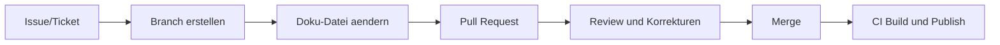

> <span style="font-size: 1.5em">:warning:</span> **Achtung:** Ohne Review-Prozess übernimmt sich oft ein Teammitglied als "Doku-Einzelperson". Das reduziert Qualität und Teamwissen.

### 7.3 Dokumentationssprachen: Markdown, AsciiDoc, Typst

Die Wahl der Sprache hängt von Zielgruppe, Komplexität und Ausgabeformaten ab.

| Sprache | Stärken | Typische Nutzung |
| :--- | :--- | :--- |
| `Markdown` | Sehr einfach, schnell erlernbar, ideal für kollaborative Bearbeitung | README, Handbücher, Lernskripte, interne Wikis |
| `AsciiDoc` | Mächtiger bei großen, strukturierten Dokumenten | Technische Handbücher, modulare Dokumentationssets |
| `Typst` | Moderne Layout-Kontrolle für hochwertige PDFs | Druckfähige Skripte, Unterrichtsunterlagen, formale Berichte |

Für Schulprojekte ist `Markdown` häufig der beste Einstieg, weil Syntax, Tooling und Einstiegshürde sehr niedrig sind.

### 7.4 Diagramme als Code (Diagram as Code)

Im Docs-as-Code-Ansatz werden Diagramme nicht als Bilddateien abgelegt, sondern als textueller Quellcode beschrieben. Dieser Code wird versioniert, gereviewt und automatisch in Grafiken umgewandelt – genauso wie Dokumentationstext oder Programmcode.

**Warum Diagram-as-Code?**

| Eigenschaft | Bilddatei (PNG/SVG-Export) | Diagram as Code |
| :--- | :--- | :--- |
| Versionierbarkeit | Diff nicht lesbar | Vollständig versioniert und diff-bar |
| Wartbarkeit | Manuelles Bearbeiten im Tool | Textänderung im Editor |
| CI/CD-Integration | Schwierig | Automatische Generierung im Build |
| Review-Fähigkeit | Nur visuell | Textreview wie Codereview |
| Konsistenz | Abhängig vom Tool | Zentral steuerbar über Styleguides |

**Die wichtigsten Werkzeuge:**

#### PlantUML

`PlantUML` ist eine weit verbreitete Scriptsprache für UML-Diagramme. Sie unterstützt u. a. Klassen-, Sequenz-, Aktivitäts- und Komponentendiagramme.

```text
@startuml
class Buch {
  +isbn: String
  +titel: String
  +ausleihen()
}
class Nutzer {
  +id: String
  +name: String
  +ausleihen(buch: Buch)
}
Nutzer --> Buch : leiht aus
@enduml
```

> **Stärke:** Sehr breite UML-Abdeckung, IDE-Integration, kann lokal oder über Server gerendert werden.

#### Mermaid

`Mermaid` ist eine JavaScript-basierte Diagrammsprache, die direkt in Markdown-Dokumenten verwendet werden kann und von GitHub, GitLab und MkDocs nativ unterstützt wird.

```text
sequenceDiagram
    actor Nutzer
    participant Frontend
    participant Backend
    participant DB
    Nutzer->>Frontend: Buch ausleihen
    Frontend->>Backend: POST /ausleihe
    Backend->>DB: Verfügbarkeit prüfen
    DB-->>Backend: verfügbar
    Backend-->>Frontend: Ausleihe bestätigt
    Frontend-->>Nutzer: Bestätigungsanzeige
```

> **Stärke:** Direkte Markdown-Integration, kein separates Tool nötig, breite Plattformunterstützung (GitHub, GitLab, MkDocs).

#### Graphviz

`Graphviz` (DOT-Sprache) ist besonders geeignet für gerichtete und ungerichtete Graphen, Abhängigkeitsgraphen und Infrastrukturdiagramme.

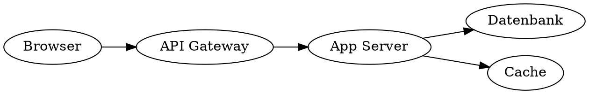

> **Stärke:** Exzellent für automatisch layoutete Graphen, wird häufig in CI-Pipelines für Abhängigkeitsvisualisierungen eingesetzt.

**Werkzeugvergleich:**

| Werkzeug | Diagrammtypen | Integration | Rendering |
| :--- | :--- | :--- | :--- |
| `PlantUML` | UML (alle Typen), C4, Netzwerk | IDE, CI-Server, Confluence | Java-Server oder lokal |
| `Mermaid` | Flowchart, Sequenz, Klassen, Gantt, ER | Markdown nativ, GitHub/GitLab | JavaScript im Browser |
| `Graphviz` | Gerichtete/ungerichtete Graphen | CI-Pipelines, Skripte | Kommandozeilenwerkzeug |

> <span style="font-size: 1.5em">:bulb:</span> **Merksatz:** Diagram-as-Code ermöglicht, dass Diagramme denselben Review- und Versionierungsprozess durchlaufen wie Code und Text – das erhöht die Qualität und Aktualität der Dokumentation erheblich.

> <span style="font-size: 1.5em">:mag:</span> **Vertiefung:** Im Schulprojekt empfiehlt sich `Mermaid` für Sequenz- und Ablaufdiagramme (direkt in Markdown), `PlantUML` für UML-Klassendiagramme (Architektur) und `Graphviz` für Deployment- und Abhängigkeitsgraphen.

***
Quellen

- [Mermaid – Diagramming and charting tool](https://mermaid.js.org/)
- [PlantUML – Open-source UML tool](https://plantuml.com/)
- [Graphviz – Graph Visualization Software](https://graphviz.org/)
***

### 7.5 Generatoren und Tooling: Sphinx, MkDocs, Doxygen

Generatoren übersetzen Quelltexte in nutzbare Dokumentationsseiten oder PDFs.

**Überblick:**

- `MkDocs`: Schnell für Markdown-basierte Projektdokumentation.
- `Sphinx`: Sehr gut für umfangreiche, strukturierte Doku mit Referenzen.
- `Doxygen`: Fokus auf API- und Quellcode-nahe Dokumentation.

**Typische Entscheidungskriterien:**

- Welche Eingabeformate werden unterstützt?
- Wie gut funktioniert Navigation und Suche?
- Gibt es Themes und Plugins für CI/CD?
- Ist das Tooling im Team wartbar?

### 7.6 Qualitätsmanagement für Dokumentation

Wie Code braucht auch Dokumentation automatisierte Qualitätssicherung.

**Sinnvolle Qualitätschecks in CI:**

- Link-Check (kaputte interne/externe Links erkennen)
- Style-Check (einheitliche Schreibweisen, Glossarbegriffe)
- Struktur-Check (Überschriftenhierarchie, TOC-Konsistenz)
- Build-Check (Dokumentation muss fehlerfrei generierbar sein)

**Empfohlene Regeln im Team:**

1. Jede relevante Codeänderung enthält, wenn nötig, ein Doku-Update.
2. Pull Requests gelten erst als "fertig", wenn Doku-Checks grün sind.
3. Veraltete Abschnitte werden aktiv markiert oder entfernt.

> <span style="font-size: 1.5em">:mag:</span> **Vertiefung:** Ein leichtgewichtiger Doku-Styleguide (Begriffe, Tonalität, Formatregeln) erhöht Konsistenz oft stärker als zusätzliche Tools.

### 7.7 Praxisbeispiel: Docs-as-Code in der Schulbibliothek

Für das Schulbibliotheks-System kann Docs-as-Code so umgesetzt werden:

1. **Repository-Struktur:** `docs/` enthält Architektur, API, Betriebshandbuch und Runbooks.
2. **Verantwortung:** Jede Feature-Story enthält ein Doku-Akzeptanzkriterium.
3. **Pipeline:** Bei jedem Merge werden Link-Checks ausgeführt und die Doku-Seite neu veröffentlicht.
4. **Review-Praxis:** Fachbereich prüft Inhalte, Technikteam prüft Struktur und Konsistenz.

Dadurch bleibt Dokumentation aktuell, reviewbar und für neue Teammitglieder sofort nutzbar.

> <span style="font-size: 1.5em">:bulb:</span> **Merksatz:** Der größte Vorteil von Docs-as-Code ist nicht das Tool, sondern der verbindliche Teamprozess.

### 7.8 KI-gestützte Entwicklung im Docs-as-Code: Unterstützung und Grenzen

KI-Tools können den Docs-as-Code-Ansatz deutlich beschleunigen, wenn sie gezielt und kontrolliert eingesetzt werden.

**Wo KI besonders unterstützt:**

1. **Erstentwürfe schneller erstellen:** Kapitelstrukturen, Glossare, Checklisten und Zusammenfassungen entstehen schneller.
2. **Konsistenz verbessern:** KI kann Begriffe, Schreibweisen und Stilregeln gegen den Doku-Styleguide prüfen.
3. **Review-Aufwand reduzieren:** Vorschläge für bessere Formulierungen, fehlende Querverweise und unklare Abschnitte.
4. **Wartung erleichtern:** Bei Code- oder API-Änderungen kann KI betroffene Dokumentstellen schneller identifizieren.

**Besonders hilfreich für Visualisierung in der Doku:**

- **Diagramme-as-Code automatisch erzeugen:** KI kann aus Textanforderungen direkt Diagrammcode für `Mermaid`, `PlantUML` und `Graphviz` (häufig als "Graphwiz" geschrieben) erstellen.
- **Schnelle Variantenbildung:** Aus einem Szenario können z. B. Sequenz-, Klassen-, Architektur- und Ablaufdiagramme in mehreren Granularitäten erzeugt werden.
- **Konsistente Diagramm-Sprache:** KI kann Begriffe aus Glossar und Ubiquitous Language in Diagrammen konsistent halten.
- **Niedrigere Einstiegshürde:** Teams ohne tiefes Diagramm-Tool-Know-how kommen schneller zu brauchbaren Visualisierungen.

**Skills als Verstärker für die Dokumentgenerierung:**

Der Skill-Ansatz wurde im Claude/Anthropic-Umfeld früh sichtbar gemacht und hat sich inzwischen als allgemeines Pattern in Agent-Systemen etabliert.

- **Skill = spezialisierte Fähigkeitspakete:** Vorgegebene Regeln, Prompts, Checks und ggf. Tools für konkrete Aufgaben.
- **Nutzen für Doku:** Wiederverwendbare Skills für "ADR schreiben", "Runbook erzeugen", "Mermaid aus API-Flow ableiten", "PlantUML für C4-Sicht erzeugen".
- **Qualitätsgewinn:** Skills reduzieren Zufall in KI-Ausgaben, weil Struktur, Terminologie und Qualitätskriterien vorgegeben sind.
- **Grafikfokus:** Ein dedizierter "Diagramm-Skill" verbessert bei gleicher Eingabe oft die Lesbarkeit und Konsistenz der erzeugten Diagramme deutlich.

**Wo man aufpassen muss (Risiken):**

- **Falsche Inhalte (Halluzinationen):** KI kann plausibel klingende, aber falsche Aussagen erzeugen.
- **Prompt Injection:** Versteckte Anweisungen in Issues, PR-Kommentaren oder Dokumenten können KI-Ausgaben manipulieren.
- **Datenabfluss:** Sensible Informationen können unbeabsichtigt in Prompts oder externen Diensten landen.
- **Scheingenauigkeit:** Sehr flüssige Texte wirken korrekt, obwohl Quellen fehlen oder Aussagen veraltet sind.

**Konkrete Grenzen und Leitplanken im Team:**

1. **Kein Blind-Merge:** KI-generierte Doku wird immer von Menschen fachlich geprüft.
2. **Quellenpflicht:** Kritische Aussagen (Sicherheit, Compliance, Betrieb) brauchen nachvollziehbare Primärquellen.
3. **Datenklassifikation:** Keine Secrets, Zugangsdaten oder personenbezogenen Daten in Prompts.
4. **Prompt-Härtung:** Untrusted Inputs (z. B. externe Tickets, fremde Dokumente) als potenziell gefährlich behandeln.
5. **Nachvollziehbarkeit:** KI-Beiträge im PR transparent kennzeichnen (z. B. "AI-assisted draft").
6. **Risikobasierte Freigabe:** Für sensible Kapitel (Security, Legal, Betrieb) strengere Review-Regeln anwenden.

> <span style="font-size: 1.5em">:warning:</span> **Achtung:** KI darf den Review-Prozess nicht ersetzen. Bei sicherheits- oder rechtsrelevanten Inhalten ist menschliche Freigabe verpflichtend.

> <span style="font-size: 1.5em">:mag:</span> **Vertiefung:** Die Kombination aus NIST-Risikodenken (Govern, Map, Measure, Manage) und OWASP-Sicherheitsmaßnahmen gegen Prompt Injection liefert einen praktikablen Rahmen für sicheren KI-Einsatz in Docs-as-Code.

***
Quellen
- [MkDocs: Getting Started](https://www.mkdocs.org/getting-started/)
- [Material for MkDocs](https://squidfunk.github.io/mkdocs-material/)
- [Sphinx Documentation](https://www.sphinx-doc.org/)
- [Doxygen Manual](https://www.doxygen.nl/manual/)
- [Diátaxis: A systematic framework for technical documentation](https://diataxis.fr/)
- [NIST AI Risk Management Framework (AI RMF)](https://www.nist.gov/itl/ai-risk-management-framework)
- [OWASP LLM Prompt Injection Prevention Cheat Sheet](https://cheatsheetseries.owasp.org/cheatsheets/LLM_Prompt_Injection_Prevention_Cheat_Sheet.html)
- [European Commission: AI Act (Risk-based approach)](https://digital-strategy.ec.europa.eu/en/policies/regulatory-framework-ai)
- [GitHub Docs: AI prompts can be vulnerable to injection](https://docs.github.com/en/copilot/concepts/agents/coding-agent/risks-and-mitigations)
- [GitHub Docs: Prompt and suggestion collection settings](https://docs.github.com/en/copilot/how-tos/manage-your-account/manage-policies)
- [Anthropic Claude Skills Cookbook](https://github.com/anthropics/anthropic-cookbook/tree/main/skills)
- [Anthropic API Overview (inkl. Skills API)](https://platform.claude.com/docs/en/api/overview)

***

<div style="page-break-after: always;"></div>

## 8. Grenzen von Docs-as-Code & Compliance

Docs-as-Code ist ein starkes Modell für technische Teams. In regulierten oder organisatorisch komplexen Umfeldern reicht der Ansatz allein jedoch oft nicht aus. Dieses Kapitel zeigt, wo die Grenzen liegen und wie ein praktikables Hybridmodell aussieht.

### 8.1 Warum Docs-as-Code nicht alles lösen kann

Stellen Sie sich vor, ein Team dokumentiert alles sauber in Git, aber ein Audit verlangt ein formal freigegebenes PDF mit klarer Verantwortungszuordnung und unveränderbarem Stand. Dann genügt der reine Entwickler-Workflow nicht.

**Typische Gründe für Grenzen:**

1. **Zielgruppenunterschiede:** Nicht-technische Stakeholder arbeiten häufig nicht in Pull-Request-Prozessen.
2. **Formale Nachweispflichten:** Audits verlangen oft freigegebene, eindeutig versionierte Dokumentstände.
3. **Prozess- und Rollenpflichten:** Compliance fordert klare Freigaben, Verantwortlichkeiten und Dokumentationsketten.
4. **Rechtsrahmen:** Datenschutz, Informationssicherheit und sektorale Vorgaben verlangen zusätzliche Nachweise.

> <span style="font-size: 1.5em">:bulb:</span> **Merksatz:** Docs-as-Code ist hervorragend für technische Qualität, aber Compliance benötigt zusätzlich formale Governance.

### 8.2 Vergleich: Entwicklerfokus vs. Compliancefokus

| Merkmal | Docs-as-Code (Technik) | Management / Legal / Compliance |
| :--- | :--- | :--- |
| **Zielgruppe** | Entwickler, DevOps, Architekten | Auditoren, Juristen, Kunden, Management |
| **Tools** | IDE, Git, Markdown, CLI | Word, Excel, SharePoint, ERP- oder GRC-Systeme |
| **Revision** | Git-Historie (Commits, PRs) | Freigabeprozesse, Aufbewahrungspflichten, signierte oder formal archivierte Stände |
| **Inhalt** | Technische Funktionsweise und Umsetzung | Nachweis von Regelkonformität, Verantwortlichkeit und Wirksamkeit |
| **Sprache** | Stark technisch | Fachlich, rechtlich, auditierbar |

Diese Gegenüberstellung zeigt: Beide Sichtweisen sind nicht gegensätzlich, sondern komplementär.

### 8.3 Typische Konfliktfelder in der Praxis

**Wo Docs-as-Code oft scheitert, wenn es allein eingesetzt wird:**

- **Kollaboration:** Fachabteilungen oder externe Prüfer arbeiten nicht im Git-Workflow.
- **Rechtssicherheit:** Ein Commit allein erfüllt nicht immer formale Nachweis- oder Signaturanforderungen.
- **Datenschutzdokumente:** Artefakte wie Verarbeitungsverzeichnisse oder Datenschutzfolgenabschätzungen benötigen oft standardisierte Formate und Freigaben.
- **Freigabe-Transparenz:** Wer fachlich, rechtlich und organisatorisch final freigibt, muss klar nachvollziehbar sein.

> <span style="font-size: 1.5em">:warning:</span> **Achtung:** "Steht in Git" ist kein automatischer Beleg für Compliance-Konformität.

### 8.4 Hybrides Zielbild: Das Beste aus beiden Welten

Ein praxistaugliches Modell kombiniert technischen Docs-as-Code-Flow mit formalen Compliance-Artefakten.

**Empfohlenes Hybridvorgehen:**

1. **Erstellung in Docs-as-Code:** Fachlich-technische Inhalte in Markdown mit Review und CI-Checks.
2. **Mapping auf Compliance-Anforderungen:** Kennzeichnung, welche Kapitel regulatorisch relevant sind.
3. **Formale Freigabe:** Export in freigabefähige Formate (z. B. signiertes PDF), inklusive Verantwortlichen und Freigabedatum.
4. **Archivierung:** Ablage in einem revisionsgeeigneten System mit klarer Aufbewahrungsregel.
5. **Rückkopplung:** Änderungen im Compliance-Dokument fließen zurück ins Quell-Repository.

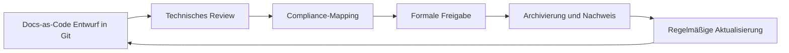

> <span style="font-size: 1.5em">:mag:</span> **Vertiefung:** Ein gemeinsamer "Definition of Compliant"-Katalog pro Dokumenttyp verhindert, dass Teams technische Vollständigkeit mit regulatorischer Vollständigkeit verwechseln.

### 8.5 Praxisbeispiel: Schulbibliothek zwischen Technik und Nachweis

Im Schulbibliotheksprojekt kann die Dokumentation zweigleisig geführt werden:

1. **Technischer Strang (Docs-as-Code):** Architektur, API, Betriebshandbuch und Runbooks im Repository.
2. **Compliance-Strang:** Freigegebene Stände für Datenschutz, Sicherheitsmaßnahmen und Betriebsverantwortung.
3. **Verknüpfung:** Jeder freigegebene Stand referenziert die zugehörige Git-Revision.
4. **Auditfähigkeit:** Für Prüfungen existieren klare Nachweispfade mit Datum, Verantwortlichen und Gültigkeitszeitraum.

So bleibt die Dokumentation zugleich entwicklungsnah und auditierbar.

> <span style="font-size: 1.5em">:bulb:</span> **Merksatz:** Das Ziel ist nicht "Docs-as-Code oder Compliance", sondern "Docs-as-Code plus Compliance".

***
Quellen
- [European Commission: Data protection in the EU](https://commission.europa.eu/law/law-topic/data-protection_en)
- [European Commission: AI Act (Regulatory framework)](https://digital-strategy.ec.europa.eu/en/policies/regulatory-framework-ai)
- [BSI IT-Grundschutz](https://www.bsi.bund.de/dok/it-grundschutz-en)
- [BSI Standard 200-1 (ISMS)](https://www.bsi.bund.de/SharedDocs/Downloads/EN/BSI/Grundschutz/International/bsi-standard-2001_en_pdf.html?nn=908032)
- [GDPR structured reference (incl. links to official OJ PDF)](https://gdpr-info.eu/)

***

<div style="page-break-after: always;"></div>

## 9. Compliance-Dokumente im Softwareprojekt

Nach der Einordnung der Grenzen von Docs-as-Code folgt hier die praktische Frage: Welche Compliance-Dokumente braucht ein Softwareprodukt konkret, und wofür werden sie im Projektalltag verwendet?

### 9.1 Welche Dokumente sind typisch?

Die folgende Übersicht zeigt die am häufigsten benötigten Dokumente im Umfeld von Datenschutz, Informationssicherheit und Auditfähigkeit.

| Dokument | Zweck im Projekt | Typische Phase |
| :--- | :--- | :--- |
| **VVT (Verzeichnis von Verarbeitungstätigkeiten)** | Überblick über Datenverarbeitungen und Verantwortlichkeiten | Planung, Betrieb |
| **TOM-Dokumentation** | Nachweis technischer und organisatorischer Schutzmaßnahmen | Architektur, Betrieb |
| **AVV/DPA** | Vertragliche Regelung mit Auftragsverarbeitern | Beschaffung, Betrieb |
| **DSFA/DPIA** | Risikoanalyse bei Verarbeitung mit hohem Risiko | Planung, Änderung |
| **Lösch- und Aufbewahrungskonzept** | Regeln für Datenlebenszyklus und Fristen | Design, Betrieb |
| **Breach-/Incident-Prozess** | Melde- und Reaktionsablauf bei Datenschutz- oder Sicherheitsvorfällen | Betrieb |
| **Berechtigungs- und Rollenmodell** | Nachweis "wer darf was" | Architektur, Betrieb |
| **Backup- und Recovery-Nachweise** | Nachweis von Wiederherstellbarkeit und Resilienz | Betrieb, Audit |
| **Sicherheitsleitlinie / ISMS-Dokumente** | Governance-Rahmen für Informationssicherheit | Unternehmensweit |

> <span style="font-size: 1.5em">:bulb:</span> **Merksatz:** Compliance-Dokumente sind keine Bürokratie um der Bürokratie willen, sondern strukturierte Nachweise, dass ein System verantwortungsvoll betrieben wird.

### 9.2 Rolle der Dokumente über den Projektlebenszyklus

Compliance-Dokumente sind nicht nur "am Ende für das Audit" relevant, sondern begleiten den gesamten Lebenszyklus:

1. **Planung:** VVT, DSFA-Vorprüfung, erste TOM-Skizze.
2. **Umsetzung:** Konkretisierung von TOMs, Rollenmodell, AVV-Abstimmungen.
3. **Go-Live:** Freigabefähige Dokumentstände, Incident- und Backup-Prozesse aktiv.
4. **Betrieb:** Laufende Pflege bei Änderungen, Vorfällen und neuen Integrationen.
5. **Audit/Review:** Nachweise, Versionen, Freigaben und Wirksamkeit belegen.

Damit wird klar: Compliance ist ein kontinuierlicher Prozess, kein einmaliges Dokumentpaket.

### 9.3 Verantwortlichkeiten im Team

Damit Dokumente wirksam sind, müssen Rollen klar geregelt sein:

- **Product Owner / Projektleitung:** Priorisiert Compliance-Anforderungen und entscheidet über Scope.
- **Entwicklungsteam:** Liefert technische Inhalte (z. B. Architektur, TOM-nahe Umsetzung, Logging, Rechtekonzept).
- **DevOps / Betrieb:** Verantwortet Betriebsnachweise (Monitoring, Backup, Recovery, Incident-Prozesse).
- **Datenschutzbeauftragte / Compliance-Rolle:** Prüft Datenschutzkonformität und formale Nachweise.
- **Management:** Trägt finale Verantwortung für Freigaben und Governance.

> <span style="font-size: 1.5em">:warning:</span> **Achtung:** "Niemand explizit zuständig" ist einer der häufigsten Gründe für veraltete oder unvollständige Compliance-Dokumentation.

### 9.4 Mindestset für ein typisches Softwareprodukt

Für ein kleines bis mittleres Softwareprodukt ist dieses Mindestset praxistauglich:

1. VVT (inkl. Systemgrenzen und Datenkategorien)
2. TOM-Dokument mit Verweis auf technische Umsetzung
3. AVV-Liste für alle relevanten Dienstleister
4. Lösch- und Aufbewahrungskonzept
5. Incident-/Breach-Runbook mit Eskalationswegen
6. Rollen- und Berechtigungskonzept
7. Backup-/Recovery-Nachweis inkl. Restore-Test

Dieses Set kann in einem Docs-as-Code-Workflow gepflegt und zusätzlich in formale Freigabestände überführt werden.

### 9.5 Praxisbeispiel: Schulbibliothek mit Compliance-Map

Für die digitale Schulbibliothek kann eine einfache Compliance-Map wie folgt aussehen:

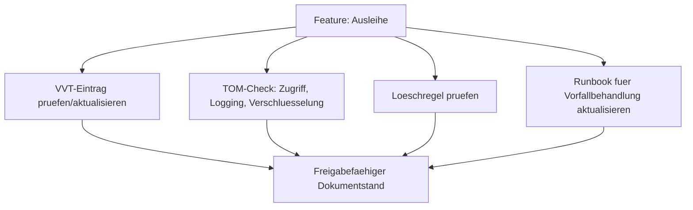

So wird jede wichtige Produktänderung automatisch mit den benötigten Compliance-Nachweisen verknüpft.

> <span style="font-size: 1.5em">:mag:</span> **Vertiefung:** Eine "Compliance-Definition-of-Done" im Ticket-Template (z. B. VVT geprüft, TOM aktualisiert, Runbook angepasst) macht Anforderungen im Alltag sichtbar und umsetzbar.

***
Quellen
- [European Commission: Data protection in the EU](https://commission.europa.eu/law/law-topic/data-protection_en)
- [European Commission: AI Act (Regulatory framework)](https://digital-strategy.ec.europa.eu/en/policies/regulatory-framework-ai)
- [BSI IT-Grundschutz](https://www.bsi.bund.de/dok/it-grundschutz-en)
- [BSI Standard 200-1 (ISMS)](https://www.bsi.bund.de/SharedDocs/Downloads/EN/BSI/Grundschutz/International/bsi-standard-2001_en_pdf.html?nn=908032)
- [GDPR: Article 30 (Records of processing activities)](https://gdpr-info.eu/art-30-gdpr/)
- [GDPR: Article 32 (Security of processing)](https://gdpr-info.eu/art-32-gdpr/)
- [GDPR: Article 33 (Notification of a personal data breach)](https://gdpr-info.eu/art-33-gdpr/)
- [GDPR: Article 35 (Data protection impact assessment)](https://gdpr-info.eu/art-35-gdpr/)

***


<div style="page-break-after: always;"></div>

## 10. Glossar

### A

**ADR (Architecture Decision Record)**
Kurzes, strukturiertes Dokument zur Festhaltung einer einzelnen Architekturentscheidung. Enthält typischerweise Status, Kontext, Entscheidung und Konsequenzen. → Kapitel 3.3

**Alert-Fatigue**
Zustand, bei dem ein Betriebsteam durch zu viele oder irrelevante Alarmmeldungen abstumpft und kritische Alarme zu spät oder gar nicht wahrnimmt. Wird durch handlungsrelevante Alerting-Regeln vermieden. → Kapitel 6.3

**Alerting**
Mechanismus zur automatischen Benachrichtigung von Betriebsteams, wenn definierte Schwellenwerte bei Metriken überschritten oder kritische Systemzustände erkannt werden. → Kapitel 6.3

**API (Application Programming Interface)**
Definierte Schnittstelle, über die Software-Komponenten miteinander kommunizieren. APIs legen fest, welche Operationen möglich sind, welche Daten übergeben werden und wie Fehler behandelt werden. → Kapitel 4

**arc42**
Open-Source-Template zur strukturierten Architekturdokumentation. Gliedert ein System in Kernbereiche wie Kontextabgrenzung, Bausteinsicht, Laufzeitsicht und Verteilungssicht. → Kapitel 3.2

**AsciiDoc**
Ausdrucksstarke Markup-Sprache für technische Dokumentation. Bietet mehr Strukturierungsmöglichkeiten als Markdown und eignet sich besonders für große, modulare Dokumentationssets. → Kapitel 7.3

**AsyncAPI**
Standardisierte Spezifikationssprache zur Beschreibung von ereignisgesteuerten (asynchronen) APIs, z. B. für Kafka- oder RabbitMQ-basierte Systeme. Analog zu OpenAPI, aber für Message-Broker-Architekturen. → Kapitel 4.3

**Authentifizierung**
Prozess der Identitätsprüfung eines Benutzers oder Systems. Im Dokument über Keycloak und OAuth2/OIDC umgesetzt; wird im BFF-Ansatz durch das Backend vermittelt. → Kapitel 3.7

**AVV (Auftragsverarbeitungsvertrag)**
Vertragliche Vereinbarung zwischen Verantwortlichem und Auftragsverarbeiter gemäß DSGVO. Regelt, wie personenbezogene Daten durch Dritte verarbeitet werden dürfen. Synonym: DPA (Data Processing Agreement). → Kapitel 9.1

---

### B

**Backup**
Gesicherte Kopie von Daten oder Systemzuständen, die zur Wiederherstellung nach Datenverlust oder -beschädigung verwendet wird. Aussagekräftig erst nach erfolgreichem Restore-Test. → Kapitel 6.4

**BFF (Backend for Frontend)**
Architekturmuster, bei dem ein dediziertes Backend-Modul als Vermittler zwischen Frontends und internen Diensten agiert. Zentralisiert Sicherheitslogik und vereinfacht die Frontends. → Kapitel 2.4

**Branch**
Separater Entwicklungszweig in einem Git-Repository. Ermöglicht parallele Arbeit an Features oder Dokumentationsänderungen, ohne den Hauptzweig zu beeinflussen. → Kapitel 7.2

---

### C

**C4-Modell**
Hierarchisches Diagrammmodell zur Architekturdokumentation auf vier Abstraktionsstufen: Context (L1), Container (L2), Component (L3) und Code (L4). → Kapitel 3.5

**CI/CD (Continuous Integration / Continuous Deployment)**
Automatisierter Prozess, bei dem Code-Änderungen kontinuierlich gebaut, getestet und in Zielumgebungen ausgerollt werden. Umfasst Stufen wie Lint, Tests, Build, Security-Scan und Deployment. → Kapitel 5.3

**Commit**
Gespeicherter Änderungsstand in einem Git-Repository mit Nachricht, Autor und Zeitstempel. Grundlegende Einheit der Versionskontrolle. → Kapitel 7.2

**Compliance**
Einhaltung von gesetzlichen, regulatorischen und organisatorischen Anforderungen. Im Softwareprojekt betrifft dies z. B. Datenschutz (DSGVO), Informationssicherheit und formale Nachweispflichten. → Kapitel 8, 9

**Container**
Isolierte, leichtgewichtige Laufzeitumgebung für Anwendungen (z. B. Docker). Enthält Code, Abhängigkeiten und Konfiguration und läuft reproduzierbar auf verschiedenen Systemen. → Kapitel 5.2

---

### D

**Definition of Done**
Teamweit vereinbarte Checkliste von Kriterien, die eine User Story oder ein Task erfüllen muss, bevor es als abgeschlossen gilt (z. B. Tests grün, Dokumentation aktualisiert). → Kapitel 2.3

**Deployment**
Auslieferung und Inbetriebnahme einer Anwendung oder eines Updates in eine Zielumgebung (Dev, Staging oder Production). → Kapitel 5.3

**DevOps**
Kulturelles und technisches Modell, das Entwicklung (Dev) und Betrieb (Ops) enger zusammenbringt. Ziel ist kürzere Lieferzyklen, höhere Qualität und stabilerer Betrieb durch Automatisierung und gemeinsame Verantwortung. → Kapitel 5

**Diagramme-as-Code**
Ansatz, bei dem Architektur- und Ablaufdiagramme nicht grafisch gezeichnet, sondern als Textcode (z. B. Mermaid, PlantUML) im Repository gespeichert und versioniert werden. → Kapitel 3.4

**Docker**
Plattform zur Containerisierung von Anwendungen. Ermöglicht reproduzierbare Build- und Laufzeitumgebungen. → Kapitel 5.2

**Docs-as-Code**
Ansatz, bei dem Dokumentation wie Quellcode behandelt wird: Ablage im Git-Repository, Bearbeitung in Textformaten, Qualitätssicherung über Pull Requests und CI/CD-Pipelines. → Kapitel 7

**Domain-Driven Design (DDD)**
Software-Entwicklungsansatz, der das fachliche Domänenmodell in den Mittelpunkt stellt. Fördert eine gemeinsame Fachsprache (Ubiquitous Language) zwischen Entwicklern und Fachexperten. → Kapitel 2.5

**Doxygen**
Werkzeug zur automatischen Generierung von API- und Quellcode-naher Dokumentation aus annotierten Kommentaren im Code. → Kapitel 7.5

**DSGVO (Datenschutz-Grundverordnung)**
Europäische Verordnung zum Schutz personenbezogener Daten. Verpflichtet Organisationen zu Transparenz, Nachweisbarkeit und technischen Schutzmaßnahmen (TOM). → Kapitel 8, 9

**DSFA / DPIA (Datenschutz-Folgenabschätzung)**
Risikoanalyse, die bei der Verarbeitung personenbezogener Daten mit hohem Risiko verpflichtend durchzuführen ist. Bewertet Risiken und notwendige Schutzmaßnahmen. → Kapitel 9.1

---

### E

**Epic**
Große, übergeordnete Anforderungseinheit im agilen Entwicklungsprozess. Wird in kleinere User Stories und Sub-Tasks zerlegt. → Kapitel 2.3

**Environment-Matrix**
Tabellarische Übersicht, die Unterschiede zwischen Entwicklungs-, Test- und Produktivumgebungen bezüglich Daten, Konfiguration, Deployment-Häufigkeit und Monitoring dokumentiert. → Kapitel 5.4

**Event-Driven API**
API-Architektur, bei der Systeme nicht auf Anfrage antworten, sondern Ereignisse (Events) produzieren und konsumieren. Basis für asynchrone, entkoppelte Kommunikation über Message-Broker. → Kapitel 4.3

---

### G

**GitHub Projects**
Integriertes Projektmanagement-Werkzeug in GitHub zur visuellen Steuerung von Issues und Pull Requests auf einem Kanban-ähnlichen Board. → Kapitel 2.3

**GraphQL**
Abfragesprache für APIs mit streng typisiertem Schema. Erlaubt Clients, genau die benötigten Daten abzufragen. Unterstützt Introspection zur automatischen Selbstdokumentation. → Kapitel 4.4

**GRC-System (Governance, Risk & Compliance)**
Softwareplattform zur Verwaltung von Compliance-Anforderungen, Risiken und Governance-Prozessen. Wird häufig in regulierten Umfeldern eingesetzt, in denen Git-basierte Workflows nicht ausreichen. → Kapitel 8.2

---

### H

**Health-Check**
Automatisierter Mechanismus zur Überprüfung, ob eine Anwendung oder ein Dienst korrekt läuft (z. B. HTTP-Endpoint `/actuator/health`). Basis für Monitoring und Deployment-Automatisierung. → Kapitel 6.2

**HTTPS**
Verschlüsseltes HTTP-Protokoll auf Basis von TLS. Schützt Datenübertragungen zwischen Client und Server vor Abhören und Manipulation. → Kapitel 3.7

---

### I

**IaC (Infrastructure-as-Code)**
Ansatz, bei dem Infrastruktur (Server, Netzwerke, Container) in Code-Dateien deklariert, versioniert und automatisiert ausgerollt wird. Erhöht Reproduzierbarkeit und Nachvollziehbarkeit. → Kapitel 5.2

**Incident**
Ungeplante Unterbrechung oder Beeinträchtigung eines IT-Dienstes. Wird durch Runbooks und Playbooks strukturiert behandelt und im Postmortem aufgearbeitet. → Kapitel 6.5

**Introspection**
Mechanismus in GraphQL, mit dem Clients das API-Schema des Servers zur Laufzeit abfragen können. Ermöglicht automatisch generierte Dokumentation und IDE-Unterstützung. → Kapitel 4.4

**ISMS (Informationssicherheitsmanagementsystem)**
Rahmenwerk zur systematischen Planung, Umsetzung, Überwachung und Verbesserung der Informationssicherheit in einer Organisation. Basis für Standards wie BSI IT-Grundschutz oder ISO 27001. → Kapitel 9.1

**Issue**
Ticket in einem Versionsverwaltungssystem (z. B. GitHub Issues), das eine Anforderung, einen Fehler oder eine Aufgabe repräsentiert. Grundlage für User Stories und Feature-Entwicklung. → Kapitel 2.3

---

### J

**Jira**
Weit verbreitetes Projektmanagement- und Issue-Tracking-Werkzeug. Unterstützt agile Methoden wie Scrum und Kanban und bildet den typischen Workflow von Epics über Stories bis zu Sub-Tasks ab. → Kapitel 2.3

**JSON (JavaScript Object Notation)**
Leichtgewichtiges, textbasiertes Datenaustauschformat. Wird in OpenAPI-Spezifikationen und API-Payloads häufig verwendet. → Kapitel 4.2

**JSON-Schema**
Standard zur Beschreibung und Validierung von JSON-Datenstrukturen. Wird in OpenAPI verwendet, um Request- und Response-Körper zu definieren. → Kapitel 4.2

---

### K

**Kafka**
Verteilte Event-Streaming-Plattform für hochvolumige, asynchrone Nachrichtenverarbeitung. Typischer Message-Broker für Event-Driven-Architekturen. → Kapitel 4.3

**Keycloak**
Open-Source-Identity-and-Access-Management-Lösung. Übernimmt Authentifizierung, Autorisierung und Single Sign-On über OAuth2/OIDC-Protokolle. → Kapitel 2.4

**KI (Künstliche Intelligenz)**
Im Kontext dieses Dokuments: KI-gestützte Werkzeuge (z. B. LLM-basierte Assistenten), die bei der Erstellung, Überprüfung und Wartung von Dokumentation unterstützen. Erfordern menschliche Kontrolle und Qualitätsprüfung. → Kapitel 7.8

**Konfigurationsmanagement**
Prozess zur strukturierten Verwaltung von Konfigurationen und Umgebungsvariablen über alle Deploymentumgebungen. Verhindert unkontrollierte Unterschiede zwischen Environments. → Kapitel 5.4

---

### L

**Lint / Linting**
Statische Code- oder Textanalyse, die Stil-, Format- und Syntaxfehler erkennt, ohne den Code auszuführen. Wird in CI-Pipelines eingesetzt, um Qualität frühzeitig sicherzustellen. → Kapitel 5.3

---

### M

**Markdown**
Einfache, leicht lesbare Markup-Sprache für Textformatierung. Wird im Docs-as-Code-Ansatz bevorzugt, da sie versionierbar, toolagnostisch und mit niedrigem Einstiegsaufwand nutzbar ist. → Kapitel 7.3

**Mermaid**
Diagramm-as-Code-Werkzeug für einfache Architektur-, Fluss-, Sequenz- und Zustandsdiagramme, die direkt in Markdown eingebettet werden können. → Kapitel 3.4

**Message-Broker**
Middleware-Komponente, die Nachrichten zwischen produzierenden und konsumierenden Systemen entkoppelt weiterleitet (z. B. Kafka, RabbitMQ). → Kapitel 4.3

**Microservice**
Architekturansatz, bei dem eine Anwendung aus kleinen, unabhängig deployten Diensten aufgebaut ist. Im Dokument als Referenzpunkt für die Layering-Strategie des Spring-Backends verwendet. → Kapitel 3.7

**Milestone**
Zeitlich definierter Meilenstein in einem Projektplanungswerkzeug. In GitHub werden Milestones genutzt, um Issues und Pull Requests einem Sprint oder Release zuzuordnen. → Kapitel 2.3

**MkDocs**
Einfacher, Markdown-basierter Dokumentationsgenerator. Erstellt statische HTML-Seiten aus Markdown-Dateien und integriert sich gut in CI/CD-Pipelines. → Kapitel 7.5

**Monitoring**
Kontinuierliche Beobachtung von Systemmetriken (z. B. Antwortzeit, Fehlerrate, Auslastung), um den Gesundheitszustand eines Systems zu verfolgen und Probleme frühzeitig zu erkennen. → Kapitel 6.3

---

### N

**NIST (National Institute of Standards and Technology)**
US-amerikanische Behörde, die u. a. das AI Risk Management Framework (AI RMF) veröffentlicht. Im Dokument als Rahmen für sicheren KI-Einsatz referenziert. → Kapitel 7.8

---

### O

**OAuth2 / OIDC (OpenID Connect)**
Standardisierte Protokolle für Autorisierung (OAuth2) und Authentifizierung (OIDC). Ermöglichen Single Sign-On und tokenbasierte Zugriffskontrolle, z. B. über Keycloak. → Kapitel 3.7

**OpenAPI**
Standardisierte Spezifikationssprache zur Beschreibung von REST APIs. Früher als Swagger bekannt. Ermöglicht maschinell lesbare API-Verträge und automatische Dokumentationsgenerierung. → Kapitel 4.2

**Operations Manual**
Betriebshandbuch, das alle relevanten Informationen für den stabilen Betrieb eines Systems enthält: Installation, Monitoring, Alerting, Backup, Recovery und Runbooks. → Kapitel 6

**OWASP (Open Web Application Security Project)**
Gemeinnützige Organisation, die Sicherheitsstandards, Checklisten und Richtlinien für Webanwendungen veröffentlicht. Im Dokument im Kontext von Prompt-Injection-Schutz referenziert. → Kapitel 7.8

---

### P

**Pipeline**
Automatisierte Abfolge von Build-, Test- und Deploymentschritten in einer CI/CD-Umgebung. → Kapitel 5.3

**PlantUML**
Diagramm-as-Code-Werkzeug für detaillierte UML-Diagramme (Klassen, Sequenzen, Komponenten). Geeignet für komplexere Architekturdokumentationen. → Kapitel 3.4

**Playbook**
Übergeordneter Leitfaden für Betriebssituationen mit Rollen, Kommunikationswegen und Entscheidungslogik. Ergänzt das Runbook um organisatorische und prozessuale Aspekte. → Kapitel 6.5

**PostgreSQL**
Quelloffenes, relationales Datenbankmanagementsystem. Im Schulbibliotheks-Beispiel als persistenter Datenspeicher eingesetzt. → Kapitel 3.7

**Postmortem**
Strukturierte Nachanalyse eines Incidents nach dessen Behebung. Ziel ist das Verstehen der Ursachen und die Ableitung von Maßnahmen zur Verhinderung von Wiederholungen. → Kapitel 6.5

**Product Backlog**
Priorisierte, geordnete Liste aller Anforderungen an ein Produkt. Zentrales Steuerungsinstrument im agilen Entwicklungsprozess. → Kapitel 2.3

**Product Owner**
Rolle im agilen Entwicklungsprozess, die für die Priorisierung des Product Backlogs und die Vertretung der Stakeholder-Interessen verantwortlich ist. → Kapitel 9.3

**Prompt Injection**
Sicherheitsangriff, bei dem versteckte Anweisungen in Eingabedaten (z. B. Tickets, Dokumente) das Verhalten von KI-Systemen manipulieren sollen. → Kapitel 7.8

**Pull Request (PR)**
Anfrage zur Übernahme von Änderungen eines Branches in den Hauptzweig eines Repositories. Ermöglicht Code- und Dokumentationsreviews vor dem Merge. → Kapitel 7.2

---

### R

**RabbitMQ**
Message-Broker für asynchrone Nachrichtenweitergabe nach dem AMQP-Protokoll. Alternative zu Kafka für geringere Datenvolumen. → Kapitel 4.3

**README**
Standarddatei in einem Repository oder Verzeichnis mit einer kurzen Beschreibung des Inhalts, Build-Anweisungen und Nutzungshinweisen. → Kapitel 5.2

**Recovery**
Wiederherstellung eines Systems oder von Daten nach einem Ausfall oder Datenverlust. Umfasst Restore-Prozesse und deren Verifikation. → Kapitel 6.4

**Repository Pattern**
Software-Designmuster zur Entkopplung der Datenzugriffslogik vom Rest der Anwendung. Zentralisiert alle Datenbankoperationen in dedizierten Repository-Klassen. → Kapitel 3.7

**REST (Representational State Transfer)**
Architekturstil für verteilte Systeme auf Basis von HTTP. Definiert einheitliche Schnittstellen über HTTP-Methoden (GET, POST, PUT, DELETE) und zustandslose Kommunikation. → Kapitel 4.2

**Rollback**
Rücknahme einer fehlerhaften Softwareversion auf einen zuvor funktionierenden Stand. Wichtige Maßnahme im Incident-Management. → Kapitel 6.5

**RPO (Recovery Point Objective)**
Maximaler akzeptabler Datenverlust im Fehlerfall, ausgedrückt als Zeitraum (z. B. maximal 1 Stunde Datenverlust). Bestimmt die Mindesthäufigkeit von Backups. → Kapitel 6.4

**RTO (Recovery Time Objective)**
Maximale akzeptable Ausfallzeit bis zur Wiederherstellung des Betriebs. Bestimmt Anforderungen an Hochverfügbarkeit und Recovery-Prozesse. → Kapitel 6.4

**Runbook**
Konkrete, schrittweise technische Anleitung für einen definierten Betriebsfall oder Incident. Ermöglicht reproduzierbares Handeln unabhängig von Einzelpersonen. → Kapitel 6.5

---

### S

**Secret-Store**
Sicherer Speicher für sensitive Konfigurationswerte wie Passwörter, API-Keys und Zertifikate (z. B. HashiCorp Vault, Kubernetes Secrets). Verhindert, dass Zugangsdaten im Quellcode landen. → Kapitel 5.4

**Skill**
Spezialisiertes Fähigkeitspaket für KI-Agenten, bestehend aus Regeln, Prompts, Checks und Hilfsmitteln für eine konkrete Aufgabe (z. B. "ADR schreiben", "Runbook erzeugen"). → Kapitel 7.8

**Smoke-Test**
Minimaler, schneller Test nach einem Deployment, der prüft, ob die grundlegenden Kernfunktionen einer Anwendung erreichbar und lauffähig sind. → Kapitel 6.2

**Sphinx**
Umfangreicher Dokumentationsgenerator, der besonders für strukturierte, referenzreiche technische Dokumentation geeignet ist. Unterstützt unter anderem reStructuredText und Markdown. → Kapitel 7.5

**Sprint**
Zeitlich begrenzter Entwicklungszyklus im Scrum-Framework (typisch 1–4 Wochen), in dem ein festgelegter Umfang an Aufgaben umgesetzt wird. → Kapitel 2.3

**Spring (Framework)**
Weitverbreitetes Java-Framework für die Entwicklung von Unternehmensanwendungen und REST-Backends. Im Dokument als Backend-Technologie für die Schulbibliothek eingesetzt. → Kapitel 3.7

**Staging**
Produktionsnahe Testumgebung, in der Release-Kandidaten vor dem Go-Live auf Korrektheit und Stabilität geprüft werden. → Kapitel 5.4

**Stakeholder**
Alle Personen oder Gruppen mit einem Interesse am Projektergebnis: z. B. Auftraggeber, Endnutzer, Entwicklungsteam, Betrieb und Behörden. → Kapitel 2.2

**Sub-Task**
Kleinste Aufgabeneinheit in einem Ticket-System, die aus einer User Story abgeleitet wird und einem einzelnen Teammitglied zugewiesen werden kann. → Kapitel 2.3

**Swagger**
Ursprünglicher Name der OpenAPI-Spezifikation sowie der dazugehörigen Toolchain. Swagger UI ermöglicht interaktive API-Dokumentation direkt im Browser. → Kapitel 4.2

**System-Kontext-Diagramm**
Diagramm, das ein System als Black Box mit seinen externen Akteuren (Nutzer, Nachbarsysteme) und Datenflüssen darstellt. Entspricht dem L1-Diagramm im C4-Modell. → Kapitel 2.4

---

### T

**TOM (Technische und Organisatorische Maßnahmen)**
Schutzmaßnahmen gemäß DSGVO Art. 32, die eine angemessene Sicherheit bei der Verarbeitung personenbezogener Daten gewährleisten. Umfasst z. B. Verschlüsselung, Zugriffskontrolle und Logging. → Kapitel 9.1

**Typst**
Moderne, typsatz-orientierte Auszeichnungssprache für die Erstellung hochwertiger PDFs. Geeignet für druckfähige Unterrichtsunterlagen und formale Berichte. → Kapitel 7.3

---

### U

**Ubiquitous Language**
Begriff aus dem Domain-Driven Design: eine gemeinsame, verbindliche Fachsprache, die von allen Projektbeteiligten (Entwickler, Fachexperten, Product Owner) durchgängig in Code, Dokumentation und Kommunikation verwendet wird. → Kapitel 2.5

**UML (Unified Modeling Language)**
Standardisierte Modellierungssprache zur visuellen Darstellung von Software-Architekturen und -abläufen. Umfasst Diagrammtypen wie Klassen-, Sequenz- und Komponentendiagramme. → Kapitel 3.4

**User Story**
Anforderungsbeschreibung aus der Perspektive einer Nutzerin oder eines Nutzers. Folgt typischerweise dem Format: „Als [Rolle] möchte ich [Funktion], damit [Nutzen]." → Kapitel 2.3

---

### V

**Vision & Scope Document**
Kompaktes Planungsdokument, das Projektziel, Zielgruppen, Geschäftsziele sowie In-Scope- und Out-of-Scope-Abgrenzungen auf Management-Niveau festhält. → Kapitel 2.2

**Volume (Docker)**
Persistenter Datenspeicher für Docker-Container. Überlebt den Container-Neustart und wird z. B. für Datenbankdaten (PostgreSQL) verwendet. → Kapitel 5.2

**VVT (Verzeichnis von Verarbeitungstätigkeiten)**
Pflichtdokument gemäß DSGVO Art. 30, das alle Datenverarbeitungsvorgänge einer Organisation mit Zweck, Kategorien, Empfängern und technischen Maßnahmen auflistet. → Kapitel 9.1

---

### Y

**YAML (YAML Ain't Markup Language)**
Menschenlesbare Datenserialisierungssprache. Wird häufig für Konfigurationsdateien und API-Spezifikationen wie OpenAPI und AsyncAPI verwendet. → Kapitel 4.2