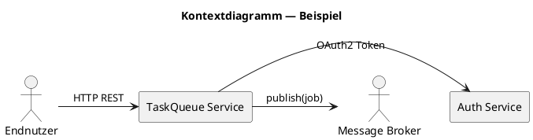
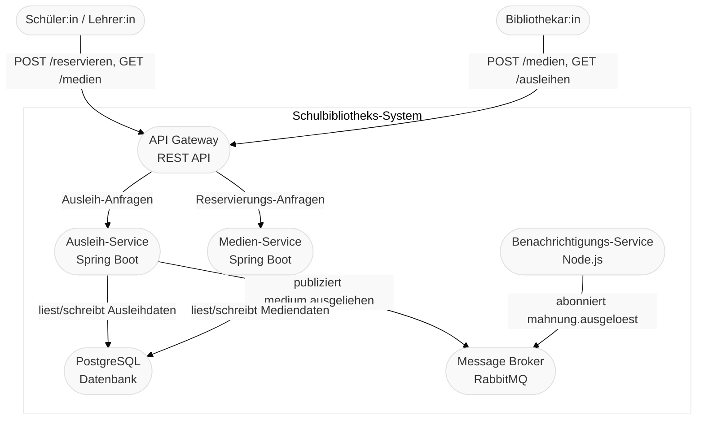
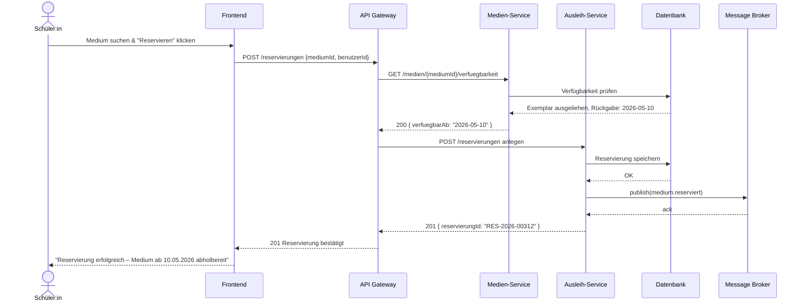
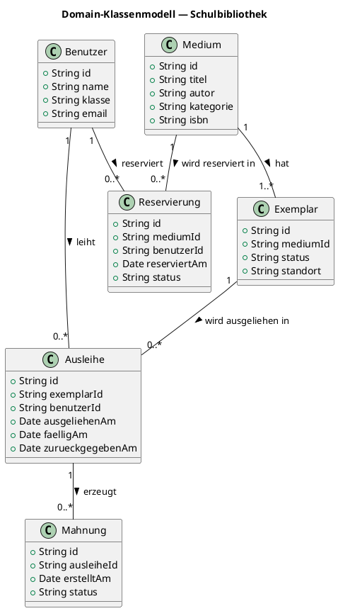

<h1>SYP - Ausgeählte Kapitel: <code>Systemdokumentation</code></h1>


<div style="width: 100%;">
    <div style="margin-left:1cm; margin-right:1.5cm; text-align: center;">
    <h2>Version History</h2>
    <table style="border: solid 1px; width: 100%;">
    <tr>
    <th style="text-align:left">Version</th>
    <th>Änderungen</th>
    <th style="text-align:right">Autor</th>
    </tr>
    <tr>
    <td style="text-align:left">1.0</td>
    <td style="text-align:left">Bestehenden Abschnitt in ein Skriptum überführt, Inhaltsverzeichnis ergänzt und Dokumentkopf formatiert</td>
    <td style="text-align:right">KUW</td>
    </tr>
    <tr>
    <td style="text-align:left">1.1</td>
    <td style="text-align:left">Glossar aus dem Dokument abgeleitet, alphabetisch strukturiert und um Fachbegriffe ergänzt</td>
    <td style="text-align:right">KUW</td>
    </tr>
    <tr>
    <td style="text-align:left">1.2</td>
    <td style="text-align:left">Kapitel 1.4 um den Einsatz von KI bei der Erstellung und Qualitätssicherung von Dokumentation ergänzt</td>
    <td style="text-align:right">KUW</td>
    </tr>
    <tr>
    <td style="text-align:left">1.3</td>
    <td style="text-align:left">Kapitel 1.13 Visualisierungen & Diagramme als 1.4.5 in die Toolchain-Sektion verschoben; Folgekapitel 1.14–1.17 entsprechend umnummeriert</td>
    <td style="text-align:right">KUW</td>
    </tr>
    <tr>
    <td style="text-align:left">1.4</td>
    <td style="text-align:left">Kapitel 1.4.6 „Grenzen des Ansatzes" ergänzt: Eignung des Docs-as-Code-Ansatzes nach Dokumentationsart, Begründung für Nicht-Eignung bei Compliance- und Management-Dokumentation; Einleitung von Kapitel 1.4 um Anwendungsbereich-Hinweis erweitert</td>
    <td style="text-align:right">KUW</td>
    </tr>
    </table>
</div>

<div style="page-break-after: always"></div>

## Inhaltsverzeichnis

- [1.1 Einleitung](#sec-31)
- [1.2 Dokumentationsarten & Zielgruppen](#sec-32)
- [1.3 Strukturstandards & Vorlagen](#sec-33)
- [1.4 Docs‑as‑Code & Toolchain](#sec-34)
  - [1.4.5 Visualisierungen & Diagramme](#sec-313)
  - [1.4.6 Grenzen des Ansatzes — Nicht geeignete Dokumentationsarten](#sec-346)
- [3.5 Architektur‑ und Komponenten‑Dokumentation](#sec-35)
- [1.6 API‑ und Integrationsdokumentation](#sec-36)
- [3.7 Installation, Deployment & Betrieb](#sec-37)
- [1.8 Betriebshandbuch / Runbooks](#sec-38)
- [3.9 Test‑ und Qualitätsdokumentation](#sec-39)
- [1.10 Sicherheit, Datenschutz & Compliance](#sec-310)
- [1.11 Änderungsmanagement, Changelog & Release Notes](#sec-311)
- [1.13 Automatisierung & Qualitätssicherung der Dokumentation](#sec-314)
- [1.14 Governance, Review & Ownership](#sec-315)
- [1.15 Anhang: Templates, Checklisten & Beispiele](#sec-316)
- [1.16 Glossar & Abkürzungen](#sec-317)
- [1.17 Anhang & Referenzen](#sec-318)

<div style="page-break-after: always;"></div>

<a id="sec-31"></a>

## 1.1 Einleitung

Die Dokumentation von Softwaresystemen ist weit mehr als nur eine Ansammlung von Texten; sie ist das Gedächtnis eines Projekts. Ihr Hauptzweck besteht darin, das _Verständnis_, die _Wartbarkeit_ und die _Benutzbarkeit_ einer Software über ihren gesamten Lebenszyklus hinweg sicherzustellen. Ohne sie wären Systeme Blackboxes, deren Weiterentwicklung oder Fehlerbehebung extrem erschwert würde.

**Ziele der Dokumentation:**
*   **Wissensmanagement:** Erhaltung und Weitergabe von Projektwissen, auch bei Personalwechsel.
*   **Qualitätssicherung:** Sicherstellung der Einhaltung von Standards und Anforderungen.
*   **Nachvollziehbarkeit:** Begründung von Entscheidungen und Entwürfen für spätere Anpassungen.
*   **Effizienz:** Reduzierung von Einarbeitungszeiten und Fehlerquellen.
*   **Compliance:** Erfüllung rechtlicher und regulatorischer Anforderungen.

> <span style="font-size: 1.5em">:bulb:</span> **Merksatz:** Gute Dokumentation ist keine Last, sondern eine Investition in die Zukunft des Softwareprodukts. Sie fördert Teamarbeit, reduziert Risiken und spart langfristig Kosten.

### 1.1.1 Abgrenzung des Inhaltsumfangs und Definition zentraler Begriffe und Abkürzungen.

Bevor man in die Details der Dokumentation eintaucht, ist es entscheidend, den **Geltungsbereich** klar festzulegen. Dies vermeidet Missverständnisse und stellt sicher, dass alle Beteiligten ein gemeinsames Verständnis über das zu dokumentierende System haben.

**Bestandteile des Geltungsbereichs:**
*   **Systemabgrenzung:** Welche Teile der Software werden dokumentiert? Wo liegen die Schnittstellen zu externen Systemen?
*   **Zielsetzung:** Was soll mit dieser Dokumentation erreicht werden (z. B. Einarbeitung neuer Entwickler, Schulung von Endanwendern)?
*   **Nicht‑Geltungsbereich:** Was wird bewusst *nicht* dokumentiert oder ist außerhalb des Fokus?

Ebenso wichtig ist ein klares **Begriffsmanagement**. In der Softwareentwicklung wimmelt es von Fachbegriffen, Abkürzungen und Jargon. Ein Glossar stellt sicher, dass jeder Leser die gleiche Bedeutung hinter den verwendeten Begriffen versteht.

> <span style="font-size: 1.5em">:mag:</span> **Vertiefung:** Ein zentrales Glossar kann über verschiedene Dokumente hinweg wiederverwendet werden, um Konsistenz zu gewährleisten. Tools wie `Markdown`, `Typst` oder `AsciiDoc` unterstützen oft Referenzen auf solche Glossare.

<a id="sec-32"></a>

## 1.2 Dokumentationsarten & Zielgruppen

### 1.2.1 Technische Dokumenation

Die *Technische Dokumentation* richtet sich primär an Entwickler, Architekten und Wartungsteams. Sie bildet die Grundlage für die Weiterentwicklung und Pflege eines Softwaresystems. Ihre Inhalte sind oft sehr detailliert und nah am Code.

**Wichtige Bestandteile:**
*   **Architekturdokumentation:** Beschreibt die Gesamtstruktur des Systems, die verwendeten Technologien und die wichtigsten Entwurfsentscheidungen (z. B. mit **`arc42`**).
*   **Modul‑/Komponentenbeschreibungen:** Detaillierte Erläuterungen einzelner Softwarebausteine, deren Funktionen, Abhängigkeiten und Schnittstellen.
*   **API‑Dokumentation:** Präzise Beschreibungen von Programmierschnittstellen (APIs), Datenmodellen, Parametern und Rückgabewerten (oft generiert aus dem Code, z. B. mit **`OpenAPI/Swagger`**).
*   **Code‑Kommentare:** Erklärungen direkt im Quellcode, die die Funktionsweise komplexer Algorithmen, ungewöhnliche Implementierungen oder wichtige Kontextinformationen festhalten.
*   **Datenbank‑Schema:** Beschreibung der Datenbankstruktur, Tabellen, Beziehungen und Indizes.

> <span style="font-size: 1.5em">:warning:</span> **Achtung:** Technische Dokumentation veraltet schnell, wenn sie nicht gepflegt wird. Der "**`Docs‑as‑Code`**"‑Ansatz hilft, sie aktuell zu halten.

### 1.2.2 Anwendungsdokumentation

Die *Anwenderdokumentation* ist für die Endnutzer des Softwaresystems konzipiert. Ihr Ziel ist es, Anwender dabei zu unterstützen, die Software effektiv und effizient zu nutzen. Der Fokus liegt auf Verständlichkeit, Benutzerfreundlichkeit und dem Lösen konkreter Aufgaben.

**Typische Inhalte:**
*   **Benutzerhandbuch:** Eine umfassende Referenz aller Funktionen, oft nach Themen oder Modulen gegliedert.
*   **Schnellstartanleitung (Quick Start Guide):** Eine kompakte Anleitung, die die ersten Schritte zur Inbetriebnahme und grundlegenden Nutzung des Systems beschreibt.
*   **Tutorials:** Schritt‑für‑Schritt‑Anleitungen für spezifische Anwendungsfälle, die den Nutzer durch typische Arbeitsabläufe führen.
*   **FAQs (Frequently Asked Questions):** Eine Sammlung häufig gestellter Fragen und deren Antworten, um schnelle Hilfe bei gängigen Problemen zu bieten.
*   **Glossar:** Einfache Erklärungen von Fachbegriffen, die im Kontext der Anwendung wichtig sind.

> <span style="font-size: 1.5em">:bulb:</span> **Praxistipp:** Anwenderdokumentation sollte aus Sicht des Nutzers geschrieben werden und dessen Sprache sprechen. Visualisierungen wie Screenshots oder Videos sind hier besonders hilfreich.

### 1.2.3 Betriebsdokumentation

Die *Betriebsdokumentation* ist für das IT‑Betriebsteam, Systemadministratoren und DevOps‑Ingenieure gedacht. Ihr primäres Ziel ist es, den reibungslosen, stabilen und effizienten Betrieb sowie die Wartung des Softwaresystems zu ermöglichen. Sie ist **weder rein technische Entwicklungsinformation noch Anwenderhilfe**, sondern konzentriert sich auf die **operationellen Aspekte**.

**Wesentliche Elemente:**
*   **Runbooks:** Detaillierte Anleitungen für wiederkehrende Betriebsabläufe, z. B. Starten/Stoppen von Diensten, Log‑Rotation, Datenbankwartung.
*   **Deployment‑Anleitungen:** Schritte zur Installation, Konfiguration und zum Ausrollen neuer Versionen der Software auf verschiedenen Umgebungen (Test, Staging, Produktion).
*   **Monitoring‑ & Alerting‑Guides:** Beschreibung der Überwachungswerkzeuge, relevanter Metriken, Dashboards und Schwellenwerte für Alarme.
*   **Troubleshooting‑Anleitungen:** Schritt‑für‑Schritt‑Lösungen für bekannte Probleme und häufig auftretende Fehlerbilder.
*   **Backup‑ & Recovery‑Konzepte:** Erläuterungen zur Backup‑Strategie, Wiederherstellungsprozeduren und Disaster‑Recovery‑Pläne.

> <span style="font-size: 1.5em">:warning:</span> **Achtung:** Fehlerhafte oder veraltete Betriebsdokumentation kann zu Ausfallzeiten und kritischen Systemstörungen führen. Sie muss stets aktuell gehalten und regelmäßig getestet werden.


### 1.2.4 Management- und Comliance-Dokumenation

Die *Management‑ und Compliance‑Dokumentation* richtet sich an Projektmanager, Stakeholder, Auditoren, Rechtsabteilungen und gegebenenfalls Aufsichtsbehörden. Sie ist **eine eigenständige Dokumentationsart**, die vertragliche, rechtliche, organisatorische und qualitätssichernde Aspekte des Softwaresystems und des Entwicklungsprozesses beleuchtet.

**Beispiele hierfür sind:**
*   **Service Level Agreements (SLAs):** Vereinbarungen über Leistungszusagen, Verfügbarkeit und Support‑Leistungen.
*   **Datenschutzkonzepte:** Beschreibung, wie personenbezogene Daten im System verarbeitet, geschützt und die gesetzlichen Vorgaben (z. B. **DSGVO**) eingehalten werden.
*   **Sicherheitskonzepte:** Darstellung der implementierten Sicherheitsmaßnahmen, Bedrohungsanalysen und Penetrationstests.
*   **Qualitätsmanagement‑Handbücher:** Dokumentation der Prozesse und Standards zur Qualitätssicherung im Softwareentwicklungsprozess.
*   **Risikomanagement‑Pläne:** Identifikation, Bewertung und Maßnahmenplanung für potenzielle Projektrisiken.
*   **Audit‑ und Revisionsunterlagen:** Nachweise über die Einhaltung interner und externer Vorgaben.

> <span style="font-size: 1.5em">:mag:</span> **Vertiefung:** Diese Dokumente sind oft kritisch für die Rechtskonformität und die externe Kommunikation eines Projekts und erfordern hohe Sorgfalt bei der Erstellung und Pflege.

<a id="sec-33"></a>

## 1.3 Strukturstandards & Vorlagen

### 1.3.1 `arc42` (Architekturtemplate)

Das **`arc42`**‑Template ist ein etabliertes, pragmatisches Gerüst zur Dokumentation von Softwarearchitektur. Es eignet sich besonders für technische Zielgruppen (Architekt:innen, Entwickler:innen, Betrieb) und verfolgt das Ziel, Architekturentscheidungen, Struktur und Qualitätsanforderungen klar, versionierbar und wartbar abzulegen. arc42 lässt sich gut in einen**` Docs‑as‑Code`**‑Workflow integrieren (Markdown/Typst/AsciiDoc + PlantUML/Mermaid).

**Zweck**:
- Bereitstellung einer standardisierten, wiederverwendbaren Vorlage für Architekturdokumentation.
- Ermöglichen schneller Einarbeitung, Nachvollziehbarkeit und Entscheidungsdokumentation.

**Kurzüberblick** der zentralen Abschnitte (mit Erklärung):
- **Einleitung & Ziele:** Kontext, Zweck, Stakeholder, Nicht‑Ziele.
- **Randbedingungen:** Technische, organisatorische und rechtliche Einschränkungen.
- **Kontext & Systemgrenzen:** Kontextdiagramm, externe Systeme, Schnittstellen.
- **Lösungsstrategie:** Architekturmuster, verwendete Technologien und Designprinzipien.
- **Bausteinsicht (Building Block View):** Statische Struktur, Module/Packages, Schnittstellen und Verantwortlichkeiten.
- **Laufzeitsicht (Runtime View):** Dynamische Abläufe, Sequenz‑ oder Aktivitätsdiagramme typischer Use‑Cases.
- **Verteilungssicht (Deployment View):** Infrastruktur, Knoten, Container, Netzwerktopologie.
- **Querschnittliche Konzepte:** Authentifizierung, Fehlerbehandlung, Konfiguration, Monitoring, Datenhaltung.
- **Qualitätsanforderungen & Szenarien:** Beschreibbare Qualitätsziele mit Messgrößen (Performance, Verfügbarkeit, Sicherheit u. a.).
- **Architekturentscheidungen (ADRs):** Referenzen auf konkrete Entscheidungen, Status und Begründung.
- **Risiken & technische Schulden:** Bekannte Risiken, Auswirkung und Gegenmaßnahmen.
- **Glossar & Anhänge:** Begriffsdefinitionen, weiterführende Links und Artefakte.

Minimalvorlage (Markdown‑Skelett zum Kopieren):

```markdown
# 1 arc42 (Architekturtemplate)

## 1.1 Einleitung & Ziele
- Kurzbeschreibung des Systems
- Zielgruppen, Nicht‑Ziele

## 1.2 Randbedingungen
- Infrastruktur, Compliance, Lizenzanforderungen

## 1.3 Kontext & Kontextdiagramm
- Externe Systeme, Datenflüsse (Diagramm als PlantUML/Mermaid)

## 1.4 Lösungsstrategie
- Gewählte Muster, Frameworks, Abgrenzung zu Alternativen

## 1.5 Bausteinsicht (statisch)
- Komponenten, Verantwortlichkeiten, öffentliche APIs

## 1.6 Laufzeitsicht (dynamisch)
- Wichtige Abläufe, Sequenzdiagramme, Fehlerpfade

## 1.7 Verteilungssicht (deployment)
- Knoten, Container, Cloud‑Services, Storage

## 1.8 Querschnittliche Konzepte
- Auth, Logging, Monitoring, Backup, Migration

## 1.9 Qualitätsanforderungen
- Szenarien, Metriken, Akzeptanzkriterien

## 1.10 Architekturentscheidungen (ADRs)
- Link auf `/docs/adr/` oder `docs/adr/NN‑Titel.md`

## 1.11 Risiken & technical debt
- Priorisierte Liste mit Gegenmaßnahmen

## 1.12 Glossar & Referenzen
- Wichtige Begriffe, Links zu Tools/Standards
```

**Kleines Beispiel (Kurz‑Summary für ein fiktives System "TaskQueue Service"):**

- **Einleitung:** TaskQueue verwaltet asynchrone Jobs; Ziel: hohe Durchsatzfähigkeit und einfache Skalierung.
- **Bausteinsicht:** API‑Gateway, Scheduler, Worker, Message‑Broker, Persistenz (DB).
- **Laufzeit:** Job einreichen → Queue/Topic → Worker abholen → Verarbeitung → Ergebnis persistieren/ack.
- **Verteilung:** API und DB in separaten K8s‑Deployments; Broker (RabbitMQ) als managed Service.
- **Qualität:** Ziel‑Durchsatz: 500 Jobs/s; RTO < 5min; Verfügbarkeit 99.9%.

> <span style="font-size: 1.5em">:mag:</span>**Best Practices & Tooling**:
> - Halten Sie arc42 als "living document" neben dem Code (z. B. `docs/architecture/arc42.md`).
> - Verwenden Sie PlantUML oder Mermaid für diagramme‑as‑code; committen Sie die Quelldateien und rendern Sie Bilder in CI.


**Wartung & Verantwortlichkeiten:**
- Dokumenten‑Owner (Maintainer) angeben und Review‑Intervalle (z. B. quartalsweise) definieren.
- Änderungs‑Triggers: größere Architekturänderungen, Release‑Planungen, Security‑Patches.

---

**Weiterführende Ressourcen:**
- arc42 Hauptseite und Template ([arc42.org](https://arc42.org/))
- PlantUML / Mermaid für Diagramme‑as‑Code
- Beispiele: public arc42‑Repos auf GitHub

### 1.3.2 README & Projektüberblick

Die `README.md`‑Datei ist oft das Erste, was Entwickler (und manchmal auch Anwender) sehen, wenn sie ein Softwareprojekt erkunden. Sie dient als **Aushängeschild und primärer Einstiegspunkt** in das Projekt und sollte schnell die wichtigsten Fragen beantworten.

**Wichtige Inhalte einer guten README.md:**
*   **Projektname und kurze Beschreibung:** Was ist das Projekt, und welchen Zweck erfüllt es?
*   **Status des Projekts:** Ist es in Entwicklung, stabil, archiviert?
*   **Features/Funktionalitäten:** Eine kurze Liste der Kernfunktionen.
*   **Installation und Schnellstart:** Klare, schrittweise Anweisungen, wie man das Projekt aufsetzt und startet (oft mit Kommandozeilenbefehlen).
*   **Voraussetzungen:** Welche Software oder Bibliotheken sind erforderlich?
*   **Nutzung/Beispiele:** Kurze Code‑Beispiele oder Anweisungen zur grundlegenden Nutzung.
*   **Beitragen (Contributing):** Wie kann man zum Projekt beitragen (Links zu `CONTRIBUTING.md`)?
*   **Lizenz:** Unter welcher Lizenz steht das Projekt?
*   **Kontakt/Support:** Ansprechpartner oder Wege zum Support.

> <span style="font-size: 1.5em">:bulb:</span> **Praxistipp:** Halten Sie die README prägnant und aktuell. Nutzen Sie Markdown für gute Lesbarkeit und binden Sie bei Bedarf Badges (z. B. Build‑Status) ein, um den Projektstatus schnell sichtbar zu machen.

### 1.3.3 Architecture Decision Records (`ADR`)

*Architecture Decision Records (`ADRs`)* sind kurze Textdokumente, die eine einzelne, wichtige Architekturentscheidung im Projekt festhalten. Sie dienen dazu, die **Begründung für Entscheidungen**, die **alternativen Optionen** und die **Konsequenzen** einer Wahl transparent zu machen. Dies ist entscheidend für die Nachvollziehbarkeit und das kollektive Gedächtnis eines Teams.

**Struktur eines typischen ADRs:**
*   **Titel:** Kurze, prägnante Zusammenfassung der Entscheidung.
*   **Status:** Z. B. `Proposed`, `Accepted`, `Deprecated`, `Superseded`.
*   **Datum:** Wann wurde die Entscheidung getroffen?
*   **Kontext:** Welches Problem soll gelöst werden, oder welche Situation führt zu dieser Entscheidung?
*   **Entscheidung:** Die getroffene Architekturentscheidung.
*   **Alternativen:** Welche anderen Optionen wurden in Betracht gezogen, und warum wurden sie verworfen?
*   **Konsequenzen:** Positive und negative Auswirkungen der Entscheidung auf das System und das Projekt.

ADRs werden oft als kleine Markdown‑Dateien direkt im Code‑Repository abgelegt (Docs‑as‑Code‑Prinzip), was ihre Auffindbarkeit und Versionierung erleichtert.

> <span style="font-size: 1.5em">:bulb:</span> **Warum ADRs wichtig sind:** Sie helfen, den Wissensverlust bei Teamwechseln zu minimieren, Diskussionen über bereits getroffene Entscheidungen zu vermeiden und eine konsistente Architekturentwicklung zu fördern.

#### Best Practices für ADRs

Um den maximalen Nutzen aus ADRs zu ziehen, sollten folgende Prinzipien beachtet werden:

1.  **Im Repository speichern:** ADRs gehören in die Versionsverwaltung (Git), direkt neben dem Code. So sind sie Teil des Review‑Prozesses und die Historie bleibt erhalten.
2.  **Markdown verwenden:** Ein einfaches Textformat sorgt dafür, dass die Dokumente leicht lesbar, versionierbar und unabhängig von speziellen Tools sind.
3.  **Unveränderlichkeit (Immutability):** Ein einmal akzeptiertes ADR wird nicht mehr inhaltlich geändert. Wenn sich die Architektur ändert, wird ein neues ADR erstellt, das das alte ersetzt (Status: `Superseded`).
4.  **Kurz und prägnant:** Ein ADR sollte keine wissenschaftliche Arbeit sein – Fokus auf Kontext, die eigentliche Entscheidung und die daraus resultierenden Konsequenzen.
5.  **Nummerierung:** Verwenden Sie ein fortlaufendes Format wie `0001-wahl-der-datenbank.md`. Führende Nullen sorgen für korrekte chronologische Sortierung auch nach der 10er‑ oder 100er‑Marke.

#### Standard‑Template (nach Michael Nygard)

Das folgende Template hat sich als Industriestandard etabliert. Es kann als `template.md` im Projekt hinterlegt werden:

```markdown
# [Nummer]: [Titel der Entscheidung]

* **Status:** [Proposed | Accepted | Deprecated | Superseded by ADR-0005]
* **Datum:** [JJJJ-MM-TT]
* **Beteiligte:** [Namen der Entscheider]

## Kontext (Context)
Was ist das Problem, das wir lösen wollen? Welche technischen, wirtschaftlichen oder
sozialen Faktoren beeinflussen diese Entscheidung?

## Entscheidung (Decision)
Welche Lösung haben wir gewählt? Beschreibe die gewählte Option klar und präzise.

## Begründung (Rationale)
Warum haben wir uns für diese Option entschieden? Welche Alternativen wurden geprüft
und warum wurden sie abgelehnt? (z. B. Kosten, Performance, Team-Expertise)

## Konsequenzen (Consequences)
Was passiert nach dieser Entscheidung?
* **Positiv:** Was gewinnen wir? (z. B. schnellere Entwicklungszeit)
* **Negativ:** Welche Kompromisse gehen wir ein? (z. B. höhere Betriebskosten, technische Schulden)
* **Risiken:** Worauf müssen wir in Zukunft achten?
```

#### Beispiel: Einführung einer Event‑Driven Architecture

**`0005-event-driven-with-kafka.md`**

```markdown
# 0005: Verwendung von Apache Kafka für Microservice‑Kommunikation

* **Status:** Accepted
* **Datum:** 2024-05-20
* **Beteiligte:** [Architektur-Team]

## Kontext
Unsere monolithische Anwendung wird in Microservices zerlegt. Die aktuelle synchrone
Kommunikation via REST führt zu starker Kopplung und Performance‑Problemen bei hoher
Last. Wir benötigen eine asynchrone Lösung.

## Entscheidung
Wir führen Apache Kafka als zentralen Message‑Broker für die Inter‑Service‑Kommunikation ein.

## Begründung
Kafka bietet hohe Durchsatzraten und Persistenz von Nachrichten, was für unsere
Skalierungsziele (10x User‑Wachstum) notwendig ist. RabbitMQ wurde evaluiert, aber
aufgrund der geringeren Performance bei großen Datenmengen abgelehnt.

## Konsequenzen
* **Positiv:** Entkopplung der Services, verbesserte Fehlertoleranz.
* **Negativ:** Erhöhte Komplexität in der Infrastruktur und im Deployment. Das Team
  benötigt Schulungen im Umgang mit Event‑Sourcing‑Patterns.
```

#### Ablagestruktur im Repository

ADRs leben direkt im Repository, idealerweise unter `docs/adr/`. Bei einem **Monorepo** mit modularem Backend (mehrere Bounded Contexts) und mehreren Frontends empfiehlt sich ein **hybrider Ansatz**, der zwischen globalen und komponentenspezifischen Entscheidungen unterscheidet:

```plaintext
mein-monorepo/
├── docs/adr/                       # 1. GLOBALE ADRs (betreffen alle Teams)
│   ├── 0001-monorepo-strategy.md
│   ├── 0002-auth-provider-keycloak.md
│   └── 0003-cicd-pipeline-structure.md
├── backend/
│   ├── ausleih-kontext/
│   │   └── docs/adr/               # 2. KONTEXT-SPEZIFISCHE ADRs
│   │       └── 0001-domain-model-logic.md
│   ├── user-kontext/
│   └── beschaffungs-kontext/
├── frontends/
│   ├── admin-frontend/
│   │   └── docs/adr/               # 3. FRONTEND-SPEZIFISCHE ADRs
│   │       └── 0001-use-tailwind-css.md
│   └── user-frontend/
│       └── docs/adr/
│           └── 0001-use-nextjs-app-router.md
├── README.md
└── docker-compose.yml
```

**Die drei Ebenen der Entscheidung:**

| Ebene | Ort | Beispiele |
| :--- | :--- | :--- |
| **Global** | `/docs/adr/` | Programmiersprachen, Deployment-Strategie, Auth-Verfahren, API-Stil |
| **Kontext‑spezifisch** | `/backend/[kontext]/docs/adr/` | Datenbankschema, kontextinterne Bibliotheken, Business‑Logik‑Muster |
| **Frontend‑spezifisch** | `/frontends/[app]/docs/adr/` | State‑Management‑Lösung, UI‑Framework, Chart‑Bibliothek |

> <span style="font-size: 1.5em">:mag:</span> **Vertiefung – Die „Aufwärts‑Verschiebung":** Wenn dieselbe Entscheidung in mehreren Modulen oder Frontends unabhängig voneinander getroffen wird (z. B. „Wir nutzen alle Playwright für E2E‑Tests"), sollte das ADR in den globalen Ordner verschoben werden. So wird Wildwuchs vermieden und Wissen geteilt.

#### Nützliche Tools

*   **[adr‑tools](https://github.com/npryce/adr-tools):** Klassisches Shell‑basiertes CLI zum Erstellen und Verwalten von ADRs.
*   **[Log4brains](https://github.com/thomvaill/log4brains):** Modernes Tool, das ADRs in einer interaktiven Web‑Oberfläche visualisiert, aber weiterhin Markdown im Repository nutzt.
*   **[adr‑viewer](https://github.com/mrwilson/adr-viewer):** Generiert eine statische HTML‑Seite aus Markdown‑Dateien zur besseren Übersicht für Stakeholder.

### 1.3.4 Dokumentation von Schnittstellen 

Für die Dokumentation von APIs und Integrationsschnittstellen sind **standardisierte Templates und Spezifikationen** unerlässlich. Sie gewährleisten Konsistenz, ermöglichen die automatisierte Generierung von Dokumentation und erleichtern die Interoperabilität zwischen Systemen.

#### **`OpenAPI` (ehemals Swagger):**

*   `OpenAPI Specification` ist ein weit verbreiteter, sprachunabhängiger Standard zur Beschreibung von RESTful APIs. Die Spezifikation ist in einem maschinenlesbaren Format (YAML oder JSON) verfasst.
*   **Vorteile:**
    *   **Automatisierte Dokumentation:** Tools wie Swagger UI können aus einer OpenAPI‑Spezifikation interaktive API‑Dokumentationen generieren.
    *   **Code‑Generierung:** Es können Client‑Bibliotheken, Server‑Stubs oder Server-Mocks (z.B. mit `Prism`) automatisch aus der Spezifikation erstellt werden.
    *   **Testen:** Ermöglicht die Validierung von API‑Aufrufen gegen die definierte Spezifikation.
    *   **Design First:** Fördert einen "**`Design First`**"‑Ansatz, bei dem die API zuerst spezifiziert und dann implementiert wird.

Beispiel aus dem Schulbibliothekskontext:

```yaml
paths:
    /ausleihen:
        post:
            summary: Medium an eine Schuelerin oder einen Schueler ausleihen
            requestBody:
                required: true
                content:
                    application/json:
                        schema:
                            type: object
                            properties:
                                mediumId:
                                    type: string
                                    example: "BUCH-1024"
                                benutzerId:
                                    type: string
                                    example: "S-5AHIT-17"
                                rueckgabeBis:
                                    type: string
                                    format: date
                                    example: "2026-05-10"
                            required: [mediumId, benutzerId, rueckgabeBis]
            responses:
                '201':
                    description: Ausleihe erfolgreich angelegt
                '409':
                    description: Medium ist bereits ausgeliehen
```

#### **`AsyncAPI` für Event-Driven Architecture (EDA):**

*   `AsyncAPI` ist das Pendant zu OpenAPI für **asynchrone, ereignisbasierte Schnittstellen**. Der Standard eignet sich für Protokolle und Broker wie `Kafka`, `RabbitMQ`, `MQTT` oder `WebSockets`.
*   Die Spezifikation wird in YAML oder JSON beschrieben. Im Mittelpunkt stehen dabei **nicht Endpunkte**, sondern **Channels**, **Operations** (`send` / `receive`) und **Messages**.
*   **Wichtige Komponenten:**
        *   **Servers:** Definition der Broker-Verbindungen und Umgebungen, z. B. Kafka-Cluster oder MQTT-Broker.
        *   **Channels:** Logische oder physische Adressen wie Topics, Queues oder Streams.
        *   **Operations:** Beschreibung, wer auf einen Channel schreibt oder von ihm liest.
        *   **Messages:** Exakte Definition der Event-Payloads und Header, häufig mit `JSON Schema`, `Avro` oder `Protobuf`.

Beispiel aus dem Schulbibliothekskontext:

```yaml
asyncapi: 3.0.0
info:
    title: Schulbibliothek Events
    version: 1.0.0
channels:
    medium.ausgeliehen:
        address: medium.ausgeliehen
        messages:
            MediumAusgeliehen:
                payload:
                    type: object
                    properties:
                        ausleihId:
                            type: string
                            example: "AUS-2026-00045"
                        mediumId:
                            type: string
                            example: "BUCH-1024"
                        benutzerId:
                            type: string
                            example: "S-5AHIT-17"
                        ausgeliehenAm:
                            type: string
                            format: date-time
                            example: "2026-04-26T08:15:00Z"
                    required: [ausleihId, mediumId, benutzerId, ausgeliehenAm]
operations:
    mediumAusgeliehenPublish:
        action: send
        channel:
            $ref: '#/channels/medium.ausgeliehen'
```

#### **`GraphQL`: Self-Documenting durch Schema und Introspektion**

*   GraphQL ist durch sein Typsystem und die eingebaute **Introspektion** teilweise selbst-dokumentierend. Das eigentliche Herzstück ist das Schema in der `Schema Definition Language (SDL)`.
*   In der Datei `schema.graphql` werden Typen, Queries, Mutations und Subscriptions beschrieben. Werkzeuge wie `GraphiQL`, `Apollo Studio` oder `GraphQL Playground` lesen diese Informationen aus und stellen sie interaktiv dar.

Beispiel für dokumentierte GraphQL-Typen:

```graphql
"""
Repräsentiert einen Benutzer im System.
"""
type User {
    id: ID!
    "Die primäre E-Mail-Adresse für Benachrichtigungen."
    email: String!
}
```

#### **Andere wichtige Aspekte:**

*   **Integrations‑Templates:** Vorlagen für häufige Integrationsmuster (z. B. Event‑basiert, Request/Response), welche die Kommunikation und Datenformate standardisieren.
*   **Beispiel‑Payloads:** Konkrete Beispiele für Anfragen und Antworten, die Entwicklern helfen, die API schnell zu verstehen und zu nutzen.
*   **Fehlerbehandlung:** Klare Definitionen von Fehlercodes, Fehlermeldungen und deren Ursachen.

#### **Projektübergreifende Best Practices:**

*   **Docs-as-Code:** Spezifikationen wie `openapi.yaml`, `asyncapi.yaml` oder `schema.graphql` gehören direkt ins Git-Repository und werden im Pull-Request-Prozess mitreviewt.
*   **CI/CD-Validierung:** Linting und Validierung der Spezifikationen sollten automatisiert erfolgen, z. B. mit `Spectral`, GraphQL-Schema-Checks oder AsyncAPI-Validatoren.
*   **Zentrales Developer Portal:** In verteilten Systemlandschaften sollten REST-, Event- und GraphQL-Schnittstellen in einem gemeinsamen Developer Portal katalogisiert werden, z. B. mit `Backstage`, `Redocly` oder `Bump.sh`.
*   **Unified API Map:** In hybriden Architekturen ist es hilfreich, die Beziehung zwischen synchronen und asynchronen Flüssen sichtbar zu machen, etwa wenn eine GraphQL-Mutation im Frontend ein Kafka-Event im Backend auslöst.

> <span style="font-size: 1.5em">:bulb:</span> **Merksatz:** Für klassische REST-Schnittstellen ist `OpenAPI` der De-facto-Standard, für ereignisbasierte Systeme `AsyncAPI` und für schemazentrierte Abfrage-APIs liefert `GraphQL` die Dokumentation weitgehend aus dem Typmodell selbst.

***
Quellen
- [OpenAPI] (https://swagger.io/specification/)
- [AsyncAPI](https://www.asyncapi.com/)
- [GraphQL](https://graphql.org/learn/)
***

<a id="sec-34"></a>

## 1.4 Docs‑as‑Code & Toolchain

Der `Docs‑as‑Code`‑Ansatz behandelt die Dokumentation auf die gleiche Weise wie den Quellcode selbst. Das bedeutet, Dokumente werden in einfachen Textformaten (z. B. Markdown, AsciiDoc, Typst) erstellt, in Versionskontrollsystemen (wie Git) verwaltet, mit den gleichen Tools (IDEs wie VS Code) bearbeitet und über automatisierte Pipelines (CI/CD) veröffentlicht.

**Vorteile des Docs‑as‑Code‑Ansatzes:**
*   **Versionierung und Historie:** Jede Änderung an der Dokumentation ist nachvollziehbar, und alte Versionen können leicht wiederhergestellt werden.
*   **Kollaboration:** Mehrere Autoren können gleichzeitig an der Dokumentation arbeiten, Konflikte werden wie bei Quellcode über Merge‑Requests gelöst.
*   **Automatisierung:** Dokumentation kann automatisch auf Syntaxfehler (Linting), Rechtschreibung (Spellcheck) und Vollständigkeit geprüft sowie in verschiedene Ausgabeformate (HTML, PDF) konvertiert werden.
*   **Nähe zum Code:** Dokumentation liegt oft direkt neben dem Code, den sie beschreibt, was die Wahrscheinlichkeit erhöht, dass sie aktuell bleibt.
*   **Transparenz:** Die Dokumentation ist für alle Teammitglieder leicht zugänglich und sichtbar.

> <span style="font-size: 1.5em">:bulb:</span> **Merksatz:** Docs‑as‑Code ist der **De-facto-Standard für technische, architektur- und betriebsnahe Dokumentation** in modernen Software-Teams. Er überwindet viele Nachteile traditioneller Dokumentationsmethoden, indem er die bewährten Praktiken der Softwareentwicklung auf die Dokumentation überträgt.

**Anwendungsbereich:** Der Ansatz eignet sich besonders gut für alle Dokumentationsarten, die eng am Code und am Entwicklungsprozess liegen — also technische Dokumentation, Architekturdokumentation, Betriebsdokumentation sowie API-Spezifikationen. Für **Management-, Compliance- und Legal-Dokumentation** gelten hingegen andere Anforderungen, die am Ende dieses Kapitels (→ 1.4.6) behandelt werden.

### 1.4.1 Verwendung von Markup - Sprachen zur Text - Dokumentation

Im "Docs‑as‑Code"‑Ansatz kommen häufig einfache Markup‑Sprachen zum Einsatz, die eine schnelle und effiziente Texterstellung ermöglichen. Die populärsten sind `Markdown`, `AsciiDoc` und ganz neu dazu gekommen ist `Typst`.

**Markdown:**
*   **Stärken:** Sehr einfache Syntax, weit verbreitet (GitHub, GitLab, Readme‑Dateien), schnell zu erlernen.
*   **Einsatzgebiete:** Einfache Texte, Kurzanleitungen, Blogbeiträge, Issue‑Beschreibungen, READMEs.
*   **Grenzen:** Bei komplexeren Strukturen (Tabellen, Querverweise, modulare Includes, Inhaltsverzeichnisse) stößt Markdown schnell an seine Grenzen oder erfordert proprietäre Erweiterungen.

**AsciiDoc:**
*   **Stärken:** Mächtige Syntax, die über Markdown hinausgeht. Unterstützt native Features für Inhaltsverzeichnisse, modulare Includes (Single Source of Truth), komplexere Tabellen, Querverweise, Syntax‑Highlighting für Code und Diagramm‑Integration (PlantUML, Mermaid).
*   **Einsatzgebiete:** Technische Handbücher, Bücher, umfangreiche Architekturdokumentationen, Lernskripte.
*   **Vorteile im Enterprise‑Umfeld:** Ideal für große, strukturierte Dokumentationsprojekte, bei denen Konsistenz und Automatisierung entscheidend sind.

Hier ist die passgenaue Ergänzung für Typst, basierend auf Ihren Formatvorgaben:

**Typst:**
*   **Stärken:** Moderne, entwicklerfreundliche Alternative zu LaTeX mit einer leichtgewichtigen Syntax, die sich wie eine Mischung aus Markdown und AsciiDoc anfühlt. Es bietet extrem schnelle Kompilierzeiten, exzellenten mathematischen Formelsatz, eine integrierte Literaturverwaltung und ein eng integriertes Skripting-System, mit dem sich Layouts und Dokumentenlogik direkt programmieren lassen. Zudem liefert Typst eine überragende, hochgradig anpassbare PDF-Ausgabe.
*   **Einsatzgebiete:** Wissenschaftliche Publikationen, technische Spezifikationen und alle Dokumente, bei denen komplexe Layouts, mathematischer Formelsatz und ein hochwertiges PDF als finales Endprodukt im Vordergrund stehen. Es lässt sich zudem hervorragend für automatisierte Build-Prozesse (z. B. via GitLab CI) nutzen.
*   **Grenzen:** Die HTML-Ausgabe (z. B. für Microsites oder Web-Wissensdatenbanken) ist noch recht neu und derzeit weniger ausgereift als bei etablierten Tools wie AsciiDoc. Auch bei der nahtlosen Integration von Diagrammen (wie Mermaid oder PlantUML) zieht Typst aktuell den Kürzeren, da hierfür auf externe Plugins wie *Pintorita* zurückgegriffen werden muss.

> <span style="font-size: 1.5em">:mag:</span> **Vertiefung:** Die Wahl des Formats hängt stark vom Umfang und der Komplexität der Dokumentation ab. Für größere Projekte mit vielen strukturellen Anforderungen ist AsciiDoc oder Typst oft die bessere Wahl.

### 1.4.2 Automatisierte Builds, Linting, Spellcheck und Veröffentlichung

Der `Docs‑as‑Code`‑Ansatz ermöglicht es, die Prinzipien von `Continuous Integration / Continuous Deployment (CI/CD)` auch auf die Dokumentation anzuwenden. Dadurch wird die Qualität und Aktualität der Dokumentation signifikant verbessert.

**CI/CD‑Schritte für Dokumentation:**
1.  **Versionierung:** Dokumentationsdateien werden zusammen mit dem Quellcode in einem Versionskontrollsystem (Git) verwaltet.
2.  **Linting und Validierung:** Bei jedem Commit oder Pull Request prüfen automatisierte Tools die Dokumentation auf Syntaxfehler, Rechtschreibfehler, stilistische Konventionen (z. B. mit `markdownlint`, `Vale`) und fehlerhafte Links.
3.  **Generierung:** Aus den Quellformaten (Markdown, AsciiDoc) werden automatisch die gewünschten Ausgabeformate (HTML, PDF, EPUB) generiert. Hierfür kommen Tools wie `MkDocs`, `Docusaurus`, `Antora` oder `AsciiDoctor` zum Einsatz.
4.  **Vorschau (Preview):** Oft wird bei Pull Requests eine temporäre Vorschau der geänderten Dokumentation generiert, die Reviewern die Überprüfung erleichtert.
5.  **Veröffentlichung (Deployment):** Nach erfolgreichem Review und Merge wird die generierte Dokumentation automatisch auf einem Webserver (z. B. GitHub Pages, Netlify) oder einem anderen geeigneten Speicherort veröffentlicht.

> <span style="font-size: 1.5em">:bulb:</span> **Vorteil:** Durch CI/CD wird die Dokumentation zu einem integralen Bestandteil des Entwicklungsprozesses, was ihre Qualität sichert und die Aktualität fördert. Veraltete oder fehlerhafte Dokumentation wird frühzeitig erkannt.

### 1.4.3 Automatische Erzeugung von technischen Artefakten

Im Kontext von `Docs‑as‑Code` ist die **automatisierte Generierung von Dokumentation** und Diagrammen ein Schlüsselelement. Dies stellt sicher, dass die Dokumentation stets aktuell ist und konsistent mit dem Quellcode oder den Systemdefinitionen übereinstimmt.

**Tools zur Dokumentationsgenerierung:**
*   **API‑Dokumentation (z. B. OpenAPI/Swagger):** Aus einer OpenAPI‑Spezifikation können interaktive HTML‑Dokumentationen (mit `Swagger UI` oder `Redoc`), Client‑Bibliotheken oder Server‑Stubs generiert werden.
*   **Code‑Dokumentation (z. B. Doxygen, Javadoc, NDoc, Sphinx):** Kommentare direkt im Quellcode können von speziellen Tools extrahiert und in formatierte Dokumentationen umgewandelt werden. Dies ist besonders nützlich für die API‑Referenz von Bibliotheken und Frameworks.
*   **Datenbank‑Schema‑Dokumentation:** Tools können aus dem Datenbankschema automatisch Diagramme und Beschreibungen der Tabellen und Beziehungen erzeugen.

**Diagramme‑as‑Code:**
Statt Diagramme manuell in Grafikprogrammen zu erstellen, werden sie in einem textbasierten Format definiert und bei Bedarf gerendert. Dies ermöglicht Versionierung und Automatisierung:
*   **PlantUML:** Erlaubt die Beschreibung von UML‑Diagrammen (Klassen, Sequenz, Zustandsdiagramme), Netzwerkdiagrammen (C4‑Modell) und mehr in einem einfachen Textformat. Die Diagramme können dann automatisch in Bilder (SVG, PNG) konvertiert werden (siehe https://plantweb.readthedocs.io/examples.html)
*   **Mermaid:** Eine JavaScript‑basierte Diagrammsprache, die Flowcharts, Sequenzdiagramme, Gantt‑Diagramme und andere direkt aus Markdown‑ähnlichem Text in Webseiten rendern kann (siehe https://mermaid.ai/open-source/syntax/examples.html)
*   **Graphviz:** Ein Open‑Source‑Tool zur Visualisierung von Graphen und Netzwerken, oft genutzt für Abhängigkeitsdiagramme (siehe https://graphviz.org/gallery/)

> <span style="font-size: 1.5em">:bulb:</span> **Vorteil:** Durch die "as‑Code"‑Prinzipien für Dokumentation und Diagramme wird die Pflege vereinfacht und die Konsistenz mit dem System gewährleistet. Änderungen im Code können direkt zu Updates in der Dokumentation führen.

#### Featureübersicht der bekanntesten Vertreter für REST API-Dokumentationen

Vergleichstabelle, inklusive der Zielgruppen-Definition:

| Feature / Kriterium | [Swagger-UI](https://swagger.io/tools/swagger-ui/) | [Redoc](https://github.com/Redocly/redoc) |
| :--- | :--- | :--- |
| **Primärer Fokus** | **Interaktivität & Testing** | **Lesbarkeit & Präsentation** |
| **Zielgruppe** | **Interne Entwickler, QA-Teams & DevOps** | **Externe Partner, Kunden & technische Redakteure** |
| **Layout** | Einspaltig, zum Aufklappen (Akkordeon). | Dreispaltig (Navigation, Doku, Code). |
| **"Try it out" Funktion** | **Ja**: Direkte API-Requests im Browser. | **Nein**: Rein statische Anzeige (Open Source). |
| **Dokumentationstexte** | Fokus auf technische Endpunkte. | Fokus auf Tutorials und lange Guides. |
| **Navigation** | Einfaches Tagging; viel Scrollen nötig. | Mächtige Seitenleiste mit Echtzeit-Suche. |
| **Performance** | Träge bei sehr großen Dateien. | Hochperformant auch bei riesigen Specs. |
| **Optik & Branding** | Funktional und technisch-nüchtern. | Modernes Design ("White-Labeling" bereit). |
| **Code-Beispiele** | Standard-Beispiele in JSON/XML. | Synchronisierte Multi-Language-Snippets. |
| **CI/CD Integration** | **Sehr einfach:** Wird oft automatisch beim Build generiert | einziger Befehl `build-docs` erzeugt standalone-HTML |


#### Featureübersicht der bekanntesten Vertreter von Code-Dokumentations Tools

Hier ist die Vergleichstabelle für [**Doxygen**](https://github.com/doxygen/doxygen) und [**Sphinx**](https://www.sphinx-doc.org/en/master/):

| Feature / Kriterium | Doxygen | Sphinx |
| :--- | :--- | :--- |
| **Primärer Fokus** | **Source-Code-Extraktion** | **Projekt-Dokumentation & Handbücher** |
| **Zielgruppe** | **Library-Entwickler (C++, Java, C#)** | **Python-Entwickler, Technical Writer** |
| **Layout / Design** | Klassisch, funktional ("JavaDoc-Stil"). | Modern, hochgradig anpassbar (Themes). |
| **Input Quelle** | Kommentare direkt im Quellcode. | Handgeschriebene Textdateien + Code. |
| **Bevorzugte Sprache** | C++, C, Java, C#, PHP. | Python (Standard), via Plugins auch andere. |
| **Formatierungssprache** | Doxygen-eigene Syntax oder Markdown. | **reStructuredText (reST)** oder Markdown. |
| **Visualisierung** | Generiert Klassendiagramme (via Graphviz). | Fokus auf Textfluss und Struktur. |
| **Output-Formate** | HTML, LaTeX, PDF, RTF, XML. | HTML, PDF, ePub, Man-Pages. |
| **Stärke** | Perfekt für API-Referenzen aus dem Code. | Perfekt für Tutorials und Manuals. |
| **CI/CD Integration** |Erfordert eine Doxyfile - Konfigurationsdatei im Repo | benötigt Python-Umgebung und `conf.py`|

#### Featureübersicht der bekanntesten Vertreter von ER-Schema Dokumetations Tools

| Feature / Kriterium | [**tbls**] (https://github.com/k1Low/tbls) | **liam** [liam-hq}(https://github.com/liam-hq/liam) |
| :--- | :--- | :--- |
| **Primärer Fokus** | **Automatisierung & "Doc-as-Code"** | **Exploration & Interaktive UI** |
| **Zielgruppe** | DevOps, Backend-Entwickler, CI/CD-Fans | Data Analysts, Devs, Product Owner |
| **Layout** | Statische Markdown-Dateien (Git-Style). | Modernes, durchsuchbares Web-Interface. |
| **Interaktivität** | **Niedrig**: Statische Bilder und Texte. | **Hoch**: Interaktive Diagramme im Browser. |
| **ER-Diagramme** | Generiert Bilder (SVG, PNG) oder Mermaid. | Dynamisch, zoombar und verschiebbar. |
| **CI/CD Integration** | **Exzellent**: Speziell für Git-Pipelines gebaut. | Gut: Fokus auf Hosting eines Portals. |
| **Dokumentationstyp** | Offline-First (Dateien liegen im Repository). | Online-First (Web-Tool zur Daten-Entdeckung). |
| **Output-Formate** | Markdown, JSON, Excel, PlantUML, SVG. | Web-App / Suchportal. |
| **Besonderes Feature** | **Datenbank-Linter**: Checkt auf fehlende Beschreibungen. | **Global Search**: Findet Spalten/Tabellen sofort. |


### 1.4.4 Einsatz von KI bei der Erstellung von Dokumentation

Generative KI kann den `Docs‑as‑Code`‑Ansatz wirksam ergänzen, weil textbasierte Dokumentation für Sprachmodelle gut verarbeitbar ist. Sie unterstützt Teams dabei, schneller erste Entwürfe zu erzeugen, Änderungen aus Code oder Tickets zusammenzufassen und technische Inhalte in einheitlicher Form aufzubereiten. KI ersetzt dabei jedoch **nicht** die fachliche Verantwortung des Teams, sondern dient als **Assistenzsystem** innerhalb eines kontrollierten Workflows.

**Typische Einsatzfelder:**
*   **Entwürfe für Dokumentation:** KI kann aus Quellcode, Commit‑Nachrichten oder Stichworten erste Beschreibungen für README‑Dateien, Architekturüberblicke, Modultexte oder Release Notes erzeugen.
*   **Zusammenfassungen und Wissensextraktion:** Informationen aus Issues, Pull Requests, Chats oder Tickets lassen sich verdichten und in nachvollziehbare Dokumentationsbausteine überführen.
*   **Diagrammcode erzeugen:** Statt Diagramme manuell zu zeichnen, kann KI Vorschläge für `Mermaid`‑ oder `PlantUML`‑Code liefern, etwa für Kontext‑, Sequenz‑ oder Komponentenansichten.
*   **Sprachliche Überarbeitung:** KI hilft beim Vereinheitlichen von Stil, Terminologie und Struktur, besonders wenn mehrere Personen an derselben Dokumentation arbeiten.

**Empfohlener Arbeitsablauf:**

1.  **Kontext bereitstellen:** Das Team gibt der KI klare Eingaben, z. B. Quellcode, Anforderungen, Architekturentscheidungen oder bestehende Dokumentationsabschnitte.

    - **Wichtig:** Für die unterschiedlichen Dokumente sollten Templates mit einer Kurzbeschreibung der erwarteten Inhalte in den einzelnen Kapiteln angelegt werden. Diese Templates geben der KI sowohl die Struktur als auch die Information darüber, welche Inhalte relevant sind.

2.  **Entwurf generieren:** Die KI erstellt einen ersten Text‑ oder Diagrammentwurf in einem strukturierten Format wie `Markdown`, `AsciiDoc`, `Mermaid` oder `PlantUML` (*basierend auf einem vorgegebenen Template*)
3.  **Fachlich prüfen:** Entwickler:innen, Architekt:innen oder Fachverantwortliche kontrollieren Inhalte, Begriffe, Beispiele und Schlussfolgerungen.
4.  **Automatisch validieren:** Linting, Link‑Checks, Build‑Pipelines und gegebenenfalls Tests für Code‑Beispiele prüfen, ob die erzeugte Dokumentation formal korrekt und veröffentlichbar ist.
5.  **Versioniert veröffentlichen:** Erst nach Review und Validierung wird die Änderung über Pull Requests gemergt und über die Toolchain publiziert.

**Qualitätssicherung und Best Practices:**

*   **Human‑in‑the‑Loop:** KI‑Ergebnisse müssen immer von Menschen geprüft werden, insbesondere bei Architektur, Sicherheitsaspekten, Compliance und API‑Verträgen.
*   **Quellcode als Referenz:** Aussagen der KI sollten gegen den tatsächlichen Systemstand abgeglichen werden, damit keine veralteten oder erfundenen Informationen übernommen werden.
*   **Strukturierte Zielformate nutzen:** Für technische Dokumentation sind textbasierte Formate besonders geeignet, weil sie präziser, versionierbar und token‑effizient sind.
*   **CI/CD für Dokumentation nutzen:** Automatisierte Prüfungen helfen, inkonsistente Links, ungültige Syntax oder fehlerhafte Diagrammdefinitionen früh zu erkennen.

> <span style="font-size: 1.5em">:bulb:</span> **Merksatz:** KI beschleunigt die Erstellung von Dokumentation, aber Verlässlichkeit entsteht erst durch Review, Validierung und klare Verantwortlichkeiten.

**Risiken und Grenzen:**
*   **Halluzinationen:** Sprachmodelle können fachlich falsche Aussagen, unzutreffende Zusammenhänge oder fehlerhaften Diagrammcode erzeugen.
*   **Kontextgrenzen:** Bei großen Codebasen oder langen Dokumenten kann die KI wichtige Details übersehen oder unvollständig verarbeiten.
*   **Datenschutz und Vertraulichkeit:** Sensible Quelltexte, Zugangsdaten oder interne Projektdaten **dürfen nicht unkontrolliert** an externe KI‑Dienste übergeben werden.
*   **Scheinautomatisierung:** Wenn Teams KI‑Ausgaben ungeprüft übernehmen, entsteht schnell scheinbar vollständige, aber inhaltlich schwache Dokumentation.

> <span style="font-size: 1.5em">:warning:</span> **Achtung:** Besonders kritisch sind KI‑generierte Inhalte dort, wo Dokumentation verbindlich ist, zum Beispiel bei Sicherheitskonzepten, Betriebsanweisungen, Compliance‑Nachweisen oder API‑Spezifikationen.

<a id="sec-313"></a>

### 1.4.5 Visualisierungen & Diagramme

Visualisierungen sind zentrale Artefakte für Architektur‑Kommunikation, Onboarding und Betrieb. Hier definieren wir Konventionen für Diagramme‑as‑code, Format‑Konventionen und Review‑Regeln.

#### 1.4.5.1 Diagrams‑as‑Code (PlantUML, Mermaid)

**Vorteile:**
- Versionierbar, reviewbar in PRs, reproduzierbar in CI.

**Konventionen:**
- **Ablage:** `docs/diagrams/` mit Unterordnern `/plantuml`, `/mermaid`, `/rendered`.
- **Dateinamenschema:** `<scope>-<name>.<ext>` z. B. `context-taskqueue.puml`, `seq-job-processing.mmd`.
- **Output:** Renderer erzeugen `SVG` (für Web) und `PNG` (für PDF/Print). Quellen (.puml, .mmd) bleiben im Repository.

**Rendering‑Beispiele (CLI)**:

- PlantUML (Java):
```
plantuml -tsvg -o rendered/ plantuml/context-taskqueue.puml
```
- Mermaid CLI:
```
mmdc -i mermaid/seq-job-processing.mmd -o rendered/seq-job-processing.svg
```

Beispiel — PlantUML Kontextdiagramm (kurz):
```
@startuml
actor "Endnutzer" as User
rectangle "TaskQueue Service" as App
rectangle "Auth Service" as Auth
User -> App : HTTP REST
App -> Auth : OAuth2 Token
App -> "Message Broker" : publish(job)
@enduml
```

Beispiel — Mermaid Sequenzdiagramm:
```
sequenceDiagram
    participant Client
    participant API
    participant Queue
    participant Worker

    Client->>API: POST /jobs
    API->>Queue: enqueue(job)
    Worker->>Queue: poll()
    Queue-->>Worker: job
    Worker->>API: POST /jobs/{id}/status
```

#### 1.4.5.2 Architektur‑, Sequenz‑ und Ablaufdiagramme

**Empfehlungen:**
- **C4‑Modell** für kontextuelle und komponentenbezogene Architekturdarstellungen (C4 L1..L3).
- **Sequenzdiagramme** für kritische Use‑Cases und Fehlerpfade (z. B. Job‑Einreichung, Auth‑Flow).
- **Aktivitäts/Ablaufdiagramme** für Geschäftsprozesse und Long‑Running‑Flows.

**Gestaltungsregeln:**
- Legende und Version (Datum oder Commit‑SHA) im Diagramm vermerken.
- Farb‑/Icon‑Konventionen dokumentieren (z. B. externe Systeme grau, interne Komponenten blau).
- Kleine Diagramme bevorzugen; bei Komplexität in modularisierte Subdiagramme splitten.

#### 1.4.5.3 Diagramm‑Reviews & Aktualisierungspflichten

**Governance:**
- **Owner:** Jedes Diagramm hat einen verantwortlichen Owner (z. B. Komponent‑Maintainer).
- **Review:** Diagramme werden bei Architektur‑Änderungen aktualisiert und in PRs geprüft.
- **Intervalle:** Mindestens quartalsweise Überprüfung auf Konsistenz mit Realität.

**PR‑Checkliste für Diagramm‑Änderungen:**
- Quell‑Diagramm (`.puml`/`.mmd`) aktualisiert
- Gerenderte SVG/PNG im `rendered/` Ordner aktualisiert
- Legende/Version geprüft
- Alternativ‑Text / Beschriftung für Barrierefreiheit ergänzt

**Automatisierung:**
- CI‑Jobs rendern Diagramme und prüfen, ob gerenderte Artefakte dem Commit entsprechen.
- Bei Bruch: CI markiert PR und fordert Aktualisierung.

Kurze Checkliste (Diagramme):
- Diagrammquelle im Repo vorhanden
- Renderer in CI konfiguriert
- Owner und Review‑Regel dokumentiert
- Legende und Version im Diagramm

<a id="sec-346"></a>

### 1.4.6 Grenzen des Ansatzes — Nicht geeignete Dokumentationsarten

Docs‑as‑Code ist kein universelles Modell. Die Praxis (Write the Docs Community, Google, UK Government Digital Service) zeigt, dass der Ansatz einen klar definierten **Sweet Spot** hat und für bestimmte Dokumentationsarten an strukturelle Grenzen stößt.

#### Eignung nach Dokumentationsart

| Dokumentationsart | Eignung | Begründung |
| :--- | :---: | :--- |
| Technische Dokumentation (1.2.1) | ✅ Voll | Entstand für diesen Typ — arc42, ADRs, API-Specs, Diagramme leben natürlich im Repo |
| Betriebsdokumentation (1.2.3) | ✅ Voll | Runbooks, Deployment-Anleitungen und CI-Configs sind plain-text-nativ; Versions-History ist operativ essenziell |
| Architekturdokumentation (1.5) | ✅ Voll | Kernmotivation von arc42: *„Das Architekturdokument lebt im Repo neben dem Code"* |
| API-Dokumentation / OpenAPI / AsyncAPI (1.6) | ✅ Voll | `openapi.yaml` und `asyncapi.yaml` *sind* selbst Code-Artefakte |
| Anwenderdokumentation (1.2.2) | ⚠️ Eingeschränkt | Funktioniert technisch, aber: Redakteure ohne Git-Kenntnisse, WYSIWYG-Anforderungen, Screenshot-Management und Lokalisierung sind aufwändig |
| Test- und Qualitätsdokumentation (1.9) | ⚠️ Eingeschränkt | Teststrategie und Checklisten gut geeignet; formale Abnahmedokumente mit Signaturen hingegen problematisch |
| **Management- & Compliance-Dokumentation (1.2.4)** | ❌ Nicht primär | Siehe unten |

#### Warum Management- und Compliance-Dokumentation nicht primär geeignet ist

Dokumente wie SLAs, Datenschutzkonzepte (DSGVO), Sicherheitskonzepte, Audit-Unterlagen oder Risikomanagement-Pläne haben spezifische Anforderungen, die der Docs-as-Code-Ansatz strukturell nicht oder nur mit erheblichem Aufwand erfüllen kann:

*   **Rechtliche Verbindlichkeit und Signaturen:** Compliance-Dokumente benötigen oft qualifizierte digitale Signaturen oder handschriftliche Unterschriften. Git-Commits ersetzen diese nicht.
*   **Formale Revisionszyklen mit Nachweispflicht:** Aufsichtsbehörden fordern nachvollziehbare Review- und Freigabeprozesse mit definierten Rollen. Git-Logs allein erfüllen diese Anforderungen in der Regel nicht.
*   **Regulatorische Ausgabeformate:** Behörden und Auditoren verlangen häufig Word- oder PDF/A-Dokumente mit bestimmten Metadaten und Formatierungen — nicht HTML-Seiten aus CI-Pipelines.
*   **Nicht-technische Autoren:** Legal-, Compliance- und Management-Teams nutzen kein Git und keine IDEs. Die Einstiegshürde ist für diese Zielgruppe unzumutbar hoch.
*   **Audit-Trail-Anforderungen:** Compliance-Nachweise erfordern tamper-evident Protokolle (z. B. mit Zeitstempel und Signatur), die über einen Standard-Git-Log hinausgehen.

> <span style="font-size: 1.5em">:mag:</span> **Vertiefung — Hybride Praxis:** In der Praxis kombinieren moderne Unternehmen beide Welten: Technische und Betriebsdokumentation im Git-Repository (Docs-as-Code), Management- und Compliance-Dokumentation in dedizierten Systemen mit formalen Approval-Workflows — etwa **SharePoint** mit Power Automate, **Confluence** mit Enterprise-Freigabe-Plugins, oder spezialisierte **GRC-Tools** (Governance, Risk & Compliance) wie *ServiceNow*, *OneTrust* oder *MetricStream*.

> <span style="font-size: 1.5em">:warning:</span> **Achtung:** Der Fehler, Docs-as-Code als universellen Ansatz für *alle* Dokumentationsarten einzusetzen, führt entweder zu unbrauchbaren Compliance-Dokumenten oder dazu, dass Entwickler-Teams aufwändige Workarounds für Signaturen, Freigaben und regulatorische Formate entwickeln müssen.

***
Quellen
- [Write the Docs: Docs as Code](https://www.writethedocs.org/guide/docs-as-code/)
- [Tom Johnson: Docs-as-code tools](https://idratherbewriting.com/learnapidoc/pubapis_docs_as_code.html)
- [Anne Gentle: Docs Like Code](https://www.amazon.com/Docs-Like-Code-Collaborate-Documentation-ebook/dp/B0BPN3YYSX/)
***

<div style="page-break-after: always;"></div>

<a id="sec-35"></a>

## 3.5 Architektur‑ und Komponenten‑Dokumentation

### 1.5.1 Systemübersicht & Kontextdiagramm

Beschreibt die Position des Systems in seiner Umgebung. Ziel ist es, auf einen Blick zu zeigen, welche externen Akteure, Systeme und Schnittstellen existieren, welche Rolle sie spielen und welche Datenflüsse bestehen.

Inhalte und Struktur:
- **Kurzbeschreibung des Systems:** Ein‑Satz‑Zusammenfassung (Zweck, Kernfunktionalität).
- **Stakeholder / Akteure:** Liste der internen und externen Akteure (z. B. Anwender, Admins, Drittanbieter).
- **Externe Systeme & Schnittstellen:** Namen, Schnittstellentyp (REST, Messaging, Batch), Verantwortlichkeiten.
- **Datenflüsse & Integrationspunkte:** Welche Daten wandern wohin, Sync/Async, SLAs/Verfügbarkeitsannahmen.

Visualisierungsempfehlung:
- Kontextdiagramm (C4 Level 1) als PlantUML oder Mermaid‑Diagramm, z. B.:



**Hinweise:**
- Legen Sie Diagrammquellen unter `docs/diagrams/` ab und rendern Sie in CI.
- Ergänzen Sie kurz, welche Schnittstellen stabil/experimentell sind.

### 1.5.2 Bausteinsicht & Modulbeschreibungen

Detaillierte statische Sicht auf die internen Komponenten, ihre Verantwortlichkeiten, öffentlichen Schnittstellen und Abhängigkeiten. Ziel: Entwickler*innen verstehen, wie das System modular aufgebaut ist und wo Änderungen vorzunehmen sind.

Für jeden Baustein (Komponente/Modul) angeben:
- **Name & Kurzbeschreibung** (1–2 Sätze)
- **Verantwortlichkeiten** (Was macht die Komponente?)
- **öffentliche APIs / Schnittstellen** (Endpunkte, Events, DTOs)
- **wichtige Abhängigkeiten** (andere interne Bausteine, externe Services, Bibliotheken)
- **Konfigurationspunkte** (Feature‑Flags, Timeouts, Ressourcenlimits)
- **Betriebshinweise** (Spezielle Monitoring‑Checks, Skalierungsinfo)
- **Testabdeckung / Metriken** (wichtige Tests, KPIs)

Empfohlenes Format (Markdown‑Template für jede Komponente):

```markdown
#### Komponente: Ausleih-Service
- Kurzbeschreibung: Verwaltet Ausleihe und Rückgabe von Medien; prüft Verfügbarkeit
  und Ausleihfristen.
- API: `POST /ausleihen`, `PUT /ausleihen/{id}/rueckgabe`, `GET /ausleihen/{id}` (REST)
- Events: `medium.ausgeliehen`, `medium.zurueckgegeben`, `mahnung.ausgeloest`
- Abhängigkeiten: Medien-Service (Verfügbarkeitsprüfung), Benachrichtigungs-Service
  (Mahnungen), Persistenz-DB
- Config: `MAX_AUSLEIHDAUER_TAGE`, `MAHNUNGS_INTERVALL_TAGE`, `MAX_AUSLEIHEN_PRO_USER`
- Betrieb: erhöhte Last zu Schulbeginn und vor Ferien; Mahnungs-Job läuft täglich 06:00
- Tests: Unit‑Tests für Fristberechnung, Integration mit Medien-Service
```

**Diagramme:**
- Bausteinsicht als `C4 Level 2 Diagramm` (Module + Interfaces), um die wichtigsten Module, ihre Abhängigkeiten und Schnittstellen klar darzustellen.
- Optional: Ergänzende Darstellung der wichtigsten API‑Interaktionen als Sequenzdiagramm oder Aktivitätsdiagramm.

**Beispiel C4 Level 2 (PlantUML):**
```plantuml
@startuml
!define C4P https://raw.githubusercontent.com/plantuml-stdlib/C4-PlantUML/master
!includeurl C4P/C4_Context.puml
!includeurl C4P/C4_Container.puml
!includeurl C4P/C4_Component.puml

Person(schueler, "Schüler:in / Lehrer:in", "Leiht Medien aus")
Person(admin, "Bibliothekar:in", "Verwaltet Bestand und Nutzer")
System_Boundary(s1, "Schulbibliotheks-System") {
  Container(api, "API Gateway", "REST API", "Zentraler Einstiegspunkt")
  Container(ausleih, "Ausleih-Service", "Spring Boot", "Ausleihe, Rückgabe, Mahnungen")
  Container(medien, "Medien-Service", "Spring Boot", "Bestandsverwaltung, Suche")
  Container(notif, "Benachrichtigungs-Service", "Node.js", "E-Mail-Mahnungen")
  Container(db, "Datenbank", "PostgreSQL", "Medien, Ausleihen, Nutzer")
  Container(broker, "Message Broker", "RabbitMQ", "Asynchrone Events")
}

Rel(schueler, api, "POST /reservieren, GET /medien")
Rel(admin, api, "POST /medien, GET /ausleihen")
Rel(api, ausleih, "Leitet Reservierungs-Anfragen weiter")
Rel(api, medien, "Leitet Ausleih-Anfragen weiter")
Rel(ausleih, db, "Liest/Schreibt Ausleihdaten")
Rel(ausleih, broker, "Publiziert medium.ausgeliehen")
Rel(medien, db, "Liest/Schreibt Mediendaten")
Rel(notif, broker, "Abonniert mahnung.ausgeloest")
@enduml
```

**Beispiel C4 Level 2 (Mermaid):**


### 1.5.3 Laufzeit‑/Sequenzdiagramme

Beschreibt die dynamischen Abläufe – wie Komponenten zur Laufzeit zusammenwirken, insbesondere für kritische Use‑Cases und Fehlerpfade. Ziel: Umsetzungsteams verstehen Ablauf, Latenzpfade und Fehlerbehandlung.

Inhalte:
- **Use‑Case‑Name:** (z. B. "Medium online reservieren")
- **Kurzbeschreibung des Ablaufs:** Was löst den Ablauf aus, welches Ergebnis wird erwartet?
- **Sequenzdiagramm / Aktivitätsdiagramm:** Schritt‑für‑Schritt Interaktion zwischen Akteuren und Komponenten.
- **Fehlerpfade & Timeouts:** Welche Fehler können auftreten und wie wird darauf reagiert?
- **Messpunkte / Metriken:** Wo Metriken erhoben werden sollten (z. B. Antwortzeiten, Reservierungsquote)

Beispiel – **Use‑Case: Medium online reservieren** (Mermaid‑Sequenzdiagramm):



Hinweis: Dokumentieren Sie auch asynchrone Retry‑Strategien, Dead‑Letter‑Handling und idempotency‑Konzept.

### 1.5.4 Domain-/Daten-modell & Datenflüsse

Beschreibt die persistierten Entitäten, deren Beziehungen, Schemata und Kontrakte. Ziel: Datenkonsistenz, Migrationspläne und Integrationsverträglichkeit sicherstellen.

Inhalte:
- **Domain-Modell / ER‑Modell / Entitätenliste:** Primäre Domain-Klassen bzw. Entities mit Attributen und Beziehungen.
- **Schemata / Beispiel‑Payloads:** JSON‑Schemas, SQL‑DDL‑Snippets, Beispiel‑Requests/Responses.
- **Integritätsregeln & Constraints:** Unique Keys, Foreign Keys, Transaktionsgrenzen.
- **Datenflüsse:** Wo werden Daten erzeugt, transformiert, archiviert oder gelöscht?
- **Datenschutz / Pseudonymisierung:** welche personenbezogenen Daten existieren und wie sie geschützt werden.
- **Migrationsstrategie:** Versionierung von Schemaänderungen, Backward/Forward‑Kompatibilität, Migrationstools.

#### Beispiele: 

**Domain‑Klassenmodell (UML / PlantUML)**

Kleines, illustratives Klassendiagramm für das Schulbibliotheks-System. Es zeigt zentrale Domain‑Klassen, Attribute und deren Beziehungen. Zweck: Design‑Diskussion, Datenmodell‑Ableitung und Migrationsplanung.



**Kurzbeschreibung der Klassen**:
- **Benutzer:** Schueler:innen oder Lehrkraefte mit Ausleihberechtigung; 1:n zu `Ausleihe` und `Reservierung`.
- **Medium:** Bibliografischer Datensatz (z. B. Buch, Zeitschrift, DVD).
- **Exemplar:** Physische Kopie eines Mediums mit aktuellem Status (`verfuegbar`, `ausgeliehen`, `reserviert`).
- **Ausleihe:** Fachlicher Kernprozess mit Fristen und Rueckgabedatum.
- **Reservierung:** Vormerkung fuer ein aktuell nicht verfuegbares Medium.
- **Mahnung:** Nachgelagerter Prozess bei ueberfaelligen Ausleihen.

**Mapping‑Hinweise**:
- Relationale DB: Tabellen `benutzer`, `medien`, `exemplare`, `ausleihen`, `reservierungen`, `mahnungen`.
- Eindeutige Schluessel: `isbn` pro Medium (optional), `barcode` pro Exemplar (zwingend eindeutig).
- Aggregate‑Grenzen: `Ausleihe` und `Reservierung` als zentrale Aggregate; Statuswechsel transaktional absichern.
- Aktualisierungen der Architektur sollten Teil derselben Pull Request sein, die relevante Code‑/Infrastrukturänderungen einführt.
  
> <span style="font-size: 1.5em">:bulb:</span>**Hinweis:** Versionieren Sie Schemata (z. B. `v1`, `v2`) und führen Sie Breaking‑Change‑Prozesse ein.

**Beispiel (vereinfachtes JSON‑Schema):**

```json
{
    "$id": "https://example.org/schemas/reservierung.json",
    "type": "object",
    "properties": {
        "id": {"type": "string", "example": "RES-2026-00312"},
        "mediumId": {"type": "string", "example": "BUCH-1024"},
        "benutzerId": {"type": "string", "example": "S-5AHIT-17"},
        "reserviertAm": {"type": "string", "format": "date-time"},
        "status": {
            "type": "string",
            "enum": ["offen", "bereit_zur_abholung", "abgelaufen", "storniert"]
        }
    },
    "required": ["id", "mediumId", "benutzerId", "reserviertAm", "status"]
}
```

> <span style="font-size: 1.5em">:bulb:</span>**Hinweis:** Versionieren Sie Schemata (z. B. `v1`, `v2`) und führen Sie Breaking‑Change‑Prozesse ein.


<a id="sec-36"></a>

## 1.6 API‑ und Integrationsdokumentation

Die API‑ und Integrationsdokumentation richtet sich an Entwickler:innen, Integratoren und Partner, die mit dem System interagieren. Sie besteht aus einer maschinenlesbaren API‑Spezifikation (OpenAPI), verständlichen Integrations‑Guides und klaren Regeln zur Versionierung und Abkündigung.

### 3.6.1 API‑Referenz (OpenAPI)
Die API‑Referenz ist die vollständige, maschinenlesbare Beschreibung aller Endpunkte, einschließlich Methoden, Pfad‑ und Query‑Parameter, Request/Response‑Schemas, Statuscodes, Authentifizierungsanforderungen und Beispiel‑Payloads.

**Kernelemente:**
- **OpenAPI‑Spec:** Legen Sie die Spezifikation unter `docs/api/openapi.yaml` ab und prüfen Sie sie in CI (Linting & Schema‑Validation).
- **Authentifizierung & SecuritySchemes:** Beschreiben Sie OAuth2/JWT/ApiKey‑Flows klar und geben Sie Beispieltoken an.
- **Fehlercodes & Fehlerstruktur:** Einheitliches Error‑Format (z. B. {code,message,details}) und Mapping auf HTTP‑Statuscodes.
- **Beispiel‑Requests/Responses:** Mindestens ein Beispiel pro Endpunkt (inkl. Curl‑Beispiel).
- **SDK/Code‑Generierung:** Hinweise zum Generieren und Veröffentlichen von Client‑SDKs (z. B. OpenAPI Generator).

**Beispiel (OpenAPI‑Fragment):**
```yaml
paths:
    /jobs:
        post:
            summary: Create job
            requestBody:
                content:
                    application/json:
                        schema:
                            $ref: '#/components/schemas/Job'
            responses:
                '201':
                    description: Created
```

### 1.6.2 Integrations‑Guides & Use‑Cases
Integrations‑Guides sind narrative, schrittweise Anleitungen für typische Integrationsszenarien (z. B. SSO, Daten‑Ingestion, Event‑Streaming). Jeder Guide enthält Voraussetzungen, Beispielpayloads, Sequenzdiagramme und Troubleshooting‑Hinweise.

Empfohlene Struktur eines Guides:
- **Ziel / Use‑Case:** Kurzbeschreibung des Ziels.
- **Voraussetzungen:** API‑Keys, Rollen, Netzwerkzugang.
- **Schritt‑für‑Schritt:** Code/CLI/HTTP‑Beispiele, Zeitstempel, idempotency‑Hinweise.
- **Verifikation:** Checks um Integration zu validieren (Health‑Checks, Test‑Requests).
- **Fehlerbehandlung:** Typische Fehler und empfohlene Gegenmaßnahmen.

**Beispiel:**
**SSO‑Integration – Schritte:** Register App → Exchange Token → Call `/userinfo` → Map Claims.


### 1.6.3 Versionierung & Deprecation‑Policy
Definieren Sie eine klare Versionierungsstrategie (z. B. URL‑Path `/v1/…`, Header‑Versioning oder Semantic Versioning für APIs) und einen transparenten Deprecation‑Prozess.

Empfehlungen:
- **SemVer für API‑Contracts:** `vMAJOR` im Pfad für Breaking‑Changes.
- **Deprecation‑Kommunikation:** Frühzeitige Ankündigung (z. B. 3 Monate), Migration Guides, opt‑out‑Mechanismen.
- **Backward Compatibility:** Minor Releases sind kompatibel; Breaking Changes nur mit neuem Major.
- **Deprecation Headers:** `Deprecation: true`, `Sunset: <date>` in Responses während der Übergangsphase.

Speichern Sie Migrationsanleitungen unter `docs/api/migrations/` und verlinken Sie diese in Release‑Notes.

<a id="sec-37"></a>

## 3.7 Installation, Deployment & Betrieb

Dieses Kapitel richtet sich an Betriebsteams und DevOps‑Ingenieur:innen. Es bündelt Informationen zur Bereitstellung, Konfiguration, Betrieb und Wiederherstellung der Anwendung in verschiedenen Umgebungen.

### 1.7.1 Systemanforderungen & Umgebungen
Definieren Sie Mindest‑ und Empfohlen‑Konfigurationen für Entwicklungs‑, Test‑, Staging‑ und Produktionsumgebungen sowie Abhängigkeiten (Datenbanken, Broker, externe Services).

Beispiele:
- **Minimal (Dev):** 2 vCPU, 4 GB RAM, 10 GB Disk, SQLite / embedded DB
- **Prod (single instance):** 4 vCPU, 8 GB RAM, 100 GB Disk, PostgreSQL 13+, TLS, Backups
- **Netzwerk:** Offen Ports 80/443 (Ingress), Ports für Metrics/Health (z. B. 9100)

### 1.7.2 Installations‑ und Deployment‑Anleitungen
Beschreiben Sie manuelle Installationsschritte und automatisierte Deployments (Docker, Helm, Ansible). Fügen Sie eine Checkliste für Pre‑/Post‑Deploy‑Checks und Rollback‑Anleitungen hinzu.

Inhalte:
- **Manuell:** Konfiguration von Secrets, Systemd‑Unit/Service‑Definitionen, Start/Stop Befehle
- **Automatisiert:** Beispiel Helm‑Chart / Docker Compose / Kubernetes Manifeste
- **Rollback:** Schritte zum Zurücksetzen auf vorheriges Release, DB‑Rollback‑Strategie

#### **Beispiel — Deployment:**
- Dev (Docker Compose):
```yaml
version: '3.8'
services:
    app:
        image: myorg/taskqueue:latest
        ports:
            - "8080:8080"
        env_file: .env
    db:
        image: postgres:13
        volumes:
            - db-data:/var/lib/postgresql/data
volumes:
    db-data:
```
Start / Check:
```
docker-compose up -d
curl -fsS http://localhost:8080/health || echo "service unhealthy"
```
Rollback (schnell):
```
docker-compose pull myorg/taskqueue:previous && docker-compose up -d
```

- Prod (Kubernetes / Helm):
```
helm upgrade --install taskqueue ./charts/taskqueue -f values-prod.yaml --namespace prod
kubectl rollout status deployment/taskqueue -n prod
```
Rollback / DB‑Backup Checklist:
```
# DB backup
pg_dump -h db-host -U backupuser taskqueue_db > backup_$(date +%F).sql
# If deploy fails
helm rollback taskqueue <revision> -n prod
```

**Kurze Erklärung:**
- Das Docker‑Compose‑Beispiel zeigt einen schnellen lokalen Developer‑Workflow: Services starten, Health‑Check ausführen und bei Problemen rasch auf ein vorheriges Image zurückrollen.
- Das Helm‑Beispiel demonstriert einen typischen Produktions‑Workflow: Deployment mit `helm upgrade --install`, Überwachung des Rollouts und abgesicherte DB‑Backups vor dem Rollout als Notfallmaßnahme.

### 1.7.3 CI/CD‑Pipelines & Release‑Management

Dokumentieren Sie Pipeline‑Stages (Build → Test → Security Scans → Deploy → Smoke Tests), Branching/Tagging‑Strategie und verantwortliche Rollback‑Policies.

**Empfehlungen:**
- **Stages:** Unit, Integration, E2E, Security, Deploy to Staging, Deploy to Prod
- **Release Tags:** `vMAJOR.MINOR.PATCH` (SemVer)
- **Migrations:** DB‑Migrations in separatem, idempotentem Schritt (z. B. `Flyway`)
- **PR‑Preview Environments:** Automatische Vorschau für Feature‑Branches

#### **Beispiel — GitHub Actions (Kurzpipeline):**
```yaml
name: CI
on: [push, pull_request]
jobs:
    build:
        runs-on: ubuntu-latest
        steps:
            - uses: actions/checkout@v4
            - name: Build & Unit tests
                run: ./gradlew clean build
            - name: Security scan
                run: ./gradlew dependencyCheck
            - name: Flyway migrate (staging)
                env:
                    FLYWAY_URL: ${{ secrets.FLYWAY_URL }}
                    FLYWAY_USER: ${{ secrets.FLYWAY_USER }}
                    FLYWAY_PASSWORD: ${{ secrets.FLYWAY_PASSWORD }}
                run: flyway -url=${{ env.FLYWAY_URL }} -user=${{ env.FLYWAY_USER }} -password=${{ env.FLYWAY_PASSWORD }} migrate
            - name: Build & Push Image
                uses: docker/build-push-action@v4
                with:
                    push: true
                    tags: myorg/taskqueue:${{ github.sha }}
            - name: Deploy to staging
                run: kubectl set image deployment/taskqueue taskqueue=myorg/taskqueue:${{ github.sha }} -n staging
```
Release (manuell / Tagging):
```
git tag -a v1.2.0 -m "Release 1.2.0" && git push origin --tags
```

**Kurze Erklärung:**

- Diese CI‑Pipeline automatisiert Build, Tests und Security‑Scans, führt DB‑Migrationen (`Flyway`) für Staging aus, erstellt ein Image mit Commit‑SHA und deployed dieses in die Staging‑Umgebung
- Der Release‑Schritt erfolgt manuell durch ein annotiertes Git‑Tag; dadurch wird eine kontrollierte Freigabe mit nachvollziehbarer Version ermöglicht.

### 1.7.4 Monitoring, Logging & Alarmierung

Beschreiben Sie, welche Metriken und Logs erhoben werden (Geschäfts‑ und Systemmetriken), Standards für Log‑Format (JSON), Trace‑Kontext (OpenTelemetry) sowie Alerts und Eskalationspfade.

**Wichtige Metriken:**
- Request‑Latenz (p50/p95/p99), Fehler‑Rate, Queue‑Länge, CPU/Memory
- Health‑Endpoints: `/health`, `/ready`, `/live`

**Alarmierung:**
- Definieren Sie SLOs/SLA und Schwellenwerte; legen Sie Verantwortliche pro Alarmtyp fest.

### 3.7.5 Backup & Recovery

Beschreiben Sie Backup‑Intervalle, Retention, Aufbewahrungsorte, Verschlüsselung und Wiederherstellungs‑Prozeduren. Führen Sie Notfall‑Tests mit definierten Recovery‑Steps und Zuständigkeiten durch.

**Beispiel:**

- **Täglich:** DB‑Snapshot (00:00), **Retention:** 30 Tage
- **Wöchentliche Vollsicherung:** Sonntags, off‑site Archivierung
- **Restore‑Test:** Vierteljährlich, dokumentierter Testlauf

Fügen Sie ein kurzes Runbook für Restore‑Szenarien an (Schritte, Kontaktliste, geschätzte RTO/RPO).

<a id="sec-38"></a>

## 1.8 Betriebshandbuch / Runbooks

Dieses Kapitel liefert konkrete, handlungsorientierte **Runbooks** für den Betrieb: regelmäßige Wartungsaufgaben, standardisierte Incident‑Abläufe und Notfallwiederherstellungs‑Checklisten. Ziel ist schnelle Reaktionsfähigkeit und reproduzierbare Abläufe.

### 1.8.1 Routineaufgaben & Wartungspläne

Beschreibt wiederkehrende Betriebstasks, ihre Häufigkeit und Verantwortlichkeiten. Strukturieren Sie Tasks in Daily/Weekly/Monthly‑Blöcke und hinterlegen Sie sie als Checklisten im Repo (z. B. `docs/runbooks/daily.md`).

**Beispiel‑Checkliste (Daily):**
- Services health prüfen: `/health` und `/ready` für alle Deployments
- Logs auf Errors prüfen (letzte 24h)
- Queue‑Längen und Backlog‑Werte prüfen
- Backup‑Status kontrollieren (letzter DB‑Snapshot)
- Zertifikatslaufzeiten prüfen (TLS Certs)

**Beispiel‑Checkliste (Weekly):**
- Vollständiger Integritätscheck der Backups (Restore‑Probe)
- Sicherheitsupdates prüfen und planen
- Leistungs‑ und Kapazitätsauswertung (CPU/Memory/IO)

**Runbook‑Template (kurz):**
```
Title: <Task-Name>
Owner: <Team/Person>
Frequency: daily/weekly/monthly
Purpose: <Kurzbeschreibung>
Preconditions: <z. B. Zugangsdaten, Netzwerk>
Steps:
    1) <Schritt 1 - Command>
    2) <Schritt 2 - Command>
Rollback: <Kurzbeschreibung / Command>
Verification: <Wie prüfen?>
Contacts: <Telefon/Slack/Email>
```

### 1.8.2 Incident‑Response & Troubleshooting‑Anleitungen
Definieren Sie einen standardisierten **Incident‑Lifecycle**: `Erkennung → Triage → Containment → Recovery → Root‑Cause‑Analysis → Postmortem`. Ordnen Sie **Severity‑Stufen** (P1..P4) mit klaren **SLAs** und Eskalationspfaden zu.

**Incident‑Triage (Kurz):**
- Detect: Alarm/Alert tritt ein (Monitoring/Alertmanager)
- Triage: Verantwortlicher prüft Scope (Scope = Single instance / Multiple regions / Data loss)
- Contain: Temporäre Maßnahmen (Traffic‑Limit, Feature‑Flag, Redirect)
- Recover: Rollback / Scale‑up / DB‑Failover
- RCA & Postmortem: Ursachenanalyse, Maßnahmen, Owners

**Beispiel‑Runbook: Service down (P1)**
```
Detect: PagerDuty/Slack Alert "service unreachable"
Triage: check kubectl get pods -n prod; check /health
Contain: route traffic to standby region (if available)
Recover: helm rollback <release> -n prod OR kubectl scale deployment/taskqueue --replicas=3 -n prod
Verify: curl -fsS https://api.example.com/health
Postmortem: create ADR if architectural cause
```

> <span style="font-size: 1.5em">❗</span>**Wichtig:** dokumentieren Sie Kommunikationsvorlagen (Statuspage‑Updates, Stakeholder‑Meldungen) und halten Sie Kontaktlisten aktuell.

### 1.8.3 Notfallwiederherstellung & Checklisten
Definieren Sie RTO (Recovery Time Objective) und RPO (Recovery Point Objective) pro Systemklasse. Legen Sie klare Restore‑Schritte, Verantwortlichkeiten und Erfolgskriterien (Smoke‑Tests) fest.

**DR‑Checklist (Kurz):**

- Initiale Bewertung: Welche Systeme betroffen? (Scope)
- Priorisierung: Welche Services zuerst (Core → Supporting → Analytics)
- DB‑Restore (Beispiel):
    1) Stoppe betroffene Services
    2) Restore DB: `pg_restore -d taskqueue_db backup_2026-03-08.dump`
    3) Migrate/Fix schema (falls notwendig)
    4) Start Services, Run Smoke Tests
- Failover (optional): DNS/LoadBalancer umstellen, DNS TTL berücksichtigen
- Kommunikationsschritte: Statusseite, interne Updates, Kunden‑Benachrichtigung

**Beispiel Restore‑Runbook (Kurz):**
```
Situation: Totaler Datenverlust in Primary DB
Owner: DBA Team
Steps:
    1) Notify stakeholders
    2) Provision temporary DB server
    3) Restore from latest snapshot: pg_restore ...
    4) Run migrations: flyway migrate
    5) Start services, run smoke tests
    6) Validate data consistency
```

> <span style="font-size: 1.5em">:bulb:</span>**Hinweis:** DR‑Tests regelmäßig durchführen (z. B. quartalsweise) und Protokoll der Tests aufbewahren.

<a id="sec-39"></a>

## 3.9 Test‑ und Qualitätsdokumentation

Dieses Kapitel beschreibt die Teststrategie, die benötigten Testumgebungen und die Checklisten, die Qualitätssicherung und Release‑Freigaben stützen.

### 1.9.1 Teststrategie & Testarten
Beschreiben Sie die Zielsetzung der Tests und ordnen Sie die Testarten nach Priorität (Test‑Pyramid):
- **Unit Tests:** schnelle, deterministische Tests auf Funktionsebene (hohe Coverage)
- **Integration Tests:** Schnittstellen zwischen Modulen, DB‑Anbindung, Broker‑Integration
- **System / E2E Tests:** vollständige User‑Flows inkl. externe Systeme (stabilitätstest)
- **Smoke Tests:** kurze Prüfung nach Deploy, automatisiert in Pipeline
- **Performance / Load Tests:** definierte Lastszenarien (p95, throughput)
- **Security Tests:** SAST/DAST, Dependency Scans, PenTests bei Bedarf

**Qualitätsziele (Beispiel):**
- Unit‑Coverage ≥ 70% für Kernmodule
- Keine kritischen Sicherheitswarnungen (CVSS ≥ 9)

### 1.9.2 Testumgebungen & Testdaten
Definieren Sie Umgebungsparität (Test ≈ Prod) und Datenstrategien:
- **Environments:** `dev`, `ci`, `staging`, `prod` (staging so nah wie möglich an prod)
- **Ephemeral Environments:** Preview‑Envs für Feature‑Branches
- **Testdaten:** anonymisierte Produktionskopien, synthetische Daten für Corner‑Cases
- **Datenpflege:** regelmäßige Refresh‑Jobs, Masking/Anonymisierung, Zugriffsbeschränkungen

**Beispiel: Erstelle ephemeral Test‑Namespace (K8s):**
```
kubectl create namespace test-$(git rev-parse --short HEAD)
helm install taskqueue ./charts/taskqueue -n test-$(git rev-parse --short HEAD) -f values-test.yaml
```

### 3.9.3 Abnahme‑ und Release‑Checklisten
Vor jedem Release sollten definierte Kriterien geprüft und signiert werden (automatisch und manuell):
- **Pre‑Release Checks:** Build green, Unit+Integration pass, Security scan ok, Migration scripts validated
- **Release‑Day Steps:** Backup taken, Migrations available & tested, Deployment plan, Rollback plan
- **Post‑Release Smoke Tests:** Health endpoints, critical user journeys, basic writes/reads

**Beispiel‑Pre‑Release Checkliste (Kurz):**
- ✅ Build & Tests passed
- ✅ DB backup created
- ✅ Migration preview run successful on staging
- ✅ Monitoring alerts and dashboards ready
- ✅ Responsible on‑call person informed

Signoff: Release darf nur mit expliziter Freigabe (Owner/Release‑Manager) erfolgen.

<a id="sec-310"></a>

## 1.10 Sicherheit, Datenschutz & Compliance

### 1.10 Sicherheit, Datenschutz & Compliance

Dieses Kapitel fasst die sicherheits‑, datenschutz‑ und compliancebezogenen Anforderungen zusammen, beschreibt ein Vorgehen zur Identifikation von Risiken und zeigt konkrete Kontrollen und Prozesse, die in Betrieb und Entwicklung anzuwenden sind.

### 1.10.1 Sicherheitsanforderungen & Bedrohungsmodell

Ziel: Bedrohungen systematisch identifizieren, notwendige Schutzmaßnahmen ableiten und Risiken priorisieren.

Vorgehen (Threat‑Modelling):
- **Assets & Grenzen bestimmen:** Daten, Dienste, Secrets, Infrastruktur, Integrationspunkte.
- **Angreifer‑Profile:** Mögliche Bedrohungsakteure (extern, intern, Partner) und Motivation definieren.
- **Angriffsflächen identifizieren:** Endpoints, Admin‑UIs, Batch‑Schnittstellen, Message‑Queues.
- **Trust‑Boundaries & Dataflows:** Visualisieren (Dataflow‑Diagramme) und Angriffszenarien ableiten.
- **Risikoanalyse:** Eintrittswahrscheinlichkeit × Auswirkung; Priorisierung von Gegenmaßnahmen.
- **Mitigation & Überprüfung:** Maßnahmen definieren, in Architektur und Tests verankern, regelmäßig reviewen.

Methoden & Tools:
- **Methodiken:** STRIDE, PASTA, Attack Trees, OWASP‑Top10 als Checkliste.
- **Werkzeuge:** Threat Dragon, OWASP Threat Model, PlantUML/Diagrams‑as‑Code für Dataflows.

Technische Mindestanforderungen (Beispiele):
- **Authentifizierung:** Zentraler IdP (OpenID Connect / OAuth2), MFA für Mitarbeitende, sichere Passwort‑Policies.
- **Autorisierung:** RBAC/ABAC‑Modelle, Principle of Least Privilege, scopes für APIs.
- **Verschlüsselung:** TLS 1.2+ / TLS 1.3 mit PFS für Transport, AES‑256 (oder gleichwertig) für At‑Rest, KMS für Key‑Management.
- **Input‑Validation & Output‑Encoding:** Server‑seitig, Whitelisting‑Ansatz, Prepared Statements für DB‑Zugriffe.
- **Secrets‑Management:** Keine Geheimnisse im Quellcode; Nutzung von Vault/Cloud‑KMS/Parameter‑Store; automatische Rotation.
- **Supply‑Chain‑Security:** SBOM, signierte Artefakte, SCA (Software Composition Analysis) für Abhängigkeiten.
- **CI/CD‑Gates:** SAST/DAST, Dependency‑Scanning, Infrastruktur‑as‑Code Scans, Secret‑Detection in CI.
- **Runtime‑Security & Härtung:** Minimale Base‑Images, regelmäßige Patching‑Policy, Container‑Scans, Runtime‑Monitoring (Falco, EDR).

Monitoring & Logging:
- **Audit‑Logs:** Schreibgeschützte, zentralisierte Audit‑Logs (Tamper‑evident) für sicherheitsrelevante Ereignisse.
- **SIEM / Alerts:** Zentraler Log‑Ingest, korrelierte Alerts und definiertes Escalation‑Playbook.

**Test‑ & Prüfplan:**

- Regelmäßige Penetration‑Tests (extern + intern), Red‑Team Übungen und Table‑Top‑Exercises.
- Security‑Reviews bei Architekturänderungen; Security‑Acceptance‑Criteria in Tickets.

Kurze Checkliste (vor Release):
- Threat‑Model aktualisiert und Review durchgeführt
- SAST/DAST und SCA‑Scans ohne kritische Findings
- Secrets‑Scan durchgeführt
- TLS & KMS Konfiguration geprüft

### 1.10.2 Zugriffs‑ und Rollenmanagement

Ziel: Kontrollierter, nachvollziehbarer Zugang zu Systemen und Daten bei Minimalrechten.

**Grundprinzipien:**

- **Least Privilege:** Accounts / Rollen erhalten nur die minimal notwendigen Rechte.
- **Separation of Duties:** Vermeidung von Interessenkonflikten durch Aufgabenaufteilung.
- **Just‑In‑Time / Just‑Enough‑Access:** Temporäre Erteilung besonderer Rechte für Aufgaben.

**Identity & Access Management (IAM):**

- **Zentrales IdP / SSO:** Einheitliche Identitätsquelle mit Role‑Mapping.
- **MFA:** Pflicht für alle Interaktive Logins (Mitarbeitende, Admins).
- **Service‑Accounts:** Kurzlebige Credentials (Token), begrenzte Scopes, eindeutige Kennzeichnung.
- **Privileged Access Management (PAM):** Break‑glass‑Verfahren, audited sessions.

**Prozesse:**
- **Onboarding / Offboarding:** Automatisierte Provisionierung und schnelle Entzugskaskade bei Offboarding.
- **Periodic Access Review:** Quartalsweise Reviews, Owner‑Attestationen.
- **Approval Workflows:** Änderungen an kritischen Rollen erfordern mehrstufige Freigabe.

**Audit & Nachweisführung:**

- Zugriffsänderungen, Login‑Events und privilegierte Aktionen müssen protokolliert und aufbewahrt werden.

**Beispiel: Minimal‑RBAC‑Mapping (vereinfacht)**

- `admin`: Vollzugriff (nur wenige Personen)
- `operator`: Deploy & Monitoring‑Zugriff
- `reader`: Read‑Only auf Produktionsmetriken
- `service`: ID für interne Dienste mit engen Scopes

### 1.10.3 Datenschutz & gesetzliche Vorgaben

Ziel: Rechtssichere Verarbeitung personenbezogener Daten, Nachvollziehbarkeit und Minimierung von Risiken für Betroffene.

**Wesentliche Elemente:**

- **Datenklassifikation:** `public`, `internal`, `sensitive`, `personal data (PII)`. Für jede Klasse Handling‑Regeln definieren.
- **Rechtsgrundlage & Dokumentation:** Records of Processing Activities (ROPA), Verantwortlichkeiten (Data‑Controller/Processor), ggf. DPO benennen.
- **Privacy by Design & Default:** Minimierung der Datenerhebung, Pseudonymisierung/Anonymisierung wann immer möglich.
- **DPIA:** Bei risikoreichen Verarbeitungen Durchführung einer Data Protection Impact Assessment.

**Technische & organisatorische Maßnahmen:**

- **Verschlüsselung:** At‑Rest & In‑Transit (siehe 3.10.1).
- **Zugriffsbegrenzung:** Role‑based handling, separate Storages für sensitive Daten.
- **Retention & Löschung:** Aufbewahrungsfristen, automatisierte Löschroutinen, Archivierungsregeln.
- **Datenübermittlungen:** Verträge (DPA), Standard Contractual Clauses bei Drittlandtransfers, Prüfung von Sub‑Processors.

**Pflichten bei Vorfällen:**

- **Meldepflichten:** Prozesse zur Identifikation, Bewertung und Meldung von Datenpannen (innerhalb gesetzlicher Fristen, z. B. 72 Stunden bei GDPR).
- **Kommunikation:** Vorbereitete Templates für Betroffenen‑ und Aufsichtsbehörden‑Meldungen.

**Kurze Datenschutz‑Checkliste:**

- Dateninventar vorhanden (Welche PII wird gespeichert?)
- Lösch‑/Retention‑Policy dokumentiert und implementiert
- DPIAs für risikoreiche Systeme durchgeführt
- Verträge (DPA) mit externen Prozessoren vorhanden

> <span style="font-size: 1.5em">:warning:</span> **Achtung:** Datenschutzanforderungen sind länderspezifisch (z.B. **DSGVO** in der EU) — immer lokale Rechtsberatung einbeziehen.

<a id="sec-311"></a>

## 1.11 Änderungsmanagement, Changelog & Release Notes

Dieses Kapitel beschreibt, wie Änderungen versioniert, dokumentiert und kommuniziert werden, sowie die Policies für Deprecation und Release‑Notizen.

### 1.11.1 Versionierung & Release‑Prozesse

**Empfehlungen:**

- **SemVer** (MAJOR.MINOR.PATCH) für Artefakte und Bibliotheken; bei APIs zusätzlich Major‑Versionierung im Pfad (z. B. `/v1/`).
- **Branching:** Trunk‑based development empfohlen; Feature‑Branches für isolierte Arbeiten mit regelmäßigen Integrationen.
- **Release‑Workflow:** Automatisierte CI → Build → Tests → Security Scans → Deploy to Staging → Migration Preview → Sign‑off → Release.

**Release‑Gates (Beispiel):**

- Build <span style="color: green;">**green**</span>
- Unit + Integration + Smoke Tests passed
- Security checks (SAST/SCA) ohne kritische Findings
- DB‑Migrations getestet auf Staging
- Backup erstellt (Prod) vor Deploy
- Rollback‑Plan dokumentiert

**Artefakte & Tagging:**
- Annotated Git‑Tags (`v1.2.0`) und persistente Artefakt‑Registry (Docker registry, Package repository) mit immutablen Artefakten.
- Release‑Notes als Teil des Release‑Artefakts (CHANGELOG.md / GitHub Release).

**Governance:**
- Release‑Manager/Owner bestimmen Freigabe; bei sicherheitsrelevanten Releases zusätzliche Reviewer.

### 1.11.2 Changelog‑Format & Release Notes

**Bester Praxisansatz:**
- **Keep a Changelog**‑Konvention oder automatisierte Erzeugung basierend auf Conventional Commits.
- Kategorisieren: `Added`, `Changed`, `Deprecated`, `Removed`, `Fixed`, `Security`.

**Beispiel (`CHANGELOG.md` Eintrag):**
```
## [1.2.0] - 2026-03-08
### Added
- Neue /jobs API mit asynchronem Callback
### Fixed
- Race condition in scheduler behoben
### Security
- Abhängigkeit xyz auf v2.3.4 aktualisiert (Security‑Patch)
```

**Release Note (Template):**

- **Titel:** Release vX.Y.Z — kurze Zusammenfassung
- **Datum:** YYYY‑MM‑DD
- **Zusammenfassung:** Was ist neu / wichtig für Integratoren?
- **Impact / Breaking Changes:** Hinweise für Migration
- **Migration Steps:** Schritt‑für‑Schritt Anleitung (DB‑Migrations etc.)
- **Rollback:** Vorgehen für schnellen Rollback
- **Links:** Issues, PRs, Changelog, Migrationsskripte

**Automatisierung:**
- Tools wie `semantic-release`, `release‑drafter` oder GitHub Release Notes API können Drafts erstellen; menschliche Reviewpflicht bleibt.

### 1.11.3 Deprecation‑Handling

**Ziel:** Geordnete Abkündigung von Features mit klarer Kommunikation und Migrationspfaden.

**Policy‑Elemente:**
- **Ankündigung:** Frühzeitige Veröffentlichung (z. B. 3–6 Monate) mit klaren Sunset‑Datum.
- **Deprecation‑Header:** Bei APIs `Deprecation: true` + `Sunset: <date>` in Responses während Übergangsphase.
- **Migration Guides:** Detaillierte Anleitungen, Beispiel‑Payloads, und Code‑Snippets.
- **Monitoring:** Telemetrie, um noch aktive Clients zu identifizieren.

**Empfohlener Ablauf:**
1) Ankündigung im Changelog + Release Notes
2) Bereitstellung eines Migrationspfads und Timeline
3) Automatische Telemetrie‑Erhebung (Nutzungsraten)
4) Erinnerung/Follow‑ups (z. B. 30/14/7 Tage vor Sunset)
5) Entfernen nach Ablauf der Frist (mit finalem Release)

**Kurze Checkliste für Deprecation:**
- Deprecation‑Datum veröffentlicht
- Migrationsanleitung verfügbar
- Telemetrie aktiviert, akt. Nutzer identifiziert
- Kommunikationsplan (E‑Mail, Statuspage, API Docs)


<a id="sec-312"></a>

### 1.12 Traceability & Requirements Management

Dieses Kapitel beschreibt, wie Anforderungen über ihren Lebenszyklus hinweg nachverfolgt werden können — von der Erhebung über Implementierung bis zur Verifikation und Archivierung.

### 1.12.1 Rückverfolgbarkeit

Ziel: Jede Anforderung soll eindeutig identifizierbar sein und einen nachvollziehbaren Pfad zu Issues, Commits, Pull Requests, Implementierungen und Testfällen haben.

Empfehlungen und Praxis:
- **Eindeutige IDs:** Jede Anforderung erhält eine persistente ID (z. B. `REQ-001`).
- **Requirement‑Artefakte:** Anforderungen als Markdown/ReqIF/CSV im Repo ablegen (z. B. `docs/requirements/REQ-001.md`).
- **Verknüpfungen:** Issues/PRs müssen die Requirement‑ID im Titel oder Body referenzieren (`Implements REQ-001`).
- **Test‑Mapping:** Testfälle (Unit/Integration/E2E) referenzieren Requirement‑IDs (z. B. pytest‑Marker `@pytest.mark.req('REQ-001')`).
- **Traceability‑Matrix:** Periodisch generierte Matrix zwischen `Requirement ↔ Issue ↔ PR ↔ Test` für Audits.

Beispiel — einfache Traceability‑Matrix (Markdown):

| Req‑ID | Kurzbeschreibung | Issue/PR | Implementiert in | Testfall |
|--------|------------------|---------:|-----------------:|---------:|
| REQ-001 | Job anlegen | #234 / PR#456 | `scheduler` | `tests/test_jobs.py::test_create_job` |

Prozesse:
- **Commit/PR‑Konvention:** Entwickler fügen Requirement‑IDs in Commit‑Nachrichten/PR‑Beschreibungen ein.
- **CI‑Validierung:** CI prüft, ob neue Code‑Änderungen auf bestehende Requirements referenzieren oder neue Requirements hinzufügen.
- **Reporting:** Ein CI‑Job erzeugt einen Traceability‑Report (z. B. CSV/HTML) für Releases und Audits.

Kurze Checkliste (Traceability):
- Alle Requirements haben eine ID und Owner
- Jede implementierte Requirement hat mindestens eine verknüpfte Issue/PR
- Für kritische Requirements existiert ein automatisierter Test
- Traceability‑Report für Release vorhanden

### 1.12.2 Toolunterstützung & Metadaten

**Ziel:** Leverage von Werkzeugen und Metadaten zur Automatisierung und Pflege der Rückverfolgbarkeit.

Wichtige Metadaten (empfohlen):
- `id`, `title`, `description`, `priority`, `owner`, `status`, `acceptance_criteria`, `verification_method`, `release_target`, `related_artifacts`.

Tooling‑Patterns:
- **Issue Tracker (GitHub/Jira/GitLab):** Verwende Issue‑Typ „Requirement“ oder ein Label `requirement`. Issue‑Templates stellen sicher, dass Acceptance Criteria und Verifikation angegeben werden.
- **Requirements im Repo:** Requirement‑Dateien mit YAML‑Frontmatter (Metadaten) erleichtern Maschinenlesbarkeit.
- **Automatische Verknüpfung:** CI‑Skripte/Actions lesen PR‑Bodys auf `Implements REQ-XXX` und ergänzen Links in Reports.
- **Test‑Integrationen:** Tests markieren oder Metadaten enthalten (z. B. `pytest --markers req:REQ-001`) — ermöglicht Automatisiertes Mapping.

Beispiel — Requirement als Markdown mit Frontmatter:

```markdown
---
id: REQ-001
title: Benutzer kann Job erstellen
owner: product
priority: P1
verification_method: automated_test
verification_ref: tests/test_jobs.py::test_create_job
---

Kurzbeschreibung: ...
Acceptance Criteria:
- AC1: ...
```

Audit & Reporting:
- Regelmäßige Exporte (z. B. bei Release) in ein zentrales Traceability‑Report‑Format (CSV/HTML).
- Mapping‑Checks in CI schlagen fehl, wenn kritische Requirements keine Tests/Implementierungen haben.

> <span style="font-size: 1.5em">:mag:</span> **Tipp:** Verwenden Sie einfache, maschinenlesbare Metadaten, damit CI‑Jobs und Reports automatisiert werden können.


<a id="sec-314"></a>

## 1.13 Automatisierung & Qualitätssicherung der Dokumentation

Dieses Kapitel beschreibt automatisierte Prüfungen, Build‑Pipelines und Metriken, die notwendig sind, um Dokumentationsqualität langfristig sicherzustellen.

### 1.13.1 Linting, Spellcheck und Doku‑Tests

Ziel: Früherkennung von Stil‑, Syntax‑ und Inhaltsfehlern sowie automatisierte Validierung von Beispielen und Code‑Snippets.

**Empfohlene Prüfungen und Tools:**

- **Linting:** `markdownlint`, `remark-lint` für Struktur- und Stilregeln.
- **Style/Language:** `Vale` zur Durchsetzung redaktioneller Guidelines (Terminologie, Tone of Voice).
- **Rechtschreibung:** `codespell`, `cspell` oder language‑specific spellcheck‑Plugins.
- **Broken Links:** `htmlproofer`, `markdown-link-check` oder CI‑Linkchecker (prüft interne und externe Links).
- **Code‑Snippets / Doctests:** Automatisierte Ausführung von Code‑Beispielen (z. B. `pytest --doctest-glob` oder `doc8` für Sphinx), um to‑date Beispiele zu garantieren.
- **Accessibility & Alt‑Text:** Checks für Bild‑Alt‑Texte und semantische Struktur (axe, pa11y für gerenderte HTML‑Outputs).

**Integration in CI:**

- Linting & Spellcheck als frühe CI‑Gate (fast‑fail), Broken‑Link‑Checks in einer separaten Stage (da externe Links intermittierend sein können).
- Tests für Code‑Snippets in einer Stage mit dediziertem Runtime (z. B. `python:3.x` für Python‑Beispiele).

**Beispiel‑CI‑Befehle:**
```
npm run markdownlint docs/**/*.md
cspell "docs/**/*"
markdown-link-check -q docs/**/*.md
pytest --pyargs mydocs --maxfail=1
```

### 1.13.2 Automatische Publikation & Preview‑Pipelines

**Ziel:** Schnelle, verlässliche Vorschau für Reviewer sowie automatisierte Veröffentlichung der finalen Artefakte.

**Patterns:**

- **Preview Environments:** Bei PRs automatisch generierte Preview‑Sites (Netlify, Vercel, GitHub Pages + Actions, Azure Static Web Apps). Preview‑URLs in PR‑Kommentare posten.
- **Stage/Prod Builds:** Unterschiedliche Build‑Configs für `staging` und `production` (z. B. Versionierte Seiten, Redirects für ältere Versionen).
- **Artifact Storage:** Gerenderte Builds als Artefakte speichern (z. B. in Build‑Pipeline oder Objekt‑Storage) zur Reproduktion.
- **Release‑Tagging:** Dokumentations‑Release mit Code‑Tag synchronisieren; Build findet statt auf Git Tag `vX.Y.Z`.

**Beispiel: vereinfachter GitHub Action Schritt zum Bauen einer `MkDocs`‑Site:**

```yaml
- name: Build docs
    run: |
        pip install mkdocs mkdocs-material
        mkdocs build --site-dir site
```

**Empfehlungen:**
- Keep previews fast: nur geänderte Seiten rendern, Caching aktivieren.
- Separate Deploy Credentials für CI (keine persönlichen Tokens).
- Automatische Tests (Lint, Links, Doctests) vor Preview‑Deployment.

### 1.13.3 Kennzahlen & Metriken

**Ziel:** Messbare Indikatoren zur Überwachung der Dokumentationsqualität und zur Steuerung von Verbesserungsmaßnahmen.

**Wichtige Metriken:**

- **Docs Coverage:** Anteil an Funktionen/Endpunkten mit zugehöriger Dokumentation (z. B. Anzahl dokumentierter API‑Endpunkte / Gesamtanzahl Endpunkte).
- **Broken Link Rate:** Anteil gebrochener interner/externer Links pro Release.
- **Doc‑Change Rate:** Anzahl der Doc‑PRs pro Woche / Monat; zeigt Aktivität und Wartungsbedarf.
- **Time‑to‑Publish:** Zeit von PR‑Creation bis Deploy einer Dokumentationsänderung.
- **Onboarding‑Dauer:** (qualitativ) Zeit bis neues Teammitglied die ersten Tasks erfüllt; verbindet Dokumentationsqualität mit Produktivität.

**Datenerfassung & Dashboards:**

- Export der CI‑Ergebnisse (Lint/Link checks) in Prometheus/Grafana oder als CSV für Reporting.
- Release‑Reports mit Docs‑Coverage und Broken‑Link‑Stats als Teil des Release‑Dashboards.

**Zielsetzungen (Beispiel):**

- Broken Link Rate < 0.5% pro Release
- Time‑to‑Publish < 24h für Minor Docs‑Fixes
- Docs Coverage ≥ 90% für kritische APIs


<a id="sec-315"></a>

## 1.14 Governance, Review & Ownership

Dieses Kapitel legt organisatorische Regeln, Review‑Prozesse und Verantwortlichkeiten fest, damit Dokumentation verlässlich gepflegt wird.

### 1.14.1 Rollen und Verantwortlichkeiten

Typische Rollen und ihre Verantwortlichkeiten:
- **Documentation Owner:** Gesamtverantwortung für Inhalt, Release‑Timing und Compliance der Dokumentation.
- **Maintainer / Editor:** Reviewen und Mergen von Doc‑PRs, Pflege von Templates, CI‑Pipelines und Rendering‑Konfigurationen.
- **Fach‑Owner (Tech Owner):** Verifizieren technischer Korrektheit für bestimmte Komponenten / Module.
- **Contributor / Author:** Erstellen und aktualisieren Inhalte; beachten Styleguide und PR‑Checks.
- **Docs‑Engineer / Infra:** Pflegt Build/Deploy/Preview‑Infrastructure und Automatisierungen.

**Empfehlung:** Tragen Sie Owner als Metadaten in den Dokumenten (YAML‑Frontmatter) und in einer zentralen `docs/OWNERS.md` Datei.

### 1.14.2 Review‑Prozesse & PR‑Checklisten

Prozess‑Empfehlung:
- **PR‑Template:** Standardisiertes Template für Dokumentations‑PRs (Änderungsart, betroffene Seiten, Screenshots, Diagramme aktualisiert?).
- **Automatisierte Gates:** Lint/Spellcheck/Links/Doctests müssen grün sein bevor manueller Review gestartet wird.
- **Fachexperten‑Review:** Änderungen an APIs oder Architektur erfordern zusätzliches Review durch Tech Owner.
- **Sign‑off:** Größere Releases benötigen formalen Sign‑off (Release‑Manager / Doc‑Owner).

**Beispiel‑PR‑Checkliste (kurz):**

- Zielgerichtete Änderung (Scope klar beschrieben)
- Nutzerzentrierte Sprache, klare Beispiele
- Code‑Beispiele geprüft und ausführbar
- Diagramme gerendert/aktualisiert (`docs/diagrams/rendered`)
- Lint + Spellcheck + Linkcheck grün
- Änderungen in `CHANGELOG`/Release Notes vermerkt (falls relevant)

### 1.14.3 Lebenszyklus & Archivierung

**Policy‑Elemente:**

- **Lebenszyklus‑Status:** Jede Dokumentationseinheit hat Status: `draft`, `published`, `deprecated`, `archived`.
- **Deprecation:** Deprecated Seiten erhalten Hinweis auf Replacement und Sunset‑Datum; bleiben im Index bis zur Archivierung.
- **Archivierung:** Nach Sunset werden Inhalte in `docs/archive/<year>/` verschoben und Metadaten aktualisiert.
- **Retention & Export:** Langzeitaufbewahrung als PDF/ZIP pro Major‑Release; Archiv‑Index bleibt durchsuchbar.

**Archivierungsprozess (Beispiel):**

1. Markiere Seiten als `deprecated` und veröffentliche Ankündigung
2. Warte die definierte Übergangsfrist (z. B. 6 Monate)
3. Erstelle Archiv‑Bundle (HTML/PDF) und verschiebe Quellen in `docs/archive/`
4. Aktualisiere TOC/Index, setze Weiterleitungen falls nötig

Dokumentation ist lebendig — Governance sorgt dafür, dass Änderungen konsistent, geprüft und nachvollziehbar erfolgen.

<a id="sec-316"></a>

## 1.15 Anhang: Templates, Checklisten & Beispiele

### 1.15.1 Architektur‑Template (arc42)
Minimalbeispiel und Anleitung zur praktischen Anwendung bereitstellen.

### 1.15.2 README‑Template & Quickstart
Pflichtinhalte für neue Repositories inkl. Beispiel‑Schnellstart.

### 1.15.3 Runbook‑ und Incident‑Checklisten
Vorlagen für schnelle Reaktion bei Incidents und Wartungsarbeiten.

### 1.15.4 ADR‑Vorlage & Beispielentscheidungen
Strukturvorlage für Architecture Decision Records und Ausfüllbeispiele.

### 1.15.5 API‑Contract‑Beispiel
Beispiel‑OpenAPI‑Spec mit Kommentaren und Best‑Practices.

<a id="sec-317"></a>

## 1.16 Glossar & Abkürzungen

Die folgenden Fachbegriffe und Abkürzungen stammen aus diesem Kapitel und sind alphabetisch sortiert.

### A

**ABAC (Attribute-Based Access Control):** Autorisierungsmodell, bei dem Zugriffsentscheidungen anhand von Attributen wie Rolle, Abteilung, Datenklassifikation oder Kontext getroffen werden.

**ADR (Architecture Decision Record):** Kurzdokument, das eine wichtige Architekturentscheidung mit Kontext, Entscheidung, Alternativen und Konsequenzen nachvollziehbar festhält.

**Alerting:** Automatisches Auslösen und Weiterleiten von Warnmeldungen, wenn definierte Schwellenwerte oder Fehlerzustände erreicht werden.

**Antora:** Dokumentationsgenerator, der vor allem für modulare, versionierte AsciiDoc-Dokumentationen eingesetzt wird.

**Anwendungsdokumentation:** Dokumentation für Endanwenderinnen und Endanwender, die Bedienung, Arbeitsabläufe und häufige Fragen verständlich erklärt.

**API (Application Programming Interface):** Definierte Programmierschnittstelle, über die Softwarekomponenten strukturiert Daten austauschen und Funktionen aufrufen.

**API-Contract:** Verbindliche Beschreibung einer Schnittstelle mit Endpunkten, Datenformaten, Regeln und erwarteten Antworten.

**API-Dokumentation:** Fachliche und technische Beschreibung einer API mit Endpunkten, Parametern, Authentifizierung, Beispielen und Fehlercodes.

**arc42:** Etabliertes Template zur strukturierten Dokumentation von Softwarearchitektur mit Sichten, Qualitätszielen und Entscheidungen.

**Architekturdokumentation:** Technische Dokumentation, die Aufbau, Strukturprinzipien, Komponenten, Schnittstellen und Architekturentscheidungen eines Systems beschreibt.

**Artefakt:** Versionierbares Arbeitsergebnis wie Quellcode, Build-Ergebnis, Container-Image, Diagramm oder generierte Dokumentation.

**AsciiDoc:** Leistungsfähige Markup-Sprache für umfangreiche technische Dokumentation mit Querverweisen, Includes und guter Tool-Unterstützung.

**AsciiDoctor:** Toolchain zum Rendern von AsciiDoc-Quellen in Ausgabeformate wie HTML oder PDF.

**Audit-Log:** Nachvollziehbares Protokoll sicherheits- oder compliance-relevanter Aktionen, etwa Anmeldungen, Rollenänderungen oder Konfigurationsänderungen.

**Authentifizierung:** Prozess zur Überprüfung, ob eine Benutzerin, ein Benutzer oder ein Dienst tatsächlich die angegebene Identität besitzt.

**Autorisierung:** Prüfung, auf welche Funktionen, Daten oder Ressourcen eine bereits authentifizierte Identität zugreifen darf.

### B - C

**Backup:** Sicherheitskopie von Daten oder Systemzuständen, die für Wiederherstellung und Notfallvorsorge vorgehalten wird.

**Bausteinsicht:** Architektursicht, die die statische Struktur eines Systems mit Komponenten, Verantwortlichkeiten und Schnittstellen darstellt.

**Broken Link Rate:** Kennzahl für den Anteil fehlerhafter interner oder externer Links innerhalb einer Dokumentation.

**C4-Modell:** Modell zur schrittweisen Visualisierung von Softwarearchitektur auf den Ebenen Kontext, Container, Komponenten und Code.

**Changelog:** Chronologische Übersicht der Änderungen zwischen Versionen, meist gegliedert nach Kategorien wie `Added`, `Changed` oder `Fixed`.

**CI/CD (Continuous Integration / Continuous Deployment):** Automatisierter Prozess für Bauen, Testen, Prüfen und Ausrollen von Software und Dokumentation.

**CLI (Command Line Interface):** Textbasierte Bedienoberfläche, über die Werkzeuge und Automatisierungen per Befehl gesteuert werden.

**Compliance:** Einhaltung gesetzlicher, vertraglicher, organisatorischer und interner Vorgaben.

**Container:** Leichtgewichtige, isolierte Laufzeitumgebung, in der Anwendungen samt ihrer Abhängigkeiten portabel bereitgestellt werden.

**CSV (Comma-Separated Values):** Einfaches Textformat zur tabellarischen Speicherung strukturierter Daten.

**CVSS (Common Vulnerability Scoring System):** Standard zur numerischen Bewertung der Schwere von Sicherheitslücken.

### D

**DAST (Dynamic Application Security Testing):** Sicherheitsprüfung eines laufenden Systems durch dynamische Tests von außen.

**Dead-Letter-Handling:** Verfahren zum Umgang mit Nachrichten oder Jobs, die nach mehreren Fehlversuchen nicht erfolgreich verarbeitet werden konnten.

**Deployment:** Bereitstellung einer Anwendung oder Dokumentation in einer Zielumgebung wie Test, Staging oder Produktion.

**Deprecation:** Geordnete Abkündigung eines Features oder einer Schnittstelle mit Vorankündigung und Migrationspfad.

**DevOps:** Arbeits- und Kulturansatz, der Entwicklung und Betrieb eng verzahnt, um Änderungen schneller, stabiler und reproduzierbarer bereitzustellen.

**Diagramme-as-Code:** Ansatz, Diagramme textbasiert zu beschreiben, zu versionieren, zu reviewen und automatisiert zu rendern.

**Disaster Recovery:** Geplante Wiederherstellung kritischer Systeme und Daten nach schwerwiegenden Ausfällen oder Katastrophenfällen.

**Docs Coverage:** Kennzahl dafür, welcher Anteil von Funktionen, Komponenten oder Schnittstellen tatsächlich dokumentiert ist.

**Docs-as-Code:** Dokumentationsansatz, bei dem Dokumentation wie Quellcode versioniert, geprüft, reviewed und automatisiert veröffentlicht wird.

**Docusaurus:** Framework zum Erstellen statischer, versionierter Dokumentationswebsites.

**Doctest:** Automatisierte Prüfung, bei der Codebeispiele aus der Dokumentation ausgeführt oder validiert werden.

**Domain-Modell:** Fachliches Modell zentraler Entitäten, ihrer Beziehungen und Regeln innerhalb eines Anwendungsbereichs.

**DPA (Data Processing Agreement):** Vertrag zur Auftragsverarbeitung, der Verantwortlichkeiten bei der Verarbeitung personenbezogener Daten regelt.

**DPIA (Data Protection Impact Assessment):** Datenschutz-Folgenabschätzung für Verarbeitungsvorgänge mit erhöhtem Risiko für betroffene Personen.

**DTO (Data Transfer Object):** Datenobjekt zur strukturierten Übertragung von Informationen über Schnittstellen hinweg, ohne eigene Geschäftslogik.

### E - F

**E2E-Test (End-to-End-Test):** Test eines vollständigen fachlichen Ablaufs über mehrere Systemgrenzen hinweg aus Nutzersicht.

**Endpunkt:** Eindeutig adressierbare API-Ressource oder URL, über die eine Funktion oder ein Datensatz erreichbar ist.

**ER-Modell (Entity-Relationship-Modell):** Datenmodell zur Darstellung von Entitäten, ihren Attributen und ihren Beziehungen.

**Ephemeral Environment:** Temporär erzeugte Umgebung, die typischerweise für Feature-Branches, Reviews oder automatisierte Tests genutzt wird.

**Failover:** Umschaltung auf ein redundantes System oder eine Ersatzinstanz bei Ausfall des Primärsystems.

**Feature-Flag:** Konfigurierbarer Schalter, mit dem Funktionen ohne neuen Code-Deploy aktiviert oder deaktiviert werden können.

**Flyway:** Werkzeug zur versionierten, nachvollziehbaren Ausführung von Datenbankmigrationen.

### G - H

**Geltungsbereich:** Klar definierter Umfang dessen, was eine Dokumentation oder Spezifikation einschließt und bewusst ausschließt.

**GitHub Actions:** Automatisierungsplattform in GitHub-Repositories für CI/CD-Pipelines, Prüfungen und Deployments.

**Graphviz:** Werkzeug zur Visualisierung von Graphen und Abhängigkeiten aus textuellen Beschreibungen.

**Health-Check:** Technische Prüfung oder spezieller Endpunkt, der den aktuellen Gesundheitszustand eines Dienstes meldet.

**HTML (HyperText Markup Language):** Standard-Auszeichnungssprache für die Strukturierung von Webinhalten.

**Helm:** Paketmanager und Template-Werkzeug für Kubernetes, mit dem Anwendungen als wiederverwendbare Charts bereitgestellt werden.

### I - K

**IAM (Identity and Access Management):** Gesamtheit der Prozesse und Werkzeuge zur Verwaltung von Identitäten, Rollen und Zugriffsrechten.

**IdP (Identity Provider):** System, das Identitäten verwaltet und Authentifizierungsinformationen für andere Dienste bereitstellt.

**Incident Response:** Strukturierter Prozess zur Erkennung, Eindämmung, Behebung und Nachbereitung von Störungen oder Sicherheitsvorfällen.

**Integrations-Guide:** Schrittweise Anleitung zur Anbindung externer Systeme oder Anwendungen an eine bestehende Schnittstelle.

**Issue Tracker:** Werkzeug zur Verwaltung von Anforderungen, Fehlern, Aufgaben und deren Bearbeitungsstatus.

**JSON-Schema:** Format zur formalen Beschreibung und Validierung der Struktur von JSON-Daten.

**JWT (JSON Web Token):** Kompaktes Token-Format zur Übertragung signierter Identitäts- oder Autorisierungsinformationen.

**KMS (Key Management Service):** Dienst zur sicheren Erzeugung, Verwaltung, Rotation und Nutzung kryptografischer Schlüssel.

**KPI (Key Performance Indicator):** Messgröße zur Bewertung, ob fachliche oder technische Ziele erreicht werden.

**Kontextdiagramm:** Diagramm, das ein System in seiner Umgebung mit externen Akteuren, Nachbarsystemen und Schnittstellen zeigt.

**Kubernetes:** Plattform zur Orchestrierung containerisierter Anwendungen über mehrere Hosts und Umgebungen hinweg.

### L - M

**Laufzeitsicht:** Architektursicht auf dynamische Abläufe, Interaktionen und Sequenzen während der Ausführung eines Systems.

**Least Privilege:** Sicherheitsprinzip, nach dem Identitäten nur genau die Rechte erhalten, die sie für ihre Aufgabe wirklich benötigen.

**Leverage:** Gezielte Nutzung eines Werkzeugs, einer Methode oder vorhandener Ressourcen, um mit weniger Aufwand einen größeren fachlichen oder technischen Nutzen zu erzielen.

**Linting:** Automatisierte Prüfung von Dateien auf formale, stilistische oder syntaktische Regelverstöße.

**Markdown:** Leichtgewichtige Markup-Sprache zur schnell lesbaren und einfach versionierbaren Textdokumentation.

**Mermaid:** Textbasierte Diagrammsprache, die Diagramme direkt aus Quelltext erzeugt und häufig in Markdown integriert wird.

**Metadaten:** Strukturierte Zusatzinformationen über ein Artefakt, etwa Status, Owner, Priorität oder Version.

**Metrik:** Messbare Kennzahl zur Überwachung von Qualität, Leistung, Nutzung oder Betriebszustand.

**MFA (Multi-Factor Authentication):** Anmeldung, bei der mindestens zwei unterschiedliche Faktoren zur Identitätsprüfung kombiniert werden.

**Migration:** Geplanter Übergang eines Schemas, Datenbestands oder Systems in einen neuen technischen Zustand.

**MkDocs:** Generator für Dokumentationswebsites, der vor allem Markdown als Quellformat nutzt.

**Monitoring:** Kontinuierliche Überwachung von Systemzuständen anhand von Metriken, Logs, Traces und Alarmen.

### N - P

**NoSQL:** Sammelbegriff für nichtrelationale Datenbanksysteme mit flexibleren Datenmodellen als klassische relationale Datenbanken.

**OAuth 2.0:** Standardisiertes Autorisierungsframework zur delegierten Vergabe von Zugriffsrechten an Anwendungen.

**OpenAPI:** Maschinenlesbarer Standard zur Beschreibung von REST-APIs in YAML oder JSON.

**OpenID Connect:** Erweiterung von OAuth 2.0 um eine standardisierte Identitätsschicht für Anmelde- und Benutzerinformationen.

**OpenTelemetry:** Offener Standard zur Erfassung und Übertragung von Telemetriedaten wie Logs, Metriken und Traces.

**PDF (Portable Document Format):** Plattformunabhängiges Dateiformat für druck- und archivierungsfähige Dokumente.

**Penetrationstest:** Kontrollierter Sicherheitstest, bei dem Angriffswege praktisch simuliert werden, um Schwachstellen aufzudecken.

**PII (Personally Identifiable Information):** Personenbezogene Informationen, mit denen eine Person direkt oder indirekt identifiziert werden kann.

**PlantUML:** Textbasiertes Werkzeug zum Erstellen von UML- und Architekturdiagrammen aus Quelltext.

**PR (Pull Request):** Vorschlag zur Änderung eines Repository-Inhalts, der diskutiert, geprüft und anschließend zusammengeführt werden kann.

**Preview Environment:** Automatisch bereitgestellte Vorschauumgebung, in der Änderungen vor dem Merge getestet oder begutachtet werden.

**Pseudonymisierung:** Verarbeitungstechnik, bei der direkte Personenbezüge ersetzt werden, sodass eine Re-Identifikation nur mit Zusatzwissen möglich ist.

### Q - T

**Qualitätsanforderung:** Nichtfunktionale Anforderung an Eigenschaften wie Sicherheit, Verfügbarkeit, Wartbarkeit oder Performance.

**Querschnittliche Konzepte:** Übergreifende Architekturthemen wie Logging, Authentifizierung, Konfiguration oder Monitoring, die mehrere Teile des Systems betreffen.

**RBAC (Role-Based Access Control):** Rollenbasiertes Berechtigungsmodell, bei dem Rechte über definierte Rollen vergeben werden.

**RCA (Root Cause Analysis):** Systematische Ursachenanalyse nach einem Vorfall, um die eigentliche Fehlerursache zu identifizieren.

**README:** Zentrale Einstiegsdatei eines Projekts mit Überblick, Voraussetzungen, Startanleitung und weiteren Verweisen.

**Recovery:** Wiederherstellung eines Systems oder Datenbestands nach einem Fehler, Ausfall oder Sicherheitsvorfall.

**Redoc:** Werkzeug zur Darstellung von OpenAPI-Spezifikationen als lesbare, webbasierte Referenzdokumentation.

**Release Notes:** Zusammenfassung der wichtigsten Änderungen, Auswirkungen und Migrationshinweise einer veröffentlichten Version.

**ReqIF (Requirements Interchange Format):** Standardisiertes Austauschformat für Anforderungen zwischen Werkzeugen und Organisationen.

**Requirement:** Eindeutig identifizierte Anforderung an ein System, die beschrieben, umgesetzt, getestet und nachverfolgt werden kann.

**REST (Representational State Transfer):** Architekturstil für webbasierte Schnittstellen, der Ressourcen über standardisierte HTTP-Methoden zugänglich macht.

**Retention:** Definierte Aufbewahrungsdauer für Daten, Backups, Logs oder Artefakte.

**Rollback:** Rückkehr zu einer vorherigen stabilen Version nach einem fehlgeschlagenen Release oder einer fehlerhaften Änderung.

**ROPA (Records of Processing Activities):** Verzeichnis von Verarbeitungstätigkeiten im Sinne des Datenschutzrechts.

**RPO (Recovery Point Objective):** Maximal tolerierbarer Datenverlust, gemessen als Zeitspanne zwischen letztem konsistentem Sicherungspunkt und Störung.

**RTO (Recovery Time Objective):** Zielwert für die maximal akzeptable Dauer bis zur Wiederherstellung eines Systems.

**Runbook:** Konkrete, schrittweise Betriebsanleitung für wiederkehrende Aufgaben, Störungen oder Notfälle.

### S

**SAST (Static Application Security Testing):** Sicherheitsanalyse des Quellcodes oder Build-Artefakts ohne Ausführung des Systems.

**SBOM (Software Bill of Materials):** Maschinenlesbare Liste der in einem Softwareprodukt enthaltenen Komponenten und Abhängigkeiten.

**SCA (Software Composition Analysis):** Analyse von Drittbibliotheken und Abhängigkeiten, insbesondere in Bezug auf Sicherheitsrisiken und Lizenzen.

**Schema-Migration:** Strukturierte Änderung eines Datenbankschemas oder Datenformats inklusive Versionierung und Übergangsstrategie.

**Security Scan:** Automatisierte Prüfung auf bekannte Schwachstellen, Fehlkonfigurationen oder unsichere Abhängigkeiten.

**SemVer (Semantic Versioning):** Versionsschema mit `MAJOR.MINOR.PATCH`, das Breaking Changes, Erweiterungen und Fehlerkorrekturen unterscheidet.

**SIEM (Security Information and Event Management):** Zentrale Sammlung, Auswertung und Korrelation sicherheitsrelevanter Ereignisse und Logs.

**Single Source of Truth:** Prinzip, nach dem eine Information nur an einer verbindlichen Stelle gepflegt wird.

**SLA (Service Level Agreement):** Vertragliche Vereinbarung über zugesicherte Serviceeigenschaften wie Verfügbarkeit oder Reaktionszeiten.

**SLO (Service Level Objective):** Intern definierter Zielwert für messbare Serviceeigenschaften, etwa Latenz oder Fehlerrate.

**Smoke Test:** Kurzer Basis-Test nach einem Build oder Deployment, der prüft, ob die wichtigsten Funktionen grundsätzlich laufen.

**Spellcheck:** Automatisierte Rechtschreibprüfung von Dokumentationsinhalten.

**SSO (Single Sign-On):** Anmeldeverfahren, bei dem eine einmalige Authentifizierung den Zugriff auf mehrere Systeme ermöglicht.

**Stakeholder:** Person oder Gruppe mit fachlichem, technischem, wirtschaftlichem oder regulatorischem Interesse am System.

**STRIDE:** Methode des Threat Modellings zur Einordnung typischer Bedrohungskategorien wie Spoofing, Tampering oder Denial of Service.

**SVG (Scalable Vector Graphics):** Vektorbasiertes Grafikformat, das sich besonders für skalierbare Diagramme eignet.

**Swagger UI:** Interaktive Weboberfläche zur Anzeige und Erprobung von OpenAPI-beschriebenen APIs.

**Systemgrenze:** Abgrenzung zwischen dem betrachteten System und seiner Umgebung samt externer Schnittstellen.

### T

**Testpyramide:** Heuristik für ein ausgewogenes Testportfolio mit vielen Unit-Tests, weniger Integrationstests und wenigen E2E-Tests.

**Threat Modelling:** Systematische Analyse möglicher Bedrohungen, Angriffsflächen und Schutzmaßnahmen eines Systems.

**TLS (Transport Layer Security):** Kryptografisches Protokoll zum Schutz von Datenübertragungen über Netzwerke.

**Traceability-Matrix:** Übersicht, die Anforderungen mit Issues, Commits, PRs, Implementierungen und Tests verknüpft.

**Trunk-based Development:** Entwicklungsansatz mit kleinen, häufig integrierten Änderungen auf einem gemeinsamen Hauptzweig.

**Trust Boundary:** Grenze innerhalb eines Systems, an der sich Annahmen über Vertrauen, Verantwortung oder Sicherheitsniveau ändern.

**Typst:** Moderne Markup- und Satzsprache für typografisch anspruchsvolle Dokumente.

### U - Z

**UML (Unified Modeling Language):** Standardisierte Modellierungssprache für Struktur- und Verhaltensdiagramme von Softwaresystemen.

**Vale:** Linter für Stil, Terminologie und redaktionelle Qualitätsregeln in Dokumentationen.

**Versionierung:** Verwaltung nachvollziehbarer Versionsstände eines Artefakts einschließlich Historie und Änderungsständen.

**Visualisierung:** Grafische Darstellung von Zusammenhängen, Strukturen oder Abläufen zur besseren Verständlichkeit.

**YAML (YAML Ain't Markup Language):** Einrückungsbasiertes, menschenlesbares Datenformat, das häufig für Konfigurationen und Spezifikationen verwendet wird.
