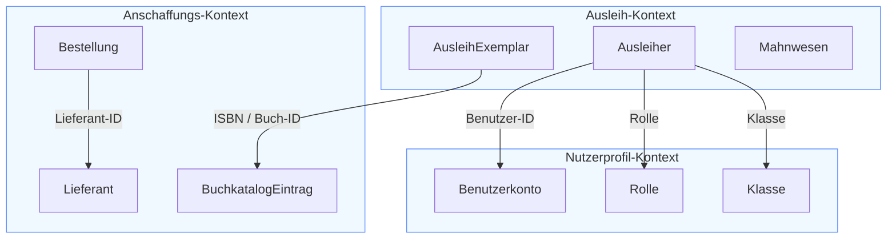
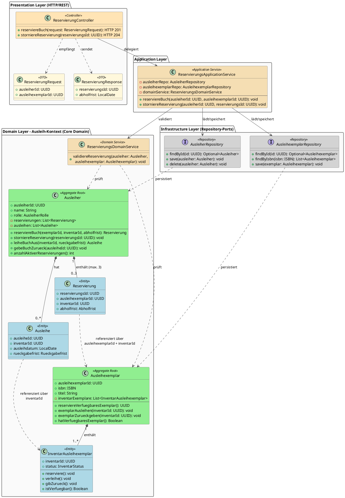
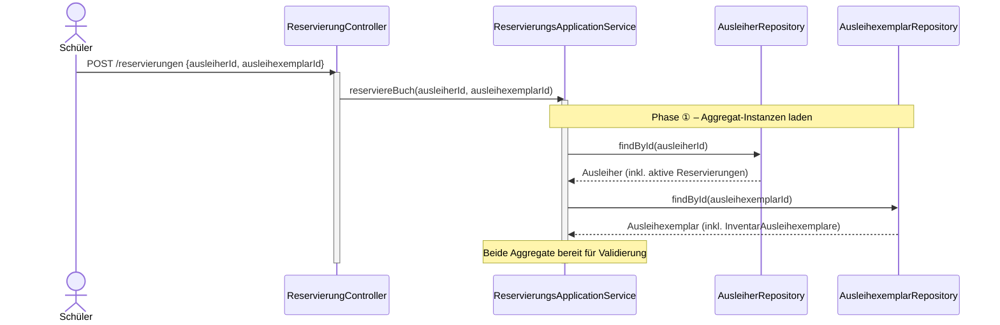
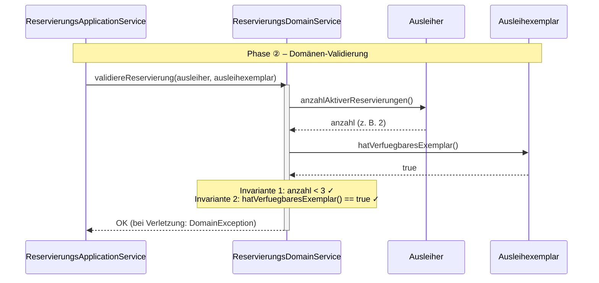
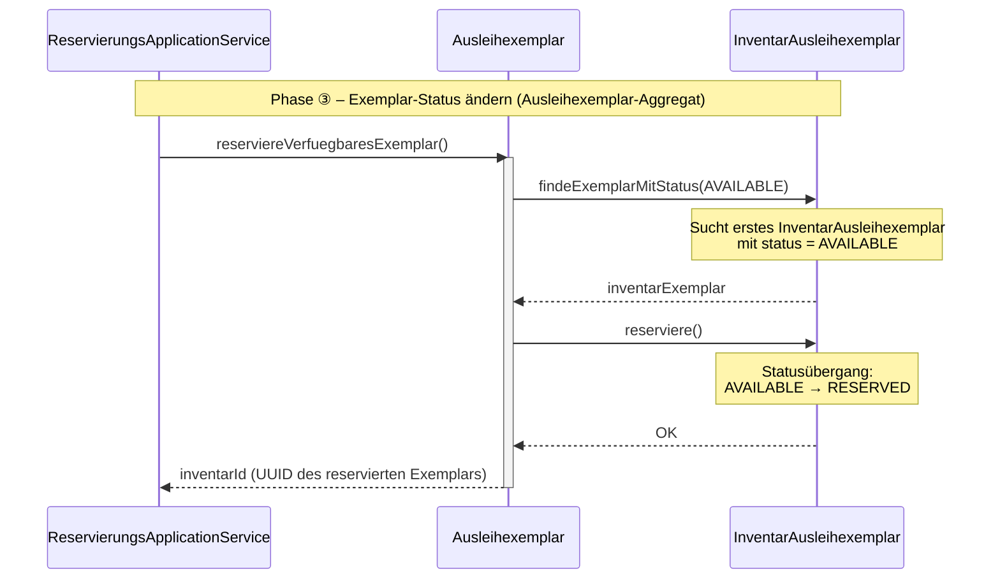
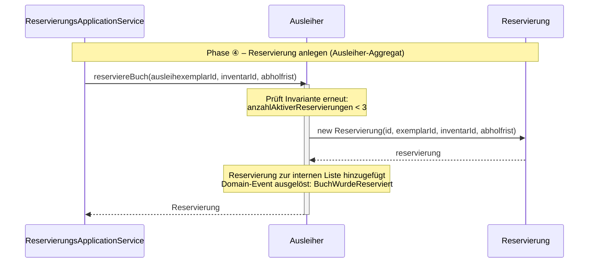
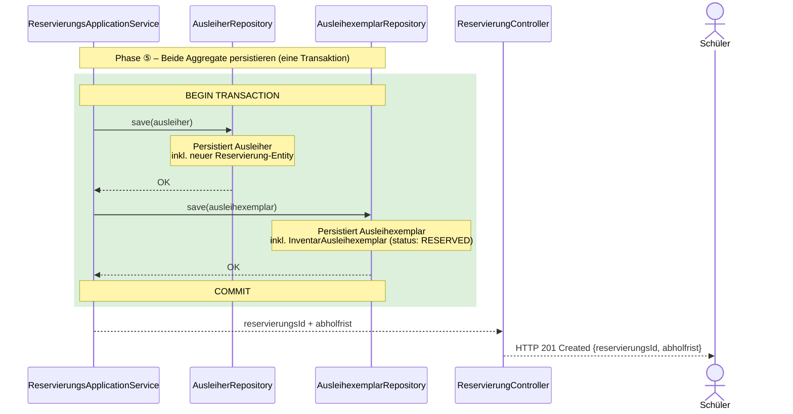

<h1> Systemkonzeption - Kapitel 2: Domain-Driven Design (DDD)</h1>

<h2> Inhaltsverzeichnis</h2>

- [2 Domain-Driven Design (DDD)](#2-domain-driven-design-ddd)
  - [2.1 Kernkonzepte des DDD](#21-kernkonzepte-des-ddd)
    - [2.1.1 Was ist Domain-Driven Design?](#211-was-ist-domain-driven-design)
    - [2.1.2 Ziele von DDD](#212-ziele-von-ddd)
    - [2.1.3 Strategisches vs. Taktisches Design – Die zwei Ebenen von DDD](#213-strategisches-vs-taktisches-design--die-zwei-ebenen-von-ddd)
  - [2.2 Strategisches Design – Bounded Contexts \& Ubiquitous Language](#22-strategisches-design--bounded-contexts--ubiquitous-language)
    - [2.2.1 Ubiquitous Language – Die gemeinsame Fachsprache](#221-ubiquitous-language--die-gemeinsame-fachsprache)
    - [2.2.2 Bounded Context – Fachliche Grenzen ziehen](#222-bounded-context--fachliche-grenzen-ziehen)
    - [2.2.3 Domänenkategorisierung – Nicht alles ist gleich wichtig](#223-domänenkategorisierung--nicht-alles-ist-gleich-wichtig)
  - [2.3 Taktisches Design – Bausteine des DDD](#23-taktisches-design--bausteine-des-ddd)
    - [2.3.1 Kernelemente des taktischen Designs](#231-kernelemente-des-taktischen-designs)
    - [2.3.2 DDD-Services und Repositories](#232-ddd-services-und-repositories)
  - [2.4 Praxisbeispiel – Use Case „Buch Reservierung"](#24-praxisbeispiel--use-case-buch-reservierung)
    - [2.4.1 User Story vs. Use Case](#241-user-story-vs-use-case)
    - [2.4.2 Klassendiagramm – Alle Schichten im Überblick](#242-klassendiagramm--alle-schichten-im-überblick)
    - [2.4.3 Ablaufphasen des Use Cases im Detail](#243-ablaufphasen-des-use-cases-im-detail)
  - [2.5 Zusammenfassung](#25-zusammenfassung)

# 2 Domain-Driven Design (DDD)

*Komplexe Software scheitert oft nicht an der Technologie, sondern daran, dass der Code die fachliche Wirklichkeit nicht mehr widerspiegelt. DDD löst genau dieses Problem.*

Stellen Sie sich vor, die Fachleute sagen „Bestellung", die Entwickler sprechen aber intern von einem `OrderRecord` – und meinen dabei manchmal dasselbe, manchmal aber auch nicht. Dieses Missverständnis wächst mit der Zeit und wird zur Hauptquelle von Bugs und Fehlentscheidungen. DDD begegnet dem, indem Fachsprache und Code zur selben Sprache werden.

## 2.1 Kernkonzepte des DDD

*DDD ist mehr als ein technisches Muster – es ist ein Ansatz, der Softwareentwicklung als gemeinsame Disziplin von Fach- und Technikseite versteht.*

### 2.1.1 Was ist Domain-Driven Design?

Domain-Driven Design ist ein Ansatz zur Softwareentwicklung, der die Fachdomäne in den Mittelpunkt stellt. Statt generische Bezeichner wie `DataManager` oder `ItemProcessor` zu verwenden, soll der Code die Sprache der Anwender und Fachexperten widerspiegeln.

* **Fokus auf die Domäne:** Die Fachlogik (das „Geschäft") steht im Mittelpunkt – nicht die Datenbank, nicht das Framework.
* **Vorgehen:** Fachliche Anforderungen analysieren, ein Domänenmodell ableiten und dieses Modell in Softwarebausteinen abbilden.
* **Modell als Kern:** Das Domänenmodell ist das Herzstück des Systems – alle anderen Teile dienen ihm.

> **Beispiel:** In einem Online-Shop sprechen Fachleute von "Sendungsverfolgung" und "Retourenmanagement". DDD sorgt dafür, dass diese Begriffe als `Shipment`, `Return` oder `OrderStatus` direkt im Code vorkommen.

### 2.1.2 Ziele von DDD

DDD verfolgt drei zentrale Ziele:

1. **Komplexität beherrschen** – durch ein Modell, das das Geschäft genau beschreibt.
2. **Kommunikation verbessern** – mit einer einheitlichen Fachsprache zwischen Domänenexperten und Entwicklern (*Ubiquitous Language*).
3. **Architektur stützen** – indem die Struktur der Software die Struktur des Geschäfts widerspiegelt.

### 2.1.3 Strategisches vs. Taktisches Design – Die zwei Ebenen von DDD

DDD unterscheidet zwei Entwurfsebenen, die sich gegenseitig ergänzen:

* **Strategisches Design:** Blick auf das ganze System und dessen Abgrenzungen.
  * Hier entstehen Begriffe wie *Bounded Context*, *Core Domain* und *Subdomain*.
  * Beispiel: In der Schulbibliothek gibt es einen Ausleih-Kontext, einen Anschaffungs-Kontext und einen Nutzerprofil-Kontext.
* **Taktisches Design:** Blick auf die Detailmodelle innerhalb eines Kontextes.
  * Hier entstehen Entitäten, Value Objects, Aggregate und Domänenregeln.
  * Beispiel: Ein `AusleihExemplar` ist eine Entität mit eindeutiger `InventarId`.

> :bulb: **Merksatz:** DDD bedeutet: Schreibe Code, der die Fachsprache spricht – so versteht jeder im Team, was eine Klasse tut, ohne die Implementierung zu kennen.

*Mit den Kernkonzepten im Blick betrachten wir nun die erste Ebene im Detail: das **strategische Design**, das das System in fachlich sinnvolle Bereiche gliedert und eine gemeinsame Sprache festlegt.*

---

## 2.2 Strategisches Design – Bounded Contexts & Ubiquitous Language

*Im großen Maßstab teilt DDD komplexe Systeme in klar abgegrenzte Fachbereiche auf – und gibt ihnen eine gemeinsame Sprache.*

### 2.2.1 Ubiquitous Language – Die gemeinsame Fachsprache

Die **Ubiquitous Language** ist eine gemeinsame Sprache, die alle Projektbeteiligten verwenden – in Gesprächen, in Dokumenten und im Code.

* **Einheitliche Begriffe:** Fachexperten, Entwickler und Tester sprechen dieselbe Sprache.
* **Im Code sichtbar:** Klassen, Methoden und Variablen verwenden diese Begriffe direkt.
* **Enge Zusammenarbeit:** Entwickler und Fachexperten (Domain Experts) erarbeiten das Modell gemeinsam.
* **Wirkung:** Reduzierte Missverständnisse und bessere, selbsterklärende Dokumentation.

> **Schulbibliotheks-Beispiel:**
> * `Ausleihe` statt `LoanAction`
> * `Ausleiher` statt `User`
> * `Mahnwesen` statt `ReminderProcess`
> * `Vormerkung` statt `Reservation`

> :bulb:Diese Begriffe werden in Meetings, Dokumenten und im Code einheitlich verwendet, z. B. `class Ausleihe`, `method sendeMahnung()` - wobei generell die Verwendung **englischer Fachausdrücke** zu bevorzugen ist.

#### Attribute eines guten Ubiquitous-Language-Eintrags

Damit die Ubiquitous Language nicht nur eine lose Vokabelliste bleibt, sondern zum echten Arbeitswerkzeug wird, sollte jeder Eintrag folgende Attribute besitzen:

1. **Fachbegriff (Term):** Das präzise Wort in der Sprache der Domäne – keine technischen Begriffe wie „User" oder „Database-Entry".
2. **Bounded Context (Geltungsbereich):** Ein Wort kann in verschiedenen Kontexten unterschiedliche Bedeutungen haben – der Kontext macht den Begriff eindeutig.
3. **Fachliche Definition:** Eine klare Erklärung in der Sprache der Experten – keine technischen Details.
4. **Invarianten & Geschäftsregeln:** Welche Regeln müssen für diesen Begriff *immer* gelten? (Grundlage für die Aggregat-Logik)
5. **Beispiele & Szenarien:** Kurze „Wenn-Dann"-Sätze, die den Begriff in Aktion zeigen – helfen, API-Aktionen zu identifizieren.
6. **Klassifizierung (DDD-Rolle):** `Aggregat`, `Entität`, `ValueObject`, `DomainService` usw. – die Brücke zur technischen Umsetzung.
7. **Synonyme & Anti-Begriffe (No-Gos):** Welche Synonyme existieren? Welche Begriffe sollen explizit **nicht** verwendet werden?

### 2.2.2 Bounded Context – Fachliche Grenzen ziehen

Ein **Bounded Context** ist eine klar definierte Grenze, innerhalb derer ein Domänenmodell eindeutig und konsistent gilt.

* **Bounded Context:** Eine klar definierte Grenze, innerhalb derer ein Domänenmodell eindeutig und konsistent gilt.
* **Context Map:** Eine Übersicht, wie verschiedene Bounded Contexts miteinander in Beziehung stehen.

**Schulbibliotheks-Beispiel – drei Bounded Contexts:**

* **Ausleih-Kontext:** `AusleihExemplar`, `Ausleiher`, `Mahnwesen`
* **Anschaffungs-Kontext:** `BuchkatalogEintrag`, `Bestellung`, `Lieferant`
* **Nutzerprofil-Kontext:** `Benutzerkonto`, `Rolle`, `Klasse`

**Context Map – grafisches Beispiel**

Dieses Diagramm zeigt, wie die drei fachlichen Kontexte getrennt bleiben, aber über definierte Austauschpunkte wie `ISBN`, `Benutzer-ID` oder `Rolle` miteinander verknüpft sind.

> :warning: **Achtung:** Die Kontexte verwenden unterschiedliche Modelle für dasselbe reale Objekt. Ein Buch im Ausleih-Kontext ist nicht dasselbe wie ein Buch im Anschaffungs-Kontext. Sie können über eine gemeinsame ID wie `ISBN` verbunden werden, aber die internen Modelle bleiben getrennt.

### 2.2.3 Domänenkategorisierung – Nicht alles ist gleich wichtig

DDD hilft, Domänen nach ihrem fachlichen Wert und ihrer Komplexität zu priorisieren:

* **Warum es wichtig ist:** Verhindert, dass ein einziges, überwachsendes Modell das gesamte System lähmt.

#### Core Domain
Die wichtigste Domäne, in der der größte Geschäftswert liegt.

* Merkmale: hohe Komplexität, starke Spezifik, ständige Weiterentwicklung.
* Beispiel Schulbibliothek: der **Ausleih-Kontext**.
  * Prozesse: Ausleihe, Rückgabe, Vormerkung, Mahnwesen.
  * Regeln: unterschiedliche Leihfristen für Schüler und Lehrer, Ausleihlimit, Strafen bei Verspätung.
  * Modell: `AusleihExemplar`, `Ausleiher`, `Leihfrist`.

#### Supporting Subdomain
Ein unterstützender Bereich, der wichtig ist, aber keinen Wettbewerbsvorteil liefert.

* Merkmale: mittlere Komplexität, notwendige Funktionalität.
* Beispiel Schulbibliothek: der **Anschaffungs-Kontext**.
  * Prozesse: Bestellung, Rechnung, Lieferantenauswahl.
  * Modell: `BuchkatalogEintrag`, `Lieferant`, `Bestellung`.
  * Umsetzung: pragmatisch mit CRUD-Funktionen.

#### Generic Subdomain
Eine Standarddomäne, die meist mit fertigen Lösungen abgedeckt werden kann.

* Merkmale: geringe Spezifik, weit verbreitete Anforderungen.
* Beispiel Schulbibliothek: der **Nutzerprofil-Kontext**.
  * Prozesse: Anmeldung, Rollenverwaltung.
  * Modell: `Benutzerkonto`, `Passwort`, `Rolle`.
  * Umsetzung: oft durch fertige Bibliotheken wie Auth0, Keycloak oder ASP.NET Core Identity.

> :bulb: **Merksatz:** Investiere den größten Aufwand in die **Core Domain** – dort liegt der Wert des Systems. Für Generic Subdomains gilt: kaufe, statt selbst zu bauen.

*Nachdem das System strategisch gegliedert ist, betrachten wir die Detailarbeit innerhalb eines Bounded Context: das **taktische Design** mit seinen konkreten Codebausteinen.*

---

## 2.3 Taktisches Design – Bausteine des DDD

*Innerhalb eines Bounded Context beschreibt das taktische Design die konkreten Bausteine des Codes – von der einzelnen Klasse bis zur Schichtenarchitektur.*

### 2.3.1 Kernelemente des taktischen Designs

Im taktischen Design entstehen die Bausteine, die das Domänenmodell in Code übersetzen:

#### Entity
Eine **Entity** ist ein fachliches Objekt mit eigener Identität, das sich über die Zeit verändert. Entitäten werden über ihre Identität referenziert und enthalten typischerweise Status und Verhalten, das zur Domäne gehört.

* Charakteristisch: eigene ID, veränderlicher Zustand, Lebenszyklus.
* Beispiel: Ein Ausleiher bleibt über mehrere Ausleihvorgänge hinweg derselbe Akteur, auch wenn sich Name, Rolle oder Reservierungen ändern.
* Zweck: Modelle reale Domänenobjekte, die eindeutige Identität und Zustandsübergänge besitzen.

#### Value Object

Ein **Value Object** ist ein unveränderliches Objekt, das nur durch seinen Wert definiert ist. Es hat keine eigene Identität und kann beliebig oft ersetzt werden, solange seine Werte gleich bleiben.

* Charakteristisch: immutabel, austauschbar, keine eigene ID.
* Beispiel: Eine `Leihfrist`, `Signatur` oder `Adresse` wird durch ihre Attribute beschrieben und nicht durch eine separate Identität.
* Wichtig: Value Objects sollen **keine anämischen Datencontainer** sein. Sie kapseln eigene Validierungslogik und stellen Sicherheiten bereit.
* Beispiel: Eine `ISBN` prüft beim Erstellen ihr Format, eine `Adresse` validiert Pflichtfelder und eine `Leihfrist` stellt Berechnungsmethoden bereit.
* Zweck: Komplexe Werte zusammenfassen, Invarianten ausdrücken, fachliche Logik dort belassen, wo sie hingehört, und compare/equals-Verhalten einheitlich definieren.

#### Aggregate

Ein **Aggregate** ist eine Gruppe fachlich zusammengehöriger Objekte mit einer klaren Außengrenze. Das Aggregate verwaltet Konsistenzregeln und stellt mit der **Aggregate Root** den einzigen gültigen Zugriffspunkt dar.

* Charakteristisch: mehrere Entities/Value Objects, klare Konsistenzgrenzen, Aggregate Root.
* Beispiel: Ein Ausleiher-Aggregat koordiniert die Reservierungen, Ausleihen und Guthabenlogik für einen Benutzer.
* Zweck: Konsistenz innerhalb des Aggregates sicherstellen und die Komplexität der Transaktionen begrenzen.

* **Invariante** eines Aggregats

    Eine **Invariante** ist eine Regel, die **innerhalb eines Aggregates** immer gelten muss. Invarianten sichern die fachliche Konsistenz und verhindern, dass das Modell in einen ungültigen Zustand gerät.

    * Charakteristisch: innerhalb des Aggregates überprüft, darf nicht verletzt werden.
    * Beispiel: Ein Ausleiher darf maximal drei aktive Reservierungen haben; ein Buchexemplar darf nur reserviert werden, wenn es verfügbar ist.
    * Zweck: Domänenlogik zwingend durchsetzen und Fehlerquellen frühzeitig abfangen.

### 2.3.2 DDD-Services und Repositories

Neben Aggregaten gibt es im taktischen DDD weitere wichtige Bausteine für die Schichtenarchitektur.

#### Application Service

Ein **Application Service** steuert die Ausführung eines Use Cases. Er orchestriert mehrere Schritte, lädt Aggregate über Repositories und übergibt die fachliche Arbeit an das Domänenmodell.

* Charakteristisch: keine eigene Domänenlogik, Koordination von Aktionen.
* Beispiel: Ein Reservierungs-Use Case lädt Ausleiher und Exemplar, prüft Regeln und delegiert die Reservierung an das Aggregate.
* Zweck: klare Trennung zwischen Geschäftsprozessen und Domänenlogik.

#### Domain Service

Ein **Domain Service** enthält Domänenlogik, die nicht eindeutig zu einem einzelnen Aggregate gehört. Er arbeitet mit fachlichen Objekten, ohne selbst ein Aggregat zu sein.

* Charakteristisch: zustandslos, domänenorientiert, kapselt fachliche Regeln.
* Beispiel: Eine Regelkomponente zur Prüfung von Reservierungslimits oder zur Bestimmung möglicher Leihfristen.
* Zweck: fachliche Logik bündeln, die über mehrere Aggregate hinweg gilt.

#### Repository

Ein **Repository** abstrahiert die Speicherung und das Laden von Aggregate Roots. Es behandelt die Persistenz als technische Ergänzung, sodass die Domäne selbst davon entkoppelt bleibt.

* Charakteristisch: Schnittstelle zur Datenbank, speichert Aggregate in ganzen Zuständen.
* Beispiel: Ein Ausleiher-Repository lädt das Ausleiher-Aggregat mitsamt seinen aktuellen Reservierungen.
* Zweck: Datenzugriff kapseln und dem Domänenmodell eine saubere Persistenzschicht bieten.

#### Domain Events

**Domain Events** sind Benachrichtigungen über wichtige Zustandsänderungen in der Domäne. Sie erlauben anderen Systemteilen, darauf zu reagieren, ohne die Domänentransaktion zu verschmutzen.

* Charakteristisch: beschreiben, was passiert ist, nicht wie es passiert ist.
* Beispiel: `BuchWurdeReserviert` signalisiert, dass eine Reservierung erfolgreich angelegt wurde.
* Zweck: lose Kopplung erzeugen und asynchrone oder nachgelagerte Prozesse ermöglichen.

> :mag: **Vertiefung:** Die vier Schichten einer DDD-Anwendung: **Presentation Layer** (Controller/REST) → **Application Layer** (Application Services) → **Domain Layer** (Aggregates, Entities, Domain Services) → **Infrastructure Layer** (Repository-Implementierungen, Datenbank) entspricht im Wesentlichen einer `Hexagonalen Architektur` und ist in der Regel hauptsächlich für die Core-Domain vorgesehen.

---

## 2.4 Praxisbeispiel – Use Case „Buch Reservierung"

*Wie arbeiten alle Bausteine zusammen? Am Beispiel der Buchreservierung lässt sich der gesamte Ablauf – von der REST-Anfrage bis zur Datenbankpersistierung – schrittweise nachvollziehen.*

### 2.4.1 User Story vs. Use Case

Eine **User Story** beschreibt die Motivation und den Nutzen für den Anwender – sie bleibt bewusst abstrakt und technologiefrei. Ein **Use Case** hingegen beschreibt die konkrete Ablaufsteuerung im System: Welche Schritte werden intern ausgeführt, welche Regeln geprüft und welche Komponenten sind beteiligt?

Am selben Beispiel „Buch reservieren" zeigt sich der Unterschied deutlich:

---

**User Story – Sicht des Anwenders**

> *Als **Schüler** möchte ich ein **verfügbares Buch vormerken**, damit ich es zu einem späteren Zeitpunkt in der Bibliothek abholen kann.*

| Attribut | Inhalt |
|---|---|
| **ID** | US-AK-01 |
| **Rolle** | Schüler (Ausleiher mit Rolle `SCHUELER`) |
| **Ziel** | Buch vormerken, ohne es sofort mitzunehmen |
| **Nutzen** | Sicherstellung, dass das Buch beim Abholen verfügbar ist |

**Akzeptanzkriterien:**

* **AC-1:** Wenn ein Schüler ein Buch vormerkt, das mindestens ein verfügbares physisches Exemplar hat, wird die Reservierung erfolgreich angelegt und eine Abholfrist von 7 Tagen gesetzt.
* **AC-2:** Wenn der Schüler bereits 3 aktive Reservierungen hat, wird die Reservierung abgelehnt und eine verständliche Fehlermeldung angezeigt.
* **AC-3:** Wenn kein physisches Exemplar verfügbar ist (alle ausgeliehen oder reserviert), wird die Reservierung abgelehnt.
* **AC-4:** Nach erfolgreicher Reservierung erhält der Schüler eine Bestätigung mit der `ReservierungsId` und der Abholfrist.
* **AC-5:** Ein Lehrer (Rolle `LEHRER`) kann bis zu 5 aktive Reservierungen gleichzeitig halten.

---

**Use Case – Sicht des Systems**

> `ReserviereBuch(ausleiherId: UUID, ausleihexemplarId: UUID): ReservierungResponse`

| Attribut | Inhalt |
|---|---|
| **Use Case ID** | UC-AK-01 |
| **Akteur** | Schüler / Lehrer (authentifizierter `Ausleiher`) |
| **Vorbedingung** | Ausleiher ist authentifiziert; `Ausleihexemplar` existiert im System |
| **Nachbedingung (Erfolg)** | `Reservierung`-Entity im `Ausleiher`-Aggregat angelegt; `InventarAusleihexemplar` auf `RESERVED` gesetzt; Domain Event `BuchWurdeReserviert` ausgelöst |
| **Nachbedingung (Fehler)** | Kein Datenbankzustand geändert; `DomainException` zurückgegeben |

**Normalablauf:**

1. Die Anfrage zur Buchreservierung wird entgegengenommen und die Eingabedaten werden geprüft.
2. Das System lädt die relevanten fachlichen Objekte, etwa den Ausleiher und das Ausleih-Exemplar.
3. Die fachlichen Regeln werden geprüft:
   - Invariante: Der Ausleiher darf die maximale Anzahl aktiver Reservierungen nicht überschreiten.
   - Invariante: Es muss ein verfügbares physisches Exemplar vorhanden sein.
4. Das Reservierungsverhalten wird auf dem Domänenmodell ausgeführt:
   - Ein verfügbares Exemplar wird als reserviert markiert.
   - Eine neue Reservierung wird für den Ausleiher angelegt.
   - Falls vorgesehen, wird ein Domain Event zum Reservierungserfolg erzeugt.
5. Alle Änderungen werden in einer konsistenten Transaktion gespeichert.
6. Das System sendet eine Erfolgsantwort zurück, die z. B. die Reservierungs-ID und die Abholfrist enthält.

**Alternative Abläufe:**

* **[A1] Reservierungslimit erreicht:** Die Regelprüfung schlägt fehl → Reservierung wird abgelehnt und eine geeignete Fehlermeldung wird zurückgegeben.
* **[A2] Kein Exemplar verfügbar:** Die Regelprüfung schlägt fehl → Reservierung wird abgelehnt und eine geeignete Fehlermeldung wird zurückgegeben.

---

> :bulb: **Merksatz:** Die User Story beantwortet *Warum* und *Was* aus Nutzersicht – der Use Case beantwortet *Wie* aus Systemsicht. Die Akzeptanzkriterien der User Story werden direkt zu den **Invarianten** im DDD-Aggregat.

#### Allgemeiner Ablauf eines Use Cases im DDD

Folgender Ablauf skizziert die Durchführung eines Use-Cases vom Empfang der Daten über das REST-API bis zur Speicherung in der Datenbank:

1. **Controller**: Übernimmt die Daten, die über das REST-API übermittelt werden (z. B. `AusleiherId`, `AusleihExemplarId`).
2. **ApplicationService**: Orchestriert den Use Case:
   1. Laden der benötigten **Aggregate** über die **Repositories** (z. B. `Ausleihexemplar`, `Ausleiher`)
   2. Ausführung des **Domain Service** oder direkter Aktionen auf **Aggregaten** (z. B. `reserviereBuch`)
      1. Prüfung der **Invarianten** im Aggregat (z. B. max. 3 aktive Reservierungen)
      2. Auslösen von **Domain Events** (z. B. `BuchWurdeReserviert`)
   3. Speicherung der geänderten **Aggregate** über die **Repositories**

### 2.4.2 Klassendiagramm – Alle Schichten im Überblick

Das folgende Klassendiagramm zeigt alle beteiligten Hauptklassen des Ausleih-Kontexts über **alle vier Schichten** hinweg – von der REST-Schnittstelle bis zu den Repository-Ports.

Die `Ausleihexemplar`–`InventarAusleihexemplar`-Beziehung verdeutlicht, dass ein logisches `Ausleihexemplar` (z. B. „Das Parfum – ISBN 978-3-257-22800-7") mehrere physische `InventarAusleihexemplar` besitzen kann, von denen jedes einen eigenen Status trägt.

*Farbkodierung: 🟢 Aggregate Root · 🔵 Entity · ⬜ Repository-Interface · 🟠 Service · 🟧 Controller/DTO*

### 2.4.3 Ablaufphasen des Use Cases im Detail

Die folgenden Sequenzdiagramme beleuchten jede Phase des Ablaufs einzeln. So lässt sich die Verantwortlichkeit jeder Schicht und jedes Objekts isoliert nachvollziehen.

**Phase ①: Aggregat-Instanzen laden**

Der Application Service empfängt die Anfrage und lädt beide benötigten Aggregate aus der Datenbank. Er sieht nur die Aggregat-Wurzeln – die internen Strukturen (z. B. `InventarAusleihexemplar`-Liste) werden vom Repository transparent mitgeliefert.

**Phase ②: Domänen-Validierung**

Der `ReservierungsDomainService` prüft aggregatübergreifende Geschäftsregeln: Darf der Ausleiher noch reservieren? Hat das logische Exemplar einen freien physischen Bestand? Diese Logik gehört in den Domain Service, weil sie beide Aggregate gleichzeitig betrifft – keines der beiden Aggregate kennt das andere.

**Phase ③: Exemplar-Status ändern (Ausleihexemplar-Aggregat)**

Das `Ausleihexemplar`-Aggregat verwaltet seinen Zustand autonom: Es wählt selbstständig ein freies physisches Exemplar (`InventarAusleihexemplar` mit Status `AVAILABLE`) und setzt es auf `RESERVED`. Nach außen gibt es nur die `inventarId` zurück – kein Objekt, nur die ID. Das schützt die Aggregatgrenze.

**Phase ④: Reservierung anlegen (Ausleiher-Aggregat)**

Das `Ausleiher`-Aggregat schützt seine eigene Invariante (max. 3 aktive Reservierungen), legt die neue `Reservierung`-Entity mit den übermittelten IDs und der berechneten Abholfrist an und löst das Domain-Event `BuchWurdeReserviert` aus. Andere Systemteile (z. B. E-Mail-Service) können auf dieses Event reagieren, ohne direkt mit dem Aggregat verbunden zu sein.

**Phase ⑤: Beide Aggregate persistieren**

Abschließend speichert der **Application Service** beide Aggregate in **einer gemeinsamen Datenbanktransaktion**. Würde man die Transaktion aufteilen, könnte ein Systemfehler zu einem inkonsistenten Zustand führen: ein physisches Exemplar mit Status `RESERVED`, aber ohne zugehörige `Reservierung`-Entity im Ausleiher.

---

## 2.5 Zusammenfassung

Kapitel 2 zeigt, wie DDD hilft, Backend-Systeme fachlich zu strukturieren. Es erklärt, wie man Domänen identifiziert, klare Grenzen schafft und Fachsprache in Code übersetzt. Die drei Hauptbereiche – **Kernkonzepte**, **strategisches Design** und **taktisches Design** – bauen aufeinander auf: vom großen Bild (Bounded Contexts, Domänenkategorien) bis zu den konkreten Codebausteinen (Aggregates, Entities, Repositories).

> :bulb: **Merksatz:** DDD ist kein Framework, das man installiert – es ist eine Denkweise, die man anwendet. Der größte Wert entsteht durch die enge Zusammenarbeit zwischen Fachexperten und Entwicklern.

*Das Domänenmodell lebt auch in der Datenbank. Wie man DDD-Konzepte auf Tabellen und Schemas überträgt, ohne die Fachlogik zu kompromittieren, zeigt das nächste Kapitel: **Datenbank-Design im DDD-Kontext**.*
