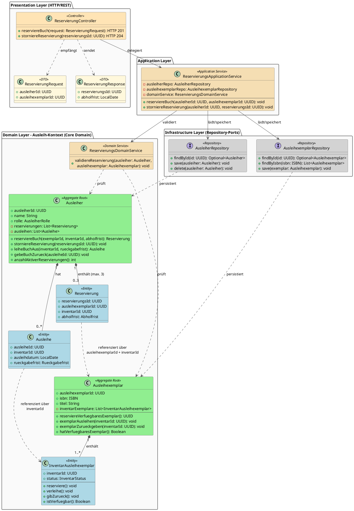
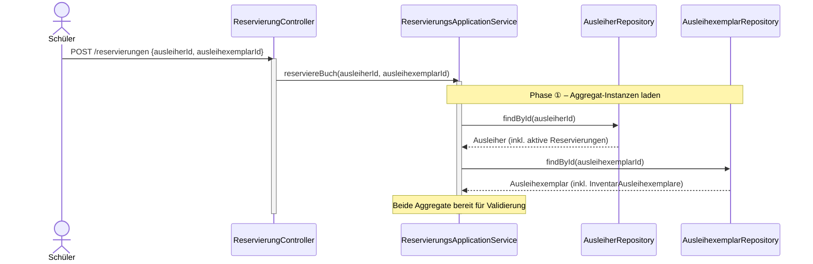
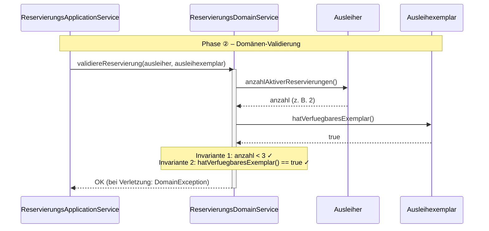
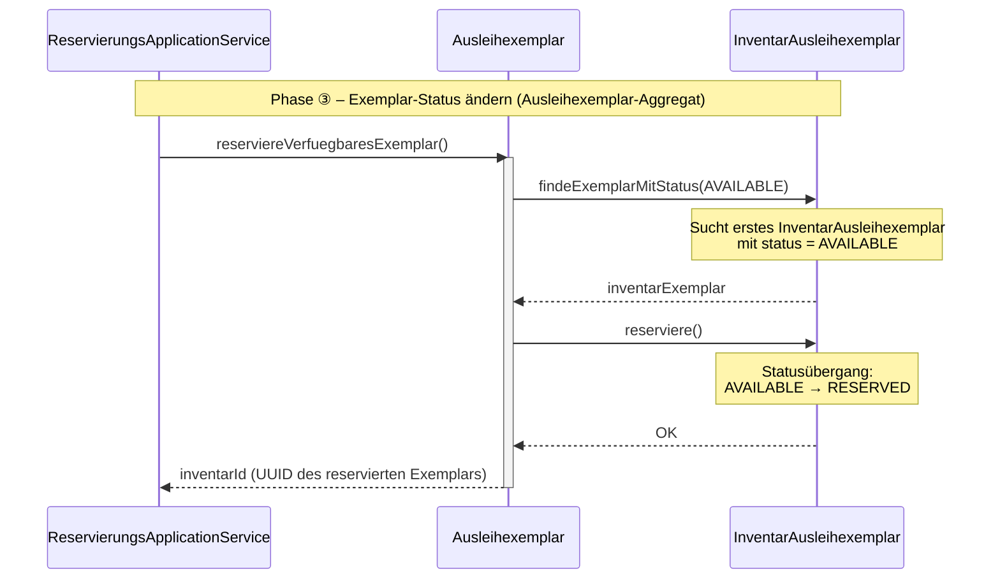
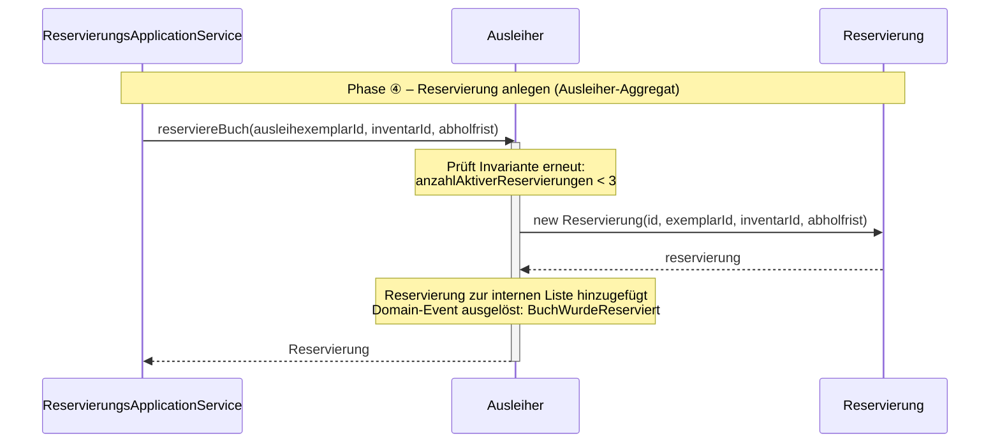
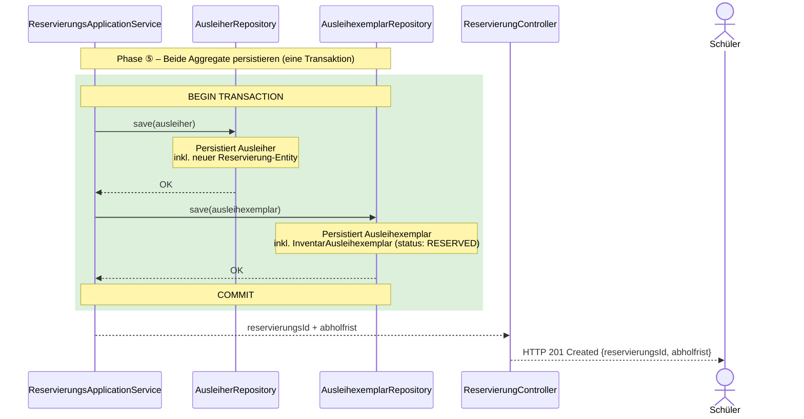

## Kapitel 2: Domain-Driven Design (DDD) – Das Backend strukturieren
*Dieses Kapitel erklärt, wie man die Geschäftslogik sauber modelliert und den Backend-Code nah an der Fachsprache des Unternehmens ausrichtet.*

### 2.1 Was ist Domain-Driven Design?
Domain-Driven Design ist ein Ansatz zur Softwareentwicklung, der die Fachdomäne in den Mittelpunkt stellt. Statt generische Bezeichner wie `DataManager` oder `ItemProcessor` zu verwenden, soll der Code die Sprache der Anwender und Fachexperten widerspiegeln.

* **Ziel:** Komplexe Geschäftsanwendungen verständlich, flexibel und wartbar machen.
* **Vorgehen:** Fachliche Anforderungen analysieren, ein Domänenmodell ableiten und dieses Modell in Softwarebausteinen abbilden.
* **Nutzen:** bessere Kommunikation, weniger Missverständnisse, langlebigere Architektur.

> **Beispiel:** In einem Online-Shop sprechen Fachleute von "Sendungsverfolgung" und "Retourenmanagement". DDD sorgt dafür, dass diese Begriffe als `Shipment`, `Return` oder `OrderStatus` direkt im Code vorkommen.

### 2.2 Ziele von DDD
DDD verfolgt drei zentrale Ziele:

1. **Komplexität beherrschen** – durch ein Modell, das das Geschäft genau beschreibt.
2. **Kommunikation verbessern** – mit einer einheitlichen Fachsprache zwischen Domänenexperten und Entwicklern.
3. **Architektur stützen** – indem die Struktur der Software die Struktur des Geschäfts widerspiegelt.

### 2.3 Strategisches vs. Taktisches Design
DDD unterscheidet zwei Ebenen:

* **Strategisches Design:** Blick auf das ganze System und dessen Abgrenzungen.
  * Hier entstehen Begriffe wie *Bounded Context*, *Core Domain* und *Subdomain*.
  * Beispiel: In der Schulbibliothek gibt es einen Ausleih-Kontext, einen Anschaffungs-Kontext und einen Nutzerprofil-Kontext.
* **Taktisches Design:** Blick auf die Detailmodelle innerhalb eines Kontextes.
  * Hier entstehen Entitäten, Value Objects, Aggregate und Domänenregeln.
  * Beispiel: Ein `AusleihExemplar` ist eine Entität mit eindeutiger `InventarId`.

### 2.4 Ubiquitous Language
Die Ubiquitous Language ist eine gemeinsame Sprache, die alle Projektbeteiligten verwenden.

* **Einheitliche Begriffe:** Fachexperten, Entwickler und Tester sprechen dieselbe Sprache.
* **Im Code sichtbar:** Klassen, Methoden und Variablen verwenden diese Begriffe.
* **Wirkung:** Reduzierte Missverständnisse und bessere Dokumentation.

> **Schulbibliotheks-Beispiel:**
> * `Ausleihe` statt `LoanAction`
> * `Ausleiher` statt `User`
> * `Mahnwesen` statt `ReminderProcess`
> * `Vormerkung` statt `Reservation`

Diese Begriffe werden in Meetings, Dokumenten und im Code einheitlich verwendet, z. B. `class Ausleihe`, `method sendeMahnung()`.

Folgende Attribute sollte ein Eintrag im Ubiquitous Language besitzen:

Damit die **Ubiquitous Language (UL)** nicht nur eine lose Liste von Vokabeln bleibt, sondern zum echten Arbeitswerkzeug für Entwickler und Fachexperten wird, muss ein Eintrag weit über eine einfache Wörterbuch-Definition hinausgehen.

Gerade in deinem Fall – wo du die UL nutzt, um daraus **Aggregate** und **API-Endpunkte** abzuleiten – sind bestimmte Attribute essenziell, um Missverständnisse an den Schnittstellen zu vermeiden.

Hier sind die Attribute, die jeder Eintrag in deinem "Domain Glossary" auf jeden Fall haben sollte:

1. Der **Fachbegriff** (Term): Das präzise Wort in der Sprache der Domäne. 
   * **Wichtig:** Vermeide technische Begriffe wie "User" oder "Database-Entry", wenn die Fachwelt von "Mandant" oder "Versandposten" spricht.
2. Der **Bounded Context** (Geltungsbereich): Dies ist das wichtigste Attribut in DDD. Ein Wort kann in verschiedenen Kontexten unterschiedliche Bedeutungen haben.
3. Die **fachliche Definition**: Eine klare, prägnante Erklärung in der Sprache der Experten.
   * **Regel:** Keine technischen Details! Beschreibe, was das Ding für das Geschäft bedeutet, nicht wie es gespeichert wird.
1. **Invarianten & Geschäftsregeln**:
Welche Regeln müssen für diesen Begriff *immer* gelten?
   * **Warum das für dich wichtig ist:** Daraus leitest du später die Logik in deinem **Aggregat** ab.
5. **Beispiele & Szenarien** (User Stories):
Kurze "Wenn-Dann"-Sätze, die den Begriff in Aktion zeigen.
   * **Beispiel:** "Wenn eine Bestellung *storniert* wird, müssen alle reservierten Bestände im Lager freigegeben werden."
   * Dies hilft dir, die **Aktionen** (wie `relocate` oder `cancel`) für deine API-Endpunkte zu identifizieren.
 6. **Klassifizierung** (Die "Brücke" zur Technik): Da die UL für das technisches Design genutzt wird, ist ein "Tag" hilfreich, um die Rolle im DDD-Modell vorzudefinieren: `Aggregat`, `Entität`, `ValueObject`, `DomainService`, usw. 
7. **Synonyme & "Anti-Begriffe** (No-Gos)
   * **Synonyme:** "Kunde" wird intern oft "Debitor" genannt. Halte das fest, um Verwirrung zu vermeiden.
   * **No-Gos:** Welche Begriffe sollen **explizit nicht** verwendet werden? Das hält die Sprache (und deinen Code) sauber.

### 2.5 Domänenkategorisierung 

DDD hilft, Domänen nach ihrem Wert und ihrer Komplexität zu sortieren.

#### Core Domain
Die wichtigste Domäne, in der der größte Geschäftswert liegt.

* Merkmale: hohe Komplexität, starke Spezifik, ständige Weiterentwicklung.
* Beispiel Schulbibliothek: der **Ausleih-Kontext**.
  * Prozesse: Ausleihe, Rückgabe, Vormerkung, Mahnwesen.
  * Regeln: unterschiedliche Leihfristen für Schüler und Lehrer, Ausleihlimit, Strafen bei Verspätung.
  * Modell: `AusleihExemplar`, `Ausleiher`, `Leihfrist`.

#### Supporting Subdomain
Ein unterstützender Bereich, der wichtig ist, aber keinen Wettbewerbsvorteil liefert.

* Merkmale: mittlere Komplexität, notwendige Funktionalität.
* Beispiel Schulbibliothek: der **Anschaffungs-Kontext**.
  * Prozesse: Bestellung, Rechnung, Lieferantenauswahl.
  * Modell: `BuchkatalogEintrag`, `Lieferant`, `Bestellung`.
  * Umsetzung: pragmatisch mit CRUD-Funktionen.

#### Generic Subdomain
Eine Standarddomäne, die meist mit fertigen Lösungen abgedeckt werden kann.

* Merkmale: geringe Spezifik, weit verbreitete Anforderungen.
* Beispiel Schulbibliothek: der **Nutzerprofil-Kontext**.
  * Prozesse: Anmeldung, Rollenverwaltung.
  * Modell: `Benutzerkonto`, `Passwort`, `Rolle`.
  * Umsetzung: oft durch fertige Bibliotheken wie Auth0, Keycloak oder ASP.NET Core Identity.

### 2.6 Bounded Contexts am Schulbibliotheksbeispiel
Ein Bounded Context ist eine klare Grenze, innerhalb der ein bestimmtes Modell und eine bestimmte Sprache gültig sind.

* **Ausleih-Kontext:**  `AusleihExemplar`, `Ausleiher`, `Mahnwesen`.
* **Anschaffungs-Kontext:** `BuchkatalogEintrag`, `Bestellung`, `Lieferant`.
* **Nutzerprofil-Kontext:** `Benutzerkonto`, `Rolle`, `Klasse`.

> **Wichtig:** Die Kontexte verwenden unterschiedliche Modelle für dasselbe reale Objekt. Ein Buch im Ausleih-Kontext ist nicht dasselbe wie ein Buch im Anschaffungs-Kontext. Sie können über eine gemeinsame ID wie `ISBN` verbunden werden, aber die internen Modelle bleiben getrennt.

### 2.7 Kernelemente des taktischen Designs
Im taktischen Design entstehen die Bausteine, die das Domain-Modell umsetzen.

* **Entity:** Ein Objekt mit eindeutiger Identität.
  * Beispiel: `AusleihExemplar` mit `InventarId`.
* **Value Object:** Ein Objekt, das nur über seine Werte definiert ist.
  * Beispiel: `Signatur` oder `Leihfrist`.
* **Aggregate:** Eine Gruppe von Objekten mit einem Aggregate Root.
  * Beispiel: `Ausleiher` als Root, das `AusleihExemplar` und `Leihfrist` koordiniert.
  * **Wichtigkeit:** Aggregate sind die Stelle, an der **Invarianten durchgesetzt** werden. Sie schützen die Konsistenz, indem sie nur in einem definierten Gültigkeitsbereich Änderungen zulassen.
  * **Invarianten im Ausleih-Kontext:** Ein Ausleiher darf nicht mehr als 5 Bücher gleichzeitig haben; ein AusleihExemplar darf nur ausgeliehen sein, wenn es verfügbar ist.
* **Invariante:** Eine Regel, die immer gelten muss.
  * Beispiel: Ein Schüler darf nicht mehr als 5 Bücher gleichzeitig ausleihen.

### 2.8 DDD-Services und Repository
Neben Aggregaten gibt es im taktischen DDD weitere wichtige Bausteine:

* **Application Service:** Orchestriert Use Cases und ist die einzige Stelle, die auf Repositories zugreift.
  * Aufgabe: Koordiniert Schritte eines Anwendungsfalls, z. B. eine Reservierung prüfen und speichern.
  * Beispiel: `AusleiheApplicationService` ruft `AusleiherRepository` und `AusleihExemplarRepository` auf.
* **Domain Service:** Führt domänenlogische Aktionen aus, die nicht sauber zu einem einzigen Aggregat gehören.
  * Beispiel: `ReservierungsService` prüft, ob ein Ausleiher eine zusätzliche Vormerkung anlegen darf, ohne selbst ein Aggregat zu sein.
* **Repository:** Abstraktion der Datenspeicherung für Aggregate.
  * Aufgabe: Aggregate laden und speichern, ohne Detailwissen über die Persistenz.
  * Beispiel: `AusleiherRepository` lädt einen `Ausleiher` mit seinen Ausleihungen.

### 2.9 Umsetzung eines UseCases in DDD am Beispiel vom UseCase "Buch Reservierung" 

Dieses Kapitel demonstriert die praktische Umsetzung eines Anwendungsfalls im Kontext von Domain-Driven Design (DDD) am Beispiel der Buchreservierung. Es wird aufgezeigt, wie die einzelnen Schichten einer DDD-Architektur – vom Controller über den Application Service, der auf Repositories zugreift, bis hin zum Domain Service und den Aggregat-Roots mit ihren Entities – zusammenwirken, um einen fachlichen Use Case abzubilden.

#### Warum Use Case und nicht User Story?

Eine **User Story** beschreibt die Motivation und den Nutzen für den Anwender. Sie ist wichtig für das Anforderungsmanagement und die Produktvision, bleibt aber bewusst abstrakt. Ein **Use Case** hingegen beschreibt die konkrete Ablaufsteuerung im System: Welche Schritte werden intern ausgeführt, welche Regeln geprüft und welche Komponenten sind beteiligt?

In DDD ist dieser Unterschied entscheidend:

* **User Story**: Beschreibt das Ziel des Nutzers. Beispiel: "Als Schüler möchte ich ein Buch reservieren, damit ich es später abholen kann."
* **Use Case**: Beschreibt das Systemverhalten. Beispiel: `ReserviereBuch`.

Für dieses Kapitel ist der Use Case wichtig, weil hier die technische Umsetzung im Vordergrund steht. Wir gehen nicht nur auf den Wunsch des Nutzers ein, sondern auf die konkrete Zusammenarbeit von Controller, Application Service, Domain Service, Aggregaten und Repositories.

#### Allgemeiner Ablauf des Use Cases im DDD

Folgender Ablauf skizziert die Durchführung eines Use-Cases vom Empfang der Daten über das RestAPI bis zur Speicherung in der DB: 
1. **Controller**: Übernimmt die Daten die über das REST API übermittelt werden (z.B. `AuleiherId`, `AuleihExemplarID`)
2. **ApplicationService**: Orchestriert den Use Case durch:
   1. Laden der benötigten **Aggregate** über die **Repositories** (z.B. `AusleihExemplar`, `Ausleiher`)
   2. Ausführung von **Domain-Service** oder direkten Aktionen von **Aggreaten** (z.B. `reserviereBuch`)
      1. Prüfung der **Invarianten** im Aggragat (z.B. max. 3 aktive Reservierungen)
      2. Ausführen von möglichen **Events** (z.B. `BuchReserviert`)
   3. Speicherung der geänderten **Aggregate** mittels der **Repositories**
    

#### Abhänggikeiten der Klassen (Use Case "Buch Reservierung")

Das folgende Klassendiagramm zeigt alle beteiligten Haupt-Klassen des Ausleih-Kontexts über **alle vier Schichten** hinweg – von der REST-Schnittstelle bis zu den Repository-Ports.

Die `Ausleihexemplar`–`InventarAusleihexemplar`-Beziehung verdeutlicht, dass ein logisches `Ausleihexemplar` (z. B. "Das Parfum – ISBN 978-3-257-22800-7") mehrere physische `InventarAusleihexemplar` besitzen kann, von denen jedes einen eigenen Status trägt.

*Farbkodierung: 🟢 Aggregate Root · 🔵 Entity · ⬜ Repository-Interface · 🟠 Service · 🟧 Controller/DTO*

#### Ablaufphasen des UseCases im Detail

Die folgenden Diagramme beleuchten jede Phase des Ablaufs einzeln. So lässt sich die Verantwortlichkeit jeder Schicht und jedes Objekts isoliert nachvollziehen.

**Phase ①: Aggregat-Instanzen laden**

Der Application Service empfängt die Anfrage und lädt beide benötigten Aggregate aus der Datenbank. Er sieht nur die Aggregat-Wurzeln – die internen Strukturen (z. B. `InventarAusleihexemplar`-Liste) werden vom Repository transparent mitgeliefert.

**Pase ②: Domänen-Validierung**

Der `ReservierungsDomainService` prüft aggregatübergreifende Geschäftsregeln: Darf der Ausleiher noch reservieren? Hat das logische Exemplar einen freien physischen Bestand? Diese Logik gehört in den Domain Service, weil sie beide Aggregate gleichzeitig betrifft – keines der beiden Aggregate kennt das andere.

**Phase ③: Exemplar-Status ändern (Ausleihexemplar-Aggregat)**

Das `Ausleihexemplar`-Aggregat verwaltet seinen Zustand autonom: Es wählt selbstständig ein freies physisches Exemplar (`InventarAusleihexemplar` mit Status `AVAILABLE`) und setzt es auf `RESERVED`. Nach außen gibt es nur die `inventarId` zurück – kein Objekt, nur die ID. Das schützt die Aggregatgrenze.

---

**Phase ④: Reservierung anlegen (Ausleiher-Aggregat)**

Das `Ausleiher`-Aggregat schützt seine eigene Invariante (max. 3 aktive Reservierungen), legt die neue `Reservierung`-Entity mit den übermittelten IDs und der berechneten Abholfrist an und löst das Domain-Event `BuchWurdeReserviert` aus. Andere Systemteile (z. B. E-Mail-Service) können auf dieses Event reagieren, ohne direkt mit dem Aggregat verbunden zu sein.

---

**Phase ⑤: Beide Aggregate persistieren**

Abschließend speichert der **Application Service** beide Aggregate in **einer gemeinsamen Datenbanktransaktion**. Würde man die Transaktion aufteilen, könnte ein Systemfehler zu einem inkonsistenten Zustand führen: ein physisches Exemplar mit Status `RESERVED`, aber ohne zugehörige `Reservierung`-Entity im Ausleiher.

### Zusammenfassung

Kapitel 2 zeigt, wie DDD hilft, Backend-Systeme fachlich zu strukturieren. Es erklärt, wie man Domänen identifiziert, klare Grenzen schafft und Fachsprache in Code übersetzt. Dadurch werden komplexe Systeme verständlicher, änderungsfreundlicher und weniger fehleranfällig.
