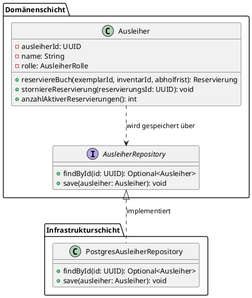
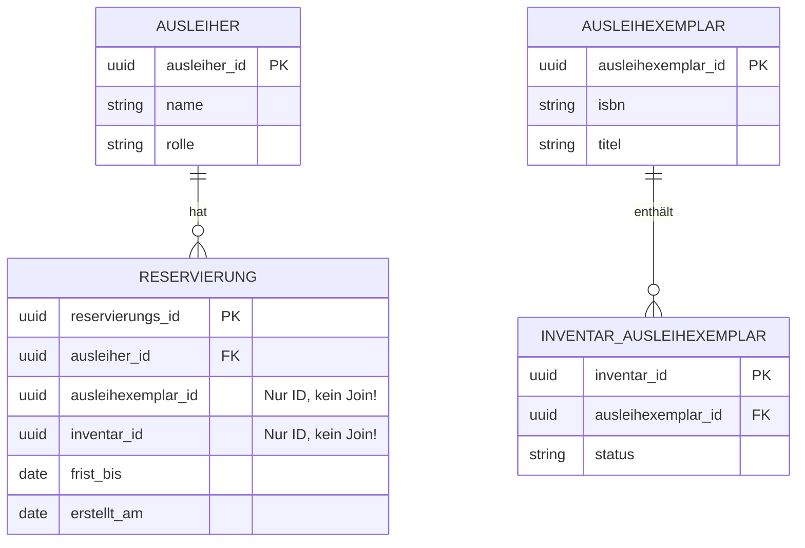
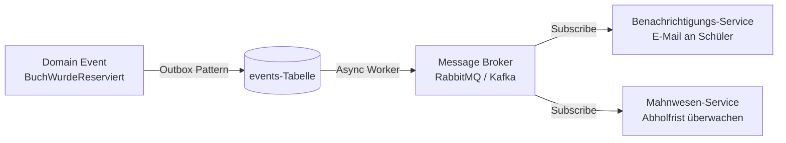
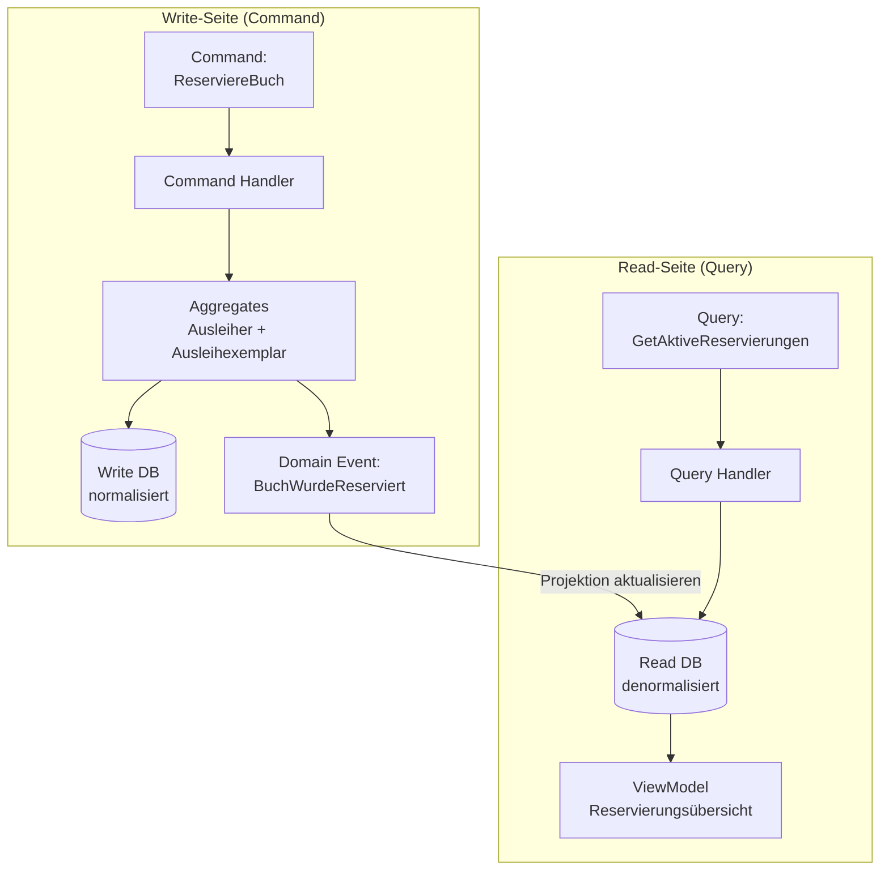

# 3. Datenbank-Design im DDD-Kontext

*Die Datenbank ist ein Implementierungsdetail – das Domänenmodell sollte unabhängig davon entstehen. Doch irgendwann müssen Daten persistiert werden: Wie macht man das richtig?*

Stellen Sie sich vor, ein Architekt entwirft zunächst den perfekten Grundriss eines Hauses – optimiert für das Leben der Bewohner, für Licht und Raumgefühl. Erst danach kommen die Statiker und Haustechniker und überlegen, wie Strom, Wasser und tragende Wände diese Vision unterstützen können. Würde man es umgekehrt machen – also zuerst die Leitungen verlegen und dann den Grundriss anpassen – entstünde ein technisch funktionierendes, aber unpraktisches Haus.

Genau so funktioniert der DDD-Ansatz für die Persistenz. Im DDD gilt der Grundsatz: Entwirf zuerst das **Domänenmodell**, als gäbe es gar keine Datenbank. Erst wenn die Geschäftslogik durchdacht ist, wird überlegt, wie diese Modelle dauerhaft gespeichert werden. Dieser Ansatz nennt sich **Persistence Ignorance** und schützt die Fachlogik vor technischen Kompromissen.

---

## 3.1 Persistence Ignorance & Aggregate-Grenzen

*Die Grenzen des Domänenmodells bestimmen die Grenzen der Datenbankoperationen.*

### Persistence Ignorance – Das Domänenmodell kennt keine Datenbank

**Persistence Ignorance** bedeutet, dass die Klassen im Domänenmodell keinen Datenbankcode enthalten. Sie wissen nicht, ob sie in PostgreSQL, MongoDB oder einer XML-Datei gespeichert werden. Das Speichern und Laden übernimmt ausschließlich das **Repository**.

- **Domänenklassen:** Enthalten nur Geschäftslogik und Geschäftsregeln – kein SQL, kein ORM-spezifischer Code.
- **Repository:** Die einzige Schnittstelle zwischen dem Domänenmodell und der Datenbank. Es übersetzt zwischen Domänenobjekten und Datenbankzeilen.
- **Vorteil:** Die Datenbanktechnologie kann ausgetauscht werden (z. B. von MySQL zu PostgreSQL), ohne dass eine einzige Domänenklasse geändert werden muss.



> <span style="font-size: 1.5em">:bulb:</span> **Merksatz:** Die Domänenklasse `Ausleiher` weiß nichts von Datenbanken. Das `AusleiherRepository` übernimmt die gesamte Persistenzverantwortung – die Domäne bleibt sauber.

### Aggregates als Transaktionsgrenzen

Aggregates sind im DDD nicht nur fachliche Einheiten – sie sind gleichzeitig die **natürlichen Grenzen für Datenbanktransaktionen**.

- **Goldene Regel:** Eine Datenbank-Transaktion sollte idealerweise immer genau *ein* Aggregate ändern.
- **Konsistenz innerhalb eines Aggregates:** Alle Geschäftsregeln und Invarianten gelten ausschließlich innerhalb der Aggregategrenze. Das Aggregate Root stellt sicher, dass das Aggregate immer in einem konsistenten Zustand ist.
- **Kein Fremdschlüssel-Join über Aggregate-Grenzen:** Um lose Kopplung zu erhalten, referenzieren Aggregates einander nur per **ID**, niemals über direkte Objektreferenzen.



> <span style="font-size: 1.5em">:warning:</span> **Achtung:** Wenn eine Transaktion mehrere Aggregates gleichzeitig ändert (z. B. `Ausleiher` und `Ausleihexemplar` in einer einzigen DB-Transaktion), ist das ein Zeichen, dass entweder die Aggregatgrenzen falsch gezogen wurden oder ein **Domain Event** zur asynchronen Koordination fehlt. Im Use Case „Reserviere Buch" werden beide Aggregates bewusst in einer Transaktion gespeichert – das ist eine pragmatische Ausnahme, die explizit begründet sein muss.

---

## 3.2 Mapping von DDD-Bausteinen auf Datenbanktabellen

*Wie werden die abstrakten DDD-Konzepte in konkrete Tabellen und Felder übersetzt?*

Der Übergang vom objektorientierten Domänenmodell zur relationalen Datenbankstruktur – der sogenannte **Impedance Mismatch** – ist eine der häufigsten Herausforderungen in DDD-Projekten. Objekte haben Verhalten, Vererbung und Referenzen; Datenbanktabellen haben Zeilen, Spalten und Fremdschlüssel.

### Entities → Eigene Tabellen

Jede Entity bekommt eine eigene Tabelle. Als Primärschlüssel wird bevorzugt eine **UUID** (Universally Unique Identifier) statt eines auto-inkrementierenden Integers verwendet.

| DDD-Konzept | Datenbank-Entsprechung | Begründung |
|---|---|---|
| Entity | Eigene Tabelle | Braucht eindeutige Identität (PK) |
| Entity-ID | UUID (bevorzugt) | Kann vom Domänenmodell generiert werden, unabhängig von der DB |
| Entity-Attribut | Tabellenspalte | Direktes Mapping |

> <span style="font-size: 1.5em">:mag:</span> **Vertiefung:** Warum UUID statt Integer-ID? Mit UUIDs kann das Domänenmodell die ID *vor* dem Speichern generieren. So entsteht kein Henne-Ei-Problem: „Ich brauche die DB-ID, um das Objekt zu erstellen, aber ich muss es erst erstellen, bevor ich es speichern kann."

### Value Objects → Inline-Felder oder JSON

Value Objects haben keine eigene Identität und werden daher **nicht** in eigene Tabellen ausgelagert:

- **Inline-Felder (bevorzugt bei einfachen Value Objects):** Die Felder des Value Objects werden direkt als Spalten in die Tabelle der übergeordneten Entity aufgenommen.  
  *Beispiel:* Eine `Abholfrist` im Ausleih-Kontext besteht aus `frist_bis` und `erstellt_am` – sie wird als zwei Spalten direkt in der `reservierungen`-Tabelle gespeichert.
  
- **JSON-Spalte (bei komplexen Value Objects):** In modernen Datenbanken (PostgreSQL: `JSONB`, MySQL: `JSON`) kann ein komplexes Value Object als JSON-Dokument gespeichert werden.  
  *Beispiel:* Eine `ISBN` mit Validierungsregeln und Formatierungslogik kann als JSON-Feld gespeichert werden, wenn sie mehrere interne Felder besitzt.

```sql
-- Beispiel: Abholfrist (Value Object) als Inline-Felder in der reservierungen-Tabelle
-- Reservierung (Entity) im Ausleiher-Aggregat
CREATE TABLE reservierungen (
    reservierungs_id    UUID PRIMARY KEY,
    ausleiher_id        UUID NOT NULL REFERENCES ausleiher(ausleiher_id),
    -- Referenz auf anderes Aggregat: NUR die ID, kein Foreign Key Constraint!
    ausleihexemplar_id  UUID NOT NULL,
    inventar_id         UUID NOT NULL,
    -- Abholfrist (Value Object) als Inline-Felder:
    frist_bis           DATE NOT NULL,
    erstellt_am         DATE NOT NULL
);
```

### Aggregates → Tabellengruppe

Alle Tabellen, die zu einem Aggregate gehören, werden als **Einheit** betrachtet:

- Gemeinsame transaktionale Behandlung (ein Aggregate = eine Transaktion).
- Joins innerhalb des Aggregates sind erlaubt und erwünscht.
- Die Aggregate Root-Tabelle ist der Einstiegspunkt für alle Datenbankzugriffe auf dieses Aggregate.

### Domain Events → Event-Tabelle oder Message Broker

Domain Events signalisieren, dass etwas fachlich Bedeutsames passiert ist. Für die Persistenz gibt es zwei Ansätze:

- **Outbox-Pattern (Event-Tabelle):** Das Event wird zusammen mit der Aggregate-Änderung in derselben Transaktion in eine `events`-Tabelle geschrieben. Ein separater Prozess liest diese Tabelle und publiziert die Events an einen Message Broker (z. B. RabbitMQ, Kafka).
- **Event Sourcing:** Statt des aktuellen Zustands werden *alle* Events gespeichert, die zum aktuellen Zustand geführt haben. Der aktuelle Zustand wird durch Wiedergabe aller Events rekonstruiert.



> <span style="font-size: 1.5em">:bulb:</span> **Merksatz:** Das Outbox-Pattern garantiert, dass kein Event verloren geht – auch wenn der Message Broker kurzzeitig nicht erreichbar ist. Die Transaktion umfasst immer sowohl die Datenänderung als auch das Event.

---

## 3.3 CQRS – Trennung von Schreib- und Lesedaten

*Lesen und Schreiben haben oft sehr unterschiedliche Anforderungen – CQRS trägt dem Rechnung.*

Stellen Sie sich eine Bibliothek vor: Das Einpflegen eines neuen Buches (Schreiben) ist ein komplexer Vorgang mit vielen Prüfungen – Dubletten vermeiden, ISBN validieren, Verfügbarkeit setzen. Das Suchen und Anzeigen von Büchern (Lesen) hingegen muss einfach und schnell sein – oft braucht die Anzeige ganz andere Datenstrukturen als die Verwaltung.

**CQRS (Command Query Responsibility Segregation)** ist das Architekturmuster, das dieser Realität Rechnung trägt: Es trennt Schreib-Operationen (**Commands**) von Lese-Operationen (**Queries**) konsequent voneinander.

### Das Write Model – Optimiert für Korrektheit

Das Write Model ist das „klassische" DDD-Modell:

- **Komplex:** Führt Geschäftsregeln und Invarianten aus.
- **Validierend:** Prüft jede Änderung auf Korrektheit.
- **Transaktional:** Eine Schreiboperation ist eine atomare Transaktion.
- **Normalisiert:** Die Daten sind in DDD-konformen Tabellen gespeichert.

### Das Read Model – Optimiert für Performance

Das Read Model ist auf die Bedürfnisse der Darstellung im Frontend zugeschnitten:

- **Denormalisiert:** Daten aus mehreren Tabellen sind bereits vorverarbeitet und zusammengeführt.
- **Flach:** Keine komplexen JOIN-Abfragen zur Laufzeit – die UI bekommt genau das, was sie braucht.
- **Schnell:** Optimiert für Lesezugriffe, oft durch Datenbankviews, materialisierte Views oder separate Read-Tabellen.
- **Entkoppelt:** Kann unabhängig vom Write Model weiterentwickelt werden.



### Read Models in der Praxis

Ein **Read Model** (auch *Projektion* genannt) ist eine Datenstruktur, die speziell für eine bestimmte Ansicht im Frontend erstellt wird:

```sql
-- Write-Modell: normalisiert, DDD-konform
-- Tabellen: ausleiher, reservierungen, ausleihexemplare, inventar_ausleihexemplare

-- Read-Modell: denormalisiert, UI-optimiert
-- Zeigt einem Schüler alle seine aktiven Reservierungen mit Buchtitel und Abholfrist
CREATE MATERIALIZED VIEW aktive_reservierungen_uebersicht AS
SELECT
    r.reservierungs_id,
    r.frist_bis              AS abholfrist,
    a.name                   AS ausleiher_name,
    a.rolle,
    e.titel                  AS buchtitel,
    e.isbn,
    i.status                 AS exemplar_status
FROM reservierungen r
JOIN ausleiher a             ON a.ausleiher_id = r.ausleiher_id
-- Applikations-seitige Joins auf andere Aggregates (kein DB-Constraint)
JOIN ausleihexemplare e      ON e.ausleihexemplar_id = r.ausleihexemplar_id
JOIN inventar_ausleihexemplare i ON i.inventar_id = r.inventar_id
WHERE i.status = 'RESERVED';
```

> <span style="font-size: 1.5em">:bulb:</span> **Merksatz:** CQRS bedeutet nicht zwingend zwei separate Datenbanken – oft genügt eine andere Tabellenstruktur oder eine materialisierte View für Lesedaten, um erhebliche Performance-Vorteile zu erzielen.

> <span style="font-size: 1.5em">:mag:</span> **Vertiefung:** Im Zusammenspiel mit **GraphQL als BFF** (Backend for Frontend) entfaltet CQRS sein volles Potenzial: Das GraphQL-Schema definiert exakt, welche Read Models benötigt werden. Die Query-Resolver lesen aus den denormalisierten Read-Tabellen – extrem schnell, ohne komplexe Joins. Das Write-Modell bleibt davon vollständig unberührt.

---

*Wir haben nun das Backend (DDD) und seine Datenhaltung vollständig durchleuchtet. Zeit, auf die andere Seite zu schauen: das Frontend. Mit **Component Driven Design (CDD)** bauen wir Benutzeroberflächen genauso modular und wartbar wie das Backend.*
