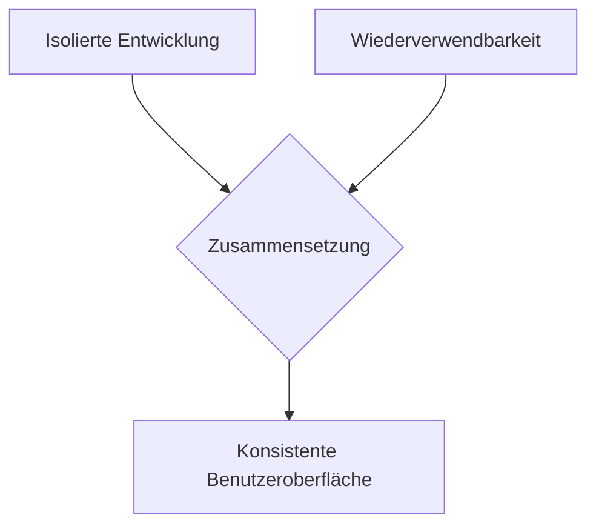
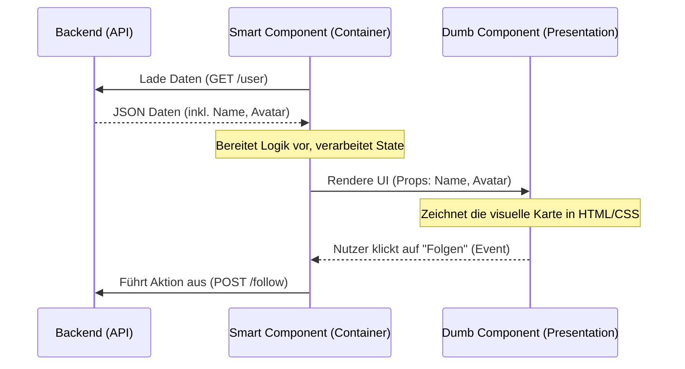

<h1>Systemkonzeption - Kapitel 4: Component Driven Design (CDD)</h1>

<h2>Inhaltsverzeichnis</h2>

- [4. Component Driven Design (CDD) – Frontend-Architektur](#4-component-driven-design-cdd--frontend-architektur)
  - [4.1 Kernprinzipien des CDD](#41-kernprinzipien-des-cdd)
  - [4.2 Atomic Design – Die Komponentenhierarchie](#42-atomic-design--die-komponentenhierarchie)
  - [4.3 Smart vs. Dumb Components](#43-smart-vs-dumb-components)
    - [4.3.1 Dumb Components (Presentational Components)](#431-dumb-components-presentational-components)
    - [4.3.2 Smart Components (Container Components)](#432-smart-components-container-components)

# 4. Component Driven Design (CDD) – Frontend-Architektur

*Im Frontend gilt dieselbe Grundidee wie im Backend: Teile und herrsche. CDD überträgt den Modulgedanken auf die Benutzeroberfläche.*

Stellen Sie sich vor, Sie bauen ein Haus aus Lego-Steinen. Sie gießen nicht erst ein komplettes Plastikhaus in einer einzigen großen Form. Stattdessen beginnen Sie mit einzelnen, standardisierten Steinen – den Komponenten. Sie setzen kleine Steine zusammen, um Fenster und Türen zu bauen, aus denen wiederum Wände und schließlich das ganze Haus entstehen. Jeder Legostein ist in sich geschlossen, kann aber überall wiederverwendet werden.

Genau nach diesem Prinzip funktioniert **Component Driven Design (CDD)**. Es ist eine Methodik, um Benutzeroberflächen (UIs) **modular, wiederverwendbar und konsistent** aufzubauen – beginnend bei den kleinsten Elementen bis hin zu vollständigen Seiten.

Klassische Frontend-Entwicklung baute Seiten – und dann mehr Seiten. Jede Seite war ein Monolith: Button-Stile wurden kopiert, Formulare neu gebaut, Logik dreifach implementiert. CDD dreht das um: Zuerst entstehen wiederverwendbare **Komponenten**, aus denen dann Seiten *zusammengesetzt* werden.

---

## 4.1 Kernprinzipien des CDD

*CDD definiert, wie Komponenten entstehen und miteinander interagieren.*

In der klassischen Webentwicklung wurde oft „seitenbasiert" (*Page-based*) gearbeitet: Man nahm sich das Design einer Webseite und schrieb den gesamten HTML-, CSS- und JavaScript-Code am Stück herunter (Top-Down). Dies führte oft zu sehr großen, unwartbaren Dateien und viel doppeltem Code.

CDD hingegen setzt auf drei zentrale Pfeiler:

- **Isolation:** Jede Komponente ist in sich abgeschlossen – sie funktioniert unabhängig von ihrer Umgebung. Wenn ein Button allein funktioniert, funktioniert er auch überall sonst.
- **Komposition:** Komplexe UI-Elemente entstehen durch das Zusammensetzen einfacherer Komponenten. Eine Komponente kann beliebig viele Unterkomponenten enthalten.
- **Wiederverwendbarkeit:** Eine einmal entwickelte Komponente kann in verschiedenen Kontexten eingesetzt werden – auch über Projektgrenzen hinweg in einer *Component Library* (DRY-Prinzip: *Don't Repeat Yourself*).
- **Vergleich mit Page-based Development:** Im klassischen Ansatz denkt man in Seiten; im CDD denkt man in wiederverwendbaren Bausteinen, die *bottom-up* zu Seiten zusammengesetzt werden.

> :bulb: **Merksatz:** Beim Component Driven Design denken wir die Entwicklung von Benutzeroberflächen von unten nach oben (Bottom-Up). Wir bauen nicht „Webseiten", sondern Bausteinsysteme, aus denen sich Webseiten zusammensetzen lassen.

---

## 4.2 Atomic Design – Die Komponentenhierarchie

*Atomic Design gibt dem CDD eine klare, hierarchische Struktur – von kleinsten Bauteilen bis zu fertigen Seiten.*

Um Chaos im Bausteinsystem zu vermeiden, bedient man sich oft der Methodik des **Atomic Design** (entwickelt von Brad Frost). Diese zieht eine Analogie zur Chemie und unterteilt UI-Elemente in fünf aufeinander aufbauende Ebenen:

- **Atoms (Atome):** Kleinste, nicht weiter teilbare UI-Elemente. Sie machen allein oft keinen Sinn und haben kaum eigene Logik.  
  *Beispiele:* Ein `Button`, ein `Input`-Feld, ein `Label`, eine Farb-Palette, einfache Schriftarten.

- **Molecules (Moleküle):** Sinnvolle Kombinationen von Atoms, die gemeinsam eine spezifische, einfache Aufgabe erfüllen.  
  *Beispiel:* `FormLabel` (Atom) + `Input` (Atom) + `SubmitButton` (Atom) = `SearchField` (Molekül).

- **Organisms (Organismen):** Komplexe, eigenständige UI-Abschnitte aus mehreren Molecules und/oder Atoms.  
  *Beispiele:* Eine komplette `Navigationsleiste`, ein `Produkt-Grid` oder ein vollständiges `Anmelde-Formular`.

- **Templates (Vorlagen):** Layout-Gerüste (*Wireframes*), die zeigen, wie Organisms auf einer Seite angeordnet sind – ohne echte Inhalte.  
  *Beispiel:* Das Grundgerüst für ein `Nutzerprofil-Layout` mit Header oben, Seitenleiste links und Hauptinhalt in der Mitte.

- **Pages (Seiten):** Das fertige Resultat – Templates, befüllt mit echten Inhalten und Daten.  
  *Beispiel:* Das fertig geladene `Nutzerprofil` von Max Mustermann mit echtem Foto und echten Daten.

> :mag: **Vertiefung:** Das Atomic-Design-Modell existiert eher als konzeptionelles Denkmodell als dass es zwingend die exakte Ordnerstruktur des Codes diktiert. Es schärft jedoch das Bewusstsein der Entwickler dafür, wann eine Komponente zu groß wird und besser in kleinere Atome oder Moleküle aufgespalten werden sollte.

---

## 4.3 Smart vs. Dumb Components

*Die wichtigste Trennung im CDD: Wer holt Daten, und wer zeigt Daten an?*

Ein essenzielles Architekturmuster im CDD ist die strikte Trennung von **Logik** und **Darstellung**. Ohne diese Trennung werden UI-Bausteine schnell unflexibel, da sie fest an Backend-Services oder bestimmte Zustände gebunden sind. Wir unterscheiden daher zwei Arten von Komponenten:

### 4.3.1 Dumb Components (Presentational Components)

Dies sind die eigentlichen visuellen „Anzeige"-Komponenten.

- **Zweck:** Sie kümmern sich *ausschließlich* darum, **wie etwas aussieht**.
- **Eigenschaften:**
  - Sie haben keine Ahnung von APIs, Datenbanken oder dem globalen Systemstatus.
  - Sie bekommen alle ihre Daten von *außen* hereingereicht (z. B. über `Props` oder Input-Parameter).
  - Wenn ein Benutzer auf etwas klickt, ändern sie nicht direkt Daten, sondern rufen ein Ereignis (*Event*) auf, um die übergeordnete Komponente zu informieren (z. B. `onSaveClicked`).
- **Beispiel:** Eine `UserProfileCard`-Komponente erhält den Text „Max Mustermann" und zeigt ihn fettgedruckt in einem Kasten an – mehr nicht.

### 4.3.2 Smart Components (Container Components)

Diese Komponenten sind die Manager und Orchestratoren im Hintergrund.

- **Zweck:** Sie kümmern sich darum, **wie etwas funktioniert** und woher die Daten kommen.
- **Eigenschaften:**
  - Sie laden Daten aus dem Backend (z. B. via REST-API oder GraphQL).
  - Sie verwalten den Zustand (*State*) der Anwendung.
  - Sie enthalten selbst kaum HTML/CSS für visuelle Elemente.
  - Stattdessen rendern sie ein oder mehrere *Dumb Components* und geben diesen die aufbereiteten Daten weiter.
- **Beispiel:** Ein `UserProfileContainer` ruft `GET /users/123` auf. Sobald die JSON-Antwort eintrifft, leitet er die Daten als Parameter an die `UserProfileCard` (Dumb Component) weiter.

- **Warum die Trennung wichtig ist:** Dumb Components sind leicht testbar, wiederverwendbar und einfach zu verstehen; Smart Components kapseln die Komplexität an einem einzigen Ort.
- **Faustregel:** So wenige Smart Components wie möglich, so viele Dumb Components wie möglich.

> :warning: **Achtung:** Wenn in derselben Datei sowohl komplexe REST-API-Aufrufe abgefeuert werden als auch CSS-Animationen und umfangreicher HTML-Code stehen, wurde das Smart/Dumb-Prinzip verletzt. UI-Komponenten sollten leichtgewichtig und austauschbar bleiben.

> :bulb: **Merksatz:** Eine Dumb Component ist wie ein Formular-Vordruck – sie weiß nicht, wer sie ausfüllt, aber sie sieht immer gleich aus.

---

*Backend (DDD) und Frontend (CDD) sind nun konzeptionell ausgearbeitet. Doch wie kommunizieren diese beiden Welten miteinander, ohne sich gegenseitig zu blockieren? Die Antwort liegt in einer durchdachten **API-Strategie**.*
