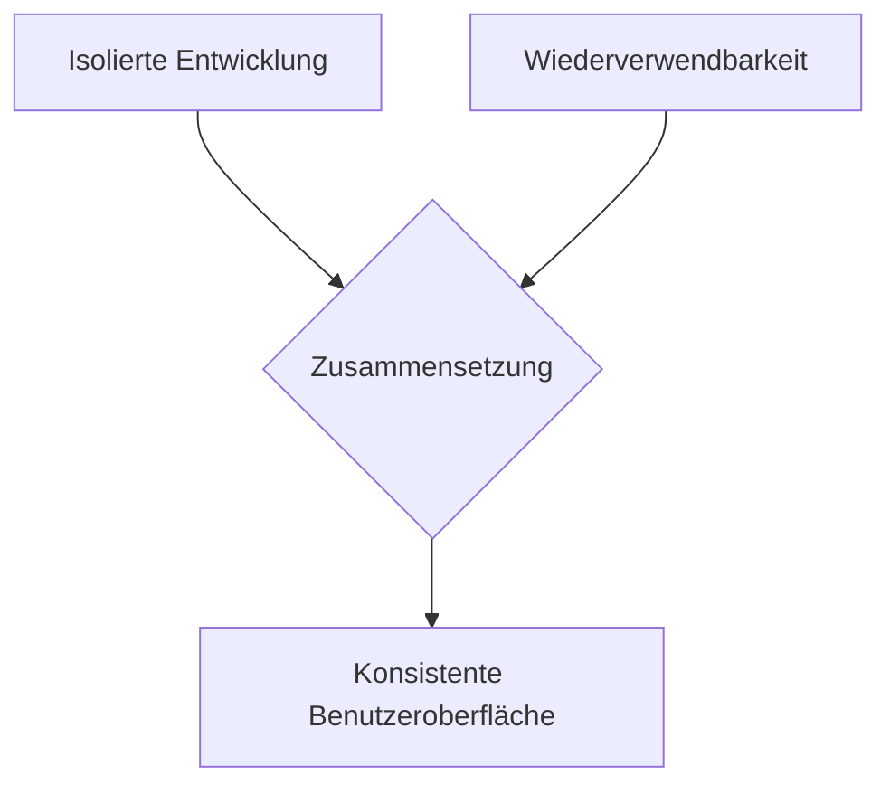
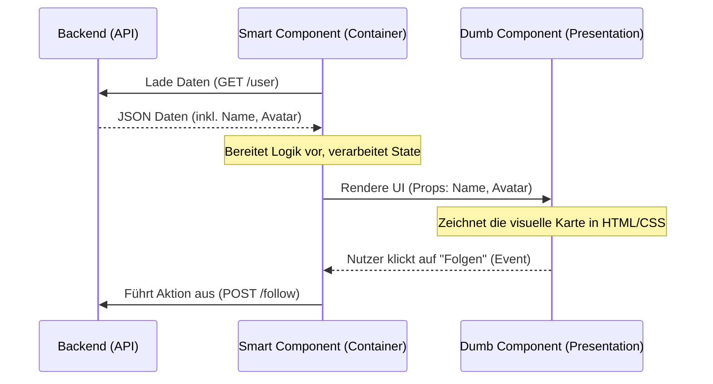

# 3. Component Driven Design (CDD) für Frontend

*Stellen Sie sich vor, Sie bauen ein Haus aus Lego-Steinen. Sie gießen nicht erst ein komplettes Plastikhaus in einer einzigen großen Form. Stattdessen beginnen Sie mit einzelnen, standardisierten Steinen (den Komponenten). Sie setzen kleine Steine zusammen, um Fenster und Türen zu bauen, aus denen wiederum Wände und schließlich das ganze Haus entstehen. Jeder Legostein ist in sich geschlossen, kann aber überall wiederverwendet werden.*

Genau nach diesem Prinzip funktioniert Component Driven Design (CDD). Es ist eine Methodik, um Benutzeroberflächen (UIs) **modular, wiederverwendbar und konsistent** aufzubauen – beginnend bei den kleinsten Elementen bis hin zu vollständigen Seiten.

> :bulb: **Merksatz:** Beim Component Driven Design denken wir die Entwicklung von Benutzeroberflächen von unten nach oben (Bottom-Up). Wir bauen nicht "Webseiten", sondern Bausteinsysteme, aus denen sich Webseiten zusammensetzen lassen.

---

## 3.1 Die Kernprinzipien des CDD

In der klassischen Webentwicklung wurde oft "seitenbasiert" (Page-based) gearbeitet. Man nahm sich das Design einer Webseite (z. B. der Startseite) und schrieb den gesamten HTML-, CSS- und JavaScript-Code am Stück herunter (Top-Down). Dies führte oft zu sehr großen, unwartbaren Dateien und viel doppeltem Code.

CDD hingegen setzt auf drei zentrale Pfeiler:

1. **Isolation:** Jede UI-Komponente (z. B. ein Button, ein Eingabefeld) wird völlig isoliert vom Rest der Anwendung entwickelt und getestet. Wenn der Button allein funktioniert, funktioniert er auch überall sonst.
2. **Komposition (Zusammensetzung):** Komplexe Funktionen entstehen dadurch, dass einfache, gut verstandene Komponenten zusammengesteckt werden. Eine Komponente kann beliebig viele Unterkomponenten enthalten.
3. **Wiederverwendbarkeit:** Hat man einmal einen perfekten "Speichern"-Button mit all seinen Lade- und Fehlerzuständen programmiert, kann dieser im gesamten Projekt (oder sogar über Projektgrenzen hinweg in einer Component Library) wiederverwendet werden (Dry-Prinzip: Don't Repeat Yourself).

---

## 3.2 Atomic Design: Die Systematik der Komponenten

Um Chaos im Bausteinsystem zu vermeiden, bedient man sich oft der Methodik des **Atomic Design** (entwickelt von Brad Frost). Diese zieht eine Analogie zur Chemie und unterteilt UI-Elemente in fünf aufeinander aufbauende Ebenen:

1. **Atoms (Atome):** 
   Die kleinsten, nicht weiter zerteilbaren Bausteine einer UI. Sie machen allein oft keinen Sinn und haben kaum eigene Logik.
   *Beispiele:* Ein `Button`, ein `Input`-Feld (Textfeld), ein `Label`, eine Farb-Palette oder einfache Schriftarten.

2. **Molecules (Moleküle):** 
   Zusammenschlüsse von zwei oder mehr Atomen, die gemeinsam eine spezifische, einfache Aufgabe erfüllen.
   *Beispiel:* Ein `FormLabel` (Atom) + ein `Input` (Atom) + ein `SubmitButton` (Atom) = Ein `SearchField` (Molekül).

3. **Organisms (Organismen):** 
   Komplexere UI-Abschnitte, die aus Gruppen von Molekülen und/oder Atomen oder anderen Organismen bestehen. Sie bilden oft eigenständige Abschnitte einer Benutzeroberfläche.
   *Beispiele:* Eine komplette `Navigationsleiste` (Kopfzeile), ein `Produkt-Grid` (Gitter mit Artikeln) oder ein vollständiges `Anmelde-Formular`.

4. **Templates (Vorlagen):** 
   Hier verlassen wir die chemische Analogie. Templates sind Seitenstrukturen oder Grundgerüste (Wireframes), bei denen Organismen und Moleküle auf einem unsichtbaren Raster angeordnet sind. Noch enthalten sie meist Platzhalter-Daten.
   *Beispiel:* Das Grundgerüst für ein `Nutzerprofil-Layout` mit Header oben, Seitenleiste links und Hauptinhalt in der Mitte.

5. **Pages (Seiten):** 
   Die höchste Ebene. Ein Template wird hierbei mit echten, echten Daten befüllt. Hier sehen wir das finale Produkt in Aktion.
   *Beispiel:* Das fertig geladene `Nutzerprofil` von Max Mustermann mit seinem echten Foto und seinen echten Werten.

> :mag: **Vertiefung:** Das Atomic-Design-Modell existiert eher als konzeptionelles Denkmodell als dass es zwingend die exakte Ordnerstruktur des Codes diktiert. Es schärft jedoch das Bewusstsein der Entwickler dafür, wann eine Komponente zu groß wird und besser in kleinere Atome oder Moleküle aufgespalten werden sollte.

---

## 3.3 Smart vs. Dumb Components (Container vs. Presentational)

Ein weiteres essenzielles Architekturmuster im Component Driven Design ist die strikte Trennung von Logik und Darstellung. Ohne diese Trennung werden UI-Bausteine schnell unflexibel, da sie fest an Backend-Services oder bestimmten Rechendaten kleben. Wir unterscheiden daher zwei Arten von Komponenten:

### 3.3.1 Dumb Components (Presentational Components)
Dies sind die eigentlichen visuellen "Anzeige"-Komponenten. Sie sind im wahrsten Sinne des Wortes "dumm" (dumb).

* **Zweck:** Sie kümmern sich *ausschließlich* darum, wie etwas aussieht.
* **Eigenschaften:**
  * Sie haben keine Ahnung von APIs, Datenbanken oder dem globalen Systemstatus.
  * Sie bekommen alle ihre Daten von *außen* hereingereicht (z. B. über sogenannte `Props` oder Input-Parameter).
  * Wenn ein Benutzer auf etwas klickt, ändern sie nicht direkt Daten, sondern rufen "nur" ein Ereignis (Event) auf, um die übergeordnete Komponente zu informieren (z. B. `onSaveClicked`).
* **Beispiel:** Eine `UserProfileCard`-Komponente. Sie kriegt simply den Text "Max Mustermann" und zeigt ihn fettgedruckt in einem netten Kasten an.

### 3.3.2 Smart Components (Container Components)
Diese Komponenten sind die Manager und Orchestratoren im Hintergrund.

* **Zweck:** Sie kümmern sich darum, wie etwas funktioniert und woher die Daten kommen.
* **Eigenschaften:**
  * Sie laden Daten aus dem Backend (z. B. via REST-API oder GraphQL).
  * Sie verwalten den Zustand (State) der Anwendung.
  * Sie enthalten selbst kaum HTML/CSS für visuelle Elemente. 
  * Stattdessen rendern sie ein oder mehrere *Dumb Components* in sich und geben diesen die frischen Daten weiter.
* **Beispiel:** Ein `UserProfileContainer`. Diese smarte Komponente ruft das API auf: `GET /users/123`. Sobald die JSON-Antwort ("Max Mustermann") eintrifft, leitet sie diesen String als Parameter an die `UserProfileCard` (Dumb Component) weiter.

> :warning: **Achtung:** Wenn in derselben Datei sowohl komplexe REST-API-Aufrufe (Fetch/Axios) abgefeuert werden, als auch wilde CSS-Animationen und tausende Zeilen HTML stehen, wurde das Smart/Dumb-Prinzip verletzt. UI-Komponenten sollten leichtgewichtig und austauschbar bleiben.

---

## Zusammenfassung
Component Driven Design ermöglicht es Frontend-Teams, agiler zu sein. Durch Bottom-Up-Ansätze, klassifizierte Bausteine ("Atomic Design") und strikte Aufgaben-Trennung ("Smart vs. Dumb") entstehen verlässliche, langlebige Benutzeroberflächen, die sich perfekt an ein robustes DDD-Backend (siehe vorheriges Kapitel) anbinden lassen.