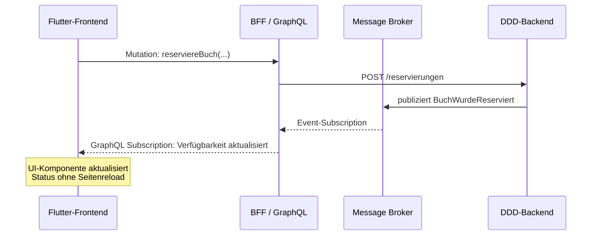
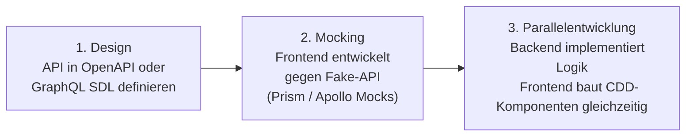
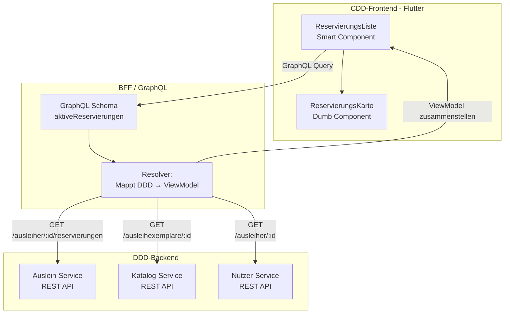
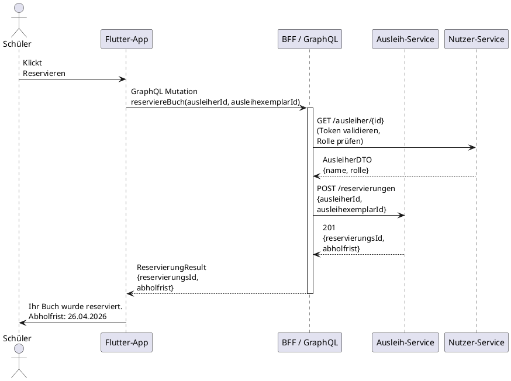
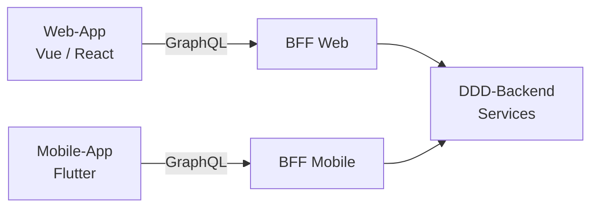

<h1>Systemkonzeption Kapitel 5: API's als Bindeglied zwischen Front- und Backend</h1>

<h2>Inhaltsverzeichnis</h2>

- [5. APIs als Bindeglied zwischen Frontend und Backend](#5-apis-als-bindeglied-zwischen-frontend-und-backend)
  - [5.1 API-Arten und ihre Einsatzbereiche](#51-api-arten-und-ihre-einsatzbereiche)
    - [5.1.1 REST (OpenAPI) – Die Standardlösung](#511-rest-openapi--die-standardlösung)
    - [5.1.2 GraphQL – Der CDD-Enabler](#512-graphql--der-cdd-enabler)
    - [5.1.3 Event-basiert (AsyncAPI) – Für Echtzeit](#513-event-basiert-asyncapi--für-echtzeit)
  - [5.2 API-First](#52-api-first)
    - [5.2.1 API-First – Der Vertrag kommt vor dem Code](#521-api-first--der-vertrag-kommt-vor-dem-code)
    - [5.2.2 OpenAPI / Swagger – Der maschinenlesbare REST-Vertrag](#522-openapi--swagger--der-maschinenlesbare-rest-vertrag)
    - [5.2.3 AsyncAPI – Der Vertrag für Events](#523-asyncapi--der-vertrag-für-events)
  - [5.3 Das BFF-Pattern (Backend for Frontend)](#53-das-bff-pattern-backend-for-frontend)
    - [5.3.1 Das Problem: DDD-Domänenmodell ≠ UI-Modell](#531-das-problem-ddd-domänenmodell--ui-modell)
    - [5.3.2 Was ist das BFF?](#532-was-ist-das-bff)
    - [5.3.3 Aufgaben des BFF](#533-aufgaben-des-bff)
    - [5.3.4 Praxisbeispiel: BFF für den Use Case „Reserviere Buch"](#534-praxisbeispiel-bff-für-den-use-case-reserviere-buch)
    - [5.3.5 BFF pro Frontend-Typ](#535-bff-pro-frontend-typ)

<div style="page-break-after: always;"></div>


# 5. APIs als Bindeglied zwischen Frontend und Backend

*DDD und CDD entstehen oft in getrennten Teams – damit sie trotzdem reibungslos zusammenarbeiten, braucht es klare, stabile Verträge: die APIs.*

Stellen Sie sich vor, zwei Gewerke bauen gemeinsam ein Haus: Die Elektriker verlegen die Leitungen, die Tischler fertigen die Einbauschränke – beide arbeiten gleichzeitig, an unterschiedlichen Orten. Damit alles passt, wenn sie zusammentreffen, brauchen sie einen gemeinsamen Plan: die Position jeder Steckdose, die Abmessungen jedes Schranks. In der Softwareentwicklung ist dieser Plan die **API**.

Eine API (Application Programming Interface) ist der Vertrag zwischen zwei Systemen. Sie definiert, was angeboten wird, in welchem Format und unter welchen Bedingungen. Je klarer dieser Vertrag, desto unabhängiger können das DDD-Backend-Team und das CDD-Frontend-Team arbeiten – und desto früher können beide parallel loslegen.

---

## 5.1 API-Arten und ihre Einsatzbereiche

*Je nach Anwendungsfall eignen sich unterschiedliche API-Stile – die richtige Wahl hängt von den Anforderungen der Konsumenten ab.*

Nicht jede Schnittstelle hat dieselben Anforderungen. Eine API, die eine einfache Liste von Büchern liefert, hat andere Bedürfnisse als eine API, die komplexe Reservierungszustände in Echtzeit an das Frontend übermittelt.

| API-Typ | Fokus | Stärken | Ideal für |
|:---|:---|:---|:---|
| **REST (OpenAPI)** | Ressourcen | Standardisiert, einfach zu cachen, zustandslos | Supporting / Generic Domains, CRUD-Operationen, öffentliche Schnittstellen |
| **GraphQL** | Bedarfsgerecht | Kein Over- / Underfetching, Client bestimmt die Struktur, stark typisiert | Core Domain, komplexe UIs mit tief verschachtelten Daten |
| **Event-basiert (AsyncAPI)** | Nachrichten | Echtzeit, lose Kopplung, hohe Skalierbarkeit | Benachrichtigungen, Live-Updates, langlaufende Prozesse |
| **gRPC** | Performance | Binärprotokoll, stark typisiert, sehr schnell | Service-zu-Service-Kommunikation im Backend |

### 5.1.1 REST (OpenAPI) – Die Standardlösung

**REST (Representational State Transfer)** ist das meistverwendete API-Paradigma. Es ist ressourcenorientiert: Jede URL repräsentiert eine Ressource, HTTP-Methoden (`GET`, `POST`, `PUT`, `DELETE`) definieren die Aktion.

- **Gut geeignet** für die **Supporting Domain** und **Generic Domain** der Schulbibliothek (z. B. Benutzerverwaltung, Buchkatalog-Einträge), wo sich das Datenmodell selten ändert und standardisierte CRUD-Operationen ausreichen.
- **OpenAPI / Swagger** beschreibt die Schnittstelle maschinenlesbar – daraus können automatisch Client-Code, Server-Stubs und Dokumentation generiert werden.

```yaml
# Ausschnitt einer OpenAPI-Spezifikation für den Reservierungs-Endpunkt
paths:
  /reservierungen:
    post:
      summary: Buch reservieren
      operationId: reserviereBuch
      requestBody:
        required: true
        content:
          application/json:
            schema:
              $ref: '#/components/schemas/ReservierungRequest'
      responses:
        '201':
          description: Reservierung erfolgreich angelegt
          content:
            application/json:
              schema:
                $ref: '#/components/schemas/ReservierungResponse'
        '422':
          description: Reservierungslimit erreicht oder kein Exemplar verfügbar
```

### 5.1.2 GraphQL – Der CDD-Enabler

In der **Core Domain** ist die Domänenlogik komplex. Ein CDD-Frontend besteht aus vielen kleinen Atomen und Molekülen, die jeweils unterschiedliche Teilmengen eines DDD-Aggregats benötigen. Hier zeigt GraphQL seine Stärken:

- **Kein Over-Fetching:** Eine `ReservierungsKarte`-Komponente (Atom) benötigt nur Titel und Abholfrist – sie holt nicht die gesamte Reservierung mit allen verschachtelten Daten.
- **Kein Under-Fetching:** Eine `ReservierungsDetail`-Seite benötigt alle Felder – sie stellt eine einzige Anfrage, die alles auf einmal liefert.
- **Schema Definition Language (SDL):** Das GraphQL-Schema ist der maschinenlesbare Vertrag zwischen Frontend und Backend.

```graphql
# GraphQL-Schema: Abfrage der aktiven Reservierungen eines Schülers
type Query {
  aktiveReservierungen(ausleiherId: ID!): [ReservierungView!]!
}

type ReservierungView {
  reservierungsId: ID!
  buchtitel: String!
  isbn: String!
  abholfrist: String!
  exemplarStatus: ExemplarStatus!
}

enum ExemplarStatus {
  RESERVED
  AVAILABLE
  BORROWED
}

# Mutation für den Use Case "Reserviere Buch"
type Mutation {
  reserviereBuch(ausleiherId: ID!, ausleihexemplarId: ID!): ReservierungResult!
}

type ReservierungResult {
  reservierungsId: ID!
  abholfrist: String!
}
```

### 5.1.3 Event-basiert (AsyncAPI) – Für Echtzeit

Wenn das DDD-Backend **Domain Events** publiziert (z. B. `BuchWurdeReserviert`), kann das Frontend darüber informiert werden – ohne Polling, in Echtzeit. **AsyncAPI** ist das Pendant zu OpenAPI für ereignisbasierte Kommunikation.

- **Anwendungsfall:** Nach einer Reservierung soll die Verfügbarkeitsanzeige im Frontend sofort aktualisiert werden, ohne dass die Seite neu geladen werden muss.



> <span style="font-size: 1.5em">:bulb:</span> **Merksatz:** Wähle den API-Typ nach dem Bedürfnis des Consumers: REST für stabile CRUD-Ressourcen, GraphQL für flexible UI-Abfragen in der Core Domain, Events für Echtzeit-Reaktionen.

---

## 5.2 API-First

*Wer zuerst die API definiert, ermöglicht parallele Entwicklung – wer zuletzt definiert, bremst das gesamte Team.*

### 5.2.1 API-First – Der Vertrag kommt vor dem Code

**API-First** bedeutet: Die API-Spezifikation wird *vor* der Implementierung erstellt und von beiden Teams als verbindlicher Vertrag akzeptiert. Kein Code wird geschrieben, bevor der Vertrag steht.

Der Workflow in drei Schritten:



**Vorteile für den Use Case „Reserviere Buch":**

- Das **Flutter-Frontend-Team** kann sofort mit dem Bau der `ReservierungsFormular`-Komponente beginnen, sobald der Endpunkt `POST /reservierungen` in OpenAPI beschrieben ist – ohne auf das Backend zu warten.
- Das **Backend-Team** kann die Domänenlogik (Invarianten, Aggregate) unabhängig implementieren und testen.
- Beide Teams treffen sich erst zur Integration – und der Vertrag stellt sicher, dass alles passt.

### 5.2.2 OpenAPI / Swagger – Der maschinenlesbare REST-Vertrag

**OpenAPI** ist das Standardformat zur maschinenlesbaren Beschreibung von REST-APIs. Aus einer einzigen `.yaml`-Datei können automatisch generiert werden:

- **Server-Stubs** (Backend): Spring-Controller-Interfaces, die das Backend implementieren muss.
- **Client-Code** (Frontend): Dart-Klassen für Flutter, die den HTTP-Aufruf kapseln.
- **Dokumentation**: Swagger-UI, die das Team in einem Browser durchsuchen kann.

### 5.2.3 AsyncAPI – Der Vertrag für Events

**AsyncAPI** ist das Äquivalent zu OpenAPI für ereignisbasierte Schnittstellen. Es beschreibt, welche Domain Events publiziert werden, über welche Kanäle (Queues, Topics) und in welchem Format.

```yaml
# Ausschnitt AsyncAPI: Domain Event BuchWurdeReserviert
channels:
  buch-reserviert:
    publish:
      message:
        name: BuchWurdeReserviert
        payload:
          type: object
          properties:
            reservierungsId:
              type: string
              format: uuid
            ausleihexemplarId:
              type: string
              format: uuid
            abholfrist:
              type: string
              format: date
```


> <span style="font-size: 1.5em">:bulb:</span> **Merksatz:** API-First bedeutet: Die Schnittstelle ist der Vertrag – Code auf beiden Seiten ist lediglich die Erfüllung dieses Vertrags. Consumer-Driven Contracts stellen sicher, dass der Vertrag eingehalten bleibt.

---

## 5.3 Das BFF-Pattern (Backend for Frontend)

*Manchmal passt das Backend-Modell nicht direkt zur Darstellung im Frontend – das BFF löst dieses Impedance-Mismatch.*

### 5.3.1 Das Problem: DDD-Domänenmodell ≠ UI-Modell

Das DDD-Backend denkt in **Aggregaten und Bounded Contexts** – optimiert für Korrektheit der Geschäftslogik. Das CDD-Frontend denkt in **Komponenten und ViewModels** – optimiert für Darstellung und Benutzerinteraktion. Diese zwei Welten haben unterschiedliche Bedürfnisse:

| DDD-Backend liefert | CDD-Frontend braucht |
|:---|:---|
| `Ausleiher`-Aggregat mit verschachtelten `Reservierung`-Entities | Flaches `ReservierungsKartenViewModel` mit Titel, Abholfrist, Status |
| Separates `Ausleihexemplar`-Aggregat mit `InventarAusleihexemplar`-Liste | Einen einzigen aggregierten Datensatz pro Reservierung |
| Fachliche Domain-Exceptions (`DomainException`) | Benutzerfreundliche Fehlermeldungen in der UI-Sprache |

### 5.3.2 Was ist das BFF?

Ein **Backend for Frontend (BFF)** ist ein schlanker, frontend-spezifischer Adapter-Service, der zwischen dem DDD-Backend und dem CDD-Frontend vermittelt. Er „übersetzt" die Domänenwelt in die Komponentenwelt.



### 5.3.3 Aufgaben des BFF

- **Datenaggregation:** Das BFF ruft mehrere Backend-Services auf und fasst die Antworten zu einem einzigen ViewModel zusammen. Die `ReservierungsListe`-Komponente braucht keine drei separate API-Aufrufe zu machen.
- **Transformation:** Das BFF übersetzt DDD-Domänenobjekte (mit allen fachlichen Details) in frontend-freundliche ViewModels (nur die für die UI relevanten Felder).
- **Authentifizierungslogik:** Das BFF validiert JWT-Tokens und fügt Benutzerinformationen zu Anfragen hinzu, bevor sie an die Backend-Services weitergeleitet werden.
- **Fehlerübersetzung:** Eine `DomainException("Reservierungslimit erreicht")` wird in eine benutzerfreundliche Fehlermeldung übersetzt: „Sie haben bereits 3 aktive Reservierungen."

### 5.3.4 Praxisbeispiel: BFF für den Use Case „Reserviere Buch"

Die Flutter-App sendet eine GraphQL-Mutation an das BFF. Das BFF übernimmt die gesamte Orchestrierung:



### 5.3.5 BFF pro Frontend-Typ

In der Praxis gibt es oft ein BFF pro Frontend-Kanal, da Web-App und Mobile-App unterschiedliche Datenanforderungen haben:



> <span style="font-size: 1.5em">:mag:</span> **Vertiefung:** **GraphQL als BFF:** GraphQL eignet sich besonders gut als BFF-Technologie, da der Client über das Schema flexibel entscheiden kann, welche Felder er benötigt – ohne dass das BFF für jede neue UI-Anforderung angepasst werden muss. Ein GraphQL-Resolver übernimmt die Aggregations- und Transformationslogik.

> <span style="font-size: 1.5em">:bulb:</span> **Merksatz:** Das BFF ist der Übersetzer zwischen zwei Welten: Es spricht mit dem DDD-Backend in der Sprache der Domäne und mit dem CDD-Frontend in der Sprache der Komponenten.


