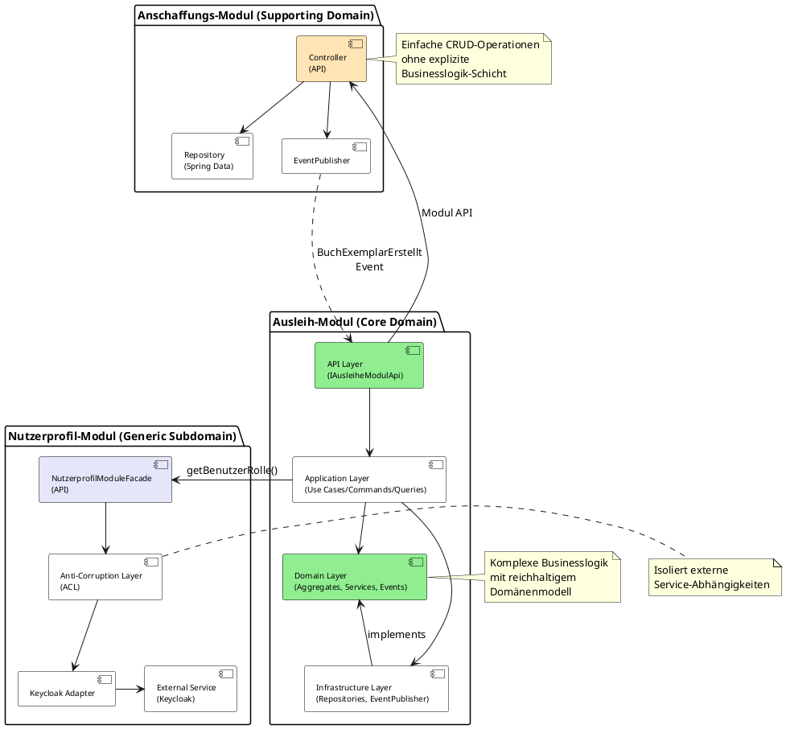
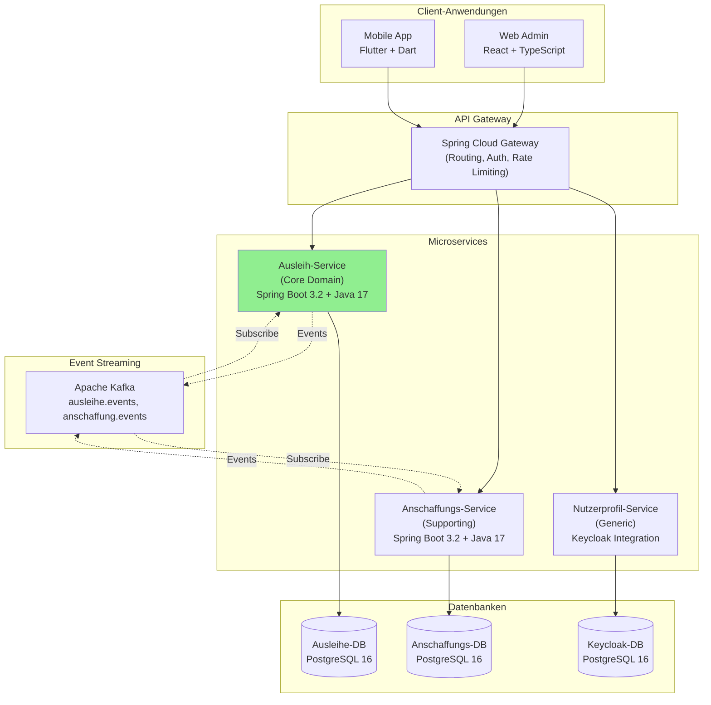

# 6 Modularer Monolith vs. Microservices: Die richtige Architektur für Team und Projekt

Die Identifikation von Bounded Contexts durch DDD ist eine fundamentale strategische Entscheidung – sie zeigt uns die natürlichen fachlichen Grenzen unserer Software. Doch wie setzen wir diese Grenzen in eine konkrete technische Architektur um? Die Antwort hängt maßgeblich von zwei Faktoren ab: der **Größe und Struktur des Entwicklungsteams** und dem **erwarteten Wachstum und der Komplexität des Systems**.

In diesem Kapitel untersuchen wir, wie sich dieselben Bounded Contexts je nach Kontext in unterschiedliche Architekturmuster übersetzen lassen: vom **modularen Monolithen** für kleinere, fokussierte Teams bis hin zu **Microservice-Architekturen** für große, verteilte Organisationen. Wir werden dabei unsere Schulbibliothek als durchgängiges Beispiel verwenden.

### 6.1 Die Ausgangssituation: Bounded Contexts als fachliche Blaupause

Unabhängig von der gewählten Architektur haben wir durch DDD bereits klare fachliche Grenzen definiert. Für unsere Schulbibliothek sind das:

-   **Ausleih-Kontext (Core Domain):** Verwaltung von Ausleihen, Rückgaben, Mahnungen
-   **Anschaffungs-Kontext (Supporting Subdomain):** Beschaffung und Katalogisierung neuer Bücher
-   **Nutzerprofil-Kontext (Generic Subdomain):** Verwaltung der Benutzerstammdaten

Diese fachlichen Grenzen bleiben konstant. Was sich ändert, ist die **Art der technischen Isolation** zwischen diesen Kontexten.

> <span style="font-size: 1.5em">💡</span> **Architektur-Denkweise:** Die Architektur-Komplexität sollte sich an der **fachlichen Komplexität** orientieren. Der Core Domain (Ausleih-Kontext) mit komplexer Geschäftslogik verdient ein ausgefeiltes Pattern wie Hexagonal Architecture oder CQRS. Supporting Domains (Anschaffungs-Kontext) mit einfacher CRUD-Last können mit **vereinfachten Mustern** arbeiten – etwa einer **CRUD-Architektur ohne explizite Businesslogik-Schicht**. Generic Subdomains (Nutzerprofil-Kontext) werden oft als externe Services (z.B. Keycloak) integriert. Das Ziel ist nicht "Architektur-Perfektion überall", sondern **proportionale Investition** in die Komplexität, wo sie geschäftlich relevant ist.

> <span style="font-size: 1.5em">:bulb:</span> **Merksatz:** Die Bounded Contexts aus dem strategischen Design sind die stabile Grundlage. Die Architektur ist die variable Umsetzungsform, die sich an die organisatorischen und technischen Rahmenbedingungen anpasst.

### 6.2 Szenario 1: Der modulare Monolith – Architektur für kleine Teams

Der modulare Monolith ist das Architektur-Muster der Wahl für Teams, die eine klare fachliche Struktur (Bounded Contexts) bewahren wollen, ohne dabei die operative Komplexität von verteilten Systemen zu akzeptieren. In diesem Szenario werden wir zunächst die Bedingungen klären, unter denen diese Architektur optimal ist. Danach definieren wir, was einen modularen Monolithen ausmacht – nicht als Monolith im klassischen Sinne (eine große, wenig strukturierte Anwendung), sondern als sorgfältig organisiertes System mit klaren, durchgesetzten Modulgrenzen. Die darauffolgenden Abschnitte werden zeigen, wie jedes Modul intern strukturiert wird (mit stark modularner Architektur wie die Clean-Architecture oder einfach strukturiert wie die CRUD-Architecture), wie die Module miteinander kommunizieren (synchron über APIs oder asynchron über Events), wie die Datenbank-Strategie (separate Schemata vs. gemeinsame Datenbank) umgesetzt wird, und wie die konkrete Projektstruktur aussieht. Abschließend werden wir die Vorteile dieser Architektur (einfaches Deployment, klare Grenzen, keine Netzwerk-Komplexität) den Herausforderungen (Disziplin erforderlich, Skalierungsgrenzen) gegenüberstellen.

#### 6.2.1 Wann ist ein modularer Monolith die richtige Wahl?

Ein **modularer Monolith** ist die ideale Architektur, wenn folgende Bedingungen vorliegen:

-   **Kleines bis mittelgroßes Team (4-10 Entwickler):** Das gesamte Team kann an einer Code-Basis arbeiten, ohne dass permanente Merge-Konflikte entstehen.
-   **Überschaubare Nutzerzahl:** Die erwartete Last lässt sich mit einer einzigen, vertikal skalierbaren Anwendungsinstanz bewältigen.
-   **Begrenzte operative Kapazität:** Es gibt kein dediziertes DevOps-Team für die Verwaltung komplexer Container-Orchestrierung, Monitoring und verteilter Logging-Infrastruktur.
-   **Fokus auf schnelle Entwicklung:** Die Geschwindigkeit der Feature-Entwicklung hat Vorrang vor maximaler Skalierbarkeit oder Team-Autonomie.
-   **Transaktionale Konsistenz:** Viele Geschäftsprozesse erfordern ACID-Transaktionen über mehrere Domänen hinweg.

> <span style="font-size: 1.5em">:mag:</span> **Beispiel: Die Schulbibliothek**
>
> Eine typische Schulbibliothek hat 500-2000 Schüler und Lehrer. Das IT-Team besteht angenommen aus 2-5 Entwicklern (oder sogar Schülern in einem Projektunterricht). Die Ausleihlast ist vorhersehbar (Spitzen zu Semesterbeginn). Hier ist ein verteiltes Microservice-System nicht nur unnötig komplex, sondern auch schwer wartbar. Ein modularer Monolith bietet alle Vorteile von DDD, ohne die operative Last von Microservices.

#### 6.2.2 Was ist ein modularer Monolith?

Ein modularer Monolith ist eine **einzelne, deploybare Anwendung**, die intern in **klar getrennte, lose gekoppelte Module** strukturiert ist. Jedes Modul entspricht einem Bounded Context und hat:

-   **Eigene Pakete/Namespaces:** Die Code-Basis ist logisch getrennt (z.B. `Bibliothek.Ausleihe`, `Bibliothek.Anschaffung`, `Bibliothek.Nutzerprofil`).
-   **Definierte Schnittstellen:** Module kommunizieren ausschließlich über öffentliche APIs, nie über direkte Klassenabhängigkeiten quer durch die Kontexte.
-   **Eigene Datenzugriffschicht:** Idealerweise hat jedes Modul sein eigenes Datenbank-Schema (oder zumindest separate Tabellen), um fachliche Unabhängigkeit zu wahren.
-   **Optionale Event-basierte Kommunikation:** Für asynchrone Prozesse können Module über interne Events kommunizieren (z.B. mit MediatR in .NET oder einem internen Event-Bus).

Die **Bounded Context-Grenzen** werden also durch **architektonische Konventionen und Code-Organisation** erzwungen, nicht durch Prozessgrenzen.

### 6.3 Architektur der Schulbibliothek als modularer Monolith

#### 6.3.1 Interne Architektur jedes Moduls: Architektur proportional zur Komplexität

Die interne Architektur jedes Moduls richtet sich nach der **fachlichen Komplexität** des Bounded Context:

**Core Domain (Ausleih-Modul):** Verwendet **Hexagonal Architecture** mit klarer Trennung von Domain, Application und Infrastructure Layer. Dies stellt sicher, dass das komplexe Domänenmodell rein und unabhängig von Infrastruktur bleibt.

**Supporting Domain (Anschaffungs-Modul):** Verwendet eine **einfache CRUD-Architektur** ohne explizite Businesslogik-Schicht. Da hier hauptsächlich Daten verwaltet werden (Katalogisierung, Bestellungen), reicht eine direkte Controller → Repository → Database Struktur.

**Generic Subdomain (Nutzerprofil-Modul):** Wird über einen **Anti-Corruption Layer (ACL)** an einen externen Service (Keycloak) angebunden.



**Kernprinzipien für Core Domain (Ausleih-Modul):**

1.  **Domain Layer:** Enthält die reinen Geschäftsregeln (Aggregate, Entities, Value Objects, Domain Services). Keine Abhängigkeiten zu Frameworks oder Datenbanken.
2.  **Application Layer:** Orchestriert Use Cases. Lädt Aggregate über Repositories, ruft Domänenmethoden auf, speichert Ergebnisse. Hier leben Commands (CQRS) und Application Services.
3.  **Infrastructure Layer:** Implementiert die technischen Details (JPA Repositories, HTTP-Clients, File-System-Zugriff).
4.  **API Layer:** Die öffentliche Fassade des Moduls. Nur diese Schnittstelle ist für andere Module sichtbar.

**Kernprinzipien für Supporting Domain (Anschaffungs-Modul):**

1.  **Modul API Controller:** Bietet CRUD-Endpoints für Katalogeinträge und Bestellungen.
2.  **JPA Entities:** Einfache Datenmodelle ohne Businesslogik (anämisches Domänenmodell).
3.  **Spring Data Repositories:** Automatisch generierte CRUD-Operationen.
4.  **Keine explizite Businesslogik-Schicht:** Die Logik ist minimal und kann direkt im Controller bleiben.

> <span style="font-size: 1.5em">:warning:</span> **Achtung: Module dürfen niemals direkt auf die internen Schichten anderer Module zugreifen!** Alle Kommunikation läuft ausschließlich über die **öffentlichen APIs** oder über **Events**.

#### 6.3.2 Kommunikation zwischen Modulen im Monolithen

Obwohl alle Module in einer Anwendung laufen, müssen die Bounded Context-Grenzen respektiert werden. Es gibt zwei Haupt-Kommunikationsmuster:

**1. Synchrone Kommunikation über Modul-APIs**

-   **Szenario:** Das Ausleih-Modul muss prüfen, ob ein Benutzer die Rolle "Lehrer" hat, um die Leihfrist zu bestimmen.
-   **Implementierung:** Das Ausleih-Modul ruft die öffentliche Schnittstelle `INutzerprofilModulApi` auf.

```java
// In module-nutzerprofil/api/
public interface NutzerprofilModuleFacade {
    BenutzerRolleDto getBenutzerRolle(UUID benutzerId);
}

// In module-ausleihe/application/service/
@Service
@Transactional
public class AusleiheApplicationService implements BuchAusleihenUseCase {
    
    private final AusleiheRepository ausleiheRepo;
    private final AusleihExemplarRepository exemplarRepo;
    private final NutzerprofilModuleFacade nutzerprofilFacade; // Abhängigkeit zur API, NICHT zur Domain!
    private final EventPublisher eventPublisher;
    
    @Override
    public AusleiheDto handle(BuchAusleihenCommand cmd) {
        // 1. Rolle über Modul-Facade abrufen
        BenutzerRolleDto rolle = nutzerprofilFacade.getBenutzerRolle(cmd.getBenutzerId());
        
        // 2. Aggregate laden
        Ausleiher ausleiher = ausleiheRepo.findById(cmd.getBenutzerId())
            .orElseThrow(() -> new AusleiherNotFoundException(cmd.getBenutzerId()));
        AusleihExemplar exemplar = exemplarRepo.findById(cmd.getExemplarId())
            .orElseThrow(() -> new ExemplarNotFoundException(cmd.getExemplarId()));
        
        // 3. Geschäftslogik im Aggregat ausführen
        Ausleihe ausleihe = ausleiher.leiheBuchAus(
            exemplar, 
            LeihfristPolicy.fromRolle(rolle.getRolle())
        );
        
        // 4. Speichern und Event publizieren
        ausleiheRepo.save(ausleiher);
        eventPublisher.publish(new BuchAusgeliehenEvent(
            ausleihe.getId(),
            cmd.getBenutzerId(),
            cmd.getExemplarId()
        ));
        
        return AusleiheMapper.toDto(ausleihe);
    }
}
```

**Wichtig:** Das Ausleih-Modul erhält nur ein **DTO** (`BenutzerRolleDto`), nie das vollständige `Benutzerkonto`-Aggregat. Dies verhindert eine fachliche Kopplung.

**2. Asynchrone Kommunikation über Events**

-   **Szenario:** Wenn ein neues Buch im Anschaffungs-Modul erfolgreich katalogisiert wurde, soll das Ausleih-Modul automatisch ein `AusleihExemplar` anlegen.
-   **Implementierung:** Das Anschaffungs-Modul publiziert ein Event. Das Ausleih-Modul lauscht darauf.

```java
// In module-anschaffung/domain/event/
public record BuchExemplarErstelltEvent(
    String isbn,
    UUID inventarId,
    String signatur
) {}

// In module-anschaffung/application/service/
@Service
public class BuchAnschaffenService {
    
    private final ApplicationEventPublisher eventPublisher;
    
    public void handle(BuchAnschaffenCommand cmd) {
        // ... Buch wird bestellt und inventarisiert ...
        UUID neueInventarId = UUID.randomUUID();
        
        // Event publishen (In-Process Spring Events)
        eventPublisher.publishEvent(new BuchExemplarErstelltEvent(
            katalogEintrag.getIsbn(),
            neueInventarId,
            katalogEintrag.getSignatur()
        ));
    }
}

// In module-ausleihe/adapter/in/eventhandler/
@Component
public class BuchExemplarErstelltEventHandler {
    
    private final AusleihExemplarRepository repo;
    
    @EventListener
    @Transactional(propagation = Propagation.REQUIRES_NEW)
    public void handle(BuchExemplarErstelltEvent evt) {
        // Neues AusleihExemplar in der Ausleih-Datenbank anlegen
        AusleihExemplar exemplar = new AusleihExemplar(
            evt.inventarId(),
            evt.isbn()
        );
        repo.save(exemplar);
    }
}
```

Dieser Ansatz sorgt für **lose Kopplung**. Das Anschaffungs-Modul weiß nichts vom Ausleih-Modul.

> <span style="font-size: 1.5em">:bulb:</span> **Merksatz:** Events im modularen Monolithen sind **In-Process**. Sie werden nicht über einen externen Message Broker (wie Kafka) gesendet, sondern über Spring's `ApplicationEventPublisher`. Das ist viel einfacher als in Microservices, bietet aber dieselbe fachliche Entkopplung. Die `@EventListener`-Methode kann in einer separaten Transaktion laufen (`REQUIRES_NEW`), um die Unabhängigkeit der Module zu wahren.

#### 6.3.3 Datenbank-Strategie im modularen Monolithen

Es gibt zwei gängige Ansätze:

**Option 1: Separate Datenbank-Schemata (empfohlen)**

-   Jedes Modul hat sein eigenes Datenbank-Schema in PostgreSQL (`ausleihe_schema`, `anschaffung_schema`, `nutzerprofil_schema`).
-   Module greifen nur auf ihr eigenes Schema zu.
-   **Vorteil:** Maximale Unabhängigkeit. Ein späterer Übergang zu Microservices wird einfacher.
-   **Nachteil:** Transaktionen über Modulgrenzen hinweg sind nicht möglich (man muss auf Event-basierte Konsistenz oder Saga-Muster zurückgreifen).

**Option 2: Gemeinsame PostgreSQL-Datenbank, strikte Tabellentrennung**

-   Alle Module verwenden dieselbe PostgreSQL-Datenbank, aber jedes Modul hat seine eigenen Tabellen (z.B. `ausleihe_*`, `anschaffung_*`).
-   **Regel:** Ein Modul darf NIEMALS direkt via SQL auf die Tabellen eines anderen Moduls zugreifen.
-   **Vorteil:** ACID-Transaktionen über Module hinweg sind möglich (wenn absolut nötig).
-   **Nachteil:** Die Versuchung, die Grenze zu verletzen, ist groß. Erfordert Disziplin und Code-Reviews.

Für die Schulbibliothek empfehlen wir **Option 1** (separate Schemata), da transaktionale Konsistenz über die Core Domain hinaus selten erforderlich ist.

#### 6.3.4 Projektstruktur (Beispiel: Spring Boot 3.2 + Java 17)

Ausgehend von: 

- einer **Hexagonalen Architektur** für die **Core-Domain** (Ausleih-Kontext)
- einer **CRUD-Architektur** für die **Supporting-Domain** (Anschaffungs-Kontext)
- die Verwendung eines **Anti-Corruption-Layers** (ACL) für die **Generic-Domain** (Nutzerprofil-Kontext)
- **getrennte DB-Schemas** für jede einzelne Domain 

ergibt sich folgende Projektstruktur:

```
schulbibliothek/
├── pom.xml                                   # Maven Multi-Module Project
│
├── schulbibliothek-app/                      # Host-Anwendung (Einstiegspunkt)
│   ├── pom.xml
│   └── src/main/
│       ├── java/com/schulbib/
│       │   ├── SchulbibliothekApplication.java
│       │   └── config/
│       │       └── SecurityConfig.java
│       └── resources/
│           ├── application.yml
│           └── db/migration/                 # Flyway Migrations
│               ├── V1__Init_Ausleihe_Schema.sql
│               ├── V1__Init_Anschaffung_Schema.sql
│               ├── V1__Init_Nutzerprofil_Schema.sql
│               └── V1__Init_Shared_Data.sql
│
├── module-ausleihe/                          # Ausleih-Modul (Core Domain)
│   ├── pom.xml
│   └── src/main/java/com/schulbib/ausleihe/
│       ├── domain/                           # Domänenmodell (Hexagon-Kern)
│       │   ├── model/
│       │   │   ├── Ausleiher.java            # Aggregate Root
│       │   │   ├── AusleihExemplar.java      # Aggregate Root
│       │   │   ├── Ausleihe.java             # Entity
│       │   │   └── AusleiheId.java           # Value Object
│       │   ├── service/
│       │   │   └── MahnService.java          # Domain Service
│       │   ├── event/
│       │   │   └── BuchAusgeliehenEvent.java # Domain Event
│       │   └── port/
│       │       ├── in/                       # Use Case Ports
│       │       │   └── BuchAusleihenUseCase.java
│       │       └── out/                      # Repository Ports
│       │           ├── AusleiheRepository.java
│       │           └── EventPublisher.java
│       ├── application/                      # Application Layer
│       │   ├── service/
│       │   │   └── AusleiheApplicationService.java
│       │   ├── command/
│       │   │   └── BuchAusleihenCommand.java
│       │   └── query/
│       │       └── AusleihenAbfragenQuery.java
│       ├── adapter/                          # Adapter (außen)
│       │   ├── in/rest/
│       │   │   ├── AusleiheController.java   # REST Adapter
│       │   │   └── AusleiheMapper.java       # DTO Mapping
│       │   └── out/persistence/
│       │       ├── AusleiheJpaRepository.java
│       │       ├── AusleiheEntity.java       # JPA Entity
│       │       └── AusleiheRepositoryAdapter.java
│       ├── config/                           # Datenbankconfig für dieses Modul
│       │   └── AusleiheDataSourceConfig.java # Schema: ausleihe_*
│       └── api/                              # Öffentliche Schnittstelle
│           └── AusleiheModuleFacade.java
│
├── module-anschaffung/                       # Anschaffungs-Modul (Supporting - CRUD)
│   ├── pom.xml
│   └── src/main/java/com/schulbib/anschaffung/
│       ├── controller/                       # Modul API Controller (CRUD)
│       │   ├── BuchkatalogController.java
│       │   └── BestellungController.java
│       ├── entity/                           # JPA Entities (anämisch)
│       │   ├── BuchkatalogEintrag.java
│       │   └── Bestellung.java
│       ├── repository/                       # Spring Data JPA Repositories
│       │   ├── BuchkatalogRepository.java
│       │   └── BestellungRepository.java
│       ├── dto/                              # Data Transfer Objects
│       │   ├── BuchkatalogDto.java
│       │   └── BestellungDto.java
│       └── config/
│           └── AnschaffungDataSourceConfig.java # Schema: anschaffung_*
│
└── module-nutzerprofil/                      # Nutzerprofil-Modul (Generic)
    ├── pom.xml
    └── src/main/java/com/schulbib/nutzerprofil/
        ├── domain/
        │   └── model/
        │       └── Benutzerkonto.java        # Aggregate Root
        ├── application/
        ├── adapter/
        │   └── out/keycloak/
        │       └── KeycloakAdapter.java      # ACL zu Keycloak
        ├── config/
        │   └── NutzerprofilDataSourceConfig.java # Schema: nutzerprofil_*
        └── api/
            └── NutzerprofilModuleFacade.java

└── Shared/                                   # Gemeinsame Infrastruktur (kein Domänenwissen!)
    └── SharedKernel/                         # Value Objects, die mehrfach verwendet werden
        └── Geldbetrag.java
│
└── tests/
    ├── Schulbibliothek.Ausleihe.Tests/
    ├── Schulbibliothek.Anschaffung.Tests/
    └── Schulbibliothek.Nutzerprofil.Tests/
```

#### 6.3.5 Vorteile des modularen Monolithen

1.  **Einfaches Deployment:** Eine einzige ausführbare JAR-Datei (`java -jar schulbibliothek.jar`) oder WAR-Deployment. Kein Kubernetes, kein Service-Mesh.
2.  **Einfaches Debugging:** Der gesamte Aufrufstack ist in einem Prozess. Breakpoints funktionieren über Modulgrenzen hinweg.
3.  **Keine Netzwerk-Latenz:** Interne API-Aufrufe sind Methodenaufrufe im selben Prozess.
4.  **Transaktionen (wenn nötig):** Wenn die Geschäftslogik es erfordert, sind Transaktionen über mehrere Module hinweg möglich (bei gemeinsamer Datenbank).
5.  **Geringe operative Komplexität:** Ein Server, eine Datenbank, ein Deployment-Prozess.
6.  **Klare Grenzen ohne Overhead:** Die Bounded Contexts werden durch Code-Organisation erzwungen, nicht durch Netzwerkgrenzen.

#### 6.3.6 Herausforderungen des modularen Monolithen

1.  **Disziplin erforderlich:** Die Modul-Grenzen sind "weich". Entwickler könnten versucht sein, Abkürzungen zu nehmen und direkt auf andere Module zuzugreifen. **Code-Reviews und Architektur-Tests** (*z.B. mit **ArchUnit** für Java oder **NetArchTest** für .Net*) sind essentiell.
2.  **Skalierung:** Der gesamte Monolith muss skaliert werden, nicht einzelne Module. Wenn nur das Ausleih-Modul unter Last steht, kann man nicht nur dieses skalieren.
3.  **Team-Wachstum:** Ab einer gewissen Teamgröße (ca. 15+ Entwickler) wird die gemeinsame Code-Basis zum Flaschenhals. Merge-Konflikte und Koordinationsaufwand steigen.
4.  **Technologie-Vielfalt:** Alle Module müssen dieselbe Programmiersprache und dasselbe Framework verwenden.

> <span style="font-size: 1.5em">:mag:</span> **Vertiefung: Wie erzwingt man Modul-Grenzen?**
>
> In Java kann man **ArchUnit** verwenden, um automatisierte Tests zu schreiben, die sicherstellen, dass Module sich an die Regeln halten:
>
> ```java
> import com.tngtech.archunit.core.domain.JavaClasses;
> import com.tngtech.archunit.core.importer.ClassFileImporter;
> import com.tngtech.archunit.lang.ArchRule;
> import static com.tngtech.archunit.lang.syntax.ArchRuleDefinition.noClasses;
> import org.junit.jupiter.api.Test;
>
> public class ModuleArchitectureTest {
>     
>     private final JavaClasses classes = new ClassFileImporter()
>         .importPackages("com.schulbib");
>     
>     @Test
>     void ausleiheModul_sollte_nicht_auf_AnschaffungDomain_zugreifen() {
>         ArchRule rule = noClasses()
>             .that().resideInAPackage("..ausleihe..")
>             .should().dependOnClassesThat()
>             .resideInAPackage("..anschaffung.domain..");
>         
>         rule.check(classes);
>     }
>     
>     @Test
>     void module_duerfen_nur_ueber_API_Packages_kommunizieren() {
>         ArchRule rule = noClasses()
>             .that().resideInAPackage("..ausleihe..")
>             .should().dependOnClassesThat()
>             .resideInAnyPackage(
>                 "..anschaffung.domain..",
>                 "..anschaffung.application.."
>             );
>         
>         rule.check(classes);
>     }
> }
> ```
>
> Solche Tests laufen in der CI/CD-Pipeline und verhindern Architektur-Verstöße.

### 6.4 Szenario 2: Microservice-Architektur – Skalierung für große Teams und Systeme

Während der modulare Monolith für kleine bis mittlere Teams optimal ist, benötigen wachsende Organisationen ein Architektur-Muster, das unabhängiges Teamwork, technologische Vielfalt und granulare Skalierbarkeit ermöglicht. **Microservices** adressieren genau diese Anforderungen, indem jeder Bounded Context zu einem selbstständig deploybaren Service wird.

In diesem Szenario untersuchen wir zunächst, unter welchen Bedingungen Microservices die richtige Wahl sind, wie die Bounded Contexts konkret zu Services werden, welche Kommunikationsmuster zwischen ihnen entstehen, und welche neuen Herausforderungen sich durch die Verteilung auf mehrere Prozesse und Server ergeben. Ein zentrales Thema ist dabei, wie die lose Kopplung und Autonomie der Services durch Events und asynchrone Messaging erreicht wird – eine Komplexität, die es im Monolithen nicht gibt. Abschließend werden wir die operative und organisatorische Komplexität diskutieren, die Microservices mit sich bringen.

#### 6.4.1 Wann sind Microservices die richtige Wahl?

Microservices sind gerechtfertigt, wenn:

-   **Großes oder verteiltes Team (15+ Entwickler):** Mehrere Teams sollen autonom an verschiedenen Teilen des Systems arbeiten, ohne sich gegenseitig zu blockieren.
-   **Hohe Skalierungsanforderungen:** Einzelne Teile des Systems (z.B. der Ausleih-Kontext) müssen unabhängig skaliert werden können.
-   **Heterogene Technologien:** Verschiedene Teams möchten unterschiedliche Technologie-Stacks verwenden (z.B. Spring Boot mit Java für Ausleihe, Kotlin für Anschaffung mit erweiterten Features).
-   **Unabhängige Releases:** Teams sollen Features für ihren Bounded Context ausrollen können, ohne auf andere zu warten.
-   **Klare Ownership:** Jedes Team soll volle Verantwortung für "ihren" Service haben (You build it, you run it).
-   **Operative Reife:** Die Organisation hat die Kapazität für DevOps, Container-Orchestrierung (Kubernetes), verteiltes Monitoring (ELK, Prometheus) und Service-Meshes (Istio).

> <span style="font-size: 1.5em">:warning:</span> **Achtung:** Microservices sind kein Selbstzweck. Sie lösen organisatorische Probleme (Team-Skalierung, Autonomie), erkaufen sich aber mit erheblich gesteigerter Komplexität. Für viele Projekte ist ein modularer Monolith die bessere Wahl.

#### 6.4.2 Von Bounded Contexts zu Microservices

In einer Microservice-Architektur wird jeder Bounded Context zu einem eigenständigen, separat deploybaren Service:

-   **Ausleih-Service** (gehostet z.B. auf `https://ausleihe-service.bibliothek.local`)
-   **Anschaffungs-Service** (auf `https://anschaffung-service.bibliothek.local`)
-   **Nutzerprofil-Service** (auf `https://nutzerprofil-service.bibliothek.local`)

Jeder Service:

-   Hat seine eigene **Code-Repository** (oder zumindest sein eigenes Modul in einem Monorepo).
-   Wird **unabhängig gebaut und deployt** (eigene CI/CD-Pipeline).
-   Hat seine **eigene Datenbank** (Database per Service Pattern).
-   Kommuniziert mit anderen Services **nur über Netzwerk** (REST, gRPC, Message Queue).
-   Kann in einer **anderen Programmiersprache** geschrieben sein.




#### 6.4.3 Kommunikation zwischen Microservices

**1. Synchrone Kommunikation (REST oder gRPC)**

Funktioniert ähnlich wie im modularen Monolithen, aber über HTTP:

```java
// Ausleih-Service ruft Nutzerprofil-Service (Keycloak) auf
@Service
public class AusleiheApplicationService {
    
    private final WebClient nutzerprofilClient;
    
    @CircuitBreaker(name = "nutzerprofil", fallbackMethod = "getDefaultRolle")
    @Retry(name = "nutzerprofil")
    public AusleiheDto handle(BuchAusleihenCommand cmd) {
        // HTTP-Call zu einem anderen Service
        BenutzerRolleDto rolle = nutzerprofilClient
            .get()
            .uri("/api/users/{userId}/rolle", cmd.getBenutzerId())
            .retrieve()
            .bodyToMono(BenutzerRolleDto.class)
            .block();
        
        // ... Rest der Logik
    }
    
    // Fallback-Methode bei Service-Ausfall
    private AusleiheDto getDefaultRolle(BuchAusleihenCommand cmd, Exception ex) {
        // Log error und verwende Standardrolle oder werfe Business-Exception
        throw new ServiceUnavailableException("Nutzerprofil-Service nicht erreichbar");
    }
}
```

**Probleme:**

-   **Verfügbarkeit:** Wenn der Nutzerprofil-Service down ist, schlägt die Ausleihe fehl. Man benötigt Circuit Breaker (Resilience4j) und Retry-Logik.
-   **Latenz:** Netzwerk-Calls sind langsamer als In-Process-Calls.
-   **Verteilte Transaktionen:** Nicht möglich. Man muss auf Saga-Pattern ausweichen.

**2. Asynchrone Kommunikation über Apache Kafka (empfohlen)**

Das `BuchExemplarErstelltEvent` wird jetzt nicht in-process, sondern über Kafka publiziert:

```java
// Anschaffungs-Service
@Service
public class BuchAnschaffenService {
    
    private final KafkaTemplate<String, BuchExemplarErstelltEvent> kafkaTemplate;
    
    public void handle(BuchAnschaffenCommand cmd) {
        // ... Buch wird bestellt und inventarisiert ...
        
        BuchExemplarErstelltEvent event = new BuchExemplarErstelltEvent(
            katalogEintrag.getIsbn(),
            neueInventarId,
            katalogEintrag.getSignatur()
        );
        
        // Event an Kafka Topic senden
        kafkaTemplate.send("anschaffung.events", event.inventarId().toString(), event);
    }
}

// Ausleih-Service (anderer Prozess, anderer Server)
@Component
public class BuchExemplarErstelltEventListener {
    
    private final AusleihExemplarRepository repo;
    
    @KafkaListener(
        topics = "anschaffung.events",
        groupId = "ausleih-service",
        containerFactory = "kafkaListenerContainerFactory"
    )
    public void handle(BuchExemplarErstelltEvent evt) {
        // Neues AusleihExemplar anlegen
        AusleihExemplar exemplar = new AusleihExemplar(
            evt.inventarId(),
            evt.isbn()
        );
        repo.save(exemplar);
    }
}
```

**Vorteile:**

-   Services sind komplett entkoppelt. Der Publisher kennt die Subscriber nicht.
-   Resilient: Wenn der Ausleih-Service down ist, bleiben die Events im Kafka Topic und werden später verarbeitet.
-   **Event Replay:** Kafka ermöglicht es, Events erneut zu verarbeiten (z.B. bei Datenverlust oder neuen Service-Instanzen).
-   **Ordering-Garantie:** Events mit demselben Key (z.B. `inventarId`) werden in derselben Partition in der richtigen Reihenfolge verarbeitet.

#### 6.4.4 Datenbank-Strategie in Microservices

**Jeder Service hat seine eigene PostgreSQL-Datenbank** (Database per Service Pattern). Dies ist nicht verhandelbar in einer echten Microservice-Architektur.

-   Der Ausleih-Service greift **niemals direkt** auf die Datenbank des Anschaffungs-Service zu.
-   Der Nutzerprofil-Service ist in diesem Fall eine **Integration mit Keycloak** (Open Source Identity and Access Management). Keycloak verwaltet Benutzer, Rollen und Authentifizierung zentral. Die Services kommunizieren mit Keycloak über OAuth2/OIDC-APIs.
-   Wenn der Ausleih-Service Benutzerdaten benötigt, fragt er entweder Keycloak über dessen API oder konsumiert Events (z.B. `BenutzerRegistriertEvent`).

**Daten-Duplikation:** Der Ausleih-Service speichert vielleicht eine Kopie von `BenutzerId` und `Name` in seiner eigenen Datenbank (denormalisiert), um nicht ständig den Nutzerprofil-Service fragen zu müssen. Diese Kopie wird über Events aktualisiert (`BenutzerUmbenanntEvent`).

#### 6.4.5 Vorteile von Microservices

1.  **Team-Autonomie:** Jedes Team kann unabhängig entwickeln, testen und deployen.
2.  **Technologie-Freiheit:** Jeder Service kann den besten Technologie-Stack für seine Anforderungen wählen.
3.  **Unabhängige Skalierung:** Nur der Ausleih-Service (Core Domain) wird horizontal skaliert, nicht die anderen.
4.  **Resilience durch Isolation:** Ein Fehler im Anschaffungs-Service bringt nicht die Ausleihe zum Absturz.
5.  **Einfachere Wartung:** Kleinere Code-Basen pro Service sind leichter zu verstehen.

#### 6.4.6 Herausforderungen von Microservices

1.  **Operative Komplexität:** Kubernetes-Cluster, Service Discovery, API Gateway, verteiltes Logging (ELK), Distributed Tracing (Jaeger), Monitoring (Prometheus + Grafana).
2.  **Netzwerk-Latenz und Fehlerbehandlung:** Circuit Breakers, Retries, Timeouts müssen überall implementiert werden.
3.  **Verteilte Transaktionen:** Saga-Pattern oder Eventual Consistency statt ACID.
4.  **Daten-Konsistenz:** Die Wahrheit ist über mehrere Datenbanken verteilt. Reporting wird kompliziert.
5.  **Testen wird schwieriger:** Integrationstests müssen mehrere laufende Services orchestrieren.
6.  **DevOps-Overhead:** Man braucht Container, CI/CD-Pipelines pro Service, Helm-Charts, Terraform-Skripte.

> <span style="font-size: 1.5em">:bulb:</span> **Merksatz:** Microservices sind ein organisatorisches Pattern, kein technisches. Sie sind die Lösung für das Problem "Wie können 50+ Entwickler effizient an einem System arbeiten?", nicht für "Wie baue ich ein schnelles System?".

### 6.5 Entscheidungsmatrix: Welche Architektur für welches Szenario?

| Kriterium | Modularer Monolith | Microservices |
| :-------- | :----------------- | :------------ |
| **Teamgröße** | 1-15 Entwickler | 15+ Entwickler, mehrere Teams |
| **Deployment-Komplexität** | Gering (eine Einheit) | Hoch (viele Services, Orchestrierung) |
| **Operative Komplexität** | Gering | Sehr hoch (Monitoring, Tracing, Service Mesh) |
| **Skalierbarkeit** | Vertikal (größerer Server) | Horizontal (mehr Instanzen pro Service) |
| **Technologie-Vielfalt** | Einheitlich | Heterogen möglich |
| **Transaktionale Konsistenz** | Einfach (ACID) | Schwierig (Saga, Eventual Consistency) |
| **Entwicklungsgeschwindigkeit (initial)** | Schnell | Langsam (Infrastruktur-Setup) |
| **Team-Autonomie** | Gering | Hoch |
| **Resilience** | Mittel (ein Fehler betrifft alles) | Hoch (Fehler-Isolation) |
| **Beispiel-Kontext** | Schulbibliothek, Startup, MVP | E-Commerce-Plattform, Großunternehmen |

> <span style="font-size: 1.5em">:mag:</span> **Vertiefung: Der evolutionäre Weg**
>
> Die meisten erfolgreichen Systeme starten als Monolith und extrahieren später einzelne Services, wenn es nötig wird. Dieser Ansatz wird "Monolith First" genannt (empfohlen von Martin Fowler).
>
> **Strategie:**
> 1. Starte mit einem **modularen Monolithen** mit klaren Bounded Contexts.
> 2. Wenn ein Modul (z.B. Ausleih) zum Flaschenhals wird oder ein eigenes Team rechtfertigt, **extrahiere es als Microservice**.
> 3. Die restlichen Module bleiben vorerst im Monolithen.
>
> Dies nennt man eine **Modular Monolith → Microservices Migration** oder "Strangler Fig Pattern".

#### 6.4.7 Der konkrete Technologie-Stack für die Schulbibliothek

Unabhängig davon, ob wir uns für einen modularen Monolithen oder Microservices entscheiden, verwenden wir einen modernen, praxiserprobten Technologie-Stack:

| Komponente | Technologie | Begründung |
|------------|-------------|------------|
| **Mobile App** | Flutter 3.x + Dart | Cross-platform (iOS/Android), native Performance, Hot Reload, umfangreiches Widget-System |
| **Web Admin** | React 18 + TypeScript + Vite | Große Community, TypeScript-Typsicherheit, moderne Toolchain, schnelle Entwicklung |
| **API Gateway** | Spring Cloud Gateway | Einheitlicher Entry Point, Routing, CORS-Handling, Auth-Delegation an Keycloak |
| **Backend Services** | Spring Boot 3.2 + Java 17 | Hervorragende Unterstützung für Hexagonal Architecture, umfassendes Ökosystem, langfristige Wartbarkeit |
| **Datenbank** | PostgreSQL 16 | ACID-Garantien, JSON-Support für flexible Datenmodelle, bewährte Stabilität und Performance |
| **Message Broker** | Apache Kafka | Event Streaming, Ordering pro Partition, Replay-Fähigkeit, ideal für Event-Driven Architecture |
| **IAM** | Keycloak | Open Source OIDC/OAuth2-Provider, bewährte Lösung für Authentifizierung und Autorisierung |
| **API Specification** | OpenAPI 3.1 | Standardisiert, exzellenter Tool-Support, Code-Generierung für Clients (Flutter/React) |

**Zusätzliche Tools:**

-   **Build & Dependency Management:** Maven (Backend), npm/pnpm (Frontend), pub (Flutter)
-   **Database Migration:** Flyway (für versionierte Schema-Änderungen)
-   **Resilience:** Resilience4j (Circuit Breaker, Retry, Rate Limiter)
-   **Testing:** JUnit 5 + Testcontainers (Backend), Jest + React Testing Library (Web), Flutter Test (Mobile)
-   **Architecture Tests:** ArchUnit (zur Durchsetzung von Modul-Grenzen)
-   **Containerization:** Docker + Docker Compose (Entwicklung), Kubernetes (Produktion bei Microservices)

> <span style="font-size: 1.5em">:bulb:</span> **Wichtig:** Dieser Stack funktioniert sowohl für den modularen Monolithen als auch für Microservices. Im Monolithen laufen alle Spring Boot Module in einer JVM. Bei Microservices wird jeder Bounded Context ein separater Spring Boot Service mit eigenem Container.

### 6.6 Zusammenfassung: Die richtige Architektur ist kontextabhängig

Die Wahl zwischen modularem Monolithen und Microservices ist keine Entweder-Oder-Entscheidung, sondern eine Frage der **Passung zur organisatorischen und technischen Realität**.

-   **DDD liefert die fachliche Struktur** (Bounded Contexts) – diese ist unabhängig von der Architektur.
-   **Die Architektur** (Monolith vs. Microservices) ist die **technische Umsetzung** dieser Struktur, angepasst an Teamgröße, Skalierungsanforderungen und operative Fähigkeiten.

Für unsere Schulbibliothek ist der **modulare Monolith** die ideale Wahl: Er bietet alle Vorteile von DDD (klare Grenzen, wartbarer Code, testbar), ohne die Komplexität von Microservices. Sollte die Bibliothek eines Tages zu einem landesweiten System mit Millionen Nutzern wachsen, kann der Ausleih-Service jederzeit extrahiert werden – dank der klaren Bounded Context-Grenzen.

> <span style="font-size: 1.5em">:bulb:</span> **Abschließender Merksatz:** Architektur ist kein Dogma, sondern ein Werkzeug. Bounded Contexts sind die stabile Grundlage. Die Art der technischen Isolation (Module vs. Services) passt sich den Bedürfnissen an. Starte einfach, skaliere bewusst.

***
**Quellen:**

- Vernon, Vaughn: "Implementing Domain-Driven Design", Addison-Wesley, 2013
- Evans, Eric: "Domain-Driven Design: Tackling Complexity in the Heart of Software", Addison-Wesley, 2003
- Richardson, Chris: "Microservices Patterns", Manning, 2018
- Newman, Sam: "Building Microservices", O'Reilly, 2021
- Fowler, Martin: "MonolithFirst" - [https://martinfowler.com/bliki/MonolithFirst.html](https://martinfowler.com/bliki/MonolithFirst.html)
***
