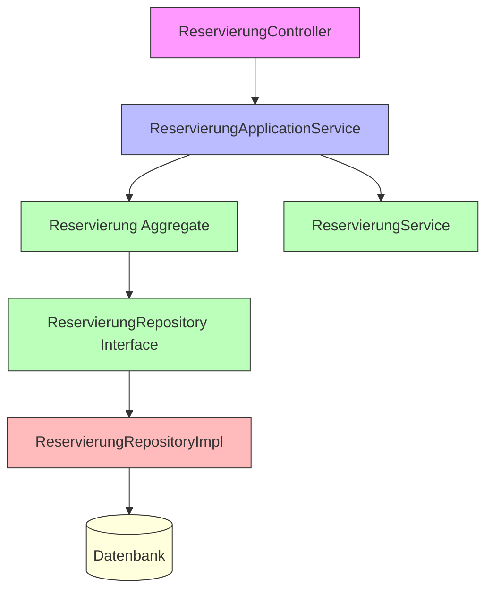
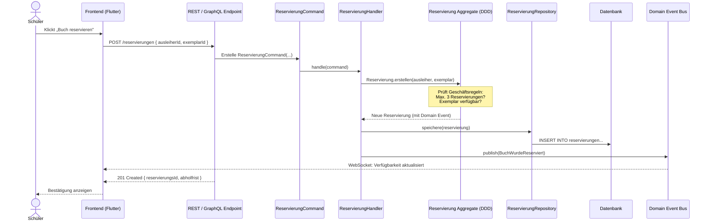
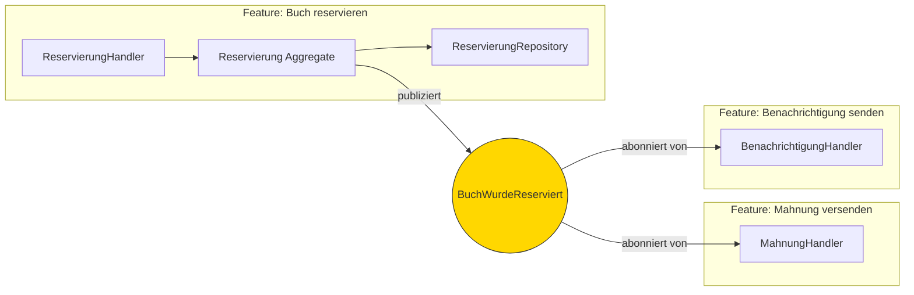
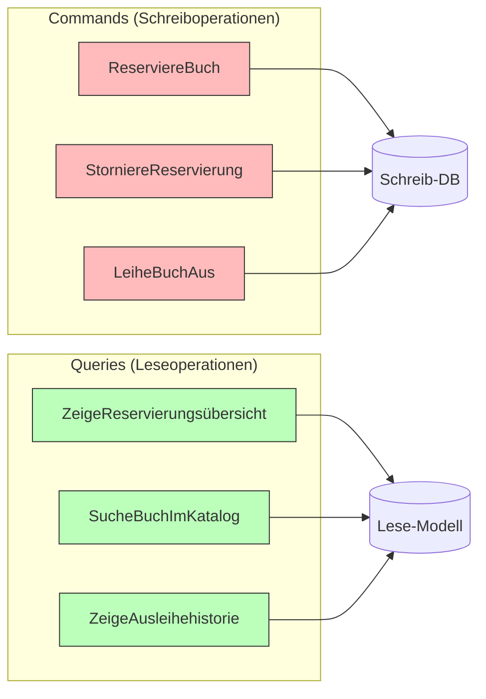
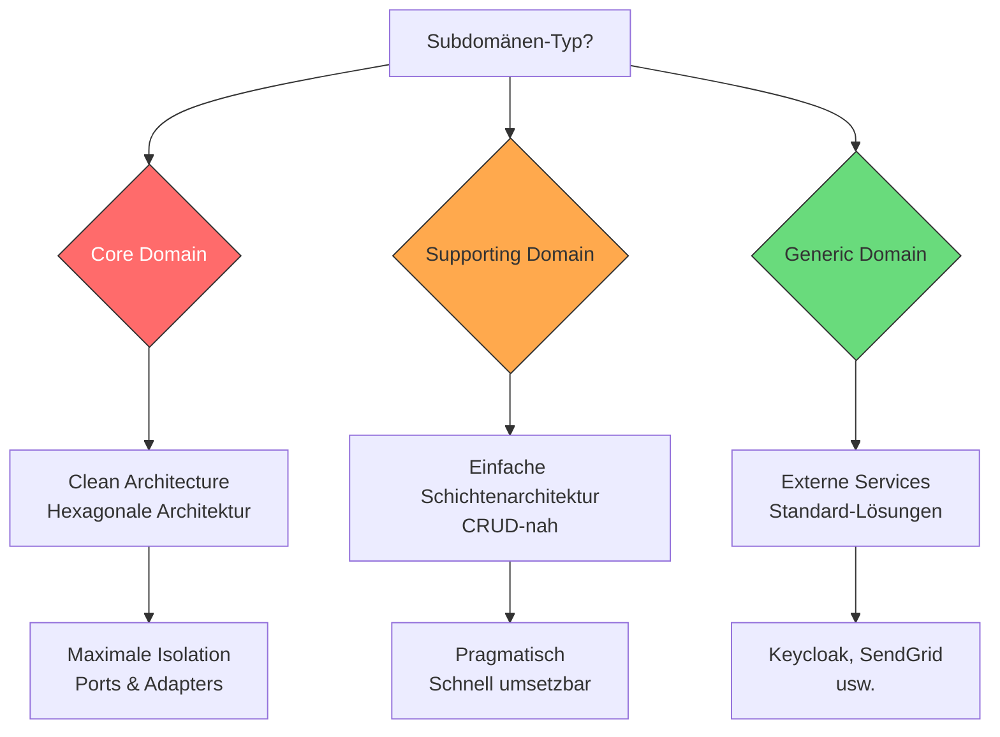
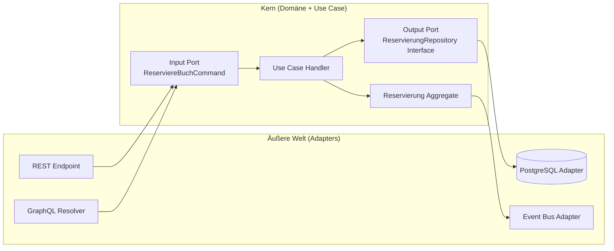
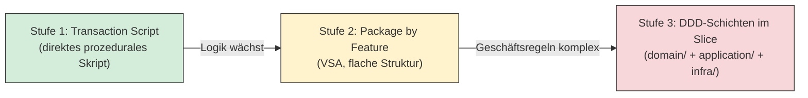
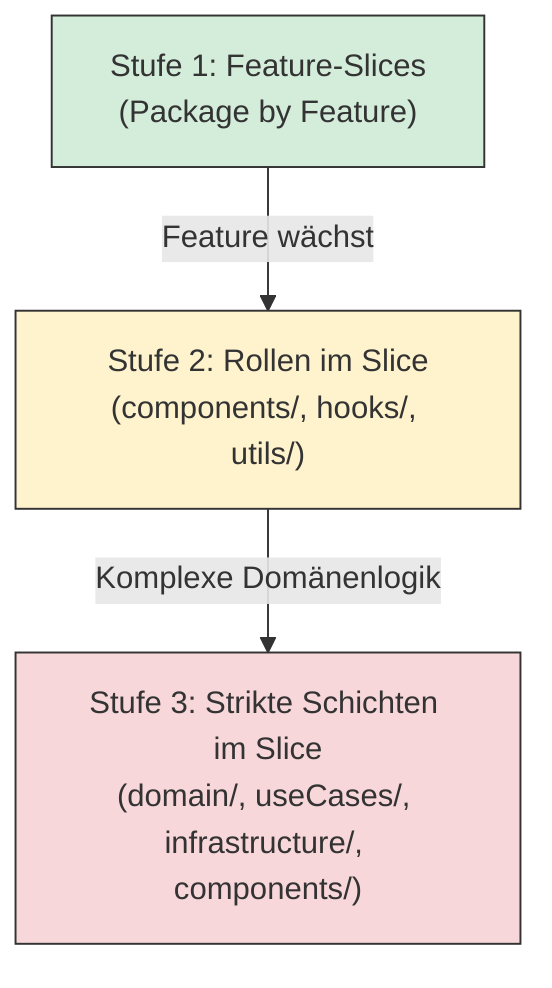
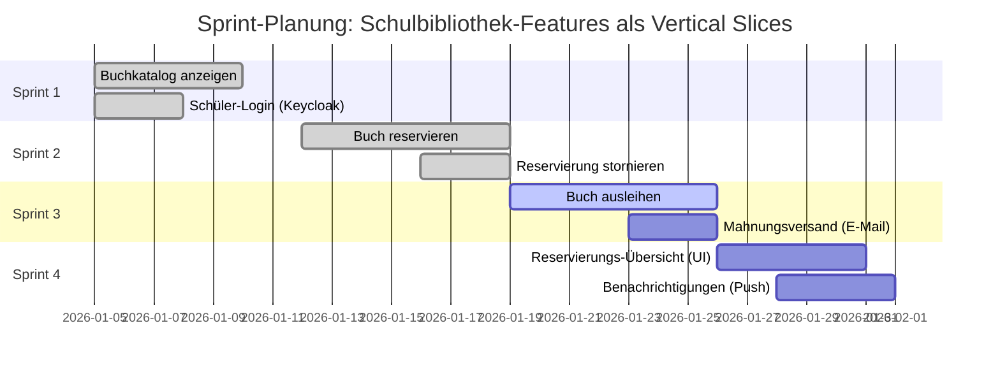
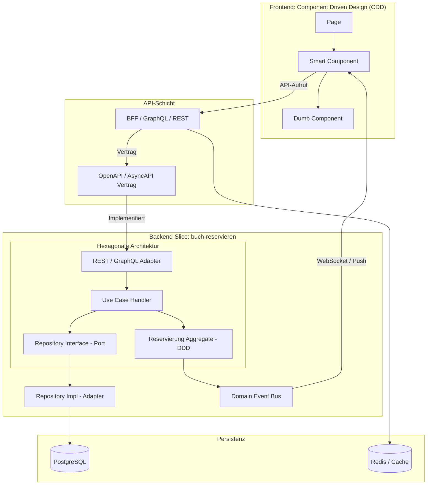

# 6. Vertical Slice Architektur – Alles zusammenführen

*Eine modulare Architektur ist nur dann wirklich agil, wenn auch die Code-Organisation Änderungen an einem Feature ermöglicht, ohne dabei andere Features zu berühren. Genau hier setzt die Vertical Slice Architektur an.*

Stellen Sie sich ein Hochhaus vor, bei dem alle Elektroleitungen auf einem Stockwerk gebündelt sind, alle Wasserleitungen auf einem anderen und alle Heizungsrohre auf einem dritten. Will ein Mieter sein Apartment renovieren, müssen Handwerker auf *jedem* dieser Stockwerke arbeiten – egal wie klein die eigentliche Änderung ist. Das ist mühsam, teuer und fehleranfällig.

Die **Vertical Slice Architektur** dreht dieses Prinzip um: Alles, was zu einem Feature gehört – von der Datenbankabfrage über die Geschäftslogik bis zur API-Schnittstelle und zur UI-Komponente – liegt *an einem Ort* zusammen. Eine Änderung am Feature „Buch reservieren" berührt nur den Code dieses einen Features.

---

## 6.1 Das Problem klassischer Schichtenarchitektur

*Horizontale Schichten fördern technische Trennung – aber behindern fachliche Unabhängigkeit.*

### Was ist Schichtenarchitektur?

Die klassische **Schichtenarchitektur** (Layered Architecture) ist seit Jahrzehnten der Standard. Das System wird in horizontale Schichten unterteilt, wobei jede Schicht nur mit der direkt darunterliegenden kommunizieren darf:

```
┌──────────────────────────────────────────────────┐
│  Präsentationsschicht   (Controller, REST-Endpkt) │
├──────────────────────────────────────────────────┤
│  Anwendungsschicht      (Application Services)   │
├──────────────────────────────────────────────────┤
│  Domänenschicht         (Entities, Aggregates)   │
├──────────────────────────────────────────────────┤
│  Datenzugriffschicht    (Repositories, ORM)      │
├──────────────────────────────────────────────────┤
│  Datenbank              (PostgreSQL, etc.)       │
└──────────────────────────────────────────────────┘
```

**Technische Vorteile:** Diese Trennung hat historisch Gutes bewirkt – sie verhindert, dass UI-Code direkt auf die Datenbank zugreift, und erzwingt eine gewisse Ordnung.

### Das Problem wächst mit der Komplexität

Sobald das System mehr als eine Handvoll Features enthält, offenbart die Schichtenarchitektur ihre Schwächen:

- **Änderungen berühren jede Schicht:** Wird das Feature „Buch reservieren" angepasst, müssen Dateien in *jeder* Schicht angefasst werden – der Controller, der Application Service, das Aggregate, das Repository und möglicherweise das Datenbankschema.
- **Kopplung über Schichtgrenzen:** Features werden über horizontale Schichten hinweg zu einem unüberschaubaren Geflecht verwoben. Eine Änderung an der `Ausleihe` bricht plötzlich die `Vormerkung`.
- **Teams werden nach Technologie organisiert:** Backend-Team, Frontend-Team, DBA-Team – statt nach Fachfunktionen. Für ein einziges Feature müssen mehrere Teams koordiniert werden.
- **`Feature-Envy`:** Klassen wissen zu viel über andere Klassen. Ein `ReservierungService` greift auf `AusleiheRepository` zu, weil Schichten geteilt werden.

> <span style="font-size: 1.5em">:warning:</span> **Achtung:** Das klassische Schichtenarchitektur-Modell lädt dazu ein, generische, domänenübergreifende Klassen wie `GenericService` oder `BaseRepository` zu bauen. Das klingt nach Wiederverwendung, führt aber zu verborgenem, schwer testbarem Code.

### Anschauliches Gegenbeispiel: „Buch reservieren" in der Schichtenarchitektur

Nehmen wir den simplen Use Case „Ein Schüler reserviert ein Buch". In einer klassischen Schichtenarchitektur würde die Implementierung so aussehen:

```
src/
├── presentation/
│   └── ReservierungController.java      ← Änderung A
├── application/
│   └── ReservierungApplicationService.java  ← Änderung B
├── domain/
│   ├── Reservierung.java                ← Änderung C
│   ├── ReservierungService.java         ← Änderung D
│   └── ReservierungRepository.java      ← Änderung E (Interface)
├── infrastructure/
│   └── ReservierungRepositoryImpl.java  ← Änderung F
└── database/
    └── V3__add_reservierung_table.sql   ← Änderung G
```

**7 Dateien in 6 verschiedenen Verzeichnissen** für ein einziges Feature – das ist das Problem.



*Jede Farbe steht für eine andere Schicht. Alle müssen angefasst werden, obwohl es sich um ein einziges Feature handelt.*

> <span style="font-size: 1.5em">:bulb:</span> **Merksatz:** Je mehr Features ein System hat, desto unüberschaubarer wird eine rein schichtenbasierte Struktur. Der Code wächst in die Breite – Features wachsen in die Tiefe.

*Die Vertical Slice Architektur kehrt dieses Prinzip um: Statt horizontaler Schichten denken wir in vertikalen Schnitten durch das System.*

---

## 6.2 Feature-basierte Code-Organisation mit Vertical Slices

*Vertical Slices organisieren Code nach Geschäftsfunktionen – jedes Feature ist ein in sich geschlossener Schnitt durch alle Schichten.*

### Das Kernprinzip: Ein Feature – Ein Ordner

Bei der Vertical Slice Architektur ist das oberste Organisationsprinzip nicht die *Technik*, sondern das *Feature*. Jeder „Schnitt" (Slice) enthält alles, was zu einem bestimmten Geschäftsvorfall gehört:

```
src/
├── features/
│   ├── buch-reservieren/         ← Ein vollständiger Vertical Slice
│   │   ├── ReservierungCommand.java
│   │   ├── ReservierungHandler.java
│   │   ├── ReservierungEndpoint.java
│   │   ├── ReservierungRepository.java
│   │   └── ReservierungView.dart   (Frontend-Komponente)
│   │
│   ├── reservierung-stornieren/  ← Eigener, unabhängiger Slice
│   │   ├── StornierungCommand.java
│   │   ├── StornierungHandler.java
│   │   └── ...
│   │
│   └── buchkatalog-anzeigen/     ← Weiterer Slice
│       └── ...
│
└── shared/                       ← Nur wirklich Gemeinsames
    ├── domain/
    │   └── Buch.java             (geteilt, weil mehrere Slices ein Buch kennen)
    └── infrastructure/
        └── DatabaseConfig.java
```

**Was sich ändert:** Man sucht nicht mehr nach einer Datei in einer Schicht, sondern navigiert direkt zum Feature-Ordner. Alles Relevante liegt beieinander.

### Anschauliches Beispiel: „Buch reservieren" als Vertical Slice

Betrachten wir den vollständigen Weg eines Requests durch das System:



**Der gesamte Fluss liegt im Ordner `features/buch-reservieren/`.** Kein anderer Feature-Ordner wird berührt.

### Kommunikation zwischen Slices: Nur über definierte Schnittstellen

Slices sind keine Inseln – sie können miteinander interagieren. Aber die Regel ist klar: **Kein direkter Zugriff auf den Code eines anderen Slices.** Die Kommunikation erfolgt ausschließlich über:

1. **Domain Events:** Der Slice `buch-reservieren` publiziert `BuchWurdeReserviert`. Der Slice `mahnung-versenden` abonniert dieses Event – ohne den Reservierungs-Code zu kennen.
2. **Öffentliche API-Endpunkte:** Ein Slice ruft den REST- oder GraphQL-Endpunkt eines anderen Slices auf.
3. **Geteilter Shared-Kernel:** Wirklich gemeinsame Dinge (z. B. die `Buch`-Entität) landen im `shared/`-Ordner.



> <span style="font-size: 1.5em">:mag:</span> **Vertiefung:** Das Muster, bei dem ein Command direkt von einem Handler verarbeitet wird, ist bekannt als das **CQRS-Mediator-Pattern** (z. B. mit der `MediatR`-Bibliothek in .NET oder einem äquivalenten Ansatz in Java/Dart). Der Handler ist der gesamte Use-Case – er koordiniert Domäne, Repository und Event-Publikation.

### CQRS als natürlicher Effekt der Vertical Slice Architektur

Ein bemerkenswerter Nebeneffekt von VSA ist, dass **CQRS** (*Command Query Responsibility Segregation*) quasi automatisch entsteht. Da jeder Slice genau einen Use Case abbildet, ist er typischerweise entweder:

- ein **Command** (verändert den Zustand): z. B. `ReserviereBuch`, `StorniereReservierung`, `LeiheBuchAus`
- eine **Query** (liest Daten): z. B. `ZeigeReservierungsübersicht`, `SucheBuchImKatalog`



> <span style="font-size: 1.5em">:bulb:</span> **Merksatz:** CQRS entsteht bei VSA „von selbst" – weil jeder Slice entweder schreibt oder liest, nie beides. Das macht Lese- und Schreib-Optimierungen unabhängig voneinander möglich.

### Das Mediator-Pattern: Schlanke API-Schicht

In der Praxis wird der Übergang vom API-Endpunkt zum Feature-Handler über das **Mediator-Pattern** entkoppelt. Der API-Controller ist damit nur noch ein dünner Adapter – er nimmt den HTTP-Request entgegen, baut ein Command-Objekt und übergibt es dem Mediator:

```java
// Schlanker Controller: Keine Geschäftslogik, nur Weiterleitung
@RestController
public class ReservierungController {

    private final Mediator mediator;

    @PostMapping("/reservierungen")
    public ResponseEntity<ReservierungResponse> reserviere(
            @RequestBody @Valid ReservierungRequest request) {

        // Command erstellen und an Mediator übergeben
        var command = new ReserviereBuchCommand(
            request.ausleiherId(),
            request.exemplarId()
        );

        // Mediator findet den passenden Handler automatisch
        ReservierungResponse result = mediator.send(command);
        return ResponseEntity.status(201).body(result);
    }
}
```

Ein weiterer Vorteil: **Querschnittsfunktionen** (Validierung, Logging, Autorisierung) können transparent als Middleware in die Mediator-Pipeline eingehängt werden:

```
HTTP Request
    → Controller (dünner Adapter)
    → Mediator-Pipeline
        → Validierungs-Middleware (Bean Validation / FluentValidation)
        → Logging-Middleware
        → Autorisierungs-Middleware
    → Feature-Handler (die eigentliche Geschäftslogik)
    → HTTP Response
```

> <span style="font-size: 1.5em">:mag:</span> **Vertiefung:** In .NET-Projekten ist `MediatR` die verbreitetste Umsetzung (entwickelt von Jimmy Bogard, dem Erfinder der VSA). In Java/Spring-Boot werden äquivalente Mediator-Implementierungen eingesetzt. Das Muster ist sprachunabhängig.

### Geteilte Querschnittsfunktionen (Shared Concerns)

Da VSA eine Code-Duplizierung riskiert, wenn jeder Slice dieselbe Validierungslogik neu implementiert, gibt es bewährte Muster für **Shared Services**:

| Querschnittsfunktion | Lösung |
|:---|:---|
| **Eingabevalidierung** | Zentrale Validierungs-Middleware in der Mediator-Pipeline |
| **Authentifizierung** | Security-Filter / Middleware vor der Mediator-Pipeline |
| **Logging & Tracing** | Logging-Behaviour als Mediator-Middleware |
| **Fehlerbehandlung** | Globaler Exception-Handler (z. B. `@ControllerAdvice` in Spring) |
| **Gemeinsame Domänenobjekte** | `shared/domain/`-Ordner (nur echte Cross-Cutting-Konzepte) |

> <span style="font-size: 1.5em">:warning:</span> **Achtung:** Der `shared/`-Ordner ist eine Ausnahme, keine Regel. Landet zu viel Code dort, entstehen wieder die Probleme der klassischen Schichtenarchitektur. Nur was wirklich von **mehreren** Slices gebraucht wird, gehört in `shared/`.

### Vorteile der Vertical Slice Architektur

| Eigenschaft | Schichtenarchitektur | Vertical Slices |
|:---|:---|:---|
| **Code-Suche** | Über mehrere Schicht-Ordner verteilt | Alles in einem Feature-Ordner |
| **Änderungsaufwand** | Alle Schichten müssen angefasst werden | Nur ein Slice wird berührt |
| **Test-Isolation** | Schichten müssen einzeln gemockt werden | Ein Slice kann als Einheit getestet werden |
| **Team-Organisation** | Teams nach Technologie (Frontend/Backend/DB) | Teams nach Feature (Feature-Teams) |
| **Neue Features** | Schichten werden immer fetter | Neuer Ordner, keine bestehenden Dateien berührt |
| **Deployment** | Gesamtsystem neu deployen | Einzelne Slices unabhängig deploybar (Microservices) |

> <span style="font-size: 1.5em">:bulb:</span> **Merksatz:** Ein Feature kann entwickelt, getestet und deployt werden, ohne andere Features zu berühren – das ist der eigentliche Kern der Agilität.

*Nicht jeder Feature-Slice ist gleich komplex. Die Architektur innerhalb eines Slices sollte sich am Typ der Domäne orientieren.*

---

## 6.3 Architekturwahl nach Domänen-Typ

*Nicht jeder Teil eines Systems ist gleich komplex – die Architektur innerhalb eines Slices sollte dem Rechnung tragen.*

### Das DDD-Subdomänen-Modell als Entscheidungsgrundlage

Domain-Driven Design unterscheidet drei Typen von Subdomänen (vgl. Kapitel 2.2). Diese Einteilung ist nicht nur strategisch – sie hat direkte Auswirkungen darauf, wie viel Architektur-Aufwand ein Slice benötigt:



### Core Domain: Clean Architecture / Hexagonale Architektur

Die **Core Domain** ist der Teil, der das Unternehmen von der Konkurrenz unterscheidet – hier steckt das einzigartige Fach-Know-how. Bei einer Schulbibliothek ist das z. B. das **Reservierungs- und Ausleihe-System** mit seinen spezifischen Regeln.

Für diese Slices lohnt sich maximale Isolation der Domänenlogik:

```
features/buch-reservieren/
├── domain/                           ← Reine Domänenlogik (keine Framework-Abhängigkeiten)
│   ├── Reservierung.java             (Aggregate Root)
│   ├── ReservierungsId.java          (Value Object)
│   ├── Abholfrist.java               (Value Object)
│   └── BuchWurdeReserviertEvent.java (Domain Event)
│
├── application/                      ← Use-Case-Koordination
│   ├── ReserviereBuchCommand.java    (Input-Port)
│   ├── ReserviereBuchHandler.java    (Use Case)
│   └── ReservierungRepository.java  (Output-Port / Interface)
│
└── infrastructure/                   ← Technische Adapter
    ├── ReservierungRepositoryImpl.java   (Datenbank-Adapter)
    └── ReservierungEndpoint.java         (REST-Adapter)
```

**Das Prinzip (Hexagonale Architektur / Ports & Adapters):** Die Domänenlogik kennt weder Spring, noch PostgreSQL, noch HTTP. Sie ist von der Außenwelt isoliert. Frameworks und Datenbanken sind **austauschbar** – sie sind Adapter, die an die Domäne andocken.



### Supporting Domain: Einfachere Schichtenarchitektur

Die **Supporting Domain** enthält notwendige, aber nicht einzigartige Fachfunktionen. Für die Schulbibliothek wäre das z. B. die Buchkatalog-Verwaltung oder das Nutzerprofilmanagement.

Hier ist weniger Architekturaufwand gerechtfertigt. Ein einfacher, direkt strukturierter Slice genügt:

```
features/buchkatalog-anzeigen/
├── BuchkatalogController.java
├── BuchkatalogService.java
└── BuchkatalogRepository.java
```

Keine expliziten Ports, kein separates Domänenobjekt – direkte, schnell umsetzbare Implementierung.

### Generic Domain: Externe Services & Standardlösungen

Die **Generic Domain** enthält Querschnittsfunktionen, die für viele Systeme gleich sind. Es macht keinen Sinn, diese selbst zu entwickeln:

| Funktion | Externe Lösung |
|:---|:---|
| Authentifizierung & Autorisierung | Keycloak, Auth0 |
| E-Mail-Versand | SendGrid, Mailgun |
| Push-Benachrichtigungen | Firebase Cloud Messaging |
| PDF-Generierung | iText, PDFKit |
| Volltextsuche | Elasticsearch, Algolia |

Diese Services werden über dünne **Adapter-Klassen** in das System eingebunden – sie erscheinen als Randkomponenten, nicht als Kernlogik.

### Praxisbeispiel: Architekturentscheidung für „Buch reservieren"

```
Domänentyp:     Core Domain
Begründung:     Spezifische Schulregeln (max. 3 Reservierungen pro Schüler,
                Abholfrist 7 Werktage, Stornierung bis 24h vor Abholfrist)

→ Architektur:  Hexagonale Architektur innerhalb des Slices
→ Aufwand:      Hoch (explizite Ports, isolierte Domäne, ausführliche Tests)
→ Vorteil:      Regeln können geändert werden, ohne Infrastructure anzupassen
```

> <span style="font-size: 1.5em">:warning:</span> **Achtung:** Es ist ein häufiger Fehler, *alles* mit der aufwändigsten Architektur (Clean Architecture) umzusetzen. Die Kunst liegt darin, die richtige Architektur für den richtigen Domänentyp zu wählen – und damit Aufwand und Nutzen in Balance zu halten.

### Der graduelle Ansatz: Architektur wächst mit der Komplexität

Ein weiterer häufiger Fehler ist, von Beginn an *alle* Slices mit der vollständigen Clean Architecture umzusetzen. Das führt zu einer **„Dateien-Explosion"** – einfache Features werden unnötig komplex.

Der bewährte **graduelle Ansatz** sieht so aus:



**Stufe 1 – Transaction Script (einfacher Start):**
Beginne mit einem simplen, prozeduralen Handler. Kein Domain-Aggregate, keine expliziten Ports:

```java
// Einfacher Start – kein Over-Engineering
public class ReserviereBuchHandler {
    public ReservierungResponse handle(ReserviereBuchCommand cmd) {
        int anzahl = reservierungRepo.countAktiveByAusleiher(cmd.ausleiherId());
        if (anzahl >= 3) throw new ReservierungslimitException();

        var reservierung = new Reservierung(cmd.ausleiherId(), cmd.exemplarId());
        reservierungRepo.save(reservierung);
        return new ReservierungResponse(reservierung.getId());
    }
}
```

**Stufe 3 – „Push Logic Down" (wenn Komplexität wächst):**
Wenn Geschäftsregeln wachsen, wird die Logik in ein echtes Domain-Aggregate verschoben:

```java
// Logik wird in das Aggregate "hinuntergedrückt" (Push Logic Down)
public class Reservierung {
    public static Reservierung erstellen(
            AusleiherId ausleiherId,
            ExemplarId exemplarId,
            ReservierungsRegel regel,
            List<Reservierung> aktiveReservierungen) {

        regel.prüfe(aktiveReservierungen);   // Regeln im Aggregate, nicht im Handler
        return new Reservierung(/*...*/);
    }
}
```

> <span style="font-size: 1.5em">:bulb:</span> **Merksatz:** Beginne einfach (Transaction Script). Wenn die Geschäftslogik wächst, drücke die Regeln in ein Domain-Aggregate hinunter. Dieser inkrementelle Ansatz vermeidet Over-Engineering am Anfang und ermöglicht trotzdem saubere Architektur bei echtem Bedarf.

---

## 6.4 VSA und CDD im Frontend: Drei Ebenen der Organisation

*Die Vertical Slice Architektur endet nicht am Backend. Sie erstreckt sich bis in die Frontend-Komponenten – und harmoniert dabei perfekt mit Component Driven Design (CDD).*

### Warum VSA auch im Frontend Sinn ergibt

Ein vertikaler Slice durchschneidet das gesamte System – von der Datenbank bis zur Benutzeroberfläche. Das bedeutet: Auch der Frontend-Code für ein Feature gehört logisch zusammen. Statt den Code nach technischen Schichten zu sortieren (`components/`, `hooks/`, `services/`), sortieren wir nach Features (`features/cart/`, `features/reservation/`).

### Die drei Stufen der Frontend-Organisation mit VSA + CDD



**Stufe 1 – Feature-Slices (Package by Feature):**

Der Frontend-Code wird nach Geschäftsfällen gruppiert. Jeder Feature-Ordner hat eine `index.ts`-Datei als definierte öffentliche Schnittstelle (*Barrel Export*):

```
src/
├── features/
│   ├── buch-reservieren/
│   │   ├── index.ts              ← Öffentliche Schnittstelle des Slices
│   │   ├── BuchReservierenPage.dart
│   │   └── reservierung_api.dart
│   ├── buchkatalog/
│   │   └── BuchkatalogPage.dart
│   └── ausleihe/
│       └── ...
```

**Stufe 2 – Rollen innerhalb des Slices:**

Wenn ein Feature wächst, werden die Dateien im Feature-Ordner nach Rollen sortiert. CDD-Komponenten erhalten ihren eigenen Unterordner:

```
features/buch-reservieren/
├── components/              ← CDD: Isolierte, wiederverwendbare UI-Bausteine
│   ├── ReservierungsFormular.dart   (Dumb Component)
│   ├── AbholfristAnzeige.dart       (Dumb Component)
│   └── ReservierungsBestaetigung.dart
├── hooks/                   ← Flutter/React-Logik-Brücke
│   └── use_reservierung.dart
├── utils/                   ← Hilfsfunktionen
│   └── validierung.dart
└── BuchReservierenPage.dart ← Smart Component (orchestriert alles)
```

**Stufe 3 – Strikte Schichten im Slice (für komplexe Features):**

Bei hoher Domänen-Komplexität im Frontend wird Clean Architecture *innerhalb* des Slices angewandt:

```
features/buch-reservieren/
├── domain/              ← Reine Geschäftslogik (unabhängig von Flutter/React)
│   ├── Reservierung.dart
│   └── ReservierungsRegel.dart  (pure functions)
├── use_cases/           ← Anwendungsfälle / Orchestrierung
│   └── reserviere_buch_use_case.dart
├── infrastructure/      ← API-Aufrufe, externe Services
│   └── reservierung_api.dart
├── hooks/               ← Brücke zum Framework (Flutter/React State)
│   └── use_reservierung.dart
└── components/          ← Reine UI-Bausteine (CDD – Dumb Components)
    ├── ReservierungsFormular.dart
    └── AbholfristAnzeige.dart
```

**Das Wichtigste:** UI-Komponenten (`components/`) dürfen **niemals** direkt auf `infrastructure/` zugreifen. Sie sind *Dumb Components* – sie zeigen Daten an und melden Benutzerinteraktionen, ohne zu wissen, woher die Daten kommen.

> <span style="font-size: 1.5em">:bulb:</span> **Merksatz:** Im Frontend gilt dieselbe Regel wie im Backend: Beginne mit Stufe 1 (flache Feature-Ordner). Füge Komplexität (Stufe 2, 3) nur dort hinzu, wo die Domänenlogik im Frontend wirklich komplex wird.

---

## 6.5 Vertical Slices & AI-Assisted Development

*Die Kombination aus Vertical Slices, DDD und CDD ist besonders leistungsstark, wenn KI-Werkzeuge wie GitHub Copilot in die Entwicklung eingebunden werden.*

### Warum KI und Vertical Slices gut zusammenpassen

KI-Assistenten wie GitHub Copilot oder ähnliche Werkzeuge generieren Code auf Basis des Kontexts, den sie „sehen" können. Ihr Kontext ist begrenzt – in der Regel auf die aktuelle Datei und die unmittelbare Umgebung. Eine gute Architektur hilft der KI dabei, relevanten und korrekten Code zu erzeugen.

Vertical Slices bieten dafür ideale Voraussetzungen:

| Architektur-Eigenschaft | Vorteil für KI-Assistenten |
|:---|:---|
| **Alles in einem Ordner** | Die KI sieht den gesamten Kontext eines Features, ohne zwischen Schichten zu navigieren |
| **Ubiquitous Language** | Klare, fachliche Bezeichner helfen der KI, den Zweck von Klassen und Methoden zu erkennen |
| **Definierte API-Verträge** | Die KI kann Code generieren, der den OpenAPI / GraphQL-Verträgen entspricht, ohne das Gesamtsystem zu kennen |
| **Kleine, fokussierte Klassen** | Kürzere Klassen liegen vollständig im Kontext-Fenster der KI |
| **Explizite Ports (Interfaces)** | Die KI weiß genau, welche Methoden ein Adapter implementieren muss |

### Praxisbeispiel: KI-unterstützte Implementierung von „Buch reservieren"

Der typische Arbeitsablauf sieht so aus:

**Schritt 1 – API-Vertrag zuerst (API-First)**

Der Entwickler erstellt die OpenAPI-Spezifikation für den Endpunkt `POST /reservierungen`. Die KI hilft dabei, die Felder zu vervollständigen und Fehlerfälle zu definieren.

```yaml
# Vom Entwickler gestartet, von der KI vervollständigt:
paths:
  /reservierungen:
    post:
      summary: Buch reservieren
      requestBody:
        content:
          application/json:
            schema:
              type: object
              required: [ausleiherId, exemplarId]
              properties:
                ausleiherId:
                  type: string
                  format: uuid
                  description: ID des reservierenden Schülers
                exemplarId:
                  type: string
                  format: uuid
                  description: ID des zu reservierenden Buchexemplars
      responses:
        '201':
          description: Reservierung erfolgreich angelegt
        '422':
          description: Geschäftsregel verletzt (Max. 3 Reservierungen, kein Exemplar verfügbar)
```

**Schritt 2 – Domain-Aggregate implementieren**

Mit der Ubiquitous Language und dem klaren Kontextordner kann die KI das Aggregate vorschlagen:

```java
// features/buch-reservieren/domain/Reservierung.java
// GitHub Copilot generiert auf Basis der Ubiquitous Language:

public class Reservierung {

    private final ReservierungsId id;
    private final AusleiherId ausleiherId;
    private final ExemplarId exemplarId;
    private final Abholfrist abholfrist;
    private ReservierungsStatus status;

    // Factory-Methode enthält die Geschäftsregeln
    public static Reservierung erstellen(
            AusleiherId ausleiherId,
            ExemplarId exemplarId,
            List<Reservierung> aktivReservierungen) {

        // Geschäftsregel: max. 3 aktive Reservierungen pro Schüler
        if (aktivReservierungen.size() >= 3) {
            throw new ReservierungslimitErreichtException(ausleiherId);
        }

        Abholfrist frist = Abholfrist.inWerktagen(7);

        return new Reservierung(
            ReservierungsId.neu(),
            ausleiherId,
            exemplarId,
            frist,
            ReservierungsStatus.AKTIV
        );
    }

    // Domain Event: Signalisiert dem Rest des Systems, was passiert ist
    public BuchWurdeReserviertEvent toEvent() {
        return new BuchWurdeReserviertEvent(this.id, this.exemplarId, this.abholfrist);
    }
}
```

**Schritt 3 – Flutter-Frontend-Komponente (Smart + Dumb)**

Auf der Frontend-Seite generiert die KI auf Basis des GraphQL-Schemas eine passende CDD-Komponente:

```dart
// features/buch_reservieren/presentation/buch_reservieren_page.dart
// Smart Component: kennt die API, verwaltet den State

class BuchReservierenPage extends StatefulWidget {
  final String exemplarId;
  const BuchReservierenPage({required this.exemplarId, super.key});

  @override
  State<BuchReservierenPage> createState() => _BuchReservierenPageState();
}

class _BuchReservierenPageState extends State<BuchReservierenPage> {
  bool _isLoading = false;
  String? _errorMessage;

  Future<void> _onReservierenBestaetigt() async {
    setState(() => _isLoading = true);
    try {
      final result = await ReservierungApi.reserviereBuch(
        exemplarId: widget.exemplarId,
      );
      // Navigiere zur Bestätigungsseite
      if (mounted) {
        Navigator.of(context).push(
          MaterialPageRoute(
            builder: (_) => ReservierungBestaetigung(
              reservierungsId: result.reservierungsId,
              abholfrist: result.abholfrist,
            ),
          ),
        );
      }
    } on ReservierungslimitException {
      setState(() => _errorMessage = 'Maximale Anzahl an Reservierungen erreicht.');
    } finally {
      setState(() => _isLoading = false);
    }
  }

  @override
  Widget build(BuildContext context) {
    // Dumb Component: kennt die API NICHT, zeigt nur Daten an
    return ReservierungsFormular(
      isLoading: _isLoading,
      errorMessage: _errorMessage,
      onBestaetigt: _onReservierenBestaetigt,
    );
  }
}
```

### Iterative Sprint-Entwicklung mit Vertical Slices

Vertical Slices passen ideal zum agilen Sprint-Rhythmus: Jeder Sprint liefert mindestens einen vollständigen, testbaren Slice. Das Gesamtsystem wächst Feature für Feature – und bleibt dabei stets in einem deploymentfähigen Zustand.



**Was jeder Slice enthält (Definition of Done pro Slice):**
- [ ] Domänenmodell mit Geschäftsregeln implementiert
- [ ] API-Endpunkt gemäß OpenAPI/GraphQL-Vertrag implementiert
- [ ] Repository mit Datenbank-Adapter implementiert
- [ ] Frontend-Komponente (Smart + Dumb) implementiert
- [ ] Unit-Tests für das Aggregate (Geschäftsregeln)
- [ ] Integrations-Test für den gesamten Slice (End-to-End)

> <span style="font-size: 1.5em">:bulb:</span> **Merksatz:** Vertical Slices + DDD + CDD + API-First = ein System, das sowohl für Menschen als auch für KI-Assistenten verständlich, erweiterbar und testbar ist.

---

## Zusammenfassung: Das große Bild

*Alle bisher gelernten Konzepte greifen ineinandergreifen – in einem vollständig integrierten Architekturmodell.*



Die Tabelle fasst zusammen, welches Konzept welche Verantwortung trägt:

| Architektur-Baustein | Verantwortung | Kapitel |
|:---|:---|:---|
| **DDD (Bounded Context)** | Fachliche Grenzen des Backends | Kap. 2 |
| **DDD (Aggregate)** | Kapselt Geschäftsregeln | Kap. 2.3 |
| **Datenbankdesign** | Persistenz der Aggregates, CQRS-Lesemodelle | Kap. 3 |
| **CDD (Atomic Design)** | Modulare, wiederverwendbare UI | Kap. 4.2 |
| **CDD (Smart/Dumb)** | Trennung von Logik und Darstellung | Kap. 4.3 |
| **API-Vertrag (OpenAPI)** | Stabile Schnittstelle Frontend ↔ Backend | Kap. 5.2 |
| **BFF-Pattern** | Frontend-freundliche Datenaggregation | Kap. 5.3 |
| **Vertical Slice** | Feature-basierte Code-Organisation | Kap. 6.2 |
| **CQRS + Mediator** | Trennung von Commands und Queries, schlanke API-Schicht | Kap. 6.2 |
| **Shared Concerns** | Querschnittsfunktionen über Middleware / Shared-Kernel | Kap. 6.2 |
| **Hexagonale Architektur** | Isolation der Core Domain | Kap. 6.3 |
| **Gradueller Ansatz** | Architektur wächst mit der Komplexität (Transaction Script → DDD) | Kap. 6.3 |
| **VSA im Frontend (3 Stufen)** | Feature-orientierte CDD-Organisation (Package by Feature) | Kap. 6.4 |

> <span style="font-size: 1.5em">:mag:</span> **Vertiefung:** Die in diesem Skript beschriebene Architektur ist kein starres Regelwerk, sondern ein Werkzeugkasten. In realen Projekten werden diese Muster kombiniert, angepasst und pragmatisch eingesetzt – immer mit dem Ziel, ein System zu schaffen, das die fachlichen Anforderungen optimal erfüllt und langfristig wartbar bleibt.

---

***
Quellen

- [Vertical Slice Architecture – Jimmy Bogard](https://jimmybogard.com/vertical-slice-architecture/)
- [Hexagonal Architecture – Alistair Cockburn](https://alistair.cockburn.us/hexagonal-architecture/)
- [Clean Architecture – Robert C. Martin (Uncle Bob)](https://blog.cleancoder.com/uncle-bob/2012/08/13/the-Clean-Architecture.html)
- [Atomic Design – Brad Frost](https://atomicdesign.bradfrost.com/)
- [Domain-Driven Design Reference – Eric Evans](https://www.domainlanguage.com/ddd/reference/)
- [MediatR – Jimmy Bogard (GitHub)](https://github.com/jbogard/MediatR)
- [Vertical Slice Architecture in Practice – Milan Jovanović](https://www.milanjovanovic.tech/blog/vertical-slice-architecture)
- [Component Driven Development – Storybook Docs](https://storybook.js.org/docs/get-started/whats-a-story)
***
